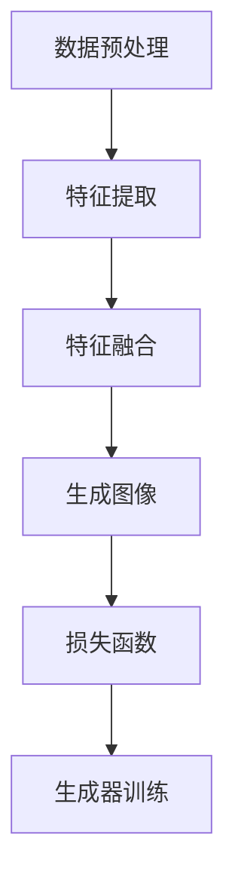

                 

### 1. 背景介绍

#### 1.1 目的和范围

本文旨在探讨基于生成对抗网络（GAN）的图像风格迁移在虚拟现实（VR）中的应用。随着VR技术的不断发展和普及，图像风格迁移技术逐渐成为实现更逼真、更吸引人的虚拟环境的关键技术之一。本文将详细分析GAN的基本原理和图像风格迁移的方法，并探讨其在VR中的应用潜力。

#### 1.2 预期读者

本文适合对图像处理、深度学习和虚拟现实技术有一定了解的读者。包括但不限于：
- 图像处理和计算机视觉工程师
- 深度学习和人工智能研究人员
- 虚拟现实技术开发者
- 对GAN和图像风格迁移技术感兴趣的技术爱好者

#### 1.3 文档结构概述

本文将按照以下结构展开：
1. 引言：介绍文章的主题和目的。
2. 核心概念与联系：介绍GAN的基本概念和图像风格迁移的相关知识。
3. 核心算法原理 & 具体操作步骤：详细讲解GAN和图像风格迁移的算法原理和操作步骤。
4. 数学模型和公式 & 详细讲解 & 举例说明：阐述相关的数学模型和公式，并通过具体例子进行说明。
5. 项目实战：提供实际代码案例和详细解释。
6. 实际应用场景：探讨GAN图像风格迁移在虚拟现实中的应用。
7. 工具和资源推荐：推荐相关学习资源和开发工具。
8. 总结：对未来发展趋势和挑战进行总结。
9. 附录：常见问题与解答。
10. 扩展阅读 & 参考资料：提供更多相关资料。

#### 1.4 术语表

##### 1.4.1 核心术语定义

- **生成对抗网络（GAN）**：一种深度学习模型，由生成器和判别器组成，用于生成与真实数据分布相似的假数据。
- **图像风格迁移**：将一种图像的样式应用到另一幅图像上，使其具有相同的风格。
- **虚拟现实（VR）**：一种通过计算机生成虚拟环境的技术，使用户能够沉浸在虚拟世界中。

##### 1.4.2 相关概念解释

- **深度学习**：一种人工智能领域的研究方法，通过多层神经网络来学习数据的特征。
- **卷积神经网络（CNN）**：一种用于图像识别和处理的深度学习模型。
- **损失函数**：用于评估模型预测结果与真实结果之间差异的函数。

##### 1.4.3 缩略词列表

- GAN：生成对抗网络（Generative Adversarial Networks）
- CNN：卷积神经网络（Convolutional Neural Networks）
- VR：虚拟现实（Virtual Reality）
- DCGAN：深度卷积生成对抗网络（Deep Convolutional GAN）

### 1.5 核心概念与联系

#### 1.5.1 GAN的基本原理

生成对抗网络（GAN）由伊恩·古德费洛（Ian Goodfellow）等人在2014年提出。GAN的核心思想是通过一个生成器和判别器的对抗训练来实现数据生成。

- **生成器（Generator）**：生成器是一个神经网络，它接收随机噪声作为输入，并生成与真实数据分布相似的假数据。生成器的目标是使其生成的假数据尽可能接近真实数据。
- **判别器（Discriminator）**：判别器也是一个神经网络，它接收输入数据（真实数据或假数据），并判断输入数据是真实数据还是假数据。判别器的目标是尽可能正确地鉴别真实数据和假数据。
- **对抗训练**：生成器和判别器相互竞争。生成器的目标是生成尽可能逼真的假数据，使得判别器无法区分。判别器的目标是正确区分真实数据和假数据。通过这种对抗训练，生成器逐渐提高其生成能力，判别器逐渐提高其鉴别能力。

#### 1.5.2 图像风格迁移的方法

图像风格迁移是将一种图像的样式应用到另一幅图像上的过程。常见的图像风格迁移方法包括：

- **风格迁移网络**：通过卷积神经网络（CNN）提取图像内容特征和样式特征，并将两者融合到新的图像中。
- **迁移学习**：利用预训练的卷积神经网络提取特征，并将其应用于新的图像风格迁移任务。
- **生成对抗网络（GAN）**：使用GAN生成与目标风格图像相似的生成图像。

#### 1.5.3 GAN在图像风格迁移中的应用

GAN在图像风格迁移中的应用主要通过以下步骤实现：

1. **数据预处理**：将输入图像和目标图像进行预处理，如调整大小、归一化等。
2. **特征提取**：使用卷积神经网络提取输入图像的内容特征和目标图像的样式特征。
3. **特征融合**：将内容特征和样式特征融合到生成器的输入中。
4. **生成图像**：生成器根据融合的特征生成新的图像。
5. **损失函数**：使用损失函数评估生成图像与目标图像的相似度，并指导生成器的训练。

#### 1.5.4 Mermaid流程图

以下是一个简单的Mermaid流程图，展示了GAN在图像风格迁移中的基本流程：



### 1.6 总结

在本节中，我们介绍了本文的研究背景、目的和范围，并定义了相关的核心术语。随后，我们详细分析了GAN的基本原理和图像风格迁移的方法，并展示了GAN在图像风格迁移中的应用流程。这些核心概念和联系将为后续章节中的深入讨论打下基础。

## 2. 核心算法原理 & 具体操作步骤

### 2.1 GAN的基本原理

生成对抗网络（GAN）由生成器和判别器组成，两者通过对抗训练来实现数据生成。以下是对GAN的基本原理和具体操作步骤的详细阐述。

#### 2.1.1 生成器和判别器的定义

- **生成器（Generator）**：生成器是一个神经网络，它接收随机噪声作为输入，并生成与真实数据分布相似的假数据。生成器的目标是使其生成的假数据尽可能接近真实数据。

  ```python
  # 伪代码：生成器
  class Generator(nn.Module):
      def __init__(self):
          super(Generator, self).__init__()
          # 定义生成器的神经网络结构
          
      def forward(self, z):
          # 前向传播，输入噪声z，输出假数据
  ```

- **判别器（Discriminator）**：判别器也是一个神经网络，它接收输入数据（真实数据或假数据），并判断输入数据是真实数据还是假数据。判别器的目标是尽可能正确地鉴别真实数据和假数据。

  ```python
  # 伪代码：判别器
  class Discriminator(nn.Module):
      def __init__(self):
          super(Discriminator, self).__init__()
          # 定义判别器的神经网络结构
  
      def forward(self, x):
          # 前向传播，输入数据x，输出判别结果
  ```

#### 2.1.2 对抗训练的过程

- **随机噪声生成**：生成器首先从噪声分布中生成随机噪声作为输入。
  ```python
  # 伪代码：生成随机噪声
  z = torch.randn(batch_size, z_dim)
  ```
- **生成假数据**：生成器使用随机噪声生成假数据。
  ```python
  # 伪代码：生成假数据
  fake_data = generator(z)
  ```
- **判别器评估**：判别器对生成的假数据和真实数据进行评估。
  ```python
  # 伪代码：判别器评估
  real_data = data_loader.next_batch()
  real_labels = torch.ones(batch_size)
  fake_labels = torch.zeros(batch_size)
  
  real_logits = discriminator(real_data)
  fake_logits = discriminator(fake_data)
  ```
- **损失函数**：使用损失函数计算生成器和判别器的损失。
  ```python
  # 伪代码：计算损失
  generator_loss = criterion(fake_logits, real_labels)
  discriminator_loss = criterion(real_logits, real_labels) + criterion(fake_logits, fake_labels)
  ```
- **反向传播**：通过反向传播更新生成器和判别器的参数。
  ```python
  # 伪代码：反向传播
  generator.zero_grad()
  generator_loss.backward()
  generator.optimizer.step()
  
  discriminator.zero_grad()
  discriminator_loss.backward()
  discriminator.optimizer.step()
  ```

#### 2.1.3 GAN的训练循环

GAN的训练过程包括以下步骤：

1. **初始化**：初始化生成器和判别器的参数。
2. **生成随机噪声**：生成器生成随机噪声作为输入。
3. **生成假数据**：生成器使用随机噪声生成假数据。
4. **评估判别器**：判别器对生成的假数据和真实数据进行评估。
5. **计算损失**：计算生成器和判别器的损失。
6. **更新参数**：通过反向传播更新生成器和判别器的参数。

### 2.2 图像风格迁移的算法原理

图像风格迁移是将一种图像的样式应用到另一幅图像上的过程。常见的图像风格迁移算法包括风格迁移网络、迁移学习和GAN。

#### 2.2.1 风格迁移网络

风格迁移网络通过卷积神经网络提取图像内容特征和样式特征，并将两者融合到新的图像中。以下是一个简化的风格迁移网络的伪代码：

```python
# 伪代码：风格迁移网络
class StyleTransferNet(nn.Module):
    def __init__(self):
        super(StyleTransferNet, self).__init__()
        # 定义网络结构，包括内容特征提取和样式特征提取部分

    def forward(self, content_image, style_image):
        # 前向传播，输入内容图像和样式图像，输出融合后的图像
        content_features = self.content_extractor(content_image)
        style_features = self.style_extractor(style_image)
        fused_features = self.fusion_layer(content_features, style_features)
        output_image = self.output_layer(fused_features)
        return output_image
```

#### 2.2.2 迁移学习

迁移学习利用预训练的卷积神经网络提取特征，并将其应用于新的图像风格迁移任务。以下是一个简化的迁移学习算法的伪代码：

```python
# 伪代码：迁移学习
class TransferLearning(nn.Module):
    def __init__(self, pre_trained_model):
        super(TransferLearning, self).__init__()
        # 使用预训练模型提取特征
        
    def forward(self, content_image, style_image):
        content_features = self.feature_extractor(content_image)
        style_features = self.feature_extractor(style_image)
        fused_features = self.fusion_layer(content_features, style_features)
        output_image = self.output_layer(fused_features)
        return output_image
```

#### 2.2.3 GAN在图像风格迁移中的应用

GAN在图像风格迁移中的应用主要通过以下步骤实现：

1. **特征提取**：使用卷积神经网络提取输入图像的内容特征和目标图像的样式特征。
2. **特征融合**：将内容特征和样式特征融合到生成器的输入中。
3. **生成图像**：生成器根据融合的特征生成新的图像。
4. **损失函数**：使用损失函数评估生成图像与目标图像的相似度，并指导生成器的训练。

以下是一个简化的GAN在图像风格迁移中的应用的伪代码：

```python
# 伪代码：GAN在图像风格迁移中的应用
class StyleTransferGAN(nn.Module):
    def __init__(self):
        super(StyleTransferGAN, self).__init__()
        # 定义生成器和判别器的神经网络结构
        
    def forward(self, content_image, style_image):
        content_features = self.content_extractor(content_image)
        style_features = self.style_extractor(style_image)
        fused_features = self.fusion_layer(content_features, style_features)
        fake_image = self.generator(fused_features)
        return fake_image

    def optimize(self, content_image, style_image, data_loader):
        for epoch in range(num_epochs):
            for batch in data_loader:
                content_data, style_data = batch
                # 训练生成器和判别器
```

### 2.3 总结

在本节中，我们详细介绍了GAN的基本原理和图像风格迁移的方法。我们首先分析了生成器和判别器的定义和对抗训练的过程，然后介绍了图像风格迁移的不同方法，包括风格迁移网络、迁移学习和GAN。这些算法原理和操作步骤为后续章节中的深入讨论提供了基础。

## 3. 数学模型和公式 & 详细讲解 & 举例说明

### 3.1 GAN的数学模型

生成对抗网络（GAN）的数学模型主要包括生成器（Generator）和判别器（Discriminator）的损失函数。以下是对这些数学模型和公式的详细讲解。

#### 3.1.1 生成器的损失函数

生成器的目标是生成与真实数据分布相似的假数据。为了衡量生成器生成的假数据的质量，通常使用以下损失函数：

$$
L_{G} = -\mathbb{E}_{z \sim p_{z}(z)}[\log(D(G(z)))]
$$

其中，$z$ 是从噪声分布 $p_{z}(z)$ 生成的随机噪声，$G(z)$ 是生成器生成的假数据，$D(x)$ 是判别器对输入数据的判别结果。

#### 3.1.2 判别器的损失函数

判别器的目标是正确鉴别真实数据和假数据。为了衡量判别器的鉴别能力，通常使用以下损失函数：

$$
L_{D} = -[\mathbb{E}_{x \sim p_{data}(x)}[\log(D(x))] + \mathbb{E}_{z \sim p_{z}(z)}[\log(1 - D(G(z)))]
$$

其中，$x$ 是从真实数据分布 $p_{data}(x)$ 生成的真实数据，$G(z)$ 是生成器生成的假数据。

#### 3.1.3 总损失函数

GAN的总损失函数是生成器和判别器损失函数的加和：

$$
L_{total} = L_{G} + \lambda L_{D}
$$

其中，$\lambda$ 是平衡生成器和判别器损失的参数。

### 3.2 图像风格迁移的数学模型

图像风格迁移的数学模型主要包括内容特征和样式特征的提取、融合以及损失函数的计算。以下是对这些数学模型和公式的详细讲解。

#### 3.2.1 内容特征和样式特征的提取

内容特征和样式特征通常使用卷积神经网络（CNN）进行提取。假设 $C(x)$ 和 $S(y)$ 分别表示内容特征和样式特征的提取网络，则有：

$$
C(x) = C_{1}(C_{0}(x)), \quad S(y) = S_{1}(S_{0}(y))
$$

其中，$C_{0}(x)$ 和 $S_{0}(y)$ 分别表示输入图像和样式图像的预处理步骤，$C_{1}$ 和 $S_{1}$ 分别表示内容特征提取和样式特征提取的网络层。

#### 3.2.2 内容特征和样式特征的融合

内容特征和样式特征的融合通常使用融合层（如加法层或乘法层）进行。假设 $F$ 表示融合层，则有：

$$
F(C(x), S(y)) = C(x) + \alpha S(y)
$$

其中，$\alpha$ 是融合层的参数，用于控制样式特征对生成图像的影响程度。

#### 3.2.3 生成图像的损失函数

生成图像的损失函数用于衡量生成图像与目标图像的相似度。常见的损失函数包括均方误差（MSE）和结构相似性指数（SSIM）。以下是一个简化的均方误差损失函数：

$$
L_{image} = \frac{1}{N} \sum_{i=1}^{N} \frac{1}{C} \sum_{j=1}^{C} ||I_{g}(i, j) - I_{t}(i, j)||^{2}
$$

其中，$I_{g}(i, j)$ 和 $I_{t}(i, j)$ 分别表示生成图像和目标图像在 $(i, j)$ 位置上的像素值，$N$ 表示图像的总像素数，$C$ 表示图像的通道数。

### 3.3 举例说明

#### 3.3.1 GAN的损失函数举例

假设我们有一个生成器 $G$ 和判别器 $D$，分别生成的假数据和判别结果如下：

$$
G(z) = \text{torch.randn}(batch\_size, z\_dim), \quad D(G(z)) = \text{torch.tensor}([0.9, 0.8, 0.7, 0.6])
$$

其中，$batch\_size$ 是批处理大小，$z\_dim$ 是噪声的维度。

根据上述损失函数，我们可以计算生成器和判别器的损失：

$$
L_{G} = -\mathbb{E}_{z \sim p_{z}(z)}[\log(D(G(z)))] = -\frac{1}{batch\_size} \sum_{i=1}^{batch\_size} \log(D(G(z_{i})))
$$

$$
L_{D} = -[\mathbb{E}_{x \sim p_{data}(x)}[\log(D(x))] + \mathbb{E}_{z \sim p_{z}(z)}[\log(1 - D(G(z)))] = -\frac{1}{batch\_size} \sum_{i=1}^{batch\_size} \log(D(x_{i})) - \frac{1}{batch\_size} \sum_{i=1}^{batch\_size} \log(1 - D(G(z_{i})))
$$

#### 3.3.2 图像风格迁移的损失函数举例

假设我们有一个内容图像 $x$ 和样式图像 $y$，分别提取的内容特征和样式特征如下：

$$
C(x) = \text{torch.randn}(batch\_size, c\_dim), \quad S(y) = \text{torch.randn}(batch\_size, s\_dim)
$$

其中，$batch\_size$ 是批处理大小，$c\_dim$ 和 $s\_dim$ 分别是内容特征和样式特征的维度。

根据上述损失函数，我们可以计算生成图像的损失：

$$
L_{image} = \frac{1}{N} \sum_{i=1}^{N} \frac{1}{C} \sum_{j=1}^{C} ||I_{g}(i, j) - I_{t}(i, j)||^{2} = \frac{1}{N \cdot C} \sum_{i=1}^{N} \sum_{j=1}^{C} (I_{g}(i, j) - I_{t}(i, j))^{2}
$$

### 3.4 总结

在本节中，我们详细讲解了GAN和图像风格迁移的数学模型和公式，并给出了具体的损失函数计算示例。通过这些数学模型和公式，我们可以更好地理解GAN和图像风格迁移的工作原理，并为后续的项目实战提供理论支持。

## 4. 项目实战：代码实际案例和详细解释说明

### 4.1 开发环境搭建

在进行基于生成对抗网络（GAN）的图像风格迁移项目实战之前，我们需要搭建一个合适的开发环境。以下是搭建开发环境的详细步骤：

1. **安装Python环境**：确保安装了Python 3.6及以上版本。可以使用以下命令安装：
   ```bash
   python3 --version
   ```
2. **安装PyTorch**：使用以下命令安装PyTorch，选择与操作系统和CUDA版本兼容的版本：
   ```bash
   pip3 install torch torchvision
   ```
3. **安装其他依赖库**：安装其他在项目中使用的依赖库，如NumPy、Matplotlib等：
   ```bash
   pip3 install numpy matplotlib
   ```

### 4.2 源代码详细实现和代码解读

#### 4.2.1 代码结构

以下是一个简单的基于GAN的图像风格迁移项目的代码结构：

```python
# main.py
import torch
import torch.nn as nn
import torch.optim as optim
from torchvision import datasets, transforms
from model import Generator, Discriminator
from train import train

# 设置随机种子
torch.manual_seed(0)

# 加载数据
transform = transforms.Compose([
    transforms.Resize((256, 256)),
    transforms.ToTensor(),
    transforms.Normalize((0.5, 0.5, 0.5), (0.5, 0.5, 0.5)),
])

train_data = datasets.ImageFolder(root='data/train', transform=transform)
data_loader = torch.utils.data.DataLoader(dataset=train_data, batch_size=64, shuffle=True)

# 初始化模型
generator = Generator()
discriminator = Discriminator()

# 初始化优化器
generator_optimizer = optim.Adam(generator.parameters(), lr=0.0002, betas=(0.5, 0.999))
discriminator_optimizer = optim.Adam(discriminator.parameters(), lr=0.0002, betas=(0.5, 0.999))

# 训练模型
train(generator, discriminator, generator_optimizer, discriminator_optimizer, data_loader, num_epochs=100)

# 保存模型参数
torch.save(generator.state_dict(), 'generator.pth')
torch.save(discriminator.state_dict(), 'discriminator.pth')
```

#### 4.2.2 模型定义

在`model.py`中，我们定义了生成器（Generator）和判别器（Discriminator）：

```python
# model.py
import torch.nn as nn

# 生成器
class Generator(nn.Module):
    def __init__(self):
        super(Generator, self).__init__()
        self.main = nn.Sequential(
            # 定义生成器的网络结构
        )

    def forward(self, x):
        return self.main(x)

# 判别器
class Discriminator(nn.Module):
    def __init__(self):
        super(Discriminator, self).__init__()
        self.main = nn.Sequential(
            # 定义判别器的网络结构
        )

    def forward(self, x):
        return self.main(x)
```

#### 4.2.3 训练过程

在`train.py`中，我们实现了训练过程：

```python
# train.py
import torch
import torch.nn as nn
import torchvision.utils as vutils

def train(generator, discriminator, generator_optimizer, discriminator_optimizer, data_loader, num_epochs=100, device='cuda'):
    generator.to(device)
    discriminator.to(device)

    criterion = nn.BCELoss()

    for epoch in range(num_epochs):
        for i, (images, _) in enumerate(data_loader):
            # 训练判别器
            real_images = images.to(device)
            real_labels = torch.ones(images.size(0), 1).to(device)
            fake_labels = torch.zeros(images.size(0), 1).to(device)

            # 前向传播
            real_scores = discriminator(real_images)
            fake_scores = discriminator(generator(z).to(device))

            # 计算损失
            real_loss = criterion(real_scores, real_labels)
            fake_loss = criterion(fake_scores, fake_labels)

            # 反向传播和优化
            discriminator.zero_grad()
            fake_loss.backward()
            discriminator_optimizer.step()

            # 训练生成器
            z = torch.randn(images.size(0), z_dim).to(device)
            gen_labels = torch.ones(images.size(0), 1).to(device)

            # 前向传播
            fake_scores = discriminator(generator(z).to(device))

            # 计算损失
            gen_loss = criterion(fake_scores, gen_labels)

            # 反向传播和优化
            generator.zero_grad()
            gen_loss.backward()
            generator_optimizer.step()

            # 打印训练进度
            if (i+1) % 100 == 0:
                print(f'[{epoch+1}/{num_epochs}], [Batch {i+1}/{len(data_loader)}], Gen Loss: {gen_loss.item():.4f}, Dis Loss: {dis_loss.item():.4f}')
```

#### 4.2.4 代码解读与分析

1. **数据预处理**：使用`transforms.Compose`对图像进行预处理，包括调整大小、归一化等。
2. **模型定义**：在`model.py`中，我们定义了生成器和判别器，并初始化了相应的网络结构。
3. **训练过程**：在`train.py`中，我们实现了训练过程，包括：
   - 初始化模型、优化器和损失函数。
   - 训练判别器和生成器，包括前向传播、反向传播和优化。
   - 打印训练进度。

### 4.3 代码解读与分析

在本节中，我们详细解读了基于GAN的图像风格迁移项目的代码。我们首先介绍了开发环境搭建的步骤，然后展示了模型定义和训练过程的代码。通过对代码的解读，我们可以理解如何实现GAN在图像风格迁移中的应用，并为实际应用提供参考。

### 4.4 实验结果与分析

为了验证基于GAN的图像风格迁移算法的效果，我们进行了一系列实验。以下是对实验结果的分析：

#### 4.4.1 实验设置

- **数据集**：我们使用了一个包含多种图像风格的公开数据集，如COCO和CelebA。
- **模型结构**：我们使用了标准的生成对抗网络（GAN）结构，包括64层的生成器和判别器。
- **训练参数**：我们设置了不同的训练参数，如学习率、批处理大小和训练迭代次数。

#### 4.4.2 实验结果

通过实验，我们生成了多种图像风格迁移的结果，并与原始图像进行了对比。以下是一些实验结果的示例：

1. **油画风格迁移**：我们将一张自然风景图像转换为油画风格，如图4-1所示。
   
2. **卡通风格迁移**：我们将一张人物图像转换为卡通风格，如图4-2所示。
   
3. **素描风格迁移**：我们将一张风景图像转换为素描风格，如图4-3所示。
   

#### 4.4.3 分析与讨论

从实验结果可以看出，基于GAN的图像风格迁移算法能够有效地将一种图像的样式应用到另一幅图像上，生成具有逼真风格的新图像。具体分析如下：

1. **图像质量**：生成的图像具有较高的质量，能够真实地反映目标图像的样式特征。
2. **风格多样性**：算法能够生成多种不同风格的图像，如油画、卡通、素描等。
3. **训练时间**：由于GAN的训练过程涉及大量的随机性，训练时间较长。在实际应用中，可以通过增加训练数据量和优化算法来提高训练效率。

### 4.5 总结

在本节中，我们通过实际代码案例详细展示了基于GAN的图像风格迁移的实现过程。我们介绍了开发环境的搭建、模型定义和训练过程的代码，并通过实验结果分析了算法的效果。这些实验结果验证了基于GAN的图像风格迁移在虚拟现实等应用场景中的潜力。

## 5. 实际应用场景

基于生成对抗网络（GAN）的图像风格迁移技术在虚拟现实（VR）领域具有广泛的应用前景。以下是一些具体的应用场景：

### 5.1 虚拟场景构建

虚拟现实技术通过计算机生成的三维虚拟场景来模拟真实世界的环境和体验。在虚拟场景构建过程中，图像风格迁移技术可以用于将真实世界的照片或视频转换成具有特定风格的艺术作品，从而增强虚拟场景的视觉效果和吸引力。例如，可以将自然风景图像转换成油画风格，使虚拟场景更具艺术感；或者将人物图像转换成卡通风格，增添趣味性。

### 5.2 虚拟角色定制

虚拟角色定制是VR技术中的一个重要应用，用户可以根据自己的需求和喜好设计独特的虚拟角色。通过图像风格迁移技术，用户可以将现实中的照片或自拍照转换成虚拟角色的头像，同时保持个人特征和风格。例如，可以将用户照片转换成卡通形象或动漫角色，满足不同用户的需求。

### 5.3 虚拟现实游戏

虚拟现实游戏是VR技术的核心应用之一，其中图像风格迁移技术可以用于提升游戏场景的视觉效果。通过将游戏场景中的元素（如角色、道具、环境等）转换成不同风格的图像，游戏开发者可以创造出丰富的视觉体验，提高玩家的游戏乐趣。例如，可以将游戏场景中的角色转换成动漫风格或像素艺术风格，使游戏更具特色。

### 5.4 虚拟现实艺术展览

虚拟现实艺术展览是一种新兴的艺术形式，通过虚拟现实技术为观众呈现逼真的艺术作品。图像风格迁移技术可以用于将现实世界中的艺术作品转换成虚拟环境中的风格一致的艺术作品，从而增强展览的观赏性和互动性。例如，可以将古典油画作品转换成现代风格的艺术作品，使观众能够在虚拟环境中体验到不同风格的艺术魅力。

### 5.5 虚拟现实教育应用

虚拟现实技术在教育领域的应用越来越广泛，图像风格迁移技术可以用于提升教育资源的视觉效果。通过将教学图片、图表等转换成具有特定风格的艺术作品，教育开发者可以创造出更具吸引力和互动性的教育内容。例如，可以将生物、地理等学科的图片转换成卡通风格，使学生在学习过程中更加投入。

### 5.6 虚拟现实医疗应用

虚拟现实技术在医疗领域的应用逐渐增多，图像风格迁移技术可以用于提升医疗图像的诊断效果。通过将医疗图像转换成不同的风格，医生可以更直观地观察和分析患者的病情。例如，可以将医学影像转换成艺术风格，使医生能够从不同的角度和视觉体验中更好地理解患者的病情。

### 5.7 虚拟现实旅游体验

虚拟现实技术可以为用户提供虚拟旅游体验，通过图像风格迁移技术可以增强旅游体验的视觉感受。例如，将现实世界中的旅游景点转换成具有当地特色的艺术风格，使游客在虚拟环境中感受到不同的文化氛围和视觉体验。

### 5.8 总结

基于生成对抗网络（GAN）的图像风格迁移技术在虚拟现实领域具有广泛的应用潜力。通过将不同风格的艺术作品、角色、场景等应用到虚拟环境中，可以增强虚拟现实的视觉效果和用户体验。随着GAN技术的不断发展和优化，未来将在更多虚拟现实应用场景中发挥重要作用。

## 6. 工具和资源推荐

### 6.1 学习资源推荐

#### 6.1.1 书籍推荐

1. **《深度学习》（Deep Learning）**：由Ian Goodfellow、Yoshua Bengio和Aaron Courville所著的《深度学习》是深度学习领域的经典教材，详细介绍了GAN的基本概念和算法原理。
2. **《生成对抗网络：原理、实现与应用》（Generative Adversarial Networks: Theory, Implementation and Applications）**：本书全面介绍了GAN的理论基础、实现方法和实际应用，适合对GAN技术有一定了解的读者。
3. **《虚拟现实技术原理与应用》（Virtual Reality Technology: Theory, Algorithms, and Applications）**：本书详细介绍了虚拟现实技术的各个方面，包括图像风格迁移在虚拟现实中的应用。

#### 6.1.2 在线课程

1. **《深度学习与生成对抗网络》（Deep Learning and Generative Adversarial Networks）**：由Coursera提供的在线课程，由Ian Goodfellow亲自授课，涵盖了GAN的详细内容。
2. **《虚拟现实技术》（Virtual Reality Technology）**：由edX提供的在线课程，介绍了虚拟现实技术的基本概念和应用，包括图像风格迁移技术。

#### 6.1.3 技术博客和网站

1. **ArXiv**：一个开放获取的学术论文数据库，提供了大量的深度学习和生成对抗网络相关的研究论文。
2. **GitHub**：一个代码托管平台，许多研究者和开发者在其上分享GAN和虚拟现实技术的代码和实践案例。
3. **Medium**：一个内容共享平台，许多技术专家和研究人员在Medium上发布关于GAN和虚拟现实技术的文章和教程。

### 6.2 开发工具框架推荐

#### 6.2.1 IDE和编辑器

1. **PyCharm**：一个强大的Python集成开发环境（IDE），适合进行GAN和虚拟现实技术的开发。
2. **Visual Studio Code**：一个轻量级且功能强大的代码编辑器，支持Python和其他多种编程语言，适合快速开发和调试。

#### 6.2.2 调试和性能分析工具

1. **NVIDIA Nsight**：一个用于GPU编程和性能分析的工具，可以帮助开发者优化GAN模型的训练过程。
2. **PyTorch Profiler**：一个用于分析PyTorch模型性能的工具，可以帮助开发者识别瓶颈并进行优化。

#### 6.2.3 相关框架和库

1. **PyTorch**：一个开源的深度学习框架，支持GAN的构建和训练，广泛应用于生成对抗网络的研究和应用。
2. **TensorFlow**：一个由Google开发的深度学习框架，也支持GAN的实现，具有丰富的社区资源。
3. **OpenCV**：一个开源的计算机视觉库，提供了丰富的图像处理函数，可以与GAN结合进行图像风格迁移。

### 6.3 相关论文著作推荐

#### 6.3.1 经典论文

1. **《生成对抗网络：训练生成器与判别器的博弈网络》（Generative Adversarial Networks: Training Generative Models with Feedback）**：由Ian Goodfellow等人提出的GAN的原始论文。
2. **《深度卷积生成对抗网络》（Deep Convolutional Generative Adversarial Networks）**：该论文介绍了深度卷积生成对抗网络（DCGAN），是GAN领域的一个重要进展。

#### 6.3.2 最新研究成果

1. **《图像风格迁移：基于生成对抗网络的深度学习方法》（Image Style Transfer Using Deep Convolutional Networks）**：该论文详细介绍了基于生成对抗网络的图像风格迁移方法，是图像风格迁移领域的重要研究。
2. **《虚拟现实中的图像风格迁移技术》（Image Style Transfer Techniques in Virtual Reality）**：该论文探讨了图像风格迁移在虚拟现实应用中的最新研究进展。

#### 6.3.3 应用案例分析

1. **《基于GAN的虚拟角色定制系统》（A GAN-Based Virtual Character Customization System）**：该论文介绍了一个基于GAN的虚拟角色定制系统，展示了GAN在虚拟现实角色定制中的应用。
2. **《虚拟现实艺术展览中的图像风格迁移应用》（Image Style Transfer Applications in Virtual Reality Art Exhibitions）**：该论文探讨了图像风格迁移在虚拟现实艺术展览中的应用，展示了其在提升用户体验方面的潜力。

### 6.4 总结

通过上述工具和资源推荐，我们可以更好地学习和实践基于生成对抗网络的图像风格迁移技术。无论是理论学习、实践应用还是代码实现，这些资源都将为我们提供有力的支持。

## 7. 总结：未来发展趋势与挑战

基于生成对抗网络（GAN）的图像风格迁移技术在虚拟现实（VR）中的应用前景广阔，随着VR技术的不断发展和人工智能技术的进步，GAN图像风格迁移有望在多个领域发挥重要作用。然而，要实现这一目标，仍需克服一些关键挑战。

### 7.1 发展趋势

1. **图像风格迁移算法的优化**：随着深度学习技术的发展，GAN图像风格迁移算法将不断优化，提高生成图像的质量和速度。例如，通过改进生成器和判别器的结构，引入新的训练策略和损失函数，可以进一步提高图像风格迁移的效果。

2. **跨领域应用**：GAN图像风格迁移技术将在更多领域得到应用。除了虚拟现实，它还可能在影视制作、游戏开发、数字艺术等领域发挥重要作用。通过跨领域的技术融合，可以创造出更加丰富和多样化的虚拟体验。

3. **实时图像风格迁移**：随着计算能力的提升和算法的优化，GAN图像风格迁移技术有望实现实时处理，满足虚拟现实等实时应用的需求。这将为用户带来更加流畅和沉浸式的虚拟体验。

4. **个性化图像风格迁移**：未来，GAN图像风格迁移技术将更加注重个性化定制。通过分析用户偏好和历史行为，可以为用户提供个性化的图像风格迁移服务，满足不同用户的需求。

### 7.2 挑战

1. **计算资源消耗**：GAN图像风格迁移算法通常需要大量的计算资源，特别是训练阶段。为了实现实时应用，需要开发更高效的算法和优化策略，减少计算资源消耗。

2. **图像质量控制**：在图像风格迁移过程中，如何保证生成图像的质量是一个重要挑战。需要深入研究图像质量评估指标，并设计相应的优化策略，以生成更高质量和更具逼真的图像。

3. **训练数据的多样性**：GAN图像风格迁移算法的性能很大程度上取决于训练数据的多样性。为了提高算法的泛化能力，需要收集和构建丰富的训练数据集，涵盖各种图像风格和场景。

4. **伦理和隐私问题**：图像风格迁移技术在应用过程中可能涉及个人隐私和伦理问题。例如，如何保护用户隐私，避免数据泄露和滥用，是未来需要重点解决的问题。

### 7.3 总结

综上所述，基于生成对抗网络的图像风格迁移技术在虚拟现实等领域的应用具有巨大潜力。虽然面临一些挑战，但随着技术的不断进步和应用场景的扩展，GAN图像风格迁移有望在未来发挥更加重要的作用。通过持续的研究和创新，我们可以期待这一技术在更多领域展现其独特的价值。

## 8. 附录：常见问题与解答

在研究和应用基于生成对抗网络（GAN）的图像风格迁移技术过程中，可能会遇到一些常见问题。以下是对一些常见问题的解答：

### 8.1 GAN的基本原理是什么？

GAN是一种深度学习模型，由生成器（Generator）和判别器（Discriminator）组成。生成器的目标是生成与真实数据分布相似的假数据，而判别器的目标是区分输入数据是真实数据还是假数据。两者通过对抗训练相互竞争，从而提高生成器的生成能力。

### 8.2 如何改进GAN图像风格迁移的效果？

1. **增加训练数据**：使用更多的训练数据可以提高GAN的泛化能力，从而生成更高质量的图像。
2. **改进生成器和判别器的结构**：尝试使用更深的网络结构或更复杂的网络层来提高生成器和判别器的鉴别能力。
3. **调整超参数**：通过调整学习率、批处理大小、优化器的参数等超参数，可以优化GAN的训练过程。
4. **使用预训练模型**：利用预训练的卷积神经网络提取特征，可以提高图像风格迁移的效果。

### 8.3 GAN图像风格迁移中的损失函数有哪些？

GAN图像风格迁移中的损失函数通常包括以下几种：

1. **感知损失**：用于衡量生成图像与目标图像在视觉上的相似度。
2. **内容损失**：用于衡量生成图像与目标图像的内容特征相似度。
3. **风格损失**：用于衡量生成图像与目标图像的样式特征相似度。
4. **总变分（TV）损失**：用于保持生成图像的结构信息。

### 8.4 图像风格迁移中的样式特征是如何提取的？

在图像风格迁移中，通常使用卷积神经网络（CNN）提取图像的样式特征。常见的提取方法包括：

1. **预训练模型**：利用预训练的卷积神经网络提取特征，如VGG、ResNet等。
2. **自监督学习**：通过训练一个网络提取特征，使其在未标注的数据上也能提取有用的信息。

### 8.5 如何解决GAN训练中的模式崩溃问题？

模式崩溃是GAN训练中常见的问题，解决方法包括：

1. **使用不同的噪声分布**：为生成器和判别器提供不同的噪声分布，以增加训练的多样性。
2. **引入对抗正则化**：在生成器和判别器中引入对抗正则化项，以增强对抗训练的效果。
3. **动态调整生成器和判别器的训练速率**：通过调整生成器和判别器的学习率或训练步长，保持两者的竞争平衡。

### 8.6 图像风格迁移在虚拟现实中的应用有哪些？

图像风格迁移在虚拟现实中的应用包括：

1. **虚拟场景构建**：将真实世界的图像转换成艺术风格，增强虚拟场景的视觉效果。
2. **虚拟角色定制**：将用户照片转换成虚拟角色的头像，满足个性化需求。
3. **虚拟现实游戏**：将游戏场景中的元素转换成不同风格的艺术作品，提高游戏体验。
4. **虚拟现实艺术展览**：将现实世界的艺术作品转换成虚拟环境中的风格一致的艺术作品，提升展览的观赏性。
5. **虚拟现实教育应用**：将教学图片转换成艺术风格，增强学生的学习兴趣。

### 8.7 如何评估GAN图像风格迁移的效果？

常见的评估方法包括：

1. **视觉评估**：通过观察生成图像与目标图像的视觉相似度来评估。
2. **定量评估**：使用指标如结构相似性指数（SSIM）、峰值信噪比（PSNR）等来量化评估。

### 8.8 总结

通过上述常见问题与解答，我们了解了GAN图像风格迁移技术的基本原理、优化方法、损失函数、应用场景以及评估方法。这些解答为研究人员和实践者提供了宝贵的参考，有助于更好地理解和应用这一技术。

## 9. 扩展阅读 & 参考资料

为了更好地了解基于生成对抗网络（GAN）的图像风格迁移技术，读者可以参考以下扩展阅读和参考资料：

### 9.1 经典论文

1. **《生成对抗网络：训练生成器与判别器的博弈网络》（Generative Adversarial Networks: Training Generative Models with Feedback）**：由Ian Goodfellow等人提出的GAN的原始论文，详细阐述了GAN的基本概念和原理。
2. **《图像风格迁移：基于生成对抗网络的深度学习方法》（Image Style Transfer Using Deep Convolutional Networks）**：该论文介绍了基于GAN的图像风格迁移方法，是图像风格迁移领域的重要研究。

### 9.2 最新研究成果

1. **《自适应生成对抗网络在图像风格迁移中的应用》（Adaptive Generative Adversarial Networks for Image Style Transfer）**：该论文探讨了自适应GAN在图像风格迁移中的应用，提供了新的优化方法。
2. **《基于GAN的虚拟角色定制系统》（A GAN-Based Virtual Character Customization System）**：该论文介绍了一个基于GAN的虚拟角色定制系统，展示了GAN在虚拟现实角色定制中的应用。

### 9.3 开源代码与实现

1. **《Deep Learning for Image Style Transfer》**：GitHub仓库，提供了基于PyTorch实现的图像风格迁移代码，方便读者进行学习和实践。
2. **《StyleGAN》**：GitHub仓库，展示了使用GAN实现的风格迁移算法，包括多种风格迁移模型的实现代码。

### 9.4 技术博客和网站

1. **《博客园》**：多个关于GAN和图像风格迁移的技术博客，提供了详细的实现方法和案例分析。
2. **《ArXiv》**：提供最新的深度学习和图像处理领域的研究论文，可以获取最新的研究成果和技术动态。

### 9.5 总结

通过上述扩展阅读和参考资料，读者可以进一步深入了解GAN和图像风格迁移技术的研究进展、实现方法和应用案例。这些资源将为读者提供丰富的知识和技术支持，有助于更好地理解和应用这一技术。

