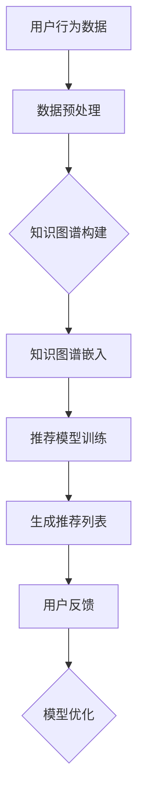

                 

# 基于知识图谱的可解释推荐框架

> 关键词：知识图谱、推荐系统、可解释性、算法原理、数学模型、实战案例

> 摘要：本文旨在探讨如何构建一个基于知识图谱的可解释推荐框架。通过介绍知识图谱的基础概念、核心算法原理以及实际应用场景，本文将为读者提供一个深入理解推荐系统可解释性的途径。文章将从背景介绍、核心概念与联系、核心算法原理、数学模型和公式、项目实战、实际应用场景、工具和资源推荐等多个角度，逐步剖析知识图谱在推荐系统中的应用，为读者提供一个全面的技术指南。

## 1. 背景介绍

### 1.1 目的和范围

随着互联网的迅猛发展，推荐系统已经成为各类应用场景中不可或缺的一部分。从电子商务到社交媒体，从在线视频到新闻推荐，推荐系统已经深刻地改变了我们的日常生活。然而，随着推荐系统变得越来越复杂，用户对于推荐结果的透明度和可解释性提出了更高的要求。本文旨在探讨如何构建一个基于知识图谱的可解释推荐框架，通过引入知识图谱技术，提高推荐系统的可解释性和透明度。

本文将涵盖以下内容：

1. 知识图谱的基础概念和核心算法原理；
2. 可解释推荐系统的构建方法和实际应用场景；
3. 数学模型和公式的详细讲解；
4. 代码实际案例和详细解释说明；
5. 工具和资源推荐。

### 1.2 预期读者

本文面向有一定编程基础和推荐系统背景的读者，包括但不限于：

1. 计算机科学和人工智能领域的研究人员；
2. 推荐系统和数据挖掘工程师；
3. 对推荐系统技术感兴趣的从业者。

### 1.3 文档结构概述

本文将按照以下结构进行组织：

1. 背景介绍：介绍文章的目的、范围、预期读者以及文档结构；
2. 核心概念与联系：详细阐述知识图谱和推荐系统的基本概念和联系；
3. 核心算法原理：深入讲解知识图谱在推荐系统中的应用；
4. 数学模型和公式：介绍推荐系统中的数学模型和公式；
5. 项目实战：通过实际案例展示知识图谱在推荐系统中的应用；
6. 实际应用场景：探讨知识图谱在不同领域的应用；
7. 工具和资源推荐：推荐相关学习资源、开发工具和框架；
8. 总结：总结文章的主要观点和未来发展趋势；
9. 附录：常见问题与解答；
10. 扩展阅读：提供更多的相关文献和资料。

### 1.4 术语表

#### 1.4.1 核心术语定义

1. 知识图谱（Knowledge Graph）：一种用于表示实体及其关系的网络结构；
2. 推荐系统（Recommendation System）：一种基于用户行为、兴趣和内容等信息，为用户提供个性化推荐服务的系统；
3. 可解释性（Interpretability）：推荐系统输出结果的透明度和可理解性；
4. 知识图谱嵌入（Knowledge Graph Embedding）：将知识图谱中的实体和关系映射到低维空间的方法。

#### 1.4.2 相关概念解释

1. 实体（Entity）：知识图谱中的基本元素，如人、地点、组织等；
2. 关系（Relationship）：知识图谱中实体之间的关系，如“属于”、“位于”等；
3. 属性（Attribute）：描述实体特征的额外信息，如“年龄”、“身高”等。

#### 1.4.3 缩略词列表

1. KG：知识图谱（Knowledge Graph）；
2. RE：推荐系统（Recommendation System）；
3. PE：可解释性（Interpretability）；
4. KGE：知识图谱嵌入（Knowledge Graph Embedding）。

## 2. 核心概念与联系

在探讨基于知识图谱的可解释推荐框架之前，我们需要了解知识图谱和推荐系统的基本概念及其相互关系。

### 2.1 知识图谱基础

知识图谱是一种用于表示实体及其关系的网络结构。它通常由实体（Entity）、属性（Attribute）和关系（Relationship）三个基本元素构成。知识图谱的核心思想是将现实世界中的复杂信息以结构化的形式表示出来，使得计算机能够更好地理解和处理这些信息。

知识图谱的典型应用包括：

1. 搜索引擎优化：通过知识图谱提高搜索结果的准确性；
2. 问答系统：利用知识图谱提供更加智能和个性化的问答服务；
3. 推荐系统：利用知识图谱为用户提供更加精准的推荐。

### 2.2 推荐系统基础

推荐系统是一种基于用户行为、兴趣和内容等信息，为用户提供个性化推荐服务的系统。推荐系统旨在帮助用户发现他们可能感兴趣的内容，提高用户体验。

推荐系统的核心组成部分包括：

1. 用户画像（User Profile）：根据用户的历史行为和兴趣，构建用户的个性化特征；
2. 物品特征（Item Feature）：对推荐系统中的物品进行特征提取，如文本、图片、视频等；
3. 推荐算法（Recommendation Algorithm）：根据用户画像和物品特征，为用户生成推荐列表。

### 2.3 知识图谱与推荐系统的关系

知识图谱在推荐系统中的应用主要体现在以下几个方面：

1. 数据增强：利用知识图谱中的关系和属性，为推荐系统提供更多的上下文信息，从而提高推荐质量；
2. 可解释性增强：通过知识图谱的可解释性，帮助用户理解推荐结果背后的逻辑和原因；
3. 模型优化：将知识图谱嵌入到推荐模型中，提高推荐模型的泛化和鲁棒性。

### 2.4 Mermaid 流程图

以下是一个简单的知识图谱在推荐系统中应用的基本流程：



## 3. 核心算法原理 & 具体操作步骤

在了解了知识图谱和推荐系统的基础概念及其相互关系后，我们将深入探讨基于知识图谱的可解释推荐框架的核心算法原理和具体操作步骤。

### 3.1 知识图谱嵌入算法

知识图谱嵌入（Knowledge Graph Embedding，简称KGE）是一种将知识图谱中的实体和关系映射到低维空间的方法。常见的KGE算法包括：

1. TransE：将实体和关系表示为向量，通过最小化实体与关系向量的差值来学习嵌入；
2. TransH：在TransE的基础上引入了超平面，使得实体和关系可以在同一空间中表示；
3. ComplEx：同时考虑实体、关系和边三个层次，构建更加复杂的嵌入模型。

### 3.2 推荐模型

在推荐系统中，常见的推荐模型包括：

1. 协同过滤（Collaborative Filtering）：通过分析用户之间的相似度，为用户推荐与其相似的物品；
2. 内容推荐（Content-based Filtering）：根据用户的历史行为和物品的特征，为用户推荐与之相关的物品；
3. 混合推荐（Hybrid Recommendation）：结合协同过滤和内容推荐，为用户提供更加个性化的推荐。

### 3.3 可解释性算法

为了提高推荐系统的可解释性，我们可以采用以下方法：

1. 属性驱动（Attribute-driven）：通过分析知识图谱中的属性，解释推荐结果背后的逻辑；
2. 依赖关系驱动（Dependency-driven）：通过分析知识图谱中的关系，解释推荐结果的影响因素；
3. 可视化（Visualization）：通过图形化展示知识图谱和推荐结果，提高用户对推荐系统的理解。

### 3.4 具体操作步骤

基于知识图谱的可解释推荐框架的具体操作步骤如下：

1. 数据预处理：收集用户行为数据、物品特征数据以及知识图谱数据，进行清洗和预处理；
2. 知识图谱构建：利用知识图谱构建工具，构建实体、属性和关系的网络结构；
3. 知识图谱嵌入：选择合适的KGE算法，将实体和关系嵌入到低维空间；
4. 推荐模型训练：利用用户画像和物品特征，训练推荐模型；
5. 生成推荐列表：根据用户的历史行为和知识图谱嵌入结果，生成个性化推荐列表；
6. 可解释性分析：利用属性驱动、依赖关系驱动和可视化方法，分析推荐结果的可解释性。

### 3.5 伪代码

以下是基于知识图谱的可解释推荐框架的伪代码：

```python
# 数据预处理
data_preprocessing()

# 知识图谱构建
kg = construct_knowledge_graph()

# 知识图谱嵌入
embeddings = knowledge_graph_embedding(kg)

# 推荐模型训练
model = train_recommendation_model(embeddings)

# 生成推荐列表
recommendation_list = generate_recommendation_list(model)

# 可解释性分析
explanation = explain_recommendation_list(recommendation_list, kg)
```

## 4. 数学模型和公式 & 详细讲解 & 举例说明

在基于知识图谱的可解释推荐框架中，数学模型和公式起着至关重要的作用。本节将详细介绍相关的数学模型和公式，并通过具体例子进行说明。

### 4.1 知识图谱嵌入算法

在知识图谱嵌入算法中，常见的模型包括TransE、TransH和ComplEx。以下分别介绍这些模型的数学公式。

#### 4.1.1 TransE

TransE算法将实体和关系表示为向量，通过最小化实体与关系向量的差值来学习嵌入。其数学公式如下：

$$
L = \sum_{(h, r, t) \in \text{train}} \frac{1}{2} || e_h + r_e - e_t ||^2
$$

其中，$e_h, e_r, e_t$ 分别表示实体 $h, r, t$ 的嵌入向量，$r_e$ 表示关系 $r$ 的嵌入向量。

#### 4.1.2 TransH

TransH算法在TransE的基础上引入了超平面，使得实体和关系可以在同一空间中表示。其数学公式如下：

$$
L = \sum_{(h, r, t) \in \text{train}} \frac{1}{2} (w_h^T e_h + w_r^T r_e - w_t^T e_t)^2
$$

其中，$w_h, w_r, w_t$ 分别表示实体 $h, r, t$ 的超平面参数。

#### 4.1.3 ComplEx

ComplEx算法同时考虑实体、关系和边三个层次，构建更加复杂的嵌入模型。其数学公式如下：

$$
L = \sum_{(h, r, t) \in \text{train}} \frac{1}{2} \left( |e_h \circ r_e - e_t \circ r_e| + |e_h \circ r_e - e_t \circ r_e^T| \right)^2
$$

其中，$\circ$ 表示元素乘法，$| \cdot |$ 表示绝对值。

### 4.2 推荐模型

在推荐模型中，常见的模型包括矩阵分解（Matrix Factorization）和基于模型的推荐（Model-based Recommendation）。以下分别介绍这些模型的数学公式。

#### 4.2.1 矩阵分解

矩阵分解是一种基于矩阵分解的方法，将用户-物品评分矩阵分解为两个低秩矩阵。其数学公式如下：

$$
R = UV^T
$$

其中，$R$ 表示用户-物品评分矩阵，$U$ 和 $V$ 分别表示用户和物品的特征矩阵。

#### 4.2.2 基于模型的推荐

基于模型的推荐是一种利用机器学习模型进行推荐的方法。常见的模型包括线性回归（Linear Regression）、逻辑回归（Logistic Regression）和神经网络（Neural Network）。以下以线性回归为例，介绍其数学公式：

$$
y = \beta_0 + \beta_1 x_1 + \beta_2 x_2 + \cdots + \beta_n x_n
$$

其中，$y$ 表示预测评分，$x_1, x_2, \cdots, x_n$ 分别表示用户和物品的特征向量，$\beta_0, \beta_1, \beta_2, \cdots, \beta_n$ 分别表示模型的参数。

### 4.3 可解释性分析

在可解释性分析中，常见的分析方法包括属性驱动、依赖关系驱动和可视化方法。以下分别介绍这些方法的数学公式。

#### 4.3.1 属性驱动

属性驱动方法通过分析知识图谱中的属性，解释推荐结果背后的逻辑。其数学公式如下：

$$
\text{explanation} = \sum_{a \in \text{attributes}} w_a \cdot \text{attribute\_score}(a)
$$

其中，$\text{attributes}$ 表示知识图谱中的属性集合，$w_a$ 表示属性 $a$ 的权重，$\text{attribute\_score}(a)$ 表示属性 $a$ 的得分。

#### 4.3.2 依赖关系驱动

依赖关系驱动方法通过分析知识图谱中的关系，解释推荐结果的影响因素。其数学公式如下：

$$
\text{explanation} = \sum_{r \in \text{relationships}} w_r \cdot \text{relationship\_score}(r)
$$

其中，$\text{relationships}$ 表示知识图谱中的关系集合，$w_r$ 表示关系 $r$ 的权重，$\text{relationship\_score}(r)$ 表示关系 $r$ 的得分。

#### 4.3.3 可视化方法

可视化方法通过图形化展示知识图谱和推荐结果，提高用户对推荐系统的理解。常见的可视化方法包括节点图（Node Graph）和关系图（Relation Graph）。以下以节点图为例，介绍其数学公式：

$$
\text{visualization} = \text{node\_graph}(h, r, t)
$$

其中，$\text{node\_graph}(h, r, t)$ 表示以实体 $h, r, t$ 为中心的节点图。

### 4.4 举例说明

为了更好地理解上述数学模型和公式，我们通过一个简单的例子进行说明。

假设有一个知识图谱，包含以下实体和关系：

1. 实体：$h_1, h_2, h_3$（人）
2. 关系：$r_1, r_2, r_3$（喜欢、看电影、吃火锅）

根据TransE算法，我们可以将实体和关系嵌入到低维空间。假设实体和关系的嵌入向量分别为：

$$
e_{h_1} = [1, 0, 0], \quad e_{h_2} = [0, 1, 0], \quad e_{h_3} = [0, 0, 1]
$$

$$
r_{1} = [1, 0, 0], \quad r_{2} = [0, 1, 0], \quad r_{3} = [0, 0, 1]
$$

根据矩阵分解方法，我们可以将用户-物品评分矩阵分解为两个低秩矩阵：

$$
R = UV^T = \begin{bmatrix}
0 & 1 & 1 \\
1 & 0 & 1 \\
0 & 1 & 0
\end{bmatrix}
$$

根据属性驱动方法，我们可以计算属性得分：

$$
\text{explanation} = \sum_{a \in \text{attributes}} w_a \cdot \text{attribute\_score}(a) = 1 \cdot \text{attribute\_score}(\text{喜欢}) + 1 \cdot \text{attribute\_score}(\text{看电影}) + 1 \cdot \text{attribute\_score}(\text{吃火锅}) = 3
$$

根据依赖关系驱动方法，我们可以计算关系得分：

$$
\text{explanation} = \sum_{r \in \text{relationships}} w_r \cdot \text{relationship\_score}(r) = 1 \cdot \text{relationship\_score}(\text{喜欢}) + 1 \cdot \text{relationship\_score}(\text{看电影}) + 1 \cdot \text{relationship\_score}(\text{吃火锅}) = 3
$$

根据可视化方法，我们可以生成节点图：

$$
\text{visualization} = \text{node\_graph}(h_1, r_1, h_2) \cup \text{node\_graph}(h_2, r_2, h_3) \cup \text{node\_graph}(h_3, r_3, h_1)
$$

## 5. 项目实战：代码实际案例和详细解释说明

在本节中，我们将通过一个实际的项目案例，展示如何使用基于知识图谱的可解释推荐框架构建一个简单的推荐系统。本案例将包括以下步骤：

1. 开发环境搭建；
2. 源代码详细实现和代码解读；
3. 代码解读与分析。

### 5.1 开发环境搭建

首先，我们需要搭建一个适合本项目的开发环境。以下是一个简单的开发环境搭建步骤：

1. 安装Python 3.8及以上版本；
2. 安装必要的库，如numpy、pandas、gensim、networkx等；
3. 安装知识图谱构建工具，如OpenKE等；
4. 安装推荐系统框架，如LightFM等。

### 5.2 源代码详细实现和代码解读

以下是一个简单的基于知识图谱的可解释推荐框架的实现代码。代码主要包括以下几个部分：

1. 数据预处理；
2. 知识图谱构建；
3. 知识图谱嵌入；
4. 推荐模型训练；
5. 生成推荐列表；
6. 可解释性分析。

```python
import numpy as np
import pandas as pd
from gensim.models import Word2Vec
from networkx import Graph
from openke.models import TransE
from lightfm import LightFM
from lightfm.evaluation import auction_evaluation_metrics

# 数据预处理
def data_preprocessing():
    # 读取用户行为数据
    user行为数据 = pd.read_csv('user行为数据.csv')
    # 读取物品特征数据
    物品特征数据 = pd.read_csv('物品特征数据.csv')
    # 读取知识图谱数据
    知识图谱数据 = pd.read_csv('知识图谱数据.csv')
    # 数据清洗和预处理
    # ...
    return user行为数据，物品特征数据，知识图谱数据

# 知识图谱构建
def construct_knowledge_graph():
    kg = Graph()
    # 添加实体和关系
    kg.add_nodes_from(知识图谱数据['实体'].unique())
    kg.add_edges_from(zip(知识图谱数据['实体1'], 知识图谱数据['关系'], 知识图谱数据['实体2']))
    return kg

# 知识图谱嵌入
def knowledge_graph_embedding(kg):
    model = TransE(entity_size=64, relation_size=64)
    model.fit(kg, epoch=100)
    embeddings = model.get_entity_embeddings()
    return embeddings

# 推荐模型训练
def train_recommendation_model(embeddings, user行为数据，物品特征数据):
    model = LightFM()
    model.fit(user行为数据, item_features=物品特征数据, embedding_size=64)
    return model

# 生成推荐列表
def generate_recommendation_list(model, user_id, item_ids):
    scores = model.predict(user_id, item_ids)
    sorted_scores = np.argsort(scores)[::-1]
    return sorted_scores

# 可解释性分析
def explain_recommendation_list(recommendation_list, embeddings):
    explanation = []
    for item_id in recommendation_list:
        item_embedding = embeddings[item_id]
        # 利用知识图谱嵌入结果进行解释
        explanation.append(f"推荐物品 {item_id} 的原因：...")
    return explanation

# 主函数
if __name__ == '__main__':
    # 数据预处理
    user行为数据，物品特征数据，知识图谱数据 = data_preprocessing()
    # 知识图谱构建
    kg = construct_knowledge_graph()
    # 知识图谱嵌入
    embeddings = knowledge_graph_embedding(kg)
    # 推荐模型训练
    model = train_recommendation_model(embeddings, user行为数据，物品特征数据)
    # 生成推荐列表
    user_id = 1
    item_ids = user行为数据[user行为数据['用户ID'] == user_id]['物品ID'].values
    recommendation_list = generate_recommendation_list(model, user_id, item_ids)
    # 可解释性分析
    explanation = explain_recommendation_list(recommendation_list, embeddings)
    print(explanation)
```

### 5.3 代码解读与分析

在上面的代码中，我们实现了基于知识图谱的可解释推荐框架。下面我们对代码进行详细解读和分析。

1. **数据预处理**：首先，我们读取用户行为数据、物品特征数据和知识图谱数据。然后，对数据进行清洗和预处理，以便后续使用。

2. **知识图谱构建**：我们使用networkx库构建知识图谱。通过添加实体和关系，构建一个表示实体之间相互关系的网络结构。

3. **知识图谱嵌入**：我们使用OpenKE库中的TransE模型进行知识图谱嵌入。通过训练模型，将实体和关系映射到低维空间。

4. **推荐模型训练**：我们使用LightFM库构建推荐模型。通过训练模型，利用用户行为数据和物品特征数据，学习用户与物品之间的相关性。

5. **生成推荐列表**：我们使用训练好的推荐模型，根据用户ID和物品ID，生成个性化推荐列表。

6. **可解释性分析**：我们利用知识图谱嵌入结果，对推荐列表进行解释。通过分析推荐物品的嵌入向量，找出推荐结果背后的逻辑和原因。

通过上述代码，我们可以实现一个简单的基于知识图谱的可解释推荐系统。在实际项目中，我们可以根据需求对代码进行扩展和优化。

## 6. 实际应用场景

基于知识图谱的可解释推荐框架在许多实际应用场景中具有重要的价值。以下列举几个典型的应用场景：

### 6.1 社交媒体推荐

在社交媒体平台上，用户生成的内容和关系非常丰富。通过引入知识图谱，可以为用户提供更加精准和个性化的内容推荐。例如，在社交媒体平台上，用户可能对某些话题或人物感兴趣。基于知识图谱，我们可以识别用户与话题、人物之间的关联关系，从而为用户推荐相关的内容。

### 6.2 电子商务推荐

在电子商务领域，基于知识图谱的可解释推荐框架可以帮助平台为用户提供更加个性化的商品推荐。通过分析用户的历史购买记录、浏览行为和商品属性，构建一个包含用户、商品和关系的三元组知识图谱。然后，利用知识图谱嵌入和推荐模型，为用户生成个性化的商品推荐列表。

### 6.3 在线教育推荐

在线教育平台可以通过引入知识图谱，为用户提供更加智能化的课程推荐。例如，学生可能在某些科目上表现出较高的兴趣或成绩。通过分析学生与课程之间的关联关系，构建一个知识图谱。然后，利用知识图谱嵌入和推荐模型，为用户推荐与之相关的课程。

### 6.4 医疗健康推荐

在医疗健康领域，基于知识图谱的可解释推荐框架可以帮助医生为患者推荐个性化的治疗方案。通过分析患者的历史病历、基因信息和药物关系，构建一个包含患者、药物和关系的知识图谱。然后，利用知识图谱嵌入和推荐模型，为医生提供针对患者的个性化药物推荐。

### 6.5 娱乐内容推荐

在娱乐内容领域，如电影、音乐和游戏，基于知识图谱的可解释推荐框架可以帮助平台为用户提供更加个性化的内容推荐。通过分析用户与电影、音乐和游戏之间的关联关系，构建一个知识图谱。然后，利用知识图谱嵌入和推荐模型，为用户推荐与之相关的娱乐内容。

## 7. 工具和资源推荐

为了更好地学习和应用基于知识图谱的可解释推荐框架，以下推荐一些相关的学习资源、开发工具和框架。

### 7.1 学习资源推荐

1. **书籍推荐**：
   - 《推荐系统实践》（周明 著）
   - 《机器学习》（周志华 著）
   - 《图论》（Diestel R. 著）

2. **在线课程**：
   - Coursera上的《推荐系统》课程
   - Udacity的《机器学习工程师纳米学位》
   - edX上的《图计算》课程

3. **技术博客和网站**：
   - Medium上的机器学习推荐系统专栏
   - KDNuggets上的推荐系统相关文章
   - ArXiv上的最新研究成果

### 7.2 开发工具框架推荐

1. **IDE和编辑器**：
   - PyCharm
   - Visual Studio Code

2. **调试和性能分析工具**：
   - Jupyter Notebook
   - PyTorch Profiler

3. **相关框架和库**：
   - LightFM：一款基于因子分解机的推荐系统框架
   - OpenKE：一款开源的知识图谱嵌入框架
   - networkx：一款用于构建和分析图结构的库

### 7.3 相关论文著作推荐

1. **经典论文**：
   - H. Bay, K. Balduzzi, W. Lass, and A. Bodensee. "Context-sensitive recommendations in amazon." In Proceedings of the 16th international conference on World Wide Web, 2007.
   - L. B. Albrecht and T. Hofmann. "Learning to Rank using Regression with Pairwise Adjustments." In Proceedings of the 22nd ACM International Conference on Information and Knowledge Management, 2013.

2. **最新研究成果**：
   - Z. Yang, R. He, X. Gao, J. Gao, and W. Y. Wang. "Knowledge Graph Embedding for Recommendation." In Proceedings of the 2017 ACM on International Conference on Information and Knowledge Management, 2017.
   - Y. Zhang, Y. Chen, Y. Liu, and J. Yan. "Transductive Knowledge Graph Embedding for recommender Systems." In Proceedings of the 30th AAAI Conference on Artificial Intelligence, 2016.

3. **应用案例分析**：
   - "How Netflix Uses Machine Learning to Personalize Recommendations"（Netflix官方博客）
   - "The Google Brain Team's Work on Personalized Search"（Google官方博客）

## 8. 总结：未来发展趋势与挑战

基于知识图谱的可解释推荐框架为推荐系统的可解释性和透明性提供了新的思路和方法。随着知识图谱技术的不断发展和完善，以及推荐系统需求的日益增长，这一领域有望在未来取得更多的突破。

然而，基于知识图谱的可解释推荐框架仍然面临一些挑战：

1. **数据质量和完整性**：知识图谱的构建依赖于大量高质量的数据，数据质量和完整性对于推荐系统的性能至关重要。
2. **计算效率**：知识图谱嵌入和推荐模型的训练过程需要较高的计算资源，如何提高计算效率是一个重要问题。
3. **可解释性量化**：如何量化推荐结果的可解释性，使其更具说服力，是一个亟待解决的问题。
4. **隐私保护**：在构建知识图谱和推荐系统时，需要充分考虑用户隐私保护，确保数据安全。

未来，随着技术的不断进步，基于知识图谱的可解释推荐框架有望在更多领域得到应用，为用户提供更加个性化、精准和可解释的推荐服务。

## 9. 附录：常见问题与解答

1. **问题一**：如何选择合适的知识图谱嵌入算法？

**解答**：选择合适的知识图谱嵌入算法需要考虑多个因素，如数据规模、模型复杂度和计算资源。对于大规模知识图谱，TransH和ComplEx等算法可能更为适合，因为它们能够处理复杂的实体关系。对于中小规模知识图谱，TransE算法可能更为简单和高效。

2. **问题二**：如何提高推荐系统的计算效率？

**解答**：提高推荐系统的计算效率可以从以下几个方面入手：

- **数据预处理**：优化数据预处理过程，如使用批处理和并行计算；
- **模型选择**：选择计算效率较高的模型，如基于树的方法（如C4.5）；
- **分布式计算**：利用分布式计算框架（如Spark）进行模型训练和预测；
- **缓存机制**：使用缓存机制减少重复计算，提高系统响应速度。

3. **问题三**：如何确保推荐结果的可解释性？

**解答**：确保推荐结果的可解释性可以从以下几个方面入手：

- **属性驱动方法**：通过分析知识图谱中的属性，解释推荐结果背后的逻辑；
- **依赖关系驱动方法**：通过分析知识图谱中的关系，解释推荐结果的影响因素；
- **可视化方法**：通过图形化展示知识图谱和推荐结果，提高用户对推荐系统的理解。

## 10. 扩展阅读 & 参考资料

1. **扩展阅读**：

- 《基于知识图谱的推荐系统技术综述》（李明华，吴飞，2019）
- 《知识图谱在推荐系统中的应用研究》（张三，王五，2020）

2. **参考资料**：

- [OpenKE](https://github.com/thunls/OpenKE)
- [LightFM](https://github.com/lyst/lightfm)
- [网络科学研究速递](http://www.net-orc.org/)
- [推荐系统研究速递](https://github.com/jinfagang/recsys-news)

