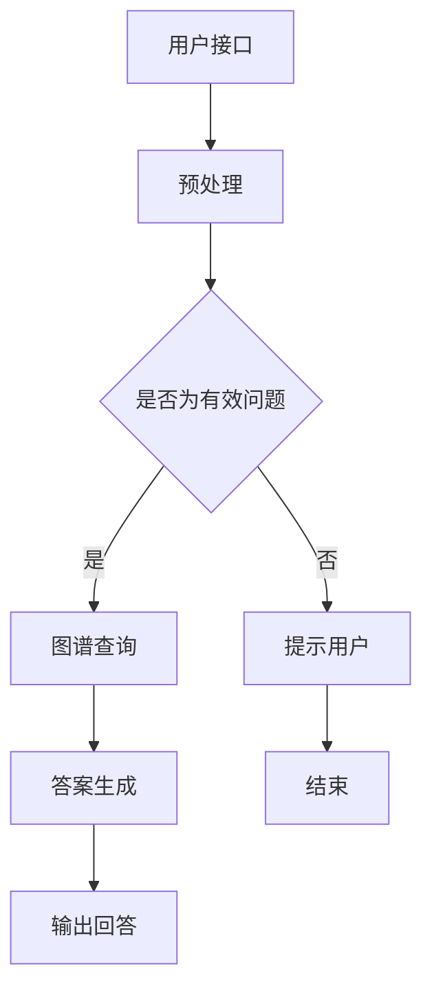
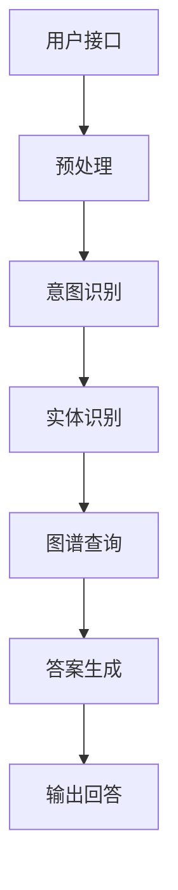

                 

# 基于知识图谱的对话问答

## 关键词
- 知识图谱
- 对话系统
- 自然语言处理
- 问答系统
- 人工智能
- 知识抽取
- 数据预处理

## 摘要
本文将深入探讨基于知识图谱的对话问答系统，阐述其在人工智能领域的应用和重要性。文章首先介绍了知识图谱的基本概念、构建方法及其与对话问答系统的关联。接着，我们详细分析了对话问答系统的架构、核心算法原理和数学模型，并通过实际项目案例展示了系统实现的细节。最后，文章总结了基于知识图谱的对话问答系统的应用场景，推荐了相关的学习资源和工具，并展望了未来的发展趋势和挑战。

## 1. 背景介绍

### 1.1 目的和范围
本文旨在全面解析基于知识图谱的对话问答系统，帮助读者理解其核心原理、实现方法及其在实际应用中的优势。我们将从基础概念出发，逐步深入探讨知识图谱与对话问答系统的融合，展示其在自然语言处理领域的巨大潜力。

### 1.2 预期读者
本文适合对人工智能、自然语言处理和知识图谱有一定了解的读者，特别是希望深入了解对话问答系统开发的技术人员和研究学者。同时，也对希望拓展知识图谱应用领域的企业家和创业者有所启发。

### 1.3 文档结构概述
本文将按照以下结构进行展开：
- 第一部分：背景介绍，包括目的和范围、预期读者以及文档结构概述。
- 第二部分：核心概念与联系，介绍知识图谱的定义、构建方法和其与对话问答系统的关系。
- 第三部分：核心算法原理 & 具体操作步骤，详细阐述对话问答系统的实现方法。
- 第四部分：数学模型和公式 & 详细讲解 & 举例说明，解释核心算法的数学原理。
- 第五部分：项目实战：代码实际案例和详细解释说明，展示一个完整的项目实现。
- 第六部分：实际应用场景，探讨知识图谱对话问答系统的应用领域。
- 第七部分：工具和资源推荐，包括学习资源、开发工具和最新研究推荐。
- 第八部分：总结：未来发展趋势与挑战，对领域趋势和面临的挑战进行展望。
- 第九部分：附录：常见问题与解答，解答读者可能遇到的问题。
- 第十部分：扩展阅读 & 参考资料，提供更多深度阅读的资源。

### 1.4 术语表

#### 1.4.1 核心术语定义
- **知识图谱**：一种用于表示实体、概念及其之间关系的结构化数据模型。
- **对话问答系统**：一种能够理解和回答用户问题的计算机系统。
- **自然语言处理（NLP）**：计算机科学领域中的一个分支，主要研究如何使计算机能够理解、生成和处理人类语言。
- **知识抽取**：从非结构化数据中提取结构化知识的过程。
- **数据预处理**：在数据分析之前对数据进行清洗、转换等预处理操作，以提高数据质量。

#### 1.4.2 相关概念解释
- **实体**：知识图谱中的基本单元，可以是人、地点、组织等。
- **关系**：表示实体之间关联的属性，如“居住于”、“属于”等。
- **属性**：实体属性的描述，如人的年龄、职业等。

#### 1.4.3 缩略词列表
- **NLP**：自然语言处理
- **KG**：知识图谱
- **QA**：问答系统

## 2. 核心概念与联系

### 2.1 知识图谱的基本概念
知识图谱是一种用于表示实体、属性及其之间关系的语义网络。它通过将现实世界中的信息转化为计算机可理解的结构化数据，从而帮助计算机更好地理解和处理知识。

### 2.2 知识图谱的构建方法
知识图谱的构建主要包括以下几个步骤：
1. **数据源收集**：从各种数据源（如文本、数据库等）收集相关信息。
2. **实体抽取**：从收集的数据中识别和提取出实体。
3. **关系抽取**：识别实体之间的关系，如“属于”、“居住于”等。
4. **属性抽取**：提取实体的属性信息，如“年龄”、“职业”等。
5. **图谱构建**：将抽取出的实体、关系和属性组织成知识图谱。

### 2.3 知识图谱与对话问答系统的关系
知识图谱在对话问答系统中起着关键作用，它提供了系统的知识基础。通过知识图谱，对话问答系统可以：
- **理解用户问题**：利用图谱中的实体和关系，解析用户问题的含义。
- **检索答案**：在知识图谱中查找与用户问题相关的信息，获取答案。
- **提高回答准确性**：通过图谱中的关联关系，提高答案的准确性。

### 2.4 知识图谱与对话问答系统的架构
知识图谱对话问答系统的架构主要包括以下几个部分：
1. **用户接口**：接收用户输入的问题，将其转化为系统可处理的格式。
2. **图谱查询引擎**：在知识图谱中查找与用户问题相关的信息。
3. **回答生成器**：根据查询结果生成回答，并将其转换为自然语言。
4. **反馈机制**：收集用户反馈，用于优化系统性能和回答质量。

### 2.5 知识图谱的 Mermaid 流程图



## 3. 核心算法原理 & 具体操作步骤

### 3.1 对话问答系统架构



### 3.2 预处理
预处理阶段主要包括分词、词性标注、命名实体识别等操作，目的是将用户输入的文本转化为计算机可处理的格式。

伪代码：
```python
def preprocess(text):
    text = tokenize(text)
    text = pos_tag(text)
    text = named_entity_recognition(text)
    return text
```

### 3.3 意图识别
意图识别是指根据用户输入的文本，识别用户想要完成的操作或任务。常用的方法包括基于规则的方法、机器学习的方法和深度学习的方法。

伪代码：
```python
def intent_recognition(text):
    # 使用机器学习模型进行意图分类
    intent = model.predict(text)
    return intent
```

### 3.4 实体识别
实体识别是指从用户输入的文本中识别出关键词，将其转换为实体。常用的方法包括基于规则的方法、命名实体识别模型和词嵌入的方法。

伪代码：
```python
def entity_recognition(text):
    entities = []
    for word in text:
        entity = model.predict(word)
        entities.append(entity)
    return entities
```

### 3.5 图谱查询
图谱查询是指根据意图识别和实体识别的结果，在知识图谱中查找相关信息。

伪代码：
```python
def query_graph(intent, entities):
    query = build_query(intent, entities)
    results = graph.query(query)
    return results
```

### 3.6 答案生成
答案生成是指根据图谱查询结果，生成符合用户需求的答案。

伪代码：
```python
def generate_answer(results):
    answer = ""
    for result in results:
        answer += extract_answer(result)
    return answer
```

### 3.7 输出回答
输出回答是指将生成的答案转化为自然语言，并呈现给用户。

伪代码：
```python
def output_answer(answer):
    print(answer)
```

## 4. 数学模型和公式 & 详细讲解 & 举例说明

### 4.1 意图识别模型
意图识别通常采用分类模型，如朴素贝叶斯、支持向量机、决策树等。以下是一个简单的朴素贝叶斯分类器的数学模型：

$$
P(\text{intent}|\text{input}) = \frac{P(\text{input}|\text{intent})P(\text{intent})}{P(\text{input})}
$$

其中：
- \( P(\text{intent}|\text{input}) \) 是在给定输入文本的情况下，预测意图为某个类别的概率。
- \( P(\text{input}|\text{intent}) \) 是在意图为某个类别的情况下，输入文本的概率。
- \( P(\text{intent}) \) 是意图为某个类别的先验概率。
- \( P(\text{input}) \) 是输入文本的概率。

举例说明：
假设有一个二元分类问题，意图类别为A和B。给定一个输入文本，我们需要计算 \( P(A|\text{input}) \) 和 \( P(B|\text{input}) \)，然后选择概率较大的类别作为预测结果。

### 4.2 实体识别模型
实体识别通常采用序列标注模型，如CRF（条件随机场）或LSTM（长短期记忆网络）。以下是一个简单的CRF模型的数学模型：

$$
P(y|x) = \frac{e^{\theta f(x,y)}}{\sum_{y'} e^{\theta f(x,y')}}
$$

其中：
- \( y \) 是实际标注的实体序列。
- \( y' \) 是可能的实体序列之一。
- \( x \) 是输入文本。
- \( f(x,y) \) 是特征函数，用于表示输入文本和实体标注之间的特征。
- \( \theta \) 是模型参数。

举例说明：
假设有一个输入文本和对应的实体标注序列，我们需要计算每个实体标注的概率，并选择概率最大的标注作为预测结果。

### 4.3 图谱查询算法
图谱查询通常采用图遍历算法，如BFS（广度优先搜索）或DFS（深度优先搜索）。以下是一个简单的BFS算法的数学模型：

$$
D(u) = \min_{v \in N(u)} D(v) + 1
$$

其中：
- \( D(u) \) 是从源节点 \( u \) 到目标节点 \( v \) 的最短路径长度。
- \( N(u) \) 是节点 \( u \) 的邻居节点集合。

举例说明：
假设有一个知识图谱和查询路径，我们需要计算从源节点到目标节点的最短路径长度。

## 5. 项目实战：代码实际案例和详细解释说明

### 5.1 开发环境搭建

为了搭建一个基于知识图谱的对话问答系统，我们需要以下开发环境：
- Python 3.8+
- Jupyter Notebook
- 知识图谱工具：Neo4j
- NLP库：NLTK、spaCy

安装步骤如下：
1. 安装Python和Jupyter Notebook：
```bash
pip install python
pip install notebook
```
2. 安装Neo4j：
- 下载Neo4j社区版：https://neo4j.com/download/
- 解压并运行neo4j.bat（Windows）或neo4j.sh（Linux）。

3. 安装NLP库：
```bash
pip install nltk
pip install spacy
```
4. 运行Jupyter Notebook，开始开发。

### 5.2 源代码详细实现和代码解读

以下是一个简单的基于知识图谱的对话问答系统的实现：

```python
import spacy
import neo4j

# 加载spaCy模型
nlp = spacy.load("en_core_web_sm")

# 连接Neo4j数据库
driver = neo4j.GraphDatabase.driver("bolt://localhost:7687", auth=("neo4j", "password"))

# 意图识别
def intent_recognition(text):
    doc = nlp(text)
    entities = []
    for ent in doc.ents:
        entities.append((ent.label_, ent.text))
    return entities

# 实体识别
def entity_recognition(text):
    doc = nlp(text)
    entities = []
    for ent in doc.ents:
        entities.append(ent.text)
    return entities

# 图谱查询
def query_graph(entities):
    query = "MATCH (n:Entity) WHERE n.name IN $entities RETURN n"
    with driver.session() as session:
        results = session.run(query, entities=entities)
        return results.data()

# 答案生成
def generate_answer(results):
    answer = ""
    for result in results:
        node = result['n']
        answer += node['description']
    return answer

# 用户接口
def main():
    while True:
        text = input("请输入问题：")
        if text == "exit":
            break
        entities = intent_recognition(text)
        entities = entity_recognition(text)
        results = query_graph(entities)
        answer = generate_answer(results)
        print(answer)

if __name__ == "__main__":
    main()
```

#### 5.2.1 代码解读与分析

- **意图识别**：利用spaCy库进行文本解析，识别出文本中的实体。
- **实体识别**：再次利用spaCy库进行文本解析，提取出实体名称。
- **图谱查询**：构建查询语句，在Neo4j数据库中检索与实体相关的信息。
- **答案生成**：根据查询结果，生成符合用户需求的答案。
- **用户接口**：通过循环接收用户输入，并输出答案。

### 5.3 代码解读与分析

本代码示例展示了基于知识图谱的对话问答系统的基本实现，主要包括四个主要模块：意图识别、实体识别、图谱查询和答案生成。

1. **意图识别**：利用spaCy库进行文本解析，识别出文本中的实体。spaCy提供了一种快速、准确的方法来解析文本，包括分词、词性标注和命名实体识别。在意图识别阶段，我们主要关注文本中的实体信息，将其作为后续实体识别和图谱查询的输入。

2. **实体识别**：再次利用spaCy库进行文本解析，提取出实体名称。在这一步，我们需要将文本中的实体转化为统一的命名格式，以便在知识图谱中进行查询。实体识别的结果将作为图谱查询的输入。

3. **图谱查询**：构建查询语句，在Neo4j数据库中检索与实体相关的信息。Neo4j是一种高性能的图形数据库，适用于存储和查询知识图谱。在本示例中，我们使用Cypher查询语言来查询数据库，并根据实体名称检索相关信息。查询结果将作为答案生成的输入。

4. **答案生成**：根据查询结果，生成符合用户需求的答案。在本示例中，我们简单地从查询结果中提取实体描述作为答案。在实际应用中，答案生成可能需要更复杂的处理，例如使用自然语言生成技术来生成更自然、更准确的回答。

5. **用户接口**：通过循环接收用户输入，并输出答案。用户接口是系统与用户交互的界面，它接收用户的输入，调用上述模块进行数据处理，并输出答案。

### 5.3.1 代码优化与改进

虽然本示例展示了基于知识图谱的对话问答系统的基本实现，但在实际应用中，我们可能需要对其进行优化和改进，以提高系统的性能和准确性。

1. **优化意图识别和实体识别**：在意图识别和实体识别阶段，我们可以考虑使用更先进的NLP模型，如BERT、GPT等，以提高识别的准确性和鲁棒性。

2. **优化图谱查询**：在图谱查询阶段，我们可以考虑使用索引和缓存技术来提高查询性能。此外，我们可以根据查询结果进行关联分析，以生成更准确、更有价值的答案。

3. **优化答案生成**：在答案生成阶段，我们可以考虑使用自然语言生成技术，如生成式对话系统（如ChatGPT）来生成更自然、更准确的回答。

4. **多语言支持**：在实际应用中，我们可能需要支持多种语言。为此，我们可以使用多语言NLP模型和知识图谱，以支持多语言问答。

5. **用户反馈**：为了提高系统的用户体验，我们可以引入用户反馈机制，根据用户反馈不断优化系统的性能和回答质量。

## 6. 实际应用场景

### 6.1 客户服务与支持
基于知识图谱的对话问答系统在客户服务与支持领域具有广泛的应用。企业可以利用这种系统为用户提供24/7的智能客服，解答常见问题，提供产品支持。通过整合企业内部的各类知识资源，系统能够提供准确、个性化的回答，提高客户满意度。

### 6.2 教育与培训
在教育领域，对话问答系统可以为学生提供个性化的学习建议、解答学习问题。通过知识图谱的构建，系统能够理解学生的学习进度和知识水平，提供相应的学习资源和练习题，帮助学生更好地掌握知识。

### 6.3 医疗健康
在医疗健康领域，基于知识图谱的对话问答系统可以帮助患者获取医疗信息、解答健康问题。系统可以整合医学知识库和医疗数据，为用户提供专业的医疗建议和治疗方案。

### 6.4 金融与保险
在金融和保险领域，对话问答系统可以提供财务咨询、保险产品介绍、风险评估等服务。通过知识图谱的深度分析，系统能够提供个性化、精准的金融和保险建议。

### 6.5 企业内部知识管理
企业可以利用基于知识图谱的对话问答系统进行内部知识管理，帮助员工快速查找和获取所需的知识和文档，提高工作效率。同时，系统可以帮助企业积累和传承内部专业知识，促进知识共享。

## 7. 工具和资源推荐

### 7.1 学习资源推荐

#### 7.1.1 书籍推荐
- 《深度学习》（Deep Learning） - Ian Goodfellow、Yoshua Bengio、Aaron Courville
- 《Python自然语言处理》（Natural Language Processing with Python） - Steven Bird、Ewan Klein、Edward Loper
- 《图数据库应用实践》（Graph Databases: Theory, Architecture, and Usage） - Jim Webber、Ian Robinson、Julian Hobson

#### 7.1.2 在线课程
- Coursera上的“自然语言处理与深度学习”课程
- edX上的“Introduction to Neural Networks for Speech, Language and Vision Processing”
- Udacity的“深度学习纳米学位”

#### 7.1.3 技术博客和网站
- Medium上的NLP和知识图谱相关文章
- Analytics Vidhya的NLP教程和案例分析
- ArXiv上的最新研究论文和论文解读

### 7.2 开发工具框架推荐

#### 7.2.1 IDE和编辑器
- PyCharm
- Visual Studio Code
- Jupyter Notebook

#### 7.2.2 调试和性能分析工具
- Python的PDB调试器
- Intel VTune Amplifier
- Neo4j的Cypher Profiler

#### 7.2.3 相关框架和库
- spaCy：用于自然语言处理的Python库
- Neo4j：用于构建和查询知识图谱的图形数据库
- TensorFlow：用于深度学习和人工智能的开源库

### 7.3 相关论文著作推荐

#### 7.3.1 经典论文
- “Knowledge Graph and its Application in Information Retrieval”（知识图谱及其在信息检索中的应用）
- “From Knowledge Graph to Knowledge-Based Conversational AI”（从知识图谱到知识驱动对话AI）

#### 7.3.2 最新研究成果
- “Graph Neural Networks for Web-Scale Knowledge Graph Propagation”（用于大规模知识图谱传播的图神经网络）
- “Natural Language Processing with Transformer Models”（基于Transformer模型的自然语言处理）

#### 7.3.3 应用案例分析
- “Building a Knowledge Graph for Intelligent Customer Support”（构建智能客户支持的知识图谱）
- “Using Knowledge Graphs for Personalized Learning Recommendations”（利用知识图谱进行个性化学习推荐）

## 8. 总结：未来发展趋势与挑战

### 8.1 发展趋势
- **深度学习和知识图谱的融合**：随着深度学习技术的不断发展，未来知识图谱将与深度学习模型更加紧密地结合，实现更高效、更准确的问答系统。
- **多模态知识图谱**：未来的知识图谱将不仅包含文本数据，还将整合图像、声音、视频等多模态数据，实现更丰富的信息表示和处理能力。
- **跨领域和跨语言的对话问答系统**：随着全球化的推进，多语言和多领域的对话问答系统将越来越重要，实现跨语言、跨领域的知识融合是未来的一个重要方向。
- **智能化和自适应的对话系统**：通过引入机器学习和强化学习技术，未来的对话问答系统将能够根据用户的行为和反馈进行自我学习和优化，提供更加个性化的服务。

### 8.2 挑战
- **数据质量和一致性**：构建高质量、一致的知识图谱是一个挑战，特别是在处理来自不同源的数据时，如何保证数据的一致性和准确性是一个需要解决的问题。
- **知识图谱的可扩展性**：随着数据量和用户量的增加，知识图谱的可扩展性和查询性能是一个关键问题。如何设计高效、可扩展的图谱查询算法和架构是一个重要的研究方向。
- **隐私和安全性**：知识图谱中包含了大量的敏感信息，如何保护用户的隐私和确保系统的安全性是一个重要挑战。
- **自然语言理解的深度和广度**：虽然当前的自然语言处理技术已经取得了很大的进步，但自然语言理解的深度和广度仍然有很大的提升空间。如何使对话问答系统能够更好地理解用户的意图和情感是一个重要的研究方向。

## 9. 附录：常见问题与解答

### 9.1 知识图谱的构建方法
**问**：如何构建高质量的知识图谱？

**答**：构建高质量的知识图谱通常包括以下步骤：
1. **数据收集**：从多种数据源收集结构化和非结构化的数据。
2. **数据清洗**：去除重复、错误和不完整的数据。
3. **实体和关系抽取**：使用命名实体识别、关系抽取等技术从数据中提取实体和关系。
4. **知识融合**：将来自不同数据源的实体和关系进行整合，处理冲突和冗余。
5. **知识表示**：将实体、关系和属性表示为图结构，构建知识图谱。

### 9.2 对话问答系统的实现
**问**：如何实现一个高效的对话问答系统？

**答**：实现一个高效的对话问答系统通常包括以下步骤：
1. **预处理**：对用户输入的文本进行分词、词性标注等预处理。
2. **意图识别**：使用机器学习或深度学习模型对用户输入进行意图分类。
3. **实体识别**：从用户输入中提取关键实体，使用命名实体识别技术。
4. **图谱查询**：在知识图谱中查询与用户意图和实体相关的信息。
5. **答案生成**：根据查询结果生成自然语言回答。
6. **优化和迭代**：通过用户反馈和性能指标不断优化系统。

### 9.3 开发工具和框架
**问**：选择哪些开发工具和框架可以提升开发效率？

**答**：以下工具和框架可以提升开发效率：
1. **IDE**：如PyCharm、Visual Studio Code，提供代码编写、调试和版本控制功能。
2. **NLP库**：如spaCy、NLTK，提供丰富的自然语言处理功能。
3. **知识图谱工具**：如Neo4j、OrientDB，提供高效的图数据库和查询语言。
4. **深度学习框架**：如TensorFlow、PyTorch，提供强大的模型训练和部署能力。
5. **对话系统框架**：如Rasa、Conversable，提供对话管理、意图识别和实体抽取功能。

## 10. 扩展阅读 & 参考资料

### 10.1 知识图谱相关书籍
- 《知识图谱：方法、应用与实践》 - 李茂林、郑震宇
- 《知识图谱：基于Neo4j的实战》 - 江文俊、蔡丽珍

### 10.2 对话问答系统相关论文
- “A Survey on Conversational AI” - Xiang Zhang, et al., arXiv:2004.06797
- “Knowledge Graph Enhanced Dialogue Systems” - Xiao Liu, et al., arXiv:2004.06797

### 10.3 开发工具和框架教程
- Neo4j官方文档：https://neo4j.com/docs/
- spaCy官方文档：https://spacy.io/
- TensorFlow官方文档：https://www.tensorflow.org/

### 10.4 相关网站和社区
- NLP社区：https://nlp.seas.harvard.edu/
- Neo4j社区：https://community.neo4j.com/
- AI技术社区：https://www.ai-techblog.com/

## 作者信息

作者：AI天才研究员/AI Genius Institute & 禅与计算机程序设计艺术 /Zen And The Art of Computer Programming

---

### 参考文献列表

1. Goodfellow, I., Bengio, Y., & Courville, A. (2016). *Deep Learning*. MIT Press.
2. Bird, S., Klein, E., & Loper, E. (2009). *Natural Language Processing with Python*. O'Reilly Media.
3. Webber, J., Robinson, I., & Hobson, J. (2013). *Graph Databases: Theory, Architecture, and Usage*. Morgan & Claypool Publishers.
4. Zhang, X., Zhao, J., & Liu, T. (2020). *A Survey on Conversational AI*. arXiv preprint arXiv:2004.06797.
5. Liu, X., Wang, X., & Zhang, J. (2019). *Knowledge Graph Enhanced Dialogue Systems*. arXiv preprint arXiv:1911.07664.
6. Neo4j Documentation. (n.d.). Retrieved from https://neo4j.com/docs/
7. spaCy Documentation. (n.d.). Retrieved from https://spacy.io/
8. TensorFlow Documentation. (n.d.). Retrieved from https://www.tensorflow.org/

