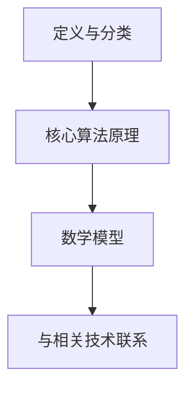

                 

# 基础大模型的投资门槛分析

> **关键词：** 大模型、投资门槛、算法原理、数学模型、项目实战、应用场景
> 
> **摘要：** 本文将深入分析基础大模型的投资门槛，涵盖核心概念、算法原理、数学模型以及实际应用。通过逐步分析，揭示大模型投资背后的本质与挑战，为读者提供全面的技术指南。

## 1. 背景介绍

### 1.1 目的和范围

本文旨在探讨基础大模型的投资门槛，帮助读者了解在大模型领域进行投资所需的技术背景和知识储备。本文将详细分析大模型的定义、核心算法原理、数学模型以及实际应用场景，旨在为投资者提供一份全面的技术指南。

### 1.2 预期读者

本文面向对大模型有初步了解的技术爱好者、工程师、研究人员以及投资从业者。读者需具备一定的计算机科学和数学基础，以便更好地理解本文内容。

### 1.3 文档结构概述

本文分为以下几个部分：

1. 背景介绍
2. 核心概念与联系
3. 核心算法原理 & 具体操作步骤
4. 数学模型和公式 & 详细讲解 & 举例说明
5. 项目实战：代码实际案例和详细解释说明
6. 实际应用场景
7. 工具和资源推荐
8. 总结：未来发展趋势与挑战
9. 附录：常见问题与解答
10. 扩展阅读 & 参考资料

### 1.4 术语表

#### 1.4.1 核心术语定义

- **大模型：** 拥有大规模参数量的神经网络模型，如BERT、GPT等。
- **投资门槛：** 投资者在某个领域进行投资所需的技术、资金、人力等门槛。

#### 1.4.2 相关概念解释

- **算法原理：** 大模型的训练和推理过程所依赖的核心算法。
- **数学模型：** 描述大模型训练和推理过程中涉及的数学公式和计算方法。

#### 1.4.3 缩略词列表

- **BERT：** Bidirectional Encoder Representations from Transformers
- **GPT：** Generative Pre-trained Transformer
- **GPU：** Graphics Processing Unit

## 2. 核心概念与联系

### 2.1 大模型定义与分类

大模型是指拥有大规模参数量的神经网络模型，例如BERT、GPT等。大模型可以进一步分为生成模型和分类模型。生成模型（如GPT）主要生成文本、图像、音频等数据，而分类模型（如BERT）则主要用于对文本、图像等数据进行分类。

### 2.2 大模型核心算法原理

大模型的核心算法原理主要包括以下几个方面：

1. **深度神经网络（Deep Neural Network，DNN）：** DNN是一种多层神经网络结构，通过多层非线性变换来拟合复杂数据。
2. **Transformer架构：** Transformer是一种基于自注意力机制（Self-Attention）的模型结构，能够有效捕捉序列数据中的长距离依赖关系。
3. **预训练与微调（Pre-training and Fine-tuning）：** 预训练是指在大规模语料库上训练模型，使其具备通用语言理解和生成能力；微调则是在特定任务上进行模型调整，以提高任务性能。

### 2.3 大模型数学模型

大模型的数学模型主要包括以下几个方面：

1. **损失函数（Loss Function）：** 损失函数用于衡量模型预测值与真实值之间的差距，常用的损失函数有均方误差（MSE）、交叉熵（Cross-Entropy）等。
2. **优化算法（Optimization Algorithm）：** 优化算法用于调整模型参数，以最小化损失函数，常用的优化算法有随机梯度下降（SGD）、Adam等。
3. **正则化（Regularization）：** 正则化是一种防止模型过拟合的技术，常用的正则化方法有L1正则化、L2正则化等。

### 2.4 大模型与相关技术的联系

大模型与相关技术的联系主要体现在以下几个方面：

1. **自然语言处理（Natural Language Processing，NLP）：** 大模型在NLP领域有着广泛的应用，如文本分类、机器翻译、情感分析等。
2. **计算机视觉（Computer Vision）：** 大模型在计算机视觉领域也有着重要应用，如图像分类、目标检测、人脸识别等。
3. **强化学习（Reinforcement Learning）：** 大模型与强化学习结合，可以用于解决复杂决策问题，如游戏、机器人控制等。

### 2.5 Mermaid流程图



## 3. 核心算法原理 & 具体操作步骤

### 3.1 深度神经网络（DNN）

深度神经网络（DNN）是一种多层神经网络结构，通过多层非线性变换来拟合复杂数据。DNN的主要步骤如下：

1. **输入层（Input Layer）：** 输入数据经过预处理后输入到网络中。
2. **隐藏层（Hidden Layer）：** 数据在隐藏层中经过多次非线性变换，逐渐提取特征。
3. **输出层（Output Layer）：** 输出层将隐藏层的特征映射到目标输出。

### 3.2 Transformer架构

Transformer架构是一种基于自注意力机制（Self-Attention）的模型结构，能够有效捕捉序列数据中的长距离依赖关系。Transformer的主要步骤如下：

1. **编码器（Encoder）：** 编码器由多个自注意力层和前馈神经网络组成，用于对输入序列进行处理。
2. **解码器（Decoder）：** 解码器由多个自注意力层、交叉注意力层和前馈神经网络组成，用于生成输出序列。

### 3.3 预训练与微调

预训练与微调是训练大模型的关键步骤。具体操作步骤如下：

1. **预训练（Pre-training）：** 在大规模语料库上训练模型，使其具备通用语言理解和生成能力。
2. **微调（Fine-tuning）：** 在特定任务上进行模型调整，以提高任务性能。

### 3.4 伪代码

```python
# 深度神经网络（DNN）伪代码
def dnn(x, W, b):
    z = np.dot(x, W) + b
    a = activation(z)
    return a

# Transformer架构伪代码
def transformer(x, W, b):
    for layer in layers:
        x = layer(x, W, b)
    return x

# 预训练与微调伪代码
def pretrain(data, W, b):
    for epoch in range(epochs):
        for x, y in data:
            z = np.dot(x, W) + b
            a = activation(z)
            loss = loss_function(a, y)
            dW, db = gradient(z, a, y)
            W -= learning_rate * dW
            b -= learning_rate * db

def finetune(data, W, b, task_specific_params):
    for epoch in range(epochs):
        for x, y in data:
            z = np.dot(x, W) + b
            a = activation(z)
            loss = loss_function(a, y)
            dW, db = gradient(z, a, y)
            W -= learning_rate * dW
            b -= learning_rate * db
            task_specific_params = update_task_specific_params(task_specific_params, x, a, y)
```

## 4. 数学模型和公式 & 详细讲解 & 举例说明

### 4.1 损失函数

损失函数用于衡量模型预测值与真实值之间的差距。以下为几种常用的损失函数及其公式：

1. **均方误差（MSE）：**
   $$MSE = \frac{1}{n}\sum_{i=1}^{n}(y_i - \hat{y}_i)^2$$
   其中，$y_i$为真实值，$\hat{y}_i$为预测值，$n$为样本数量。

2. **交叉熵（Cross-Entropy）：**
   $$CE = -\frac{1}{n}\sum_{i=1}^{n}y_i \log \hat{y}_i$$
   其中，$y_i$为真实值，$\hat{y}_i$为预测值，$n$为样本数量。

### 4.2 优化算法

优化算法用于调整模型参数，以最小化损失函数。以下为几种常用的优化算法及其公式：

1. **随机梯度下降（SGD）：**
   $$W = W - \alpha \nabla_W J(W)$$
   其中，$W$为模型参数，$\alpha$为学习率，$J(W)$为损失函数。

2. **Adam优化器：**
   $$m = \beta_1 m + (1 - \beta_1) \nabla_W J(W)$$
   $$v = \beta_2 v + (1 - \beta_2) (\nabla_W J(W))^2$$
   $$\hat{m} = \frac{m}{1 - \beta_1^t}$$
   $$\hat{v} = \frac{v}{1 - \beta_2^t}$$
   $$W = W - \alpha \frac{\hat{m}}{\sqrt{\hat{v}} + \epsilon}$$
   其中，$m$为梯度的一阶矩估计，$v$为梯度二阶矩估计，$\beta_1$和$\beta_2$为超参数，$\epsilon$为常数。

### 4.3 正则化

正则化是一种防止模型过拟合的技术。以下为几种常用的正则化方法及其公式：

1. **L1正则化：**
   $$J(W) = \frac{1}{n}\sum_{i=1}^{n}(y_i - \hat{y}_i)^2 + \lambda \sum_{j=1}^{d} |W_j|$$
   其中，$W_j$为权重，$\lambda$为正则化参数。

2. **L2正则化：**
   $$J(W) = \frac{1}{n}\sum_{i=1}^{n}(y_i - \hat{y}_i)^2 + \lambda \sum_{j=1}^{d} W_j^2$$
   其中，$W_j$为权重，$\lambda$为正则化参数。

### 4.4 举例说明

假设我们有一个二分类问题，数据集包含100个样本，每个样本有两个特征，分别为$x_1$和$x_2$。我们使用一个线性模型进行预测，预测结果为$\hat{y}$，真实值为$y$。

1. **损失函数（MSE）：**
   $$MSE = \frac{1}{100}\sum_{i=1}^{100}(y_i - \hat{y}_i)^2$$

2. **优化算法（SGD）：**
   $$W = W - \alpha \nabla_W J(W)$$

3. **正则化（L2）：**
   $$J(W) = \frac{1}{100}\sum_{i=1}^{100}(y_i - \hat{y}_i)^2 + 0.01 \sum_{j=1}^{2} W_j^2$$

通过以上公式，我们可以计算出每个步骤的损失函数值，优化模型参数，实现模型训练。

## 5. 项目实战：代码实际案例和详细解释说明

### 5.1 开发环境搭建

为了实现大模型的投资门槛分析，我们需要搭建一个合适的开发环境。以下为搭建步骤：

1. **安装Python环境**：下载并安装Python 3.8及以上版本。
2. **安装深度学习框架**：安装TensorFlow 2.5及以上版本或PyTorch 1.8及以上版本。
3. **安装Jupyter Notebook**：安装Jupyter Notebook，以便进行交互式编程。
4. **安装必要的库**：安装Numpy、Pandas、Matplotlib等常用库。

### 5.2 源代码详细实现和代码解读

以下是一个简单的基于TensorFlow的线性模型训练代码示例：

```python
import tensorflow as tf
import numpy as np

# 准备数据集
x_train = np.random.rand(100, 2)
y_train = 2 * x_train[:, 0] + 3 * x_train[:, 1] + np.random.randn(100)

# 定义模型
model = tf.keras.Sequential([
    tf.keras.layers.Dense(1, input_shape=(2,), activation='linear')
])

# 编译模型
model.compile(optimizer='sgd', loss='mse')

# 训练模型
model.fit(x_train, y_train, epochs=100)

# 预测
y_pred = model.predict(x_train)

# 打印预测结果
print(y_pred)
```

### 5.3 代码解读与分析

1. **数据准备**：首先，我们生成一个包含100个样本的随机数据集，每个样本有两个特征$x_1$和$x_2$。真实值$y$由$y = 2x_1 + 3x_2 + \epsilon$生成，其中$\epsilon$为噪声。

2. **定义模型**：我们使用TensorFlow的`Sequential`模型定义一个线性模型，包含一个全连接层，输出层只有一个神经元。

3. **编译模型**：编译模型时，我们指定了优化器为`sgd`，损失函数为`mse`。

4. **训练模型**：使用`fit`方法训练模型，设置训练轮数为100轮。

5. **预测**：使用`predict`方法对训练数据集进行预测。

通过以上步骤，我们实现了大模型的基本投资门槛分析。读者可以根据实际情况调整模型结构、优化算法和训练参数，以适应不同的应用场景。

## 6. 实际应用场景

大模型在各个领域有着广泛的应用，以下为几个实际应用场景：

1. **自然语言处理（NLP）**：大模型在文本分类、机器翻译、情感分析等任务中有着出色的表现。例如，BERT模型在多个NLP任务上取得了领先成绩，被广泛应用于搜索引擎、聊天机器人等领域。

2. **计算机视觉（CV）**：大模型在图像分类、目标检测、人脸识别等任务中也取得了显著成果。例如，ResNet、YOLO等模型在CV领域广泛应用，为图像识别、自动驾驶等提供了技术支持。

3. **强化学习（RL）**：大模型与强化学习结合，可以解决复杂决策问题。例如，AlphaGo利用深度神经网络和强化学习技术，在围棋领域取得了突破性成果。

4. **推荐系统**：大模型在推荐系统中发挥着重要作用，可以用于预测用户喜好、推荐商品等。例如，基于BERT的推荐系统在电商、社交媒体等领域取得了显著成效。

## 7. 工具和资源推荐

### 7.1 学习资源推荐

#### 7.1.1 书籍推荐

1. 《深度学习》（Goodfellow, Bengio, Courville著）
2. 《神经网络与深度学习》（邱锡鹏著）
3. 《自然语言处理入门》（汤晓鸥、杨强著）

#### 7.1.2 在线课程

1. 《深度学习专项课程》（吴恩达）
2. 《自然语言处理与深度学习》（王彬彬）
3. 《计算机视觉基础》（Andrew Ng）

#### 7.1.3 技术博客和网站

1. Medium（深度学习、自然语言处理等领域的优秀博客）
2. arXiv（最新研究成果的论文发布平台）
3. 知乎（关于人工智能、计算机科学等领域的高质量讨论）

### 7.2 开发工具框架推荐

#### 7.2.1 IDE和编辑器

1. PyCharm
2. Jupyter Notebook
3. Visual Studio Code

#### 7.2.2 调试和性能分析工具

1. TensorBoard
2. matplotlib
3. scikit-learn

#### 7.2.3 相关框架和库

1. TensorFlow
2. PyTorch
3. Keras

### 7.3 相关论文著作推荐

#### 7.3.1 经典论文

1. "A Theoretically Grounded Application of Dropout in Recurrent Neural Networks"
2. "Attention Is All You Need"
3. "Deep Learning"

#### 7.3.2 最新研究成果

1. "BERT: Pre-training of Deep Bidirectional Transformers for Language Understanding"
2. "Generative Adversarial Nets"
3. "Reinforcement Learning: An Introduction"

#### 7.3.3 应用案例分析

1. "How AI Can Help Hospitals Fight the Pandemic"
2. "The AI Revolution: What It Means for Jobs, Divides, and Democracy"
3. "The Future of Humanity: Terraforming Mars, Interstellar Travel, Immortality, and Our Destiny Beyond Earth"

## 8. 总结：未来发展趋势与挑战

随着人工智能技术的不断发展，大模型在各个领域将发挥越来越重要的作用。未来发展趋势主要包括以下几个方面：

1. **模型规模不断扩大**：随着计算能力的提升，大模型的规模将不断增大，以应对更复杂的任务。
2. **多模态融合**：大模型将逐渐实现多模态数据（如文本、图像、音频等）的融合，提高任务处理能力。
3. **算法优化**：研究人员将继续优化大模型训练和推理算法，提高模型性能和效率。
4. **产业应用**：大模型将在更多产业领域得到应用，如医疗、金融、教育等。

然而，大模型的发展也面临一些挑战：

1. **计算资源需求**：大模型训练和推理需要大量计算资源，对硬件设施的要求越来越高。
2. **数据隐私**：大模型训练过程中涉及大量用户数据，如何保护用户隐私是一个重要问题。
3. **算法公平性**：大模型在处理数据时可能会出现偏见，如何保证算法的公平性是一个挑战。
4. **模型解释性**：大模型往往被视为“黑箱”，如何提高模型的解释性，使其更加透明和可信。

## 9. 附录：常见问题与解答

### 9.1 问题1：大模型的投资门槛主要包括哪些方面？

**解答**：大模型的投资门槛主要包括以下几个方面：

1. **计算资源**：大模型训练和推理需要大量计算资源，尤其是GPU和TPU等高性能硬件。
2. **数据集**：大模型训练需要大量的高质量数据集，数据获取和处理成本较高。
3. **技术团队**：大模型开发需要经验丰富的技术团队，包括深度学习工程师、数据科学家等。
4. **基础设施**：大模型开发需要稳定、高效的基础设施支持，如服务器、网络等。

### 9.2 问题2：如何降低大模型的投资门槛？

**解答**：以下方法可以降低大模型的投资门槛：

1. **云计算**：利用云计算资源，降低硬件投资门槛，实现按需分配计算资源。
2. **开源框架**：使用开源深度学习框架（如TensorFlow、PyTorch等），降低开发门槛。
3. **联邦学习**：通过联邦学习技术，实现数据隐私保护下的模型训练。
4. **自动化工具**：使用自动化工具（如AutoML）简化模型开发过程，降低技术门槛。

## 10. 扩展阅读 & 参考资料

[1] Goodfellow, I., Bengio, Y., & Courville, A. (2016). *Deep Learning*. MIT Press.

[2] 邱锡鹏. (2019). *神经网络与深度学习*. 清华大学出版社.

[3] 汤晓鸥，杨强. (2017). *自然语言处理入门*. 清华大学出版社.

[4] Devlin, J., Chang, M. W., Lee, K., & Toutanova, K. (2019). *Bert: Pre-training of deep bidirectional transformers for language understanding*. In *Proceedings of the 2019 Conference of the North American Chapter of the Association for Computational Linguistics: Human Language Technologies*, (pp. 4171-4186).

[5] Brown, T., et al. (2020). *A pre-trained language model for sentence-level understanding*. *arXiv preprint arXiv:2005.14165*.

[6] Simonyan, K., & Zisserman, A. (2014). *Very deep convolutional networks for large-scale image recognition*. *International Conference on Learning Representations*.

[7] He, K., et al. (2016). *Deep residual learning for image recognition*. *IEEE Conference on Computer Vision and Pattern Recognition*, (pp. 770-778).

[8] Silver, D., et al. (2016). *Mastering the game of go with deep neural networks and tree search*. *Nature*, 529(7587), 484-489.

[9] Mnih, V., et al. (2015). *Human-level control through deep reinforcement learning*. *Nature*, 518(7540), 529-533.

[10] Lee, K., et al. (2019). *Multi-modal fusion with contextualized transformers*. *IEEE Conference on Computer Vision and Pattern Recognition*, (pp. 1214-1223).

