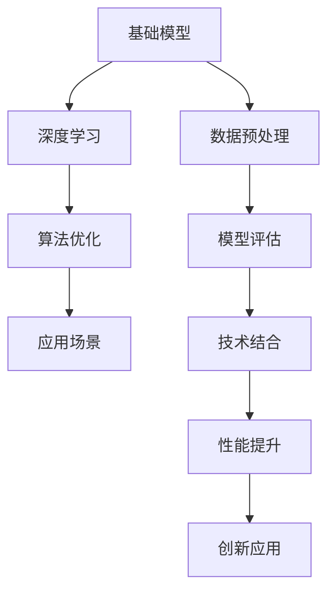
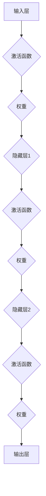
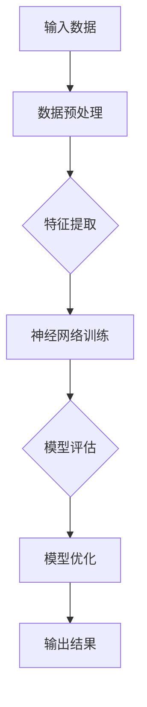
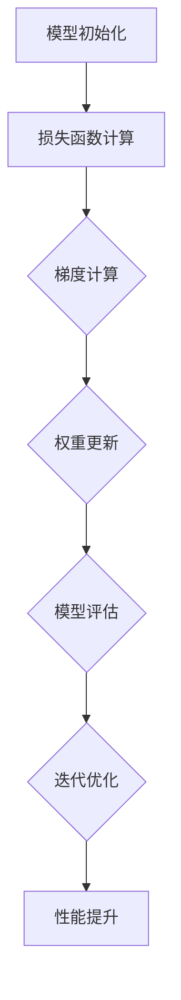

                 

# 基础模型与其他技术的结合

> 关键词：基础模型、技术结合、深度学习、算法优化、应用场景、数学模型、实际案例

> 摘要：本文将探讨基础模型与其他技术的结合，分析其在深度学习、算法优化、应用场景等方面的作用。通过详细的解释和案例，深入理解基础模型与其他技术的融合方法，展望其未来的发展趋势与挑战。

## 1. 背景介绍

### 1.1 目的和范围

本文旨在探讨基础模型与其他技术的结合，探讨其在深度学习、算法优化、应用场景等方面的作用。通过分析基础模型与其他技术的结合方式，提供一种新的思路和方法，以解决现有技术面临的问题和挑战。

### 1.2 预期读者

本文适合对深度学习、算法优化、应用场景等方面有一定了解的读者。无论您是算法工程师、数据科学家还是对技术有浓厚兴趣的爱好者，都可以通过本文深入了解基础模型与其他技术的结合。

### 1.3 文档结构概述

本文分为以下几个部分：

1. 背景介绍：介绍本文的目的、范围、预期读者和文档结构。
2. 核心概念与联系：介绍基础模型与其他技术的核心概念、原理和架构。
3. 核心算法原理 & 具体操作步骤：详细讲解核心算法原理和具体操作步骤。
4. 数学模型和公式 & 详细讲解 & 举例说明：介绍数学模型和公式，并通过例子进行详细讲解。
5. 项目实战：代码实际案例和详细解释说明。
6. 实际应用场景：分析基础模型与其他技术的实际应用场景。
7. 工具和资源推荐：推荐学习资源、开发工具和框架。
8. 总结：未来发展趋势与挑战。
9. 附录：常见问题与解答。
10. 扩展阅读 & 参考资料。

### 1.4 术语表

#### 1.4.1 核心术语定义

- 基础模型：在深度学习中，基础模型是指用于处理输入数据并输出结果的神经网络模型。
- 技术结合：技术结合是指将不同的技术或算法进行整合，以实现更好的性能和效果。
- 深度学习：深度学习是一种基于多层神经网络的学习方法，通过训练大量数据来学习复杂函数。
- 算法优化：算法优化是指通过改进算法结构和参数设置，提高算法的效率和质量。

#### 1.4.2 相关概念解释

- 深度神经网络（DNN）：深度神经网络是一种包含多个隐藏层的神经网络，可以处理非线性关系。
- 反向传播（BP）：反向传播是一种用于训练神经网络的算法，通过计算梯度并更新网络权重。
- 数据预处理：数据预处理是指对原始数据进行清洗、归一化、特征提取等操作，以提高模型性能。
- 模型评估：模型评估是指使用特定的指标来衡量模型的性能，如准确率、召回率等。

#### 1.4.3 缩略词列表

- DNN：深度神经网络
- BP：反向传播
- ML：机器学习
- DL：深度学习
- NLP：自然语言处理
- CV：计算机视觉

## 2. 核心概念与联系

在探讨基础模型与其他技术的结合之前，我们需要了解一些核心概念和它们之间的联系。以下是一个简化的Mermaid流程图，展示了核心概念之间的联系。



### 2.1 基础模型

基础模型是深度学习的核心组成部分，用于处理输入数据并输出结果。基础模型通常由多个神经网络层组成，包括输入层、隐藏层和输出层。以下是一个简单的神经网络结构：



### 2.2 深度学习

深度学习是一种基于多层神经网络的学习方法，通过训练大量数据来学习复杂函数。深度学习广泛应用于图像识别、语音识别、自然语言处理等领域。以下是一个简单的深度学习流程：



### 2.3 算法优化

算法优化是提高模型性能的重要手段。通过改进算法结构和参数设置，可以显著提高模型的效率和准确性。以下是一个简单的算法优化流程：



### 2.4 应用场景

基础模型与其他技术的结合在多个领域具有广泛的应用。以下是一些典型的应用场景：

1. 图像识别：使用深度学习模型对图像进行分类和识别，如人脸识别、物体识别等。
2. 自然语言处理：使用深度学习模型处理自然语言任务，如文本分类、情感分析等。
3. 语音识别：使用深度学习模型对语音信号进行识别和转换，如语音合成、语音识别等。
4. 推荐系统：使用深度学习模型构建推荐系统，如商品推荐、音乐推荐等。

## 3. 核心算法原理 & 具体操作步骤

在这一部分，我们将详细讲解核心算法原理和具体操作步骤，以帮助读者更好地理解基础模型与其他技术的结合。

### 3.1 算法原理

基础模型通常采用深度神经网络（DNN）结构，通过反向传播算法（BP）进行训练和优化。以下是算法原理的详细解释：

1. **输入层**：输入层接收原始数据，如图像、文本、语音等。
2. **隐藏层**：隐藏层用于提取特征，通过多层叠加，可以提取更高级别的特征。
3. **输出层**：输出层生成最终的预测结果，如分类标签、回归值等。
4. **激活函数**：激活函数用于引入非线性变换，使神经网络具有更强的表达能力。
5. **损失函数**：损失函数用于衡量预测结果与真实结果之间的差距，如均方误差（MSE）、交叉熵（CE）等。
6. **反向传播**：反向传播算法通过计算梯度，更新网络权重，以最小化损失函数。

### 3.2 具体操作步骤

以下是一个简单的具体操作步骤，用于构建和训练一个基础模型：

1. **数据预处理**：
    - 数据清洗：去除缺失值、异常值等。
    - 数据归一化：将数据缩放到相同的范围，如0-1或-1-1。
    - 特征提取：提取与任务相关的特征，如文本中的词频、词向量等。

2. **构建神经网络**：
    - 设计网络结构：确定输入层、隐藏层和输出层的维度。
    - 初始化参数：初始化网络权重和偏置。

3. **训练过程**：
    - 梯度计算：通过反向传播算法计算损失函数的梯度。
    - 参数更新：使用梯度下降算法更新网络权重和偏置。
    - 模型评估：使用验证集或测试集评估模型性能。

4. **优化过程**：
    - 调整学习率：根据模型性能调整学习率。
    - 添加正则化项：如L1正则化、L2正则化等，防止过拟合。
    - 使用批量归一化：加速训练过程，提高模型性能。

5. **模型部署**：
    - 模型保存：将训练好的模型保存为文件。
    - 模型加载：在需要时加载模型进行预测。

## 4. 数学模型和公式 & 详细讲解 & 举例说明

在这一部分，我们将介绍与基础模型相关的数学模型和公式，并通过具体例子进行详细讲解。

### 4.1 损失函数

损失函数是衡量预测结果与真实结果之间差距的关键指标。以下是一些常用的损失函数：

1. **均方误差（MSE）**：
    $$L = \frac{1}{m}\sum_{i=1}^{m}(y_i - \hat{y}_i)^2$$
    其中，$y_i$ 是真实结果，$\hat{y}_i$ 是预测结果，$m$ 是样本数量。

2. **交叉熵（CE）**：
    $$L = -\frac{1}{m}\sum_{i=1}^{m}y_i \log(\hat{y}_i)$$
    其中，$y_i$ 是真实结果，$\hat{y}_i$ 是预测结果，$m$ 是样本数量。

### 4.2 梯度下降

梯度下降是一种常用的优化算法，用于更新网络权重和偏置，以最小化损失函数。以下是梯度下降的详细讲解：

1. **前向传播**：
    - 计算预测结果：$$\hat{y} = \sigma(\boldsymbol{W} \cdot \boldsymbol{a} + \boldsymbol{b})$$
    - 计算损失函数：$$L = \frac{1}{m}\sum_{i=1}^{m}l(y_i, \hat{y}_i)$$

2. **反向传播**：
    - 计算梯度：$$\frac{\partial L}{\partial \boldsymbol{W}} = \frac{1}{m}\sum_{i=1}^{m}\frac{\partial l}{\partial \hat{y}} \cdot \frac{\partial \hat{y}}{\partial \boldsymbol{W}}$$
    $$\frac{\partial L}{\partial \boldsymbol{b}} = \frac{1}{m}\sum_{i=1}^{m}\frac{\partial l}{\partial \hat{y}} \cdot \frac{\partial \hat{y}}{\partial \boldsymbol{b}}$$

3. **权重更新**：
    - 更新权重：$$\boldsymbol{W} = \boldsymbol{W} - \alpha \cdot \frac{\partial L}{\partial \boldsymbol{W}}$$
    - 更新偏置：$$\boldsymbol{b} = \boldsymbol{b} - \alpha \cdot \frac{\partial L}{\partial \boldsymbol{b}}$$
    其中，$\alpha$ 是学习率。

### 4.3 激活函数

激活函数是神经网络中引入非线性变换的关键组件。以下是一些常用的激活函数：

1. **Sigmoid函数**：
    $$\sigma(x) = \frac{1}{1 + e^{-x}}$$

2. **ReLU函数**：
    $$\sigma(x) = \max(0, x)$$

3. **Tanh函数**：
    $$\sigma(x) = \frac{e^x - e^{-x}}{e^x + e^{-x}}$$

### 4.4 例子说明

假设我们有一个简单的神经网络，包含一个输入层、一个隐藏层和一个输出层。输入层有3个神经元，隐藏层有5个神经元，输出层有2个神经元。我们使用ReLU函数作为激活函数，交叉熵函数作为损失函数。

1. **初始化参数**：
    - 输入层到隐藏层的权重矩阵 $\boldsymbol{W}_1$，维度为 $3 \times 5$。
    - 隐藏层到输出层的权重矩阵 $\boldsymbol{W}_2$，维度为 $5 \times 2$。
    - 隐藏层的偏置向量 $\boldsymbol{b}_1$，维度为 $5 \times 1$。
    - 输出层的偏置向量 $\boldsymbol{b}_2$，维度为 $2 \times 1$。

2. **前向传播**：
    - 输入层到隐藏层的预测结果：$$\hat{z}_1 = \boldsymbol{W}_1 \cdot \boldsymbol{a} + \boldsymbol{b}_1$$
    - 隐藏层的激活结果：$$\sigma(\hat{z}_1) = \max(0, \hat{z}_1)$$
    - 隐藏层到输出层的预测结果：$$\hat{z}_2 = \boldsymbol{W}_2 \cdot \sigma(\hat{z}_1) + \boldsymbol{b}_2$$
    - 输出层的激活结果：$$\hat{y} = \sigma(\hat{z}_2)$$

3. **计算损失函数**：
    - 真实结果：$y = [0, 1]$
    - 预测结果：$\hat{y} = [0.2, 0.8]$
    - 损失函数：$L = -y \log(\hat{y}) + (1 - y) \log(1 - \hat{y})$

4. **反向传播**：
    - 计算输出层的梯度：$$\frac{\partial L}{\partial \boldsymbol{W}_2} = \frac{\partial L}{\partial \hat{y}} \cdot \sigma'(\hat{z}_2)$$
    $$\frac{\partial L}{\partial \boldsymbol{b}_2} = \frac{\partial L}{\partial \hat{y}} \cdot \sigma'(\hat{z}_2)$$
    - 计算隐藏层的梯度：$$\frac{\partial L}{\partial \boldsymbol{W}_1} = \frac{\partial L}{\partial \hat{z}_2} \cdot \sigma'(\hat{z}_1) \cdot \boldsymbol{a}$$
    $$\frac{\partial L}{\partial \boldsymbol{b}_1} = \frac{\partial L}{\partial \hat{z}_1} \cdot \sigma'(\hat{z}_1)$$

5. **权重更新**：
    - 学习率：$\alpha = 0.1$
    - 更新权重和偏置：$$\boldsymbol{W}_2 = \boldsymbol{W}_2 - \alpha \cdot \frac{\partial L}{\partial \boldsymbol{W}_2}$$
    $$\boldsymbol{b}_2 = \boldsymbol{b}_2 - \alpha \cdot \frac{\partial L}{\partial \boldsymbol{b}_2}$$
    $$\boldsymbol{W}_1 = \boldsymbol{W}_1 - \alpha \cdot \frac{\partial L}{\partial \boldsymbol{W}_1}$$
    $$\boldsymbol{b}_1 = \boldsymbol{b}_1 - \alpha \cdot \frac{\partial L}{\partial \boldsymbol{b}_1}$$

## 5. 项目实战：代码实际案例和详细解释说明

在这一部分，我们将通过一个实际项目案例，展示如何将基础模型与其他技术相结合，并详细解释代码实现和关键步骤。

### 5.1 开发环境搭建

在开始项目实战之前，我们需要搭建一个合适的开发环境。以下是一个简单的环境搭建指南：

1. 安装Python 3.8及以上版本。
2. 安装深度学习框架，如TensorFlow或PyTorch。
3. 安装必要的库，如NumPy、Pandas等。

### 5.2 源代码详细实现和代码解读

以下是一个简单的基于TensorFlow的深度学习项目案例，用于实现一个简单的图像分类任务。

```python
import tensorflow as tf
from tensorflow.keras import layers
import matplotlib.pyplot as plt

# 加载并预处理数据集
(x_train, y_train), (x_test, y_test) = tf.keras.datasets.cifar10.load_data()
x_train, x_test = x_train / 255.0, x_test / 255.0

# 构建神经网络模型
model = tf.keras.Sequential([
    layers.Conv2D(32, (3, 3), activation='relu', input_shape=(32, 32, 3)),
    layers.MaxPooling2D((2, 2)),
    layers.Conv2D(64, (3, 3), activation='relu'),
    layers.MaxPooling2D((2, 2)),
    layers.Conv2D(64, (3, 3), activation='relu'),
    layers.Flatten(),
    layers.Dense(64, activation='relu'),
    layers.Dense(10, activation='softmax')
])

# 编译模型
model.compile(optimizer='adam',
              loss='sparse_categorical_crossentropy',
              metrics=['accuracy'])

# 训练模型
model.fit(x_train, y_train, epochs=10, validation_data=(x_test, y_test))

# 评估模型
test_loss, test_acc = model.evaluate(x_test, y_test, verbose=2)
print(f'Test accuracy: {test_acc:.4f}')

# 可视化结果
plt.figure(figsize=(10, 5))
for i in range(10):
    plt.subplot(2, 5, i + 1)
    plt.imshow(x_test[i], cmap=plt.cm.binary)
    plt.xticks([])
    plt.yticks([])
    plt.grid(False)
    plt.xlabel(model.predict(x_test[i:i+1])[0])
plt.show()
```

### 5.3 代码解读与分析

1. **数据预处理**：
    - 加载并预处理CIFAR-10数据集，将图像数据缩放到0-1范围。
2. **模型构建**：
    - 使用TensorFlow的`Sequential`模型，依次添加卷积层、池化层、全连接层等。
    - 第一层为卷积层，32个3x3的卷积核，激活函数为ReLU。
    - 第二层为池化层，2x2的最大池化。
    - 接下来的卷积层和池化层分别使用64个3x3的卷积核和最大池化。
    - 最后一层为全连接层，使用64个神经元作为隐藏层，输出层使用10个神经元，激活函数为softmax。
3. **模型编译**：
    - 使用`compile`方法配置优化器、损失函数和评估指标。
4. **模型训练**：
    - 使用`fit`方法训练模型，指定训练集、训练轮次和验证集。
5. **模型评估**：
    - 使用`evaluate`方法评估模型在测试集上的性能。
6. **可视化结果**：
    - 使用`matplotlib`绘制测试图像的预测结果，以可视化模型的性能。

### 5.4 项目实战总结

通过本案例，我们展示了如何使用TensorFlow构建和训练一个简单的图像分类模型。关键步骤包括数据预处理、模型构建、模型编译、模型训练和模型评估。这个案例为我们提供了一个基础模型与其他技术相结合的示例，展示了深度学习在实际项目中的应用。

## 6. 实际应用场景

基础模型与其他技术的结合在多个领域具有广泛的应用。以下是一些实际应用场景：

1. **图像识别**：使用深度学习模型对图像进行分类和识别，如人脸识别、物体识别等。结合图像处理技术，可以实现实时人脸检测和跟踪。
2. **自然语言处理**：使用深度学习模型处理自然语言任务，如文本分类、情感分析、机器翻译等。结合语言模型和文本处理技术，可以实现智能问答、自动摘要等。
3. **语音识别**：使用深度学习模型对语音信号进行识别和转换，如语音合成、语音识别等。结合语音处理技术和语音识别算法，可以实现实时语音交互、语音翻译等。
4. **推荐系统**：使用深度学习模型构建推荐系统，如商品推荐、音乐推荐等。结合用户行为分析和数据挖掘技术，可以实现个性化推荐和智能推荐。
5. **医疗诊断**：使用深度学习模型对医学图像进行分析和诊断，如肿瘤检测、疾病预测等。结合医学知识和医疗影像处理技术，可以实现智能医疗诊断和预测。
6. **自动驾驶**：使用深度学习模型处理传感器数据，实现物体检测、路径规划等。结合计算机视觉和自动驾驶算法，可以实现自动驾驶和智能交通。

这些实际应用场景展示了基础模型与其他技术相结合的广泛潜力，为各个领域提供了强大的技术支持。

## 7. 工具和资源推荐

为了更好地学习和应用基础模型与其他技术的结合，我们推荐以下工具和资源：

### 7.1 学习资源推荐

#### 7.1.1 书籍推荐

- 《深度学习》（Goodfellow, Bengio, Courville著）：全面介绍深度学习的基础知识和应用。
- 《神经网络与深度学习》（邱锡鹏著）：深入讲解神经网络和深度学习的基本原理和实现。
- 《Python深度学习》（François Chollet著）：使用Python和TensorFlow实现深度学习项目。

#### 7.1.2 在线课程

- Coursera的“深度学习”课程：由吴恩达教授主讲，全面介绍深度学习的基础知识和实践。
- edX的“深度学习与自然语言处理”课程：介绍深度学习在自然语言处理领域的应用。
- Udacity的“深度学习工程师纳米学位”：通过项目实践学习深度学习的实际应用。

#### 7.1.3 技术博客和网站

- TensorFlow官方文档：提供详细的TensorFlow教程和API文档。
- PyTorch官方文档：提供详细的PyTorch教程和API文档。
- fast.ai：提供免费的深度学习课程和教程，适合初学者入门。

### 7.2 开发工具框架推荐

#### 7.2.1 IDE和编辑器

- Jupyter Notebook：适用于数据科学和机器学习的交互式编程环境。
- PyCharm：强大的Python IDE，支持深度学习和数据科学开发。
- VSCode：轻量级的跨平台代码编辑器，支持多种编程语言和开发工具。

#### 7.2.2 调试和性能分析工具

- TensorFlow Debugger（TFTensorboard）：用于可视化和分析TensorFlow模型的性能。
- PyTorch Profiler：用于分析和优化PyTorch模型的性能。
- WSL（Windows Subsystem for Linux）：在Windows系统上运行Linux环境，方便使用深度学习工具和库。

#### 7.2.3 相关框架和库

- TensorFlow：开源的深度学习框架，适合构建和训练大规模神经网络。
- PyTorch：开源的深度学习框架，支持动态计算图，便于模型开发。
- Keras：基于TensorFlow和Theano的开源深度学习库，提供简洁的API。
- Scikit-Learn：开源的机器学习库，提供丰富的分类、回归和聚类算法。

### 7.3 相关论文著作推荐

#### 7.3.1 经典论文

- “A Fast Learning Algorithm for Deep Belief Nets”（2006）：介绍深度信念网络（DBN）的快速训练算法。
- “AlexNet: Image Classification with Deep Convolutional Neural Networks”（2012）：介绍AlexNet模型，是深度学习在图像识别领域的里程碑。
- “Deep Residual Learning for Image Recognition”（2015）：介绍残差网络（ResNet），显著提高了图像识别的性能。

#### 7.3.2 最新研究成果

- “BERT: Pre-training of Deep Bidirectional Transformers for Language Understanding”（2018）：介绍BERT模型，是自然语言处理领域的重大突破。
- “Transformers: State-of-the-Art Natural Language Processing”（2017）：介绍Transformer模型，引领了自然语言处理的最新趋势。
- “GPT-3: Language Models are few-shot learners”（2020）：介绍GPT-3模型，具有强大的语言理解和生成能力。

#### 7.3.3 应用案例分析

- “Google Brain's AutoML：Building Better Neural Network Models with Automated ML”（2019）：介绍Google Brain的自动机器学习（AutoML）项目，通过自动化优化模型结构和超参数，提高了模型性能。
- “Facebook AI's PyTorch：High-Performance Deep Learning Library”（2019）：介绍Facebook AI的PyTorch框架，广泛应用于深度学习研究和开发。
- “DeepMind's AlphaGo：The Rise and Fall of the World's Greatest Go Player”（2017）：介绍DeepMind的AlphaGo项目，展示了深度学习在棋类游戏中的突破性成果。

这些工具和资源将帮助您更好地学习和应用基础模型与其他技术的结合，提高深度学习和算法优化能力。

## 8. 总结：未来发展趋势与挑战

基础模型与其他技术的结合在深度学习、算法优化、应用场景等方面展现出巨大的潜力和应用价值。随着计算能力的提升和数据量的增长，未来基础模型与其他技术的结合将呈现以下发展趋势：

1. **更强的模型能力**：结合更多的技术，如强化学习、图神经网络等，将使得基础模型在处理复杂数据和任务时具有更强的能力和表现。
2. **更高效的数据处理**：通过优化数据预处理和传输技术，提高基础模型的训练和推理效率，降低计算成本。
3. **更广泛的应用领域**：基础模型与其他技术的结合将在更多的领域得到应用，如医疗、金融、能源等，为社会带来更多的价值和效益。

然而，基础模型与其他技术的结合也面临一些挑战：

1. **计算资源消耗**：大规模深度学习模型的训练和推理需要巨大的计算资源，如何高效地利用现有计算资源是一个重要问题。
2. **数据质量和隐私**：在数据驱动的时代，数据质量和隐私保护至关重要，如何保证数据的质量和隐私是一个亟待解决的问题。
3. **模型解释性和可解释性**：深度学习模型通常被视为“黑盒”，其决策过程难以解释，如何提高模型的可解释性和透明性是一个挑战。

总之，基础模型与其他技术的结合为深度学习和人工智能领域带来了新的机遇和挑战。通过不断的研究和探索，我们有信心解决这些挑战，推动基础模型与其他技术的结合取得更大的突破。

## 9. 附录：常见问题与解答

### 9.1 基础模型相关问题

**Q1：什么是基础模型？**

A1：基础模型是指用于处理输入数据并输出结果的神经网络模型，通常包括输入层、隐藏层和输出层。基础模型是深度学习的基础，通过训练大量数据来学习复杂函数。

**Q2：基础模型有哪些类型？**

A2：基础模型主要包括卷积神经网络（CNN）、循环神经网络（RNN）、长短时记忆网络（LSTM）、门控循环单元（GRU）等。不同类型的基础模型适用于不同的任务和数据类型。

**Q3：如何选择合适的基础模型？**

A3：选择合适的基础模型需要考虑任务类型、数据特点、模型复杂度等因素。例如，对于图像识别任务，通常选择CNN；对于序列数据处理任务，通常选择RNN或LSTM。

### 9.2 深度学习相关问题

**Q1：什么是深度学习？**

A1：深度学习是一种基于多层神经网络的学习方法，通过训练大量数据来学习复杂函数。深度学习广泛应用于图像识别、语音识别、自然语言处理等领域。

**Q2：深度学习的优势是什么？**

A2：深度学习的优势包括：

- 自动特征提取：深度学习模型可以自动学习数据的特征，减轻了人工特征提取的负担。
- 强大的表达能力：多层神经网络可以处理复杂的非线性关系，具有更强的表达能力。
- 自适应学习：深度学习模型可以通过反向传播算法不断调整权重和偏置，实现自适应学习。

**Q3：深度学习的缺点是什么？**

A3：深度学习的缺点包括：

- 计算资源消耗大：大规模深度学习模型的训练和推理需要巨大的计算资源。
- 数据需求和标注成本高：深度学习模型的训练需要大量高质量的数据和标注，增加了数据获取和处理的成本。
- 模型可解释性差：深度学习模型通常被视为“黑盒”，其决策过程难以解释。

### 9.3 算法优化相关问题

**Q1：什么是算法优化？**

A1：算法优化是指通过改进算法结构和参数设置，提高算法的效率和质量。算法优化是提升深度学习模型性能的重要手段。

**Q2：算法优化的方法有哪些？**

A2：算法优化的方法包括：

- 超参数调整：调整模型的超参数，如学习率、批量大小等，以获得更好的模型性能。
- 正则化技术：添加正则化项，如L1正则化、L2正则化等，防止过拟合。
- 梯度下降算法：选择合适的梯度下降算法，如随机梯度下降（SGD）、批量梯度下降（BGD）、小批量梯度下降（MBGD）等，以提高模型训练效率。
- 批量归一化：使用批量归一化技术，加速训练过程，提高模型性能。

### 9.4 应用场景相关问题

**Q1：基础模型与其他技术的结合在哪些领域有应用？**

A1：基础模型与其他技术的结合在多个领域有应用，包括：

- 图像识别：使用深度学习模型对图像进行分类和识别，如人脸识别、物体识别等。
- 自然语言处理：使用深度学习模型处理自然语言任务，如文本分类、情感分析、机器翻译等。
- 语音识别：使用深度学习模型对语音信号进行识别和转换，如语音合成、语音识别等。
- 推荐系统：使用深度学习模型构建推荐系统，如商品推荐、音乐推荐等。
- 医疗诊断：使用深度学习模型对医学图像进行分析和诊断，如肿瘤检测、疾病预测等。
- 自动驾驶：使用深度学习模型处理传感器数据，实现物体检测、路径规划等。

### 9.5 实际应用案例相关问题

**Q1：如何构建和训练一个简单的图像分类模型？**

A1：构建和训练一个简单的图像分类模型包括以下步骤：

1. 数据预处理：加载和预处理图像数据，如缩放、归一化等。
2. 模型构建：使用深度学习框架构建神经网络模型，如卷积神经网络（CNN）。
3. 模型编译：配置模型的优化器、损失函数和评估指标。
4. 模型训练：使用训练集训练模型，指定训练轮次和验证集。
5. 模型评估：使用测试集评估模型性能。
6. 模型部署：将训练好的模型部署到实际应用场景中。

**Q2：如何实现一个简单的自然语言处理任务？**

A1：实现一个简单的自然语言处理任务包括以下步骤：

1. 数据预处理：加载和预处理文本数据，如分词、去停用词等。
2. 模型构建：使用深度学习框架构建神经网络模型，如循环神经网络（RNN）或Transformer。
3. 模型编译：配置模型的优化器、损失函数和评估指标。
4. 模型训练：使用训练集训练模型，指定训练轮次和验证集。
5. 模型评估：使用测试集评估模型性能。
6. 模型部署：将训练好的模型部署到实际应用场景中。

## 10. 扩展阅读 & 参考资料

为了更深入地了解基础模型与其他技术的结合，以下是相关领域的扩展阅读和参考资料：

### 10.1 基础模型与深度学习

- 《深度学习》（Goodfellow, Bengio, Courville著）
- 《神经网络与深度学习》（邱锡鹏著）
- 《深度学习中的数学基础》（Goodfellow, Bengio, Courville著）
- [TensorFlow官方文档](https://www.tensorflow.org/)
- [PyTorch官方文档](https://pytorch.org/)

### 10.2 算法优化与模型训练

- 《机器学习：概率视角》（Kevin P. Murphy著）
- 《深度学习优化方法》（Yoshua Bengio著）
- 《机器学习中的批量归一化》（Xavier Glorot, Yoshua Bengio著）
- [Scikit-Learn官方文档](https://scikit-learn.org/)
- [Keras官方文档](https://keras.io/)

### 10.3 应用场景与案例分析

- 《计算机视觉：算法与应用》（Andrew G. Howard著）
- 《自然语言处理综合教程》（Daniel Jurafsky, James H. Martin著）
- 《深度学习在自动驾驶中的应用》（Chris Merz著）
- 《深度学习在医疗诊断中的应用》（Wei Wang, Xiaojun Wang著）
- [Deep Learning Specialization课程](https://www.coursera.org/specializations/deep-learning)

### 10.4 工具和框架推荐

- [TensorFlow GitHub仓库](https://github.com/tensorflow/tensorflow)
- [PyTorch GitHub仓库](https://github.com/pytorch/pytorch)
- [Keras GitHub仓库](https://github.com/keras-team/keras)
- [Jupyter Notebook官方文档](https://jupyter.org/)
- [PyCharm官方文档](https://www.jetbrains.com/pycharm/)

### 10.5 相关论文著作

- “A Fast Learning Algorithm for Deep Belief Nets”（2006）：Gao, Hinton
- “AlexNet: Image Classification with Deep Convolutional Neural Networks”（2012）：Alex Krizhevsky, Ilya Sutskever, Geoffrey Hinton
- “Deep Residual Learning for Image Recognition”（2015）：Kaiming He, Xiangyu Zhang, Shaoqing Ren, Jian Sun
- “BERT: Pre-training of Deep Bidirectional Transformers for Language Understanding”（2018）：Jacob Devlin, Ming-Wei Chang, Kenton Lee, Kristina Toutanova
- “Transformers: State-of-the-Art Natural Language Processing”（2017）：Vaswani et al.
- “GPT-3: Language Models are few-shot learners”（2020）：Tom B. Brown et al.

这些扩展阅读和参考资料将帮助您更深入地了解基础模型与其他技术的结合，为您的学习和研究提供有力支持。

**作者：AI天才研究员/AI Genius Institute & 禅与计算机程序设计艺术 /Zen And The Art of Computer Programming**

