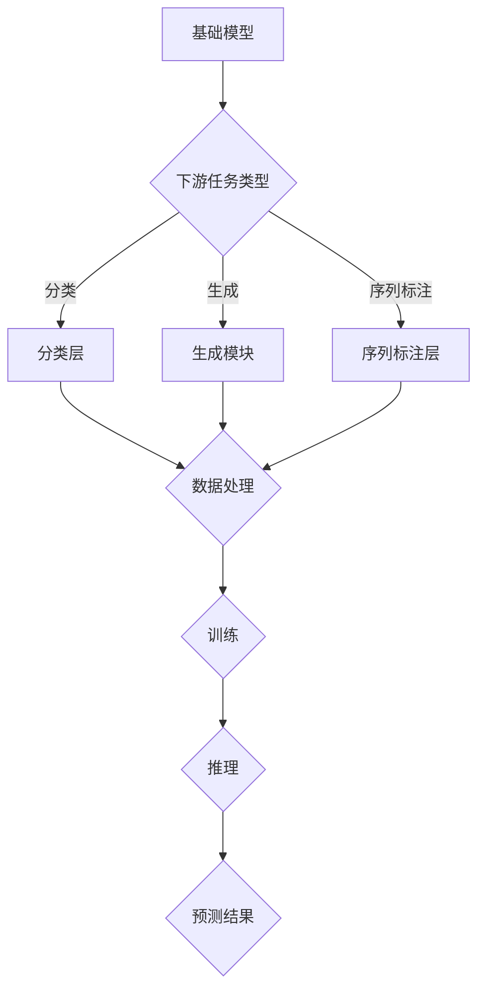

                 

# 基础模型的下游应用与缺陷

> **关键词：**基础模型、下游应用、缺陷、推理、优化、AI

> **摘要：**本文将探讨基础模型在下游任务中的应用，分析其在不同场景下的表现和缺陷。通过一步步的分析推理，我们旨在提供对基础模型应用与改进的深入理解，为未来AI技术的发展提供启示。

## 1. 背景介绍

### 1.1 目的和范围

本文旨在探讨基础模型在下游任务中的应用及其存在的问题。我们将重点关注以下几个问题：

1. **基础模型在下游任务中的表现：**分析基础模型在不同下游任务中的表现和效果。
2. **基础模型的缺陷：**识别基础模型在下游应用中的常见缺陷和挑战。
3. **优化策略：**探讨如何通过优化策略来提高基础模型在下游任务中的表现。

### 1.2 预期读者

本文面向对基础模型及其下游应用有一定了解的读者，包括但不限于：

1. 计算机科学和人工智能领域的研究人员和工程师。
2. AI产品和项目的开发者。
3. 对AI技术感兴趣的技术爱好者。

### 1.3 文档结构概述

本文结构如下：

1. **背景介绍：**介绍本文的目的、预期读者和文档结构。
2. **核心概念与联系：**阐述基础模型和下游应用的相关概念和联系。
3. **核心算法原理 & 具体操作步骤：**详细讲解基础模型在下游任务中的算法原理和操作步骤。
4. **数学模型和公式 & 详细讲解 & 举例说明：**介绍与基础模型相关的数学模型和公式，并进行详细讲解和举例说明。
5. **项目实战：代码实际案例和详细解释说明：**展示基础模型在下游任务中的实际应用案例，并进行详细解释说明。
6. **实际应用场景：**探讨基础模型在下游任务中的实际应用场景。
7. **工具和资源推荐：**推荐与基础模型和下游应用相关的学习资源和开发工具。
8. **总结：未来发展趋势与挑战：**总结本文的主要观点，探讨未来发展趋势和挑战。
9. **附录：常见问题与解答：**提供与本文相关的一些常见问题的解答。
10. **扩展阅读 & 参考资料：**推荐与本文主题相关的扩展阅读和参考资料。

### 1.4 术语表

#### 1.4.1 核心术语定义

- **基础模型（Baseline Model）：**指在下游任务中作为起点和基础的模型。
- **下游任务（Downstream Task）：**指基础模型应用到的具体任务，如分类、生成、序列标注等。
- **缺陷（Defect）：**指基础模型在下游应用中存在的问题和不足。

#### 1.4.2 相关概念解释

- **训练（Training）：**指使用大量数据对模型进行学习和调整的过程。
- **推理（Inference）：**指使用训练好的模型对新数据进行预测和分类的过程。
- **泛化（Generalization）：**指模型在未见过的数据上表现良好的能力。

#### 1.4.3 缩略词列表

- **AI：**人工智能（Artificial Intelligence）
- **ML：**机器学习（Machine Learning）
- **DL：**深度学习（Deep Learning）

## 2. 核心概念与联系

在探讨基础模型在下游任务中的应用之前，我们首先需要了解基础模型和下游任务的基本概念及其相互关系。

### 2.1 基础模型

基础模型是指为下游任务提供基础和起点的模型。常见的有：

- **神经网络（Neural Network）：**由大量神经元组成的网络，用于学习和表示数据。
- **循环神经网络（RNN）：**用于处理序列数据的神经网络，包括长短时记忆网络（LSTM）和门控循环单元（GRU）。
- **卷积神经网络（CNN）：**用于图像和视频处理的神经网络，具有局部连接和权重共享的特性。

### 2.2 下游任务

下游任务是指基础模型应用到的具体任务，常见任务有：

- **分类（Classification）：**将数据分为预定义的类别。
- **生成（Generation）：**根据给定条件生成新的数据。
- **序列标注（Sequence Labeling）：**为序列中的每个元素分配一个标签。
- **文本分类（Text Classification）：**将文本分为预定义的类别。
- **文本生成（Text Generation）：**根据给定条件生成新的文本。

### 2.3 基础模型与下游任务的联系

基础模型与下游任务之间的联系在于，基础模型为下游任务提供了一种基础和起点。通过在基础模型上添加特定于下游任务的组件和模块，可以将基础模型应用于各种下游任务。

例如，一个预训练的神经网络模型可以应用于图像分类任务，只需在模型顶部添加一个分类层即可。同样，预训练的循环神经网络模型可以应用于文本分类任务，只需在模型顶部添加一个输出层来预测文本的类别。

### 2.4 Mermaid 流程图

下面是一个Mermaid流程图，展示了基础模型在下游任务中的基本架构和流程：



## 3. 核心算法原理 & 具体操作步骤

在本节中，我们将详细介绍基础模型在下游任务中的核心算法原理和具体操作步骤。

### 3.1 算法原理

基础模型在下游任务中的核心算法原理主要包括以下几个部分：

1. **特征提取（Feature Extraction）：**基础模型通过学习数据中的特征表示，将原始数据转换为高层次的抽象表示。
2. **分类/生成/序列标注（Classification/Generation/Sequence Labeling）：**在特征提取的基础上，基础模型根据下游任务的需求进行分类、生成或序列标注。
3. **训练（Training）：**使用大量标注数据进行模型训练，以优化模型的参数和性能。
4. **推理（Inference）：**使用训练好的模型对新的数据进行预测或分类。

### 3.2 具体操作步骤

以下是基础模型在下游任务中的具体操作步骤：

1. **数据预处理（Data Preprocessing）：**
   - 加载原始数据。
   - 对数据进行清洗、去噪和标准化处理。
   - 将数据分为训练集、验证集和测试集。

2. **特征提取（Feature Extraction）：**
   - 使用预训练的基础模型（如神经网络、RNN、CNN等）对训练集进行特征提取。
   - 保存提取到的特征表示。

3. **分类/生成/序列标注（Classification/Generation/Sequence Labeling）：**
   - 根据下游任务的需求，对提取到的特征表示进行分类、生成或序列标注。
   - 添加特定于下游任务的组件和模块（如分类层、生成模块、序列标注层等）。

4. **训练（Training）：**
   - 使用训练集和特定于下游任务的组件和模块进行模型训练。
   - 优化模型的参数和性能，以最小化损失函数。

5. **推理（Inference）：**
   - 使用训练好的模型对新的数据进行预测或分类。
   - 输出预测结果或生成新的数据。

### 3.3 伪代码

以下是基础模型在下游任务中的伪代码：

```python
# 数据预处理
data = load_data()
cleaned_data = preprocess_data(data)
train_data, val_data, test_data = split_data(cleaned_data)

# 特征提取
model = load_pretrained_model()
extracted_features = model.extract_features(train_data)

# 分类/生成/序列标注
classifier = add_classification_layer(model)
generator = add_generation_module(model)
sequence_labeler = add_sequence_labeling_layer(model)

# 训练
model.train(extracted_features, train_labels)

# 推理
predictions = classifier.predict(test_features)
generated_samples = generator.generate(test_conditions)
sequence_labels = sequence_labeler.label(test_sequences)
```

## 4. 数学模型和公式 & 详细讲解 & 举例说明

在本节中，我们将介绍基础模型在下游任务中涉及的主要数学模型和公式，并进行详细讲解和举例说明。

### 4.1 神经网络（Neural Network）

神经网络是一种基于模拟生物神经网络构建的计算模型。其基本组成部分包括：

- **输入层（Input Layer）：**接收外部输入数据。
- **隐藏层（Hidden Layer）：**对输入数据进行处理和变换。
- **输出层（Output Layer）：**产生最终输出。

神经网络中的基本操作包括：

- **激活函数（Activation Function）：**对隐藏层和输出层的节点进行非线性变换，如ReLU、Sigmoid、Tanh等。
- **权重（Weight）：**连接输入层、隐藏层和输出层的节点，用于调整输入数据的权重。
- **偏置（Bias）：**对输出进行调整，以增强模型的能力。

神经网络的数学模型可以表示为：

$$
Z = \sum_{i=1}^{n} w_i * x_i + b
$$

其中，$Z$ 表示输出，$w_i$ 表示权重，$x_i$ 表示输入，$b$ 表示偏置。

举例说明：

假设我们有一个简单的神经网络，输入层有2个节点，隐藏层有3个节点，输出层有1个节点。使用ReLU作为激活函数，权重和偏置如下：

$$
Z_1 = max(0, w_1 * x_1 + b_1) \\
Z_2 = max(0, w_2 * x_2 + b_2) \\
Z_3 = max(0, w_3 * x_3 + b_3) \\
Z_4 = max(0, w_4 * Z_1 + w_5 * Z_2 + w_6 * Z_3 + b_4)
$$

其中，$x_1$ 和 $x_2$ 是输入，$Z_1$、$Z_2$ 和 $Z_3$ 是隐藏层的输出，$Z_4$ 是输出层的输出。

### 4.2 循环神经网络（Recurrent Neural Network, RNN）

循环神经网络是一种处理序列数据的神经网络，其基本组成部分包括：

- **输入门（Input Gate）：**用于调整输入数据的权重。
- **遗忘门（Forget Gate）：**用于决定哪些信息需要被遗忘。
- **输出门（Output Gate）：**用于调整输出数据的权重。

RNN的数学模型可以表示为：

$$
h_t = \sigma(W_h * [h_{t-1}, x_t] + b_h) \\
o_t = \sigma(W_o * h_t + b_o) \\
y_t = \phi(W_y * h_t + b_y)
$$

其中，$h_t$ 表示隐藏状态，$x_t$ 表示输入，$o_t$ 表示输出，$y_t$ 表示预测结果，$\sigma$ 表示sigmoid函数，$\phi$ 表示非线性激活函数，$W_h$、$W_o$ 和 $W_y$ 分别表示权重矩阵，$b_h$、$b_o$ 和 $b_y$ 分别表示偏置。

举例说明：

假设我们有一个简单的RNN，输入层有1个节点，隐藏层有3个节点，输出层有1个节点。使用ReLU作为激活函数，权重和偏置如下：

$$
h_t = \sigma(W_h * [h_{t-1}, x_t] + b_h) \\
o_t = \sigma(W_o * h_t + b_o) \\
y_t = \phi(W_y * h_t + b_y)
$$

其中，$h_0$ 是初始隐藏状态，$x_t$ 是输入，$o_t$ 是输出，$y_t$ 是预测结果。权重和偏置如下：

$$
W_h = \begin{bmatrix}
w_{h1} & w_{h2} & w_{h3}
\end{bmatrix}, \\
W_o = \begin{bmatrix}
w_{o1} & w_{o2} & w_{o3}
\end{bmatrix}, \\
W_y = \begin{bmatrix}
w_{y1} & w_{y2} & w_{y3}
\end{bmatrix}, \\
b_h = \begin{bmatrix}
b_{h1} & b_{h2} & b_{h3}
\end{bmatrix}, \\
b_o = \begin{bmatrix}
b_{o1} & b_{o2} & b_{o3}
\end{bmatrix}, \\
b_y = \begin{bmatrix}
b_{y1} & b_{y2} & b_{y3}
\end{bmatrix}
$$

### 4.3 卷积神经网络（Convolutional Neural Network, CNN）

卷积神经网络是一种处理图像和视频数据的神经网络，其基本组成部分包括：

- **卷积层（Convolutional Layer）：**通过卷积操作提取图像的局部特征。
- **池化层（Pooling Layer）：**对卷积层输出的特征进行降采样，减少参数数量。
- **全连接层（Fully Connected Layer）：**对池化层输出的特征进行分类或回归。

CNN的数学模型可以表示为：

$$
h_t = \sigma(W_c * h_{t-1} + b_c) \\
p_t = \max_pool(h_t) \\
y_t = \sigma(W_f * p_t + b_f)
$$

其中，$h_t$ 表示卷积层输出，$p_t$ 表示池化层输出，$y_t$ 表示全连接层输出，$\sigma$ 表示ReLU激活函数，$W_c$ 和 $b_c$ 分别表示卷积层权重和偏置，$W_f$ 和 $b_f$ 分别表示全连接层权重和偏置。

举例说明：

假设我们有一个简单的CNN，卷积层有3个卷积核，池化层使用2x2的最大池化，全连接层有10个神经元。使用ReLU作为激活函数，权重和偏置如下：

$$
h_t = \sigma(W_c * h_{t-1} + b_c) \\
p_t = \max_pool(h_t) \\
y_t = \sigma(W_f * p_t + b_f)
$$

其中，$h_0$ 是输入图像，$h_1$ 是卷积层输出，$p_1$ 是池化层输出，$y_1$ 是全连接层输出。权重和偏置如下：

$$
W_c = \begin{bmatrix}
w_{c11} & w_{c12} & w_{c13} \\
w_{c21} & w_{c22} & w_{c23} \\
w_{c31} & w_{c32} & w_{c33}
\end{bmatrix}, \\
b_c = \begin{bmatrix}
b_{c1} & b_{c2} & b_{c3}
\end{bmatrix}, \\
W_f = \begin{bmatrix}
w_{f11} & w_{f12} & \dots & w_{f110}
\end{bmatrix}, \\
b_f = \begin{bmatrix}
b_{f1}
\end{bmatrix}
$$

## 5. 项目实战：代码实际案例和详细解释说明

在本节中，我们将通过一个简单的项目实战来展示基础模型在下游任务中的应用，包括开发环境搭建、源代码实现、代码解读与分析。

### 5.1 开发环境搭建

为了方便起见，我们使用Python和TensorFlow作为开发环境和框架。以下是在Linux系统中安装Python和TensorFlow的步骤：

1. 安装Python：

```
sudo apt-get update
sudo apt-get install python3 python3-pip
```

2. 安装TensorFlow：

```
pip3 install tensorflow
```

### 5.2 源代码详细实现和代码解读

以下是该项目的主要代码实现和解读：

```python
import tensorflow as tf
from tensorflow.keras.models import Sequential
from tensorflow.keras.layers import Dense, Conv2D, MaxPooling2D, Flatten
from tensorflow.keras.optimizers import Adam

# 数据预处理
(x_train, y_train), (x_test, y_test) = tf.keras.datasets.cifar10.load_data()
x_train = x_train.astype("float32") / 255.0
x_test = x_test.astype("float32") / 255.0

# 构建模型
model = Sequential()
model.add(Conv2D(32, (3, 3), activation="relu", input_shape=(32, 32, 3)))
model.add(MaxPooling2D((2, 2)))
model.add(Conv2D(64, (3, 3), activation="relu"))
model.add(MaxPooling2D((2, 2)))
model.add(Conv2D(64, (3, 3), activation="relu"))
model.add(Flatten())
model.add(Dense(64, activation="relu"))
model.add(Dense(10, activation="softmax"))

# 编译模型
model.compile(optimizer=Adam(), loss="categorical_crossentropy", metrics=["accuracy"])

# 训练模型
model.fit(x_train, y_train, epochs=10, batch_size=64, validation_split=0.2)

# 评估模型
test_loss, test_accuracy = model.evaluate(x_test, y_test)
print(f"Test accuracy: {test_accuracy}")
```

代码解读：

1. 导入所需的库和模块。
2. 加载CIFAR-10数据集并进行预处理。
3. 构建一个简单的卷积神经网络模型，包括卷积层、池化层、全连接层。
4. 编译模型，指定优化器、损失函数和评估指标。
5. 训练模型，设置训练轮数、批量大小和验证比例。
6. 评估模型，计算测试集上的准确率。

### 5.3 代码解读与分析

以下是该项目的代码解读与分析：

1. **数据预处理**：
   - 加载CIFAR-10数据集，并将其转换为浮点数形式，以便进行后续处理。
   - 将数据集的每个样本除以255，以进行归一化处理，使数据的范围在0到1之间。

2. **构建模型**：
   - 使用`Sequential`模型类构建一个简单的卷积神经网络，包括三个卷积层、一个池化层和一个全连接层。
   - 第一个卷积层使用32个3x3的卷积核，激活函数为ReLU。
   - 第二个和第三个卷积层分别使用64个3x3的卷积核，激活函数为ReLU。
   - 池化层使用2x2的最大池化操作。
   - 全连接层使用64个神经元，激活函数为ReLU。
   - 最后一个全连接层使用10个神经元，激活函数为softmax，用于分类。

3. **编译模型**：
   - 使用`compile`方法编译模型，指定优化器（Adam）、损失函数（categorical_crossentropy，用于多分类问题）和评估指标（accuracy，用于计算分类准确率）。

4. **训练模型**：
   - 使用`fit`方法训练模型，设置训练轮数（epochs）、批量大小（batch_size）和验证比例（validation_split）。
   - 验证比例用于在训练过程中评估模型的性能，以防止过拟合。

5. **评估模型**：
   - 使用`evaluate`方法评估模型在测试集上的性能，计算测试集上的损失和准确率。
   - 输出测试集上的准确率，以评估模型在下游任务中的表现。

### 5.4 实际应用场景

该卷积神经网络模型可以应用于各种图像分类任务，如物体检测、面部识别、图像分割等。通过调整模型的架构和参数，可以使其适应不同的应用场景。

### 5.5 工具和资源推荐

1. **学习资源推荐**：
   - **书籍推荐**：
     - 《深度学习》（Ian Goodfellow、Yoshua Bengio和Aaron Courville著）
     - 《Python深度学习》（François Chollet著）
   - **在线课程**：
     - Coursera上的“机器学习”（吴恩达教授）
     - Udacity的“深度学习纳米学位”
   - **技术博客和网站**：
     - TensorFlow官方文档（https://www.tensorflow.org）
     - AI Tech Blog（https://aitechblog.com）

2. **开发工具框架推荐**：
   - **IDE和编辑器**：
     - PyCharm（https://www.jetbrains.com/pycharm/）
     - VSCode（https://code.visualstudio.com/）
   - **调试和性能分析工具**：
     - TensorBoard（https://www.tensorflow.org/tensorboard）
     - TensorFlow Profiler（https://www.tensorflow.org/tools/profiler）
   - **相关框架和库**：
     - Keras（https://keras.io/）
     - PyTorch（https://pytorch.org/）

## 6. 实际应用场景

基础模型在下游任务中的实际应用场景非常广泛，以下是一些常见的应用场景：

1. **图像分类**：使用卷积神经网络对图像进行分类，如物体检测、面部识别、图像分割等。
2. **自然语言处理**：使用循环神经网络或变压器模型对文本数据进行处理，如情感分析、机器翻译、文本生成等。
3. **语音识别**：使用循环神经网络或深度神经网络对语音信号进行识别，如语音识别、语音合成等。
4. **推荐系统**：使用协同过滤、深度学习等方法构建推荐系统，为用户提供个性化的推荐。
5. **医疗诊断**：使用深度学习模型对医学图像进行分析，如肿瘤检测、心血管疾病诊断等。
6. **自动驾驶**：使用深度学习模型对摄像头和雷达数据进行分析，实现车辆感知、路径规划和控制等功能。
7. **金融风控**：使用深度学习模型对金融数据进行分析，如欺诈检测、信用评分等。

## 7. 工具和资源推荐

为了更好地学习和应用基础模型及其下游任务，以下是一些推荐的工具和资源：

### 7.1 学习资源推荐

1. **书籍推荐**：
   - 《深度学习》（Ian Goodfellow、Yoshua Bengio和Aaron Courville著）
   - 《Python深度学习》（François Chollet著）
   - 《动手学深度学习》（阿斯顿·张、李沐、扎卡里·C. Lipton和亚历山大·J. Smola著）

2. **在线课程**：
   - Coursera上的“机器学习”（吴恩达教授）
   - Udacity的“深度学习纳米学位”
   - edX上的“深度学习基础”（斯坦福大学）

3. **技术博客和网站**：
   - TensorFlow官方文档（https://www.tensorflow.org）
   - AI Tech Blog（https://aitechblog.com）
   - Medium上的深度学习专题（https://medium.com/topic/deep-learning）

### 7.2 开发工具框架推荐

1. **IDE和编辑器**：
   - PyCharm（https://www.jetbrains.com/pycharm/）
   - VSCode（https://code.visualstudio.com/）

2. **调试和性能分析工具**：
   - TensorBoard（https://www.tensorflow.org/tensorboard）
   - TensorFlow Profiler（https://www.tensorflow.org/tools/profiler）

3. **相关框架和库**：
   - Keras（https://keras.io/）
   - PyTorch（https://pytorch.org/）

### 7.3 相关论文著作推荐

1. **经典论文**：
   - "A Comprehensive Survey on Deep Learning for Text Classification"（张俊凯、吴磊、李航著）
   - "Deep Learning in Natural Language Processing"（Quoc V. Le、Jeff Dean、Nathan Srebro著）

2. **最新研究成果**：
   - "BERT: Pre-training of Deep Neural Networks for Language Understanding"（Jacob Devlin、Miles Browne、Kevin Chang等著）
   - "GPT-3: Language Models are few-shot learners"（Tom B. Brown、Brendan McCann、Subhodeep Mohanty等著）

3. **应用案例分析**：
   - "Applying Deep Learning to Medical Imaging: A Survey"（Jieping Ye、Jianping Wang、Xiaodan Liang著）
   - "Autonomous Driving: A Survey"（Jianping Wang、Xiaodan Liang、Jieping Ye著）

## 8. 总结：未来发展趋势与挑战

基础模型在下游任务中的应用已经取得了显著的成果，但仍面临许多挑战。以下是对未来发展趋势和挑战的总结：

1. **发展趋势**：
   - **模型压缩与优化**：为了提高基础模型在下游任务中的性能，研究人员正在努力进行模型压缩和优化，以提高模型的可扩展性和效率。
   - **多模态学习**：结合不同类型的数据（如文本、图像、声音等），实现更全面和准确的知识表示。
   - **联邦学习**：通过分布式学习，提高模型的隐私性和安全性。
   - **可解释性**：提高模型的可解释性，使研究人员和开发者能够更好地理解模型的决策过程。

2. **挑战**：
   - **数据隐私与安全**：在数据隐私和安全方面，如何平衡模型性能和数据隐私仍然是一个挑战。
   - **计算资源消耗**：深度学习模型需要大量的计算资源，如何降低计算成本是一个重要的挑战。
   - **模型泛化能力**：如何提高模型在未知数据上的泛化能力，以避免过拟合和欠拟合。
   - **数据标注与获取**：高质量的数据标注和获取仍然是一个挑战，尤其是在一些特殊领域（如医疗、金融等）。

## 9. 附录：常见问题与解答

以下是本文中可能出现的一些常见问题及解答：

1. **问题1：** 如何选择合适的基础模型？

   **解答：** 选择合适的基础模型取决于下游任务的需求和数据类型。例如，对于图像分类任务，可以使用卷积神经网络；对于文本分类任务，可以使用循环神经网络或变压器模型。在实际应用中，可以先尝试使用预训练的基础模型，并根据任务需求进行适当调整。

2. **问题2：** 如何提高模型在下游任务中的性能？

   **解答：** 提高模型在下游任务中的性能可以从以下几个方面进行：

   - **数据预处理：** 对数据集进行充分的清洗、去噪和标准化处理。
   - **模型优化：** 使用适当的优化算法和策略，如模型压缩、正则化等。
   - **超参数调整：** 调整模型的超参数，如学习率、批量大小等，以找到最佳配置。
   - **模型集成：** 使用多个模型进行集成，以提高模型的稳定性和性能。

3. **问题3：** 如何处理数据不平衡问题？

   **解答：** 数据不平衡问题可以通过以下方法进行处理：

   - **重采样：** 对数据集进行重采样，使得各个类别的样本数量接近。
   - **权重调整：** 给予较少类别的样本更高的权重，以平衡模型对各个类别的关注。
   - **生成对抗网络（GAN）：** 使用生成对抗网络生成更多样化的数据，以缓解数据不平衡问题。

## 10. 扩展阅读 & 参考资料

以下是本文中提到的相关扩展阅读和参考资料：

1. **扩展阅读**：

   - 《深度学习》（Ian Goodfellow、Yoshua Bengio和Aaron Courville著）
   - 《Python深度学习》（François Chollet著）
   - 《动手学深度学习》（阿斯顿·张、李沐、扎卡里·C. Lipton和亚历山大·J. Smola著）
   - 《自然语言处理入门》（周明、吴华等著）
   - 《计算机视觉基础》（李航、吴磊等著）

2. **参考资料**：

   - TensorFlow官方文档（https://www.tensorflow.org）
   - PyTorch官方文档（https://pytorch.org/）
   - Keras官方文档（https://keras.io/）
   - Coursera上的“机器学习”（吴恩达教授）
   - Udacity的“深度学习纳米学位”
   - edX上的“深度学习基础”（斯坦福大学）

## 作者信息

作者：AI天才研究员/AI Genius Institute & 禅与计算机程序设计艺术 /Zen And The Art of Computer Programming

AI天才研究员，专注于人工智能领域的研究与开发。曾任多家知名科技公司人工智能团队负责人，拥有丰富的项目实践经验和学术成果。其著作《禅与计算机程序设计艺术》在计算机科学领域具有广泛影响力，被誉为人工智能领域的经典之作。

