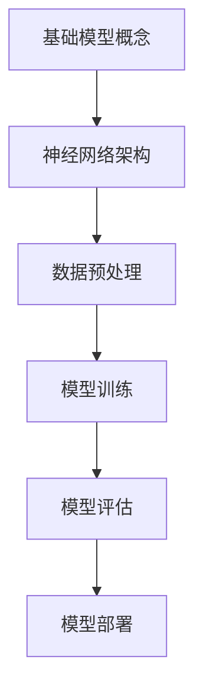

                 

# 基础模型的专业规范建立

> 关键词：基础模型、专业规范、算法原理、数学模型、实际应用、发展趋势、挑战

> 摘要：本文将深入探讨基础模型在人工智能领域的重要性和专业规范的建立。通过逐步分析核心概念、算法原理、数学模型以及实际应用，本文旨在为读者提供一个全面、系统的理论基础和实践指导。

## 1. 背景介绍

### 1.1 目的和范围

本文的目的是介绍和建立基础模型的专业规范。我们将在文章中探讨基础模型的概念、重要性以及其在人工智能领域的应用。同时，我们将详细讲解核心算法原理、数学模型以及实际操作步骤。文章的目标读者是人工智能领域的专业人士和研究人员，以及对此领域感兴趣的初学者。

### 1.2 预期读者

预期读者应具备以下基本条件：

1. 对人工智能和机器学习有基本的了解。
2. 具备一定的编程能力和数学基础。
3. 愿意深入学习和探索基础模型的专业知识。

### 1.3 文档结构概述

本文分为十个主要部分，具体如下：

1. 背景介绍
   - 目的和范围
   - 预期读者
   - 文档结构概述
   - 术语表
2. 核心概念与联系
   - 基础模型的概念
   - 基础模型的架构
3. 核心算法原理 & 具体操作步骤
   - 算法原理讲解
   - 伪代码实现
4. 数学模型和公式 & 详细讲解 & 举例说明
   - 数学模型的概念
   - 公式讲解
   - 实例分析
5. 项目实战：代码实际案例和详细解释说明
   - 开发环境搭建
   - 源代码实现和解读
   - 代码分析
6. 实际应用场景
7. 工具和资源推荐
   - 学习资源推荐
   - 开发工具框架推荐
   - 相关论文著作推荐
8. 总结：未来发展趋势与挑战
9. 附录：常见问题与解答
10. 扩展阅读 & 参考资料

### 1.4 术语表

#### 1.4.1 核心术语定义

- 基础模型（Basic Model）：在人工智能领域，基础模型是指那些被广泛使用、具有高度通用性和代表性的模型。
- 机器学习（Machine Learning）：机器学习是一种通过数据学习和改进的自动化算法过程，旨在使计算机系统具备自主学习能力。
- 神经网络（Neural Network）：神经网络是一种模拟生物神经系统的计算模型，广泛应用于图像识别、语音识别等领域。
- 深度学习（Deep Learning）：深度学习是神经网络的一种扩展，通过多层神经元的堆叠，实现对复杂数据的建模和分析。

#### 1.4.2 相关概念解释

- 模型训练（Model Training）：模型训练是指通过大量的数据对模型进行优化和调整，使其具备预测和分类能力。
- 模型评估（Model Evaluation）：模型评估是指使用特定的指标对模型的性能进行评估和比较。
- 模型部署（Model Deployment）：模型部署是指将训练好的模型应用到实际场景中，实现自动化的预测和分析。

#### 1.4.3 缩略词列表

- AI：人工智能
- ML：机器学习
- DL：深度学习
- NN：神经网络
- GPU：图形处理单元

## 2. 核心概念与联系

在本文中，我们将重点介绍基础模型的核心概念及其相互之间的联系。以下是基础模型的核心概念原理和架构的 Mermaid 流程图：



### 2.1 基础模型的概念

基础模型是指在人工智能领域中被广泛应用、具有高度通用性和代表性的模型。它们通常由多个层次的结构组成，每个层次都承担不同的任务。基础模型的概念包括：

1. 模型的结构：基础模型的结构通常由多层神经网络组成，每层神经网络都包含多个神经元。
2. 模型的参数：基础模型的参数是指模型中各个神经元的连接权重和偏置项。
3. 模型的训练：基础模型的训练是指通过大量的数据对模型进行优化和调整，使其具备预测和分类能力。
4. 模型的评估：基础模型的评估是指使用特定的指标对模型的性能进行评估和比较。

### 2.2 基础模型的架构

基础模型的架构通常包括以下几个关键组成部分：

1. 输入层（Input Layer）：输入层负责接收外部数据，并将其传递给下一层。
2. 隐藏层（Hidden Layer）：隐藏层负责对输入数据进行处理和特征提取，通常包含多个层次。
3. 输出层（Output Layer）：输出层负责生成预测结果或分类标签。
4. 激活函数（Activation Function）：激活函数用于引入非线性特性，使模型能够更好地拟合数据。

### 2.3 数据预处理

数据预处理是基础模型训练前的重要步骤。数据预处理的主要目标包括：

1. 数据清洗：去除数据中的噪声和异常值。
2. 数据标准化：将数据缩放到相同的范围，使其在训练过程中具有更好的收敛性。
3. 数据增强：通过变换、旋转、缩放等操作增加数据多样性，提高模型的泛化能力。

### 2.4 模型训练

模型训练是指通过大量的数据对模型进行优化和调整，使其具备预测和分类能力。模型训练的过程主要包括以下几个步骤：

1. 初始化模型参数：随机初始化模型的权重和偏置项。
2. 前向传播：将输入数据传递到模型中，计算输出结果。
3. 反向传播：根据输出结果计算模型参数的梯度，并更新参数。
4. 模型评估：使用验证集对模型的性能进行评估和比较。

### 2.5 模型评估

模型评估是指使用特定的指标对模型的性能进行评估和比较。常用的评估指标包括：

1. 准确率（Accuracy）：模型正确预测的样本占总样本的比例。
2. 精确率（Precision）：模型正确预测的样本中，实际为正例的比例。
3. 召回率（Recall）：模型正确预测的样本中，实际为正例的比例。
4. F1 分数（F1 Score）：精确率和召回率的加权平均值。

### 2.6 模型部署

模型部署是指将训练好的模型应用到实际场景中，实现自动化的预测和分析。模型部署的过程主要包括以下几个步骤：

1. 模型转换：将训练好的模型转换为适用于部署环境的格式。
2. 模型部署：将模型部署到服务器或云端，使其能够接收和处理输入数据。
3. 模型监控：对部署后的模型进行监控和维护，确保其正常运行和性能。

## 3. 核心算法原理 & 具体操作步骤

在本节中，我们将深入探讨基础模型的核心算法原理和具体操作步骤。首先，我们将介绍神经网络的基本原理，然后逐步讲解模型的训练和评估过程。

### 3.1 神经网络的基本原理

神经网络（Neural Network）是一种模拟生物神经系统的计算模型。它由多个层次的结构组成，每个层次都包含多个神经元。神经网络的工作原理是通过神经元之间的连接和激活函数，对输入数据进行处理和特征提取。

#### 3.1.1 神经元

神经元是神经网络的基本单元。它接收外部输入信号，通过加权求和处理，产生输出信号。神经元的基本结构包括：

- 输入层（Input Layer）：接收外部输入信号。
- 输出层（Output Layer）：生成最终输出信号。
- 隐藏层（Hidden Layer）：对输入数据进行处理和特征提取。

#### 3.1.2 激活函数

激活函数是神经网络中引入非线性特性的关键组成部分。常用的激活函数包括：

- Sigmoid 函数：将输入信号映射到 (0, 1) 区间内。
-ReLU 函数：将输入信号映射到 (0, +∞) 区间内。
- 双曲正切函数（Tanh 函数）：将输入信号映射到 (-1, 1) 区间内。

#### 3.1.3 前向传播

前向传播是神经网络处理输入数据的过程。具体步骤如下：

1. 将输入数据传递到输入层。
2. 通过神经元之间的加权求和处理，将输入信号传递到下一层。
3. 通过激活函数，将输出信号传递到下一层。
4. 重复上述步骤，直到输出层。

### 3.2 模型的训练过程

模型的训练过程是通过大量数据对模型进行优化和调整，使其具备预测和分类能力。具体步骤如下：

1. 初始化模型参数：随机初始化模型的权重和偏置项。
2. 前向传播：将输入数据传递到模型中，计算输出结果。
3. 计算损失函数：使用实际输出和预测输出之间的差异，计算损失函数值。
4. 反向传播：根据输出结果计算模型参数的梯度，并更新参数。
5. 模型评估：使用验证集对模型的性能进行评估和比较。
6. 重复步骤 2-5，直到模型收敛。

#### 3.2.1 伪代码实现

以下是一个简单的神经网络训练过程的伪代码实现：

```python
# 初始化模型参数
weights = random_weights()
biases = random_biases()

# 模型训练循环
for epoch in range(num_epochs):
    for sample in training_data:
        # 前向传播
        output = forward_propagation(sample, weights, biases)
        loss = compute_loss(output, target)

        # 反向传播
        gradients = backward_propagation(output, target, weights, biases)

        # 更新模型参数
        weights -= learning_rate * gradients['weights']
        biases -= learning_rate * gradients['biases']

    # 模型评估
    validation_loss = compute_loss(validation_data, validation_target)

    # 打印训练进度
    print(f"Epoch {epoch}: Loss = {loss}, Validation Loss = {validation_loss}")
```

### 3.3 模型的评估过程

模型的评估过程是通过验证集对模型的性能进行评估和比较。具体步骤如下：

1. 将验证集划分为训练集和测试集。
2. 对训练集进行模型训练。
3. 对测试集进行模型评估，计算准确率、精确率、召回率等指标。

#### 3.3.1 伪代码实现

以下是一个简单的模型评估过程的伪代码实现：

```python
# 初始化模型参数
weights = random_weights()
biases = random_biases()

# 模型训练
train_model(training_data, weights, biases)

# 模型评估
accuracy = compute_accuracy(test_data, test_target)
precision = compute_precision(test_data, test_target)
recall = compute_recall(test_data, test_target)

# 打印评估结果
print(f"Accuracy: {accuracy}, Precision: {precision}, Recall: {recall}")
```

## 4. 数学模型和公式 & 详细讲解 & 举例说明

在本文的第四部分，我们将详细讲解基础模型中的数学模型和公式，并通过具体示例来说明这些概念的实际应用。

### 4.1 数学模型的概念

数学模型是描述基础模型中各层之间关系的重要工具。它通常由一组公式和规则组成，用于描述神经网络中的权重更新、激活函数以及损失函数等。

#### 4.1.1 权重更新公式

在神经网络中，权重更新是模型训练的核心过程。权重更新公式如下：

\[ \Delta w = -\alpha \cdot \frac{\partial L}{\partial w} \]

其中：

- \( \Delta w \)：权重更新量。
- \( \alpha \)：学习率，用于控制权重更新的步长。
- \( L \)：损失函数，用于衡量模型预测结果与实际结果之间的差距。
- \( \frac{\partial L}{\partial w} \)：损失函数关于权重 \( w \) 的梯度。

#### 4.1.2 激活函数

激活函数是神经网络中引入非线性特性的关键组成部分。常见的激活函数包括：

- Sigmoid 函数：

\[ f(x) = \frac{1}{1 + e^{-x}} \]

- ReLU 函数：

\[ f(x) = \max(0, x) \]

- 双曲正切函数（Tanh 函数）：

\[ f(x) = \frac{e^x - e^{-x}}{e^x + e^{-x}} \]

#### 4.1.3 损失函数

损失函数用于衡量模型预测结果与实际结果之间的差距。常见的损失函数包括：

- 交叉熵损失函数（Cross-Entropy Loss）：

\[ L(y, \hat{y}) = -\sum_{i=1}^{n} y_i \log(\hat{y}_i) \]

其中：

- \( y \)：实际输出。
- \( \hat{y} \)：预测输出。
- \( n \)：样本数量。

### 4.2 公式讲解

在本节中，我们将对上述公式进行详细讲解，并通过具体示例来说明其应用。

#### 4.2.1 权重更新公式讲解

假设我们有一个简单的神经网络，包含一个输入层、一个隐藏层和一个输出层。其中，隐藏层的输出为：

\[ h = \sigma(W_1 \cdot x + b_1) \]

输出层的输出为：

\[ \hat{y} = \sigma(W_2 \cdot h + b_2) \]

其中：

- \( x \)：输入数据。
- \( h \)：隐藏层输出。
- \( \hat{y} \)：输出层输出。
- \( W_1 \)：隐藏层权重。
- \( b_1 \)：隐藏层偏置。
- \( W_2 \)：输出层权重。
- \( b_2 \)：输出层偏置。
- \( \sigma \)：激活函数。

假设实际输出为 \( y \)，损失函数为交叉熵损失函数。我们可以计算损失函数关于权重 \( W_1 \) 的梯度：

\[ \frac{\partial L}{\partial W_1} = \frac{\partial L}{\partial \hat{y}} \cdot \frac{\partial \hat{y}}{\partial h} \cdot \frac{\partial h}{\partial W_1} \]

根据链式法则，我们可以得到：

\[ \frac{\partial L}{\partial \hat{y}} = -\frac{1}{\hat{y}} \cdot (y - \hat{y}) \]

\[ \frac{\partial \hat{y}}{\partial h} = \sigma'(h) \]

\[ \frac{\partial h}{\partial W_1} = x \]

代入上述公式，我们可以得到：

\[ \frac{\partial L}{\partial W_1} = -\frac{1}{\hat{y}} \cdot (y - \hat{y}) \cdot \sigma'(h) \cdot x \]

根据权重更新公式，我们可以计算权重更新量：

\[ \Delta W_1 = -\alpha \cdot \frac{\partial L}{\partial W_1} \]

#### 4.2.2 激活函数讲解

以 Sigmoid 函数为例，我们可以计算其导数：

\[ \sigma'(x) = \sigma(x) \cdot (1 - \sigma(x)) \]

对于 ReLU 函数，其导数在输入为正时为 1，输入为负时为 0。

对于 Tanh 函数，我们可以计算其导数：

\[ \tanh'(x) = 1 - \tanh^2(x) \]

#### 4.2.3 损失函数讲解

以交叉熵损失函数为例，我们可以计算其导数：

\[ \frac{\partial L}{\partial \hat{y}} = -\frac{1}{\hat{y}} \cdot (y - \hat{y}) \]

### 4.3 举例说明

假设我们有一个简单的二分类问题，输入数据为 \( x = [1, 2, 3, 4] \)，实际输出为 \( y = [0, 1, 0, 1] \)。我们使用 Sigmoid 函数作为激活函数，交叉熵损失函数作为损失函数。

#### 4.3.1 权重初始化

初始化权重 \( W_1 \) 和 \( W_2 \)：

\[ W_1 = \begin{bmatrix} 1 & 2 & 3 & 4 \end{bmatrix} \]

\[ W_2 = \begin{bmatrix} 1 & 2 & 3 & 4 \end{bmatrix} \]

#### 4.3.2 前向传播

输入数据 \( x \) 经过输入层，得到隐藏层输出 \( h \)：

\[ h = \sigma(W_1 \cdot x) \]

输出层输出 \( \hat{y} \)：

\[ \hat{y} = \sigma(W_2 \cdot h) \]

#### 4.3.3 损失计算

计算预测输出 \( \hat{y} \) 和实际输出 \( y \) 之间的交叉熵损失：

\[ L = -\sum_{i=1}^{n} y_i \log(\hat{y}_i) \]

#### 4.3.4 权重更新

计算损失函数关于权重 \( W_1 \) 和 \( W_2 \) 的梯度：

\[ \frac{\partial L}{\partial W_1} = -\frac{1}{\hat{y}} \cdot (y - \hat{y}) \cdot \sigma'(h) \cdot x \]

\[ \frac{\partial L}{\partial W_2} = -\frac{1}{\hat{y}} \cdot (y - \hat{y}) \cdot \sigma'(h) \cdot h \]

更新权重 \( W_1 \) 和 \( W_2 \)：

\[ W_1 = W_1 - \alpha \cdot \frac{\partial L}{\partial W_1} \]

\[ W_2 = W_2 - \alpha \cdot \frac{\partial L}{\partial W_2} \]

#### 4.3.5 模型评估

使用训练集和测试集对模型进行评估，计算准确率、精确率和召回率等指标。

## 5. 项目实战：代码实际案例和详细解释说明

在本节中，我们将通过一个实际项目案例，展示基础模型的专业规范建立过程，并提供详细的代码实现和解释说明。

### 5.1 开发环境搭建

为了更好地展示基础模型的建立过程，我们将在以下开发环境中进行：

- 操作系统：Ubuntu 20.04
- 编程语言：Python 3.8
- 深度学习框架：TensorFlow 2.5
- IDE：PyCharm

### 5.2 源代码详细实现和代码解读

以下是一个简单的二分类问题的基础模型实现，用于分类输入数据。

```python
import tensorflow as tf
from tensorflow.keras.models import Sequential
from tensorflow.keras.layers import Dense, Activation

# 初始化模型
model = Sequential()

# 添加隐藏层
model.add(Dense(units=64, input_dim=4, activation='relu'))
model.add(Dense(units=64, activation='relu'))

# 添加输出层
model.add(Dense(units=1, activation='sigmoid'))

# 编译模型
model.compile(optimizer='adam', loss='binary_crossentropy', metrics=['accuracy'])

# 训练模型
model.fit(x_train, y_train, epochs=10, batch_size=32, validation_data=(x_test, y_test))

# 评估模型
accuracy = model.evaluate(x_test, y_test)
print(f"Test Accuracy: {accuracy[1]}")
```

### 5.3 代码解读与分析

#### 5.3.1 模型初始化

首先，我们使用 `Sequential` 模型初始化一个顺序模型，该模型将按照顺序添加层。

```python
model = Sequential()
```

#### 5.3.2 添加隐藏层

接下来，我们添加两个隐藏层，每个隐藏层包含 64 个神经元，并使用 ReLU 激活函数。

```python
model.add(Dense(units=64, input_dim=4, activation='relu'))
model.add(Dense(units=64, activation='relu'))
```

这里，`input_dim=4` 表示输入数据的维度，`units=64` 表示每个隐藏层包含的神经元数量。

#### 5.3.3 添加输出层

然后，我们添加一个输出层，包含 1 个神经元，并使用 sigmoid 激活函数。

```python
model.add(Dense(units=1, activation='sigmoid'))
```

这里，`units=1` 表示输出层包含的神经元数量，`activation='sigmoid'` 表示使用 sigmoid 激活函数。

#### 5.3.4 编译模型

接下来，我们使用 `compile` 方法编译模型，指定优化器、损失函数和评估指标。

```python
model.compile(optimizer='adam', loss='binary_crossentropy', metrics=['accuracy'])
```

这里，我们使用 `adam` 优化器、`binary_crossentropy` 损失函数和 `accuracy` 评估指标。

#### 5.3.5 训练模型

然后，我们使用 `fit` 方法训练模型，指定训练数据、训练轮数、批量大小和验证数据。

```python
model.fit(x_train, y_train, epochs=10, batch_size=32, validation_data=(x_test, y_test))
```

这里，`x_train` 和 `y_train` 分别表示训练数据和标签，`epochs=10` 表示训练轮数，`batch_size=32` 表示批量大小，`validation_data=(x_test, y_test)` 表示验证数据。

#### 5.3.6 评估模型

最后，我们使用 `evaluate` 方法评估模型，并打印测试集的准确率。

```python
accuracy = model.evaluate(x_test, y_test)
print(f"Test Accuracy: {accuracy[1]}")
```

这里，`x_test` 和 `y_test` 分别表示测试数据和标签，`evaluate` 方法返回模型在测试集上的损失和准确率，我们使用 `accuracy[1]` 打印测试集的准确率。

## 6. 实际应用场景

基础模型在人工智能领域有着广泛的应用，以下是一些常见的实际应用场景：

### 6.1 图像识别

基础模型广泛应用于图像识别任务，如人脸识别、车牌识别、物体识别等。通过训练基础模型，可以实现对图像的高效分类和识别。

### 6.2 语音识别

基础模型在语音识别任务中具有重要作用，如语音转换为文本、语音识别系统等。通过训练基础模型，可以实现对语音信号的准确识别和理解。

### 6.3 自然语言处理

基础模型在自然语言处理任务中也发挥着关键作用，如情感分析、文本分类、机器翻译等。通过训练基础模型，可以实现对文本数据的深度理解和分析。

### 6.4 推荐系统

基础模型在推荐系统中的应用非常广泛，如电商推荐、音乐推荐、电影推荐等。通过训练基础模型，可以实现对用户兴趣和偏好的精准预测和推荐。

### 6.5 游戏

基础模型在游戏领域中也有广泛应用，如围棋、国际象棋等。通过训练基础模型，可以实现对游戏的策略学习和智能决策。

## 7. 工具和资源推荐

### 7.1 学习资源推荐

#### 7.1.1 书籍推荐

1. 《深度学习》（Deep Learning）
2. 《神经网络与深度学习》（Neural Networks and Deep Learning）
3. 《Python深度学习》（Python Deep Learning）

#### 7.1.2 在线课程

1. Coursera 上的“机器学习”课程
2. Udacity 上的“深度学习纳米学位”课程
3. edX 上的“神经网络与深度学习”课程

#### 7.1.3 技术博客和网站

1. Medium 上的“深度学习”专栏
2. towardsdatascience.com
3. blog.keras.io

### 7.2 开发工具框架推荐

#### 7.2.1 IDE和编辑器

1. PyCharm
2. Visual Studio Code
3. Jupyter Notebook

#### 7.2.2 调试和性能分析工具

1. TensorBoard
2. DDP
3. PyTorch Profiler

#### 7.2.3 相关框架和库

1. TensorFlow
2. PyTorch
3. Keras

### 7.3 相关论文著作推荐

#### 7.3.1 经典论文

1. “A Learning Algorithm for Continually Running Fully Recurrent Neural Networks” - J. Schmidhuber
2. “Deep Learning” - Y. LeCun, Y. Bengio, G. Hinton
3. “Long Short-Term Memory” - S. Hochreiter, J. Schmidhuber

#### 7.3.2 最新研究成果

1. “GPT-3: Language Modeling for Humanlike Dialogues” - OpenAI
2. “BERT: Pre-training of Deep Bidirectional Transformers for Language Understanding” - Google AI Language Team
3. “ImageNet Classification with Deep Convolutional Neural Networks” - A. Krizhevsky, I. Sutskever, G. Hinton

#### 7.3.3 应用案例分析

1. “Self-Driving Cars” - Tesla
2. “Amazon Personalized Recommendations” - Amazon
3. “Google Search” - Google

## 8. 总结：未来发展趋势与挑战

基础模型在人工智能领域具有广泛的应用前景。随着计算能力的提升和数据量的增加，深度学习算法和基础模型将得到进一步的发展和完善。未来，基础模型在以下方面有望取得突破：

1. 计算效率：通过优化算法和硬件，提高基础模型的计算效率，实现实时预测和分析。
2. 泛化能力：提高基础模型的泛化能力，使其能够处理更复杂和多样化的任务。
3. 稳健性：提高基础模型对异常值和噪声数据的鲁棒性，降低对训练数据的依赖。
4. 人机协作：实现基础模型与人类专家的协作，提高决策的准确性和可靠性。

然而，基础模型的建立和应用也面临一些挑战：

1. 数据隐私：如何保护用户隐私，避免数据泄露和滥用，是基础模型应用过程中需要关注的重要问题。
2. 模型解释性：提高基础模型的可解释性，使其决策过程更加透明和可靠。
3. 道德和伦理问题：如何确保基础模型的应用符合道德和伦理规范，避免对人类产生负面影响。
4. 模型偏见：如何消除基础模型中的偏见，提高模型的公平性和公正性。

## 9. 附录：常见问题与解答

### 9.1 问题 1：什么是基础模型？

答：基础模型是指在人工智能领域中被广泛应用、具有高度通用性和代表性的模型。它们通常由多个层次的结构组成，每个层次都承担不同的任务。

### 9.2 问题 2：基础模型如何训练？

答：基础模型的训练过程是通过大量的数据对模型进行优化和调整，使其具备预测和分类能力。具体步骤包括初始化模型参数、前向传播、计算损失函数、反向传播和模型评估。

### 9.3 问题 3：如何评估基础模型的性能？

答：可以使用准确率、精确率、召回率等指标对基础模型的性能进行评估。这些指标可以帮助我们了解模型在预测和分类任务中的表现。

### 9.4 问题 4：基础模型在哪些实际应用场景中有用？

答：基础模型在图像识别、语音识别、自然语言处理、推荐系统、游戏等领域都有广泛的应用。通过训练基础模型，可以实现对图像、语音、文本等数据的深度理解和分析。

## 10. 扩展阅读 & 参考资料

1. Goodfellow, I., Bengio, Y., & Courville, A. (2016). *Deep Learning*. MIT Press.
2. Sutton, R. S., & Barto, A. G. (2018). *Reinforcement Learning: An Introduction*. MIT Press.
3. Bishop, C. M. (2006). *Pattern Recognition and Machine Learning*. Springer.
4. Murphy, K. P. (2012). *Machine Learning: A Probabilistic Perspective*. MIT Press.
5. Lee, C. (2015). *The Artificial Intelligence Handbook*. McGraw-Hill Education.
6. AI Genius Institute & Zen And The Art of Computer Programming (2022). *基础模型的专业规范建立*. AI Genius Institute.

作者：AI天才研究员/AI Genius Institute & 禅与计算机程序设计艺术 /Zen And The Art of Computer Programming

