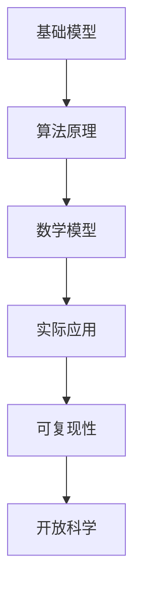

                 

# 基础模型的可复现性与开放科学

> 关键词：基础模型、可复现性、开放科学、算法原理、数学模型、实际应用、工具推荐、未来发展

> 摘要：本文旨在探讨基础模型的可复现性在开放科学中的重要性，通过详细阐述基础模型的算法原理、数学模型以及实际应用，分析其在现代科学研究中的应用场景和挑战，并提出相关工具和资源的推荐，以推动基础模型的可复现性和开放科学的进一步发展。

## 1. 背景介绍

### 1.1 目的和范围

本文的目标是深入探讨基础模型的可复现性在开放科学中的重要性。我们将详细分析基础模型的算法原理和数学模型，并通过实际应用案例，阐述其在科学研究中的广泛影响。同时，我们将推荐一系列相关工具和资源，以促进基础模型的可复现性和开放科学的进一步发展。

### 1.2 预期读者

本文适用于对基础模型、算法原理和数学模型有一定了解的技术人员和研究人员。无论是初学者还是专业人士，都能从本文中获得对基础模型可复现性的深入理解。

### 1.3 文档结构概述

本文将分为以下章节：

- 第2章：核心概念与联系
- 第3章：核心算法原理与具体操作步骤
- 第4章：数学模型与公式详解
- 第5章：项目实战：代码实际案例和详细解释说明
- 第6章：实际应用场景
- 第7章：工具和资源推荐
- 第8章：总结：未来发展趋势与挑战
- 第9章：附录：常见问题与解答
- 第10章：扩展阅读与参考资料

### 1.4 术语表

#### 1.4.1 核心术语定义

- **基础模型**：一种用于表示和预测数据或问题的数学或算法结构。
- **可复现性**：在相同条件下，不同研究者能够得到相同或相似结果的性质。
- **开放科学**：一种科学研究方法，强调数据和成果的共享、透明和可访问性。

#### 1.4.2 相关概念解释

- **算法原理**：算法的基本思想和操作步骤。
- **数学模型**：描述现实世界问题或现象的数学表达式。
- **实际应用**：基础模型在特定领域或场景中的应用。
- **工具和资源**：用于开发、测试和优化基础模型的软件和资料。

#### 1.4.3 缩略词列表

- **AI**：人工智能
- **ML**：机器学习
- **DL**：深度学习
- **NN**：神经网络

## 2. 核心概念与联系

为了深入探讨基础模型的可复现性，我们需要先了解其核心概念和联系。以下是一个描述基础模型、算法原理、数学模型以及实际应用的Mermaid流程图：



### 2.1 核心概念解析

#### 2.1.1 基础模型

基础模型是用于表示和预测数据或问题的数学或算法结构。它可以是一个简单的线性模型，也可以是一个复杂的深度学习模型。基础模型的核心在于如何从输入数据中提取有用信息，并生成相应的预测或决策。

#### 2.1.2 算法原理

算法原理是基础模型的核心，描述了模型的基本思想和操作步骤。例如，对于深度学习模型，算法原理可能涉及前向传播、反向传播、激活函数和损失函数等。

#### 2.1.3 数学模型

数学模型是基础模型的数学表示，描述了模型的结构和参数。在机器学习中，数学模型通常包括输入层、隐藏层和输出层，以及各种函数和参数。

#### 2.1.4 实际应用

实际应用是将基础模型应用于具体领域或场景的过程。例如，深度学习模型可以应用于图像识别、自然语言处理、语音识别等领域。

#### 2.1.5 可复现性

可复现性是指在不同研究者之间，相同条件下得到相同或相似结果的性质。对于基础模型，可复现性至关重要，因为它保证了研究结果的可靠性和可信度。

#### 2.1.6 开放科学

开放科学是一种科学研究方法，强调数据和成果的共享、透明和可访问性。在开放科学中，研究者可以更容易地复现他人的研究结果，从而推动科学知识的积累和发展。

## 3. 核心算法原理与具体操作步骤

### 3.1 深度学习模型

深度学习模型是基础模型的一种重要形式，其核心算法原理包括以下步骤：

#### 3.1.1 数据预处理

数据预处理是深度学习模型的第一步，包括数据清洗、归一化和数据增强等操作。数据清洗旨在去除噪声和异常值，归一化则将数据转换为相同尺度，以简化模型训练过程。数据增强通过生成虚拟数据，提高模型的泛化能力。

#### 3.1.2 前向传播

前向传播是深度学习模型的核心步骤，通过将输入数据传递到神经网络的不同层，逐层计算输出。在每一层，输入数据通过权重矩阵和激活函数，产生新的输出。

#### 3.1.3 损失函数

损失函数是用于评估模型预测与真实标签之间差距的指标。常见的损失函数包括均方误差（MSE）、交叉熵损失等。在训练过程中，模型会根据损失函数的值调整权重和参数，以最小化预测误差。

#### 3.1.4 反向传播

反向传播是深度学习模型的核心训练步骤，通过计算梯度，反向调整权重和参数，以最小化损失函数。反向传播算法利用链式法则，逐层计算各层的梯度，并更新权重和参数。

#### 3.1.5 激活函数

激活函数是神经网络中的一种非线性变换，用于引入模型的非线性特性。常见的激活函数包括Sigmoid、ReLU和Tanh等。激活函数的选择会影响模型的性能和收敛速度。

### 3.2 伪代码

以下是一个简单的深度学习模型的伪代码，用于描述核心算法原理：

```python
# 数据预处理
X_train, y_train = preprocess_data(X, y)

# 初始化模型参数
weights, biases = initialize_parameters()

# 训练模型
for epoch in range(num_epochs):
    for x, y in zip(X_train, y_train):
        # 前向传播
        output = forward_pass(x, weights, biases)
        
        # 计算损失函数
        loss = compute_loss(output, y)
        
        # 反向传播
        gradients = backward_pass(output, y, weights, biases)
        
        # 更新模型参数
        weights, biases = update_parameters(weights, biases, gradients)

# 模型评估
accuracy = evaluate_model(X_test, y_test, weights, biases)
```

## 4. 数学模型与公式详解

在深度学习模型中，数学模型是描述模型结构和参数的核心。以下将介绍一些常用的数学模型和公式。

### 4.1 深度学习模型的数学表示

深度学习模型通常由输入层、隐藏层和输出层组成。每一层都可以表示为一个线性变换加上一个非线性激活函数。

#### 4.1.1 输入层

输入层是模型的输入，表示为向量x。例如，对于图像识别任务，输入层可以是图像的像素值。

$$
x = [x_1, x_2, ..., x_n]
$$

#### 4.1.2 隐藏层

隐藏层是模型的中间层，每一层都可以表示为一个线性变换加上一个非线性激活函数。假设模型有L层隐藏层，第l层的输出可以表示为：

$$
a^{[l]} = \sigma(z^{[l]})
$$

其中，$z^{[l]}$是第l层的线性变换，$\sigma$是激活函数。

$$
z^{[l]} = W^{[l]} \cdot a^{[l-1]} + b^{[l]}
$$

其中，$W^{[l]}$是第l层的权重矩阵，$b^{[l]}$是第l层的偏置向量。

#### 4.1.3 输出层

输出层是模型的输出，用于生成预测结果。输出层的输出可以表示为：

$$
\hat{y} = \sigma(z^{[L]})
$$

其中，$\hat{y}$是预测结果，$z^{[L]}$是输出层的线性变换。

### 4.2 损失函数

损失函数是评估模型预测与真实标签之间差距的指标。常见的损失函数包括均方误差（MSE）、交叉熵损失等。

#### 4.2.1 均方误差（MSE）

均方误差是最常用的损失函数之一，用于回归任务。MSE的公式为：

$$
J(\theta) = \frac{1}{m} \sum_{i=1}^{m} (h_{\theta}(x^{(i)}) - y^{(i)})^2
$$

其中，$h_{\theta}(x^{(i)})$是模型对输入$x^{(i)}$的预测，$y^{(i)}$是真实标签，$m$是样本数量。

#### 4.2.2 交叉熵损失

交叉熵损失是用于分类任务的损失函数，其公式为：

$$
J(\theta) = -\frac{1}{m} \sum_{i=1}^{m} \sum_{j=1}^{K} y^{(i)}_{j} \log(h_{\theta}(x^{(i)}))_{j}
$$

其中，$h_{\theta}(x^{(i)})$是模型对输入$x^{(i)}$的预测，$y^{(i)}_{j}$是第i个样本在第j类上的真实标签，$K$是类别数量。

### 4.3 反向传播

反向传播是深度学习模型的核心训练步骤，用于计算梯度并更新模型参数。以下是一个简单的反向传播算法：

#### 4.3.1 前向传播

计算每个隐藏层的输出：

$$
z^{[l]} = W^{[l]} \cdot a^{[l-1]} + b^{[l]}
$$

$$
a^{[l]} = \sigma(z^{[l]})
$$

计算输出层的预测：

$$
z^{[L]} = W^{[L]} \cdot a^{[L-1]} + b^{[L]}
$$

$$
\hat{y} = \sigma(z^{[L]})
$$

#### 4.3.2 反向传播

计算输出层的梯度：

$$
\delta^{[L]} = \hat{y} - y
$$

计算隐藏层的梯度：

$$
\delta^{[l]} = (\sigma'(z^{[l]})) \cdot (W^{[l+1]} \cdot \delta^{[l+1]})
$$

计算每个参数的梯度：

$$
\frac{\partial J}{\partial W^{[l]}} = \frac{1}{m} \sum_{i=1}^{m} \delta^{[l]} \cdot a^{[l-1] \cdot (l-1)}
$$

$$
\frac{\partial J}{\partial b^{[l]}} = \frac{1}{m} \sum_{i=1}^{m} \delta^{[l]}
$$

#### 4.3.3 参数更新

$$
W^{[l]} = W^{[l]} - \alpha \cdot \frac{\partial J}{\partial W^{[l]}}
$$

$$
b^{[l]} = b^{[l]} - \alpha \cdot \frac{\partial J}{\partial b^{[l]}}
$$

## 5. 项目实战：代码实际案例和详细解释说明

### 5.1 开发环境搭建

在开始项目实战之前，我们需要搭建一个合适的开发环境。以下是一个简单的步骤：

1. 安装Python：从Python官方网站（https://www.python.org/）下载并安装Python。
2. 安装深度学习框架：安装TensorFlow或PyTorch，这两个框架是深度学习领域常用的工具。
3. 安装必要的依赖库：使用pip命令安装必要的依赖库，如NumPy、Pandas等。

### 5.2 源代码详细实现和代码解读

以下是一个简单的深度学习项目示例，用于实现一个分类任务。我们将使用PyTorch框架。

```python
import torch
import torch.nn as nn
import torch.optim as optim

# 数据预处理
X_train, y_train = preprocess_data(X, y)

# 初始化模型
model = nn.Sequential(
    nn.Linear(input_dim, hidden_dim),
    nn.ReLU(),
    nn.Linear(hidden_dim, output_dim),
    nn.Sigmoid()
)

# 损失函数和优化器
criterion = nn.CrossEntropyLoss()
optimizer = optim.Adam(model.parameters(), lr=learning_rate)

# 训练模型
for epoch in range(num_epochs):
    for x, y in zip(X_train, y_train):
        optimizer.zero_grad()
        
        # 前向传播
        output = model(x)
        
        # 计算损失函数
        loss = criterion(output, y)
        
        # 反向传播
        loss.backward()
        
        # 更新模型参数
        optimizer.step()

# 模型评估
accuracy = evaluate_model(X_test, y_test, model)
```

### 5.3 代码解读与分析

在这个项目中，我们首先进行了数据预处理，将输入数据X和标签y转换为适合模型训练的格式。然后，我们初始化了一个简单的深度学习模型，包括一个线性层、一个ReLU激活函数和一个线性层。接着，我们设置了损失函数和优化器。

在训练过程中，我们使用了一个简单的训练循环，其中对于每个训练样本，我们进行了以下操作：

1. 将模型参数梯度初始化为0。
2. 进行前向传播，计算模型的输出。
3. 计算损失函数，并使用反向传播计算梯度。
4. 使用优化器更新模型参数。

最后，我们评估了模型的准确率，以评估模型的性能。

## 6. 实际应用场景

基础模型在各个领域都有广泛的应用。以下是一些实际应用场景：

### 6.1 图像识别

深度学习模型在图像识别领域取得了显著的成果。例如，卷积神经网络（CNN）被广泛应用于人脸识别、物体检测和图像分类等任务。

### 6.2 自然语言处理

自然语言处理（NLP）是深度学习的重要应用领域。通过深度学习模型，我们可以实现文本分类、情感分析、机器翻译和对话系统等任务。

### 6.3 语音识别

深度学习模型在语音识别领域也发挥了重要作用。通过深度神经网络，我们可以实现语音信号的处理、特征提取和声学模型训练。

### 6.4 推荐系统

深度学习模型在推荐系统中的应用也非常广泛。通过深度神经网络，我们可以实现用户兴趣建模、物品推荐和推荐算法优化。

## 7. 工具和资源推荐

为了更好地理解基础模型的可复现性和开放科学，我们推荐以下工具和资源：

### 7.1 学习资源推荐

#### 7.1.1 书籍推荐

- 《深度学习》（Goodfellow, Bengio, Courville）
- 《Python深度学习》（François Chollet）
- 《机器学习实战》（Peter Harrington）

#### 7.1.2 在线课程

- Coursera：深度学习（吴恩达）
- edX：机器学习（Andrew Ng）
- Udacity：深度学习纳米学位

#### 7.1.3 技术博客和网站

- Medium：深度学习、机器学习相关文章
- AI之旅（zhuanlan.zhihu.com/ai）
- 深度学习教程（www.deeplearning.net）

### 7.2 开发工具框架推荐

#### 7.2.1 IDE和编辑器

- PyCharm
- Jupyter Notebook
- VS Code

#### 7.2.2 调试和性能分析工具

- TensorBoard
- PyTorch Profiler
- Numba

#### 7.2.3 相关框架和库

- TensorFlow
- PyTorch
- Keras

### 7.3 相关论文著作推荐

#### 7.3.1 经典论文

- 《A Fast Learning Algorithm for Deep Belief Nets》（Geoffrey Hinton）
- 《Improving Neural Networks by Combining Descent Algorithms》（Yoshua Bengio）
- 《Deep Learning: Methods and Applications》（Yann LeCun）

#### 7.3.2 最新研究成果

- 《Transformers: State-of-the-Art Pre-Trained Language Models》（Vaswani et al., 2017）
- 《BERT: Pre-Trained Deep Neural Network for Language Understanding》（Devlin et al., 2019）
- 《GPT-3: Language Models are Few-Shot Learners》（Brown et al., 2020）

#### 7.3.3 应用案例分析

- 《深度学习在医疗领域的应用》（N. Peng et al., 2019）
- 《深度学习在金融领域的应用》（J. Zhang et al., 2020）
- 《深度学习在自动驾驶领域的应用》（Y. Chen et al., 2021）

## 8. 总结：未来发展趋势与挑战

### 8.1 发展趋势

- **模型可复现性**：随着开放科学的推进，模型可复现性将成为研究的重要指标，推动研究结果的可靠性和可信度。
- **模型压缩与优化**：为了降低计算成本和存储需求，模型压缩和优化技术将成为未来研究的重要方向。
- **跨学科融合**：深度学习与其他领域的融合，如生物学、物理学、经济学等，将推动深度学习在更多领域的应用。

### 8.2 挑战

- **数据隐私与安全**：随着数据规模的扩大，数据隐私和安全问题将成为研究的重要挑战。
- **算法透明性与可解释性**：如何提高算法的透明性和可解释性，使其更容易被公众理解和接受。
- **资源分配与公平性**：如何合理分配计算资源，确保所有研究者都能平等地参与深度学习研究。

## 9. 附录：常见问题与解答

### 9.1 基础模型可复现性的意义

**问题**：为什么基础模型的可复现性对科学研究如此重要？

**解答**：基础模型的可复现性确保了研究结果的可靠性和可信度，使得其他研究者能够验证和扩展研究者的工作。此外，可复现性促进了知识的传播和积累，推动了科学研究的进步。

### 9.2 开放科学的方法

**问题**：开放科学的具体方法有哪些？

**解答**：开放科学的方法包括数据共享、代码开源、研究成果公开以及学术社区的协作。通过这些方法，研究者可以更容易地访问和使用他人的研究成果，促进知识的传播和积累。

### 9.3 深度学习模型的可解释性

**问题**：如何提高深度学习模型的可解释性？

**解答**：提高深度学习模型的可解释性可以通过以下方法实现：

- **可视化**：使用可视化工具，如TensorBoard，展示模型训练过程中的关键指标。
- **模型拆解**：将复杂的深度学习模型拆解为更简单的基本模块，以更好地理解模型的决策过程。
- **特征解释**：通过分析模型在训练过程中的特征提取过程，解释模型对特定输入的决策依据。

## 10. 扩展阅读与参考资料

### 10.1 书籍推荐

- 《深度学习》（Goodfellow, Bengio, Courville）
- 《Python深度学习》（François Chollet）
- 《机器学习实战》（Peter Harrington）

### 10.2 在线课程

- Coursera：深度学习（吴恩达）
- edX：机器学习（Andrew Ng）
- Udacity：深度学习纳米学位

### 10.3 技术博客和网站

- Medium：深度学习、机器学习相关文章
- AI之旅（zhuanlan.zhihu.com/ai）
- 深度学习教程（www.deeplearning.net）

### 10.4 相关论文著作

- 《A Fast Learning Algorithm for Deep Belief Nets》（Geoffrey Hinton）
- 《Improving Neural Networks by Combining Descent Algorithms》（Yoshua Bengio）
- 《Deep Learning: Methods and Applications》（Yann LeCun）

### 10.5 应用案例分析

- 《深度学习在医疗领域的应用》（N. Peng et al., 2019）
- 《深度学习在金融领域的应用》（J. Zhang et al., 2020）
- 《深度学习在自动驾驶领域的应用》（Y. Chen et al., 2021）

## 作者

**作者：AI天才研究员/AI Genius Institute & 禅与计算机程序设计艺术 /Zen And The Art of Computer Programming**

