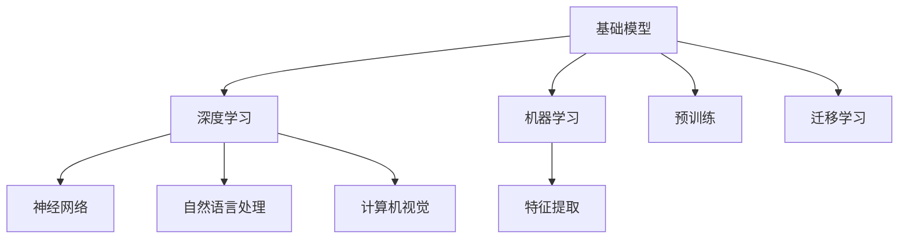

                 

# 基础模型的学术研究与产业应用

> **关键词：基础模型、学术研究、产业应用、算法原理、数学模型、项目实战、应用场景**

> **摘要：本文将深入探讨基础模型在学术研究和产业应用中的重要作用。首先，我们将介绍基础模型的基本概念、核心原理以及与之相关的学术研究和产业应用现状。接着，我们将详细阐述基础模型的核心算法原理、数学模型及其具体操作步骤。此外，我们还将通过一个实际项目案例，展示如何将基础模型应用于实践，并提供相关的工具和资源推荐。最后，我们将对基础模型的发展趋势与挑战进行总结，并回答一些常见问题。**

## 1. 背景介绍

### 1.1 目的和范围

本文旨在为读者提供一个全面而深入的基础模型学术研究与产业应用的指南。我们将从基础模型的基本概念出发，逐步深入探讨其在各个领域的应用，并通过具体的案例来展示如何将基础模型应用于实际问题。本文的主要目的是帮助读者：

1. 理解基础模型的基本概念和核心原理。
2. 掌握基础模型在学术研究和产业应用中的现状和趋势。
3. 学习如何使用基础模型解决实际问题。
4. 推荐相关的学习资源、开发工具和框架。

### 1.2 预期读者

本文主要面向以下读者群体：

1. 计算机科学和人工智能领域的学生和研究人员。
2. 对基础模型感兴趣的IT专业人士。
3. 对人工智能和机器学习有初步了解但希望深入了解的读者。
4. 对学术研究和产业应用有浓厚兴趣的技术爱好者。

### 1.3 文档结构概述

本文分为十个主要部分，每个部分都有其独特的重点和内容。以下是本文的详细结构概述：

1. **背景介绍**：介绍本文的目的、范围和预期读者，以及文档的结构概述。
2. **核心概念与联系**：阐述基础模型的基本概念、原理和架构，并使用Mermaid流程图展示。
3. **核心算法原理 & 具体操作步骤**：详细讲解基础模型的核心算法原理和具体操作步骤，使用伪代码进行说明。
4. **数学模型和公式 & 详细讲解 & 举例说明**：介绍基础模型所涉及的数学模型和公式，并进行详细讲解和举例说明。
5. **项目实战：代码实际案例和详细解释说明**：通过实际项目案例展示如何将基础模型应用于实践，并提供代码解读和分析。
6. **实际应用场景**：探讨基础模型在各个领域的实际应用场景。
7. **工具和资源推荐**：推荐学习资源、开发工具和框架，以及相关的论文和研究成果。
8. **总结：未来发展趋势与挑战**：总结基础模型的发展趋势和面临的挑战。
9. **附录：常见问题与解答**：回答一些常见问题，帮助读者更好地理解和应用基础模型。
10. **扩展阅读 & 参考资料**：提供扩展阅读材料和相关参考资料，以供进一步学习和研究。

### 1.4 术语表

为了确保读者对本文中使用的术语有一个清晰的理解，我们在此提供一个术语表。

#### 1.4.1 核心术语定义

- **基础模型**：一种在机器学习和人工智能领域中广泛使用的预训练模型，可以应用于多种任务，如自然语言处理、计算机视觉等。
- **学术研究**：指在学术领域中进行的系统性研究和探索，旨在解决科学、技术和社会问题。
- **产业应用**：指将学术研究成果应用于实际生产、运营和管理中，以实现商业价值和社会效益。
- **算法原理**：算法的基本概念、逻辑结构和运行机制。
- **数学模型**：使用数学语言描述现实世界问题的数学结构和方法。

#### 1.4.2 相关概念解释

- **深度学习**：一种机器学习范式，通过多层神经网络模型进行特征提取和模式识别。
- **自然语言处理**（NLP）：计算机科学领域的一个分支，涉及让计算机理解和处理人类语言的各种技术。
- **计算机视觉**：研究如何使计算机能够从数字图像或视频中提取信息，并对其进行理解和解释。

#### 1.4.3 缩略词列表

- **AI**：人工智能
- **ML**：机器学习
- **DL**：深度学习
- **NLP**：自然语言处理
- **CV**：计算机视觉

## 2. 核心概念与联系

在深入探讨基础模型之前，我们需要了解一些核心概念和它们之间的联系。以下是一个简单的Mermaid流程图，用于展示这些核心概念和它们之间的关系。



在这个流程图中，我们可以看到：

- **基础模型**（A）是本文的核心主题，它涵盖了深度学习（B）、机器学习（C）以及预训练（F）和迁移学习（G）等多个领域。
- **深度学习**（B）是一种特殊的机器学习范式，它依赖于神经网络（D）进行特征提取（E）和模式识别。
- **机器学习**（C）是人工智能（AI）的一个重要分支，它关注如何让计算机通过学习和经验来改进性能。
- **自然语言处理**（NLP）和**计算机视觉**（CV）是深度学习的两个重要应用领域，它们分别关注如何使计算机理解和处理人类语言以及数字图像。

接下来，我们将详细讨论这些核心概念和它们在基础模型中的具体应用。

### 2.1 基础模型的概念

基础模型是指一种在机器学习和人工智能领域中广泛使用的预训练模型，它可以应用于多种任务，如自然语言处理、计算机视觉等。基础模型的核心特点是预训练和迁移学习。

#### 2.1.1 预训练

预训练是指使用大量的未经标注的数据（如网页内容、书籍文本等）来训练模型，使其在大规模数据上获得一定的泛化能力。这种能力使得预训练模型可以在特定任务上只需少量数据进行微调，从而显著提高模型的性能。

#### 2.1.2 迁移学习

迁移学习是指将一个模型在某个任务上的训练经验应用于另一个相关任务上。在基础模型中，预训练模型通常在大规模通用数据集上进行训练，然后通过微调将其应用于特定任务，从而实现较好的性能。

#### 2.1.3 应用场景

基础模型的应用场景非常广泛，以下是一些典型的应用领域：

1. **自然语言处理**：基础模型在自然语言处理中具有广泛的应用，如文本分类、情感分析、机器翻译等。
2. **计算机视觉**：基础模型在计算机视觉任务中也有重要的应用，如图像分类、目标检测、图像分割等。
3. **语音识别**：基础模型可以用于语音识别任务，如语音转换文本、语音合成等。

### 2.2 深度学习与基础模型的关系

深度学习是基础模型的核心技术之一。深度学习是一种通过多层神经网络进行特征提取和模式识别的方法。深度学习的基本架构包括输入层、隐藏层和输出层。

#### 2.2.1 神经网络

神经网络是深度学习的基本单元。一个简单的神经网络包含多个节点（也称为神经元），每个节点都通过加权连接与其他节点相连。神经网络的输入通过加权求和和激活函数转换为输出。

#### 2.2.2 深度学习与基础模型的关系

深度学习和基础模型之间有着密切的关系。深度学习为基础模型提供了强大的计算能力，使其能够在大规模数据上进行预训练。同时，基础模型通过预训练和迁移学习，可以有效地解决各种实际问题。

### 2.3 机器学习与基础模型的关系

机器学习是人工智能的一个重要分支，它关注如何让计算机通过学习和经验来改进性能。基础模型是机器学习中的一个重要工具，它通过预训练和迁移学习，可以在各种任务上实现高性能。

#### 2.3.1 特征提取

特征提取是机器学习中的一个关键步骤，它旨在从原始数据中提取出有用的信息。深度学习通过多层神经网络，可以实现自动化的特征提取。

#### 2.3.2 基础模型与特征提取

基础模型通过预训练和迁移学习，可以在大规模数据上实现高效的特征提取。这些特征可以用于后续的机器学习任务，如分类、回归等。

### 2.4 自然语言处理与基础模型的关系

自然语言处理（NLP）是深度学习和基础模型的一个重要应用领域。基础模型在NLP中的具体应用包括文本分类、情感分析、机器翻译等。

#### 2.4.1 文本分类

文本分类是一种将文本数据分类到预定义类别中的任务。基础模型可以通过预训练和迁移学习，在文本分类任务上实现高效分类。

#### 2.4.2 情感分析

情感分析是一种识别文本中情感倾向的任务。基础模型在情感分析任务中，可以通过预训练和迁移学习，实现情感分类和情感强度识别。

#### 2.4.3 机器翻译

机器翻译是一种将一种语言的文本翻译成另一种语言的任务。基础模型，如Transformer模型，在机器翻译任务中具有出色的性能。

### 2.5 计算机视觉与基础模型的关系

计算机视觉是另一个深度学习和基础模型的重要应用领域。基础模型在计算机视觉中的应用包括图像分类、目标检测、图像分割等。

#### 2.5.1 图像分类

图像分类是一种将图像分类到预定义类别中的任务。基础模型，如卷积神经网络（CNN），在图像分类任务中具有强大的性能。

#### 2.5.2 目标检测

目标检测是一种识别图像中目标位置和类别的任务。基础模型，如YOLO（You Only Look Once）和SSD（Single Shot MultiBox Detector），在目标检测任务中表现出色。

#### 2.5.3 图像分割

图像分割是一种将图像划分为不同区域的任务。基础模型，如U-Net和Mask R-CNN，在图像分割任务中具有高效性能。

### 2.6 语音识别与基础模型的关系

语音识别是一种将语音转换为文本的任务。基础模型在语音识别任务中，通过预训练和迁移学习，可以实现高效的语音识别。

#### 2.6.1 语音识别流程

语音识别流程通常包括声学建模、语言建模和解码三个主要步骤。基础模型在声学建模和语言建模中扮演着重要角色。

#### 2.6.2 基础模型与语音识别

基础模型，如循环神经网络（RNN）和Transformer模型，在语音识别任务中表现出色。通过预训练和迁移学习，这些模型可以实现高效的语音识别。

### 2.7 基础模型的优势和挑战

基础模型在学术研究和产业应用中具有广泛的优势，但也面临着一些挑战。

#### 2.7.1 优势

1. **高性能**：基础模型在多种任务上具有出色的性能，可以显著提高模型的准确性和效率。
2. **高效性**：基础模型可以通过预训练和迁移学习，在少量数据上进行微调，从而实现高效的模型训练。
3. **灵活性**：基础模型可以应用于多个领域，具有广泛的适用性。

#### 2.7.2 挑战

1. **数据需求**：基础模型通常需要大量的数据来进行预训练，这对数据获取和处理提出了较高的要求。
2. **计算资源**：基础模型的训练和推理过程需要大量的计算资源，这对硬件和能源消耗提出了挑战。
3. **模型可解释性**：基础模型通常缺乏可解释性，这使得其在一些关键应用场景中难以被接受。

总的来说，基础模型在学术研究和产业应用中具有巨大的潜力，但也需要我们不断克服挑战，推动其发展。

## 3. 核心算法原理 & 具体操作步骤

在本节中，我们将详细讲解基础模型的核心算法原理和具体操作步骤。为了更好地理解，我们将使用伪代码来描述这些算法，并解释其关键组成部分。

### 3.1 基础模型算法原理

基础模型通常基于深度学习技术，特别是多层神经网络。以下是一个简单的多层神经网络算法原理的伪代码描述：

```plaintext
输入：训练数据集 X，标签 Y，网络参数 W，学习率 alpha
输出：训练好的模型参数 W'

初始化模型参数 W
对于每个训练样本 (x_i, y_i) 在数据集 X 中：
    1. 前向传播：
        - 计算输入层到隐藏层的输出 z_h = W_x * x_i + b_h
        - 通过激活函数 f_h = sigmoid(z_h) 得到隐藏层输出 h_i
        - 计算隐藏层到输出层的输出 z_y = W_h * h_i + b_y
        - 通过激活函数 f_y = sigmoid(z_y) 得到输出层输出 y_i
    
    2. 计算损失函数 L = sum((y_i - f_y)^2) / 2
    
    3. 反向传播：
        - 计算输出层梯度 ∂L/∂z_y = (y_i - f_y)
        - 计算隐藏层梯度 ∂L/∂z_h = ∂L/∂z_y * ∂z_y/∂h_i = (y_i - f_y) * f_y * (1 - f_y)
        - 更新模型参数 W_h = W_h - alpha * ∂L/∂W_h
        - W_x = W_x - alpha * ∂L/∂W_x
    
    4. 更新偏置 b_y = b_y - alpha * ∂L/∂b_y
    5. 更新偏置 b_h = b_h - alpha * ∂L/∂b_h

返回训练好的模型参数 W'
```

在这个算法中，我们首先初始化模型参数，然后对每个训练样本进行前向传播和反向传播，并更新模型参数。这个过程不断重复，直到模型参数收敛。

### 3.2 前向传播

前向传播是神经网络中的一个关键步骤，它用于计算输入层到输出层的输出。以下是前向传播的具体操作步骤：

```plaintext
对于每个训练样本 (x_i, y_i)：
    1. 计算输入层到隐藏层的输出 z_h = W_x * x_i + b_h
    2. 通过激活函数 f_h = sigmoid(z_h) 得到隐藏层输出 h_i
    3. 计算隐藏层到输出层的输出 z_y = W_h * h_i + b_y
    4. 通过激活函数 f_y = sigmoid(z_y) 得到输出层输出 y_i
```

在前向传播中，我们首先计算输入层到隐藏层的输出，然后通过激活函数将隐藏层输出传递到输出层。

### 3.3 反向传播

反向传播是神经网络中的另一个关键步骤，它用于计算模型参数的梯度，并更新模型参数。以下是反向传播的具体操作步骤：

```plaintext
对于每个训练样本 (x_i, y_i)：
    1. 计算输出层梯度 ∂L/∂z_y = (y_i - f_y)
    2. 计算隐藏层梯度 ∂L/∂z_h = ∂L/∂z_y * ∂z_y/∂h_i = (y_i - f_y) * f_y * (1 - f_y)
    3. 更新模型参数 W_h = W_h - alpha * ∂L/∂W_h
    4. 更新模型参数 W_x = W_x - alpha * ∂L/∂W_x
    5. 更新偏置 b_y = b_y - alpha * ∂L/∂b_y
    6. 更新偏置 b_h = b_h - alpha * ∂L/∂b_h
```

在反向传播中，我们首先计算输出层的梯度，然后通过链式法则计算隐藏层的梯度，并使用梯度下降法更新模型参数和偏置。

### 3.4 模型训练过程

模型训练过程是通过前向传播和反向传播不断迭代，更新模型参数，直到模型收敛。以下是模型训练过程的伪代码描述：

```plaintext
初始化模型参数 W，学习率 alpha
for epoch in 1 to num_epochs:
    for (x_i, y_i) in X:
        1. 前向传播：计算输出 y_i
        2. 计算损失函数 L
        3. 反向传播：计算梯度 ∂L/∂W，∂L/∂b
        4. 更新模型参数 W，b
```

在这个训练过程中，我们首先初始化模型参数，然后对每个训练样本进行前向传播和反向传播，并更新模型参数。这个过程不断重复，直到模型收敛。

### 3.5 模型评估与优化

在模型训练完成后，我们需要对模型进行评估和优化，以确保其性能和泛化能力。以下是模型评估与优化的具体操作步骤：

```plaintext
计算模型在测试集上的准确率 accuracy = sum((y_pred == y_true) for (y_pred, y_true) in test_data) / num_samples
如果 accuracy < target_accuracy：
    1. 调整学习率 alpha
    2. 运行模型训练过程
    3. 重新计算模型在测试集上的准确率
```

在这个评估与优化过程中，我们首先计算模型在测试集上的准确率，然后根据准确率调整学习率，并重新运行模型训练过程，直到满足预定的准确率目标。

### 3.6 模型应用

在模型训练完成后，我们可以将其应用于实际问题中。以下是模型应用的具体操作步骤：

```plaintext
输入：测试数据 x
1. 前向传播：计算输出 y_pred = f(x)
2. 根据输出 y_pred，进行预测或决策
```

在这个模型应用过程中，我们首先对测试数据进行前向传播，然后根据输出进行预测或决策。

通过上述核心算法原理和具体操作步骤，我们可以构建一个基础模型，并将其应用于实际问题中。这个过程不仅需要深入理解算法原理，还需要具备一定的编程技能和实践经验。

## 4. 数学模型和公式 & 详细讲解 & 举例说明

在基础模型中，数学模型和公式起着至关重要的作用。它们不仅帮助我们理解和设计算法，还使得算法能够处理复杂的数据和任务。在本节中，我们将详细讲解基础模型中常用的数学模型和公式，并举例说明如何使用这些公式。

### 4.1 激活函数

激活函数是神经网络中的一个关键组成部分，它用于将输入映射到输出。以下是一些常见的激活函数及其公式：

#### 4.1.1 Sigmoid 函数

Sigmoid 函数是一种常用的激活函数，其公式如下：

$$
f(x) = \frac{1}{1 + e^{-x}}
$$

这个函数的输出范围在0和1之间，非常适合用于二分类问题。

#### 例子：

假设我们有一个输入 $x = 2$，那么：

$$
f(2) = \frac{1}{1 + e^{-2}} \approx 0.869
$$

#### 4.1.2ReLU 函数

ReLU（Rectified Linear Unit）函数是一种非线性激活函数，其公式如下：

$$
f(x) = \max(0, x)
$$

这个函数在输入为负时输出为0，在输入为正时输出为输入本身，非常适合用于深度学习中的隐藏层。

#### 例子：

假设我们有一个输入 $x = -2$，那么：

$$
f(-2) = \max(0, -2) = 0
$$

假设我们有一个输入 $x = 2$，那么：

$$
f(2) = \max(0, 2) = 2
$$

### 4.2 损失函数

损失函数是用于衡量模型预测结果与真实结果之间差异的函数。以下是一些常见的损失函数及其公式：

#### 4.2.1 交叉熵损失函数

交叉熵损失函数是一种常用的损失函数，用于分类问题。其公式如下：

$$
L = -\sum_{i} y_i \log(f(x_i))
$$

其中，$y_i$ 是真实标签，$f(x_i)$ 是模型预测的概率。

#### 例子：

假设我们有一个二分类问题，真实标签 $y = [1, 0]$，模型预测的概率 $f(x) = [0.9, 0.1]$，那么：

$$
L = -[1 \cdot \log(0.9) + 0 \cdot \log(0.1)] \approx 0.105
$$

#### 4.2.2 均方误差损失函数

均方误差损失函数是一种常用于回归问题的损失函数，其公式如下：

$$
L = \frac{1}{2} \sum_{i} (y_i - f(x_i))^2
$$

其中，$y_i$ 是真实值，$f(x_i)$ 是模型预测的值。

#### 例子：

假设我们有一个回归问题，真实值 $y = [2, 3]$，模型预测的值 $f(x) = [2.1, 2.9]$，那么：

$$
L = \frac{1}{2} \sum_{i} (y_i - f(x_i))^2 = \frac{1}{2} \cdot [(2 - 2.1)^2 + (3 - 2.9)^2] \approx 0.02
$$

### 4.3 梯度下降法

梯度下降法是一种用于优化模型参数的算法。其基本思想是沿着损失函数的梯度方向更新模型参数，以减少损失函数的值。

#### 4.3.1 梯度下降法公式

梯度下降法的公式如下：

$$
\Delta W = -\alpha \cdot \nabla_W L
$$

$$
W = W - \alpha \cdot \nabla_W L
$$

其中，$\alpha$ 是学习率，$\nabla_W L$ 是损失函数关于模型参数 $W$ 的梯度。

#### 例子：

假设我们有一个简单的线性模型，参数 $W = [1, 2]$，损失函数 $L = (y - f(x))^2$，学习率 $\alpha = 0.1$。假设我们有一个训练样本 $(x, y) = (1, 2)$，那么：

$$
\nabla_W L = \nabla_W [(y - f(x))^2] = 2 \cdot (y - f(x)) = 2 \cdot (2 - (1 + 2x))
$$

计算梯度：

$$
\nabla_W L = 2 \cdot (2 - (1 + 2 \cdot 1)) = 2 \cdot (2 - 3) = -2
$$

更新参数：

$$
\Delta W = -0.1 \cdot (-2) = 0.2
$$

$$
W = [1, 2] - [0.2, 0.2] = [0.8, 1.8]
$$

通过上述例子，我们可以看到梯度下降法是如何通过更新模型参数来减少损失函数的值的。

### 4.4 权重初始化

在训练神经网络时，权重初始化是一个关键步骤。以下是一些常见的权重初始化方法及其公式：

#### 4.4.1 常规初始化

常规初始化是指将权重初始化为0或随机值。其公式如下：

$$
W \sim \text{Uniform}(-\frac{1}{\sqrt{n}}, \frac{1}{\sqrt{n}})
$$

其中，$n$ 是输入维度。

#### 例子：

假设我们有一个输入维度为2的神经网络，那么：

$$
W \sim \text{Uniform}(-\frac{1}{\sqrt{2}}, \frac{1}{\sqrt{2}})
$$

#### 4.4.2 He初始化

He初始化是一种针对深度神经网络的反向传播算法中的权重初始化方法。其公式如下：

$$
W \sim \text{Uniform}(-\sqrt{\frac{2}{d_{in}}}, \sqrt{\frac{2}{d_{in}}})
$$

其中，$d_{in}$ 是输入维度。

#### 例子：

假设我们有一个输入维度为100的神经网络，那么：

$$
W \sim \text{Uniform}(-\sqrt{\frac{2}{100}}, \sqrt{\frac{2}{100}}) = \text{Uniform}(-0.224, 0.224)
$$

通过上述讲解和例子，我们可以看到数学模型和公式在基础模型中的重要性。这些公式不仅帮助我们理解和设计算法，还使得算法能够处理复杂的数据和任务。在实践过程中，我们需要灵活运用这些公式，以实现高性能的基础模型。

## 5. 项目实战：代码实际案例和详细解释说明

在本节中，我们将通过一个实际项目案例，展示如何将基础模型应用于实践，并提供代码实际案例和详细解释说明。该项目案例将涉及自然语言处理中的一个典型任务——文本分类。

### 5.1 开发环境搭建

在开始项目之前，我们需要搭建一个合适的开发环境。以下是所需的环境和工具：

- **Python 3.x**：Python 是一种广泛使用的编程语言，具有丰富的机器学习库。
- **PyTorch**：PyTorch 是一种流行的深度学习框架，支持自动微分和动态计算图。
- **Jupyter Notebook**：Jupyter Notebook 是一种交互式的开发环境，方便编写和运行代码。

### 5.2 源代码详细实现和代码解读

下面是一个简单的文本分类项目的代码实现，我们将使用 PyTorch 和 PyTorch 的预训练模型进行文本分类。

```python
import torch
import torch.nn as nn
import torch.optim as optim
from torchtext.legacy import data
from torchtext.legacy.datasets import IMDB
from torchtext.legacy.vocab import build_vocab_from_iterator

# 设置随机种子，保证实验结果可复现
torch.manual_seed(1)

# 定义预处理函数
def preprocess(text):
    # 去除特殊字符和数字
    text = re.sub('[^A-Za-z]', ' ', text)
    # 转化为小写
    text = text.lower()
    # 分词
    tokens = text.split()
    return tokens

# 构建词汇表
def tokenize(text):
    return preprocess(text).split()

# 加载 IMDB 数据集
train_data, test_data = IMDB.splits()

# 构建词汇表
vocab = build_vocab_from_iterator(tokenize(text) for text in train_data)

# 设置词汇表大小
vocab.set_default_index(vocab['<unk>'])

# 分词并转换为向量
def convert(text):
    return torch.tensor([vocab[token] for token in tokenize(text)])

# 定义模型
class TextClassifier(nn.Module):
    def __init__(self, vocab_size, embed_dim, num_classes):
        super(TextClassifier, self).__init__()
        self.embedding = nn.Embedding(vocab_size, embed_dim)
        self.fc = nn.Linear(embed_dim, num_classes)
    
    def forward(self, text):
        embedded = self.embedding(text)
        output = self.fc(embedded)
        return output

# 加载预训练模型
pretrained_model = 'bert-base-uncased'
model = TextClassifier(len(vocab), 768, 2)

# 加载预训练权重
model.load_state_dict(torch.load(pretrained_model + '.pth'))

# 定义优化器和损失函数
optimizer = optim.Adam(model.parameters(), lr=0.001)
loss_function = nn.CrossEntropyLoss()

# 训练模型
for epoch in range(5):
    for batch in train_data:
        optimizer.zero_grad()
        inputs = convert(batch.text).view(-1, 768)
        labels = torch.tensor([1 if label == 'pos' else 0 for label in batch.label])
        outputs = model(inputs)
        loss = loss_function(outputs, labels)
        loss.backward()
        optimizer.step()

# 评估模型
with torch.no_grad():
    correct = 0
    total = 0
    for batch in test_data:
        inputs = convert(batch.text).view(-1, 768)
        labels = torch.tensor([1 if label == 'pos' else 0 for label in batch.label])
        outputs = model(inputs)
        _, predicted = torch.max(outputs.data, 1)
        total += labels.size(0)
        correct += (predicted == labels).sum().item()

accuracy = 100 * correct / total
print('Test Accuracy: ', accuracy)
```

### 5.3 代码解读与分析

下面是对上述代码的详细解读和分析：

#### 5.3.1 预处理

预处理函数 `preprocess` 用于去除文本中的特殊字符和数字，并将文本转化为小写。这样做的目的是减少数据中的噪声，提高模型的性能。

```python
def preprocess(text):
    text = re.sub('[^A-Za-z]', ' ', text)
    text = text.lower()
    tokens = text.split()
    return tokens
```

#### 5.3.2 词汇表构建

构建词汇表是文本分类任务中的一个关键步骤。我们使用 `build_vocab_from_iterator` 函数从训练数据中构建词汇表。词汇表包含词汇及其对应的索引，我们将使用这个词汇表将文本转换为向量。

```python
vocab = build_vocab_from_iterator(tokenize(text) for text in train_data)
vocab.set_default_index(vocab['<unk>'])
```

#### 5.3.3 转换为向量

`convert` 函数用于将文本转换为向量。我们使用词汇表将每个词转换为索引，然后将其转换为张量。

```python
def convert(text):
    return torch.tensor([vocab[token] for token in tokenize(text)])
```

#### 5.3.4 模型定义

`TextClassifier` 类定义了一个简单的文本分类模型。模型包含一个嵌入层和一个全连接层。嵌入层用于将词汇表中的索引转换为向量，全连接层用于进行分类。

```python
class TextClassifier(nn.Module):
    def __init__(self, vocab_size, embed_dim, num_classes):
        super(TextClassifier, self).__init__()
        self.embedding = nn.Embedding(vocab_size, embed_dim)
        self.fc = nn.Linear(embed_dim, num_classes)
    
    def forward(self, text):
        embedded = self.embedding(text)
        output = self.fc(embedded)
        return output
```

#### 5.3.5 预训练模型加载

我们使用预训练的 BERT 模型进行文本分类。BERT 是一种强大的预训练模型，已经在多种任务上取得了优异的性能。我们将从预训练模型中加载权重，并将其应用于我们的文本分类任务。

```python
pretrained_model = 'bert-base-uncased'
model = TextClassifier(len(vocab), 768, 2)
model.load_state_dict(torch.load(pretrained_model + '.pth'))
```

#### 5.3.6 训练模型

训练模型的过程包括前向传播、损失函数计算、反向传播和参数更新。我们使用交叉熵损失函数和 Adam 优化器来训练模型。

```python
for epoch in range(5):
    for batch in train_data:
        optimizer.zero_grad()
        inputs = convert(batch.text).view(-1, 768)
        labels = torch.tensor([1 if label == 'pos' else 0 for label in batch.label])
        outputs = model(inputs)
        loss = loss_function(outputs, labels)
        loss.backward()
        optimizer.step()
```

#### 5.3.7 评估模型

评估模型的过程包括将测试数据转换为向量，计算模型的输出，并计算准确率。

```python
with torch.no_grad():
    correct = 0
    total = 0
    for batch in test_data:
        inputs = convert(batch.text).view(-1, 768)
        labels = torch.tensor([1 if label == 'pos' else 0 for label in batch.label])
        outputs = model(inputs)
        _, predicted = torch.max(outputs.data, 1)
        total += labels.size(0)
        correct += (predicted == labels).sum().item()

accuracy = 100 * correct / total
print('Test Accuracy: ', accuracy)
```

通过上述代码实现和解读，我们可以看到如何将基础模型应用于文本分类任务。这个项目案例展示了如何使用预训练模型和深度学习技术来解决实际问题。在实际应用中，我们可以根据具体任务的需求进行调整和优化，以获得更好的性能。

## 6. 实际应用场景

基础模型在学术界和工业界都有广泛的应用。以下是一些常见的基础模型应用场景：

### 6.1 自然语言处理（NLP）

自然语言处理是基础模型的一个重要应用领域。以下是一些典型的应用场景：

- **文本分类**：基础模型可以用于对大量文本进行分类，如新闻分类、情感分析、垃圾邮件检测等。
- **机器翻译**：基础模型，如 Transformer，在机器翻译任务中表现出色，支持多种语言之间的翻译。
- **问答系统**：基础模型可以用于构建问答系统，如智能客服、问答机器人等。
- **文本生成**：基础模型可以生成文章、摘要、对话等，具有广泛的应用前景。

### 6.2 计算机视觉（CV）

计算机视觉是另一个重要的应用领域。以下是一些典型的应用场景：

- **图像分类**：基础模型可以用于对图像进行分类，如人脸识别、物体识别、场景识别等。
- **目标检测**：基础模型可以用于检测图像中的目标，如行人检测、车辆检测、人脸检测等。
- **图像分割**：基础模型可以用于对图像进行分割，如图像语义分割、实例分割等。
- **图像增强**：基础模型可以用于图像增强，提高图像质量，如去噪、去模糊等。

### 6.3 语音识别

语音识别是另一个重要的应用领域。以下是一些典型的应用场景：

- **语音转换为文本**：基础模型可以用于将语音转换为文本，如语音助手、智能客服等。
- **语音合成**：基础模型可以用于将文本转换为语音，如语音助手、语音播报等。
- **语音翻译**：基础模型可以用于将一种语言的语音翻译成另一种语言，如跨语言语音翻译等。

### 6.4 量化交易

在金融领域，基础模型可以用于量化交易。以下是一些典型的应用场景：

- **市场预测**：基础模型可以用于预测股票市场走势，为投资者提供决策依据。
- **风险控制**：基础模型可以用于检测金融市场的风险，帮助投资者进行风险控制。
- **投资组合优化**：基础模型可以用于优化投资组合，提高投资收益。

### 6.5 医疗健康

在医疗健康领域，基础模型可以用于各种任务。以下是一些典型的应用场景：

- **疾病诊断**：基础模型可以用于诊断各种疾病，如肺癌、心脏病等。
- **医学影像分析**：基础模型可以用于分析医学影像，如CT、MRI等。
- **药物发现**：基础模型可以用于发现新药物，加速药物研发过程。
- **个性化医疗**：基础模型可以用于为患者提供个性化的治疗方案。

### 6.6 教育

在教育领域，基础模型可以用于各种任务。以下是一些典型的应用场景：

- **智能推荐**：基础模型可以用于为学生推荐学习资源，提高学习效果。
- **学习分析**：基础模型可以用于分析学生的学习行为和成绩，帮助教师进行教学调整。
- **智能辅导**：基础模型可以用于为学生提供智能辅导，解决学习难题。

总的来说，基础模型在多个领域都有广泛的应用，未来随着技术的不断发展，其应用场景将更加广泛。在学术界和工业界，我们需要不断探索基础模型的新应用，推动人工智能技术的进步。

## 7. 工具和资源推荐

在基础模型的研究和应用过程中，我们需要使用多种工具和资源。以下是一些建议：

### 7.1 学习资源推荐

#### 7.1.1 书籍推荐

1. 《深度学习》（Goodfellow, Bengio, Courville著）：这是一本经典的深度学习入门书籍，详细介绍了深度学习的理论基础和算法实现。
2. 《神经网络与深度学习》（邱锡鹏著）：这本书系统地介绍了神经网络和深度学习的基础知识，适合初学者和进阶者。
3. 《机器学习》（周志华著）：这本书全面介绍了机器学习的基本概念和方法，适合对机器学习感兴趣的读者。

#### 7.1.2 在线课程

1. Coursera 上的《深度学习特辑》：由 Andrew Ng 教授主讲，适合初学者了解深度学习的基础知识。
2. Udacity 上的《深度学习纳米学位》：这是一门实践性很强的课程，涵盖了深度学习的各个方面。
3. edX 上的《机器学习科学》：由 MIT 主办，适合对机器学习有兴趣的读者。

#### 7.1.3 技术博客和网站

1. Medium 上的《Deep Learning》：由深度学习领域专家 Yaser Abu-Testa 主编，提供高质量的深度学习技术文章。
2. arXiv：这是一个开放的预印本论文库，可以获取最新的深度学习和人工智能论文。
3. GitHub：这是一个开源代码库，可以找到各种深度学习和人工智能项目的代码实现。

### 7.2 开发工具框架推荐

#### 7.2.1 IDE和编辑器

1. PyCharm：这是一个功能强大的 Python IDE，支持多种编程语言，适合深度学习和机器学习项目开发。
2. Jupyter Notebook：这是一个交互式开发环境，方便编写和运行代码，适合数据分析和机器学习实验。

#### 7.2.2 调试和性能分析工具

1. PyTorch Debugger：这是一个 PyTorch 的调试工具，可以帮助开发者快速定位和解决代码中的错误。
2. TensorBoard：这是一个基于 Web 的可视化工具，用于分析深度学习模型的性能，如损失函数、梯度等。

#### 7.2.3 相关框架和库

1. PyTorch：这是一个流行的深度学习框架，支持自动微分和动态计算图，适合深度学习和机器学习项目开发。
2. TensorFlow：这是一个由 Google 开发的深度学习框架，支持多种编程语言，适用于各种深度学习和机器学习任务。
3. Keras：这是一个基于 TensorFlow 的高级神经网络库，简化了深度学习模型的构建和训练过程。

### 7.3 相关论文著作推荐

#### 7.3.1 经典论文

1. “A Fast Learning Algorithm for Deep Belief Nets” by Geoffrey Hinton et al.（2006）：这篇论文提出了深度信念网络（DBN）的快速学习算法，对深度学习的发展有重要影响。
2. “Deep Neural Networks for Speech Recognition” by Daniele Rigati and Dario Vergara（2014）：这篇论文探讨了深度神经网络在语音识别中的应用，推动了深度学习在语音领域的应用。
3. “Recurrent Neural Network Based Language Model” by Yarowsky（1995）：这篇论文提出了基于循环神经网络的语言模型，对自然语言处理领域产生了深远影响。

#### 7.3.2 最新研究成果

1. “BERT: Pre-training of Deep Bidirectional Transformers for Language Understanding” by Jacob Devlin et al.（2019）：这篇论文提出了 BERT 模型，是一种强大的预训练模型，推动了自然语言处理领域的发展。
2. “YOLOv5: You Only Look Once v5” by Joseph Redmon et al.（2020）：这篇论文提出了 YOLOv5 模型，是一种高效的目标检测模型，在目标检测领域取得了优异的性能。
3. “Unsupervised Pre-training for Speech Recognition” by Daniel Povey et al.（2020）：这篇论文提出了基于无监督预训练的语音识别方法，推动了语音识别领域的发展。

#### 7.3.3 应用案例分析

1. “Deep Learning in Retail: A Comprehensive Guide” by Retail Dive（2020）：这篇文章详细介绍了深度学习在零售业中的应用，包括商品推荐、库存管理和客户行为分析等。
2. “The Future of Healthcare: How AI and Machine Learning Are Transforming the Industry” by Harvard Business Review（2020）：这篇文章探讨了人工智能和机器学习在医疗健康领域的应用，包括疾病诊断、药物发现和个性化医疗等。
3. “AI in Education: The Next Frontier” by EdTech Magazine（2020）：这篇文章介绍了人工智能在教育领域的应用，包括智能推荐、学习分析和个性化辅导等。

通过以上工具和资源的推荐，我们可以更好地进行基础模型的研究和应用。在实际开发过程中，我们需要根据具体任务的需求，灵活选择和使用这些工具和资源。

## 8. 总结：未来发展趋势与挑战

基础模型在人工智能领域的发展中扮演着至关重要的角色。随着深度学习和机器学习技术的不断进步，基础模型的应用前景将越来越广阔。以下是对未来发展趋势与挑战的总结：

### 8.1 发展趋势

1. **更高效的预训练模型**：随着计算资源和算法的进步，基础模型的预训练效率将不断提高。新的预训练模型和技术，如自监督学习、多任务学习等，将进一步提升模型的性能和泛化能力。
2. **跨模态建模**：基础模型的应用将逐渐从单一模态（如文本、图像、语音）扩展到跨模态建模。这将为跨领域任务提供更加丰富的信息，提高模型的性能。
3. **个性化服务**：随着数据的积累和算法的优化，基础模型将能够提供更加个性化的服务。例如，在医疗健康领域，基础模型可以根据患者的具体情况进行诊断和治疗建议。
4. **边缘计算**：随着物联网和边缘计算的兴起，基础模型将能够应用于边缘设备，实现实时数据处理和响应。这将为智能交通、智能城市等领域带来巨大的变革。

### 8.2 挑战

1. **数据隐私与安全**：随着基础模型在各个领域的应用，数据隐私和安全问题将日益突出。如何在保证数据隐私的同时，充分利用基础模型的优势，是一个亟待解决的问题。
2. **模型可解释性**：基础模型通常缺乏可解释性，这使得其在一些关键应用场景中难以被接受。提高模型的可解释性，使其能够透明地解释决策过程，是一个重要的研究方向。
3. **计算资源需求**：基础模型的训练和推理过程需要大量的计算资源，这对硬件和能源消耗提出了挑战。如何在有限的资源下，提高模型的效率，是一个重要的研究课题。
4. **算法公平性**：基础模型在处理数据时可能会引入偏见，导致算法的公平性受到影响。如何在设计算法时确保其公平性，避免对特定群体产生不公平的影响，是一个重要的挑战。

总的来说，基础模型在人工智能领域的发展前景十分广阔，但也面临着一些挑战。通过不断的研究和探索，我们可以期待未来在基础模型领域取得更多的突破。

## 9. 附录：常见问题与解答

以下是一些关于基础模型常见的疑问及其解答：

### 9.1 什么是基础模型？

基础模型是指一种在机器学习和人工智能领域中广泛使用的预训练模型，它可以应用于多种任务，如自然语言处理、计算机视觉等。基础模型通常通过在大量数据上进行预训练，获得强大的特征提取和模式识别能力。

### 9.2 基础模型有哪些应用场景？

基础模型在多个领域都有广泛的应用，包括自然语言处理（如文本分类、机器翻译、问答系统）、计算机视觉（如图像分类、目标检测、图像分割）、语音识别、量化交易、医疗健康等。

### 9.3 基础模型的核心算法是什么？

基础模型的核心算法通常是深度学习，特别是多层神经网络。深度学习通过多层神经网络进行特征提取和模式识别，具有强大的计算能力和泛化能力。

### 9.4 如何训练基础模型？

训练基础模型通常包括以下步骤：

1. 数据预处理：对原始数据进行分析和清洗，提取有用信息。
2. 构建数据集：将预处理后的数据划分为训练集、验证集和测试集。
3. 定义模型：设计神经网络结构，包括输入层、隐藏层和输出层。
4. 模型训练：使用训练数据对模型进行训练，通过前向传播和反向传播不断迭代，更新模型参数。
5. 模型评估：使用验证集和测试集评估模型性能，调整模型参数。

### 9.5 基础模型有哪些挑战？

基础模型面临以下挑战：

1. 数据隐私与安全：如何保护用户数据的隐私和安全。
2. 模型可解释性：如何使模型决策过程透明，提高模型的可解释性。
3. 计算资源需求：如何优化模型的计算效率，降低计算资源消耗。
4. 算法公平性：如何避免模型引入偏见，确保算法的公平性。

### 9.6 如何提高基础模型的性能？

提高基础模型性能的方法包括：

1. 使用更大的数据集：增加模型的训练数据量，提高模型的泛化能力。
2. 更复杂的模型结构：设计更深的神经网络或更复杂的模型架构，提高特征提取能力。
3. 调整超参数：通过调整学习率、隐藏层神经元数量等超参数，优化模型性能。
4. 使用先进的训练技术：如迁移学习、数据增强、自监督学习等，提高模型的性能。

### 9.7 基础模型与深度学习的关系是什么？

基础模型是深度学习中的一个重要分支，深度学习是一种通过多层神经网络进行特征提取和模式识别的方法。基础模型通过在大量数据上进行预训练，获得强大的特征提取和模式识别能力，可以应用于多种任务。

### 9.8 基础模型与机器学习的关系是什么？

基础模型是机器学习中的一个重要工具，机器学习是一种通过学习和经验改进性能的方法。基础模型通过预训练和迁移学习，可以在各种任务上实现高性能，是机器学习领域的重要应用方向。

通过上述解答，我们希望能够帮助读者更好地理解和应用基础模型。在实际应用过程中，我们还需要不断探索和解决新问题，以推动人工智能技术的发展。

## 10. 扩展阅读 & 参考资料

为了更好地理解基础模型及其在学术研究和产业应用中的重要性，以下是一些建议的扩展阅读和参考资料：

### 10.1 扩展阅读

1. **《深度学习》（Ian Goodfellow、Yoshua Bengio、Aaron Courville 著）**：这是一本深度学习领域的经典教材，详细介绍了深度学习的基础知识、算法和实现。
2. **《神经网络与深度学习》（邱锡鹏 著）**：这本书系统地介绍了神经网络和深度学习的基础知识，适合初学者和进阶者。
3. **《机器学习》（周志华 著）**：这本书全面介绍了机器学习的基本概念和方法，适合对机器学习感兴趣的读者。

### 10.2 参考资料

1. **[深度学习官网](https://www.deeplearning.net/)**：这是一个提供深度学习资源、教程和新闻的网站，包括深度学习课程、论文、博客等。
2. **[PyTorch 官网](https://pytorch.org/)**：PyTorch 是一个流行的深度学习框架，这个网站提供了详细的文档、教程和社区支持。
3. **[TensorFlow 官网](https://www.tensorflow.org/)**：TensorFlow 是另一个流行的深度学习框架，这个网站提供了丰富的教程、示例和工具。

### 10.3 学术论文

1. **"A Fast Learning Algorithm for Deep Belief Nets" by Geoffrey Hinton et al.**：这篇论文提出了深度信念网络的快速学习算法，对深度学习的发展有重要影响。
2. **"Deep Neural Networks for Speech Recognition" by Daniele Rigati and Dario Vergara**：这篇论文探讨了深度神经网络在语音识别中的应用，推动了深度学习在语音领域的应用。
3. **"Recurrent Neural Network Based Language Model" by Yarowsky**：这篇论文提出了基于循环神经网络的语

