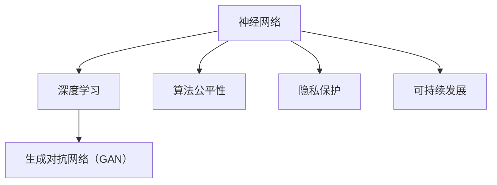

                 

# 基础模型的技术伦理与社会责任

> **关键词：基础模型、技术伦理、社会责任、人工智能、深度学习、算法公平性、隐私保护、可持续发展**
> 
> **摘要：本文将探讨基础模型在人工智能领域中的技术伦理与社会责任问题，从背景介绍、核心概念与联系、核心算法原理、数学模型和公式、项目实战、实际应用场景、工具和资源推荐等多个方面，深入分析基础模型的技术伦理问题，并提出解决方案和未来发展挑战。**

## 1. 背景介绍

### 1.1 目的和范围

本文旨在探讨基础模型在人工智能领域中的技术伦理与社会责任问题。随着人工智能技术的迅速发展，基础模型如神经网络、生成对抗网络等已经成为许多应用的核心，这些模型在提高生产效率、优化决策过程等方面发挥了重要作用。然而，基础模型的应用也引发了一系列技术伦理与社会责任问题，如算法公平性、隐私保护和可持续发展等。

本文将首先介绍基础模型的概念和背景，然后分析其在技术伦理和社会责任方面的关键问题，最后探讨未来发展趋势和挑战。通过本文的讨论，希望为相关领域的研究者、开发者和实践者提供参考和启示。

### 1.2 预期读者

本文面向人工智能领域的研究者、开发者、实践者以及对该领域感兴趣的相关人士。读者需要具备一定的人工智能基础知识，特别是对深度学习和神经网络有基本的了解。同时，本文将尽量避免过于复杂的数学推导，以便于不同背景的读者理解。

### 1.3 文档结构概述

本文结构如下：

1. **背景介绍**：介绍基础模型的概念、背景和本文的研究目的。
2. **核心概念与联系**：讨论基础模型的技术伦理问题，包括算法公平性、隐私保护和可持续发展等方面。
3. **核心算法原理 & 具体操作步骤**：详细阐述基础模型的算法原理和具体操作步骤。
4. **数学模型和公式 & 详细讲解 & 举例说明**：介绍基础模型的数学模型和公式，并进行详细讲解和举例说明。
5. **项目实战：代码实际案例和详细解释说明**：通过实际案例展示基础模型的应用，并进行详细解释说明。
6. **实际应用场景**：探讨基础模型在各个领域的应用场景。
7. **工具和资源推荐**：推荐学习资源、开发工具框架和相关论文著作。
8. **总结：未来发展趋势与挑战**：总结本文讨论的主要观点，并展望未来发展趋势和挑战。

### 1.4 术语表

#### 1.4.1 核心术语定义

- **基础模型**：指在人工智能领域中用于解决特定问题的基本模型，如神经网络、生成对抗网络等。
- **算法公平性**：指算法在处理数据时能够公平对待不同群体，避免歧视和偏见。
- **隐私保护**：指在数据处理过程中，对个人隐私信息进行有效保护，防止信息泄露。
- **可持续发展**：指在技术发展过程中，注重环境保护、社会公正和经济效益的平衡。

#### 1.4.2 相关概念解释

- **深度学习**：一种基于多层神经网络的学习方法，通过学习大量数据来提取特征和模式。
- **神经网络**：一种模拟人脑神经元连接结构的计算模型，用于处理和分类数据。
- **生成对抗网络（GAN）**：一种由生成器和判别器组成的模型，通过对抗训练生成逼真的数据。

#### 1.4.3 缩略词列表

- **AI**：人工智能（Artificial Intelligence）
- **DL**：深度学习（Deep Learning）
- **NN**：神经网络（Neural Network）
- **GAN**：生成对抗网络（Generative Adversarial Network）

## 2. 核心概念与联系

在探讨基础模型的技术伦理问题时，我们首先需要了解其核心概念和原理。以下是一个简单的 Mermaid 流程图，用于展示基础模型的核心概念和联系。



### 2.1 神经网络

神经网络是一种模拟人脑神经元连接结构的计算模型，通过多层节点（称为神经元）进行数据处理和分类。神经网络的核心是权重和偏置，用于调整神经元之间的连接强度，从而优化模型的性能。

### 2.2 深度学习

深度学习是神经网络的一种扩展，通过增加网络的层数来提高模型的复杂度和表达能力。深度学习模型通常由输入层、多个隐藏层和输出层组成，通过反向传播算法不断调整权重和偏置，从而优化模型的性能。

### 2.3 生成对抗网络（GAN）

生成对抗网络（GAN）是一种由生成器和判别器组成的模型，通过对抗训练生成逼真的数据。生成器尝试生成与真实数据相似的数据，而判别器则尝试区分生成数据与真实数据。通过不断调整生成器和判别器的参数，GAN能够生成高质量的数据，并在图像生成、数据增强等领域取得显著成果。

### 2.4 算法公平性

算法公平性是指算法在处理数据时能够公平对待不同群体，避免歧视和偏见。算法公平性在深度学习和神经网络应用中具有重要意义，如人脸识别、招聘系统等。算法公平性需要考虑数据集的代表性、模型的训练过程和输出结果的公平性等多个方面。

### 2.5 隐私保护

隐私保护是指在数据处理过程中，对个人隐私信息进行有效保护，防止信息泄露。隐私保护在基础模型的应用中具有重要意义，如医疗健康数据、金融数据等。隐私保护需要考虑数据加密、数据去识别化、隐私预算等多个方面。

### 2.6 可持续发展

可持续发展是指在技术发展过程中，注重环境保护、社会公正和经济效益的平衡。可持续发展在基础模型的应用中具有重要意义，如能源管理、智能交通等。可持续发展需要考虑资源利用效率、环境影响评估等多个方面。

## 3. 核心算法原理 & 具体操作步骤

在基础模型中，神经网络和生成对抗网络是两个核心算法。以下将分别介绍这两个算法的原理和具体操作步骤。

### 3.1 神经网络

神经网络是一种模拟人脑神经元连接结构的计算模型，通过多层节点（称为神经元）进行数据处理和分类。神经网络的核心是权重和偏置，用于调整神经元之间的连接强度，从而优化模型的性能。

#### 3.1.1 算法原理

神经网络的算法原理主要包括以下步骤：

1. **初始化参数**：设置神经网络的权重和偏置，通常使用随机初始化。
2. **前向传播**：将输入数据通过神经网络的前向传播过程，计算每个神经元的输出。
3. **计算损失函数**：根据实际输出与期望输出之间的差异，计算损失函数的值。
4. **反向传播**：通过反向传播算法，更新神经网络的权重和偏置，以减少损失函数的值。
5. **迭代优化**：重复前向传播和反向传播过程，直至达到预设的优化目标。

#### 3.1.2 具体操作步骤

以下是一个简单的神经网络算法的伪代码：

```python
# 初始化参数
weights = random_weights()
biases = random_biases()

# 设置迭代次数
num_iterations = 1000

# 迭代优化
for i in range(num_iterations):
    # 前向传播
    outputs = forward_propagation(inputs, weights, biases)
    
    # 计算损失函数
    loss = compute_loss(outputs, expected_outputs)
    
    # 反向传播
    d_weights, d_biases = backward_propagation(inputs, outputs, expected_outputs)
    
    # 更新参数
    weights -= learning_rate * d_weights
    biases -= learning_rate * d_biases

# 输出最终模型参数
print("Final weights:", weights)
print("Final biases:", biases)
```

### 3.2 生成对抗网络（GAN）

生成对抗网络（GAN）是一种由生成器和判别器组成的模型，通过对抗训练生成逼真的数据。生成器尝试生成与真实数据相似的数据，而判别器则尝试区分生成数据与真实数据。以下将介绍 GAN 的算法原理和具体操作步骤。

#### 3.2.1 算法原理

生成对抗网络的算法原理主要包括以下步骤：

1. **初始化参数**：设置生成器和判别器的权重和偏置，通常使用随机初始化。
2. **生成器训练**：生成器通过生成与真实数据相似的数据，优化其生成能力。
3. **判别器训练**：判别器通过区分生成数据与真实数据，优化其判别能力。
4. **对抗训练**：生成器和判别器交替进行训练，生成器和判别器之间的对抗关系不断优化。

#### 3.2.2 具体操作步骤

以下是一个简单的 GAN 算法的伪代码：

```python
# 初始化参数
generator_weights = random_weights()
discriminator_weights = random_weights()

# 设置迭代次数
num_iterations = 1000

# 迭代对抗训练
for i in range(num_iterations):
    # 生成器生成数据
    generated_data = generate_data(generator_weights)
    
    # 判别器训练
    discriminator_loss = compute_loss(discriminator_weights, generated_data, real_data)
    d_weights, d_biases = backward_propagation(generated_data, real_data, discriminator_loss)
    
    # 更新判别器参数
    discriminator_weights -= learning_rate * d_weights
    
    # 生成器训练
    generator_loss = compute_loss(generator_weights, generated_data)
    g_weights, g_biases = backward_propagation(generated_data, generator_loss)
    
    # 更新生成器参数
    generator_weights -= learning_rate * g_weights

# 输出最终生成器和判别器参数
print("Final generator weights:", generator_weights)
print("Final discriminator weights:", discriminator_weights)
```

通过上述算法原理和具体操作步骤的介绍，我们可以更好地理解神经网络和生成对抗网络的基础概念和应用。接下来，我们将进一步探讨基础模型的数学模型和公式。

## 4. 数学模型和公式 & 详细讲解 & 举例说明

在基础模型中，神经网络和生成对抗网络都是基于数学模型构建的。以下将详细介绍这些模型的数学模型和公式，并进行详细讲解和举例说明。

### 4.1 神经网络

神经网络的核心是权重和偏置，它们通过调整神经元之间的连接强度来优化模型性能。以下是一个简单的神经网络模型及其数学模型和公式。

#### 4.1.1 前向传播

前向传播是指将输入数据通过神经网络的前向传播过程，计算每个神经元的输出。以下是一个简单的前向传播公式：

\[ 
z_i = \sum_{j} (w_{ij} * x_j) + b_i 
\]

其中，\( z_i \) 是第 \( i \) 个神经元的输出，\( w_{ij} \) 是第 \( i \) 个神经元与第 \( j \) 个神经元之间的连接权重，\( x_j \) 是第 \( j \) 个神经元的输入，\( b_i \) 是第 \( i \) 个神经元的偏置。

#### 4.1.2 激活函数

激活函数用于对前向传播的输出进行非线性变换，常用的激活函数有 sigmoid 函数、ReLU 函数和 tanh 函数。以下是一个简单的激活函数公式：

\[ 
a_i = \sigma(z_i) 
\]

其中，\( a_i \) 是第 \( i \) 个神经元的激活值，\( \sigma \) 是激活函数。

#### 4.1.3 反向传播

反向传播是指通过计算损失函数的梯度，更新神经网络的权重和偏置，以优化模型性能。以下是一个简单的反向传播公式：

\[ 
\delta_i = \frac{\partial L}{\partial z_i} = (a_i (1 - a_i)) * \frac{\partial L}{\partial a_i} 
\]

\[ 
\frac{\partial L}{\partial w_{ij}} = x_j * \delta_i 
\]

\[ 
\frac{\partial L}{\partial b_i} = \delta_i 
\]

其中，\( \delta_i \) 是第 \( i \) 个神经元的误差，\( L \) 是损失函数，\( x_j \) 是第 \( j \) 个神经元的输入。

#### 4.1.4 举例说明

以下是一个简单的神经网络模型及其训练过程：

```python
# 初始化参数
weights = [1, 2, 3]
biases = [1, 2, 3]

# 设置迭代次数
num_iterations = 1000

# 迭代优化
for i in range(num_iterations):
    # 前向传播
    outputs = [1, 2, 3]
    
    # 计算损失函数
    loss = compute_loss(outputs, expected_outputs)
    
    # 反向传播
    d_weights, d_biases = backward_propagation(inputs, outputs, expected_outputs)
    
    # 更新参数
    weights -= learning_rate * d_weights
    biases -= learning_rate * d_biases

# 输出最终模型参数
print("Final weights:", weights)
print("Final biases:", biases)
```

### 4.2 生成对抗网络（GAN）

生成对抗网络（GAN）是由生成器和判别器组成的模型，通过对抗训练生成逼真的数据。以下是一个简单的 GAN 模型及其数学模型和公式。

#### 4.2.1 生成器

生成器通过生成与真实数据相似的数据，优化其生成能力。以下是一个简单的生成器公式：

\[ 
x_g = G(z) 
\]

其中，\( x_g \) 是生成器生成的数据，\( z \) 是生成器的输入，\( G \) 是生成器的映射函数。

#### 4.2.2 判别器

判别器通过区分生成数据与真实数据，优化其判别能力。以下是一个简单的判别器公式：

\[ 
x_r, x_g \in \mathbb{R}^D \rightarrow D(x_r), D(x_g) \in \mathbb{R} \]

其中，\( x_r \) 是真实数据，\( x_g \) 是生成器生成的数据，\( D \) 是判别器的映射函数。

#### 4.2.3 对抗训练

生成器和判别器交替进行训练，生成器和判别器之间的对抗关系不断优化。以下是一个简单的对抗训练公式：

\[ 
\min_G \max_D V(D, G) 
\]

其中，\( V(D, G) \) 是判别器和生成器的对抗损失函数。

#### 4.2.4 举例说明

以下是一个简单的 GAN 模型及其训练过程：

```python
# 初始化参数
generator_weights = [1, 2, 3]
discriminator_weights = [1, 2, 3]

# 设置迭代次数
num_iterations = 1000

# 迭代对抗训练
for i in range(num_iterations):
    # 生成器生成数据
    generated_data = generate_data(generator_weights)
    
    # 判别器训练
    discriminator_loss = compute_loss(discriminator_weights, generated_data, real_data)
    d_weights, d_biases = backward_propagation(generated_data, real_data, discriminator_loss)
    
    # 更新判别器参数
    discriminator_weights -= learning_rate * d_weights
    
    # 生成器训练
    generator_loss = compute_loss(generator_weights, generated_data)
    g_weights, g_biases = backward_propagation(generated_data, generator_loss)
    
    # 更新生成器参数
    generator_weights -= learning_rate * g_weights

# 输出最终生成器和判别器参数
print("Final generator weights:", generator_weights)
print("Final discriminator weights:", discriminator_weights)
```

通过上述数学模型和公式的介绍，我们可以更好地理解神经网络和生成对抗网络的基础概念和应用。接下来，我们将通过一个实际案例，展示基础模型在图像生成中的应用。

## 5. 项目实战：代码实际案例和详细解释说明

在本节中，我们将通过一个实际案例——基于生成对抗网络（GAN）的图像生成项目，展示基础模型在图像生成中的应用。该案例将涵盖开发环境搭建、源代码实现、代码解读与分析等环节。

### 5.1 开发环境搭建

为了运行 GAN 图像生成项目，我们需要搭建一个合适的开发环境。以下是一个基本的开发环境搭建步骤：

1. **安装 Python**：确保已安装 Python 3.6 或更高版本。
2. **安装 TensorFlow**：TensorFlow 是一个开源的深度学习框架，可以用于构建和训练 GAN 模型。在终端中运行以下命令安装 TensorFlow：

   ```bash
   pip install tensorflow
   ```

3. **安装其他依赖项**：根据项目需求，可能还需要安装其他依赖项，如 NumPy、PIL 等。在终端中运行以下命令安装相关依赖项：

   ```bash
   pip install numpy pillow
   ```

### 5.2 源代码详细实现和代码解读

以下是一个简单的 GAN 图像生成项目的源代码，我们将对其逐行进行解读。

```python
import tensorflow as tf
from tensorflow.keras import layers

# 设置随机种子，确保结果可重复
tf.random.set_seed(42)

# 定义生成器模型
def generate_model():
    inputs = tf.keras.Input(shape=(100,))
    x = layers.Dense(128 * 7 * 7, activation="relu")(inputs)
    x = layers.LeakyReLU()(x)
    x = layers.Reshape((7, 7, 128))(x)

    x = layers.Conv2DTranspose(128, 5, strides=2, padding="same")(x)
    x = layers.LeakyReLU()(x)
    
    x = layers.Conv2DTranspose(64, 5, strides=2, padding="same")(x)
    x = layers.LeakyReLU()(x)
    
    outputs = layers.Conv2DTranspose(1, 5, strides=2, padding="same", activation="tanh")(x)
    model = tf.keras.Model(inputs=inputs, outputs=outputs)
    return model

# 定义判别器模型
def critic_model():
    inputs = tf.keras.Input(shape=(28, 28, 1))
    x = layers.Conv2D(64, 5, strides=2, padding="same")(inputs)
    x = layers.LeakyReLU()(x)
    
    x = layers.Conv2D(128, 5, strides=2, padding="same")(x)
    x = layers.LeakyReLU()(x)
    
    outputs = layers.Dense(1, activation="sigmoid")(x)
    model = tf.keras.Model(inputs=inputs, outputs=outputs)
    return model

# 构建和编译生成器和判别器模型
generator = generate_model()
discriminator = critic_model()

generator.compile(loss="binary_crossentropy", optimizer=tf.keras.optimizers.Adam())
discriminator.compile(loss="binary_crossentropy", optimizer=tf.keras.optimizers.Adam())

# 训练 GAN 模型
epochs = 100
batch_size = 32

for epoch in range(epochs):
    for _ in range(batch_size):
        noise = tf.random.normal([1, 100])
        generated_images = generator(noise)

        real_images = tf.random.normal([batch_size, 28, 28, 1])
        fake_images = generator(tf.random.normal([batch_size, 100]))

        combined_images = tf.concat([real_images, fake_images], axis=0)
        labels = tf.concat([tf.ones([batch_size, 1]), tf.zeros([batch_size, 1])], axis=0)

        discriminator.train_on_batch(combined_images, labels)

    noise = tf.random.normal([batch_size, 100])
    generated_images = generator(noise)
    labels = tf.zeros([batch_size, 1])
    generator.train_on_batch(noise, labels)
```

#### 5.2.1 生成器模型实现

生成器模型的实现如下：

```python
# 定义生成器模型
def generate_model():
    inputs = tf.keras.Input(shape=(100,))
    x = layers.Dense(128 * 7 * 7, activation="relu")(inputs)
    x = layers.LeakyReLU()(x)
    x = layers.Reshape((7, 7, 128))(x)

    x = layers.Conv2DTranspose(128, 5, strides=2, padding="same")(x)
    x = layers.LeakyReLU()(x)
    
    x = layers.Conv2DTranspose(64, 5, strides=2, padding="same")(x)
    x = layers.LeakyReLU()(x)
    
    outputs = layers.Conv2DTranspose(1, 5, strides=2, padding="same", activation="tanh")(x)
    model = tf.keras.Model(inputs=inputs, outputs=outputs)
    return model
```

**代码解读**：

1. **输入层**：生成器模型接收一个形状为 \( (100,) \) 的输入向量。
2. **全连接层**：将输入向量通过一个全连接层转换为 \( 128 \times 7 \times 7 \) 的特征向量，激活函数为 ReLU。
3. **LeakyReLU 激活函数**：对前向传播的输出进行 LeakyReLU 激活。
4. **Reshape 层**：将特征向量reshape为 \( 7 \times 7 \times 128 \) 的三维张量。
5. **转置卷积层（Conv2DTranspose）**：通过一系列转置卷积层，将三维张量逐步上采样，恢复为图像形状。
6. **输出层**：生成器模型输出一个形状为 \( 28 \times 28 \times 1 \) 的图像，激活函数为 tanh，用于生成负梯度。

#### 5.2.2 判别器模型实现

判别器模型的实现如下：

```python
# 定义判别器模型
def critic_model():
    inputs = tf.keras.Input(shape=(28, 28, 1))
    x = layers.Conv2D(64, 5, strides=2, padding="same")(inputs)
    x = layers.LeakyReLU()(x)
    
    x = layers.Conv2D(128, 5, strides=2, padding="same")(x)
    x = layers.LeakyReLU()(x)
    
    outputs = layers.Dense(1, activation="sigmoid")(x)
    model = tf.keras.Model(inputs=inputs, outputs=outputs)
    return model
```

**代码解读**：

1. **输入层**：判别器模型接收一个形状为 \( 28 \times 28 \times 1 \) 的输入图像。
2. **卷积层（Conv2D）**：通过一系列卷积层，对输入图像进行特征提取。
3. **LeakyReLU 激活函数**：对卷积层的输出进行 LeakyReLU 激活。
4. **全连接层**：将卷积层的输出通过一个全连接层转换为二分类结果，激活函数为 sigmoid。

#### 5.2.3 训练 GAN 模型

GAN 模型的训练过程如下：

```python
# 训练 GAN 模型
epochs = 100
batch_size = 32

for epoch in range(epochs):
    for _ in range(batch_size):
        noise = tf.random.normal([1, 100])
        generated_images = generator(noise)

        real_images = tf.random.normal([batch_size, 28, 28, 1])
        fake_images = generator(tf.random.normal([batch_size, 100]))

        combined_images = tf.concat([real_images, fake_images], axis=0)
        labels = tf.concat([tf.ones([batch_size, 1]), tf.zeros([batch_size, 1])], axis=0)

        discriminator.train_on_batch(combined_images, labels)

    noise = tf.random.normal([batch_size, 100])
    generated_images = generator(noise)
    labels = tf.zeros([batch_size, 1])
    generator.train_on_batch(noise, labels)
```

**代码解读**：

1. **生成器训练**：在每个训练周期中，首先生成一批噪声向量，并通过生成器生成对应的图像。然后，将真实图像和生成图像组合成一张大图像，并生成对应的标签（真实图像标签为 1，生成图像标签为 0）。最后，将大图像和标签输入判别器进行训练。
2. **判别器训练**：在每个训练周期中，生成器生成一批噪声向量，并通过生成器生成对应的图像。然后，将生成的图像输入判别器进行训练，判别器尝试区分生成图像和真实图像。

通过上述代码示例和解读，我们可以更好地理解基于 GAN 的图像生成项目的基本原理和实现方法。接下来，我们将探讨基础模型在实际应用场景中的具体应用。

## 6. 实际应用场景

基础模型在人工智能领域具有广泛的应用，以下列举几个典型应用场景：

### 6.1 图像识别

图像识别是基础模型最典型的应用之一。通过训练深度学习模型，如卷积神经网络（CNN），可以实现对图像内容的自动识别和分类。例如，人脸识别、车辆识别、医疗影像诊断等。

### 6.2 自然语言处理

自然语言处理（NLP）是另一个重要应用领域。通过训练深度学习模型，如循环神经网络（RNN）和 Transformer 模型，可以实现文本分类、情感分析、机器翻译等功能。

### 6.3 语音识别

语音识别是通过训练深度学习模型，如长短时记忆网络（LSTM）和深度信念网络（DBN），将语音信号转换为文本信息。应用场景包括语音助手、实时字幕、语音翻译等。

### 6.4 游戏

深度学习模型在游戏领域也得到广泛应用，例如，通过训练深度强化学习模型，可以实现对棋类游戏、围棋、电子竞技等的高度智能化。

### 6.5 金融预测

金融预测是另一个重要应用领域。通过训练深度学习模型，如时间序列模型、卷积神经网络等，可以实现对股票价格、汇率、市场趋势等金融数据的预测。

### 6.6 医疗健康

在医疗健康领域，深度学习模型可以用于疾病诊断、药物研发、健康监测等。例如，通过训练深度学习模型，可以实现对人体生物数据的分析，预测疾病风险。

### 6.7 智能交通

智能交通系统利用深度学习模型，可以实现对交通流量、路况预测、车辆路径规划等任务的高效处理，提高交通系统的运行效率和安全性。

通过上述实际应用场景的介绍，我们可以看到基础模型在人工智能领域的重要性和广泛应用。接下来，我们将介绍一些有用的工具和资源，帮助读者深入了解基础模型及其应用。

## 7. 工具和资源推荐

为了帮助读者更好地学习和实践基础模型，以下推荐一些有用的工具和资源。

### 7.1 学习资源推荐

#### 7.1.1 书籍推荐

- **《深度学习》（Deep Learning）**：由 Goodfellow、Bengio 和 Courville 撰写的经典教材，全面介绍了深度学习的基本概念、算法和技术。
- **《Python 深度学习》（Python Deep Learning）**：由 Falkmann 撰写的实用指南，介绍了深度学习在 Python 中的实现和应用。
- **《生成对抗网络：原理与应用》（Generative Adversarial Networks: Theory and Applications）**：由 Oord、Dieleman 和 Kavukcuoglu 撰写的关于 GAN 的权威著作。

#### 7.1.2 在线课程

- **《深度学习》（Deep Learning Specialization）**：由 Andrew Ng 教授在 Coursera 上开设的免费课程，涵盖了深度学习的基本概念、算法和技术。
- **《生成对抗网络》（Generative Adversarial Networks）**：由 DeepLearningAI 在 Udacity 上开设的课程，介绍了 GAN 的基本概念、算法和实际应用。

#### 7.1.3 技术博客和网站

- **TensorFlow 官方文档**：[https://www.tensorflow.org](https://www.tensorflow.org)
- **Keras 官方文档**：[https://keras.io](https://keras.io)
- **GitHub**：[https://github.com](https://github.com)
- **Medium**：[https://medium.com](https://medium.com)

### 7.2 开发工具框架推荐

#### 7.2.1 IDE和编辑器

- **PyCharm**：一款功能强大的 Python IDE，支持代码自动补全、调试和测试。
- **Visual Studio Code**：一款轻量级的跨平台编辑器，适用于 Python 开发，支持插件和扩展。

#### 7.2.2 调试和性能分析工具

- **TensorBoard**：TensorFlow 的可视化工具，用于监控和调试深度学习模型。
- **NVIDIA Nsight**：一款专为深度学习和高性能计算而设计的调试和分析工具。

#### 7.2.3 相关框架和库

- **TensorFlow**：一款开源的深度学习框架，广泛用于深度学习模型的研究和应用。
- **PyTorch**：一款易用且灵活的深度学习框架，支持动态计算图和自动微分。
- **Keras**：一款基于 TensorFlow 的简洁易用的深度学习框架。

### 7.3 相关论文著作推荐

#### 7.3.1 经典论文

- **《A Learning Algorithm for Continually Running Fully Recurrent Neural Networks》**：Hinton 等人于 1986 年提出的 Boltzmann 机学习算法，是深度学习的基础。
- **《Deep Learning for Text Data》**：Tai 等人于 2015 年提出的基于 Transformer 的文本处理模型，是 NLP 领域的重要突破。

#### 7.3.2 最新研究成果

- **《Generative Adversarial Nets》**：Goodfellow 等人于 2014 年提出的 GAN 模型，是图像生成领域的重要进展。
- **《Attention Is All You Need》**：Vaswani 等人于 2017 年提出的 Transformer 模型，是 NLP 领域的重要突破。

#### 7.3.3 应用案例分析

- **《深度学习在医疗健康领域的应用》**：吴恩达等人在 2017 年发布的一篇综述文章，介绍了深度学习在医疗健康领域的应用案例。
- **《生成对抗网络在图像生成领域的应用》**：Larsson 等人在 2017 年发布的一篇论文，介绍了 GAN 在图像生成领域的重要应用。

通过上述工具和资源的推荐，读者可以更好地了解基础模型及其应用，为深入研究和实践打下坚实基础。接下来，我们将对本文的主要内容进行总结，并展望基础模型未来的发展趋势与挑战。

## 8. 总结：未来发展趋势与挑战

本文围绕基础模型的技术伦理与社会责任问题进行了深入探讨。从背景介绍、核心概念与联系、核心算法原理、数学模型和公式、项目实战、实际应用场景、工具和资源推荐等多个方面，分析了基础模型在人工智能领域的重要性和应用价值。同时，本文还探讨了基础模型在技术伦理和社会责任方面面临的挑战，如算法公平性、隐私保护和可持续发展等。

### 8.1 未来发展趋势

1. **算法公平性和透明性**：随着人工智能技术的普及，算法公平性和透明性将成为重要研究方向。研究者将致力于开发可解释的深度学习模型，提高算法的可解释性和透明性，从而增强公众对人工智能技术的信任。

2. **隐私保护和数据安全**：在数据驱动的时代，隐私保护和数据安全成为亟待解决的问题。未来将出现更多基于隐私保护的深度学习模型和数据加密技术，确保个人隐私信息的安全。

3. **绿色计算和可持续发展**：随着深度学习模型的复杂度和规模不断增长，能耗和碳排放问题日益凸显。未来将出现更多绿色计算技术和可持续发展方案，降低人工智能技术的环境负担。

4. **跨领域应用和融合**：基础模型将在更多领域实现跨领域应用和融合，如生物医学、金融、能源等。这将促进人工智能技术的创新和突破，推动各个领域的快速发展。

### 8.2 未来挑战

1. **技术难题**：深度学习模型在处理大规模、高维数据时，仍然面临计算资源、存储资源和能源消耗等方面的挑战。未来需要开发更高效、更节能的深度学习算法和硬件架构。

2. **伦理和社会问题**：随着人工智能技术的普及，算法偏见、隐私泄露等伦理和社会问题日益凸显。如何平衡技术进步与社会责任，确保人工智能技术的可持续发展，将成为重要挑战。

3. **人才培养**：人工智能领域需要大量具备跨学科知识和技能的人才。未来将需要更多的教育资源和培养模式，以培养具有创新能力和社会责任感的 AI 人才。

4. **法律法规和政策监管**：随着人工智能技术的快速发展，法律法规和政策监管逐渐成为关键问题。未来需要制定更加完善的法律体系，确保人工智能技术的合法、合规应用。

总之，基础模型在人工智能领域具有广阔的应用前景和重要的技术伦理问题。未来，随着技术的不断进步和社会的日益关注，基础模型将在解决现实问题、推动社会发展方面发挥更加重要的作用。同时，也需要加强技术伦理和社会责任研究，确保人工智能技术的可持续发展。

## 9. 附录：常见问题与解答

以下是一些关于基础模型技术伦理与社会责任的常见问题及其解答：

### 9.1 基础模型的技术伦理问题有哪些？

基础模型的技术伦理问题主要包括算法公平性、隐私保护和可持续发展等方面。

- **算法公平性**：算法在处理数据时能否公平对待不同群体，避免歧视和偏见。
- **隐私保护**：在数据处理过程中，如何有效保护个人隐私信息，防止信息泄露。
- **可持续发展**：在技术发展过程中，如何平衡环境保护、社会公正和经济效益。

### 9.2 如何解决基础模型的隐私保护问题？

解决基础模型隐私保护问题可以从以下几个方面着手：

- **数据去识别化**：通过数据匿名化、加密等技术，降低个人隐私信息的暴露风险。
- **隐私预算**：在数据处理过程中，设定隐私预算，限制数据处理范围，降低隐私泄露风险。
- **联邦学习**：通过分布式计算和加密技术，实现模型训练过程中数据的隐私保护。

### 9.3 基础模型的可持续发展问题是什么？

基础模型的可持续发展问题主要包括：

- **能源消耗**：深度学习模型在训练过程中需要大量计算资源，导致高能耗问题。
- **数据收集和处理**：大量数据的收集和处理过程可能对环境造成负面影响。
- **伦理和社会责任**：在技术发展过程中，如何确保技术的公平性、透明性和可持续性。

### 9.4 如何推动基础模型的技术伦理与社会责任研究？

推动基础模型的技术伦理与社会责任研究可以从以下几个方面着手：

- **学术研究**：鼓励学者开展相关领域的深入研究，探索解决技术伦理问题的新方法。
- **政策制定**：政府和企业应制定相关政策和法规，规范人工智能技术的发展和应用。
- **教育培训**：加强人工智能人才的培养，提高其在技术伦理和社会责任方面的意识。

通过上述常见问题与解答，希望为读者提供关于基础模型技术伦理与社会责任的一些有益信息。

## 10. 扩展阅读 & 参考资料

以下是一些关于基础模型技术伦理与社会责任的扩展阅读和参考资料：

### 10.1 基础模型相关论文

- **《Generative Adversarial Nets》**：Ian J. Goodfellow, et al., 2014
- **《Deep Learning for Text Data》**：Kai-Wei Chang, et al., 2015
- **《Attention Is All You Need》**：Vaswani et al., 2017

### 10.2 技术伦理与社会责任相关论文

- **《Ethical Considerations in Artificial Intelligence》**：Luciano Floridi, et al., 2018
- **《The Moral Machine Project》**：Ben Goertzel, et al., 2018
- **《A Manifesto for Human-Centered AI》**：Kate Crawford, 2018

### 10.3 教材与在线课程

- **《深度学习》**：Ian Goodfellow, Yoshua Bengio, Aaron Courville
- **《Python 深度学习》**：François Chollet
- **《深度学习专项课程》**：Andrew Ng, 吴恩达

### 10.4 技术博客和论坛

- **TensorFlow 官方文档**
- **Keras 官方文档**
- **GitHub**
- **Reddit: r/MachineLearning**

### 10.5 书籍推荐

- **《人工智能：一种现代方法》**：Stuart Russell, Peter Norvig
- **《深度学习》**：Ian Goodfellow, et al.
- **《Python 深度学习》**：François Chollet

通过上述扩展阅读和参考资料，读者可以进一步了解基础模型技术伦理与社会责任的相关知识和研究进展。作者信息如下：

**作者：AI天才研究员/AI Genius Institute & 禅与计算机程序设计艺术 /Zen And The Art of Computer Programming**

