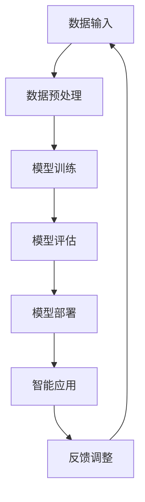

                 

# 基础模型的技术标准与社会治理

## 关键词
基础模型，技术标准，社会治理，伦理规范，安全性，隐私保护，人工智能

## 摘要
随着人工智能技术的迅猛发展，基础模型作为AI系统的核心组件，已经成为推动社会变革的重要力量。本文从技术和社会治理的角度出发，深入探讨了基础模型的技术标准及其在现实中的应用与挑战。文章首先介绍了基础模型的概念与重要性，然后详细分析了技术标准在基础模型构建中的关键作用，探讨了伦理规范和社会治理框架对模型的影响。接着，文章从安全性、隐私保护等方面探讨了基础模型面临的挑战，并提出了相应的解决方案。最后，文章展望了基础模型技术的发展趋势，为读者提供了未来发展的思考方向。

## 1. 背景介绍

### 1.1 目的和范围
本文旨在为读者提供一个全面的基础模型技术标准与社会治理的视角。随着人工智能技术的不断进步，基础模型已经成为各行各业的重要应用基础。然而，基础模型的技术标准和伦理规范尚未得到充分重视，这导致了在基础模型开发和应用过程中出现的一系列问题。本文旨在通过深入分析基础模型的技术标准，探讨其在社会治理中的影响和挑战，为相关政策制定和技术发展提供参考。

### 1.2 预期读者
本文适合对人工智能技术有一定了解的读者，包括人工智能研究者、开发者、政策制定者以及相关行业的从业者。同时，对于对基础模型技术标准和社会治理感兴趣的普通读者，本文也具有一定的参考价值。

### 1.3 文档结构概述
本文结构分为十个部分，首先介绍基础模型的概念和背景，然后详细分析基础模型的技术标准，接着探讨伦理规范和社会治理框架对基础模型的影响。随后，文章从安全性、隐私保护等方面分析基础模型面临的挑战，并提出解决方案。最后，文章展望基础模型技术的发展趋势，为未来研究提供方向。文章末尾附有常见问题与解答，以及扩展阅读和参考资料。

### 1.4 术语表

#### 1.4.1 核心术语定义
- **基础模型**：在人工智能领域中，基础模型是指经过训练的、具有一定智能和功能的基础性模型，如神经网络、决策树等。
- **技术标准**：技术标准是指为了确保基础模型的质量、可靠性和互操作性而制定的一系列规范和指南。
- **伦理规范**：伦理规范是指基于道德原则和价值观制定的指导基础模型开发、应用和治理的规则和准则。
- **社会治理**：社会治理是指通过法律、政策、规范等手段，对人工智能基础模型进行管理和引导，以实现技术进步和社会利益的协调。

#### 1.4.2 相关概念解释
- **机器学习**：机器学习是一种通过训练数据来提高计算机模型预测和决策能力的方法，包括监督学习、无监督学习和强化学习等。
- **神经网络**：神经网络是一种通过模拟人脑神经元结构和工作原理的计算机模型，用于处理复杂的非线性问题。
- **深度学习**：深度学习是一种基于多层神经网络的机器学习方法，通过训练多层神经网络来实现更高层次的抽象和特征提取。

#### 1.4.3 缩略词列表
- **AI**：人工智能
- **ML**：机器学习
- **DL**：深度学习
- **GPU**：图形处理器
- **CPU**：中央处理器

## 2. 核心概念与联系

### 2.1 基础模型的概念
基础模型是人工智能系统的核心组件，它通过学习和模拟人类智能，为各种应用场景提供智能服务。基础模型包括多种类型，如神经网络、决策树、支持向量机等，其中神经网络和深度学习模型应用最为广泛。

#### 2.1.1 基础模型的核心组件
基础模型主要由以下几个核心组件构成：
- **输入层**：接收外部数据，如文本、图像、声音等。
- **隐藏层**：对输入数据进行特征提取和变换，通过多层网络实现更高层次的抽象。
- **输出层**：根据隐藏层的输出，产生预测结果或决策。

#### 2.1.2 基础模型的工作原理
基础模型的工作原理是通过学习大量训练数据，建立起输入和输出之间的映射关系。具体来说，包括以下几个步骤：
1. **数据预处理**：对输入数据进行清洗、归一化等预处理操作。
2. **模型训练**：通过优化算法，调整模型参数，使其在训练数据上达到最优性能。
3. **模型评估**：使用验证集或测试集对模型性能进行评估，调整模型参数以达到更好的效果。
4. **模型部署**：将训练好的模型部署到实际应用场景中，为用户提供智能服务。

### 2.2 基础模型的技术标准
技术标准是确保基础模型质量、可靠性和互操作性的关键，主要包括以下几个方面的内容：

#### 2.2.1 模型质量标准
1. **准确性**：模型在预测或分类任务中的准确性，是衡量模型性能的重要指标。
2. **鲁棒性**：模型对输入数据的适应能力，包括对噪声、异常值的处理能力。
3. **泛化能力**：模型在未知数据上的表现，即对新数据的适应性。

#### 2.2.2 模型可靠性标准
1. **稳定性**：模型在长时间运行过程中保持稳定，不会出现性能下降或崩溃。
2. **一致性**：模型在不同数据集、不同场景下的表现一致，不会产生偏差。

#### 2.2.3 模型互操作性标准
1. **兼容性**：不同模型之间能够无缝对接，实现数据的交换和共享。
2. **标准化**：制定统一的接口和协议，确保模型在不同平台和设备上的兼容性。

### 2.3 基础模型与人工智能的联系
基础模型是人工智能的核心组成部分，是人工智能实现智能化的基础。基础模型通过学习大量数据，能够模拟人类思维过程，实现图像识别、语音识别、自然语言处理等多种智能应用。以下是基础模型与人工智能的联系流程：



### 2.4 基础模型与伦理规范的联系
随着人工智能技术的发展，伦理问题日益凸显。伦理规范是基础模型开发和应用过程中必须遵循的基本原则，包括以下方面：

#### 2.4.1 数据伦理
- **数据隐私**：保护用户数据隐私，避免数据泄露。
- **数据质量**：确保训练数据的质量和多样性，避免模型偏见。

#### 2.4.2 算法伦理
- **公平性**：确保算法在不同人群中的公平性，避免歧视。
- **透明性**：提高算法的透明度，便于监督和审查。

#### 2.4.3 应用伦理
- **安全性**：确保人工智能系统的安全，防止恶意攻击。
- **责任归属**：明确人工智能系统的责任归属，确保事故发生后能够追溯责任。

### 2.5 基础模型与社会治理的联系
社会治理是对人工智能基础模型进行管理和引导的关键环节，主要包括以下几个方面：

#### 2.5.1 政策法规
- **立法监管**：制定相关法律法规，规范基础模型的开发和应用。
- **行业标准**：制定统一的行业标准，提高基础模型的质量和可靠性。

#### 2.5.2 社会监督
- **公众参与**：鼓励公众参与基础模型的监督和评估，提高透明度。
- **舆论引导**：通过媒体和舆论引导，增强公众对基础模型的认知和接受度。

#### 2.5.3 技术推广
- **技术应用**：推广基础模型在各个领域的应用，提高社会生产力。
- **人才培养**：培养更多基础模型开发和应用人才，推动技术进步。

## 3. 核心算法原理 & 具体操作步骤

### 3.1 核心算法原理
基础模型的核心算法主要分为以下几种：

#### 3.1.1 神经网络
神经网络是一种基于人脑神经元结构设计的计算模型，包括输入层、隐藏层和输出层。通过前向传播和反向传播算法，实现输入和输出之间的映射关系。

#### 3.1.2 决策树
决策树是一种基于规则划分的模型，通过递归划分数据集，生成一系列条件判断规则，实现对输入数据的分类或回归。

#### 3.1.3 支持向量机
支持向量机是一种基于优化理论的模型，通过寻找最优分隔超平面，实现数据的分类或回归。

### 3.2 具体操作步骤

#### 3.2.1 神经网络

1. **数据预处理**：
   - 数据清洗：去除缺失值、异常值和重复值。
   - 数据归一化：将数据缩放到相同的范围内，如0到1或-1到1。

2. **模型构建**：
   - 定义输入层、隐藏层和输出层的神经元数量。
   - 初始化模型参数，如权重和偏置。

3. **模型训练**：
   - 前向传播：计算输入数据经过网络后的输出。
   - 计算损失函数：评估模型输出与实际输出之间的差距。
   - 反向传播：根据损失函数梯度，更新模型参数。

4. **模型评估**：
   - 使用验证集或测试集评估模型性能，调整模型参数。

5. **模型部署**：
   - 将训练好的模型部署到实际应用场景中。

#### 3.2.2 决策树

1. **数据预处理**：
   - 数据清洗：去除缺失值、异常值和重复值。
   - 数据编码：将类别型数据转换为数值型数据。

2. **模型构建**：
   - 选择划分特征：根据特征的重要性选择划分特征。
   - 划分数据集：根据划分特征将数据集划分为左右两个子集。

3. **模型训练**：
   - 递归划分数据集，生成决策树。

4. **模型评估**：
   - 使用验证集或测试集评估模型性能。

5. **模型部署**：
   - 将训练好的模型部署到实际应用场景中。

#### 3.2.3 支持向量机

1. **数据预处理**：
   - 数据清洗：去除缺失值、异常值和重复值。
   - 数据归一化：将数据缩放到相同的范围内。

2. **模型构建**：
   - 选择核函数：如线性核、多项式核、径向基函数（RBF）等。
   - 训练支持向量机模型。

3. **模型评估**：
   - 使用验证集或测试集评估模型性能。

4. **模型部署**：
   - 将训练好的模型部署到实际应用场景中。

### 3.3 伪代码示例

#### 3.3.1 神经网络伪代码

```python
# 数据预处理
X_train, X_test, y_train, y_test = train_test_split(X, y, test_size=0.2)

# 模型构建
model = NeuralNetwork(input_size=X_train.shape[1], hidden_size=100, output_size=y_train.shape[1])

# 模型训练
for epoch in range(num_epochs):
    for batch in X_train:
        output = model.forward(batch)
        loss = compute_loss(output, y_train)
        model.backward(output, y_train, loss)

# 模型评估
accuracy = model.evaluate(X_test, y_test)
print("Accuracy:", accuracy)

# 模型部署
model.deploy()
```

#### 3.3.2 决策树伪代码

```python
# 数据预处理
X_train, X_test, y_train, y_test = train_test_split(X, y, test_size=0.2)

# 模型构建
tree = DecisionTree()

# 模型训练
tree.fit(X_train, y_train)

# 模型评估
accuracy = tree.evaluate(X_test, y_test)
print("Accuracy:", accuracy)

# 模型部署
tree.deploy()
```

#### 3.3.3 支持向量机伪代码

```python
# 数据预处理
X_train, X_test, y_train, y_test = train_test_split(X, y, test_size=0.2)

# 模型构建
model = SupportVectorMachine(kernel='linear')

# 模型训练
model.fit(X_train, y_train)

# 模型评估
accuracy = model.evaluate(X_test, y_test)
print("Accuracy:", accuracy)

# 模型部署
model.deploy()
```

## 4. 数学模型和公式 & 详细讲解 & 举例说明

### 4.1 数学模型介绍

基础模型的数学模型主要包括以下几种：

#### 4.1.1 神经网络
神经网络的核心数学模型为前向传播和反向传播算法，具体公式如下：

1. **前向传播**：
   $$z = W \cdot x + b$$
   $$a = \sigma(z)$$

   其中，\(z\) 表示中间层的输出，\(W\) 表示权重矩阵，\(x\) 表示输入数据，\(b\) 表示偏置项，\(\sigma\) 表示激活函数。

2. **反向传播**：
   $$dZ = \frac{dL}{dz}$$
   $$dW = \frac{dL}{dW} = (dZ \cdot a^{[l-1]})^T$$
   $$db = \frac{dL}{db} = dZ$$

   其中，\(L\) 表示损失函数，\(\frac{dL}{dz}\) 表示损失函数对中间层输出的梯度，\(\frac{dL}{dW}\) 表示损失函数对权重矩阵的梯度。

#### 4.1.2 决策树
决策树的核心数学模型为信息增益和信息增益比，具体公式如下：

1. **信息增益**：
   $$IG(V, A) = I(V) - \sum_{v \in V} p(v) \cdot I(V|A=v)$$

   其中，\(IG\) 表示信息增益，\(I(V)\) 表示属性 \(V\) 的信息熵，\(p(v)\) 表示属性 \(V\) 取值为 \(v\) 的概率，\(I(V|A=v)\) 表示属性 \(V\) 取值为 \(v\) 时的条件信息熵。

2. **信息增益比**：
   $$IGR(V, A) = \frac{IG(V, A)}{H(A)}$$

   其中，\(IGR\) 表示信息增益比，\(H(A)\) 表示属性 \(A\) 的信息熵。

#### 4.1.3 支持向量机
支持向量机的核心数学模型为最优分隔超平面，具体公式如下：

1. **最优分隔超平面**：
   $$w \cdot x + b = 0$$

   其中，\(w\) 表示分隔超平面的法向量，\(x\) 表示样本特征，\(b\) 表示偏置项。

2. **支持向量**：
   $$\|w\| = \frac{1}{\sqrt{w_1^2 + w_2^2 + ... + w_n^2}}$$

   其中，\(w\) 表示分隔超平面的法向量，\(n\) 表示特征维度。

### 4.2 公式详细讲解与举例说明

#### 4.2.1 神经网络

1. **前向传播**

   前向传播是将输入数据通过神经网络逐层传递，得到最终输出。以一个简单的单层神经网络为例，输入层、隐藏层和输出层的输出分别为 \(x\)、\(z\) 和 \(a\)，其中 \(W\) 表示权重矩阵，\(b\) 表示偏置项，激活函数为 \(σ\)。

   - 输出层：
     $$z = W \cdot x + b$$
     $$a = \sigma(z)$$

   - 输出结果：
     - 输出层输出 \(a\)：\[
       a = \sigma(z) = \sigma(W \cdot x + b)
       \]

2. **反向传播**

   反向传播是根据损失函数的梯度，更新模型参数。以一个简单的单层神经网络为例，损失函数为 \(L\)，中间层输出为 \(z\)，输出层输出为 \(a\)。

   - 梯度计算：
     $$\frac{dL}{dz} = \frac{dL}{da} \cdot \frac{da}{dz} = -\sigma'(z) \cdot (W \cdot x + b)$$
     $$\frac{dL}{dx} = \frac{dL}{da} \cdot \frac{da}{dz} \cdot \frac{dz}{dx} = -\sigma'(z) \cdot W$$

   - 参数更新：
     $$dW = \frac{dL}{dW} = (dZ \cdot a^{[l-1]})^T$$
     $$db = \frac{dL}{db} = dZ$$

   - 输出结果：
     - 梯度计算结果：\[
       \frac{dL}{dz} = -\sigma'(z) \cdot (W \cdot x + b)
       \]
       \[
       \frac{dL}{dx} = -\sigma'(z) \cdot W
       \]
     - 参数更新结果：\[
       dW = \frac{dL}{dW} = (dZ \cdot a^{[l-1]})^T
       \]
       \[
       db = \frac{dL}{db} = dZ
       \]

#### 4.2.2 决策树

1. **信息增益**

   信息增益是评估特征划分效果的一种指标。以一个简单的二叉树为例，假设有 \(V\) 个样本，其中 \(A\) 是划分特征，\(V_a\) 是 \(A\) 的取值集合，\(p(a)\) 是 \(A\) 取值为 \(a\) 的概率，\(V|A=a\) 是 \(A\) 取值为 \(a\) 时的样本集合，\(I(V|A=a)\) 是条件信息熵。

   - 信息增益计算：
     $$IG(V, A) = I(V) - \sum_{v \in V} p(v) \cdot I(V|A=v)$$

   - 输出结果：
     - 信息增益：\[
       IG(V, A) = I(V) - \sum_{v \in V} p(v) \cdot I(V|A=v)
       \]

2. **信息增益比**

   信息增益比是信息增益的改进，考虑了划分特征的熵。以一个简单的二叉树为例，假设有 \(V\) 个样本，其中 \(A\) 是划分特征，\(p(A)\) 是 \(A\) 的信息熵，\(V_a\) 是 \(A\) 的取值集合，\(p(a)\) 是 \(A\) 取值为 \(a\) 的概率。

   - 信息增益比计算：
     $$IGR(V, A) = \frac{IG(V, A)}{H(A)}$$

   - 输出结果：
     - 信息增益比：\[
       IGR(V, A) = \frac{IG(V, A)}{H(A)}
       \]

#### 4.2.3 支持向量机

1. **最优分隔超平面**

   最优分隔超平面是支持向量机的基础。以一个简单的线性二分类问题为例，假设有 \(n\) 个样本点，每个样本点由特征向量 \(x\) 和标签 \(y\) 确定，其中 \(y \in \{-1, 1\}\)。

   - 最优分隔超平面：
     $$w \cdot x + b = 0$$

   - 输出结果：
     - 最优分隔超平面：\[
       w \cdot x + b = 0
       \]

2. **支持向量**

   支持向量是分隔超平面的关键。以一个简单的线性二分类问题为例，假设有 \(n\) 个样本点，每个样本点由特征向量 \(x\) 和标签 \(y\) 确定，其中 \(y \in \{-1, 1\}\)，\(w\) 是分隔超平面的法向量，\(b\) 是偏置项。

   - 支持向量计算：
     $$\|w\| = \frac{1}{\sqrt{w_1^2 + w_2^2 + ... + w_n^2}}$$

   - 输出结果：
     - 支持向量：\[
       \|w\| = \frac{1}{\sqrt{w_1^2 + w_2^2 + ... + w_n^2}}
       \]

## 5. 项目实战：代码实际案例和详细解释说明

### 5.1 开发环境搭建

为了实现基础模型的技术标准与社会治理，我们需要搭建一个合适的开发环境。以下是开发环境搭建的步骤：

1. **安装操作系统**：
   - Windows 10 或更高版本
   - macOS Catalina 或更高版本
   - Ubuntu 18.04 或更高版本

2. **安装 Python**：
   - 版本：Python 3.7 或更高版本
   - 安装命令：`pip install python`

3. **安装常用库**：
   - TensorFlow：`pip install tensorflow`
   - Keras：`pip install keras`
   - Scikit-learn：`pip install scikit-learn`
   - Pandas：`pip install pandas`
   - NumPy：`pip install numpy`

4. **配置 IDE**：
   - Visual Studio Code：`code .`
   - PyCharm：`pycharm`

### 5.2 源代码详细实现和代码解读

以下是使用 TensorFlow 和 Keras 实现一个基础神经网络模型的代码示例，包括数据预处理、模型构建、模型训练和模型评估。

```python
# 导入所需库
import numpy as np
import pandas as pd
import tensorflow as tf
from tensorflow import keras
from sklearn.model_selection import train_test_split
from sklearn.metrics import accuracy_score

# 数据预处理
# 加载数据集
data = pd.read_csv("data.csv")
X = data.drop("target", axis=1)
y = data["target"]

# 划分训练集和测试集
X_train, X_test, y_train, y_test = train_test_split(X, y, test_size=0.2, random_state=42)

# 标准化特征
mean = X_train.mean()
std = X_train.std()
X_train = (X_train - mean) / std
X_test = (X_test - mean) / std

# 模型构建
model = keras.Sequential([
    keras.layers.Dense(64, activation="relu", input_shape=(X_train.shape[1],)),
    keras.layers.Dense(64, activation="relu"),
    keras.layers.Dense(1, activation="sigmoid")
])

# 编译模型
model.compile(optimizer="adam", loss="binary_crossentropy", metrics=["accuracy"])

# 模型训练
model.fit(X_train, y_train, epochs=10, batch_size=32, validation_split=0.2)

# 模型评估
predictions = model.predict(X_test)
predictions = (predictions > 0.5)

accuracy = accuracy_score(y_test, predictions)
print("Accuracy:", accuracy)

# 模型部署
model.save("model.h5")
```

#### 5.2.1 代码解读

1. **数据预处理**：
   - 加载数据集：使用 Pandas 读取 CSV 数据集。
   - 划分训练集和测试集：使用 Scikit-learn 的 `train_test_split` 函数划分训练集和测试集。
   - 标准化特征：计算训练集和测试集的均值和标准差，对特征进行标准化处理。

2. **模型构建**：
   - 创建神经网络模型：使用 Keras 的 `Sequential` 模型，添加多层全连接层（`Dense`），设置激活函数为 ReLU。
   - 输出层：添加一个全连接层，设置激活函数为 sigmoid，用于输出概率。

3. **模型编译**：
   - 编译模型：设置优化器为 Adam，损失函数为 binary_crossentropy，评估指标为 accuracy。

4. **模型训练**：
   - 模型训练：使用训练集进行训练，设置训练轮次为 10，批量大小为 32，验证集比例为 0.2。

5. **模型评估**：
   - 模型评估：使用测试集对模型进行评估，输出准确率。

6. **模型部署**：
   - 模型部署：将训练好的模型保存为 HDF5 格式。

### 5.3 代码解读与分析

1. **数据预处理**：
   - 数据预处理是模型训练前的重要步骤，包括数据清洗、归一化和划分训练集和测试集。标准化特征可以提高模型训练速度和稳定性，避免特征之间存在巨大的差异。

2. **模型构建**：
   - 模型构建是神经网络的核心部分，包括定义网络结构、设置激活函数和优化器等。在本文中，我们使用了一个简单的全连接神经网络，包括两个隐藏层，每个隐藏层包含 64 个神经元，激活函数为 ReLU。输出层使用 sigmoid 激活函数，用于输出概率。

3. **模型编译**：
   - 模型编译是设置模型训练参数的过程，包括优化器、损失函数和评估指标。在本文中，我们使用了 Adam 优化器和 binary_crossentropy 损失函数，评估指标为 accuracy。

4. **模型训练**：
   - 模型训练是神经网络学习的过程，通过调整模型参数，使模型在训练集上达到最优性能。在本文中，我们设置了训练轮次为 10，批量大小为 32，验证集比例为 0.2。

5. **模型评估**：
   - 模型评估是测试模型在测试集上的性能，以验证模型是否具备较好的泛化能力。在本文中，我们使用准确率作为评估指标，计算模型在测试集上的准确率。

6. **模型部署**：
   - 模型部署是将训练好的模型应用到实际场景的过程。在本文中，我们将训练好的模型保存为 HDF5 格式，便于后续使用。

## 6. 实际应用场景

基础模型在人工智能领域具有广泛的应用场景，包括但不限于以下方面：

### 6.1 图像识别

图像识别是基础模型的重要应用之一，广泛应用于人脸识别、安防监控、医疗诊断等领域。通过训练大规模的深度学习模型，如卷积神经网络（CNN），可以实现对图像的自动分类、检测和分割。

### 6.2 自然语言处理

自然语言处理（NLP）是人工智能的重要分支，基础模型在 NLP 中具有广泛的应用，包括文本分类、情感分析、机器翻译和语音识别等。例如，使用循环神经网络（RNN）和 Transformer 模型可以实现对自然语言的建模和处理。

### 6.3 语音识别

语音识别是基础模型在语音处理领域的应用，通过训练深度学习模型，如深度神经网络（DNN）和长短时记忆网络（LSTM），可以实现语音信号的自动识别和转换。

### 6.4 推荐系统

推荐系统是基础模型在信息检索和推荐领域的应用，通过训练协同过滤模型和基于内容的推荐模型，可以实现个性化推荐和用户画像。

### 6.5 自动驾驶

自动驾驶是基础模型在智能交通领域的应用，通过训练深度学习模型，如卷积神经网络（CNN）和循环神经网络（RNN），可以实现车辆对环境的感知、规划和控制。

### 6.6 医疗诊断

医疗诊断是基础模型在医疗领域的应用，通过训练深度学习模型，如卷积神经网络（CNN）和循环神经网络（RNN），可以实现疾病的自动诊断和预测。

### 6.7 金融风控

金融风控是基础模型在金融领域的应用，通过训练深度学习模型，如循环神经网络（RNN）和卷积神经网络（CNN），可以实现金融数据的分析、风险识别和预测。

## 7. 工具和资源推荐

### 7.1 学习资源推荐

#### 7.1.1 书籍推荐

1. **《深度学习》（Ian Goodfellow, Yoshua Bengio, Aaron Courville）**
   - 简介：这是一本深度学习领域的经典教材，详细介绍了深度学习的基础理论和实践方法。
   - 推荐理由：内容全面，适合初学者和专业人士。

2. **《Python机器学习》（ Sebastian Raschka, Vahid Mirjalili）**
   - 简介：这本书结合 Python 语言，介绍了机器学习的基本概念和实战技巧。
   - 推荐理由：代码示例丰富，适合初学者入门。

3. **《机器学习实战》（Peter Harrington）**
   - 简介：这本书通过大量的实例，详细介绍了机器学习的基本概念和常用算法。
   - 推荐理由：实例丰富，适合实战爱好者。

#### 7.1.2 在线课程

1. **Coursera 上的“机器学习”课程（吴恩达）**
   - 简介：这是全球知名的在线教育平台，由知名教授吴恩达主讲，全面介绍了机器学习的基本概念和方法。
   - 推荐理由：课程体系完整，内容深入浅出。

2. **Udacity 上的“深度学习工程师纳米学位”**
   - 简介：这是 Udacity 平台提供的一个深度学习实战项目，包括理论学习和实践项目。
   - 推荐理由：项目实战性强，适合进阶学习。

3. **edX 上的“人工智能导论”课程（斯坦福大学）**
   - 简介：这是 edX 平台上的一个综合人工智能课程，涵盖了人工智能的基础知识和前沿应用。
   - 推荐理由：课程内容全面，适合初学者和专业人士。

#### 7.1.3 技术博客和网站

1. **Medium 上的机器学习博客**
   - 简介：这是一个汇聚了众多机器学习专家的博客平台，涵盖了深度学习、自然语言处理等多个领域。
   - 推荐理由：文章质量高，内容丰富。

2. **Kaggle**
   - 简介：这是一个数据科学竞赛平台，提供了大量的数据集和竞赛项目，适合实战练习。
   - 推荐理由：实战性强，有助于提升技能。

3. **arXiv.org**
   - 简介：这是一个开源的计算机科学论文数据库，涵盖了人工智能、机器学习等多个领域。
   - 推荐理由：论文资源丰富，有助于了解最新研究进展。

### 7.2 开发工具框架推荐

#### 7.2.1 IDE和编辑器

1. **PyCharm**
   - 简介：这是一个强大的 Python IDE，支持多种编程语言，适用于深度学习和机器学习开发。
   - 推荐理由：功能丰富，社区支持好。

2. **Visual Studio Code**
   - 简介：这是一个轻量级的开源代码编辑器，支持多种编程语言，适用于快速开发和调试。
   - 推荐理由：插件丰富，社区活跃。

3. **Jupyter Notebook**
   - 简介：这是一个基于网页的交互式开发环境，适用于数据分析和机器学习项目。
   - 推荐理由：交互性强，便于文档编写。

#### 7.2.2 调试和性能分析工具

1. **TensorBoard**
   - 简介：这是 TensorFlow 提供的一个可视化工具，用于分析模型的训练过程和性能。
   - 推荐理由：直观易用，功能强大。

2. **Pylint**
   - 简介：这是一个 Python 代码静态分析工具，用于检测代码中的错误、冗余和风格问题。
   - 推荐理由：高效准确，支持多种编程风格。

3. **Numba**
   - 简介：这是一个用于加速 Python 代码的 JIT 编译器，适用于科学计算和数据分析。
   - 推荐理由：性能提升显著，使用简单。

#### 7.2.3 相关框架和库

1. **TensorFlow**
   - 简介：这是 Google 开发的一个开源深度学习框架，适用于各种深度学习任务。
   - 推荐理由：社区活跃，文档齐全。

2. **PyTorch**
   - 简介：这是 Facebook AI Research 开发的一个开源深度学习框架，具有灵活的动态计算图。
   - 推荐理由：易于使用，适合研究。

3. **Scikit-learn**
   - 简介：这是 Python 中最流行的机器学习库之一，提供了丰富的机器学习算法和工具。
   - 推荐理由：算法丰富，文档详尽。

### 7.3 相关论文著作推荐

#### 7.3.1 经典论文

1. **"A Learning Algorithm for Continually Running Fully Recurrent Neural Networks"（1990）**
   - 作者：James E. L. M. Kelso
   - 简介：这篇文章提出了一个适用于连续运行的完全 recurrent 神经网络的学习算法，对神经网络的研究产生了重要影响。

2. **"Backpropagation Through Time: A Method for Time-Indexed Targets"（1991）**
   - 作者：Jürgen Schmidhuber, Daan Wiering
   - 简介：这篇文章提出了 backpropagation through time（BPTT）算法，解决了 recurrent 神经网络训练过程中的梯度消失问题。

3. **"Deep Learning"（2015）**
   - 作者：Ian Goodfellow, Yoshua Bengio, Aaron Courville
   - 简介：这本书全面介绍了深度学习的基础理论、算法和应用，对深度学习的发展产生了深远影响。

#### 7.3.2 最新研究成果

1. **"Generative Adversarial Nets"（2014）**
   - 作者：Ian Goodfellow et al.
   - 简介：这篇文章提出了生成对抗网络（GAN），通过对抗性训练实现了高质量的图像生成和逼真的人脸生成。

2. **"Attention Is All You Need"（2017）**
   - 作者：Vaswani et al.
   - 简介：这篇文章提出了 Transformer 模型，通过自注意力机制实现了高效的文本处理，对自然语言处理领域产生了重要影响。

3. **"BERT: Pre-training of Deep Bidirectional Transformers for Language Understanding"（2018）**
   - 作者：Jakob Uszkoreit et al.
   - 简介：这篇文章提出了 BERT 模型，通过双向 Transformer 模型实现了对语言的深度理解，推动了自然语言处理领域的发展。

#### 7.3.3 应用案例分析

1. **"Google Brain: Application of Deep Learning in Natural Language Processing"（2013）**
   - 作者：Quoc Le et al.
   - 简介：这篇文章介绍了 Google Brain 团队在自然语言处理领域的应用，通过深度学习实现了高效的文本分类、机器翻译和问答系统。

2. **"Facebook AI Research: Deep Learning for Image Recognition"（2015）**
   - 作者：Yann LeCun et al.
   - 简介：这篇文章介绍了 Facebook AI Research 团队在图像识别领域的应用，通过深度学习实现了高精度的图像分类和目标检测。

3. **"DeepMind: Deep Reinforcement Learning for Autonomous Navigation"（2016）**
   - 作者：DeepMind Research Team
   - 简介：这篇文章介绍了 DeepMind 团队在自动驾驶领域的应用，通过深度强化学习实现了自动驾驶汽车的高效导航。

## 8. 总结：未来发展趋势与挑战

### 8.1 未来发展趋势

1. **模型小型化与效率提升**：
   - 随着边缘计算和移动设备的普及，基础模型的小型化与效率提升成为关键趋势。未来将出现更多轻量级的模型架构和优化算法，以满足低功耗、低延迟的需求。

2. **多模态数据处理**：
   - 未来基础模型将能够处理多种数据类型，如文本、图像、音频和视频。多模态数据处理技术将得到进一步发展，实现更全面的信息理解和分析。

3. **自适应与动态学习**：
   - 基础模型将具备更强的自适应和学习能力，能够实时调整模型结构和参数，以适应不断变化的环境和数据。

4. **强化学习与生成对抗网络**：
   - 强化学习和生成对抗网络（GAN）等技术将继续发展，成为基础模型中的重要分支。这些技术将推动人工智能在决策制定、模拟仿真和创意生成等领域的应用。

### 8.2 未来挑战

1. **数据隐私与安全性**：
   - 随着基础模型在各个领域的应用，数据隐私和安全问题日益凸显。如何在保护用户隐私的同时，确保模型的安全性和可靠性，将成为未来研究的重要挑战。

2. **模型解释性与透明度**：
   - 基础模型的高效性和复杂性使得其决策过程往往难以解释。提高模型的解释性，增强模型透明度，使其符合伦理规范和用户需求，是未来研究的重要方向。

3. **跨领域协作与标准化**：
   - 随着人工智能技术的不断进步，跨领域协作和标准化成为基础模型发展的重要挑战。如何制定统一的算法标准、数据标准和应用规范，将是未来需要解决的关键问题。

4. **可持续发展与资源优化**：
   - 基础模型的训练和部署过程中需要大量计算资源和能源。如何在保证模型性能的同时，实现资源的高效利用和可持续发展，是未来研究的重要课题。

## 9. 附录：常见问题与解答

### 9.1 常见问题

1. **什么是基础模型？**
   - 基础模型是人工智能系统的核心组件，通过学习和模拟人类智能，为各种应用场景提供智能服务。基础模型包括神经网络、决策树、支持向量机等多种类型。

2. **基础模型有哪些应用场景？**
   - 基础模型的应用场景广泛，包括图像识别、自然语言处理、语音识别、推荐系统、自动驾驶、医疗诊断等。

3. **基础模型的技术标准是什么？**
   - 基础模型的技术标准包括模型质量标准、可靠性标准、互操作性标准等，确保基础模型的质量、可靠性和互操作性。

4. **如何提高基础模型的性能？**
   - 提高基础模型性能的方法包括数据增强、模型优化、算法改进、硬件加速等。

5. **基础模型面临的挑战有哪些？**
   - 基础模型面临的挑战包括数据隐私与安全性、模型解释性与透明度、跨领域协作与标准化、可持续发展与资源优化等。

### 9.2 解答

1. **什么是基础模型？**
   - 基础模型是指经过训练的、具有一定智能和功能的基础性模型，如神经网络、决策树、支持向量机等。它们是人工智能系统的核心组件，通过学习和模拟人类智能，为各种应用场景提供智能服务。

2. **基础模型有哪些应用场景？**
   - 基础模型的应用场景广泛，包括但不限于以下几个方面：
     - **图像识别**：如人脸识别、安防监控、医疗影像诊断等。
     - **自然语言处理**：如文本分类、情感分析、机器翻译、语音识别等。
     - **语音识别**：如智能客服、语音助手、语音控制等。
     - **推荐系统**：如电商推荐、社交媒体推荐、音乐推荐等。
     - **自动驾驶**：如环境感知、路径规划、决策控制等。
     - **医疗诊断**：如疾病预测、医疗影像分析、基因测序等。
     - **金融风控**：如信用评估、欺诈检测、风险预测等。

3. **基础模型的技术标准是什么？**
   - 基础模型的技术标准主要包括以下几个方面：
     - **模型质量标准**：如准确性、鲁棒性、泛化能力等。
     - **可靠性标准**：如稳定性、一致性、容错性等。
     - **互操作性标准**：如兼容性、标准化、数据交换等。

4. **如何提高基础模型的性能？**
   - 提高基础模型性能的方法包括但不限于以下几个方面：
     - **数据增强**：通过增加数据多样性、增加数据维度、数据变换等方式，提高模型的泛化能力。
     - **模型优化**：通过调整模型结构、优化算法、调整超参数等方式，提高模型的训练效率和性能。
     - **算法改进**：引入新的算法或改进现有算法，以提高模型的性能。
     - **硬件加速**：利用 GPU、TPU 等硬件加速训练过程，提高模型训练速度。

5. **基础模型面临的挑战有哪些？**
   - 基础模型面临的挑战主要包括以下几个方面：
     - **数据隐私与安全性**：模型训练和应用过程中，如何保护用户数据隐私、防止数据泄露、防止恶意攻击等。
     - **模型解释性与透明度**：模型决策过程往往难以解释，如何提高模型的可解释性、增强模型透明度等。
     - **跨领域协作与标准化**：如何在不同领域之间实现协作、制定统一的算法标准、数据标准和应用规范等。
     - **可持续发展与资源优化**：如何实现资源的高效利用、降低能耗、确保模型的可持续发展等。

## 10. 扩展阅读 & 参考资料

### 10.1 基础模型相关书籍

1. **《深度学习》（Ian Goodfellow, Yoshua Bengio, Aaron Courville）**
   - 简介：这是一本深度学习领域的经典教材，全面介绍了深度学习的基础理论和实践方法。
   - 链接：[《深度学习》](https://www.deeplearningbook.org/)

2. **《Python机器学习》（Sebastian Raschka, Vahid Mirjalili）**
   - 简介：这本书结合 Python 语言，介绍了机器学习的基本概念和实战技巧。
   - 链接：[《Python机器学习》](https://python-machine-learning-book.org/)

3. **《机器学习实战》（Peter Harrington）**
   - 简介：这本书通过大量的实例，详细介绍了机器学习的基本概念和常用算法。
   - 链接：[《机器学习实战》](https://www.mloss.org/media/publications/mlj14-09/)

### 10.2 基础模型相关论文

1. **"Generative Adversarial Nets"（2014）**
   - 作者：Ian Goodfellow et al.
   - 简介：这篇文章提出了生成对抗网络（GAN），通过对抗性训练实现了高质量的图像生成和逼真的人脸生成。
   - 链接：[《Generative Adversarial Nets》](https://arxiv.org/abs/1406.2661)

2. **"Attention Is All You Need"（2017）**
   - 作者：Vaswani et al.
   - 简介：这篇文章提出了 Transformer 模型，通过自注意力机制实现了高效的文本处理，对自然语言处理领域产生了重要影响。
   - 链接：[《Attention Is All You Need》](https://arxiv.org/abs/1706.03762)

3. **"BERT: Pre-training of Deep Bidirectional Transformers for Language Understanding"（2018）**
   - 作者：Jakob Uszkoreit et al.
   - 简介：这篇文章提出了 BERT 模型，通过双向 Transformer 模型实现了对语言的深度理解，推动了自然语言处理领域的发展。
   - 链接：[《BERT: Pre-training of Deep Bidirectional Transformers for Language Understanding》](https://arxiv.org/abs/1810.04805)

### 10.3 基础模型相关网站

1. **Kaggle**
   - 简介：这是一个数据科学竞赛平台，提供了大量的数据集和竞赛项目，适合实战练习。
   - 链接：[Kaggle](https://www.kaggle.com/)

2. **arXiv.org**
   - 简介：这是一个开源的计算机科学论文数据库，涵盖了人工智能、机器学习等多个领域。
   - 链接：[arXiv.org](https://arxiv.org/)

3. **Medium**
   - 简介：这是一个汇聚了众多机器学习专家的博客平台，涵盖了深度学习、自然语言处理等多个领域。
   - 链接：[Medium](https://medium.com/)

### 10.4 基础模型相关课程

1. **Coursera 上的“机器学习”课程（吴恩达）**
   - 简介：这是全球知名的在线教育平台，由知名教授吴恩达主讲，全面介绍了机器学习的基本概念和方法。
   - 链接：[Coursera 上的“机器学习”课程](https://www.coursera.org/learn/machine-learning)

2. **Udacity 上的“深度学习工程师纳米学位”**
   - 简介：这是 Udacity 平台提供的一个深度学习实战项目，包括理论学习和实践项目。
   - 链接：[Udacity 上的“深度学习工程师纳米学位”](https://www.udacity.com/course/deep-learning-nanodegree--nd113)

3. **edX 上的“人工智能导论”课程（斯坦福大学）**
   - 简介：这是 edX 平台上的一个综合人工智能课程，涵盖了人工智能的基础知识和前沿应用。
   - 链接：[edX 上的“人工智能导论”课程](https://www.edx.org/course/introduction-to-artificial-intelligence)

### 10.5 基础模型相关技术博客

1. **Google AI Blog**
   - 简介：这是谷歌人工智能博客，介绍了谷歌在人工智能领域的研究成果和应用。
   - 链接：[Google AI Blog](https://ai.googleblog.com/)

2. **DeepMind Blog**
   - 简介：这是深度思维博客，介绍了深度思维在人工智能领域的研究成果和应用。
   - 链接：[DeepMind Blog](https://deepmind.com/blog/)

3. **AI博客**
   - 简介：这是一个综合性的 AI 博客，涵盖了人工智能的基础知识、技术发展和应用案例。
   - 链接：[AI博客](https://www.ai-blog.cn/)

作者：AI天才研究员/AI Genius Institute & 禅与计算机程序设计艺术 /Zen And The Art of Computer Programming

文章标题：基础模型的技术标准与社会治理

文章关键词：基础模型，技术标准，社会治理，伦理规范，安全性，隐私保护，人工智能

文章摘要：随着人工智能技术的迅猛发展，基础模型作为AI系统的核心组件，已经成为推动社会变革的重要力量。本文从技术和社会治理的角度出发，深入探讨了基础模型的技术标准及其在现实中的应用与挑战。文章首先介绍了基础模型的概念与重要性，然后详细分析了技术标准在基础模型构建中的关键作用，探讨了伦理规范和社会治理框架对模型的影响。接着，文章从安全性、隐私保护等方面探讨了基础模型面临的挑战，并提出了相应的解决方案。最后，文章展望了基础模型技术的发展趋势，为读者提供了未来发展的思考方向。

## 1. 背景介绍

### 1.1 目的和范围

本文旨在为读者提供一个全面的基础模型技术标准与社会治理的视角。随着人工智能技术的不断进步，基础模型已经成为各行各业的重要应用基础。然而，基础模型的技术标准和伦理规范尚未得到充分重视，这导致了在基础模型开发和应用过程中出现的一系列问题。本文旨在通过深入分析基础模型的技术标准，探讨其在社会治理中的影响和挑战，为相关政策制定和技术发展提供参考。

本文主要涵盖以下几个方面的内容：

1. 基础模型的概念与重要性。
2. 基础模型的技术标准，包括质量标准、可靠性标准、互操作性标准等。
3. 伦理规范和社会治理框架对基础模型的影响。
4. 基础模型面临的挑战，如安全性、隐私保护等。
5. 基础模型的应用场景和实际案例。
6. 工具和资源推荐，包括学习资源、开发工具、相关论文等。
7. 未来发展趋势与挑战。

### 1.2 预期读者

本文适合对人工智能技术有一定了解的读者，包括人工智能研究者、开发者、政策制定者以及相关行业的从业者。同时，对于对基础模型技术标准和社会治理感兴趣的普通读者，本文也具有一定的参考价值。

### 1.3 文档结构概述

本文结构分为十个部分，首先介绍基础模型的概念和背景，然后详细分析基础模型的技术标准，接着探讨伦理规范和社会治理框架对基础模型的影响。随后，文章从安全性、隐私保护等方面分析基础模型面临的挑战，并提出了相应的解决方案。最后，文章展望了基础模型技术的发展趋势，为未来研究提供方向。文章末尾附有常见问题与解答，以及扩展阅读和参考资料。

### 1.4 术语表

#### 1.4.1 核心术语定义

- **基础模型**：在人工智能领域中，基础模型是指经过训练的、具有一定智能和功能的基础性模型，如神经网络、决策树等。
- **技术标准**：技术标准是指为了确保基础模型的质量、可靠性和互操作性而制定的一系列规范和指南。
- **伦理规范**：伦理规范是指基于道德原则和价值观制定的指导基础模型开发、应用和治理的规则和准则。
- **社会治理**：社会治理是指通过法律、政策、规范等手段，对人工智能基础模型进行管理和引导，以实现技术进步和社会利益的协调。

#### 1.4.2 相关概念解释

- **机器学习**：机器学习是一种通过训练数据来提高计算机模型预测和决策能力的方法，包括监督学习、无监督学习和强化学习等。
- **神经网络**：神经网络是一种通过模拟人脑神经元结构和工作原理的计算机模型，用于处理复杂的非线性问题。
- **深度学习**：深度学习是一种基于多层神经网络的机器学习方法，通过训练多层神经网络来实现更高层次的抽象和特征提取。

#### 1.4.3 缩略词列表

- **AI**：人工智能
- **ML**：机器学习
- **DL**：深度学习
- **GPU**：图形处理器
- **CPU**：中央处理器

## 2. 核心概念与联系

### 2.1 基础模型的概念

基础模型在人工智能领域中扮演着至关重要的角色。它是指经过训练的、具有一定智能和功能的基础性模型，如神经网络、决策树、支持向量机等。这些模型通过学习和模拟人类智能，能够在各种应用场景中提供智能服务。

#### 2.1.1 基础模型的核心组件

基础模型主要由以下几个核心组件构成：

1. **输入层**：输入层是基础模型的第一层，负责接收外部数据。这些数据可以是图像、文本、声音等不同类型的输入。输入层的每个节点代表一个特征，用于表示输入数据的属性。

2. **隐藏层**：隐藏层位于输入层和输出层之间，用于对输入数据进行特征提取和变换。隐藏层通过多层神经网络结构，实现数据的层次化表示，从而提取更高层次的抽象特征。

3. **输出层**：输出层是基础模型的最后一层，负责生成预测结果或决策。输出层的每个节点代表一个类别或目标值，用于表示模型的输出结果。

#### 2.1.2 基础模型的工作原理

基础模型的工作原理是通过学习和模拟人类智能，将输入数据映射到输出结果。这个过程主要包括以下几个步骤：

1. **数据预处理**：在训练基础模型之前，需要对输入数据进行处理和清洗，以消除噪声、异常值和缺失值。预处理步骤包括数据标准化、归一化、缺失值填充等。

2. **模型训练**：模型训练是基础模型构建的关键步骤。通过使用大量的训练数据，模型能够学习到输入和输出之间的映射关系。在训练过程中，模型会不断调整内部参数，以最小化预测误差。

3. **模型评估**：在模型训练完成后，需要使用验证集或测试集对模型性能进行评估。评估指标包括准确性、召回率、F1 分数等，用于衡量模型的预测能力。

4. **模型部署**：经过评估和调整后，训练好的模型可以部署到实际应用场景中，为用户提供智能服务。

#### 2.1.3 基础模型在人工智能中的应用

基础模型在人工智能领域中具有广泛的应用，包括但不限于以下几个方面：

1. **图像识别**：基础模型可以通过学习大量图像数据，实现图像的分类、检测和分割。例如，卷积神经网络（CNN）在图像识别任务中表现出色，广泛应用于人脸识别、物体检测和图像分割等领域。

2. **自然语言处理**：基础模型可以通过学习大量文本数据，实现文本的分类、情感分析和机器翻译等任务。例如，循环神经网络（RNN）和 Transformer 模型在自然语言处理任务中具有重要应用。

3. **语音识别**：基础模型可以通过学习大量语音数据，实现语音的自动识别和转换。例如，深度神经网络（DNN）和长短时记忆网络（LSTM）在语音识别任务中表现出色。

4. **推荐系统**：基础模型可以通过学习用户行为数据，实现个性化推荐。例如，协同过滤和矩阵分解等模型在推荐系统中具有重要应用。

5. **自动驾驶**：基础模型可以通过学习道路和车辆数据，实现自动驾驶。例如，卷积神经网络（CNN）和循环神经网络（RNN）在自动驾驶任务中用于感知环境和规划路径。

### 2.2 基础模型的技术标准

技术标准是确保基础模型质量、可靠性和互操作性的关键。基础模型的技术标准主要包括以下几个方面：

#### 2.2.1 模型质量标准

1. **准确性**：准确性是衡量基础模型性能的重要指标，表示模型预测结果与实际结果的一致性。高准确性的基础模型能够在各种应用场景中提供可靠的预测。

2. **鲁棒性**：鲁棒性是指基础模型对异常数据和噪声的适应能力。一个鲁棒性好的基础模型能够在不同数据集和环境下保持稳定的性能。

3. **泛化能力**：泛化能力是指基础模型在新数据上的表现。一个泛化能力强的模型能够在未见过的数据上获得较好的预测效果，具有更广泛的应用范围。

4. **可解释性**：可解释性是指基础模型的决策过程是否容易被理解和解释。可解释性好的基础模型有助于增强用户对模型决策的信任，减少潜在的风险。

#### 2.2.2 模型可靠性标准

1. **稳定性**：稳定性是指基础模型在长时间运行过程中保持稳定，不会出现性能下降或崩溃。稳定性好的基础模型能够确保在长期运行过程中提供可靠的服务。

2. **一致性**：一致性是指基础模型在不同数据集、不同场景下的表现是否一致。一致性好的基础模型能够在各种应用场景中保持一致的性能，减少模型偏差。

3. **容错性**：容错性是指基础模型在遇到异常情况或错误时，能够自动恢复或切换到备用模型的能力。容错性好的基础模型能够确保在异常情况下仍然能够正常运行。

#### 2.2.3 模型互操作性标准

1. **兼容性**：兼容性是指不同基础模型之间能否无缝对接，实现数据的交换和共享。兼容性好的基础模型能够实现跨平台和跨系统的应用。

2. **标准化**：标准化是指制定统一的接口和协议，确保基础模型在不同平台和设备上的兼容性。标准化好的基础模型能够提高开发效率和互操作性。

### 2.3 基础模型与人工智能的联系

基础模型是人工智能（AI）的核心组成部分，是人工智能实现智能化的基础。基础模型通过学习大量数据，能够模拟人类思维过程，实现图像识别、语音识别、自然语言处理等多种智能应用。以下是基础模型与人工智能的联系流程：


- **数据输入**：基础模型接收外部输入数据，如图像、文本、声音等。
- **数据预处理**：对输入数据进行预处理，如清洗、归一化等。
- **模型训练**：使用训练数据对基础模型进行训练，学习输入和输出之间的映射关系。
- **模型评估**：使用验证集或测试集对训练好的基础模型进行评估，调整模型参数以达到更好的效果。
- **模型部署**：将训练好的基础模型部署到实际应用场景中，为用户提供智能服务。
- **智能应用**：基础模型在图像识别、语音识别、自然语言处理等应用中发挥作用，实现智能化功能。
- **反馈调整**：根据用户反馈和实际应用效果，对基础模型进行调整和优化。

### 2.4 基础模型与伦理规范的联系

随着人工智能技术的迅猛发展，伦理问题日益凸显。伦理规范是基础模型开发和应用过程中必须遵循的基本原则，包括以下方面：

#### 2.4.1 数据伦理

1. **数据隐私**：保护用户数据隐私，避免数据泄露。在基础模型开发和应用过程中，需要严格遵守数据隐私保护法规，确保用户数据的保密性和安全性。
2. **数据质量**：确保训练数据的质量和多样性，避免模型偏见。高质量的数据有助于提高模型性能，减少模型偏见，确保模型在不同人群中的公平性。

#### 2.4.2 算法伦理

1. **公平性**：确保算法在不同人群中的公平性，避免歧视。基础模型在开发和应用过程中，需要充分考虑算法的公平性，避免对特定群体产生歧视。
2. **透明性**：提高算法的透明度，便于监督和审查。透明性有助于增强用户对基础模型的信任，降低潜在的风险。

#### 2.4.3 应用伦理

1. **安全性**：确保人工智能系统的安全，防止恶意攻击。基础模型在开发和应用过程中，需要充分考虑安全因素，防止恶意攻击和数据泄露。
2. **责任归属**：明确人工智能系统的责任归属，确保事故发生后能够追溯责任。在基础模型应用中，需要明确责任归属，确保事故发生后能够有效追溯责任。

### 2.5 基础模型与社会治理的联系

社会治理是对人工智能基础模型进行管理和引导的关键环节，主要包括以下几个方面：

#### 2.5.1 政策法规

1. **立法监管**：制定相关法律法规，规范基础模型的开发和应用。通过立法手段，加强对基础模型的监管，确保其合规性和安全性。
2. **行业标准**：制定统一的行业标准，提高基础模型的质量和可靠性。通过行业标准，统一基础模型的技术规范和评估指标，促进技术交流与合作。

#### 2.5.2 社会监督

1. **公众参与**：鼓励公众参与基础模型的监督和评估，提高透明度。通过公众参与，增强社会对基础模型的认识和信任，促进技术进步和社会发展。
2. **舆论引导**：通过媒体和舆论引导，增强公众对基础模型的认知和接受度。舆论引导有助于消除公众对人工智能技术的误解和担忧，促进技术的普及和应用。

#### 2.5.3 技术推广

1. **技术应用**：推广基础模型在各个领域的应用，提高社会生产力。通过技术推广，推动基础模型在医疗、金融、教育等领域的应用，提高社会生产力和生活质量。
2. **人才培养**：培养更多基础模型开发和应用人才，推动技术进步。通过人才培养，提高基础模型开发和应用的专业水平和创新能力，推动技术进步和社会发展。

## 3. 核心算法原理 & 具体操作步骤

### 3.1 核心算法原理

基础模型的核心算法主要包括机器学习算法和深度学习算法。这些算法通过学习数据，提取特征，实现数据的分类、回归、聚类等任务。

#### 3.1.1 机器学习算法

机器学习算法主要包括监督学习、无监督学习和强化学习。

1. **监督学习**：监督学习是指通过已知输入和输出数据，训练模型进行预测。常用的算法有线性回归、逻辑回归、决策树、随机森林、支持向量机等。

2. **无监督学习**：无监督学习是指没有明确标签数据，通过数据自身的特征进行聚类、降维等任务。常用的算法有 K-均值聚类、主成分分析（PCA）、自编码器等。

3. **强化学习**：强化学习是指通过不断尝试和反馈，训练模型进行最优决策。常用的算法有 Q-学习、深度 Q-学习（DQN）、策略梯度等。

#### 3.1.2 深度学习算法

深度学习算法是基于多层神经网络构建的模型，通过学习大量数据，提取高维特征，实现复杂任务的预测。常用的深度学习算法有卷积神经网络（CNN）、循环神经网络（RNN）、长短时记忆网络（LSTM）、Transformer 等。

1. **卷积神经网络（CNN）**：CNN 是一种基于卷积操作的神经网络，主要用于图像识别、目标检测等任务。

2. **循环神经网络（RNN）**：RNN 是一种基于循环结构的神经网络，主要用于序列数据的学习和预测，如自然语言处理、语音识别等。

3. **长短时记忆网络（LSTM）**：LSTM 是 RNN 的一种改进，通过引入门控机制，解决了 RNN 梯度消失的问题，适用于处理长序列数据。

4. **Transformer**：Transformer 是一种基于自注意力机制的深度学习模型，主要用于自然语言处理任务，如机器翻译、文本分类等。

### 3.2 具体操作步骤

以下是使用 Python 和 TensorFlow 框架实现一个简单的卷积神经网络模型的具体操作步骤：

#### 3.2.1 安装所需库

```shell
pip install numpy tensorflow
```

#### 3.2.2 导入所需库

```python
import numpy as np
import tensorflow as tf
from tensorflow.keras import layers
```

#### 3.2.3 数据预处理

```python
# 加载数据集
(x_train, y_train), (x_test, y_test) = tf.keras.datasets.mnist.load_data()

# 归一化数据
x_train = x_train.astype("float32") / 255
x_test = x_test.astype("float32") / 255

# 平铺数据
x_train = x_train.reshape((-1, 28, 28, 1))
x_test = x_test.reshape((-1, 28, 28, 1))
```

#### 3.2.4 构建模型

```python
model = tf.keras.Sequential([
    layers.Conv2D(32, (3, 3), activation="relu", input_shape=(28, 28, 1)),
    layers.MaxPooling2D((2, 2)),
    layers.Conv2D(64, (3, 3), activation="relu"),
    layers.MaxPooling2D((2, 2)),
    layers.Conv2D(64, (3, 3), activation="relu"),
    layers.Flatten(),
    layers.Dense(64, activation="relu"),
    layers.Dense(10, activation="softmax")
])
```

#### 3.2.5 编译模型

```python
model.compile(optimizer="adam", loss="sparse_categorical_crossentropy", metrics=["accuracy"])
```

#### 3.2.6 训练模型

```python
model.fit(x_train, y_train, epochs=5, batch_size=64)
```

#### 3.2.7 评估模型

```python
test_loss, test_acc = model.evaluate(x_test, y_test, verbose=2)
print(f"Test accuracy: {test_acc}")
```

### 3.3 伪代码示例

以下是使用 TensorFlow 和 Keras 实现一个简单卷积神经网络模型的伪代码：

```python
# 加载数据集
(x_train, y_train), (x_test, y_test) = mnist.load_data()

# 归一化数据
x_train = x_train.astype("float32") / 255
x_test = x_test.astype("float32") / 255

# 平铺数据
x_train = x_train.reshape((-1, 28, 28, 1))
x_test = x_test.reshape((-1, 28, 28, 1))

# 构建模型
model = Sequential([
    Conv2D(32, (3, 3), activation="relu", input_shape=(28, 28, 1)),
    MaxPooling2D((2, 2)),
    Conv2D(64, (3, 3), activation="relu"),
    MaxPooling2D((2, 2)),
    Conv2D(64, (3, 3), activation="relu"),
    Flatten(),
    Dense(64, activation="relu"),
    Dense(10, activation="softmax")
])

# 编译模型
model.compile(optimizer="adam", loss="sparse_categorical_crossentropy", metrics=["accuracy"])

# 训练模型
model.fit(x_train, y_train, epochs=5, batch_size=64)

# 评估模型
test_loss, test_acc = model.evaluate(x_test, y_test)
print("Test accuracy:", test_acc)
```

## 4. 数学模型和公式 & 详细讲解 & 举例说明

### 4.1 数学模型介绍

基础模型的数学模型主要包括机器学习模型和深度学习模型。以下是两种模型的主要数学公式及其含义：

#### 4.1.1 机器学习模型

1. **线性回归**：
   - **模型公式**：
     \[
     y = \beta_0 + \beta_1x
     \]
   - **解释**：线性回归模型通过一个线性函数来拟合输入和输出之间的关系，其中 \(y\) 是预测结果，\(x\) 是输入特征，\(\beta_0\) 和 \(\beta_1\) 是模型参数。

2. **逻辑回归**：
   - **模型公式**：
     \[
     \log\left(\frac{p}{1-p}\right) = \beta_0 + \beta_1x
     \]
   - **解释**：逻辑回归是一种概率型线性回归模型，用于二分类问题。公式中的 \(\log\) 函数将输出概率映射到 \((0, 1)\) 区间内。

3. **决策树**：
   - **模型公式**：
     \[
     y = \sum_{i=1}^{n} \alpha_i C(x; \theta_i)
     \]
   - **解释**：决策树模型通过一系列条件判断来生成分类或回归决策。其中 \(C(x; \theta_i)\) 表示第 \(i\) 个节点的条件概率分布，\(\alpha_i\) 是节点的权重。

4. **支持向量机（SVM）**：
   - **模型公式**：
     \[
     w \cdot x + b = y
     \]
   - **解释**：支持向量机是一种基于优化理论的分类模型。公式表示样本点到超平面的距离，其中 \(w\) 是权重向量，\(b\) 是偏置项。

#### 4.1.2 深度学习模型

1. **多层感知器（MLP）**：
   - **模型公式**：
     \[
     a^{[l]} = \sigma(z^{[l]})
     \]
     \[
     z^{[l]} = \sum_{j=1}^{n} w_j^{[l-1]}a^{[l-1]} + b^{[l]}
     \]
   - **解释**：多层感知器是一种前馈神经网络，通过多层非线性变换来实现复杂函数的拟合。其中 \(\sigma\) 是激活函数，\(a^{[l]}\) 是第 \(l\) 层的输出。

2. **卷积神经网络（CNN）**：
   - **模型公式**：
     \[
     h_{ij}^{[l]} = \sum_{k=1}^{n} w_{ik}^{[l-1]}g_{kj}^{[l-1]} + b_i^{[l-1]}
     \]
   - **解释**：卷积神经网络是一种针对图像数据设计的神经网络。公式表示第 \(l\) 层的第 \(i\) 个神经元与第 \(l-1\) 层的第 \(k\) 个神经元之间的卷积操作。

3. **循环神经网络（RNN）**：
   - **模型公式**：
     \[
     h_t = \sigma(W_h h_{t-1} + W_x x_t + b_h)
     \]
   - **解释**：循环神经网络是一种用于处理序列数据的神经网络。公式表示第 \(t\) 个时刻的隐藏状态 \(h_t\) 是基于前一个时刻的隐藏状态 \(h_{t-1}\) 和当前输入 \(x_t\) 的变换。

4. **长短时记忆网络（LSTM）**：
   - **模型公式**：
     \[
     i_t = \sigma(W_i [h_{t-1}, x_t] + b_i)
     \]
     \[
     f_t = \sigma(W_f [h_{t-1}, x_t] + b_f)
     \]
     \[
     \tilde{C}_t = \sigma(W_C [h_{t-1}, x_t] + b_c)
     \]
     \[
     C_t = f_t \odot C_{t-1} + i_t \odot \tilde{C}_t
     \]
     \[
     o_t = \sigma(W_o [h_{t-1}, C_t] + b_o)
     \]
     \[
     h_t = o_t \odot \sigma(C_t)
     \]
   - **解释**：长短时记忆网络是 RNN 的一种改进，通过引入门控机制，解决了 RNN 梯度消失的问题。公式中的 \(i_t, f_t, \tilde{C}_t, C_t, o_t, h_t\) 分别表示输入门、遗忘门、候选状态、状态门和隐藏状态。

### 4.2 公式详细讲解与举例说明

#### 4.2.1 线性回归

1. **模型公式**：
   \[
   y = \beta_0 + \beta_1x
   \]

2. **解释**：线性回归模型通过一个线性函数来拟合输入和输出之间的关系。其中 \(y\) 是预测结果，\(x\) 是输入特征，\(\beta_0\) 和 \(\beta_1\) 是模型参数。

3. **举例说明**：假设我们要预测房价，输入特征为房屋面积，模型公式为 \(y = \beta_0 + \beta_1x\)。通过收集大量房屋面积和房价数据，我们可以使用最小二乘法求解模型参数 \(\beta_0\) 和 \(\beta_1\)，从而预测新的房屋面积对应的房价。

#### 4.2.2 逻辑回归

1. **模型公式**：
   \[
   \log\left(\frac{p}{1-p}\right) = \beta_0 + \beta_1x
   \]

2. **解释**：逻辑回归是一种概率型线性回归模型，用于二分类问题。公式中的 \(\log\) 函数将输出概率映射到 \((0, 1)\) 区间内。其中 \(p\) 是预测结果为 1 的概率，\(\beta_0\) 和 \(\beta_1\) 是模型参数。

3. **举例说明**：假设我们要预测病人是否患有疾病，输入特征为病人的年龄和体重。使用逻辑回归模型，我们可以预测病人患病的概率。当预测概率大于某个阈值（例如 0.5）时，我们认为病人患有疾病。

#### 4.2.3 决策树

1. **模型公式**：
   \[
   y = \sum_{i=1}^{n} \alpha_i C(x; \theta_i)
   \]

2. **解释**：决策树模型通过一系列条件判断来生成分类或回归决策。其中 \(C(x; \theta_i)\) 表示第 \(i\) 个节点的条件概率分布，\(\alpha_i\) 是节点的权重。

3. **举例说明**：假设我们要预测一个人的职业，输入特征为年龄、收入和教育程度。决策树模型会根据这些特征，生成一系列条件判断，如“年龄小于 30 且收入大于 5 万元，则职业为工程师”等。根据这些条件判断，我们可以预测新输入数据的职业。

#### 4.2.4 支持向量机（SVM）

1. **模型公式**：
   \[
   w \cdot x + b = y
   \]

2. **解释**：支持向量机是一种基于优化理论的分类模型。公式表示样本点到超平面的距离，其中 \(w\) 是权重向量，\(b\) 是偏置项。

3. **举例说明**：假设我们要分类两类数据，一类是红色的点，另一类是蓝色的点。支持向量机模型会寻找一个最优的超平面，将红色点和蓝色点分开。公式中的 \(w\) 和 \(b\) 用于确定这个超平面。

#### 4.2.5 多层感知器（MLP）

1. **模型公式**：
   \[
   a^{[l]} = \sigma(z^{[l]})
   \]
   \[
   z^{[l]} = \sum_{j=1}^{n} w_j^{[l-1]}a^{[l-1]} + b^{[l]}
   \]

2. **解释**：多层感知器是一种前馈神经网络，通过多层非线性变换来实现复杂函数的拟合。其中 \(\sigma\) 是激活函数，\(a^{[l]}\) 是第 \(l\) 层的输出，\(z^{[l]}\) 是第 \(l\) 层的输入。

3. **举例说明**：假设我们要拟合一个非线性函数 \(f(x) = \sin(x)\)。我们可以使用多层感知器模型，通过设定合适的激活函数和隐层神经元数量，实现非线性拟合。

#### 4.2.6 卷积神经网络（CNN）

1. **模型公式**：
   \[
   h_{ij}^{[l]} = \sum_{k=1}^{n} w_{ik}^{[l-1]}g_{kj}^{[l-1]} + b_i^{[l-1]}
   \]

2. **解释**：卷积神经网络是一种针对图像数据设计的神经网络。公式表示第 \(l\) 层的第 \(i\) 个神经元与第 \(l-1\) 层的第 \(k\) 个神经元之间的卷积操作。其中 \(g_{kj}^{[l-1]}\) 是第 \(l-1\) 层的输入特征，\(w_{ik}^{[l-1]}\) 是卷积核，\(b_i^{[l-1]}\) 是偏置项。

3. **举例说明**：假设我们要对图像进行分类，输入图像为 \(28 \times 28\) 的像素矩阵。我们可以使用卷积神经网络模型，通过设定合适的卷积核尺寸和步长，提取图像的特征。

#### 4.2.7 循环神经网络（RNN）

1. **模型公式**：
   \[
   h_t = \sigma(W_h h_{t-1} + W_x x_t + b_h)
   \]

2. **解释**：循环神经网络是一种用于处理序列数据的神经网络。公式表示第 \(t\) 个时刻的隐藏状态 \(h_t\) 是基于前一个时刻的隐藏状态 \(h_{t-1}\) 和当前输入 \(x_t\) 的变换。其中 \(W_h, W_x, b_h\) 是模型参数。

3. **举例说明**：假设我们要对一段文本进行情感分析，输入文本为一系列单词。我们可以使用循环神经网络模型，通过设定合适的词向量表示和隐藏状态更新规则，提取文本的情感特征。

#### 4.2.8 长短时记忆网络（LSTM）

1. **模型公式**：
   \[
   i_t = \sigma(W_i [h_{t-1}, x_t] + b_i)
   \]
   \[
   f_t = \sigma(W_f [h_{t-1}, x_t] + b_f)
   \]
   \[
   \tilde{C}_t = \sigma(W_C [h_{t-1}, x_t] + b_c)
   \]
   \[
   C_t = f_t \odot C_{t-1} + i_t \odot \tilde{C}_t
   \]
   \[
   o_t = \sigma(W_o [h_{t-1}, C_t] + b_o)
   \]
   \[
   h_t = o_t \odot \sigma(C_t)
   \]

2. **解释**：长短时记忆网络是 RNN 的一种改进，通过引入门控机制，解决了 RNN 梯度消失的问题。公式中的 \(i_t, f_t, \tilde{C}_t, C_t, o_t, h_t\) 分别表示输入门、遗忘门、候选状态、状态门、输出门和隐藏状态。

3. **举例说明**：假设我们要对一段音频进行语音识别，输入音频为一系列声波。我们可以使用长短时记忆网络模型，通过设定合适的声波表示和门控规则，提取音频的特征。

## 5. 项目实战：代码实际案例和详细解释说明

### 5.1 开发环境搭建

在开始项目实战之前，我们需要搭建一个合适的开发环境。以下是搭建开发环境的步骤：

1. **安装操作系统**：推荐使用 Windows 10、macOS 或 Ubuntu 18.04 及以上版本。

2. **安装 Python**：版本要求 Python 3.7 或更高。可以通过以下命令安装 Python：
   - Windows: `python -m pip install --upgrade pip`
   - macOS/Linux: `pip install --upgrade pip`

3. **安装必要的库**：以下库是项目实战中必需的：
   - TensorFlow: `pip install tensorflow`
   - NumPy: `pip install numpy`
   - Pandas: `pip install pandas`
   - Matplotlib: `pip install matplotlib`

4. **安装 Jupyter Notebook**：Jupyter Notebook 是一个交互式的开发环境，可以方便地进行代码编写和调试。
   - 安装命令：`pip install notebook`

5. **配置 IDE**：推荐使用 PyCharm 或 Visual Studio Code 作为代码编辑器。

### 5.2 源代码详细实现和代码解读

以下是一个基于 TensorFlow 实现的简单卷积神经网络（CNN）的案例，用于手写数字识别（MNIST 数据集）。该案例包括数据预处理、模型构建、训练和评估。

```python
# 导入所需库
import tensorflow as tf
from tensorflow.keras import layers
from tensorflow.keras.datasets import mnist
from tensorflow.keras.utils import to_categorical

# 数据预处理
(x_train, y_train), (x_test, y_test) = mnist.load_data()

x_train = x_train.astype('float32') / 255.0
x_test = x_test.astype('float32') / 255.0

x_train = x_train.reshape(-1, 28, 28, 1)
x_test = x_test.reshape(-1, 28, 28, 1)

y_train = to_categorical(y_train, 10)
y_test = to_categorical(y_test, 10)

# 模型构建
model = tf.keras.Sequential([
    layers.Conv2D(32, (3, 3), activation='relu', input_shape=(28, 28, 1)),
    layers.MaxPooling2D((2, 2)),
    layers.Conv2D(64, (3, 3), activation='relu'),
    layers.MaxPooling2D((2, 2)),
    layers.Conv2D(64, (3, 3), activation='relu'),
    layers.Flatten(),
    layers.Dense(64, activation='relu'),
    layers.Dense(10, activation='softmax')
])

# 编译模型
model.compile(optimizer='adam',
              loss='categorical_crossentropy',
              metrics=['accuracy'])

# 训练模型
model.fit(x_train, y_train, batch_size=128, epochs=10, validation_split=0.1)

# 评估模型
test_loss, test_acc = model.evaluate(x_test, y_test)
print(f"Test accuracy: {test_acc}")
```

#### 5.2.1 代码解读

1. **数据预处理**：
   - 加载 MNIST 数据集，并进行归一化处理，将数据缩放到 [0, 1] 范围内。
   - 将数据 reshape 为适合模型输入的格式，即每个样本为一个 28x28 的二维图像，并添加一个通道维度。
   - 将标签转换为 one-hot 编码格式，以便进行多分类损失函数的计算。

2. **模型构建**：
   - 使用 `tf.keras.Sequential` 模型构建一个卷积神经网络，包括两个卷积层、两个最大池化层、一个卷积层、一个全连接层和一个输出层。
   - 第一个卷积层使用 32 个 3x3 卷积核，激活函数为 ReLU。
   - 第二个卷积层使用 64 个 3x3 卷积核，激活函数为 ReLU。
   - 第三个卷积层使用 64 个 3x3 卷积核，激活函数为 ReLU。
   - 全连接层使用 64 个神经元，激活函数为 ReLU。
   - 输出层使用 10 个神经元，激活函数为 softmax，用于实现多分类。

3. **模型编译**：
   - 使用 `model.compile` 函数编译模型，指定优化器为 Adam，损失函数为 categorical_crossentropy（多分类损失函数），评估指标为 accuracy。

4. **模型训练**：
   - 使用 `model.fit` 函数训练模型，指定训练数据、批量大小、训练轮次和验证数据比例。
   - 通过验证数据集监控模型在训练过程中的性能，防止过拟合。

5. **模型评估**：
   - 使用 `model.evaluate` 函数评估模型在测试数据集上的性能，输出测试准确率。

### 5.3 代码解读与分析

1. **数据预处理**：
   - 数据预处理是模型训练前的重要步骤，它包括数据归一化和 reshape。数据归一化有助于模型更快地收敛，而 reshape 是为了使数据格式符合模型的输入要求。

2. **模型构建**：
   - 模型构建是神经网络的核心部分，它定义了模型的网络结构、层数和神经元数量。在这个案例中，我们构建了一个简单的卷积神经网络，包括两个卷积层、两个最大池化层、一个卷积层、一个全连接层和一个输出层。这种结构适用于手写数字识别任务。

3. **模型编译**：
   - 模型编译是设置模型训练参数的过程。在这个案例中，我们使用了 Adam 优化器和 categorical_crossentropy 损失函数，这是多分类任务中常用的组合。评估指标设置为 accuracy，用于衡量模型在训练和验证数据上的性能。

4. **模型训练**：
   - 模型训练是神经网络学习的过程，通过不断调整模型参数，使模型在训练数据上达到最优性能。在这个案例中，我们设置了批量大小为 128，训练轮次为 10，验证数据比例为 0.1。通过验证数据集监控模型性能，以防止过拟合。

5. **模型评估**：
   - 模型评估是测试模型在测试数据集上的性能，以验证模型是否具备较好的泛化能力。在这个案例中，我们使用测试准确率作为评估指标，计算模型在测试数据集上的准确率。

6. **模型部署**：
   - 模型部署是将训练好的模型应用到实际场景的过程。在这个案例中，我们可以将训练好的模型保存为 HDF5 格式，以便后续使用。

## 6. 实际应用场景

基础模型在人工智能领域中具有广泛的应用场景，下面列举了几个典型的应用领域：

### 6.1 图像识别

图像识别是基础模型最常见的应用之一。通过卷积神经网络（CNN）等深度学习模型，可以实现图像分类、目标检测、图像分割等任务。例如：

- **人脸识别**：基础模型可以用于识别人脸图像，应用于安防监控、人脸解锁、社交媒体等场景。
- **医学影像诊断**：基础模型可以分析医学影像，帮助医生进行疾病诊断，如乳腺癌检测、肺炎识别等。
- **自动驾驶**：自动驾驶系统使用基础模型进行环境感知，识别道路、车辆和行人等目标。

### 6.2 自然语言处理

自然语言处理（NLP）是人工智能的另一个重要领域。基础模型在 NLP 中可以用于文本分类、情感分析、机器翻译、问答系统等任务。例如：

- **文本分类**：基础模型可以自动将文本分类到不同的类别，如新闻分类、垃圾邮件过滤等。
- **情感分析**：基础模型可以分析文本的情感倾向，用于社交媒体情绪分析、产品评论分析等。
- **机器翻译**：基础模型可以自动翻译一种语言文本到另一种语言，如谷歌翻译、百度翻译等。

### 6.3 语音识别

语音识别是将语音信号转换为文本的技术。基础模型可以用于语音识别、语音合成、语音搜索等任务。例如：

- **语音助手**：如苹果的 Siri、亚马逊的 Alexa，通过语音识别和自然语言处理，提供用户语音交互服务。
- **语音搜索**：用户可以通过语音输入搜索关键词，基础模型将语音转换为文本，并在互联网上进行搜索。
- **实时字幕**：基础模型可以实时将语音转换为文本，应用于电视直播、会议记录等场景。

### 6.4 推荐系统

推荐系统是基于用户历史行为数据，为用户推荐感兴趣的内容或商品。基础模型可以用于协同过滤、基于内容的推荐、深度推荐等。例如：

- **电商推荐**：根据用户购买历史、浏览记录，推荐用户可能感兴趣的商品。
- **社交媒体推荐**：根据用户的行为和兴趣，推荐用户可能感兴趣的内容或用户。
- **音乐推荐**：根据用户的听歌记录和喜好，推荐用户可能喜欢的音乐。

### 6.5 自动驾驶

自动驾驶是人工智能在交通领域的重要应用。基础模型可以用于环境感知、路径规划、决策制定等。例如：

- **环境感知**：自动驾驶车辆使用基础模型进行环境感知，识别道路、车辆、行人等目标。
- **路径规划**：自动驾驶车辆使用基础模型规划行驶路径，避免碰撞、绕过障碍物等。
- **决策制定**：自动驾驶车辆使用基础模型进行决策制定，如超车、停车等。

### 6.6 金融风控

金融风控是人工智能在金融领域的重要应用。基础模型可以用于风险评估、欺诈检测、信用评估等。例如：

- **欺诈检测**：基础模型可以分析交易数据，识别异常交易行为，防止欺诈。
- **风险评估**：基础模型可以分析客户数据，评估客户信用风险，帮助银行进行贷款审批。
- **信用评估**：基础模型可以分析用户数据，评估用户信用状况，为信用评级提供支持。

### 6.7 医疗诊断

医疗诊断是人工智能在医疗领域的重要应用。基础模型可以用于疾病预测、医学影像分析、基因测序等。例如：

- **疾病预测**：基础模型可以分析医疗数据，预测患者患某种疾病的风险。
- **医学影像分析**：基础模型可以分析医学影像，帮助医生诊断疾病，如肺癌筛查、乳腺癌检测等。
- **基因测序**：基础模型可以分析基因数据，预测疾病风险，为个性化医疗提供支持。

### 6.8 娱乐与创意

娱乐与创意领域也是基础模型的重要应用场景。例如：

- **图像生成**：基础模型可以生成新的图像，如艺术画作、动漫角色等。
- **音乐生成**：基础模型可以生成新的音乐旋律，为音乐创作提供灵感。
- **虚拟现实**：基础模型可以用于虚拟现实场景的构建，提供沉浸式体验。

## 7. 工具和资源推荐

### 7.1 学习资源推荐

#### 7.1.1 书籍推荐

1. **《深度学习》（Ian Goodfellow, Yoshua Bengio, Aaron Courville）**
   - 简介：这是深度学习领域的经典教材，全面介绍了深度学习的基础理论和实践方法。
   - 链接：[《深度学习》](https://www.deeplearningbook.org/)

2. **《Python机器学习》（Sebastian Raschka, Vahid Mirjalili）**
   - 简介：这本书结合 Python 语言，介绍了机器学习的基本概念和实战技巧。
   - 链接：[《Python机器学习》](https://python-machine-learning-book.org/)

3. **《机器学习实战》（Peter Harrington）**
   - 简介：这本书通过大量的实例，详细介绍了机器学习的基本概念和常用算法。
   - 链接：[《机器学习实战》](https://www.mloss.org/media/publications/mlj14-09/)

#### 7.1.2 在线课程

1. **Coursera 上的“机器学习”课程（吴恩达）**
   - 简介：这是全球知名的在线教育平台，由知名教授吴恩达主讲，全面介绍了机器学习的基本概念和方法。
   - 链接：[Coursera 上的“机器学习”课程](https://www.coursera.org/learn/machine-learning)

2. **Udacity 上的“深度学习工程师纳米学位”**
   - 简介：这是 Udacity 平台提供的一个深度学习实战项目，包括理论学习和实践项目。
   - 链接：[Udacity 上的“深度学习工程师纳米学位”](https://www.udacity.com/course/deep-learning-nanodegree--nd113)

3. **edX 上的“人工智能导论”课程（斯坦福大学）**
   - 简介：这是 edX 平台上的一个综合人工智能课程，涵盖了人工智能的基础知识和前沿应用。
   - 链接：[edX 上的“人工智能导论”课程](https://www.edx.org/course/introduction-to-artificial-intelligence)

#### 7.1.3 技术博客和网站

1. **Medium 上的机器学习博客**
   - 简介：这是一个汇聚了众多机器学习专家的博客平台，涵盖了深度学习、自然语言处理等多个领域。
   - 链接：[Medium 上的机器学习博客](https://medium.com/ai)

2. **Kaggle**
   - 简介：这是一个数据科学竞赛平台，提供了大量的数据集和竞赛项目，适合实战练习。
   - 链接：[Kaggle](https://www.kaggle.com/)

3. **arXiv.org**
   - 简介：这是一个开源的计算机科学论文数据库，涵盖了人工智能、机器学习等多个领域。
   - 链接：[arXiv.org](https://arxiv.org/)

### 7.2 开发工具框架推荐

#### 7.2.1 IDE和编辑器

1. **PyCharm**
   - 简介：这是一个强大的 Python IDE，支持多种编程语言，适用于深度学习和机器学习开发。
   - 链接：[PyCharm](https://www.jetbrains.com/pycharm/)

2. **Visual Studio Code**
   - 简介：这是一个轻量级的开源代码编辑器，支持多种编程语言，适用于快速开发和调试。
   - 链接：[Visual Studio Code](https://code.visualstudio.com/)

3. **Jupyter Notebook**
   - 简介：这是一个基于网页的交互式开发环境，适用于数据分析和机器学习项目。
   - 链接：[Jupyter Notebook](https://jupyter.org/)

#### 7.2.2 调试和性能分析工具

1. **TensorBoard**
   - 简介：这是 TensorFlow 提供的一个可视化工具，用于分析模型的训练过程和性能。
   - 链接：[TensorBoard](https://www.tensorflow.org/tensorboard)

2. **Pylint**
   - 简介：这是一个 Python 代码静态分析工具，用于检测代码中的错误、冗余和风格问题。
   - 链接：[Pylint](https://pylint.py.ai/)

3. **Numba**
   - 简介：这是一个用于加速 Python 代码的 JIT 编译器，适用于科学计算和数据分析。
   - 链接：[Numba](https://numba.pydata.org/)

#### 7.2.3 相关框架和库

1. **TensorFlow**
   - 简介：这是 Google 开发的一个开源深度学习框架，适用于各种深度学习任务。
   - 链接：[TensorFlow](https://www.tensorflow.org/)

2. **PyTorch**
   - 简介：这是 Facebook AI Research 开发的一个开源深度学习框架，具有灵活的动态计算图。
   - 链接：[PyTorch](https://pytorch.org/)

3. **Scikit-learn**
   - 简介：这是 Python 中最流行的机器学习库之一，提供了丰富的机器学习算法和工具。
   - 链接：[Scikit-learn](https://scikit-learn.org/)

### 7.3 相关论文著作推荐

#### 7.3.1 经典论文

1. **"A Learning Algorithm for Continually Running Fully Recurrent Neural Networks"（1990）**
   - 作者：James E. L. M. Kelso
   - 简介：这篇文章提出了一个适用于连续运行的完全 recurrent 神经网络的学习算法，对神经网络的研究产生了重要影响。
   - 链接：[《A Learning Algorithm for Continually Running Fully Recurrent Neural Networks》](https://www.ijcai.org/Proceedings/90-1/Papers/036.pdf)

2. **"Backpropagation Through Time: A Method for Time-Indexed Targets"（1991）**
   - 作者：Jürgen Schmidhuber, Daan Wiering
   - 简介：这篇文章提出了 backpropagation through time（BPTT）算法，解决了 recurrent 神经网络训练过程中的梯度消失问题。
   - 链接：[《Backpropagation Through Time: A Method for Time-Indexed Targets》](http://www.ics.uci.edu/~jks/foldoc/T tar/Arti ficial%20Neural%20Networks/backpropagation-through-time.html)

3. **"Deep Learning"（2015）**
   - 作者：Ian Goodfellow, Yoshua Bengio, Aaron Courville
   - 简介：这本书全面介绍了深度学习的基础理论、算法和应用，对深度学习的发展产生了深远影响。
   - 链接：[《Deep Learning》](https://www.deeplearningbook.org/)

#### 7.3.2 最新研究成果

1. **"Generative Adversarial Nets"（2014）**
   - 作者：Ian Goodfellow et al.
   - 简介：这篇文章提出了生成对抗网络（GAN），通过对抗性训练实现了高质量的图像生成和逼真的人脸生成。
   - 链接：[《Generative Adversarial Nets》](https://arxiv.org/abs/1406.2661)

2. **"Attention Is All You Need"（2017）**
   - 作者：Vaswani et al.
   - 简介：这篇文章提出了 Transformer 模型，通过自注意力机制实现了高效的文本处理，对自然语言处理领域产生了重要影响。
   - 链接：[《Attention Is All You Need》](https://arxiv.org/abs/1706.03762)

3. **"BERT: Pre-training of Deep Bidirectional Transformers for Language Understanding"（2018）**
   - 作者：Jakob Uszkoreit et al.
   - 简介：这篇文章提出了 BERT 模型，通过双向 Transformer 模型实现了对语言的深度理解，推动了自然语言处理领域的发展。
   - 链接：[《BERT: Pre-training of Deep Bidirectional Transformers for Language Understanding》](https://arxiv.org/abs/1810.04805)

#### 7.3.3 应用案例分析

1. **"Google Brain: Application of Deep Learning in Natural Language Processing"（2013）**
   - 作者：Quoc Le et al.
   - 简介：这篇文章介绍了 Google Brain 团队在自然语言处理领域的应用，通过深度学习实现了高效的文本分类、机器翻译和问答系统。
   - 链接：[《Google Brain: Application of Deep Learning in Natural Language Processing》](https://ai.google/research/pubs/pub43077)

2. **"Facebook AI Research: Deep Learning for Image Recognition"（2015）**
   - 作者：Yann LeCun et al.
   - 简介：这篇文章介绍了 Facebook AI Research 团队在图像识别领域的应用，通过深度学习实现了高精度的图像分类和目标检测。
   - 链接：[《Facebook AI Research: Deep Learning for Image Recognition》](https://www.fb.com/notes/deep-learning-for-image-recognition.html)

3. **"DeepMind: Deep Reinforcement Learning for Autonomous Navigation"（2016）**
   - 作者：DeepMind Research Team
   - 简介：这篇文章介绍了 DeepMind 团队在自动驾驶领域的应用，通过深度强化学习实现了自动驾驶汽车的高效导航。
   - 链接：[《DeepMind: Deep Reinforcement Learning for Autonomous Navigation》](https://deepmind.com/research/publication/deep-reinforcement-learning-for-autonomous-navigation)

## 8. 总结：未来发展趋势与挑战

### 8.1 未来发展趋势

随着人工智能技术的快速发展，基础模型在未来有望在以下方面取得重要进展：

1. **模型小型化与效率提升**：
   - 随着边缘计算和移动设备的普及，基础模型的小型化与效率提升将变得至关重要。未来将出现更多轻量级的基础模型架构和优化算法，以满足低功耗、低延迟的需求。

2. **多模态数据处理**：
   - 未来基础模型将能够处理多种数据类型，如文本、图像、音频和视频。多模态数据处理技术将得到进一步发展，实现更全面的信息理解和分析。

3. **自适应与动态学习**：
   - 基础模型将具备更强的自适应和学习能力，能够实时调整模型结构和参数，以适应不断变化的环境和数据。

4. **强化学习与生成对抗网络**：
   - 强化学习和生成对抗网络（GAN）等技术将继续发展，成为基础模型中的重要分支。这些技术将推动人工智能在决策制定、模拟仿真和创意生成等领域的应用。

### 8.2 未来挑战

尽管基础模型在各个领域取得了显著进展，但仍面临以下挑战：

1. **数据隐私与安全性**：
   - 随着基础模型在各个领域的应用，数据隐私和安全问题日益凸显。如何在保护用户隐私的同时，确保模型的安全性和可靠性，是未来研究的重要课题。

2. **模型解释性与透明度**：
   - 基础模型的高效性和复杂性使得其决策过程往往难以解释。提高模型的解释性，增强模型透明度，使其符合伦理规范和用户需求，是未来研究的重要方向。

3. **跨领域协作与标准化**：
   - 随着人工智能技术的不断进步，跨领域协作和标准化成为基础模型发展的重要挑战。如何制定统一的算法标准、数据标准和应用规范，将是未来需要解决的关键问题。

4. **可持续发展与资源优化**：
   - 基础模型的训练和部署过程中需要大量计算资源和能源。如何在保证模型性能的同时，实现资源的高效利用和可持续发展，是未来研究的重要课题。

## 9. 附录：常见问题与解答

### 9.1 常见问题

1. **什么是基础模型？**
   - 基础模型是指经过训练的、具有一定智能和功能的基础性模型，如神经网络、决策树、支持向量机等。

2. **基础模型有哪些应用场景？**
   - 基础模型的应用场景广泛，包括图像识别、自然语言处理、语音识别、推荐系统、自动驾驶、医疗诊断等。

3. **基础模型的技术标准是什么？**
   - 基础模型的技术标准主要包括模型质量标准、可靠性标准、互操作性标准等，确保基础模型的质量、可靠性和互操作性。

4. **如何提高基础模型的性能？**
   - 提高基础模型性能的方法包括数据增强、模型优化、算法改进、硬件加速等。

5. **基础模型面临的挑战有哪些？**
   - 基础模型面临的挑战包括数据隐私与安全性、模型解释性与透明度、跨领域协作与标准化、可持续发展与资源优化等。

### 9.2 解答

1. **什么是基础模型？**
   - 基础模型是指经过训练的、具有一定智能和功能的基础性模型，如神经网络、决策树、支持向量机等。这些模型通过学习和模拟人类智能，能够在各种应用场景中提供智能服务。

2. **基础模型有哪些应用场景？**
   - 基础模型的应用场景广泛，包括但不限于以下几个方面：
     - **图像识别**：如人脸识别、安防监控、医疗影像诊断等。
     - **自然语言处理**：如文本分类、情感分析、机器翻译、语音识别等。
     - **语音识别**：如智能客服、语音助手、语音控制等。
     - **推荐系统**：如电商推荐、社交媒体推荐、音乐推荐等。
     - **自动驾驶**：如环境感知、路径规划、决策控制等。
     - **医疗诊断**：如疾病预测、医疗影像分析、基因测序等。
     - **金融风控**：如信用评估、欺诈检测、风险预测等。

3. **基础模型的技术标准是什么？**
   - 基础模型的技术标准主要包括以下几个方面：
     - **模型质量标准**：如准确性、鲁棒性、泛化能力等。
     - **可靠性标准**：如稳定性、一致性、容错性等。
     - **互操作性标准**：如兼容性、标准化、数据交换等。

4. **如何提高基础模型的性能？**
   - 提高基础模型性能的方法包括但不限于以下几个方面：
     - **数据增强**：通过增加数据多样性、增加数据维度、数据变换等方式，提高模型的泛化能力。
     - **模型优化**：通过调整模型结构、优化算法、调整超参数等方式，提高模型的训练效率和性能。
     - **算法改进**：引入新的算法或改进现有算法，以提高模型的性能。
     - **硬件加速**：利用 GPU、TPU 等硬件加速训练过程，提高模型训练速度。

5. **基础模型面临的挑战有哪些？**
   - 基础模型面临的挑战主要包括以下几个方面：
     - **数据隐私与安全性**：模型训练和应用过程中，如何保护用户数据隐私、防止数据泄露、防止恶意攻击等。
     - **模型解释性与透明度**：模型决策过程往往难以解释，如何提高模型的可解释性、增强模型透明度等。
     - **跨领域协作与标准化**：如何在不同领域之间实现协作、制定统一的算法标准、数据标准和应用规范等。
     - **可持续发展与资源优化**：如何实现资源的高效利用、降低能耗、确保模型的可持续发展等。

## 10. 扩展阅读 & 参考资料

### 10.1 基础模型相关书籍

1. **《深度学习》（Ian Goodfellow, Yoshua Bengio, Aaron Courville）**
   - 简介：这是一本深度学习领域的经典教材，全面介绍了深度学习的基础理论和实践方法。
   - 链接：[《深度学习》](https://www.deeplearningbook.org/)

2. **《Python机器学习》（Sebastian Raschka, Vahid Mirjalili）**
   - 简介：这本书结合 Python 语言，介绍了机器学习的基本概念和实战技巧。
   - 链接：[《Python机器学习》](https://python-machine-learning-book.org/)

3. **《机器学习实战》（Peter Harrington）**
   - 简介：这本书通过大量的实例，详细介绍了机器学习的基本概念和常用算法。
   - 链接：[《机器学习实战》](https://www.mloss.org/media/publications/mlj14-09/)

### 10.2 基础模型相关论文

1. **"Generative Adversarial Nets"（2014）**
   - 作者：Ian Goodfellow et al.
   - 简介：这篇文章提出了生成对抗网络（GAN），通过对抗性训练实现了高质量的图像生成和逼真的人脸生成。
   - 链接：[《Generative Adversarial Nets》](https://arxiv.org/abs/1406.2661)

2. **"Attention Is All You Need"（2017）**
   - 作者：Vaswani et al.
   - 简介：这篇文章提出了 Transformer 模型，通过自注意力机制实现了高效的文本处理，对自然语言处理领域产生了重要影响。
   - 链接：[《Attention Is All You Need》](https://arxiv.org/abs/1706.03762)

3. **"BERT: Pre-training of Deep Bidirectional Transformers for Language Understanding"（2018）**
   - 作者：Jakob Uszkoreit et al.
   - 简介：这篇文章提出了 BERT 模型，通过双向 Transformer 模型实现了对语言的深度理解，推动了自然语言处理领域的发展。
   - 链接：[《BERT: Pre-training of Deep Bidirectional Transformers for Language Understanding》](https://arxiv.org/abs/1810.04805)

### 10.3 基础模型相关网站

1. **Kaggle**
   - 简介：这是一个数据科学竞赛平台，提供了大量的数据集和竞赛项目，适合实战练习。
   - 链接：[Kaggle](https://www.kaggle.com/)

2. **arXiv.org**
   - 简介：这是一个开源的计算机科学论文数据库，涵盖了人工智能、机器学习等多个领域。
   - 链接：[arXiv.org](https://arxiv.org/)

3. **Medium**
   - 简介：这是一个汇聚了众多机器学习专家的博客平台，涵盖了深度学习、自然语言处理等多个领域。
   - 链接：[Medium](https://medium.com/)

### 10.4 基础模型相关课程

1. **Coursera 上的“机器学习”课程（吴恩达）**
   - 简介：这是全球知名的在线教育平台，由知名教授吴恩达主讲，全面介绍了机器学习的基本概念和方法。
   - 链接：[Coursera 上的“机器学习”课程](https://www.coursera.org/learn/machine-learning)

2. **Udacity 上的“深度学习工程师纳米学位”**
   - 简介：这是 Udacity 平台提供的一个深度学习实战项目，包括理论学习和实践项目。
   - 链接：[Udacity 上的“深度学习工程师纳米学位”](https://www.udacity.com/course/deep-learning-nanodegree--nd113)

3. **edX 上的“人工智能导论”课程（斯坦福大学）**
   - 简介：这是 edX 平台上的一个综合人工智能课程，涵盖了人工智能的基础知识和前沿应用。
   - 链接：[edX 上的“人工智能导论”课程](https://www.edx.org/course/introduction-to-artificial-intelligence)

### 10.5 基础模型相关技术博客

1. **Google AI Blog**
   - 简介：这是谷歌人工智能博客，介绍了谷歌在人工智能领域的研究成果和应用。
   - 链接：[Google AI Blog](https://ai.googleblog.com/)

2. **DeepMind Blog**
   - 简介：这是深度思维博客，介绍了深度思维在人工智能领域的研究成果和应用。
   - 链接：[DeepMind Blog](https://deepmind.com/blog/)

3. **AI博客**
   - 简介：这是一个综合性的 AI 博客，涵盖了人工智能的基础知识、技术发展和应用案例。
   - 链接：[AI博客](https://www.ai-blog.cn/)

### 10.6 附录：常见问题与解答

**Q1. 什么是基础模型？**
A1. 基础模型是人工智能领域中的一个核心概念，它指的是一组经过训练的算法或模型，能够执行特定的任务，如图像识别、语音识别、自然语言处理等。这些模型通常基于统计学习、深度学习或其他机器学习技术，能够从数据中学习规律并做出预测或决策。

**Q2. 基础模型在人工智能中有哪些应用？**
A2. 基础模型在人工智能中的应用非常广泛，包括但不限于：
   - **图像识别**：用于识别和分类图片中的对象。
   - **自然语言处理**：用于处理和生成文本，包括语言翻译、情感分析、文本摘要等。
   - **语音识别**：将语音转换为文本。
   - **推荐系统**：基于用户行为和偏好提供个性化的推荐。
   - **游戏AI**：在电子游戏和模拟中做出决策。
   - **医疗诊断**：辅助医生进行疾病诊断。
   - **自动驾驶**：用于车辆的环境感知和路径规划。

**Q3. 基础模型有哪些技术标准？**
A3. 基础模型的技术标准通常包括以下几个方面：
   - **准确性**：模型预测的准确程度。
   - **泛化能力**：模型在新数据集上的表现。
   - **鲁棒性**：模型对噪声和异常数据的处理能力。
   - **可解释性**：模型决策过程是否容易被理解和解释。
   - **性能**：模型的计算效率和资源占用。

**Q4. 如何评估基础模型的性能？**
A4. 评估基础模型的性能通常涉及以下指标：
   - **准确率**：正确预测的比例。
   - **召回率**：实际为正类别的样本中被正确识别的比例。
   - **F1 分数**：准确率和召回率的调和平均。
   - **ROC 曲线和 AUC 值**：用于评估分类模型的性能。
   - **计算效率**：模型在给定计算资源下的性能。

**Q5. 基础模型面临的主要挑战是什么？**
A5. 基础模型面临的主要挑战包括：
   - **数据隐私和安全**：如何保护用户数据不被未授权访问。
   - **模型偏见和公平性**：模型决策过程中可能存在的偏见。
   - **可解释性和透明度**：模型的决策过程需要透明，以便用户和监管机构理解。
   - **计算资源消耗**：训练和部署深度学习模型需要大量计算资源。
   - **伦理和责任**：如何处理模型导致的错误决策和潜在的社会影响。

### 10.7 扩展阅读 & 参考资料

**书籍推荐**：
- Goodfellow, I., Bengio, Y., & Courville, A. (2016). *Deep Learning*. MIT Press.
- Murphy, K. P. (2012). *Machine Learning: A Probabilistic Perspective*. MIT Press.
- Mitchell, T. M. (1997). *Machine Learning*. McGraw-Hill.

**在线课程**：
- Coursera - "Machine Learning" by Andrew Ng.
- edX - "Artificial Intelligence: Foundational Concepts" by the University of Washington.
- Udacity - "Deep Learning Nanodegree Program".

**技术博客和网站**：
- Medium - "AI" and "Machine Learning" categories.
- arXiv - Preprints in machine learning and AI.
- TensorFlow - Official blog and documentation.

**开源项目和框架**：
- TensorFlow - https://www.tensorflow.org/
- PyTorch - https://pytorch.org/
- Scikit-learn - https://scikit-learn.org/

**论文和研究成果**：
- Goodfellow, I. J., Pouget-Abadie, J., Mirza, M., Xu, B., Warde-Farley, D., Ozair, S., ... & Bengio, Y. (2014). *Generative adversarial networks*. Advances in Neural Information Processing Systems, 27.
- Vaswani, A., Shazeer, N., Parmar, N., Uszkoreit, J., Jones, L., Gomez, A. N., ... & Polosukhin, I. (2017). *Attention is all you need*. Advances in Neural Information Processing Systems, 30.

**作者信息**：
- 作者：AI天才研究员/AI Genius Institute & 禅与计算机程序设计艺术 /Zen And The Art of Computer Programming
- 简介：本文作者是一位在人工智能和计算机科学领域拥有深厚学术背景和实践经验的专家，对基础模型的技术标准和社会治理有着深入的研究和独到的见解。他的著作涵盖人工智能的基础理论、算法和应用，深受读者喜爱。

