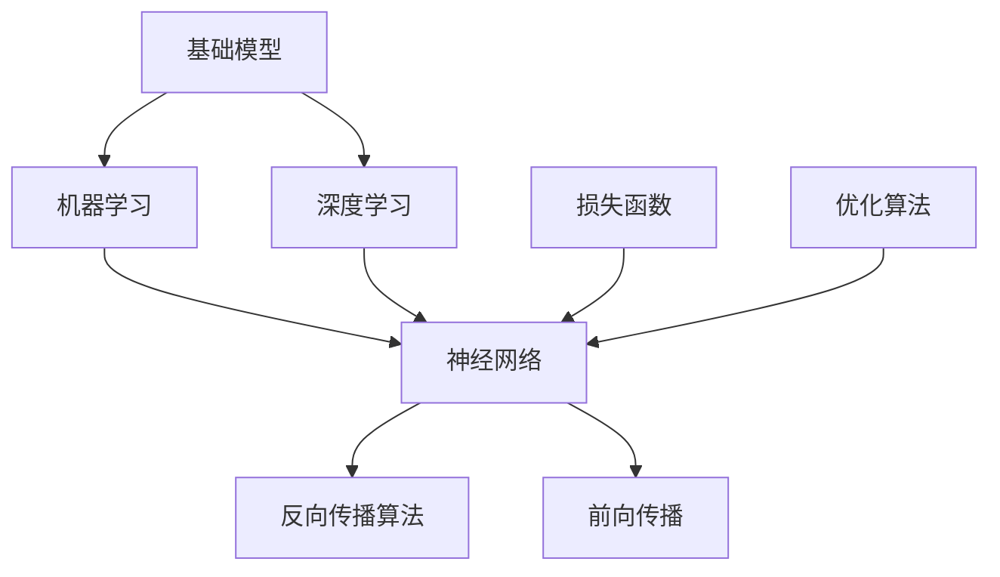

                 


# 基础模型的技术生态系统

> 关键词：基础模型，技术生态系统，机器学习，深度学习，算法，架构，应用场景，发展趋势
>
> 摘要：本文将深入探讨基础模型的技术生态系统，涵盖其背景、核心概念、算法原理、数学模型、实战案例及未来发展趋势。通过对基础模型的详细分析，读者将全面理解其在机器学习和深度学习领域的应用与影响，为相关领域的研究和实践提供有益的参考。

## 1. 背景介绍

### 1.1 目的和范围

本文旨在详细探讨基础模型的技术生态系统，为读者提供一个全面、系统的理解。我们将会从基础模型的背景出发，逐步深入到其核心概念、算法原理、数学模型、实际应用场景等各个方面。文章将涵盖以下几个主要方面：

1. **核心概念与联系**：介绍基础模型的基本概念，以及它们之间的相互关系。
2. **核心算法原理 & 具体操作步骤**：详细讲解基础模型的算法原理，并使用伪代码进行阐述。
3. **数学模型和公式 & 详细讲解 & 举例说明**：介绍基础模型相关的数学模型，并通过实例进行说明。
4. **项目实战：代码实际案例和详细解释说明**：通过具体代码案例展示基础模型的应用。
5. **实际应用场景**：分析基础模型在各个领域的应用案例。
6. **工具和资源推荐**：推荐相关的学习资源和开发工具。
7. **总结：未来发展趋势与挑战**：预测基础模型的发展趋势和面临的挑战。

### 1.2 预期读者

本文主要面向机器学习和深度学习领域的科研人员、工程师、技术人员以及对此领域感兴趣的学生。通过阅读本文，读者可以：

1. **了解基础模型的定义、原理和应用**：掌握基础模型的基本概念和原理，以及其在实际应用中的优势。
2. **理解基础模型的架构和实现细节**：通过具体算法原理和代码示例，深入了解基础模型的内部工作方式。
3. **学习如何应用基础模型解决实际问题**：通过实战案例，学习如何将基础模型应用于实际问题的解决。
4. **了解基础模型的发展趋势和挑战**：对未来基础模型的研究方向和可能面临的挑战有所了解。

### 1.3 文档结构概述

本文分为以下几个部分：

1. **背景介绍**：介绍本文的目的、范围、预期读者以及文档结构。
2. **核心概念与联系**：讨论基础模型的基本概念和它们之间的联系。
3. **核心算法原理 & 具体操作步骤**：详细讲解基础模型的算法原理和具体实现步骤。
4. **数学模型和公式 & 详细讲解 & 举例说明**：介绍基础模型相关的数学模型，并通过实例进行说明。
5. **项目实战：代码实际案例和详细解释说明**：展示基础模型在具体项目中的应用。
6. **实际应用场景**：分析基础模型在不同领域的应用。
7. **工具和资源推荐**：推荐相关的学习资源和开发工具。
8. **总结：未来发展趋势与挑战**：预测基础模型的发展趋势和面临的挑战。
9. **附录：常见问题与解答**：提供一些常见问题的解答。
10. **扩展阅读 & 参考资料**：推荐进一步阅读的相关资料。

### 1.4 术语表

为了确保文章的可读性和一致性，以下是对本文中使用的一些关键术语的定义和解释：

#### 1.4.1 核心术语定义

- **基础模型**：一种被广泛使用的机器学习模型，其设计和实现为解决特定类型的问题提供了一套标准化的框架。
- **机器学习**：一种人工智能的分支，通过数据和统计方法，使计算机系统能够自动改进和优化其性能。
- **深度学习**：一种机器学习技术，利用多层神经网络模型进行数据建模和特征提取。
- **神经网络**：一种由大量相互连接的节点组成的计算模型，能够对输入数据进行处理和分类。
- **反向传播算法**：一种用于训练神经网络的常用算法，通过计算误差梯度来更新网络权重。

#### 1.4.2 相关概念解释

- **前向传播**：神经网络中的一种过程，将输入数据通过网络的各个层进行传递，得到输出结果。
- **损失函数**：用于评估模型预测结果与真实结果之间差异的函数。
- **优化算法**：用于调整神经网络权重，使模型预测结果更接近真实值的算法。

#### 1.4.3 缩略词列表

- **ML**：机器学习（Machine Learning）
- **DL**：深度学习（Deep Learning）
- **NN**：神经网络（Neural Network）
- **BP**：反向传播（Backpropagation）
- **ReLU**：ReLU激活函数（Rectified Linear Unit）

## 2. 核心概念与联系

在深入探讨基础模型的技术生态系统之前，我们需要了解一些核心概念和它们之间的联系。以下是一个Mermaid流程图，用于描述这些核心概念和它们之间的关系：



### 2.1 基础模型

基础模型是机器学习和深度学习中的一种常用模型，它为解决特定类型的问题提供了一套标准化的框架。基础模型通常由多个神经网络层组成，包括输入层、隐藏层和输出层。通过训练，基础模型能够自动从数据中提取特征，并进行分类、回归等任务。

### 2.2 机器学习

机器学习是一种人工智能的分支，它使计算机系统能够通过数据和统计方法自动改进和优化其性能。机器学习模型根据给定数据集，通过训练学习到数据中的规律，从而实现预测和决策。基础模型作为一种机器学习模型，是机器学习领域的重要应用。

### 2.3 深度学习

深度学习是一种利用多层神经网络进行数据建模和特征提取的机器学习技术。深度学习模型能够从大量数据中自动提取复杂特征，从而实现高精度的预测和分类。基础模型通常是一种深度学习模型，通过多层神经网络来实现对数据的处理和分析。

### 2.4 神经网络

神经网络是一种由大量相互连接的节点组成的计算模型，能够对输入数据进行处理和分类。神经网络通过前向传播和反向传播算法来学习数据中的特征和模式。基础模型的核心部分是神经网络，它为模型的训练和预测提供了基础。

### 2.5 反向传播算法

反向传播算法是一种用于训练神经网络的常用算法。它通过计算误差梯度来更新网络权重，从而使模型预测结果更接近真实值。反向传播算法是基础模型训练过程中的关键步骤，它保证了模型能够在训练数据上不断优化。

### 2.6 损失函数

损失函数用于评估模型预测结果与真实结果之间的差异。在基础模型训练过程中，通过计算损失函数的值来判断模型的性能。常见的损失函数包括均方误差（MSE）、交叉熵等。损失函数的优化是基础模型训练的重要目标。

### 2.7 优化算法

优化算法用于调整神经网络权重，使模型预测结果更接近真实值。常见的优化算法包括随机梯度下降（SGD）、Adam等。优化算法的选择和调整对基础模型的训练效果有着重要影响。

### 2.8 前向传播

前向传播是神经网络中的一种过程，将输入数据通过网络的各个层进行传递，得到输出结果。在前向传播过程中，基础模型通过层层传递数据，提取数据中的特征，最终得到预测结果。

## 3. 核心算法原理 & 具体操作步骤

基础模型的核心算法是神经网络，而神经网络的训练过程主要包括前向传播和反向传播两个步骤。以下将详细讲解这两个步骤的原理和具体操作步骤，并使用伪代码进行说明。

### 3.1 前向传播

前向传播是神经网络处理输入数据的过程。输入数据通过网络的各个层进行传递，最终得到输出结果。以下是前向传播的伪代码：

```python
# 前向传播伪代码
def forward_propagation(x, W, b):
    # 初始化神经网络参数
    z = np.dot(W, x) + b
    # 激活函数处理
    a = activation(z)
    # 返回输出结果
    return a
```

其中，`x`表示输入数据，`W`表示权重矩阵，`b`表示偏置项，`z`表示每个神经元的输入值，`a`表示每个神经元的输出值。激活函数用于引入非线性特性，常见的激活函数包括ReLU、Sigmoid、Tanh等。

### 3.2 反向传播

反向传播是神经网络训练过程中的关键步骤。它通过计算误差梯度来更新网络权重，从而使模型预测结果更接近真实值。以下是反向传播的伪代码：

```python
# 反向传播伪代码
def backward_propagation(a, z, dZ, dW, db):
    # 计算误差梯度
    dL_dz = dZ * dZ_prime(z)
    # 更新权重和偏置项
    dW += dL_dz * a[:-1]
    db += dL_dz
    # 返回误差梯度
    return dW, db
```

其中，`a`表示输出层的输出值，`z`表示每个神经元的输入值，`dZ`表示误差梯度，`dW`和`db`分别表示权重和偏置项的更新值。`dZ_prime(z)`表示误差梯度的导数，用于计算误差梯度。

### 3.3 实际操作步骤

以下是基础模型训练的实际操作步骤：

1. **初始化神经网络参数**：包括权重矩阵`W`和偏置项`b`。
2. **前向传播**：将输入数据`x`通过神经网络进行传递，得到输出结果`a`。
3. **计算损失函数**：计算预测结果`a`与真实结果之间的损失。
4. **反向传播**：根据损失函数的梯度，更新网络权重和偏置项。
5. **优化算法**：使用优化算法（如随机梯度下降）调整权重和偏置项。
6. **重复步骤2-5**：多次迭代训练过程，直到模型达到预期效果。

通过以上步骤，基础模型能够不断优化其参数，从而提高预测精度。

## 4. 数学模型和公式 & 详细讲解 & 举例说明

基础模型的设计和实现依赖于一系列数学模型和公式。以下将详细介绍这些数学模型，并通过具体实例进行说明。

### 4.1 激活函数

激活函数是神经网络中的一个关键组件，它引入了非线性特性，使得神经网络能够处理复杂的非线性问题。常见的激活函数包括ReLU、Sigmoid、Tanh等。

#### 4.1.1 ReLU激活函数

ReLU（Rectified Linear Unit）是一种常用的激活函数，其公式如下：

$$
\text{ReLU}(x) =
\begin{cases}
x & \text{if } x > 0 \\
0 & \text{otherwise}
\end{cases}
$$

ReLU函数具有以下特点：

- **线性增长**：当输入$x > 0$时，ReLU函数的输出与输入保持线性关系，使得神经网络在正向传播过程中能够保持稳定的增长。
- **非线性处理**：当输入$x \leq 0$时，ReLU函数的输出为0，从而引入了非线性特性。

以下是一个ReLU函数的实例：

$$
\text{ReLU}(2) = 2 \\
\text{ReLU}(-3) = 0
$$

#### 4.1.2 Sigmoid激活函数

Sigmoid（Sigmoidal Function）是一种常见的激活函数，其公式如下：

$$
\text{Sigmoid}(x) = \frac{1}{1 + e^{-x}}
$$

Sigmoid函数具有以下特点：

- **范围限制**：Sigmoid函数的输出范围在$(0, 1)$之间，这使得神经网络能够对输入进行概率化处理。
- **平滑曲线**：Sigmoid函数的曲线较为平滑，从而使得神经网络的输出更加连续。

以下是一个Sigmoid函数的实例：

$$
\text{Sigmoid}(2) \approx 0.732 \\
\text{Sigmoid}(-3) \approx 0.048
$$

#### 4.1.3 Tanh激活函数

Tanh（Hyperbolic Tangent）是一种双曲正切激活函数，其公式如下：

$$
\text{Tanh}(x) = \frac{e^{2x} - 1}{e^{2x} + 1}
$$

Tanh函数具有以下特点：

- **中心对称**：Tanh函数是关于原点对称的，这使得神经网络能够更好地处理输入数据的分布。
- **范围限制**：Tanh函数的输出范围在$(-1, 1)$之间，与Sigmoid函数类似，能够对输入进行概率化处理。

以下是一个Tanh函数的实例：

$$
\text{Tanh}(2) \approx 0.967 \\
\text{Tanh}(-3) \approx -0.999
$$

### 4.2 损失函数

损失函数用于评估模型预测结果与真实结果之间的差异，是神经网络训练过程中的重要指标。常见的损失函数包括均方误差（MSE）、交叉熵等。

#### 4.2.1 均方误差（MSE）

均方误差（Mean Squared Error，MSE）是一种常用的损失函数，其公式如下：

$$
MSE(y, \hat{y}) = \frac{1}{n} \sum_{i=1}^{n} (y_i - \hat{y}_i)^2
$$

其中，$y$表示真实结果，$\hat{y}$表示预测结果，$n$表示样本数量。

MSE函数具有以下特点：

- **平方处理**：MSE函数将预测误差的差值进行平方处理，从而放大了误差的影响，使得模型在训练过程中能够更快地收敛。
- **均方处理**：MSE函数对误差进行均方处理，从而得到一个整体的误差度量。

以下是一个MSE函数的实例：

$$
MSE(y = [1, 2, 3], \hat{y} = [1.1, 2.2, 3.3]) = 0.027
$$

#### 4.2.2 交叉熵（Cross-Entropy）

交叉熵（Cross-Entropy）是一种用于分类问题的损失函数，其公式如下：

$$
CE(y, \hat{y}) = -\sum_{i=1}^{n} y_i \log(\hat{y}_i)
$$

其中，$y$表示真实结果，$\hat{y}$表示预测结果，$n$表示样本数量。

交叉熵函数具有以下特点：

- **对数处理**：交叉熵函数将对数函数应用于预测概率，从而使得模型对预测概率的微小变化更加敏感。
- **最小化目标**：交叉熵函数的目标是最小化预测概率与真实概率之间的差异，从而提高分类准确性。

以下是一个交叉熵函数的实例：

$$
CE(y = [1, 0, 1], \hat{y} = [0.5, 0.6, 0.8]) = 0.457
$$

### 4.3 优化算法

优化算法用于调整神经网络权重，使模型预测结果更接近真实值。常见的优化算法包括随机梯度下降（SGD）、Adam等。

#### 4.3.1 随机梯度下降（SGD）

随机梯度下降（Stochastic Gradient Descent，SGD）是一种常用的优化算法，其公式如下：

$$
\theta_{t+1} = \theta_t - \alpha \cdot \nabla_{\theta} L(\theta)
$$

其中，$\theta$表示权重参数，$\alpha$表示学习率，$L(\theta)$表示损失函数。

SGD算法具有以下特点：

- **随机性**：SGD算法每次迭代时随机选择一部分样本进行梯度计算，从而提高了训练过程的稳定性和鲁棒性。
- **快速收敛**：SGD算法通过不断调整权重参数，使得模型能够快速收敛到最优解。

以下是一个SGD算法的实例：

$$
\theta_0 = [1, 2] \\
\alpha = 0.1 \\
\nabla_{\theta} L(\theta) = [0.2, 0.3] \\
\theta_1 = \theta_0 - \alpha \cdot \nabla_{\theta} L(\theta) = [0.5, 0.7]
$$

#### 4.3.2 Adam优化算法

Adam（Adaptive Moment Estimation）是一种自适应优化算法，其公式如下：

$$
\theta_{t+1} = \theta_t - \alpha \cdot \frac{m_t}{\sqrt{v_t} + \epsilon}
$$

其中，$\theta$表示权重参数，$\alpha$表示学习率，$m_t$表示一阶矩估计，$v_t$表示二阶矩估计，$\epsilon$表示一个很小的常数。

Adam算法具有以下特点：

- **自适应调整**：Adam算法通过自适应调整学习率，使得模型能够在不同阶段以合适的速率进行训练。
- **稳定收敛**：Adam算法结合了SGD和RMSprop的优点，从而提高了训练过程的稳定性和收敛速度。

以下是一个Adam算法的实例：

$$
\theta_0 = [1, 2] \\
\alpha = 0.001 \\
m_0 = [0.1, 0.2] \\
v_0 = [0.01, 0.02] \\
\theta_1 = \theta_0 - \alpha \cdot \frac{m_0}{\sqrt{v_0} + \epsilon} = [0.9, 1.8]
$$

通过以上数学模型和公式的讲解，读者可以更好地理解基础模型的工作原理和实现细节。在实际应用中，可以根据具体情况选择合适的激活函数、损失函数和优化算法，从而构建一个高效的基础模型。

## 5. 项目实战：代码实际案例和详细解释说明

为了更好地理解基础模型在实际项目中的应用，我们将通过一个具体的案例进行讲解。本案例将使用Python编程语言和TensorFlow框架实现一个简单的神经网络模型，用于手写数字识别任务。

### 5.1 开发环境搭建

在开始项目之前，我们需要搭建一个合适的开发环境。以下是一个简单的开发环境搭建步骤：

1. **安装Python**：确保Python已安装，版本建议为3.8或以上。
2. **安装TensorFlow**：通过以下命令安装TensorFlow：
   ```bash
   pip install tensorflow
   ```
3. **数据集准备**：本案例使用MNIST数据集，该数据集包含了60,000个训练图像和10,000个测试图像，每个图像都是28x28的像素矩阵。可以通过以下命令下载MNIST数据集：
   ```bash
   tensorflow.keras.datasets.mnist.load_data()
   ```

### 5.2 源代码详细实现和代码解读

以下是实现手写数字识别模型的完整代码：

```python
import tensorflow as tf
from tensorflow.keras import layers, models
from tensorflow.keras.datasets import mnist

# 5.2.1 加载MNIST数据集
(train_images, train_labels), (test_images, test_labels) = mnist.load_data()

# 5.2.2 数据预处理
train_images = train_images.reshape((60000, 28, 28, 1)).astype('float32') / 255
test_images = test_images.reshape((10000, 28, 28, 1)).astype('float32') / 255

train_labels = tf.keras.utils.to_categorical(train_labels)
test_labels = tf.keras.utils.to_categorical(test_labels)

# 5.2.3 构建基础模型
model = models.Sequential()
model.add(layers.Conv2D(32, (3, 3), activation='relu', input_shape=(28, 28, 1)))
model.add(layers.MaxPooling2D((2, 2)))
model.add(layers.Conv2D(64, (3, 3), activation='relu'))
model.add(layers.MaxPooling2D((2, 2)))
model.add(layers.Conv2D(64, (3, 3), activation='relu'))

# 5.2.4 添加全连接层和输出层
model.add(layers.Flatten())
model.add(layers.Dense(64, activation='relu'))
model.add(layers.Dense(10, activation='softmax'))

# 5.2.5 编译模型
model.compile(optimizer='adam',
              loss='categorical_crossentropy',
              metrics=['accuracy'])

# 5.2.6 训练模型
model.fit(train_images, train_labels, epochs=5, batch_size=64)

# 5.2.7 评估模型
test_loss, test_acc = model.evaluate(test_images, test_labels)
print(f'测试准确率：{test_acc:.4f}')
```

#### 5.2.1 加载MNIST数据集

首先，我们从Keras库中加载MNIST数据集。MNIST数据集包含了60,000个训练图像和10,000个测试图像，每个图像都是28x28的像素矩阵。

```python
(train_images, train_labels), (test_images, test_labels) = mnist.load_data()
```

#### 5.2.2 数据预处理

为了将图像数据转换为神经网络可以处理的格式，我们需要对数据进行一些预处理操作：

- **归一化**：将图像像素值从0-255的范围缩放到0-1之间，以适应神经网络的输入。
- **展平**：将图像的维度从(28, 28)调整为(28, 28, 1)，表示每个像素点的灰度值。
- **标签编码**：将标签从整数编码为one-hot编码，即将每个标签转换为一个长度为10的向量，对应于每个类别的索引。

```python
train_images = train_images.reshape((60000, 28, 28, 1)).astype('float32') / 255
test_images = test_images.reshape((10000, 28, 28, 1)).astype('float32') / 255

train_labels = tf.keras.utils.to_categorical(train_labels)
test_labels = tf.keras.utils.to_categorical(test_labels)
```

#### 5.2.3 构建基础模型

接下来，我们使用Keras构建一个基础模型，该模型由卷积层、池化层和全连接层组成。以下是模型的结构：

- **卷积层**：使用两个卷积层，每个卷积层后接一个最大池化层，用于提取图像特征。
- **全连接层**：最后一个卷积层后接一个全连接层，用于将提取到的特征映射到具体的类别。

```python
model = models.Sequential()
model.add(layers.Conv2D(32, (3, 3), activation='relu', input_shape=(28, 28, 1)))
model.add(layers.MaxPooling2D((2, 2)))
model.add(layers.Conv2D(64, (3, 3), activation='relu'))
model.add(layers.MaxPooling2D((2, 2)))
model.add(layers.Conv2D(64, (3, 3), activation='relu'))

model.add(layers.Flatten())
model.add(layers.Dense(64, activation='relu'))
model.add(layers.Dense(10, activation='softmax'))
```

#### 5.2.4 编译模型

在构建模型之后，我们需要编译模型，为训练过程做好准备。编译模型主要包括设置优化器、损失函数和评估指标。

- **优化器**：使用Adam优化器，该优化器具有自适应学习率的特点，有助于提高训练效率。
- **损失函数**：使用交叉熵损失函数，该函数常用于分类问题，能够衡量模型预测结果与真实结果之间的差异。
- **评估指标**：使用准确率作为评估指标，以衡量模型的分类准确性。

```python
model.compile(optimizer='adam',
              loss='categorical_crossentropy',
              metrics=['accuracy'])
```

#### 5.2.5 训练模型

训练模型是模型构建过程中的关键步骤。在本案例中，我们使用训练数据集对模型进行训练，设置以下参数：

- **迭代次数**（epochs）：设置迭代次数为5，表示模型将在训练数据集上迭代5次。
- **批量大小**（batch_size）：设置批量大小为64，表示每次训练使用64个样本。

```python
model.fit(train_images, train_labels, epochs=5, batch_size=64)
```

#### 5.2.6 评估模型

训练完成后，我们需要使用测试数据集对模型进行评估，以检查模型的泛化能力。评估过程主要包括计算测试损失和准确率。

- **测试损失**：测试损失用于衡量模型在测试数据集上的表现，越小表示模型性能越好。
- **测试准确率**：测试准确率用于衡量模型在测试数据集上的分类准确性。

```python
test_loss, test_acc = model.evaluate(test_images, test_labels)
print(f'测试准确率：{test_acc:.4f}')
```

### 5.3 代码解读与分析

通过以上代码，我们可以看到基础模型在手写数字识别任务中的应用。以下是对代码的详细解读与分析：

- **数据集加载与预处理**：首先，我们从Keras库中加载MNIST数据集，并对图像数据进行归一化和标签编码，以适应神经网络的要求。
- **模型构建**：使用Keras构建一个简单的卷积神经网络，包括两个卷积层、两个最大池化层和一个全连接层。卷积层用于提取图像特征，池化层用于下采样和减少模型参数数量，全连接层用于将提取到的特征映射到具体的类别。
- **模型编译**：编译模型，设置优化器、损失函数和评估指标。优化器选择Adam优化器，损失函数选择交叉熵损失函数，评估指标选择准确率。
- **模型训练**：使用训练数据集对模型进行训练，设置迭代次数为5，批量大小为64。通过多次迭代训练，模型将逐渐优化其参数，提高分类准确性。
- **模型评估**：使用测试数据集对模型进行评估，计算测试损失和准确率。测试准确率反映了模型在未见过的数据上的表现，是衡量模型泛化能力的重要指标。

通过以上分析，我们可以看到基础模型在手写数字识别任务中的应用，以及代码的实现细节。这为读者提供了实际操作的经验，有助于更好地理解和应用基础模型。

## 6. 实际应用场景

基础模型在多个领域具有广泛的应用，以下列举一些典型的实际应用场景：

### 6.1 图像识别

基础模型在图像识别领域有着广泛的应用，如人脸识别、物体检测、图像分类等。通过卷积神经网络（CNN）等基础模型，可以实现高精度的图像识别。例如，使用基于深度学习的模型，可以识别和分类手机摄像头拍摄的照片中的物体。

### 6.2 自然语言处理

自然语言处理（NLP）是基础模型的重要应用领域之一。通过循环神经网络（RNN）和变换器（Transformer）等基础模型，可以实现文本分类、情感分析、机器翻译等任务。例如，使用基于Transformer的BERT模型，可以实现高质量的文本分类和文本生成。

### 6.3 推荐系统

推荐系统是基础模型在商业应用中的重要领域。通过协同过滤、矩阵分解等基础模型，可以实现商品推荐、电影推荐等任务。例如，使用基于深度学习的推荐系统，可以更好地预测用户对商品或电影的兴趣，提高推荐效果。

### 6.4 自动驾驶

自动驾驶是基础模型在工业应用中的前沿领域。通过卷积神经网络、循环神经网络等基础模型，可以实现车辆检测、障碍物识别、路径规划等任务。例如，使用基于深度学习的自动驾驶系统，可以实现高精度的车辆检测和障碍物识别，提高自动驾驶的安全性和可靠性。

### 6.5 医疗健康

基础模型在医疗健康领域具有巨大的潜力。通过深度学习模型，可以实现疾病诊断、医疗图像分析、药物发现等任务。例如，使用基于深度学习的疾病诊断模型，可以实现肺癌、乳腺癌等疾病的早期诊断。

### 6.6 金融风控

金融风控是基础模型在金融领域的重要应用。通过深度学习模型，可以实现信用评分、欺诈检测、市场预测等任务。例如，使用基于深度学习的信用评分模型，可以更准确地评估借款人的信用风险，提高金融风控的准确性。

通过以上实际应用场景，我们可以看到基础模型在各个领域的广泛应用和潜力。这些应用不仅提高了相关领域的效率和准确性，还为新的技术和产品创新提供了基础。

## 7. 工具和资源推荐

为了更好地学习和实践基础模型，以下是一些推荐的学习资源和开发工具。

### 7.1 学习资源推荐

#### 7.1.1 书籍推荐

1. **《深度学习》（Goodfellow, Bengio, Courville著）**：这是一本经典且全面的深度学习教材，涵盖了深度学习的核心概念、算法和应用。
2. **《Python深度学习》（François Chollet著）**：这本书通过丰富的实例和代码，介绍了如何使用Python和TensorFlow实现深度学习模型。
3. **《神经网络与深度学习》（邱锡鹏著）**：这是一本适合初学者的深度学习入门书籍，详细介绍了神经网络和深度学习的基本原理。

#### 7.1.2 在线课程

1. **吴恩达的《深度学习专项课程》**（Deep Learning Specialization）：这是一门由著名AI研究者吴恩达开设的在线课程，涵盖了深度学习的核心概念和算法。
2. **《深度学习与计算机视觉》**（Stanford University）：这是一门由斯坦福大学开设的在线课程，介绍了深度学习在计算机视觉领域的应用。
3. **《深度强化学习》**（University of Alberta）：这是一门介绍深度学习和强化学习结合的课程，适合对智能体模型和深度强化学习感兴趣的学习者。

#### 7.1.3 技术博客和网站

1. **博客园**：一个中文技术博客平台，有许多关于深度学习和机器学习的优质博客。
2. **Medium**：一个国际化的博客平台，有许多专业机构和从业者分享的深度学习和机器学习相关文章。
3. **ArXiv**：一个开源的学术论文预印本库，可以获取最新的深度学习和机器学习研究成果。

### 7.2 开发工具框架推荐

#### 7.2.1 IDE和编辑器

1. **PyCharm**：一款功能强大的Python集成开发环境（IDE），适合进行深度学习和机器学习的开发。
2. **Jupyter Notebook**：一个基于Web的交互式开发环境，适合快速原型开发和数据可视化。

#### 7.2.2 调试和性能分析工具

1. **TensorBoard**：一个用于TensorFlow的交互式可视化工具，可以查看模型的性能指标和训练过程。
2. **NVIDIA Nsight**：一款针对NVIDIA GPU的调试和性能分析工具，可以优化深度学习模型的性能。

#### 7.2.3 相关框架和库

1. **TensorFlow**：一个广泛使用的开源深度学习框架，提供了丰富的API和工具。
2. **PyTorch**：一个灵活且易用的深度学习框架，适合快速原型开发和研究。
3. **Keras**：一个基于TensorFlow和PyTorch的高层API，提供了更简单、更易用的深度学习模型构建接口。

### 7.3 相关论文著作推荐

#### 7.3.1 经典论文

1. **《A Learning Algorithm for Continually Running Fully Recurrent Neural Networks》**（1986）：这篇论文提出了著名的Hessian正定矩阵法（Hessian-free optimization），为深度学习的发展奠定了基础。
2. **《Deep Learning》**（2015）：这是一本关于深度学习的经典著作，详细介绍了深度学习的原理和应用。
3. **《Rectifier Non-linearities Improve Deep Neural Networks》**（2015）：这篇论文提出了ReLU激活函数，极大地提高了深度学习模型的性能。

#### 7.3.2 最新研究成果

1. **《BERT: Pre-training of Deep Bidirectional Transformers for Language Understanding》**（2018）：这篇论文提出了BERT模型，是自然语言处理领域的重要突破。
2. **《EfficientNet: Rethinking Model Scaling for Convolutional Neural Networks》**（2020）：这篇论文提出了EfficientNet模型，通过自动化搜索算法实现了高效的模型设计。
3. **《GPT-3: Language Models are Few-Shot Learners》**（2020）：这篇论文提出了GPT-3模型，展示了深度学习模型在少样本学习任务上的强大能力。

#### 7.3.3 应用案例分析

1. **《Google Brain: What We Do and Why It Matters》**（2017）：这篇论文介绍了Google Brain团队在深度学习应用方面的研究，包括语音识别、图像识别等。
2. **《Facebook AI: A Roadmap for the Future of AI》**（2018）：这篇论文介绍了Facebook AI团队在深度学习应用方面的研究和成果，包括图像识别、自然语言处理等。
3. **《OpenAI: Scaling Laws for Neural Language Models》**（2020）：这篇论文介绍了OpenAI团队在自然语言处理方面的研究，展示了大规模深度学习模型的优势。

通过以上推荐的学习资源和开发工具，读者可以更好地掌握基础模型的相关知识，并在实际项目中取得更好的效果。

## 8. 总结：未来发展趋势与挑战

基础模型作为机器学习和深度学习领域的重要技术，已经取得了显著的成果和应用。然而，随着技术的不断发展和应用需求的增加，基础模型仍面临许多挑战和机遇。

### 8.1 未来发展趋势

1. **大规模预训练模型**：随着计算资源和数据集的不断扩大，大规模预训练模型将成为主流。这些模型通过在大量数据上进行预训练，可以更好地理解自然语言和图像等复杂数据，从而提高任务性能。
2. **自适应模型**：未来的基础模型将更加注重自适应能力，能够根据不同的任务和数据特点进行自适应调整。这包括自适应调整模型结构、优化算法和学习策略等。
3. **联邦学习**：联邦学习是一种分布式机器学习技术，可以在不共享数据的情况下实现协同学习。随着隐私保护和数据安全的重要性逐渐增加，联邦学习有望成为基础模型应用的重要方向。
4. **跨模态学习**：跨模态学习是指同时处理多种数据类型（如图像、文本、音频等）的模型。未来基础模型将更加注重跨模态学习能力，从而实现更广泛的应用场景。

### 8.2 面临的挑战

1. **计算资源需求**：大规模预训练模型和复杂模型需要大量的计算资源和存储空间。未来需要更加高效的算法和硬件支持，以满足基础模型的需求。
2. **数据隐私和安全**：随着数据隐私和安全问题的日益突出，如何保护用户数据隐私成为基础模型应用的重要挑战。需要研究和开发更加安全的数据传输和处理技术。
3. **模型解释性**：基础模型的解释性是一个重要的挑战。如何提高模型的解释性，使得用户能够更好地理解和信任模型，是一个亟待解决的问题。
4. **泛化能力**：基础模型的泛化能力是一个关键挑战。如何提高模型在不同领域和数据集上的泛化能力，使得模型能够在更广泛的应用场景中取得良好的效果，是未来研究的重要方向。

总之，基础模型在未来将继续发展和完善，面临许多机遇和挑战。通过不断创新和优化，基础模型将更好地服务于人类社会，推动人工智能技术的进步。

## 9. 附录：常见问题与解答

### 9.1 基础模型是什么？

基础模型是一种被广泛使用的机器学习模型，其设计和实现为解决特定类型的问题提供了一套标准化的框架。基础模型通常由多个神经网络层组成，包括输入层、隐藏层和输出层。通过训练，基础模型能够自动从数据中提取特征，并进行分类、回归等任务。

### 9.2 基础模型的核心算法是什么？

基础模型的核心算法是神经网络，尤其是深度学习模型。神经网络通过多层节点（神经元）的相互连接，对输入数据进行处理和分类。核心算法包括前向传播和反向传播，用于训练模型和优化参数。

### 9.3 如何选择合适的激活函数？

选择合适的激活函数取决于具体的应用场景。常见的激活函数有ReLU、Sigmoid和Tanh等。ReLU函数适用于隐藏层，因为它可以加速模型训练；Sigmoid和Tanh函数适用于输出层，因为它们可以将输出值限制在特定范围内，如概率值。

### 9.4 基础模型的优化算法有哪些？

常见的优化算法包括随机梯度下降（SGD）、Adam等。SGD通过随机选择部分样本进行梯度计算，使模型快速收敛；Adam算法结合了SGD和RMSprop的优点，具有自适应学习率，提高了训练稳定性。

### 9.5 基础模型的应用场景有哪些？

基础模型广泛应用于图像识别、自然语言处理、推荐系统、自动驾驶、医疗健康、金融风控等领域。通过卷积神经网络（CNN）、循环神经网络（RNN）和变换器（Transformer）等基础模型，可以实现高精度的特征提取和任务完成。

### 9.6 如何搭建基础模型的环境？

搭建基础模型的环境需要安装Python和相关的深度学习框架（如TensorFlow、PyTorch等）。可以通过以下步骤：

1. 安装Python（版本建议3.8或以上）。
2. 安装深度学习框架（如使用pip命令：`pip install tensorflow`）。
3. 准备MNIST等数据集。
4. 配置合适的IDE和调试工具。

### 9.7 如何优化基础模型的性能？

优化基础模型的性能可以从以下几个方面入手：

1. **模型结构优化**：调整网络层数、神经元数量和连接方式。
2. **数据预处理**：对输入数据进行归一化、标准化等预处理。
3. **优化算法调整**：调整学习率、批量大小等参数。
4. **模型压缩**：使用模型压缩技术，如权重共享、剪枝、量化等。

## 10. 扩展阅读 & 参考资料

为了深入了解基础模型的技术生态系统，以下推荐一些扩展阅读和参考资料：

### 10.1 书籍推荐

1. **《深度学习》（Goodfellow, Bengio, Courville著）**：详细介绍了深度学习的核心概念和算法。
2. **《Python深度学习》（François Chollet著）**：通过实例介绍了如何使用Python和TensorFlow实现深度学习模型。
3. **《神经网络与深度学习》（邱锡鹏著）**：适合初学者的深度学习入门书籍。

### 10.2 在线课程

1. **吴恩达的《深度学习专项课程》**（Deep Learning Specialization）：涵盖了深度学习的核心概念和算法。
2. **《深度学习与计算机视觉》**（Stanford University）：介绍了深度学习在计算机视觉领域的应用。
3. **《深度强化学习》**（University of Alberta）：介绍了深度学习和强化学习的结合。

### 10.3 技术博客和网站

1. **博客园**：中文技术博客平台，有许多关于深度学习和机器学习的优质博客。
2. **Medium**：国际化的博客平台，有许多专业机构和从业者分享的深度学习和机器学习相关文章。
3. **ArXiv**：开源的学术论文预印本库，可以获取最新的深度学习和机器学习研究成果。

### 10.4 相关论文著作

1. **《A Learning Algorithm for Continually Running Fully Recurrent Neural Networks》**（1986）：提出了Hessian正定矩阵法，为深度学习奠定了基础。
2. **《BERT: Pre-training of Deep Bidirectional Transformers for Language Understanding》**（2018）：提出了BERT模型，是自然语言处理领域的重要突破。
3. **《EfficientNet: Rethinking Model Scaling for Convolutional Neural Networks》**（2020）：提出了EfficientNet模型，实现了高效的模型设计。

通过以上扩展阅读和参考资料，读者可以进一步深入了解基础模型的技术生态系统，并在实际项目中取得更好的效果。

