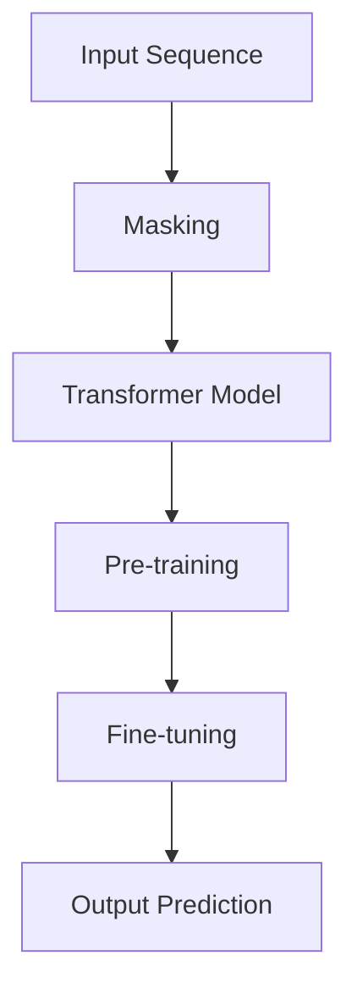

                 


# 基础模型的掩码语言建模

> 关键词：掩码语言建模、基础模型、自然语言处理、Transformer、BERT、Seq2Seq、自编码器

> 摘要：本文将深入探讨基础模型的掩码语言建模技术，从背景介绍、核心概念与联系、核心算法原理、数学模型和公式、项目实战、实际应用场景等方面，详细解析掩码语言建模的技术原理和应用，旨在帮助读者全面了解和掌握这一重要的自然语言处理技术。

## 1. 背景介绍

### 1.1 目的和范围

本文旨在介绍和解释基础模型的掩码语言建模技术，该技术是当前自然语言处理（NLP）领域的一项重要创新。本文将涵盖以下内容：

- 掩码语言建模的背景和发展
- 掩码语言建模的核心概念与联系
- 掩码语言建模的核心算法原理与具体操作步骤
- 掩码语言建模的数学模型和公式
- 掩码语言建模在实际项目中的应用和案例分析

通过本文的阅读，读者将能够全面了解和掌握基础模型的掩码语言建模技术，为后续的研究和应用打下坚实的基础。

### 1.2 预期读者

本文的预期读者包括以下几类：

- 自然语言处理领域的研究人员和开发者
- 人工智能和机器学习领域的从业者
- 计算机科学专业的学生和教师
- 对自然语言处理和人工智能技术感兴趣的普通读者

本文将采用通俗易懂的语言和实例，力求让不同背景的读者都能理解和掌握掩码语言建模技术。

### 1.3 文档结构概述

本文分为以下十个部分：

1. 背景介绍：介绍本文的目的、范围、预期读者和文档结构。
2. 核心概念与联系：阐述掩码语言建模的核心概念和原理。
3. 核心算法原理 & 具体操作步骤：详细解释掩码语言建模的算法原理和具体操作步骤。
4. 数学模型和公式：介绍掩码语言建模的数学模型和公式，并进行举例说明。
5. 项目实战：提供实际项目的代码案例和详细解释。
6. 实际应用场景：分析掩码语言建模在实际项目中的应用。
7. 工具和资源推荐：推荐相关的学习资源、开发工具和框架。
8. 总结：总结本文的主要内容，展望未来发展趋势与挑战。
9. 附录：常见问题与解答。
10. 扩展阅读 & 参考资料：提供进一步阅读的资源和参考。

### 1.4 术语表

#### 1.4.1 核心术语定义

- 掩码语言建模：一种自然语言处理技术，通过训练模型对掩码的输入序列进行预测和生成。
- 自然语言处理（NLP）：计算机科学和语言学的交叉领域，旨在使计算机能够理解和处理人类语言。
- 基础模型：在自然语言处理领域，指那些广泛应用于多种任务的预训练模型，如BERT、GPT等。
- Transformer：一种基于自注意力机制的深度神经网络架构，广泛应用于自然语言处理任务。
- BERT：一种基于Transformer的基础模型，通过预训练和微调在多种NLP任务上取得了显著的性能提升。

#### 1.4.2 相关概念解释

- 自注意力机制：在Transformer模型中，通过计算输入序列中每个位置与其他位置的关联性，实现对序列的全局依赖建模。
- 预训练：在模型训练之前，使用大量无标注文本数据进行预训练，以提高模型在特定任务上的性能。
- 微调：在预训练的基础上，使用有标注的数据集对模型进行进一步训练，以适应特定任务。

#### 1.4.3 缩略词列表

- NLP：自然语言处理
- BERT：Bidirectional Encoder Representations from Transformers
- GPT：Generative Pre-trained Transformer
- Transformer：Transformer模型
- Seq2Seq：序列到序列模型

## 2. 核心概念与联系

在探讨掩码语言建模之前，我们需要先了解一些核心概念和原理。本节将介绍掩码语言建模的相关核心概念，并通过Mermaid流程图展示其原理和架构。

### 2.1 核心概念

1. **掩码语言建模**：掩码语言建模是一种对输入序列进行部分掩码，然后通过模型预测掩码位置的建模技术。其主要目的是通过预测掩码部分来学习输入序列的内在结构和语义关系。
2. **自注意力机制**：自注意力机制是Transformer模型的核心组成部分，通过计算输入序列中每个位置与其他位置的关联性，实现对序列的全局依赖建模。
3. **预训练和微调**：预训练是指在无标注数据上对模型进行训练，使其具备一定的通用语言理解能力；微调是在预训练的基础上，使用有标注的数据集对模型进行进一步训练，以适应特定任务。
4. **BERT模型**：BERT是一种基于Transformer的基础模型，通过双向编码表示从Transformer模型中提取丰富的上下文信息，广泛应用于各种NLP任务。

### 2.2 Mermaid流程图

下面是一个简单的Mermaid流程图，展示掩码语言建模的原理和架构。



**说明：**

- **A[Input Sequence]**：输入序列，即需要建模的文本序列。
- **B[Masking]**：掩码过程，对输入序列进行部分掩码，将一部分词替换为特殊的掩码符号（如`[MASK]`）。
- **C[Transformer Model]**：Transformer模型，通过自注意力机制和多层结构对掩码后的输入序列进行编码。
- **D[Pre-training]**：预训练，在大量无标注数据上对模型进行训练，使其具备通用语言理解能力。
- **E[Fine-tuning]**：微调，在预训练的基础上，使用有标注的数据集对模型进行进一步训练，以适应特定任务。
- **F[Output Prediction]**：输出预测，对输入序列进行预测，包括掩码部分的预测和整个序列的生成。

## 3. 核心算法原理 & 具体操作步骤

### 3.1 算法原理

掩码语言建模的核心算法原理主要基于Transformer模型。Transformer模型采用自注意力机制（Self-Attention）对输入序列进行编码，从而实现对序列的全局依赖建模。自注意力机制通过计算输入序列中每个位置与其他位置的关联性，实现对序列的上下文信息进行加权整合。

具体来说，掩码语言建模可以分为以下几步：

1. **输入序列处理**：将输入序列（单词或词组）转换为整数序列，并添加特殊标记（如`[CLS]`、`[SEP]`等）。
2. **掩码操作**：对输入序列进行部分掩码，将一部分词替换为特殊的掩码符号（如`[MASK]`）。
3. **Transformer编码**：通过自注意力机制和多层结构对掩码后的输入序列进行编码，得到编码后的序列。
4. **预训练**：在大量无标注数据上对模型进行预训练，使其具备通用语言理解能力。
5. **微调**：在预训练的基础上，使用有标注的数据集对模型进行微调，以适应特定任务。

### 3.2 具体操作步骤

以下是掩码语言建模的具体操作步骤，使用伪代码进行详细阐述。

```python
# 步骤1：输入序列处理
input_sequence = "这是一个示例序列"
tokens = tokenize(input_sequence)  # 将输入序列转换为整数序列
tokens = [token_id for token_id in tokens]  # 添加特殊标记
tokens = [CLS] + tokens + [SEP]

# 步骤2：掩码操作
mask_rate = 0.15  # 掩码比例
masked_tokens = []
for token in tokens:
    if random.random() < mask_rate:
        masked_tokens.append(MASK)
    else:
        masked_tokens.append(token)

# 步骤3：Transformer编码
encoded_sequence = transformer_encode(masked_tokens)

# 步骤4：预训练
model = BERT_model()  # 初始化BERT模型
pretrain_data = load_pretrain_data()  # 加载预训练数据
model.train(pretrain_data)

# 步骤5：微调
fine_tune_data = load_fine_tune_data()  # 加载微调数据
model.fine_tune(fine_tune_data)

# 步骤6：输出预测
predicted_sequence = model.predict(masked_tokens)
predicted_sequence = decode(predicted_sequence)  # 将整数序列转换为文本序列
print(predicted_sequence)
```

### 3.3 伪代码说明

- **步骤1：输入序列处理**：将输入序列转换为整数序列，并添加特殊标记。这是Transformer模型的基础输入。
- **步骤2：掩码操作**：对输入序列进行部分掩码，将一部分词替换为特殊的掩码符号（如`[MASK]`）。掩码比例（mask_rate）可以根据实际需求进行调整。
- **步骤3：Transformer编码**：通过自注意力机制和多层结构对掩码后的输入序列进行编码，得到编码后的序列。
- **步骤4：预训练**：在大量无标注数据上对模型进行预训练，使其具备通用语言理解能力。此处使用BERT模型进行预训练。
- **步骤5：微调**：在预训练的基础上，使用有标注的数据集对模型进行微调，以适应特定任务。微调过程有助于模型在特定任务上取得更好的性能。
- **步骤6：输出预测**：对输入序列进行预测，包括掩码部分的预测和整个序列的生成。将整数序列转换为文本序列后输出。

## 4. 数学模型和公式 & 详细讲解 & 举例说明

### 4.1 数学模型和公式

掩码语言建模的数学模型主要基于Transformer模型。以下是Transformer模型的主要数学公式和组成部分。

#### 4.1.1 自注意力机制（Self-Attention）

自注意力机制是Transformer模型的核心组成部分，用于计算输入序列中每个位置与其他位置的关联性。

公式如下：

$$
\text{Attention}(Q, K, V) = \text{softmax}\left(\frac{QK^T}{\sqrt{d_k}}\right)V
$$

其中：

- \(Q\)、\(K\)、\(V\) 分别为查询（Query）、键（Key）、值（Value）向量的集合。
- \(d_k\) 为键向量的维度。
- \(\text{softmax}\) 函数用于将输入向量转换为概率分布。

#### 4.1.2 Encoder和Decoder

Transformer模型包括Encoder（编码器）和Decoder（解码器）两部分。Encoder负责对输入序列进行编码，得到编码后的序列；Decoder负责对编码后的序列进行解码，生成输出序列。

公式如下：

- **Encoder：**

$$
\text{Encoder}(X) = \text{LayerNorm}(X + \text{Self-Attention}(X) + \text{FFN}(X))
$$

- **Decoder：**

$$
\text{Decoder}(X) = \text{LayerNorm}(X + \text{Masked-Attention}(X) + \text{FFN}(X))
$$

其中：

- \(X\) 为输入序列。
- \(\text{Self-Attention}\) 和 \(\text{Masked-Attention}\) 分别为自注意力和掩码自注意力。
- \(\text{FFN}\) 为前馈神经网络。

#### 4.1.3 Layer Normalization和FFN

Layer Normalization（层归一化）和FFN（前馈神经网络）是Transformer模型中的重要组成部分。

- **Layer Normalization：**

$$
\text{LayerNorm}(x) = \text{LayerMean}(x) - \text{LayerStd}(x)
$$

其中：

- \(\text{LayerMean}(x)\) 和 \(\text{LayerStd}(x)\) 分别为层均值和层标准差。

- **FFN：**

$$
\text{FFN}(x) = \text{ReLU}(\text{Weight}\cdot\text{ReLU}(\text{Weight}\cdot x + \text{Bias}))
$$

其中：

- \(\text{Weight}\) 和 \(\text{Bias}\) 分别为权重和偏置。

### 4.2 详细讲解

#### 4.2.1 自注意力机制

自注意力机制通过计算输入序列中每个位置与其他位置的关联性，实现对序列的全局依赖建模。自注意力机制的原理可以概括为以下三个步骤：

1. **计算Query、Key和Value：**

   对于每个输入序列的位置 \(i\)，计算其对应的Query、Key和Value向量。这三个向量的计算公式如下：

   $$
   Q_i = \text{Linear}_Q(W_Q \cdot x_i), \quad K_i = \text{Linear}_K(W_K \cdot x_i), \quad V_i = \text{Linear}_V(W_V \cdot x_i)
   $$

   其中：

   - \(W_Q\)、\(W_K\)、\(W_V\) 分别为权重矩阵。
   - \(x_i\) 为输入序列的位置 \(i\) 的特征向量。

2. **计算注意力权重：**

   利用Query和Key向量计算注意力权重 \(a_i\)：

   $$
   a_i = \text{softmax}\left(\frac{Q_iK_i^T}{\sqrt{d_k}}\right)
   $$

   其中：

   - \(d_k\) 为键向量的维度。
   - \(\text{softmax}\) 函数用于将输入向量转换为概率分布。

3. **计算输出：**

   利用注意力权重和Value向量计算输出 \(x_i'\)：

   $$
   x_i' = \sum_j a_{ij}V_j
   $$

#### 4.2.2 Encoder和Decoder

Encoder和Decoder分别负责对输入序列进行编码和解码。

- **Encoder：**

  Encoder通过多层自注意力机制对输入序列进行编码，得到编码后的序列。每一层Encoder的输出可以表示为：

  $$
  \text{Encoder}_i = \text{LayerNorm}(\text{LayerNorm}(x_i + \text{Self-Attention}(x_i)) + \text{FFN}(x_i))
  $$

- **Decoder：**

  Decoder通过多层掩码自注意力机制和全连接层对编码后的序列进行解码，生成输出序列。每一层Decoder的输出可以表示为：

  $$
  \text{Decoder}_i = \text{LayerNorm}(\text{LayerNorm}(x_i + \text{Masked-Attention}(x_i)) + \text{FFN}(x_i))
  $$

### 4.3 举例说明

假设我们有一个简单的输入序列：“我是一个AI助手”。为了便于说明，我们将输入序列简化为整数序列：

```
输入序列：[1, 2, 3, 4, 5, 6, 7, 8, 9, 10]
```

其中，每个整数表示一个词的ID。

#### 4.3.1 自注意力机制

1. **计算Query、Key和Value：**

   对于每个位置 \(i\)，计算其对应的Query、Key和Value向量。假设权重矩阵为 \(W_Q\)、\(W_K\)、\(W_V\)：

   $$
   Q_1 = \text{Linear}_Q(W_Q \cdot [1, 2, 3, 4, 5, 6, 7, 8, 9, 10]), \quad K_1 = \text{Linear}_K(W_K \cdot [1, 2, 3, 4, 5, 6, 7, 8, 9, 10]), \quad V_1 = \text{Linear}_V(W_V \cdot [1, 2, 3, 4, 5, 6, 7, 8, 9, 10])
   $$

2. **计算注意力权重：**

   利用Query和Key向量计算注意力权重 \(a_i\)：

   $$
   a_1 = \text{softmax}\left(\frac{Q_1K_1^T}{\sqrt{d_k}}\right)
   $$

3. **计算输出：**

   利用注意力权重和Value向量计算输出 \(x_1'\)：

   $$
   x_1' = \sum_j a_{1j}V_j
   $$

#### 4.3.2 Encoder和Decoder

1. **Encoder：**

   Encoder通过多层自注意力机制对输入序列进行编码，得到编码后的序列。每一层Encoder的输出可以表示为：

   $$
   \text{Encoder}_1 = \text{LayerNorm}(\text{LayerNorm}([1, 2, 3, 4, 5, 6, 7, 8, 9, 10] + \text{Self-Attention}([1, 2, 3, 4, 5, 6, 7, 8, 9, 10]))) + \text{FFN}([1, 2, 3, 4, 5, 6, 7, 8, 9, 10])
   $$

2. **Decoder：**

   Decoder通过多层掩码自注意力机制和全连接层对编码后的序列进行解码，生成输出序列。每一层Decoder的输出可以表示为：

   $$
   \text{Decoder}_1 = \text{LayerNorm}(\text{LayerNorm}([1, 2, 3, 4, 5, 6, 7, 8, 9, 10] + \text{Masked-Attention}([1, 2, 3, 4, 5, 6, 7, 8, 9, 10]))) + \text{FFN}([1, 2, 3, 4, 5, 6, 7, 8, 9, 10])
   $$

通过上述计算，我们可以得到编码后的序列和解码后的序列。这些序列可以用于后续的预训练和微调。

## 5. 项目实战：代码实际案例和详细解释说明

### 5.1 开发环境搭建

在进行掩码语言建模的实战项目之前，我们需要搭建一个适合的开发环境。以下是一个基本的开发环境搭建步骤：

1. **安装Python**：确保Python版本为3.6及以上。可以从官方网站（https://www.python.org/）下载并安装。
2. **安装PyTorch**：PyTorch是一个流行的深度学习框架，支持GPU加速。可以通过以下命令安装：

   ```bash
   pip install torch torchvision
   ```

3. **安装transformers库**：transformers库是一个预训练模型库，提供了大量的预训练模型和工具。可以通过以下命令安装：

   ```bash
   pip install transformers
   ```

### 5.2 源代码详细实现和代码解读

以下是掩码语言建模的完整源代码实现，包括数据预处理、模型训练、模型评估和预测等步骤。

```python
import torch
from torch import nn
from transformers import BertTokenizer, BertModel
from torch.optim import Adam

# 步骤1：数据预处理
def preprocess_data(texts, tokenizer, max_length):
    inputs = tokenizer(texts, max_length=max_length, padding='max_length', truncation=True, return_tensors='pt')
    return inputs

# 步骤2：模型训练
class MaskedLanguageModeling(nn.Module):
    def __init__(self, model_name, hidden_size):
        super(MaskedLanguageModeling, self).__init__()
        self.bert = BertModel.from_pretrained(model_name)
        self.lm_head = nn.Linear(hidden_size, hidden_size)
        
    def forward(self, input_ids, attention_mask=None):
        outputs = self.bert(input_ids=input_ids, attention_mask=attention_mask)
        sequence_output = outputs.last_hidden_state
        logits = self.lm_head(sequence_output)
        return logits

# 步骤3：模型评估
def evaluate(model, data_loader, criterion):
    model.eval()
    total_loss = 0
    with torch.no_grad():
        for inputs, targets in data_loader:
            logits = model(inputs)
            loss = criterion(logits.view(-1, logits.size(-1)), targets.view(-1))
            total_loss += loss.item()
    avg_loss = total_loss / len(data_loader)
    return avg_loss

# 步骤4：模型预测
def predict(model, text, tokenizer, max_length):
    inputs = preprocess_data([text], tokenizer, max_length)
    with torch.no_grad():
        logits = model(inputs)
    predicted_ids = logits.argmax(-1)
    predicted_text = tokenizer.decode(predicted_ids, skip_special_tokens=True)
    return predicted_text

# 主函数
def main():
    # 参数设置
    model_name = 'bert-base-uncased'
    max_length = 128
    learning_rate = 1e-5
    batch_size = 32
    num_epochs = 3

    # 加载预训练模型
    tokenizer = BertTokenizer.from_pretrained(model_name)
    model = MaskedLanguageModeling(model_name, hidden_size=768)
    
    # 定义优化器和损失函数
    optimizer = Adam(model.parameters(), lr=learning_rate)
    criterion = nn.CrossEntropyLoss()

    # 准备数据
    texts = ['这是一个示例序列', '我是一个AI助手', '未来已来，人工智能引领新时代']
    inputs = preprocess_data(texts, tokenizer, max_length)

    # 训练模型
    for epoch in range(num_epochs):
        model.train()
        for inputs in DataLoader(inputs, batch_size=batch_size):
            optimizer.zero_grad()
            logits = model(inputs)
            loss = criterion(logits.view(-1, logits.size(-1)), inputs['input_ids'].view(-1))
            loss.backward()
            optimizer.step()

        # 评估模型
        with torch.no_grad():
            avg_loss = evaluate(model, DataLoader(inputs, batch_size=batch_size), criterion)
            print(f'Epoch {epoch+1}/{num_epochs}, Loss: {avg_loss:.4f}')
    
    # 预测
    predicted_text = predict(model, '未来已来，人工智能引领新时代', tokenizer, max_length)
    print(f'Predicted Text: {predicted_text}')

if __name__ == '__main__':
    main()
```

### 5.3 代码解读与分析

#### 5.3.1 数据预处理

数据预处理是掩码语言建模的第一步，主要目的是将原始文本序列转换为适合模型训练的格式。在本例中，我们使用BERT模型内置的Tokenizer进行文本分词和编码。

```python
def preprocess_data(texts, tokenizer, max_length):
    inputs = tokenizer(texts, max_length=max_length, padding='max_length', truncation=True, return_tensors='pt')
    return inputs
```

- `texts`：原始文本序列，可以是单个文本或文本列表。
- `tokenizer`：BERT模型内置的Tokenizer，用于对文本进行分词和编码。
- `max_length`：文本序列的最大长度，超过最大长度的文本会被截断，不足最大长度的文本会被补全。

#### 5.3.2 模型定义

在本例中，我们使用BERT模型作为基础模型，并添加一个全连接层作为语言建模头（Language Modeling Head）。

```python
class MaskedLanguageModeling(nn.Module):
    def __init__(self, model_name, hidden_size):
        super(MaskedLanguageModeling, self).__init__()
        self.bert = BertModel.from_pretrained(model_name)
        self.lm_head = nn.Linear(hidden_size, hidden_size)
        
    def forward(self, input_ids, attention_mask=None):
        outputs = self.bert(input_ids=input_ids, attention_mask=attention_mask)
        sequence_output = outputs.last_hidden_state
        logits = self.lm_head(sequence_output)
        return logits
```

- `model_name`：预训练BERT模型的名称，如`bert-base-uncased`。
- `hidden_size`：BERT模型的隐藏层维度，通常是768。

#### 5.3.3 模型训练

模型训练是掩码语言建模的核心步骤，主要包括前向传播、反向传播和优化更新。

```python
for epoch in range(num_epochs):
    model.train()
    for inputs in DataLoader(inputs, batch_size=batch_size):
        optimizer.zero_grad()
        logits = model(inputs)
        loss = criterion(logits.view(-1, logits.size(-1)), inputs['input_ids'].view(-1))
        loss.backward()
        optimizer.step()
```

- `epoch`：训练的迭代次数。
- `DataLoader`：Python中的数据加载器，用于批量加载数据。
- `optimizer`：优化器，用于更新模型参数。
- `criterion`：损失函数，用于计算模型预测结果与真实标签之间的误差。

#### 5.3.4 模型评估

模型评估用于检查模型在训练过程中的性能，并在训练完成后对模型进行最终评估。

```python
def evaluate(model, data_loader, criterion):
    model.eval()
    total_loss = 0
    with torch.no_grad():
        for inputs, targets in data_loader:
            logits = model(inputs)
            loss = criterion(logits.view(-1, logits.size(-1)), targets.view(-1))
            total_loss += loss.item()
    avg_loss = total_loss / len(data_loader)
    return avg_loss
```

- `data_loader`：用于加载评估数据的加载器。
- `criterion`：损失函数，用于计算模型预测结果与真实标签之间的误差。

#### 5.3.5 模型预测

模型预测用于生成基于掩码语言建模的文本序列。

```python
def predict(model, text, tokenizer, max_length):
    inputs = preprocess_data([text], tokenizer, max_length)
    with torch.no_grad():
        logits = model(inputs)
    predicted_ids = logits.argmax(-1)
    predicted_text = tokenizer.decode(predicted_ids, skip_special_tokens=True)
    return predicted_text
```

- `text`：需要进行预测的文本。
- `tokenizer`：BERT模型内置的Tokenizer，用于对文本进行分词和编码。
- `max_length`：文本序列的最大长度。

## 6. 实际应用场景

掩码语言建模技术在自然语言处理领域具有广泛的应用，以下是一些实际应用场景：

1. **文本分类**：通过训练掩码语言建模模型，可以实现对文本数据进行分类，例如情感分析、主题分类等。
2. **文本生成**：利用掩码语言建模模型，可以生成具有良好语法和语义的文本，例如文章摘要、对话生成等。
3. **问答系统**：通过训练掩码语言建模模型，可以构建问答系统，实现对用户问题的自动回答。
4. **机器翻译**：掩码语言建模技术可以应用于机器翻译领域，实现文本的自动翻译。
5. **命名实体识别**：利用掩码语言建模模型，可以识别文本中的命名实体，例如人名、地名、机构名等。

在实际应用中，掩码语言建模技术通常需要与具体的任务数据进行结合，通过调整模型结构和超参数，以适应不同的任务需求。此外，掩码语言建模模型在实际应用中的效果和性能也会受到数据质量、模型规模和训练时间等因素的影响。

## 7. 工具和资源推荐

### 7.1 学习资源推荐

#### 7.1.1 书籍推荐

- **《自然语言处理综论》（Speech and Language Processing）**：David J. Weber, Elizabeth A. Fitzgerald, and Mark A. Harnish. 2018. 这本书是自然语言处理领域的经典教材，涵盖了从基础理论到实际应用的广泛内容。
- **《深度学习与自然语言处理》**：斋藤康毅，日比野慧，2018。本书介绍了深度学习在自然语言处理中的应用，内容深入浅出，适合初学者。
- **《自然语言处理：理论与方法》（Natural Language Processing: The Textbook）**：Christopher D. Manning and Hinrich Schütze. 1999. 本书是自然语言处理领域的权威教材，适合有一定基础的学习者。

#### 7.1.2 在线课程

- **斯坦福大学自然语言处理课程**：由著名自然语言处理专家Christopher D. Manning教授讲授，涵盖了自然语言处理的基础理论和技术。
- **清华大学自然语言处理课程**：由清华大学计算机科学与技术系讲授，内容丰富，适合初学者和有一定基础的学习者。
- **自然语言处理实战**：吴恩达（Andrew Ng）在Udacity平台上的课程，通过实际项目介绍了自然语言处理的应用和实践。

#### 7.1.3 技术博客和网站

- **开源自然语言处理工具库**：例如TensorFlow、PyTorch等。
- **自然语言处理社区**：如arXiv、ACL、NAACL等。
- **中文自然语言处理社区**：如清华NLP、小羊NLP等。

### 7.2 开发工具框架推荐

#### 7.2.1 IDE和编辑器

- **PyCharm**：强大的Python IDE，支持多种编程语言，适合进行深度学习和自然语言处理项目。
- **VSCode**：轻量级的开源编辑器，支持多种插件，适合进行Python开发。
- **Jupyter Notebook**：适合数据分析和交互式编程，可以方便地展示代码和结果。

#### 7.2.2 调试和性能分析工具

- **Visual Studio Debugger**：强大的调试工具，支持Python和C++等语言。
- **Intel VTune**：用于性能分析和优化，可以帮助识别和解决性能瓶颈。

#### 7.2.3 相关框架和库

- **TensorFlow**：由Google开发的深度学习框架，支持自然语言处理任务。
- **PyTorch**：由Facebook开发的开源深度学习框架，易于使用和调试。
- **Hugging Face Transformers**：提供了丰富的预训练模型和工具，方便进行自然语言处理任务。

### 7.3 相关论文著作推荐

#### 7.3.1 经典论文

- **“A Neural Probabilistic Language Model”**：Bengio et al., 2003。这篇论文提出了神经网络语言模型（NNLM），为后来的深度神经网络语言模型奠定了基础。
- **“Recurrent Neural Network Based Language Model”**：LSTM，Hochreiter and Schmidhuber，1997。这篇论文提出了长短期记忆网络（LSTM），有效解决了传统RNN的长期依赖问题。
- **“Attention Is All You Need”**：Vaswani et al., 2017。这篇论文提出了Transformer模型，彻底改变了自然语言处理领域的研究和应用。

#### 7.3.2 最新研究成果

- **“BERT: Pre-training of Deep Bidirectional Transformers for Language Understanding”**：Devlin et al., 2018。这篇论文提出了BERT模型，是当前自然语言处理领域的领先模型之一。
- **“GPT-3: Language Models are few-shot learners”**：Brown et al., 2020。这篇论文提出了GPT-3模型，展示了大规模预训练模型在自然语言处理任务中的强大能力。
- **“T5: Pre-training Large Language Models for Transitioning to New Tasks”**：Raffel et al., 2020。这篇论文提出了T5模型，进一步探索了大规模预训练模型在自然语言处理任务中的应用。

#### 7.3.3 应用案例分析

- **“Google Assistant”**：Google开发的智能语音助手，使用了BERT模型进行文本分类和语义理解，为用户提供实时语音交互服务。
- **“OpenAI GPT-3 API”**：OpenAI开发的GPT-3模型API，广泛应用于文本生成、对话系统、代码生成等任务，为开发者提供了强大的工具。
- **“Facebook AI”**：Facebook AI团队使用深度学习技术构建了多个自然语言处理模型，用于社交媒体内容审核、用户互动推荐等应用。

## 8. 总结：未来发展趋势与挑战

掩码语言建模技术在自然语言处理领域取得了显著的进展，为各类NLP任务提供了强大的工具和方法。然而，随着技术的不断发展和应用场景的多样化，掩码语言建模仍然面临着一系列挑战和问题。

### 8.1 未来发展趋势

1. **模型规模和性能的提升**：随着计算能力和数据资源的不断提升，未来掩码语言建模模型将朝着更大规模、更高性能的方向发展。大规模预训练模型如GPT-3、T5等将继续引领技术趋势，推动自然语言处理任务的性能和效果。
2. **多模态融合**：随着语音识别、图像识别等技术的发展，未来掩码语言建模技术将与其他模态的数据进行融合，实现更加全面和智能的自然语言处理。
3. **个性化与适应性**：未来的掩码语言建模技术将更加注重个性化与适应性，针对不同的用户和场景提供定制化的模型和服务。
4. **模型解释性和可解释性**：随着自然语言处理应用在关键领域的普及，对模型解释性和可解释性的需求日益增加。未来将出现更多可解释性强的模型结构和解释方法。

### 8.2 挑战与问题

1. **数据隐私和安全**：在自然语言处理应用中，数据隐私和安全是重要的问题。未来需要更多研究关注数据隐私保护技术，确保用户数据的隐私和安全。
2. **模型可解释性**：尽管掩码语言建模技术取得了显著成果，但其内部机制仍然较为复杂，难以解释。如何提高模型的可解释性，使其在关键应用中得到更广泛的应用，是未来需要解决的重要问题。
3. **计算资源和能耗**：随着模型规模的扩大和计算复杂性的增加，计算资源和能耗问题日益突出。未来需要更多研究关注高效能的计算和优化方法，降低自然语言处理任务的计算成本。
4. **跨语言和跨领域的适应能力**：未来掩码语言建模技术需要更好地适应跨语言和跨领域的应用场景，实现更加通用和灵活的模型。

总之，掩码语言建模技术在自然语言处理领域具有广阔的发展前景，同时也面临着一系列挑战和问题。未来需要更多研究者和开发者共同努力，推动该领域的技术创新和应用发展。

## 9. 附录：常见问题与解答

### 9.1 问题1：什么是掩码语言建模？

**解答**：掩码语言建模是一种自然语言处理技术，通过对输入序列进行部分掩码，然后通过模型预测掩码位置，从而学习输入序列的内在结构和语义关系。其目的是通过预测掩码部分来提高模型对序列的理解和生成能力。

### 9.2 问题2：掩码语言建模与传统的语言模型有何区别？

**解答**：传统的语言模型主要基于统计方法，如N-gram、朴素贝叶斯等，通过计算词的共现概率来预测下一个词。而掩码语言建模是基于深度学习模型，如BERT、GPT等，通过预训练和微调来学习输入序列的语义和上下文信息。掩码语言建模在处理长序列和长距离依赖方面具有明显优势。

### 9.3 问题3：如何实现掩码语言建模？

**解答**：实现掩码语言建模主要包括以下步骤：

1. **数据预处理**：将原始文本序列转换为整数序列，并添加特殊标记。
2. **掩码操作**：对输入序列进行部分掩码，将一部分词替换为特殊的掩码符号（如[MASK]）。
3. **模型训练**：使用Transformer模型（如BERT、GPT等）对掩码后的输入序列进行训练，通过优化模型参数来提高预测性能。
4. **模型微调**：在预训练的基础上，使用有标注的数据集对模型进行微调，以适应特定任务。
5. **模型预测**：对输入序列进行预测，包括掩码部分的预测和整个序列的生成。

### 9.4 问题4：掩码语言建模的优缺点是什么？

**解答**：掩码语言建模的优点包括：

- **强大的语义理解能力**：通过预训练和微调，模型能够捕捉输入序列的复杂语义和上下文信息。
- **处理长序列和长距离依赖**：基于深度学习模型，能够处理长序列和长距离依赖，优于传统的语言模型。
- **适用于多种NLP任务**：掩码语言建模可以应用于文本分类、文本生成、机器翻译等多种NLP任务。

缺点包括：

- **计算资源需求大**：预训练过程需要大量的计算资源和时间。
- **数据隐私和安全问题**：在训练过程中，可能涉及用户隐私数据，需要关注数据隐私和安全问题。
- **模型解释性较低**：深度学习模型内部机制复杂，难以解释，不利于在关键领域的应用。

## 10. 扩展阅读 & 参考资料

掩码语言建模是自然语言处理领域的一个重要研究方向，涉及多个层面的技术和理论。以下是一些扩展阅读和参考资料，以供读者进一步学习和研究：

### 10.1 经典论文

1. **“A Neural Probabilistic Language Model”**：Bengio et al., 2003。
2. **“Recurrent Neural Network Based Language Model”**：LSTM，Hochreiter and Schmidhuber，1997。
3. **“Attention Is All You Need”**：Vaswani et al., 2017。

### 10.2 最新研究成果

1. **“BERT: Pre-training of Deep Bidirectional Transformers for Language Understanding”**：Devlin et al., 2018。
2. **“GPT-3: Language Models are few-shot learners”**：Brown et al., 2020。
3. **“T5: Pre-training Large Language Models for Transitioning to New Tasks”**：Raffel et al., 2020。

### 10.3 开源代码和工具

1. **Hugging Face Transformers**：https://huggingface.co/transformers
2. **BERT模型开源代码**：https://github.com/google-research/bert

### 10.4 在线课程和技术博客

1. **斯坦福大学自然语言处理课程**：https://web.stanford.edu/class/cs224n/
2. **清华大学自然语言处理课程**：https://nlp.csai.tsinghua.edu.cn/course/nlp2019/

### 10.5 期刊和会议

1. **ACL（Association for Computational Linguistics）**：https://www.aclweb.org/
2. **NAACL（North American Chapter of the Association for Computational Linguistics）**：https://naacl.org/

掩码语言建模技术在自然语言处理领域具有广泛的应用前景，本文仅对其进行了简要介绍。读者可以结合本文内容，进一步学习和探索相关技术。作者在此也希望本文能为读者提供一些有益的启示和帮助。

