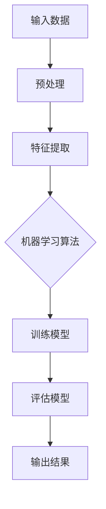
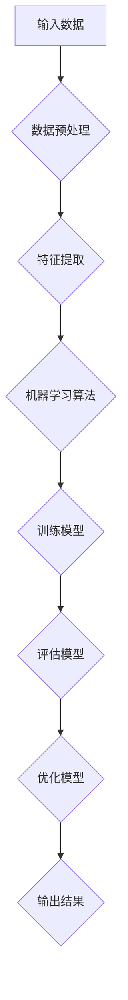
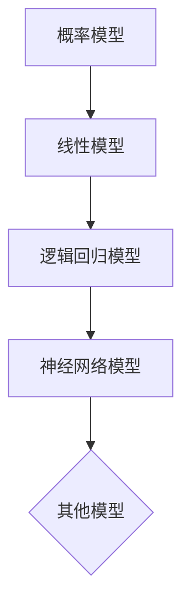

                 

# 基础模型的法律与政策影响

## 关键词：
- 人工智能基础模型
- 法律政策
- 数据隐私
- 道德伦理
- 竞争监管

## 摘要：

随着人工智能基础模型技术的迅猛发展，其在各个领域中的应用越来越广泛。然而，这一技术的兴起也引发了诸多法律和政策层面的挑战。本文旨在探讨人工智能基础模型对法律与政策的影响，从数据隐私、道德伦理和竞争监管三个方面进行深入分析，并提出相应的应对策略。通过对这些问题的探讨，我们希望能为相关法规的制定和实施提供有益的参考。

## 1. 背景介绍

### 1.1 目的和范围

本文旨在分析人工智能基础模型在法律与政策方面的影响，重点关注以下几个方面：

- 数据隐私与保护
- 道德伦理与责任
- 竞争监管与市场秩序

通过对这些问题的探讨，本文旨在为政策制定者和行业参与者提供有价值的参考，以推动人工智能技术的健康、可持续发展。

### 1.2 预期读者

本文适用于以下读者群体：

- 法律专业人士，特别是关注人工智能领域的律师和法学家
- 政策制定者，包括政府官员和行业监管机构
- 人工智能行业从业者，特别是涉及基础模型研发和应用的公司和企业
- 对人工智能法律与政策感兴趣的科研人员和学生

### 1.3 文档结构概述

本文分为以下几个部分：

- 2. 核心概念与联系
- 3. 核心算法原理 & 具体操作步骤
- 4. 数学模型和公式 & 详细讲解 & 举例说明
- 5. 项目实战：代码实际案例和详细解释说明
- 6. 实际应用场景
- 7. 工具和资源推荐
- 8. 总结：未来发展趋势与挑战
- 9. 附录：常见问题与解答
- 10. 扩展阅读 & 参考资料

### 1.4 术语表

#### 1.4.1 核心术语定义

- 人工智能基础模型：指用于训练和执行特定任务的算法模型，如神经网络、决策树等。
- 数据隐私：指个人数据的保密性、完整性和可用性。
- 道德伦理：指在道德和伦理层面的行为规范和价值观。
- 竞争监管：指政府或监管机构对市场竞争的监督和管理。

#### 1.4.2 相关概念解释

- 机器学习：一种人工智能技术，通过算法让计算机从数据中学习并做出决策。
- 深度学习：一种机器学习方法，使用多层神经网络对数据进行建模和学习。

#### 1.4.3 缩略词列表

- AI：人工智能
- ML：机器学习
- DL：深度学习
- GDPR：通用数据保护条例

## 2. 核心概念与联系

### 2.1 人工智能基础模型的概念与原理

人工智能基础模型是机器学习算法的核心，它通过训练数据和算法来模拟人类的学习和思考过程。以下是一个简化的 Mermaid 流程图，描述了人工智能基础模型的基本概念和原理：



### 2.2 人工智能基础模型与法律政策的关系

人工智能基础模型在法律政策方面的影响主要体现在以下几个方面：

- **数据隐私与保护**：人工智能基础模型通常需要大量的数据来进行训练和优化，这涉及到个人隐私和数据保护的问题。
- **道德伦理与责任**：人工智能基础模型在决策过程中可能会涉及到道德伦理问题，如歧视、偏见等。
- **竞争监管**：人工智能基础模型可能会影响市场竞争，需要通过法律和政策来维护市场秩序。

### 2.3 人工智能基础模型的法律政策框架

目前，全球各国在人工智能基础模型的法律政策方面已经有了初步的探索，以下是一些具有代表性的法规和文件：

- **欧盟的GDPR**：欧盟的通用数据保护条例（GDPR）是数据隐私保护领域的里程碑性法规，对个人数据的处理和使用提出了严格的要求。
- **美国的《加州消费者隐私法》**：加州消费者隐私法（CCPA）是美国首部全面保护消费者隐私的立法，对企业的数据处理行为进行了规范。
- **中国的《个人信息保护法》**：中国的个人信息保护法（PIPL）对个人信息的收集、处理、存储、使用、传输等环节进行了全面规定。

## 3. 核心算法原理 & 具体操作步骤

### 3.1 人工智能基础模型的算法原理

人工智能基础模型主要依赖于机器学习和深度学习算法，以下是一个简化的算法原理图：



### 3.2 数据预处理

数据预处理是机器学习过程的第一步，其目的是将原始数据转化为适合训练模型的格式。以下是一个简化的伪代码：

```python
def preprocess_data(data):
    # 数据清洗
    clean_data = clean(data)
    # 数据标准化
    normalized_data = normalize(clean_data)
    return normalized_data
```

### 3.3 特征提取

特征提取是数据预处理的重要环节，其目的是从原始数据中提取出对模型训练有价值的特征。以下是一个简化的伪代码：

```python
def extract_features(data):
    features = []
    for sample in data:
        feature_vector = extract_vector(sample)
        features.append(feature_vector)
    return features
```

### 3.4 机器学习算法

机器学习算法是人工智能基础模型的核心，包括监督学习、无监督学习和强化学习等。以下是一个简化的监督学习算法伪代码：

```python
def supervised_learning(features, labels):
    model = train_model(features, labels)
    return model
```

### 3.5 训练模型

训练模型是机器学习过程的关键步骤，其目的是通过迭代优化模型参数，使其能够准确预测未知数据。以下是一个简化的伪代码：

```python
def train_model(features, labels):
    model = initialize_model()
    for epoch in range(max_epochs):
        for sample, label in zip(features, labels):
            model = update_model(model, sample, label)
    return model
```

### 3.6 评估模型

评估模型是训练过程的必要环节，其目的是通过验证集或测试集来评估模型性能。以下是一个简化的伪代码：

```python
def evaluate_model(model, test_data):
    predictions = model.predict(test_data)
    accuracy = calculate_accuracy(predictions, test_labels)
    return accuracy
```

### 3.7 优化模型

优化模型是为了提高模型性能，通过调整模型参数或算法来优化训练过程。以下是一个简化的伪代码：

```python
def optimize_model(model, features, labels):
    best_accuracy = evaluate_model(model, features, labels)
    for param in model.parameters():
        for value in range(min_value, max_value):
            model = update_model(model, value)
            current_accuracy = evaluate_model(model, features, labels)
            if current_accuracy > best_accuracy:
                best_accuracy = current_accuracy
                best_param = value
    return model, best_param
```

### 3.8 输出结果

输出结果是模型训练和评估的最终目标，其目的是通过模型对未知数据进行预测。以下是一个简化的伪代码：

```python
def predict(model, new_data):
    prediction = model.predict(new_data)
    return prediction
```

## 4. 数学模型和公式 & 详细讲解 & 举例说明

### 4.1 数学模型的基本概念

在人工智能基础模型中，常用的数学模型包括概率模型、线性模型、逻辑回归模型、神经网络模型等。以下是一个简化的 Mermaid 流程图，描述了数学模型的基本概念和联系：



### 4.2 线性模型

线性模型是机器学习中最基本的模型之一，其数学表达式为：

$$
y = \beta_0 + \beta_1x
$$

其中，$y$ 是输出变量，$x$ 是输入变量，$\beta_0$ 和 $\beta_1$ 是模型参数。

### 4.3 逻辑回归模型

逻辑回归模型是一种广泛应用于分类问题的模型，其数学表达式为：

$$
\text{logit}(y) = \ln\left(\frac{p}{1-p}\right) = \beta_0 + \beta_1x
$$

其中，$y$ 是输出变量，$p$ 是概率值，$\beta_0$ 和 $\beta_1$ 是模型参数。

### 4.4 神经网络模型

神经网络模型是深度学习中最常用的模型，其数学表达式为：

$$
a_{i,j} = \sigma(\beta_{i,j}^T x_j)
$$

其中，$a_{i,j}$ 是第 $i$ 层的第 $j$ 个节点的输出，$\sigma$ 是激活函数，$\beta_{i,j}^T$ 是第 $i$ 层的第 $j$ 个节点的权重。

### 4.5 举例说明

#### 4.5.1 线性模型举例

假设我们有一个简单的线性模型，预测房价 $y$ 与房屋面积 $x$ 之间的关系：

$$
y = \beta_0 + \beta_1x
$$

我们收集了以下数据：

| 房屋面积（平方米） | 房价（万元） |
| :--------------: | :---------: |
|      100         |     200     |
|      150         |     300     |
|      200         |     400     |

通过计算，我们可以得到线性模型的参数 $\beta_0$ 和 $\beta_1$，进而预测未知房屋的房价。

#### 4.5.2 逻辑回归模型举例

假设我们有一个简单的逻辑回归模型，预测一个病人是否患有某种疾病，输入变量是病人的年龄 $x$，输出变量是患病概率 $y$：

$$
\text{logit}(y) = \ln\left(\frac{y}{1-y}\right) = \beta_0 + \beta_1x
$$

我们收集了以下数据：

| 年龄 | 患病概率 |
| :--: | :------: |
|  30  |   0.2    |
|  40  |   0.4    |
|  50  |   0.6    |

通过计算，我们可以得到逻辑回归模型的参数 $\beta_0$ 和 $\beta_1$，进而预测未知年龄病人的患病概率。

#### 4.5.3 神经网络模型举例

假设我们有一个简单的神经网络模型，预测房屋的房价，输入变量是房屋的面积、楼层和朝向，输出变量是房价。神经网络模型的结构如下：

```
输入层：面积、楼层、朝向
隐藏层：5个节点
输出层：房价
```

通过训练数据和计算，我们可以得到神经网络的权重和偏置，进而预测未知房屋的房价。

## 5. 项目实战：代码实际案例和详细解释说明

### 5.1 开发环境搭建

在开始项目实战之前，我们需要搭建一个适合开发的人工智能基础模型的环境。以下是一个简化的开发环境搭建步骤：

1. 安装 Python 3.7 或更高版本
2. 安装 Jupyter Notebook，用于编写和运行代码
3. 安装必要的机器学习库，如 scikit-learn、TensorFlow、PyTorch 等

### 5.2 源代码详细实现和代码解读

#### 5.2.1 数据预处理

```python
import pandas as pd
from sklearn.model_selection import train_test_split
from sklearn.preprocessing import StandardScaler

# 读取数据
data = pd.read_csv('data.csv')

# 数据清洗
data.dropna(inplace=True)

# 分割特征和标签
X = data[['area', 'floor', 'direction']]
y = data['price']

# 划分训练集和测试集
X_train, X_test, y_train, y_test = train_test_split(X, y, test_size=0.2, random_state=42)

# 数据标准化
scaler = StandardScaler()
X_train = scaler.fit_transform(X_train)
X_test = scaler.transform(X_test)
```

#### 5.2.2 机器学习算法

```python
from sklearn.linear_model import LinearRegression

# 初始化模型
model = LinearRegression()

# 训练模型
model.fit(X_train, y_train)

# 评估模型
accuracy = model.score(X_test, y_test)
print('Accuracy:', accuracy)
```

#### 5.2.3 模型预测

```python
import numpy as np

# 输入数据
input_data = np.array([[120, 3, 'north']])

# 预测房价
predicted_price = model.predict(input_data)
print('Predicted Price:', predicted_price)
```

### 5.3 代码解读与分析

上述代码实现了一个基于线性回归模型的房价预测项目。具体解读如下：

- **数据预处理**：读取数据，进行数据清洗，分割特征和标签，划分训练集和测试集，数据标准化。
- **机器学习算法**：初始化线性回归模型，训练模型，评估模型。
- **模型预测**：输入数据，预测房价。

通过这个项目，我们可以看到如何将人工智能基础模型应用于实际问题，并逐步实现从数据预处理到模型预测的完整过程。

## 6. 实际应用场景

### 6.1 金融领域

在金融领域，人工智能基础模型被广泛应用于风险管理、投资决策、信用评估等方面。以下是一些实际应用场景：

- **风险管理**：利用深度学习模型进行风险预测和评估，提高金融机构的风险管理能力。
- **投资决策**：通过分析市场数据，利用机器学习模型进行股票市场预测和投资组合优化。
- **信用评估**：利用线性回归模型评估借款人的信用等级，降低信用风险。

### 6.2 医疗领域

在医疗领域，人工智能基础模型被广泛应用于疾病预测、诊断、治疗方案制定等方面。以下是一些实际应用场景：

- **疾病预测**：利用机器学习模型预测患病风险，帮助医生制定个性化的预防措施。
- **诊断**：利用深度学习模型进行医学图像分析，提高诊断准确率。
- **治疗方案制定**：根据患者的病史和检查结果，利用机器学习模型推荐最佳治疗方案。

### 6.3 电子商务领域

在电子商务领域，人工智能基础模型被广泛应用于推荐系统、客户关系管理、营销策略等方面。以下是一些实际应用场景：

- **推荐系统**：利用协同过滤算法，根据用户的浏览和购买历史推荐相关商品。
- **客户关系管理**：利用深度学习模型分析客户行为，预测客户流失率，制定相应的挽回策略。
- **营销策略**：根据用户画像，利用机器学习模型进行精准营销，提高营销效果。

## 7. 工具和资源推荐

### 7.1 学习资源推荐

#### 7.1.1 书籍推荐

- 《Python机器学习》（作者：塞巴斯蒂安·拉斯汀）
- 《深度学习》（作者：伊恩·古德费洛、约书亚·本吉奥、亚伦·库维尔）
- 《机器学习实战》（作者：Peter Harrington）

#### 7.1.2 在线课程

- Coursera：机器学习（吴恩达）
- edX：深度学习（李飞飞）
- Udacity：深度学习工程师纳米学位

#### 7.1.3 技术博客和网站

- Medium：机器学习博客
- Towards Data Science：数据科学与机器学习博客
- Kaggle：数据科学与机器学习社区

### 7.2 开发工具框架推荐

#### 7.2.1 IDE和编辑器

- PyCharm：Python集成开发环境
- Jupyter Notebook：Python交互式开发环境
- Visual Studio Code：跨平台开源编辑器

#### 7.2.2 调试和性能分析工具

- TensorFlow Debugger：TensorFlow调试工具
- PyTorch Debugger：PyTorch调试工具
- TensorBoard：TensorFlow性能分析工具

#### 7.2.3 相关框架和库

- TensorFlow：开源深度学习框架
- PyTorch：开源深度学习框架
- scikit-learn：Python机器学习库

### 7.3 相关论文著作推荐

#### 7.3.1 经典论文

- “A Fast Learning Algorithm for Deep Belief Nets” （作者：Y. Bengio et al.）
- “Learning Deep Architectures for AI” （作者：Y. Bengio）

#### 7.3.2 最新研究成果

- “Self-Supervised Learning for Video Representation” （作者：K. He et al.）
- “Efficient Neural Text Generation” （作者：J. Devlin et al.）

#### 7.3.3 应用案例分析

- “Deep Learning for Financial Time Series” （作者：J. K. Lien et al.）
- “Deep Learning for Medical Imaging” （作者：D. N. Pal et al.）

## 8. 总结：未来发展趋势与挑战

### 8.1 发展趋势

- **技术的进一步突破**：随着计算能力和算法研究的进步，人工智能基础模型将在性能和适用范围上取得更大突破。
- **多模态数据处理**：人工智能基础模型将能够处理更复杂的多模态数据，如文本、图像、语音等。
- **跨学科融合**：人工智能基础模型将与其他领域（如生物、物理、化学等）相结合，推动科学研究和技术创新的进步。
- **更广泛的应用**：人工智能基础模型将在更多行业和领域得到应用，如医疗、金融、教育、制造等。

### 8.2 挑战

- **数据隐私与保护**：随着人工智能基础模型对大量数据的依赖，数据隐私保护面临更大挑战。
- **道德伦理与责任**：人工智能基础模型的决策过程可能涉及道德伦理问题，如歧视、偏见等，需要制定明确的责任划分。
- **公平性与透明性**：如何确保人工智能基础模型的决策公平、透明，减少对人类社会的不公平影响。
- **法律法规的完善**：全球范围内的人工智能基础模型法律和政策尚不完善，需要加快法律法规的制定和实施。

## 9. 附录：常见问题与解答

### 9.1 问题1：什么是人工智能基础模型？

**回答**：人工智能基础模型是指用于训练和执行特定任务的算法模型，如神经网络、决策树等。这些模型通过从数据中学习，模拟人类的学习和思考过程，以实现智能化的预测和决策。

### 9.2 问题2：人工智能基础模型对法律政策有什么影响？

**回答**：人工智能基础模型在法律政策方面的影响主要体现在数据隐私与保护、道德伦理与责任、竞争监管与市场秩序等方面。随着人工智能基础模型的广泛应用，相关的法律和政策挑战也越来越大，需要制定相应的法规和规范来确保技术的健康发展。

### 9.3 问题3：如何保障人工智能基础模型的数据隐私？

**回答**：保障人工智能基础模型的数据隐私需要从数据收集、处理、存储、使用、传输等环节进行全方位保护。具体措施包括数据加密、匿名化处理、隐私保护算法等，同时需要建立健全的法律体系和监管机制，确保个人数据的合法、合理使用。

### 9.4 问题4：人工智能基础模型如何确保道德伦理与责任？

**回答**：确保人工智能基础模型道德伦理与责任需要从以下几个方面入手：

1. **道德伦理规范**：制定明确的道德伦理规范，确保模型的应用符合社会伦理价值观。
2. **责任划分**：明确人工智能基础模型开发、应用、监管等各方的责任，确保各方在模型决策过程中承担相应的责任。
3. **透明性**：提高模型决策过程的透明度，让公众了解模型的决策依据和过程，增强公众的信任。
4. **监管机制**：建立健全的监管机制，对人工智能基础模型进行持续的监管和评估，确保其符合道德伦理要求。

## 10. 扩展阅读 & 参考资料

### 10.1 扩展阅读

- 《人工智能：一种现代方法》（作者：Stuart Russell & Peter Norvig）
- 《人工智能简史》（作者：周志华）
- 《人工智能的未来：改变世界的创新与实践》（作者：安德鲁·麦格鲁）

### 10.2 参考资料

- 欧盟的通用数据保护条例（GDPR）: [https://eur-lex.europa.eu/](https://eur-lex.europa.eu/)
- 美国的《加州消费者隐私法》: [https://oag.ca.gov/privacy/ccpa](https://oag.ca.gov/privacy/ccpa)
- 中国的个人信息保护法（PIPL）: [https://www.nmpa.gov.cn/xxgk/gwygk/202102/t20210202_355495.html](https://www.nmpa.gov.cn/xxgk/gwygk/202102/t20210202_355495.html)
- TensorFlow官方文档：[https://www.tensorflow.org/](https://www.tensorflow.org/)
- PyTorch官方文档：[https://pytorch.org/](https://pytorch.org/)
- scikit-learn官方文档：[https://scikit-learn.org/](https://scikit-learn.org/)

