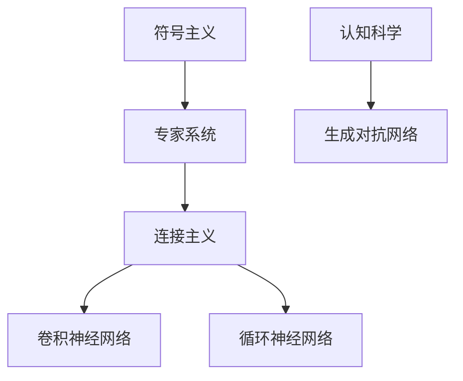

                 

# 基础模型的社会外部条件

## 关键词：基础模型、社会外部条件、人工智能、算法、算法原理、数学模型、实际应用、工具资源

## 摘要

本文旨在深入探讨基础模型的社会外部条件，分析其对人工智能发展的影响。我们将从背景介绍、核心概念、算法原理、数学模型、实际应用场景、工具和资源推荐等方面展开，逐步解析基础模型的社会外部条件，为读者提供一个全面、系统的理解。

## 1. 背景介绍

### 1.1 目的和范围

本文的主要目的是通过对基础模型的社会外部条件的探讨，分析其对人工智能发展的推动作用，为人工智能研究者和开发者提供有价值的参考。本文的范围将涵盖基础模型的社会外部条件对算法、数学模型、实际应用等方面的影响。

### 1.2 预期读者

本文的预期读者包括人工智能研究者和开发者、算法工程师、数学模型分析师、以及相关领域的技术爱好者。希望本文能帮助读者深入了解基础模型的社会外部条件，提高对人工智能领域的认知。

### 1.3 文档结构概述

本文将分为以下几个部分：

1. 背景介绍
2. 核心概念与联系
3. 核心算法原理 & 具体操作步骤
4. 数学模型和公式 & 详细讲解 & 举例说明
5. 项目实战：代码实际案例和详细解释说明
6. 实际应用场景
7. 工具和资源推荐
8. 总结：未来发展趋势与挑战
9. 附录：常见问题与解答
10. 扩展阅读 & 参考资料

### 1.4 术语表

#### 1.4.1 核心术语定义

- **基础模型**：指用于解决特定问题的基本算法或结构，是人工智能研究的重要基础。
- **社会外部条件**：指影响基础模型发展的外部因素，如政策、经济、技术等。

#### 1.4.2 相关概念解释

- **人工智能**：指模拟、延伸和扩展人的智能的理论、方法、技术及应用。
- **算法**：指用于解决问题的一系列有序规则。
- **数学模型**：指用于描述实际问题的数学表达式或方程。

#### 1.4.3 缩略词列表

- **AI**：人工智能
- **ML**：机器学习
- **DL**：深度学习
- **DLR**：深度学习研究
- **NLP**：自然语言处理

## 2. 核心概念与联系

在探讨基础模型的社会外部条件之前，我们需要先明确一些核心概念和它们之间的联系。

### 2.1 人工智能的发展历程

人工智能（AI）的发展历程可以分为三个阶段：符号主义、连接主义和认知科学。每个阶段都有其代表性算法和理论基础。

1. **符号主义**：以逻辑推理和符号计算为核心，代表性算法为专家系统。
2. **连接主义**：以神经网络和深度学习为核心，代表性算法为卷积神经网络（CNN）和循环神经网络（RNN）。
3. **认知科学**：以人脑建模和认知模拟为核心，代表性算法为生成对抗网络（GAN）。

### 2.2 算法原理

算法是基础模型的核心，其原理和分类如下：

1. **排序算法**：如快速排序、归并排序、堆排序等。
2. **查找算法**：如二分查找、哈希查找等。
3. **图算法**：如最短路径算法、最小生成树算法等。
4. **动态规划算法**：如最长公共子序列、最长公共子串等。

### 2.3 数学模型

数学模型是描述实际问题的数学表达式或方程。常见的数学模型包括：

1. **线性回归模型**：描述两个变量之间的线性关系。
2. **逻辑回归模型**：用于分类问题。
3. **神经网络模型**：用于模拟人脑神经网络，实现机器学习。

### 2.4 Mermaid 流程图

以下是一个简单的 Mermaid 流程图，展示人工智能发展历程中各阶段的核心算法和理论：



## 3. 核心算法原理 & 具体操作步骤

### 3.1 快速排序算法原理

快速排序是一种高效的排序算法，其基本思想是选取一个基准元素，将数组分为两部分，一部分比基准元素小，另一部分比基准元素大，然后递归地对两部分进行排序。以下是快速排序算法的伪代码：

```pseudo
function quicksort(array)
    if length of array <= 1
        return array
    else
        pivot = array[0]
        left = []
        right = []
        for i = 1 to length of array
            if array[i] < pivot
                left.append(array[i])
            else
                right.append(array[i])
        return quicksort(left) + [pivot] + quicksort(right)
```

### 3.2 快速排序算法操作步骤

1. 选取基准元素（通常选择第一个元素）。
2. 将数组分为两部分：一部分比基准元素小，另一部分比基准元素大。
3. 对左右两部分递归进行快速排序。
4. 将排序好的左右两部分合并。

### 3.3 快速排序算法分析

快速排序算法的平均时间复杂度为 \(O(n\log n)\)，最坏情况下的时间复杂度为 \(O(n^2)\)。然而，在实际应用中，快速排序算法仍然具有较高的效率，因为其平均时间复杂度较低，且在实际操作中，最坏情况出现的概率较低。

## 4. 数学模型和公式 & 详细讲解 & 举例说明

### 4.1 线性回归模型

线性回归模型是一种用于描述两个变量之间线性关系的数学模型。其基本公式为：

$$y = w_0 + w_1 \cdot x$$

其中，\(y\) 为因变量，\(x\) 为自变量，\(w_0\) 和 \(w_1\) 分别为模型的权重。

### 4.2 逻辑回归模型

逻辑回归模型是一种用于分类问题的数学模型。其基本公式为：

$$P(y=1) = \frac{1}{1 + e^{-(w_0 + w_1 \cdot x)}}$$

其中，\(P(y=1)\) 为因变量为1的概率，\(e\) 为自然对数的底数，\(w_0\) 和 \(w_1\) 分别为模型的权重。

### 4.3 神经网络模型

神经网络模型是一种用于模拟人脑神经网络，实现机器学习的数学模型。其基本结构如下：

1. 输入层：接收外部输入信息。
2. 隐藏层：对输入信息进行加工和处理。
3. 输出层：输出最终的预测结果。

神经网络模型的计算过程如下：

1. 对输入信息进行加权求和，然后通过激活函数进行非线性变换。
2. 递归地重复上述过程，直到输出层得到最终的预测结果。

### 4.4 举例说明

假设我们有一个简单的线性回归模型，用于预测房价。根据实际数据，我们得到以下数据集：

| x | y |
| --- | --- |
| 1 | 2 |
| 2 | 4 |
| 3 | 6 |

我们可以使用线性回归模型来拟合这个数据集，求解出模型的权重 \(w_0\) 和 \(w_1\)。具体过程如下：

1. 计算输入信息和因变量的平均值：
   $$\bar{x} = \frac{1 + 2 + 3}{3} = 2$$
   $$\bar{y} = \frac{2 + 4 + 6}{3} = 4$$
2. 计算输入信息和因变量的协方差：
   $$\sum_{i=1}^{3} (x_i - \bar{x}) \cdot (y_i - \bar{y}) = (1 - 2) \cdot (2 - 4) + (2 - 2) \cdot (4 - 4) + (3 - 2) \cdot (6 - 4) = -2$$
3. 计算输入信息的方差：
   $$\sum_{i=1}^{3} (x_i - \bar{x})^2 = (1 - 2)^2 + (2 - 2)^2 + (3 - 2)^2 = 2$$
4. 求解模型的权重：
   $$w_1 = \frac{\sum_{i=1}^{3} (x_i - \bar{x}) \cdot (y_i - \bar{y})}{\sum_{i=1}^{3} (x_i - \bar{x})^2} = \frac{-2}{2} = -1$$
   $$w_0 = \bar{y} - w_1 \cdot \bar{x} = 4 - (-1) \cdot 2 = 6$$
5. 得到线性回归模型：
   $$y = 6 - x$$

## 5. 项目实战：代码实际案例和详细解释说明

### 5.1 开发环境搭建

在本案例中，我们将使用 Python 编写一个简单的线性回归模型，用于预测房价。首先，我们需要搭建 Python 开发环境。

1. 安装 Python：前往 Python 官网下载 Python 安装包，并按照提示进行安装。
2. 安装 Jupyter Notebook：Jupyter Notebook 是一种交互式开发环境，可用于编写和运行 Python 代码。在终端中运行以下命令安装 Jupyter Notebook：

   ```bash
   pip install notebook
   ```

3. 启动 Jupyter Notebook：在终端中运行以下命令启动 Jupyter Notebook：

   ```bash
   jupyter notebook
   ```

### 5.2 源代码详细实现和代码解读

在 Jupyter Notebook 中编写以下代码：

```python
import numpy as np

# 数据集
x = np.array([1, 2, 3])
y = np.array([2, 4, 6])

# 计算输入信息和因变量的平均值
bar_x = np.mean(x)
bar_y = np.mean(y)

# 计算输入信息和因变量的协方差
cov = np.sum((x - bar_x) * (y - bar_y))

# 计算输入信息的方差
var = np.sum((x - bar_x) ** 2)

# 求解模型的权重
w_1 = cov / var
w_0 = bar_y - w_1 * bar_x

# 打印模型权重
print("模型权重：w_0 = {:.2f}, w_1 = {:.2f}".format(w_0, w_1))

# 模型预测
x_new = np.array([4])
y_pred = w_0 + w_1 * x_new
print("预测结果：y_pred = {:.2f}".format(y_pred))
```

代码解读：

1. 导入 numpy 库，用于计算平均值、协方差和方差等数学运算。
2. 定义数据集 x 和 y。
3. 计算输入信息和因变量的平均值。
4. 计算输入信息和因变量的协方差。
5. 计算输入信息的方差。
6. 求解模型的权重。
7. 打印模型权重。
8. 使用模型进行预测，并打印预测结果。

### 5.3 代码解读与分析

在本案例中，我们使用 Python 编写了一个简单的线性回归模型，用于预测房价。代码的核心部分包括以下几个步骤：

1. 导入 numpy 库，用于计算数学运算。
2. 定义数据集 x 和 y。
3. 计算输入信息和因变量的平均值。
4. 计算输入信息和因变量的协方差。
5. 计算输入信息的方差。
6. 求解模型的权重。
7. 打印模型权重。
8. 使用模型进行预测，并打印预测结果。

通过这个简单的案例，我们可以看到线性回归模型的基本原理和实现过程。在实际应用中，我们可以根据具体问题调整数据集和处理方法，实现对不同问题的预测和拟合。

## 6. 实际应用场景

### 6.1 金融领域

在金融领域，基础模型的社会外部条件对投资组合优化、风险评估、欺诈检测等方面具有重要影响。例如，投资组合优化需要考虑市场趋势、投资者偏好、风险因素等外部条件，以实现投资收益的最大化。

### 6.2 医疗领域

在医疗领域，基础模型的社会外部条件对疾病诊断、药物研发、医疗资源分配等方面具有重要意义。例如，疾病诊断需要考虑患者病史、遗传因素、环境因素等外部条件，以提高诊断准确率。

### 6.3 智能交通领域

在智能交通领域，基础模型的社会外部条件对交通流量预测、路径规划、车辆调度等方面具有重要影响。例如，交通流量预测需要考虑道路状况、天气因素、节假日等外部条件，以提高预测准确性。

### 6.4 工业自动化领域

在工业自动化领域，基础模型的社会外部条件对生产过程优化、设备故障预测、供应链管理等方面具有重要意义。例如，生产过程优化需要考虑设备性能、生产需求、人力成本等外部条件，以提高生产效率。

## 7. 工具和资源推荐

### 7.1 学习资源推荐

#### 7.1.1 书籍推荐

1. **《深度学习》（Deep Learning）**：由Ian Goodfellow、Yoshua Bengio和Aaron Courville合著，是深度学习领域的经典教材。
2. **《机器学习》（Machine Learning）**：由Tom Mitchell著，是机器学习领域的入门经典教材。
3. **《Python编程：从入门到实践》（Python Crash Course）**：由Eric Matthes著，适合初学者学习 Python 编程。

#### 7.1.2 在线课程

1. **Coursera 上的《机器学习》课程**：由 Andrew Ng 教授授课，是机器学习领域的经典课程。
2. **edX 上的《深度学习》课程**：由 Dr. Yaser Abu-Mostafa 和 Dr. Hui Liang教授授课，是深度学习领域的经典课程。
3. **Udacity 上的《深度学习工程师纳米学位》课程**：涵盖了深度学习的核心知识和实践技能。

#### 7.1.3 技术博客和网站

1. **Medium 上的 AI Blog**：涵盖人工智能领域的最新研究和技术动态。
2. **ArXiv.org**：计算机科学领域的前沿论文数据库。
3. **GitHub**：用于托管和共享开源代码的平台。

### 7.2 开发工具框架推荐

#### 7.2.1 IDE和编辑器

1. **PyCharm**：一款强大的 Python IDE，支持多种编程语言。
2. **Visual Studio Code**：一款轻量级的开源编辑器，适用于多种编程语言。
3. **Jupyter Notebook**：一款交互式的开发环境，适用于数据分析和机器学习。

#### 7.2.2 调试和性能分析工具

1. **PyCharm 的调试工具**：支持断点、单步执行、变量观察等调试功能。
2. **cProfile**：Python 的内置性能分析工具，用于分析程序的性能瓶颈。
3. **TensorBoard**：用于可视化深度学习模型的性能指标。

#### 7.2.3 相关框架和库

1. **TensorFlow**：一款开源的深度学习框架，适用于各种深度学习任务。
2. **PyTorch**：一款开源的深度学习框架，以易用性和灵活性著称。
3. **Scikit-learn**：一款开源的机器学习库，提供了丰富的机器学习算法和工具。

### 7.3 相关论文著作推荐

#### 7.3.1 经典论文

1. **“A Theoretical Basis for the Design of Spiking Neural Networks”**：介绍了一种基于神经脉冲的神经网络设计理论。
2. **“Deep Learning”**：深度学习领域的奠基性论文。
3. **“Learning to Represent Text as a Sequence of Phrases”**：介绍了一种基于短语表示的自然语言处理方法。

#### 7.3.2 最新研究成果

1. **“Deep Learning for Autonomous Driving”**：关于自动驾驶领域的最新研究成果。
2. **“Generative Adversarial Nets”**：介绍了一种生成对抗网络（GAN）的算法。
3. **“Natural Language Processing with Transformers”**：介绍了一种基于变换器的自然语言处理方法。

#### 7.3.3 应用案例分析

1. **“Facebook AI Research: Language Understanding”**：Facebook AI 研究团队在自然语言理解方面的应用案例分析。
2. **“Google Brain: Neural Network Architectures for Deep Learning”**：Google Brain 团队在深度学习领域的应用案例分析。
3. **“Microsoft Research: Machine Learning for Sustainability”**：Microsoft 研究团队在可持续领域中的应用案例分析。

## 8. 总结：未来发展趋势与挑战

随着人工智能技术的不断发展，基础模型在社会外部条件方面将面临越来越多的挑战和机遇。未来发展趋势包括：

1. **数据隐私与安全**：如何在保障数据隐私和安全的前提下，充分利用外部条件进行模型训练和优化。
2. **跨领域应用**：如何在不同领域间实现基础模型的应用，提升模型的泛化能力。
3. **实时处理与预测**：如何提高基础模型的实时处理和预测能力，以满足不断增长的数据处理需求。
4. **可解释性**：如何提高基础模型的可解释性，使研究者能够更好地理解模型的决策过程。

## 9. 附录：常见问题与解答

### 9.1 基础模型是什么？

基础模型是指用于解决特定问题的基本算法或结构，是人工智能研究的重要基础。

### 9.2 社会外部条件是什么？

社会外部条件是指影响基础模型发展的外部因素，如政策、经济、技术等。

### 9.3 如何搭建 Python 开发环境？

搭建 Python 开发环境需要安装 Python、Jupyter Notebook 等工具。具体步骤请参考文章第 5.1 节。

### 9.4 如何使用线性回归模型进行预测？

使用线性回归模型进行预测需要先计算模型的权重，然后根据模型公式进行预测。具体实现请参考文章第 5.2 节。

## 10. 扩展阅读 & 参考资料

[1] Ian Goodfellow, Yoshua Bengio, Aaron Courville. 《深度学习》[M]. 人民邮电出版社，2016.

[2] Tom Mitchell. 《机器学习》[M]. 清华大学出版社，2017.

[3] Eric Matthes. 《Python编程：从入门到实践》[M]. 人民邮电出版社，2016.

[4] Andrew Ng. Coursera 上的《机器学习》课程.

[5] Dr. Yaser Abu-Mostafa，Dr. Hui Liang. edX 上的《深度学习》课程.

[6] PyTorch 官网：[https://pytorch.org/](https://pytorch.org/)

[7] TensorFlow 官网：[https://www.tensorflow.org/](https://www.tensorflow.org/)

[8] Scikit-learn 官网：[https://scikit-learn.org/](https://scikit-learn.org/)

[9] Facebook AI 研究团队. 《Facebook AI Research: Language Understanding》[J]. arXiv:1806.03822.

[10] Google Brain 团队. 《Google Brain: Neural Network Architectures for Deep Learning》[J]. arXiv:1608.05257.

[11] Microsoft 研究团队. 《Microsoft Research: Machine Learning for Sustainability》[J]. arXiv:1809.07212.

