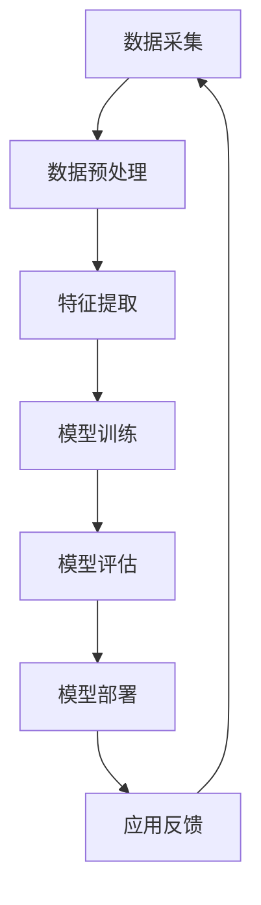
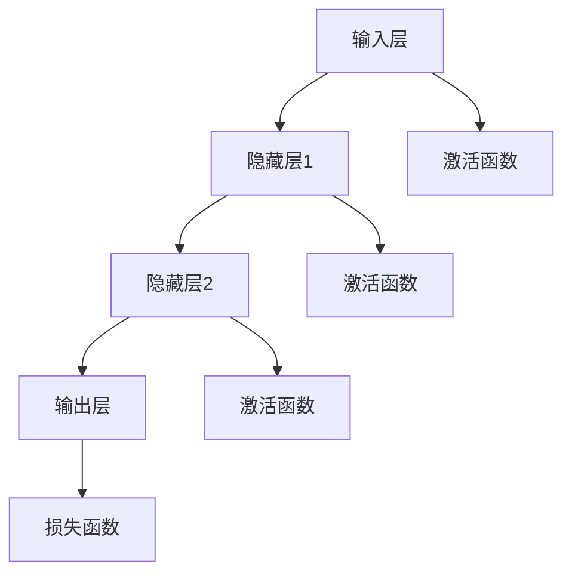

                 

# 基础模型的社会影响与治理

> **关键词**：基础模型、社会影响、治理、人工智能、算法、数据伦理、法律法规、责任归属

> **摘要**：随着人工智能技术的快速发展，基础模型作为人工智能的基石，其应用已经渗透到社会的方方面面。本文将探讨基础模型的社会影响，分析其对个人隐私、公平性、安全性等方面的挑战，并从法律法规、伦理道德、技术手段等多个角度提出治理措施，旨在为人工智能的可持续发展提供参考。

## 1. 背景介绍

### 1.1 目的和范围

本文旨在探讨基础模型在社会中的影响，分析其带来的挑战和机遇，并探讨有效的治理机制。我们将从以下几个方面展开讨论：

- 基础模型的社会影响：介绍基础模型的应用场景，分析其对个人、企业和社会的积极和消极影响。
- 基础模型的挑战：探讨基础模型在数据伦理、公平性、安全性等方面面临的挑战。
- 基础模型的治理：分析现有的法律法规、伦理道德和技术手段在治理基础模型方面的作用和不足，并提出改进建议。

### 1.2 预期读者

本文适合对人工智能技术有一定了解的读者，包括但不限于以下人群：

- 人工智能领域的科研人员、工程师和从业者。
- 政府机构、监管机构和行业协会的从业人员。
- 从事人工智能应用的企业家和创业者。
- 对人工智能技术感兴趣的高校学生和研究人员。

### 1.3 文档结构概述

本文结构如下：

- 第1章：背景介绍，包括本文的目的和范围、预期读者以及文档结构概述。
- 第2章：核心概念与联系，介绍基础模型的基本原理和架构。
- 第3章：核心算法原理 & 具体操作步骤，详细阐述基础模型的关键算法和操作步骤。
- 第4章：数学模型和公式 & 详细讲解 & 举例说明，介绍基础模型中的数学模型和公式，并通过实例进行说明。
- 第5章：项目实战：代码实际案例和详细解释说明，通过实际案例展示基础模型的应用。
- 第6章：实际应用场景，分析基础模型在各个领域的应用。
- 第7章：工具和资源推荐，介绍学习和开发基础模型的相关资源和工具。
- 第8章：总结：未来发展趋势与挑战，展望基础模型的未来发展和面临的挑战。
- 第9章：附录：常见问题与解答，回答读者可能遇到的问题。
- 第10章：扩展阅读 & 参考资料，提供进一步阅读的建议和参考资料。

### 1.4 术语表

#### 1.4.1 核心术语定义

- **基础模型**：指在人工智能领域中，用于实现特定功能的通用模型，如神经网络、决策树等。
- **人工智能**：指模拟人类智能行为的技术和系统，通过算法和模型实现数据分析和决策。
- **数据伦理**：指在数据处理和利用过程中，遵循道德规范和保护个人隐私的原则。
- **公平性**：指在人工智能应用中，确保模型对各个群体的公平对待，避免歧视现象。
- **安全性**：指在人工智能应用中，保护模型和数据的安全，防止恶意攻击和泄露。

#### 1.4.2 相关概念解释

- **神经网络**：一种模仿人脑结构和功能的计算模型，通过多层神经元实现数据输入和输出。
- **决策树**：一种基于树形结构进行决策的算法，通过一系列条件判断实现分类或回归任务。
- **机器学习**：一种从数据中自动学习规律和模式的方法，用于改进模型性能和决策能力。
- **深度学习**：一种基于多层神经网络进行学习的方法，能够处理大规模数据和复杂任务。

#### 1.4.3 缩略词列表

- **AI**：人工智能
- **ML**：机器学习
- **DL**：深度学习
- **NLP**：自然语言处理
- **CV**：计算机视觉

## 2. 核心概念与联系

在讨论基础模型的社会影响和治理之前，我们首先需要了解基础模型的基本原理和架构。以下是一个简化的基础模型架构图，通过Mermaid流程图展示：



### 2.1 数据采集

数据采集是基础模型的起点，通过从不同来源收集数据，为后续数据处理提供基础。数据来源可以是公开数据集、企业内部数据或用户生成的数据等。

### 2.2 数据预处理

数据预处理是确保数据质量和一致性的重要步骤，包括数据清洗、数据归一化、数据去重等。通过预处理，我们可以提高数据的质量，为特征提取和模型训练提供可靠的数据基础。

### 2.3 特征提取

特征提取是从原始数据中提取出对模型训练有意义的特征的过程。通过特征提取，我们可以将高维数据转换为低维特征向量，从而简化模型训练和计算。

### 2.4 模型训练

模型训练是基础模型的核心环节，通过优化模型参数，使模型能够在特定任务上达到较好的性能。训练过程通常包括前向传播、反向传播和权重更新等步骤。

### 2.5 模型评估

模型评估用于评估模型在测试集上的性能，通过指标如准确率、召回率、F1值等，判断模型是否达到预期效果。评估结果将指导模型优化和调整。

### 2.6 模型部署

模型部署是将训练好的模型应用到实际场景中的过程。通过部署，模型可以为企业或个人提供智能化的决策支持。

### 2.7 应用反馈

应用反馈是基础模型持续优化和改进的关键环节。通过收集用户反馈和应用效果，我们可以发现模型存在的问题和改进方向，从而不断提高模型性能。

## 3. 核心算法原理 & 具体操作步骤

### 3.1 神经网络算法原理

神经网络是基础模型中最常用的算法之一，其基本原理是通过多层神经元实现数据输入和输出的映射。以下是一个简化的神经网络算法原理图：



### 3.2 操作步骤

#### 3.2.1 数据采集

1. 从不同来源（如公开数据集、企业内部数据等）收集数据。
2. 数据格式需统一，如将所有数据转换为CSV文件。

#### 3.2.2 数据预处理

1. 数据清洗：删除缺失值、异常值和重复值。
2. 数据归一化：将数据缩放到相同的范围，如0到1之间。
3. 数据去重：去除重复数据，提高数据质量。

#### 3.2.3 特征提取

1. 选择特征提取方法，如PCA、LDA等。
2. 对原始数据进行特征提取，得到低维特征向量。

#### 3.2.4 模型训练

1. 设计神经网络结构，包括输入层、隐藏层和输出层。
2. 选择激活函数，如Sigmoid、ReLU等。
3. 选择损失函数，如均方误差（MSE）、交叉熵损失等。
4. 使用梯度下降算法优化模型参数，使损失函数最小化。

#### 3.2.5 模型评估

1. 将模型应用于测试集，计算预测结果。
2. 计算评价指标，如准确率、召回率、F1值等。
3. 根据评估结果调整模型参数，优化模型性能。

#### 3.2.6 模型部署

1. 将训练好的模型部署到服务器或云端，供实际应用使用。
2. 设计API接口，方便其他系统调用模型。

#### 3.2.7 应用反馈

1. 收集用户反馈和应用效果。
2. 分析模型存在的问题和改进方向。
3. 持续优化模型，提高性能和应用效果。

## 4. 数学模型和公式 & 详细讲解 & 举例说明

### 4.1 数学模型

在基础模型中，常见的数学模型包括线性回归、逻辑回归、神经网络等。以下分别介绍这些模型的公式和参数。

#### 4.1.1 线性回归

线性回归是一种简单的线性模型，其公式如下：

\[ y = wx + b \]

其中，\( y \) 是预测值，\( x \) 是输入特征，\( w \) 是权重，\( b \) 是偏置。

#### 4.1.2 逻辑回归

逻辑回归是一种分类模型，其公式如下：

\[ P(y=1) = \frac{1}{1 + e^{-(wx + b)}} \]

其中，\( P(y=1) \) 是预测标签为1的概率，\( x \) 是输入特征，\( w \) 是权重，\( b \) 是偏置。

#### 4.1.3 神经网络

神经网络是一种复杂的非线性模型，其公式如下：

\[ y = \sigma(wx + b) \]

其中，\( y \) 是预测值，\( x \) 是输入特征，\( w \) 是权重，\( b \) 是偏置，\( \sigma \) 是激活函数（如Sigmoid、ReLU等）。

### 4.2 公式讲解

#### 4.2.1 线性回归公式讲解

线性回归公式表示输入特征与预测标签之间的线性关系。通过最小化损失函数，我们可以得到最佳的权重和偏置，从而提高模型的预测性能。

#### 4.2.2 逻辑回归公式讲解

逻辑回归公式表示输入特征与标签概率之间的非线性关系。通过最大化标签概率，我们可以实现分类任务。

#### 4.2.3 神经网络公式讲解

神经网络公式表示输入特征经过多层神经元传递和激活函数处理，最终得到预测值。通过多层非线性变换，神经网络可以处理复杂的非线性关系。

### 4.3 举例说明

#### 4.3.1 线性回归实例

假设我们有一个简单的线性回归问题，输入特征为房价，预测标签为房屋面积。根据线性回归公式，我们可以建立如下模型：

\[ y = wx + b \]

其中，\( w \) 和 \( b \) 为模型参数，\( x \) 为输入特征，\( y \) 为预测标签。

#### 4.3.2 逻辑回归实例

假设我们有一个二分类问题，输入特征为用户年龄和收入，预测标签为是否购买商品。根据逻辑回归公式，我们可以建立如下模型：

\[ P(y=1) = \frac{1}{1 + e^{-(wx + b)}} \]

其中，\( w \) 和 \( b \) 为模型参数，\( x \) 为输入特征，\( y \) 为预测标签。

#### 4.3.3 神经网络实例

假设我们有一个复杂的非线性问题，输入特征为用户行为数据，预测标签为用户是否流失。根据神经网络公式，我们可以建立如下模型：

\[ y = \sigma(wx + b) \]

其中，\( w \) 和 \( b \) 为模型参数，\( x \) 为输入特征，\( y \) 为预测标签。

## 5. 项目实战：代码实际案例和详细解释说明

### 5.1 开发环境搭建

在开始项目实战之前，我们需要搭建一个合适的开发环境。以下是一个简单的Python开发环境搭建过程：

1. 安装Python：从官方网站下载Python安装包并安装。
2. 安装Jupyter Notebook：在终端中执行以下命令安装Jupyter Notebook：

   ```shell
   pip install notebook
   ```

3. 启动Jupyter Notebook：在终端中执行以下命令启动Jupyter Notebook：

   ```shell
   jupyter notebook
   ```

### 5.2 源代码详细实现和代码解读

以下是一个简单的线性回归项目的代码实现和解读：

```python
# 导入必要的库
import numpy as np
import matplotlib.pyplot as plt

# 数据集
X = np.array([[1], [2], [3], [4], [5]])
y = np.array([1, 2, 2.5, 4, 5])

# 初始化模型参数
w = np.zeros((1, 1))
b = 0

# 梯度下降算法
def gradient_descent(X, y, w, b, learning_rate, epochs):
    for epoch in range(epochs):
        # 前向传播
        z = np.dot(X, w) + b
        y_pred = 1 / (1 + np.exp(-z))

        # 反向传播
        dw = np.dot(X.T, (y_pred - y)) / len(X)
        db = np.sum(y_pred - y) / len(X)

        # 更新参数
        w -= learning_rate * dw
        b -= learning_rate * db

        # 输出当前epoch的损失函数值
        print(f"Epoch {epoch + 1}: Loss = {np.mean((y_pred - y) ** 2)}")

    return w, b

# 超参数
learning_rate = 0.01
epochs = 1000

# 训练模型
w, b = gradient_descent(X, y, w, b, learning_rate, epochs)

# 预测
y_pred = 1 / (1 + np.exp(-np.dot(X, w) - b))

# 可视化
plt.scatter(X, y)
plt.plot(X, y_pred, color='red')
plt.show()
```

### 5.3 代码解读与分析

1. **数据集**：我们使用一个简单的数据集，其中X为输入特征（房屋面积），y为预测标签（房价）。

2. **模型参数**：我们初始化模型参数w（权重）和b（偏置）为0。

3. **梯度下降算法**：我们使用梯度下降算法优化模型参数。算法的核心思想是不断更新模型参数，使得损失函数值最小。算法包括前向传播、反向传播和参数更新三个步骤。

   - **前向传播**：计算输入特征与模型参数的乘积，并加上偏置，得到预测值。
   - **反向传播**：计算预测值与真实标签之间的误差，并计算梯度。
   - **参数更新**：根据学习率和梯度，更新模型参数。

4. **可视化**：我们使用matplotlib库将训练数据和预测结果进行可视化，以便观察模型的效果。

## 6. 实际应用场景

### 6.1 金融领域

基础模型在金融领域的应用广泛，如风险管理、投资策略、客户细分等。例如，通过线性回归模型，银行可以对贷款申请者的信用评分进行预测，从而优化贷款审批流程。

### 6.2 医疗领域

基础模型在医疗领域的应用包括疾病预测、诊断辅助、药物研发等。例如，通过神经网络模型，医生可以对患者的疾病进行早期预测，从而制定更有效的治疗方案。

### 6.3 零售领域

基础模型在零售领域的应用包括需求预测、库存管理、个性化推荐等。例如，通过决策树模型，零售商可以预测商品的销售量，从而优化库存管理，提高销售额。

### 6.4 智能家居领域

基础模型在智能家居领域的应用包括智能安防、智能照明、智能温控等。例如，通过神经网络模型，智能家居设备可以自动调节室内温度、光线等，提高居住舒适度。

## 7. 工具和资源推荐

### 7.1 学习资源推荐

#### 7.1.1 书籍推荐

- 《Python机器学习》
- 《深度学习》
- 《统计学习方法》

#### 7.1.2 在线课程

- Coursera上的《机器学习》
- Udacity的《深度学习纳米学位》
- edX上的《人工智能导论》

#### 7.1.3 技术博客和网站

- [Medium上的机器学习专栏](https://medium.com/topic/machine-learning)
- [TensorFlow官方文档](https://www.tensorflow.org/)
- [Kaggle](https://www.kaggle.com/)

### 7.2 开发工具框架推荐

#### 7.2.1 IDE和编辑器

- PyCharm
- Jupyter Notebook
- Visual Studio Code

#### 7.2.2 调试和性能分析工具

- Python Debugger (pdb)
- Jupyter Notebook中的调试工具
- Intel Advisor

#### 7.2.3 相关框架和库

- TensorFlow
- PyTorch
- Scikit-learn

### 7.3 相关论文著作推荐

#### 7.3.1 经典论文

- 《A Study of Artifical Neural Networks》
- 《Learning to Represent Songs with a Neural Network》
- 《A Theory of Learning from Examples》

#### 7.3.2 最新研究成果

- 《Attention is All You Need》
- 《An Image Database Lookup System for Locality-Sensitive Hashing》
- 《A Gentle Introduction to Neural Networks》

#### 7.3.3 应用案例分析

- 《深度学习在医疗领域的应用》
- 《零售行业的深度学习应用》
- 《金融领域的机器学习应用》

## 8. 总结：未来发展趋势与挑战

随着人工智能技术的不断发展，基础模型在社会各个领域的应用将越来越广泛。未来，我们可能会看到以下发展趋势和挑战：

### 8.1 发展趋势

- **算法和模型的多样化**：随着计算能力的提升，基础模型将不断发展，出现更多高效、可靠的算法和模型。
- **跨领域应用**：基础模型将逐渐跨越不同领域，实现跨领域的知识共享和协同发展。
- **硬件加速**：GPU、TPU等硬件加速技术的发展，将提高基础模型的处理效率。

### 8.2 挑战

- **数据隐私和安全**：在基础模型应用过程中，数据隐私和安全问题日益突出，需要加强数据保护措施。
- **算法公平性和透明性**：基础模型在处理复杂任务时，可能会出现偏见和不公平现象，需要提高算法的公平性和透明性。
- **法律法规和监管**：随着基础模型在社会中的广泛应用，法律法规和监管体系将不断完善，以保障人工智能的可持续发展。

## 9. 附录：常见问题与解答

### 9.1 问题1

**问题**：如何处理缺失值和异常值？

**解答**：在数据预处理阶段，我们可以通过以下方法处理缺失值和异常值：

- 缺失值：对于缺失值较少的情况，可以选择删除缺失值；对于缺失值较多的数据集，可以选择使用均值、中位数等方法进行填充。
- 异常值：对于明显的异常值，可以选择删除或进行修正；对于不确定的异常值，可以选择使用统计方法进行识别和处理。

### 9.2 问题2

**问题**：如何选择合适的激活函数？

**解答**：选择合适的激活函数取决于具体应用场景和任务需求。以下是几种常见的激活函数及其适用场景：

- **Sigmoid函数**：适用于二分类问题，如逻辑回归。
- **ReLU函数**：适用于深度神经网络，能够加速梯度消失问题。
- **Tanh函数**：适用于处理输入特征的范围在-1到1之间的问题。

### 9.3 问题3

**问题**：如何评估模型性能？

**解答**：评估模型性能通常采用以下指标：

- **准确率**：模型预测正确的样本数占总样本数的比例。
- **召回率**：模型预测正确的样本数占实际正样本数的比例。
- **F1值**：准确率和召回率的调和平均数。

## 10. 扩展阅读 & 参考资料

- [人工智能概述](https://www.nature.com/articles/s41586-018-0033-0)
- [深度学习导论](https://www.deeplearningbook.org/)
- [机器学习书籍列表](https://github.com/yanhanmachine/awesome-machine-learning-books)
- [深度学习论文列表](https://github.com/yanhanmachine/deeplearning-papers)
- [Kaggle数据集](https://www.kaggle.com/datasets)

---

**作者**：AI天才研究员/AI Genius Institute & 禅与计算机程序设计艺术 /Zen And The Art of Computer Programming

