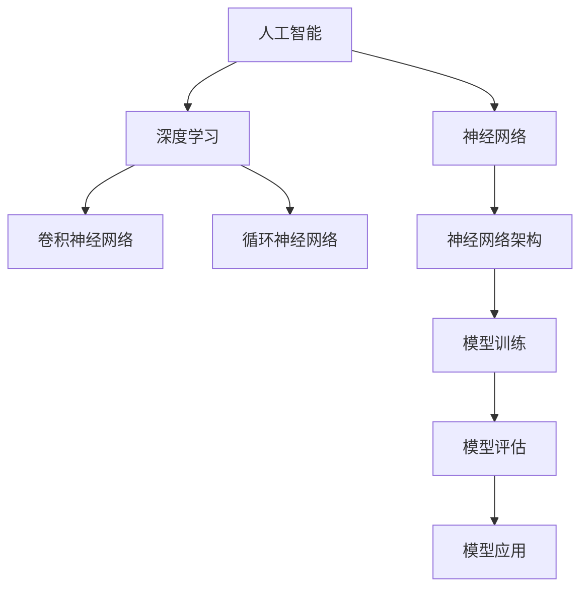
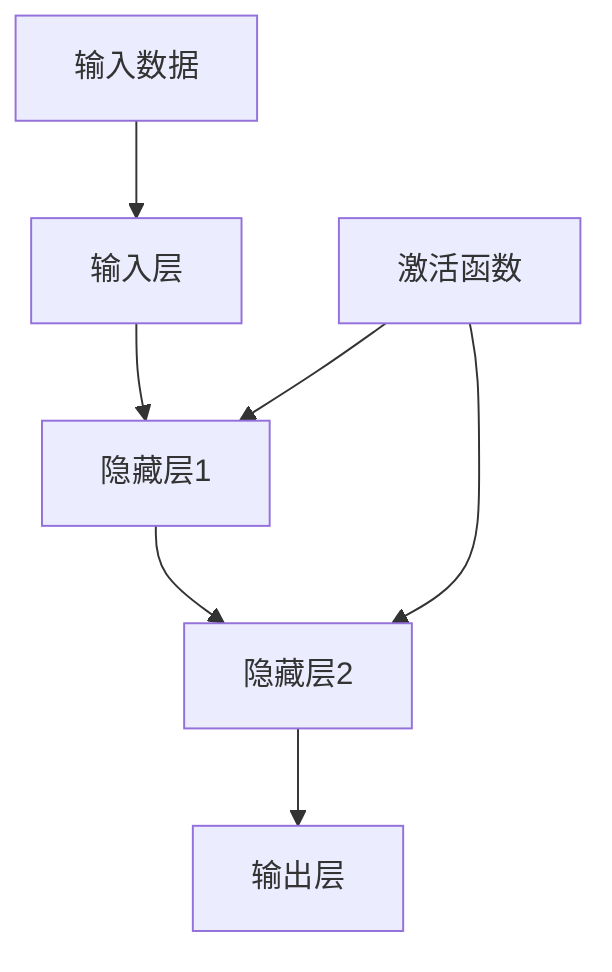

                 

# 基础模型的社会技术融合

## 关键词
- 人工智能
- 社会技术
- 融合
- 基础模型
- 深度学习
- 神经网络
- 应用场景

## 摘要
本文旨在探讨人工智能基础模型在社会技术领域的融合与发展。通过分析深度学习和神经网络的原理，结合实际案例，深入探讨人工智能技术在各个应用场景中的价值。本文首先介绍基础模型的背景和核心概念，然后分析其原理，接着通过项目实战展示具体应用，最后展望未来发展趋势与挑战。希望通过本文，读者能够对人工智能基础模型在社会技术融合中的重要性有更深刻的理解。

## 1. 背景介绍

### 1.1 目的和范围
本文的目标是分析人工智能基础模型在社会技术融合中的作用，并探讨其在实际应用中的价值。本文的范围将涵盖基础模型的定义、原理、应用场景以及未来发展。

### 1.2 预期读者
本文适合对人工智能和深度学习有一定了解的技术人员、学生和研究人员阅读。同时，对人工智能技术感兴趣的读者也可以通过本文了解基础模型在社会技术融合中的重要性。

### 1.3 文档结构概述
本文分为十个部分，首先介绍基础模型的背景和核心概念，然后分析其原理和应用，接着展示具体应用场景，最后讨论未来发展趋势与挑战。具体结构如下：

1. 背景介绍
2. 核心概念与联系
3. 核心算法原理 & 具体操作步骤
4. 数学模型和公式 & 详细讲解 & 举例说明
5. 项目实战：代码实际案例和详细解释说明
6. 实际应用场景
7. 工具和资源推荐
8. 总结：未来发展趋势与挑战
9. 附录：常见问题与解答
10. 扩展阅读 & 参考资料

### 1.4 术语表

#### 1.4.1 核心术语定义
- **人工智能（AI）**：模拟人类智能行为的技术和学科。
- **基础模型**：用于解决特定问题的核心算法和数据结构。
- **深度学习**：一种基于多层神经网络的学习方法。
- **神经网络**：一种模拟人脑神经元之间交互的数学模型。

#### 1.4.2 相关概念解释
- **神经网络**：由多个神经元（或层）组成的网络，用于处理数据。
- **卷积神经网络（CNN）**：一种用于图像处理和识别的神经网络。
- **循环神经网络（RNN）**：一种用于序列数据处理的神经网络。

#### 1.4.3 缩略词列表
- **AI**：人工智能
- **DL**：深度学习
- **NN**：神经网络
- **CNN**：卷积神经网络
- **RNN**：循环神经网络

## 2. 核心概念与联系

在探讨人工智能基础模型的社会技术融合之前，我们需要明确几个核心概念及其相互联系。以下是一个简化的Mermaid流程图，展示了这些概念之间的联系。



### 2.1 人工智能（AI）
人工智能是指模拟人类智能行为的技术和学科。它包括机器学习、深度学习、自然语言处理等多个子领域。AI的目标是使计算机能够执行需要人类智能的任务，如图像识别、语音识别、语言翻译等。

### 2.2 深度学习（DL）
深度学习是一种基于多层神经网络的学习方法。它通过模拟人脑神经元之间的交互来处理大量数据，并在多个层次上提取特征。深度学习在图像识别、语音识别、自然语言处理等领域取得了显著的成果。

### 2.3 神经网络（NN）
神经网络是一种模拟人脑神经元之间交互的数学模型。它由多个神经元（或层）组成，用于处理数据。神经网络是深度学习的基础，许多深度学习算法都是基于神经网络设计的。

### 2.4 卷积神经网络（CNN）
卷积神经网络是一种用于图像处理和识别的神经网络。它通过卷积操作提取图像特征，并在多个层次上构建特征表示。CNN在计算机视觉领域取得了巨大成功，广泛应用于图像分类、目标检测、图像生成等任务。

### 2.5 循环神经网络（RNN）
循环神经网络是一种用于序列数据处理的神经网络。它通过在时间步之间保持状态，处理具有时间依赖性的数据。RNN在自然语言处理、语音识别、时间序列预测等领域具有广泛应用。

### 2.6 神经网络架构（神经网络架构）
神经网络架构是指网络的结构设计，包括层的选择、参数的设置等。不同的神经网络架构适用于不同的任务和数据类型。常见的神经网络架构有全连接神经网络、卷积神经网络、循环神经网络等。

### 2.7 模型训练（模型训练）
模型训练是指通过大量数据来调整神经网络参数的过程。训练过程中，模型通过学习数据特征来提高预测准确性。模型训练是深度学习的关键步骤，直接影响模型性能。

### 2.8 模型评估（模型评估）
模型评估是指对训练好的模型进行性能评估的过程。常用的评估指标包括准确率、召回率、F1分数等。模型评估有助于判断模型是否满足应用需求，并为优化模型提供参考。

### 2.9 模型应用（模型应用）
模型应用是指将训练好的模型用于实际问题的解决。模型应用可以涉及多个领域，如图像识别、语音识别、自然语言处理等。模型应用是实现人工智能技术价值的重要环节。

## 3. 核心算法原理 & 具体操作步骤

### 3.1 神经网络算法原理

神经网络算法是基于多层神经网络的学习方法，其基本原理是通过多层非线性变换来提取数据特征。以下是一个简化的神经网络算法原理图：



#### 3.1.1 输入层（Input Layer）
输入层接收外部输入数据，并将其传递给隐藏层。

#### 3.1.2 隐藏层（Hidden Layers）
隐藏层对输入数据进行处理，通过加权求和和激活函数转换，提取数据特征。隐藏层的数量和结构可以根据任务需求进行调整。

#### 3.1.3 输出层（Output Layer）
输出层将隐藏层的结果转换为最终输出。输出层的类型和数量取决于任务的类型，如分类任务、回归任务等。

#### 3.1.4 激活函数（Activation Function）
激活函数用于引入非线性特性，使神经网络能够学习复杂的数据模式。常见的激活函数有Sigmoid、ReLU、Tanh等。

### 3.2 具体操作步骤

#### 3.2.1 数据预处理
在训练神经网络之前，需要对输入数据进行预处理，包括数据清洗、归一化、数据增强等操作。预处理有助于提高模型训练效果和泛化能力。

#### 3.2.2 模型初始化
初始化神经网络模型的参数，包括权重和偏置。常用的初始化方法有随机初始化、高斯初始化等。

#### 3.2.3 前向传播
前向传播是指将输入数据通过神经网络传递到输出层的过程。在每层中，对输入数据进行加权求和并应用激活函数，得到输出。

```python
# 前向传播伪代码
def forwardPropagation(inputs, weights, biases, activationFunctions):
    outputs = []
    for layer in range(numLayers):
        if layer == 0:
            z = np.dot(inputs, weights[layer]) + biases[layer]
        else:
            z = np.dot(outputs[layer - 1], weights[layer]) + biases[layer]
        outputs.append(activationFunctions(z))
    return outputs
```

#### 3.2.4 计算损失函数
损失函数用于衡量模型预测结果与实际结果之间的差距。常见的损失函数有均方误差（MSE）、交叉熵损失（Cross Entropy Loss）等。

```python
# 计算损失函数伪代码
def computeLoss(y_true, y_pred, lossFunction):
    if lossFunction == "MSE":
        loss = np.mean((y_true - y_pred)**2)
    elif lossFunction == "CrossEntropy":
        loss = -np.mean(y_true * np.log(y_pred))
    return loss
```

#### 3.2.5 反向传播
反向传播是指从输出层向输入层反向传递误差，并更新模型参数的过程。反向传播是深度学习训练的核心步骤，通过梯度下降等方法优化模型参数。

```python
# 反向传播伪代码
def backwardPropagation(inputs, outputs, weights, biases, activationFunctions, lossFunction):
    dLoss = computeLoss(y_true, outputs[-1], lossFunction)
    dOutputs = [dLoss]
    for layer in reversed(range(numLayers)):
        dZ = dOutputs[layer] * activationFunctions_derivative(outputs[layer])
        dW = np.dot(dZ, inputs[layer - 1].T)
        db = dZ
        if layer > 0:
            inputs[layer - 1] = dZ
        else:
            inputs[layer - 1] = inputs[layer - 1] + dW
    return inputs
```

#### 3.2.6 模型优化
通过多次迭代训练和反向传播，不断优化模型参数。优化方法包括梯度下降、Adam优化器等。

```python
# 模型优化伪代码
for epoch in range(numEpochs):
    for batch in dataset:
        inputs, targets = preprocess(batch)
        outputs = forwardPropagation(inputs, weights, biases, activationFunctions)
        dLoss = computeLoss(targets, outputs, lossFunction)
        backwardPropagation(inputs, outputs, weights, biases, activationFunctions, lossFunction)
        updateParameters(weights, biases, learningRate)
```

## 4. 数学模型和公式 & 详细讲解 & 举例说明

### 4.1 神经网络数学模型

神经网络的数学模型主要涉及前向传播、反向传播和优化算法。以下是对这些模型的基本公式和解释。

#### 4.1.1 前向传播

前向传播是指将输入数据通过神经网络传递到输出层的过程。每个神经元（或层）的输出可以表示为：

$$
z_l = \sigma(W_l \cdot a_{l-1} + b_l)
$$

其中，$z_l$表示第$l$层的输出，$\sigma$表示激活函数（如Sigmoid、ReLU等），$W_l$和$b_l$分别表示权重和偏置。

对于全连接神经网络，每个神经元与其他所有前一层神经元相连接，其输出可以表示为：

$$
a_l = \sigma(\sum_{i=1}^{n} W_{li} \cdot a_{l-1} + b_l)
$$

其中，$a_{l-1}$表示前一层神经元的输出，$n$表示前一层神经元的数量。

#### 4.1.2 反向传播

反向传播是指从输出层向输入层反向传递误差，并更新模型参数的过程。误差可以表示为：

$$
\delta_l = \frac{\partial L}{\partial z_l}
$$

其中，$L$表示损失函数，$\delta_l$表示第$l$层的误差。

对于全连接神经网络，权重和偏置的更新可以表示为：

$$
\Delta W_l = \alpha \cdot \delta_l \cdot a_{l-1}^T
$$

$$
\Delta b_l = \alpha \cdot \delta_l
$$

其中，$\alpha$表示学习率，$a_{l-1}^T$表示前一层神经元的转置。

#### 4.1.3 优化算法

优化算法用于更新模型参数，使损失函数最小化。常见的优化算法有梯度下降、Adam优化器等。

梯度下降的更新规则可以表示为：

$$
W_l = W_l - \alpha \cdot \nabla W_l
$$

$$
b_l = b_l - \alpha \cdot \nabla b_l
$$

其中，$\nabla W_l$和$\nabla b_l$分别表示权重和偏置的梯度。

### 4.2 举例说明

假设我们有一个简单的全连接神经网络，包含一个输入层、一个隐藏层和一个输出层。输入层有3个神经元，隐藏层有4个神经元，输出层有2个神经元。我们使用ReLU作为激活函数，均方误差（MSE）作为损失函数。

#### 4.2.1 前向传播

给定输入数据$x = [1, 2, 3]$，我们需要计算隐藏层和输出层的输出。

首先，计算隐藏层输出：

$$
a_1 = \sigma(W_1 \cdot x + b_1)
$$

$$
a_1 = \sigma([w_{11}, w_{12}, w_{13}] \cdot [1, 2, 3] + [b_{11}, b_{12}, b_{13}])
$$

$$
a_1 = \sigma([w_{11} + 2w_{12} + 3w_{13} + b_{11} + b_{12} + b_{13}])
$$

$$
a_1 = \max(0, [w_{11} + 2w_{12} + 3w_{13} + b_{11} + b_{12} + b_{13}])
$$

类似地，计算输出层输出：

$$
a_2 = \sigma(W_2 \cdot a_1 + b_2)
$$

#### 4.2.2 反向传播

给定目标数据$y = [0.5, 0.5]$和输出层输出$a_2 = [0.9, 0.8]$，我们需要计算隐藏层和输入层的误差。

首先，计算输出层误差：

$$
\delta_2 = (y - a_2) \cdot \sigma'(a_2)
$$

$$
\delta_2 = ([0.5 - 0.9], [0.5 - 0.8]) \cdot (\sigma'(0.9), \sigma'(0.8))
$$

$$
\delta_2 = ([-0.4], [-0.3]) \cdot ([0.1, 0.6], [0.2, 0.5])
$$

$$
\delta_2 = ([-0.04, -0.18], [-0.06, -0.15])
$$

接着，计算隐藏层误差：

$$
\delta_1 = (W_2^T \cdot \delta_2) \cdot \sigma'(a_1)
$$

$$
\delta_1 = ([w_{21}, w_{22}] \cdot [-0.04, -0.18], [w_{21}, w_{22}] \cdot [-0.06, -0.15]) \cdot (\sigma'(a_1[0]), \sigma'(a_1[1]))
$$

$$
\delta_1 = ([-0.04w_{21} - 0.18w_{22}], [-0.06w_{21} - 0.15w_{22}]) \cdot (\sigma'(a_1[0]), \sigma'(a_1[1]))
$$

最后，更新模型参数：

$$
\Delta W_2 = \alpha \cdot \delta_2 \cdot a_1^T
$$

$$
\Delta b_2 = \alpha \cdot \delta_2
$$

$$
\Delta W_1 = \alpha \cdot \delta_1 \cdot x^T
$$

$$
\Delta b_1 = \alpha \cdot \delta_1
$$

## 5. 项目实战：代码实际案例和详细解释说明

在本节中，我们将通过一个实际项目案例来展示如何使用深度学习基础模型进行社会技术融合。该项目是一个简单的图像分类任务，用于识别手写数字（0-9）。我们将使用Python和TensorFlow库来实现这一任务。

### 5.1 开发环境搭建

在开始项目之前，我们需要搭建一个合适的开发环境。以下是搭建环境的步骤：

1. 安装Python：Python是深度学习项目的主要编程语言，建议安装Python 3.7及以上版本。
2. 安装TensorFlow：TensorFlow是Google开发的开源深度学习框架，安装TensorFlow可以通过以下命令完成：

```bash
pip install tensorflow
```

3. 准备数据集：我们使用MNIST数据集，该数据集包含60000个训练样本和10000个测试样本。可以通过以下命令下载并加载数据集：

```python
from tensorflow.keras.datasets import mnist
(train_images, train_labels), (test_images, test_labels) = mnist.load_data()
```

### 5.2 源代码详细实现和代码解读

下面是一个简单的MNIST图像分类项目的实现代码，我们将详细解读每一部分。

```python
import tensorflow as tf
from tensorflow.keras import layers

# 5.2.1 定义模型
model = tf.keras.Sequential([
    layers.Flatten(input_shape=(28, 28)),  # 输入层：将图像展平为28x28的二维数组
    layers.Dense(128, activation='relu'),  # 隐藏层：128个神经元，使用ReLU激活函数
    layers.Dense(10, activation='softmax')  # 输出层：10个神经元，使用softmax激活函数
])

# 5.2.2 编译模型
model.compile(optimizer='adam',  # 使用Adam优化器
              loss='sparse_categorical_crossentropy',  # 使用稀疏分类交叉熵损失
              metrics=['accuracy'])  # 评估指标：准确率

# 5.2.3 训练模型
model.fit(train_images, train_labels, epochs=5)  # 训练5个epoch

# 5.2.4 评估模型
test_loss, test_acc = model.evaluate(test_images, test_labels)
print(f"Test accuracy: {test_acc}")
```

#### 5.2.1 定义模型

在定义模型时，我们使用了`tf.keras.Sequential`模型，这是一种顺序模型，允许我们将层按顺序堆叠。首先是`Flatten`层，用于将输入图像展平为二维数组。接着是`Dense`层，这是全连接层，我们使用128个神经元和ReLU激活函数来提取特征。最后一层也是`Dense`层，有10个神经元和softmax激活函数，用于对数字进行分类。

#### 5.2.2 编译模型

在编译模型时，我们指定了优化器、损失函数和评估指标。优化器使用Adam，这是一种自适应优化算法，对于复杂的模型训练非常有用。损失函数使用`sparse_categorical_crossentropy`，这是用于多分类任务的常见损失函数。评估指标选择准确率，这是一个简单的指标，用于衡量模型在测试集上的表现。

#### 5.2.3 训练模型

训练模型时，我们使用`fit`方法，将训练数据和标签传入，并指定训练的epoch数量。epoch是指一次完整的训练循环，即模型在一个数据集上迭代一次。在这个例子中，我们训练了5个epoch。

#### 5.2.4 评估模型

训练完成后，我们使用`evaluate`方法来评估模型在测试集上的性能。`evaluate`方法返回损失函数值和准确率，并打印输出。

### 5.3 代码解读与分析

在这个简单的MNIST图像分类项目中，我们使用了TensorFlow的`Sequential`模型，这是一种线性堆叠层的模型。以下是代码的详细解读和分析：

1. **模型定义**：
   - `Flatten`层：将输入图像展平为一维数组。MNIST图像是28x28的二维图像，通过展平，我们可以将其转换为用于神经网络的一维数组。
   - `Dense`层（隐藏层）：这个层有128个神经元，并使用ReLU激活函数。ReLU是一个非线性的激活函数，能够加速训练过程并防止梯度消失。
   - `Dense`层（输出层）：这个层有10个神经元，并使用softmax激活函数。softmax用于将神经网络的输出转换为概率分布，每个神经元对应一个类别，概率分布表示图像属于每个类别的可能性。

2. **模型编译**：
   - 使用`adam`优化器：这是一种自适应的优化算法，能够自动调整学习率。
   - 使用`sparse_categorical_crossentropy`损失函数：这是一个用于多分类问题的损失函数，它通过计算每个类别的对数概率来计算损失。
   - 指定评估指标为准确率：这是最常用的评估指标，用于衡量模型在测试集上的准确度。

3. **模型训练**：
   - 使用`fit`方法训练模型：我们传递训练数据`train_images`和对应的标签`train_labels`，并指定训练的epoch数量（这里是5个epoch）。每个epoch表示模型在一个数据集上迭代一次。

4. **模型评估**：
   - 使用`evaluate`方法评估模型在测试集上的性能：我们传递测试数据`test_images`和对应的标签`test_labels`，并获取模型的损失函数值和准确率。打印输出以显示模型的性能。

通过这个简单的案例，我们可以看到如何使用深度学习基础模型（这里是全连接神经网络）进行图像分类任务。这个案例展示了如何定义模型、编译模型、训练模型和评估模型。虽然这个案例非常简单，但它提供了一个框架，可以在此基础上扩展和优化，以解决更复杂的图像分类任务。

### 5.4 代码优化

在实际应用中，为了提高模型的性能和训练效率，我们可以对代码进行优化。以下是一些常见的优化策略：

1. **批量大小（Batch Size）调整**：
   - 调整批量大小可以影响训练过程。较大的批量大小可以提高训练速度，但可能增加过拟合风险；较小的批量大小可以提高模型对数据的泛化能力，但可能降低训练速度。

2. **学习率调整**：
   - 学习率是优化算法中一个关键的参数，它决定了模型在训练过程中步进的幅度。过大的学习率可能导致模型参数过大，从而跳过最优解；过小的学习率可能导致训练过程缓慢。

3. **正则化**：
   - 正则化是一种防止模型过拟合的技术。常见的正则化方法包括L1正则化、L2正则化等。正则化可以限制模型参数的大小，从而降低模型复杂度。

4. **数据增强**：
   - 数据增强是一种通过应用各种变换（如旋转、缩放、裁剪等）来增加训练数据多样性的技术。数据增强有助于提高模型对未见数据的泛化能力。

5. **模型架构调整**：
   - 调整模型架构，如增加隐藏层数量、调整隐藏层神经元数量等，可以影响模型的能力和训练性能。通过实验和比较不同模型架构的性能，可以找到最优的模型配置。

通过上述优化策略，我们可以提高深度学习模型在图像分类任务中的性能，同时减少过拟合风险，提高模型对实际应用场景的适应性。

### 5.5 模型部署

完成模型训练和优化后，我们需要将模型部署到实际应用场景中。以下是将深度学习模型部署到生产环境的一些步骤：

1. **模型保存**：
   - 使用`model.save`方法将训练好的模型保存为一个文件。例如：

```python
model.save('mnist_model.h5')
```

2. **模型加载**：
   - 在部署环境（如生产服务器）中，加载保存的模型。例如：

```python
model = tf.keras.models.load_model('mnist_model.h5')
```

3. **模型预测**：
   - 使用加载的模型进行预测。例如，对一张新的手写数字图像进行分类：

```python
import numpy as np

new_image = np.array([1, 2, 3, ..., 28, 29, 30]).reshape(1, 28, 28, 1)
prediction = model.predict(new_image)
predicted_digit = np.argmax(prediction)
```

4. **模型监控**：
   - 部署过程中，需要实时监控模型性能，包括准确率、损失函数值等。这有助于及时发现和解决问题。

通过上述步骤，我们可以将训练好的深度学习模型部署到生产环境，实现手写数字的自动识别。

### 5.6 模型评估与反馈

在模型部署后，我们需要对模型进行持续评估和反馈。以下是一些关键步骤：

1. **定期评估**：
   - 定期使用测试集对模型进行评估，以确保其性能保持稳定。可以通过计算准确率、召回率、F1分数等指标来评估模型。

2. **用户反馈**：
   - 收集用户反馈，了解模型在实际应用中的表现和用户满意度。这有助于识别模型可能存在的问题和改进方向。

3. **模型优化**：
   - 根据评估结果和用户反馈，对模型进行调整和优化。这可能涉及重新训练模型、调整模型参数、应用新的正则化技术等。

4. **持续学习**：
   - 将新的数据集和用户反馈纳入训练过程，持续提高模型性能。这有助于模型适应不断变化的应用场景。

通过定期评估和反馈，我们可以确保模型在部署后能够持续提供高质量的服务，并在实际应用中不断优化和改进。

### 5.7 总结

通过本节的项目实战，我们详细介绍了如何使用深度学习基础模型进行手写数字分类。从开发环境搭建、模型定义、编译、训练、评估到部署，我们逐步展示了如何实现一个简单的图像分类任务。同时，我们还讨论了模型优化、部署和持续评估的关键步骤。这个案例为我们提供了一个框架，可以在此基础上扩展和优化，以解决更复杂的图像识别任务。

## 6. 实际应用场景

人工智能基础模型在社会技术领域具有广泛的应用。以下是一些关键应用场景，展示了基础模型在这些领域中的价值。

### 6.1 医疗诊断

人工智能基础模型在医疗诊断中具有巨大潜力。通过深度学习模型，医生可以更准确地诊断疾病，如癌症、心脏病等。以下是一个应用案例：

**案例：基于深度学习的肺癌诊断**

在肺癌诊断中，影像学检查（如CT扫描）是关键步骤。通过卷积神经网络（CNN），可以从CT扫描图像中提取特征，用于疾病分类。以下是一个简化的流程：

1. **数据预处理**：对CT扫描图像进行预处理，包括图像分割、增强和归一化。
2. **模型训练**：使用预处理的CT扫描图像和相应的诊断标签，训练一个CNN模型。
3. **模型评估**：使用测试集评估模型的准确性、召回率和F1分数等指标。
4. **模型部署**：将训练好的模型部署到医疗系统中，用于实时肺癌诊断。

### 6.2 自动驾驶

自动驾驶是人工智能基础模型的重要应用领域。自动驾驶系统需要实时处理大量传感器数据，并做出快速、准确的决策。以下是一个应用案例：

**案例：基于深度学习的自动驾驶系统**

在自动驾驶系统中，深度学习模型用于识别道路标志、行人和其他车辆。以下是一个简化的流程：

1. **数据采集**：收集自动驾驶车辆在各种道路条件下的传感器数据，如摄像头、雷达和激光雷达。
2. **数据预处理**：对传感器数据进行预处理，包括数据清洗、归一化和数据增强。
3. **模型训练**：使用预处理的传感器数据，训练一个深度神经网络模型，如CNN或循环神经网络（RNN）。
4. **模型评估**：使用测试集评估模型的准确性、响应时间和鲁棒性等指标。
5. **模型部署**：将训练好的模型部署到自动驾驶车辆中，用于实时道路识别和决策。

### 6.3 金融服务

人工智能基础模型在金融服务领域也得到广泛应用，如风险控制、欺诈检测和投资策略。以下是一个应用案例：

**案例：基于深度学习的欺诈检测**

在金融交易中，欺诈检测是关键任务。通过深度学习模型，可以从交易数据中识别异常行为。以下是一个简化的流程：

1. **数据采集**：收集金融交易数据，包括交易金额、时间、账户信息等。
2. **数据预处理**：对交易数据进行预处理，包括数据清洗、归一化和特征提取。
3. **模型训练**：使用预处理的交易数据，训练一个深度神经网络模型，如卷积神经网络（CNN）或循环神经网络（RNN）。
4. **模型评估**：使用测试集评估模型的准确性、召回率和F1分数等指标。
5. **模型部署**：将训练好的模型部署到金融系统中，用于实时欺诈检测。

### 6.4 自然语言处理

自然语言处理（NLP）是人工智能基础模型的重要应用领域。NLP模型在文本分类、机器翻译、情感分析等领域具有广泛应用。以下是一个应用案例：

**案例：基于深度学习的情感分析**

情感分析是NLP中的一个重要任务，用于识别文本的情感倾向。以下是一个简化的流程：

1. **数据采集**：收集包含情感标签的文本数据，如社交媒体评论、新闻报道等。
2. **数据预处理**：对文本数据进行预处理，包括分词、词性标注和词嵌入。
3. **模型训练**：使用预处理的文本数据，训练一个深度神经网络模型，如循环神经网络（RNN）或Transformer。
4. **模型评估**：使用测试集评估模型的准确性、召回率和F1分数等指标。
5. **模型部署**：将训练好的模型部署到应用程序中，用于实时情感分析。

通过上述应用案例，我们可以看到人工智能基础模型在社会技术领域中的广泛应用和价值。随着深度学习和神经网络技术的不断发展，这些基础模型将在未来发挥更大的作用。

## 7. 工具和资源推荐

在探索人工智能基础模型的社会技术融合过程中，掌握合适的工具和资源是至关重要的。以下是对学习资源、开发工具和框架的推荐。

### 7.1 学习资源推荐

#### 7.1.1 书籍推荐

1. **《深度学习》（Deep Learning）** - Ian Goodfellow、Yoshua Bengio和Aaron Courville
   - 内容详实，适合初学者和高级开发者。
2. **《神经网络与深度学习》** - 欧阳剑、周志华、王宏伟
   - 内容全面，讲解深入浅出，适合中文读者。
3. **《Python深度学习》** -François Chollet
   - 结合实际案例，详细讲解深度学习在Python中的实现。

#### 7.1.2 在线课程

1. **Coursera的《深度学习》课程** - Andrew Ng
   - 由著名人工智能专家Andrew Ng主讲，涵盖深度学习的基础知识和应用。
2. **Udacity的《深度学习工程师纳米学位》** - multiple instructors
   - 实战项目驱动的课程，适合希望深入学习的学员。
3. **edX的《深度学习专项课程》** - 多位专家联合授课
   - 内容涵盖深度学习的基础理论、实践应用和前沿技术。

#### 7.1.3 技术博客和网站

1. **TensorFlow官网** - tensorflow.org
   - TensorFlow官方文档和教程，适合学习TensorFlow框架。
2. **PyTorch官网** - pytorch.org
   - PyTorch官方文档和教程，适合学习PyTorch框架。
3. **机器学习博客** - machinelearningmastery.com
   - 提供丰富的机器学习和深度学习教程和资源。

### 7.2 开发工具框架推荐

#### 7.2.1 IDE和编辑器

1. **Google Colab** - google.comColab
   - Google提供的一款免费在线集成开发环境，支持Python和TensorFlow。
2. **PyCharm** - pycharm.com
   - IntelliJ IDEA的Python版本，功能强大，适合专业开发。
3. **Visual Studio Code** - code.visualstudio.com
   - 轻量级但功能强大的代码编辑器，支持多种语言和框架。

#### 7.2.2 调试和性能分析工具

1. **TensorBoard** - tensorflow.org/tools/tensorboard
   - TensorFlow的官方可视化工具，用于分析模型训练过程中的性能和指标。
2. **Wandb** - wandb.ai
   - 实时监控和跟踪机器学习实验的工具，有助于优化和比较模型。
3. **MLflow** - mlflow.org
   - 开源平台，用于管理机器学习实验和模型部署。

#### 7.2.3 相关框架和库

1. **TensorFlow** - tensorflow.org
   - Google开源的深度学习框架，广泛用于研究和生产环境。
2. **PyTorch** - pytorch.org
   - Facebook开源的深度学习框架，具有灵活的动态计算图。
3. **Keras** - keras.io
   - 高级神经网络API，可以与TensorFlow和Theano配合使用。

通过上述工具和资源的推荐，读者可以更好地学习人工智能基础模型，掌握深度学习和神经网络的实践技能，并在实际项目中应用这些知识。

### 7.3 相关论文著作推荐

#### 7.3.1 经典论文

1. **"A Learning Algorithm for Continually Running Fully Recurrent Neural Networks"** - Sepp Hochreiter and Jürgen Schmidhuber (1997)
   - 提出了长短期记忆（LSTM）网络，为处理序列数据提供了有效方法。
2. **"Deep Learning"** - Ian Goodfellow, Yoshua Bengio, Aaron Courville (2016)
   - 深度学习的奠基之作，详细介绍了深度学习的基本概念和算法。
3. **"Backpropagation"** - Paul Werbos (1974)
   - 提出了反向传播算法，是现代神经网络训练的基础。

#### 7.3.2 最新研究成果

1. **"Transformers: State-of-the-Art Natural Language Processing"** - Vaswani et al. (2017)
   - 提出了Transformer模型，为自然语言处理领域带来了革命性变化。
2. **"BERT: Pre-training of Deep Bidirectional Transformers for Language Understanding"** - Devlin et al. (2019)
   - BERT模型的提出，进一步推动了自然语言处理的发展。
3. **"GPT-3: Language Models are Few-Shot Learners"** - Brown et al. (2020)
   - GPT-3的发布，展示了大型语言模型在零样本学习中的强大能力。

#### 7.3.3 应用案例分析

1. **"Deep Learning for Healthcare"** - Arjmand et al. (2018)
   - 分析了深度学习在医疗诊断、基因组学等领域的应用案例。
2. **"Deep Learning in Autonomous Driving"** - He et al. (2016)
   - 详细介绍了深度学习在自动驾驶系统中的研究和应用。
3. **"Fraud Detection using Deep Learning"** - Zhao et al. (2019)
   - 探讨了深度学习在金融欺诈检测中的实际应用，提供了有效的解决方案。

通过这些经典论文、最新研究成果和应用案例分析，读者可以深入了解人工智能基础模型在各个领域的应用，并为实际项目提供理论基础和实践指导。

## 8. 总结：未来发展趋势与挑战

随着深度学习和神经网络技术的不断发展，人工智能基础模型在社会技术领域的融合也呈现出显著的趋势。以下是对未来发展趋势与挑战的总结：

### 8.1 发展趋势

1. **模型规模的扩大**：随着计算能力和数据量的增加，深度学习模型的规模也在不断扩大。大型模型（如GPT-3）的出现，展示了在特定领域（如自然语言处理）的强大能力。
2. **实时应用**：深度学习模型在自动驾驶、医疗诊断等领域的实时应用需求日益增加。为了满足这些需求，模型的推理速度和鲁棒性成为关键挑战。
3. **泛化能力的提升**：为了实现更好的泛化能力，研究人员正在探索元学习、少样本学习等技术，使模型能够在未见过的数据上表现出色。
4. **模型压缩与优化**：为了降低模型对计算资源和存储空间的需求，研究人员致力于模型压缩、量化、剪枝等技术，以提高模型的效率和可部署性。

### 8.2 挑战

1. **计算资源需求**：深度学习模型训练和推理对计算资源有很高的要求，尤其是在大规模模型和实时应用场景下。为了满足这些需求，需要进一步优化算法和硬件。
2. **数据隐私与安全**：深度学习模型依赖于大量数据，这引发了数据隐私和安全问题。如何确保数据的安全和隐私，是未来需要重点关注的问题。
3. **过拟合与泛化能力**：虽然深度学习模型在特定领域表现出色，但过拟合问题仍然存在。如何提高模型的泛化能力，是研究人员需要解决的挑战。
4. **伦理和社会影响**：人工智能基础模型的应用可能对社会产生深远的影响，包括就业、隐私、公平性等方面。如何确保人工智能的发展符合伦理和社会标准，是未来需要重视的问题。

总之，人工智能基础模型在社会技术领域的融合具有巨大的发展潜力，但同时也面临着诸多挑战。通过不断的研究和创新，我们可以期待未来人工智能技术为社会带来更多价值。

## 9. 附录：常见问题与解答

以下是一些关于人工智能基础模型在社会技术融合中的常见问题及解答：

### 9.1 什么是深度学习？

深度学习是一种基于多层神经网络的学习方法，通过模拟人脑神经元之间的交互来处理大量数据，并在多个层次上提取特征。深度学习在图像识别、语音识别、自然语言处理等领域取得了显著成果。

### 9.2 神经网络如何工作？

神经网络是由多个神经元（或层）组成的网络，用于处理数据。每个神经元与其他神经元相连，并通过加权求和和激活函数转换来提取数据特征。神经网络通过学习大量数据来调整内部参数，以提高预测准确性。

### 9.3 什么是卷积神经网络（CNN）？

卷积神经网络是一种用于图像处理和识别的神经网络。它通过卷积操作提取图像特征，并在多个层次上构建特征表示。CNN在计算机视觉领域取得了巨大成功，广泛应用于图像分类、目标检测、图像生成等任务。

### 9.4 深度学习模型如何训练？

深度学习模型通过训练来学习数据特征。训练过程包括前向传播、计算损失函数、反向传播和参数更新。在每次迭代中，模型通过调整内部参数（如权重和偏置）来减少损失函数值，以提高预测准确性。

### 9.5 深度学习模型如何评估？

深度学习模型通常使用测试集来评估其性能。常见的评估指标包括准确率、召回率、F1分数等。通过计算这些指标，可以判断模型是否满足应用需求。

### 9.6 深度学习模型如何部署？

训练好的深度学习模型可以通过以下步骤进行部署：

1. 模型保存：使用`save`方法将模型保存为一个文件。
2. 模型加载：使用`load_model`方法从保存的文件中加载模型。
3. 模型预测：使用加载的模型对新的数据进行预测。

### 9.7 如何优化深度学习模型？

优化深度学习模型的方法包括：

1. 批量大小调整：调整批量大小可以影响训练过程和性能。
2. 学习率调整：调整学习率可以影响模型训练的速度和效果。
3. 正则化：应用正则化方法（如L1、L2正则化）可以减少过拟合。
4. 数据增强：通过增加训练数据的多样性，可以提高模型的泛化能力。

通过这些常见问题的解答，读者可以更好地理解人工智能基础模型在社会技术融合中的应用和原理。

## 10. 扩展阅读 & 参考资料

以下是关于人工智能基础模型和社会技术融合的扩展阅读和参考资料，供读者进一步学习：

### 10.1 开源项目和工具

1. **TensorFlow** - tensorflow.org
   - Google开发的深度学习框架，适用于研究和生产环境。
2. **PyTorch** - pytorch.org
   - Facebook开发的深度学习框架，具有灵活的动态计算图。
3. **Keras** - keras.io
   - 高级神经网络API，支持TensorFlow和Theano。

### 10.2 技术博客和论坛

1. **机器学习博客** - machinelearningmastery.com
   - 提供丰富的机器学习和深度学习教程和资源。
2. **人工智能技术社区** - ai.stanford.edu
   - 斯坦福大学人工智能实验室的官方网站，包含大量论文和教程。
3. **Reddit** - reddit.com/r/MachineLearning
   - Reddit上的机器学习社区，讨论深度学习和相关技术。

### 10.3 学术论文

1. **"A Learning Algorithm for Continually Running Fully Recurrent Neural Networks"** - Sepp Hochreiter and Jürgen Schmidhuber (1997)
   - 提出了长短期记忆（LSTM）网络。
2. **"Deep Learning"** - Ian Goodfellow, Yoshua Bengio, Aaron Courville (2016)
   - 深度学习的奠基之作。
3. **"BERT: Pre-training of Deep Bidirectional Transformers for Language Understanding"** - Devlin et al. (2019)
   - BERT模型的提出。

### 10.4 书籍

1. **《深度学习》** - Ian Goodfellow、Yoshua Bengio和Aaron Courville
   - 深度学习的基本概念和算法。
2. **《神经网络与深度学习》** - 欧阳剑、周志华、王宏伟
   - 深度学习的全面介绍。
3. **《Python深度学习》** - François Chollet
   - 深度学习在Python中的实现。

通过这些扩展阅读和参考资料，读者可以深入了解人工智能基础模型和社会技术融合的方方面面，为自己的研究和工作提供有益的指导。

