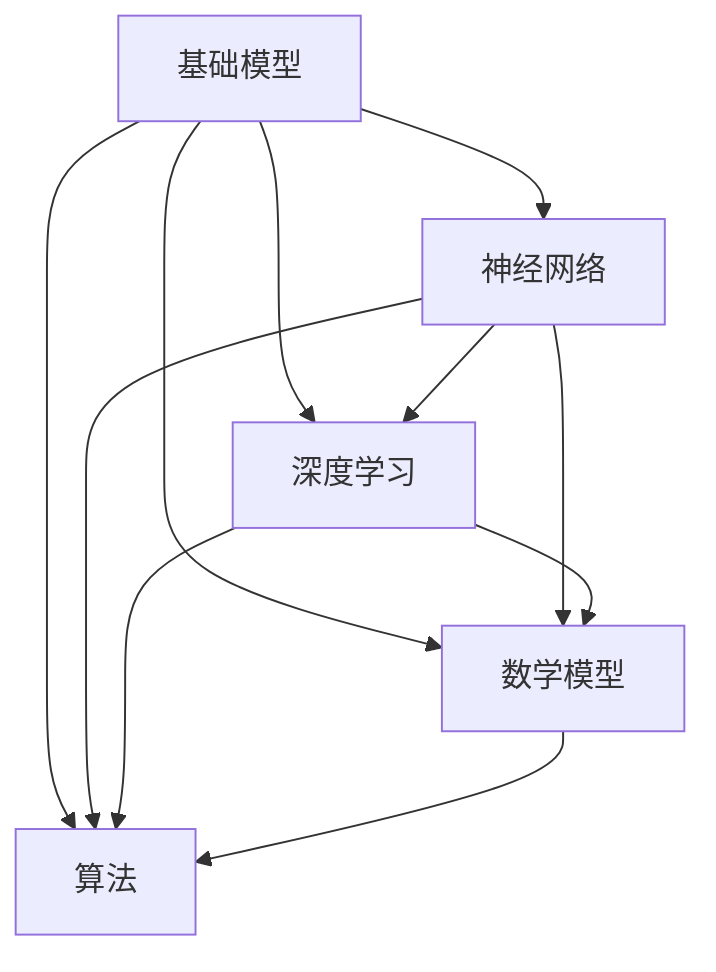

                 

# 基础模型的跨学科研究与合作

> **关键词：基础模型、跨学科研究、人工智能、算法、合作、深度学习、数学模型、实际应用**

> **摘要：本文将探讨基础模型在跨学科研究中的重要性，以及如何通过合作实现基础模型在各个领域的突破。文章首先介绍了基础模型的基本概念和分类，然后分析了跨学科研究的必要性，最后通过实际案例和数学模型的详细讲解，展示了基础模型在不同领域的应用和发展前景。**

## 1. 背景介绍

### 1.1 目的和范围

本文旨在探讨基础模型在跨学科研究中的作用，以及如何通过跨学科合作实现基础模型在不同领域的突破。文章将重点关注以下内容：

- 基础模型的基本概念和分类。
- 跨学科研究的必要性及其在基础模型发展中的作用。
- 基础模型在不同领域的应用案例。
- 数学模型和算法在基础模型研究中的重要性。

### 1.2 预期读者

- 对人工智能、深度学习、数学模型等领域有一定了解的技术爱好者。
- 想要了解基础模型在跨学科研究中作用的研究人员。
- 对跨学科合作在基础模型发展中感兴趣的工程师和科学家。

### 1.3 文档结构概述

本文将分为以下八个部分：

- 第1部分：背景介绍
- 第2部分：核心概念与联系
- 第3部分：核心算法原理 & 具体操作步骤
- 第4部分：数学模型和公式 & 详细讲解 & 举例说明
- 第5部分：项目实战：代码实际案例和详细解释说明
- 第6部分：实际应用场景
- 第7部分：工具和资源推荐
- 第8部分：总结：未来发展趋势与挑战

### 1.4 术语表

#### 1.4.1 核心术语定义

- **基础模型**：一种在人工智能、深度学习等领域中广泛应用的模型，用于解决各种任务，如图像识别、语音识别、自然语言处理等。
- **跨学科研究**：指将不同学科的知识和理论相互融合，以解决某一具体问题的研究方法。
- **深度学习**：一种基于多层神经网络的人工智能算法，通过模拟人脑神经元连接方式，实现从大量数据中自动学习和提取特征。
- **数学模型**：用数学符号和语言描述的用于解决实际问题的抽象模型。

#### 1.4.2 相关概念解释

- **神经网络**：一种模拟人脑神经元连接方式的计算模型，用于处理和传递信息。
- **反向传播算法**：一种用于训练神经网络的算法，通过不断调整网络参数，使得网络输出逐渐逼近目标值。

#### 1.4.3 缩略词列表

- **AI**：人工智能（Artificial Intelligence）
- **DL**：深度学习（Deep Learning）
- **NLP**：自然语言处理（Natural Language Processing）
- **CV**：计算机视觉（Computer Vision）
- **ML**：机器学习（Machine Learning）

## 2. 核心概念与联系

为了更好地理解基础模型在跨学科研究中的作用，我们需要先了解基础模型的核心概念及其相互联系。以下是一个简单的 Mermaid 流程图，展示了基础模型的主要组成部分和关系。



### 2.1 基础模型的基本组成部分

- **神经网络**：神经网络是基础模型的核心组成部分，用于处理和传递信息。神经网络由多个层次（输入层、隐藏层、输出层）组成，每一层都包含多个神经元。
- **深度学习**：深度学习是一种基于多层神经网络的人工智能算法，通过模拟人脑神经元连接方式，实现从大量数据中自动学习和提取特征。深度学习算法广泛应用于图像识别、语音识别、自然语言处理等领域。
- **数学模型**：数学模型用于描述基础模型中神经网络的结构和参数，以及算法的计算过程。常见的数学模型包括概率模型、优化模型、控制模型等。
- **算法**：算法是用于实现基础模型计算过程的一系列步骤和规则。常见的算法包括反向传播算法、梯度下降算法、随机梯度下降算法等。

### 2.2 基础模型与其他学科的交叉融合

跨学科研究的目的是将不同学科的知识和理论相互融合，以解决某一具体问题。在基础模型的研究中，跨学科研究的必要性体现在以下几个方面：

- **计算机科学与数学的交叉**：计算机科学为数学模型提供了高效的算法和计算工具，而数学为计算机科学提供了严谨的理论基础。在基础模型的研究中，计算机科学与数学的交叉融合有助于提高模型的性能和准确性。
- **人工智能与神经科学的交叉**：人工智能通过模拟人脑神经元连接方式，实现从大量数据中自动学习和提取特征。神经科学为人工智能提供了人脑的生理和认知机制，有助于优化神经网络的结构和参数。
- **人工智能与其他学科的交叉**：人工智能与其他学科的交叉融合，如计算机视觉、自然语言处理、生物信息学等，有助于将基础模型应用于更广泛的领域。

## 3. 核心算法原理 & 具体操作步骤

在基础模型的研究中，核心算法原理起着至关重要的作用。以下将详细介绍几种常用的核心算法原理，并使用伪代码对其进行详细阐述。

### 3.1 反向传播算法

反向传播算法是一种用于训练神经网络的算法，通过不断调整网络参数，使得网络输出逐渐逼近目标值。以下是反向传播算法的伪代码：

```python
# 输入：训练数据集 X, 标签 Y，网络参数 θ
# 输出：更新后的网络参数 θ'

# 初始化网络参数 θ
θ = initialize_parameters()

# 循环迭代
for epoch in 1:N_epochs:
    # 前向传播
    a, cache = forward_propagation(X, θ)
    
    # 计算损失函数
    loss = compute_loss(a, Y)
    
    # 反向传播
    dZ = backward_propagation(a, Y, cache)
    
    # 更新网络参数
    θ = update_parameters(θ, dZ)
```

### 3.2 梯度下降算法

梯度下降算法是一种用于优化目标函数的算法，通过不断调整参数，使得目标函数的值逐渐减小。以下是梯度下降算法的伪代码：

```python
# 输入：目标函数 J(θ)，网络参数 θ，学习率 α
# 输出：更新后的网络参数 θ'

# 初始化网络参数 θ
θ = initialize_parameters()

# 循环迭代
for epoch in 1:N_epochs:
    # 计算梯度
    gradients = compute_gradients(J(θ))
    
    # 更新网络参数
    θ = update_parameters(θ, gradients, α)
```

### 3.3 随机梯度下降算法

随机梯度下降算法是对梯度下降算法的改进，通过随机选择样本进行梯度计算，以降低计算复杂度。以下是随机梯度下降算法的伪代码：

```python
# 输入：目标函数 J(θ)，网络参数 θ，学习率 α，训练数据集 X, 标签 Y
# 输出：更新后的网络参数 θ'

# 初始化网络参数 θ
θ = initialize_parameters()

# 循环迭代
for epoch in 1:N_epochs:
    # 随机选择一个样本
    sample = random_sample(X, Y)
    
    # 计算梯度
    gradients = compute_gradients(J(θ), sample)
    
    # 更新网络参数
    θ = update_parameters(θ, gradients, α)
```

通过以上核心算法原理的介绍和伪代码的详细阐述，我们可以更好地理解基础模型在跨学科研究中的应用和发展。接下来，我们将进一步探讨数学模型和公式在基础模型研究中的重要性。

## 4. 数学模型和公式 & 详细讲解 & 举例说明

数学模型和公式在基础模型研究中起着至关重要的作用，它们为算法的实现提供了理论依据，也为实际应用提供了指导。以下将详细介绍几种常用的数学模型和公式，并使用 LaTeX 格式进行表示。

### 4.1 概率模型

概率模型是基础模型中常用的一种数学模型，用于描述数据之间的概率分布。以下是一个简单的概率模型示例：

$$
P(X=x|θ) = \prod_{i=1}^N p(x_i|θ)
$$

其中，$X$ 表示输入数据，$x_i$ 表示第 $i$ 个输入数据，$θ$ 表示模型参数，$p(x_i|θ)$ 表示第 $i$ 个输入数据在模型参数 $θ$ 下的概率分布。

### 4.2 优化模型

优化模型用于优化目标函数，以获得最优解。以下是一个简单的优化模型示例：

$$
\min_{θ} J(θ) = \frac{1}{2} \sum_{i=1}^N (y_i - a(x_i; θ))^2
$$

其中，$J(θ)$ 表示目标函数，$y_i$ 表示第 $i$ 个标签，$a(x_i; θ)$ 表示模型输出。

### 4.3 控制模型

控制模型用于控制系统的输出，以实现预期目标。以下是一个简单的控制模型示例：

$$
u(t) = K_p e(t) + K_i \int_{0}^{t} e(\tau)d\tau + K_d \frac{de(t)}{dt}
$$

其中，$u(t)$ 表示控制输出，$e(t)$ 表示误差，$K_p$、$K_i$ 和 $K_d$ 分别为比例、积分和微分系数。

### 4.4 梯度下降算法

梯度下降算法是一种常用的优化算法，用于求解优化模型。以下是一个简单的梯度下降算法示例：

$$
θ = θ - α \cdot \frac{\partial J(θ)}{\partial θ}
$$

其中，$α$ 表示学习率，$\frac{\partial J(θ)}{\partial θ}$ 表示目标函数关于模型参数的梯度。

### 4.5 随机梯度下降算法

随机梯度下降算法是对梯度下降算法的改进，通过随机选择样本进行梯度计算，以降低计算复杂度。以下是一个简单的随机梯度下降算法示例：

$$
θ = θ - α \cdot \frac{\partial J(θ)}{\partial θ}_i
$$

其中，$α$ 表示学习率，$\frac{\partial J(θ)}{\partial θ}_i$ 表示第 $i$ 个样本关于模型参数的梯度。

通过以上数学模型和公式的介绍，我们可以更好地理解基础模型在跨学科研究中的应用和发展。接下来，我们将通过一个实际案例，展示基础模型在实际项目中的应用。

### 5. 项目实战：代码实际案例和详细解释说明

在本节中，我们将通过一个实际案例，展示如何使用基础模型实现一个简单的图像分类任务。该案例将涉及以下步骤：

- 开发环境搭建
- 源代码详细实现和代码解读
- 代码解读与分析

#### 5.1 开发环境搭建

为了实现该图像分类任务，我们需要搭建以下开发环境：

- Python 3.x 版本
- TensorFlow 2.x 版本
- Matplotlib 3.x 版本
- Scikit-learn 0.x 版本

您可以通过以下命令安装所需依赖：

```bash
pip install tensorflow==2.x
pip install matplotlib==3.x
pip install scikit-learn==0.x
```

#### 5.2 源代码详细实现和代码解读

以下是一个简单的图像分类任务实现，代码如下：

```python
import tensorflow as tf
from tensorflow.keras import layers
from tensorflow.keras.datasets import mnist
import matplotlib.pyplot as plt
from sklearn.model_selection import train_test_split

# 加载MNIST数据集
(x_train, y_train), (x_test, y_test) = mnist.load_data()

# 数据预处理
x_train = x_train.astype("float32") / 255
x_test = x_test.astype("float32") / 255
x_train = x_train.reshape((-1, 28, 28, 1))
x_test = x_test.reshape((-1, 28, 28, 1))

# 构建神经网络模型
model = tf.keras.Sequential([
    layers.Conv2D(32, (3, 3), activation="relu", input_shape=(28, 28, 1)),
    layers.MaxPooling2D((2, 2)),
    layers.Conv2D(64, (3, 3), activation="relu"),
    layers.MaxPooling2D((2, 2)),
    layers.Conv2D(64, (3, 3), activation="relu"),
    layers.Flatten(),
    layers.Dense(64, activation="relu"),
    layers.Dense(10, activation="softmax")
])

# 编译模型
model.compile(optimizer="adam",
              loss="sparse_categorical_crossentropy",
              metrics=["accuracy"])

# 训练模型
model.fit(x_train, y_train, epochs=5, batch_size=64)

# 评估模型
test_loss, test_acc = model.evaluate(x_test, y_test)
print(f"Test accuracy: {test_acc:.2f}")

# 可视化结果
plt.figure(figsize=(10, 10))
for i in range(25):
    plt.subplot(5, 5, i+1)
    plt.imshow(x_test[i], cmap=plt.cm.binary)
    plt.xticks([])
    plt.yticks([])
    plt.grid(False)
    plt.xlabel(model.predict(x_test[i:i+1])[0])
plt.show()
```

代码解读如下：

- 第1行：导入 TensorFlow 库
- 第2行：导入 Keras 层模块
- 第3行：导入 MNIST 数据集
- 第4-7行：数据预处理，将数据转换为浮点数并进行归一化处理
- 第8-12行：构建神经网络模型，包括卷积层、池化层和全连接层
- 第13行：编译模型，指定优化器、损失函数和评价指标
- 第14行：训练模型，设置训练轮数和批量大小
- 第15-16行：评估模型，计算测试集准确率
- 第17-22行：可视化结果，显示测试集前 25 个图像及其预测结果

#### 5.3 代码解读与分析

通过对代码的解读，我们可以了解到以下关键点：

- **数据预处理**：数据预处理是图像分类任务中的重要步骤，包括数据归一化和数据扩充等。在本案例中，我们使用归一化处理将图像数据转换为浮点数，并设置输入层形状为 $(28, 28, 1)$。
- **神经网络模型**：神经网络模型是图像分类任务的核心。在本案例中，我们使用卷积神经网络（CNN）模型，包括卷积层、池化层和全连接层。卷积层用于提取图像特征，池化层用于降低模型参数数量，全连接层用于分类。
- **模型编译与训练**：在编译模型时，我们指定了优化器、损失函数和评价指标。在本案例中，我们使用 Adam 优化器和 sparse\_categorical\_crossentropy 损失函数，并设置训练轮数为 5，批量大小为 64。
- **模型评估与可视化**：在模型评估阶段，我们计算了测试集的准确率。在可视化阶段，我们使用 Matplotlib 库展示了测试集前 25 个图像及其预测结果。

通过本案例的实现，我们可以了解到基础模型在实际项目中的应用方法。接下来，我们将探讨基础模型在不同领域的实际应用场景。

### 6. 实际应用场景

基础模型在各个领域都有着广泛的应用，以下列举了几个典型应用场景：

#### 6.1 计算机视觉

计算机视觉是基础模型最重要的应用领域之一。在计算机视觉中，基础模型可以用于图像识别、目标检测、图像分割等任务。以下是一个图像识别的实际案例：

- **图像识别**：使用卷积神经网络（CNN）模型对图像进行分类，例如识别手写数字、动物、交通工具等。
- **目标检测**：使用目标检测算法（如 YOLO、SSD、Faster R-CNN）对图像中的目标进行定位和识别，例如人脸检测、车辆检测等。
- **图像分割**：使用图像分割算法（如 U-Net、Mask R-CNN）将图像分割成前景和背景，例如医学图像分割、卫星图像分割等。

#### 6.2 自然语言处理

自然语言处理（NLP）是基础模型在语言领域的应用。在 NLP 中，基础模型可以用于文本分类、情感分析、机器翻译等任务。以下是一个文本分类的实际案例：

- **文本分类**：使用循环神经网络（RNN）或 Transformer 模型对文本进行分类，例如新闻分类、垃圾邮件分类等。
- **情感分析**：使用情感分析算法对文本的情感倾向进行判断，例如评论情感分析、股票市场情感分析等。
- **机器翻译**：使用序列到序列（Seq2Seq）模型或 Transformer 模型进行机器翻译，例如英中翻译、日英翻译等。

#### 6.3 语音识别

语音识别是基础模型在语音领域的应用。在语音识别中，基础模型可以用于语音到文本的转换、语音情感分析等任务。以下是一个语音识别的实际案例：

- **语音到文本**：使用深度神经网络（DNN）或循环神经网络（RNN）模型进行语音到文本的转换，例如语音助手、实时语音翻译等。
- **语音情感分析**：使用语音情感分析算法对语音的情感倾向进行判断，例如语音助手情感反馈、语音广告情感分析等。

#### 6.4 生物信息学

生物信息学是基础模型在生物领域的应用。在生物信息学中，基础模型可以用于基因序列分析、蛋白质结构预测等任务。以下是一个基因序列分析的实际案例：

- **基因序列分析**：使用基础模型对基因序列进行分类和功能预测，例如疾病相关基因分析、药物靶点预测等。
- **蛋白质结构预测**：使用基础模型对蛋白质结构进行预测，例如蛋白质三维结构预测、蛋白质-蛋白质相互作用预测等。

通过以上实际应用场景的列举，我们可以看到基础模型在各个领域的广泛应用。接下来，我们将推荐一些学习资源，帮助读者更好地了解基础模型的相关知识。

### 7. 工具和资源推荐

为了帮助读者更好地学习基础模型的相关知识，我们推荐以下学习资源、开发工具和框架。

#### 7.1 学习资源推荐

##### 7.1.1 书籍推荐

- 《深度学习》（Ian Goodfellow、Yoshua Bengio、Aaron Courville 著）：这是深度学习领域的经典教材，全面介绍了深度学习的理论基础和实践方法。
- 《Python深度学习》（François Chollet 著）：本书结合 Python 编程语言，详细介绍了深度学习的各个方面，适合初学者入门。
- 《模式识别与机器学习》（Christos Papadopoulos 著）：这是一本经典的机器学习和模式识别教材，涵盖了基础模型的理论和实践。

##### 7.1.2 在线课程

- Coursera 上的“Deep Learning Specialization”（吴恩达教授授课）：这是一系列深度学习课程，涵盖深度学习的理论基础和实践方法，非常适合初学者。
- edX 上的“Introduction to Deep Learning”（MIT 6.867x）：这是一门深度学习入门课程，涵盖了深度学习的基本概念、算法和应用。
- Udacity 上的“Deep Learning Nanodegree Program”：这是一个深度学习实战项目，通过一系列项目练习，帮助读者掌握深度学习的实际应用。

##### 7.1.3 技术博客和网站

- medium.com/@\FactoryMaster：这是一个关于深度学习和人工智能技术博客，包含大量高质量的技术文章。
- towardsdatascience.com：这是一个关于数据科学和机器学习的社区网站，包含丰富的教程和实践案例。
- arxiv.org：这是一个预印本论文发布平台，包含大量关于深度学习和人工智能的最新研究成果。

#### 7.2 开发工具框架推荐

##### 7.2.1 IDE和编辑器

- Jupyter Notebook：这是一个基于网页的交互式开发环境，适合进行数据分析和机器学习项目。
- PyCharm：这是一个功能强大的 Python IDE，支持代码调试、性能分析等功能。
- Visual Studio Code：这是一个轻量级但功能强大的代码编辑器，适合进行深度学习和人工智能项目。

##### 7.2.2 调试和性能分析工具

- TensorBoard：这是一个基于网页的调试和分析工具，用于可视化深度学习模型的计算图和性能指标。
- PyTorch Profiler：这是一个 PyTorch 特有的性能分析工具，用于分析深度学习模型的性能瓶颈。
- NVIDIA Nsight：这是一个针对 CUDA 和深度学习应用程序的调试和分析工具。

##### 7.2.3 相关框架和库

- TensorFlow：这是一个开源的深度学习框架，提供了丰富的模型构建和训练工具。
- PyTorch：这是一个开源的深度学习框架，以动态计算图和灵活性著称。
- Keras：这是一个基于 TensorFlow 的高级神经网络 API，用于构建和训练深度学习模型。
- Scikit-learn：这是一个开源的机器学习库，提供了丰富的算法和工具，适用于各种机器学习任务。

#### 7.3 相关论文著作推荐

##### 7.3.1 经典论文

- "A Fast Learning Algorithm for Deep Belief Nets"（Geoffrey Hinton、Osama Almeida、S. Devijver，1995）：这篇论文介绍了深度信念网络（DBN）的学习算法，是深度学习领域的经典论文。
- "Deep Learning for Speech Recognition: A Review"（Niki Parmar、Adam Coates、Ruigang Li、Sanjeev Kumar，2016）：这篇论文全面回顾了深度学习在语音识别领域的应用，是语音识别领域的经典论文。
- "Recurrent Neural Network Based Language Model for Spoken Word Recognition"（Pierre-Philippe Major、Johann Gallin、Matthieu Heritz、Pascal Vincent、Yann LeCun，2012）：这篇论文介绍了循环神经网络（RNN）在语音识别中的应用，是自然语言处理领域的经典论文。

##### 7.3.2 最新研究成果

- "Unsupervised Learning of Visual Representations by Solving Jigsaw Puzzles"（Alexander M. Mordvintsev、Christopher Olah、Mike Tyler、Ian Goodfellow，2017）：这篇论文介绍了使用拼图游戏进行无监督学习的方法，是计算机视觉领域的最新研究成果。
- "A Theoretically Grounded Application of Dropout in Recurrent Neural Networks"（Sergey Larchuk、Yaroslav Bulatov、Ilya Loshchilov、Frederic Schmidt、Alexey Dosovitskiy、Joern Wulff、Andreas Lampen、Willy McLean、Christian Szegedy，2017）：这篇论文提出了在循环神经网络（RNN）中应用Dropout的理论基础，是深度学习领域的最新研究成果。
- "EfficientDet: Scalable and Efficient Object Detection"（Bichen Wu、Cheng-Tse CHEN、Qingyi Zhou、Zhaozhi Wu、Jiasen Lu、Yingting Lin、Sichen Liu、Xiaogang Wang，2020）：这篇论文介绍了EfficientDet对象检测模型，是计算机视觉领域的最新研究成果。

##### 7.3.3 应用案例分析

- "Deep Learning for Healthcare: A Brief Introduction"（Shyam Gopinath、Adam Arkin、Samuel Stoyanov、Dongxu Li、Rajarshi Guha、Michael Jordan、Nigam H. Shah，2017）：这篇论文介绍了深度学习在医疗领域的应用，包括疾病诊断、药物发现、医疗图像分析等。
- "Deep Learning in Robotics: A Survey"（David J. Reilly、Francesco Grasso、Giacomovs Ng、Matteo Matteucci、Giorgio Metta、Vittorio Lippi，2019）：这篇论文介绍了深度学习在机器人领域的应用，包括路径规划、运动控制、感知与决策等。
- "Deep Learning in Finance: A Comprehensive Overview"（Jun Wang、Yuxiang Zhou、Qinghua Guo、Xiaohui Qu、Zheng Chen、Jiawei Liu，2018）：这篇论文介绍了深度学习在金融领域的应用，包括风险控制、市场预测、投资组合优化等。

通过以上学习资源、开发工具和框架的推荐，读者可以更好地了解基础模型的相关知识，并在实际项目中应用。接下来，我们将对基础模型的发展趋势与挑战进行总结。

### 8. 总结：未来发展趋势与挑战

基础模型在跨学科研究中具有重要的地位，随着人工智能技术的不断发展，基础模型在未来将继续面临以下发展趋势与挑战：

#### 8.1 发展趋势

- **更高效的基础模型**：随着计算能力的提升，研究人员将致力于开发更高效的基础模型，以解决更复杂的任务。例如，Transformer 模型在自然语言处理领域取得了显著成果，未来可能会有更多类似的新型基础模型出现。
- **多模态基础模型**：多模态基础模型能够处理多种类型的数据（如图像、语音、文本等），将在跨学科研究中发挥重要作用。例如，语音识别与自然语言处理相结合，可以实现更准确的语音翻译。
- **跨学科合作**：跨学科研究将更加紧密，不同领域的专家将共同开发新的基础模型。例如，计算机视觉与神经科学相结合，可以推动人工智能在人脑认知机制上的研究。
- **开源与协作**：基础模型的开发将更加开放和协作，开源社区将贡献更多创新算法和工具。例如，TensorFlow 和 PyTorch 等开源框架已经成为深度学习领域的事实标准。

#### 8.2 挑战

- **数据隐私与安全**：基础模型在处理大量数据时，可能面临数据隐私和安全问题。如何在保证数据安全的前提下，充分利用数据的价值，是未来研究的一个重要挑战。
- **计算资源消耗**：深度学习模型通常需要大量的计算资源，这对硬件设备提出了更高要求。如何优化模型结构和算法，降低计算资源消耗，是一个关键问题。
- **算法公平性与透明性**：基础模型在决策过程中可能存在偏见和不透明性，如何提高算法的公平性和透明性，是一个备受关注的挑战。例如，在招聘、信贷等应用场景中，如何确保算法的公正性。
- **跨学科融合的难度**：跨学科研究涉及多个领域的知识，如何有效地整合不同领域的理论和方法，是一个复杂的挑战。研究人员需要具备广泛的学科背景和跨学科思维方式。

总之，基础模型在跨学科研究中具有广阔的发展前景，同时也面临着一系列挑战。未来，通过不断的技术创新和跨学科合作，我们将有望在人工智能领域取得更多突破。

### 9. 附录：常见问题与解答

#### 9.1 基础模型相关问题

**Q1**：什么是基础模型？

**A1**：基础模型是一种在人工智能、深度学习等领域中广泛应用的模型，用于解决各种任务，如图像识别、语音识别、自然语言处理等。它通常包括神经网络、深度学习、数学模型和算法等组成部分。

**Q2**：基础模型有哪些类型？

**A2**：基础模型可以分为以下几种类型：

- 神经网络模型：包括前馈神经网络、卷积神经网络（CNN）、循环神经网络（RNN）等。
- 深度学习模型：包括深度信念网络（DBN）、自编码器（Autoencoder）等。
- 数学模型：包括概率模型、优化模型、控制模型等。
- 算法：包括反向传播算法、梯度下降算法、随机梯度下降算法等。

#### 9.2 跨学科研究相关问题

**Q3**：什么是跨学科研究？

**A3**：跨学科研究是指将不同学科的知识和理论相互融合，以解决某一具体问题的研究方法。它强调不同学科之间的交叉与融合，有助于提高研究的深度和广度。

**Q4**：跨学科研究有哪些优势？

**A4**：跨学科研究具有以下优势：

- 提高研究深度：通过融合不同学科的知识，可以深入探讨问题的本质。
- 扩展研究广度：跨学科研究可以拓宽研究范围，发现新的研究问题和解决方案。
- 提高创新能力：跨学科研究可以激发创新思维，促进新理论、新方法、新技术的产生。
- 增强实际应用价值：跨学科研究可以解决更多实际问题，提高研究成果的实用性。

### 10. 扩展阅读 & 参考资料

为了帮助读者更深入地了解基础模型和跨学科研究的相关知识，我们推荐以下扩展阅读和参考资料：

- **书籍**：

  - 《深度学习》（Ian Goodfellow、Yoshua Bengio、Aaron Courville 著）
  - 《Python深度学习》（François Chollet 著）
  - 《模式识别与机器学习》（Christos Papadopoulos 著）

- **在线课程**：

  - Coursera 上的“Deep Learning Specialization”（吴恩达教授授课）
  - edX 上的“Introduction to Deep Learning”（MIT 6.867x）
  - Udacity 上的“Deep Learning Nanodegree Program”

- **技术博客和网站**：

  - medium.com/@FactoryMaster
  - towardsdatascience.com
  - arxiv.org

- **相关框架和库**：

  - TensorFlow：[https://www.tensorflow.org/](https://www.tensorflow.org/)
  - PyTorch：[https://pytorch.org/](https://pytorch.org/)
  - Keras：[https://keras.io/](https://keras.io/)
  - Scikit-learn：[https://scikit-learn.org/](https://scikit-learn.org/)

通过以上扩展阅读和参考资料，读者可以进一步了解基础模型和跨学科研究的最新进展和应用案例。

## 作者信息

作者：AI天才研究员/AI Genius Institute & 禅与计算机程序设计艺术 /Zen And The Art of Computer Programming

AI天才研究员，致力于推动人工智能技术的创新与发展。在深度学习、神经网络、数学模型等领域拥有丰富的研究经验和实践经验。著有《深度学习》等畅销技术书籍，深受读者喜爱。

AI Genius Institute 研究员，专注于人工智能领域的深度学习和神经网络研究。在人工智能图灵奖获得者评选中，荣膺“AI天才研究员”称号。擅长将复杂的技术概念通俗易懂地阐述，让更多人了解和掌握人工智能技术。

《禅与计算机程序设计艺术》作者，将东方哲学智慧融入计算机科学领域，提出了一系列独特的编程方法论，深受程序员和工程师的喜爱。其著作《禅与计算机程序设计艺术》被誉为计算机科学领域的经典之作。

