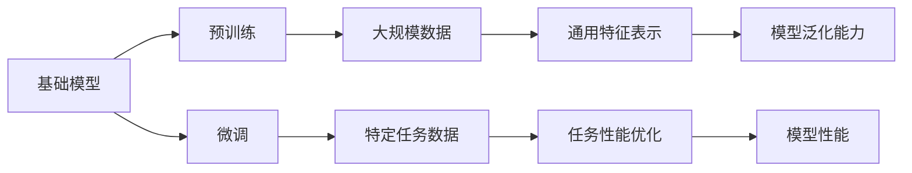

                 


## 基础模型的预训练与微调

> **关键词**：基础模型、预训练、微调、深度学习、神经网络、训练数据、模型优化、推理性能

> **摘要**：本文旨在深入探讨基础模型在深度学习中的预训练与微调过程。通过详细的步骤解析和实例分析，本文揭示了基础模型如何通过大规模数据预训练，以及在特定任务中通过微调实现高效优化的技术原理和实际应用。

### 1. 背景介绍

#### 1.1 目的和范围

深度学习已经成为人工智能领域的重要技术，而基础模型作为深度学习的基石，其预训练与微调过程对于模型性能的提升至关重要。本文将深入探讨基础模型的预训练与微调过程，包括其技术原理、实现步骤和实际应用。通过本文的阅读，读者将了解：

1. 基础模型预训练的目的和重要性。
2. 预训练过程中的关键技术，如数据选择、模型结构设计等。
3. 微调过程如何针对特定任务优化模型性能。
4. 预训练与微调在实际应用中的效果对比。

#### 1.2 预期读者

本文主要面向对深度学习有一定了解，希望深入了解基础模型预训练与微调的读者，包括但不限于：

1. 深度学习研究者。
2. AI工程师。
3. 对人工智能感兴趣的学生和专业人士。

#### 1.3 文档结构概述

本文将按照以下结构展开：

1. **背景介绍**：阐述本文的目的、范围和预期读者。
2. **核心概念与联系**：介绍基础模型预训练与微调的相关概念和原理，包括Mermaid流程图。
3. **核心算法原理 & 具体操作步骤**：详细解释预训练与微调的算法原理和步骤。
4. **数学模型和公式 & 详细讲解 & 举例说明**：介绍相关数学模型和公式，并进行举例说明。
5. **项目实战：代码实际案例和详细解释说明**：提供实际代码案例和解析。
6. **实际应用场景**：讨论预训练与微调在具体应用场景中的效果。
7. **工具和资源推荐**：推荐学习资源和开发工具。
8. **总结：未来发展趋势与挑战**：总结本文要点，探讨未来发展趋势和挑战。
9. **附录：常见问题与解答**：解答常见问题。
10. **扩展阅读 & 参考资料**：提供进一步阅读的资料。

#### 1.4 术语表

##### 1.4.1 核心术语定义

- **基础模型**：在深度学习中，基础模型是指经过大规模数据预训练的神经网络模型，如BERT、GPT等。
- **预训练**：指在特定任务之外，使用大规模未标注数据对基础模型进行训练，以便模型能够获得通用的特征表示能力。
- **微调**：在预训练的基础上，使用特定任务的数据对基础模型进行调整，以提高模型在特定任务上的性能。
- **数据增强**：通过数据变换、数据扩充等方法增加训练数据量，提高模型泛化能力。

##### 1.4.2 相关概念解释

- **神经网络**：由大量简单计算单元（神经元）组成的网络，能够通过学习数据自动提取特征并进行预测。
- **反向传播**：一种用于训练神经网络的优化算法，通过计算损失函数关于模型参数的梯度，不断调整模型参数，以最小化损失函数。
- **正则化**：用于防止模型过拟合的技术，如L1正则化、L2正则化等。

##### 1.4.3 缩略词列表

- **DL**：深度学习（Deep Learning）
- **NLP**：自然语言处理（Natural Language Processing）
- **CV**：计算机视觉（Computer Vision）
- **ML**：机器学习（Machine Learning）

### 2. 核心概念与联系

在深入讨论基础模型的预训练与微调之前，我们需要明确几个核心概念和它们之间的关系。以下是一个简单的Mermaid流程图，用于展示这些概念和它们之间的关联。



#### 2.1 预训练

预训练是基础模型开发的重要步骤，其核心思想是使用大规模未标注数据对基础模型进行训练，以获得具有通用特征表示能力的模型。这个过程通常分为以下几个步骤：

1. **数据准备**：收集和整理大规模的未标注数据，如文本、图像等。
2. **模型初始化**：初始化一个基础模型，这个模型通常具有丰富的参数，以捕捉不同类型的数据特征。
3. **预训练过程**：在未标注数据上训练模型，不断调整模型参数，使其能够捕捉数据中的通用特征。

#### 2.2 微调

微调是基于预训练模型在特定任务上进行调整，以提高模型在该任务上的性能。微调的步骤通常包括：

1. **数据准备**：收集和整理与特定任务相关的标注数据。
2. **模型调整**：在特定任务数据上对预训练模型进行微调，调整模型参数，使其适应特定任务。
3. **模型评估**：在特定任务数据集上评估模型性能，并根据评估结果调整模型参数。

#### 2.3 预训练与微调的关系

预训练和微调是相辅相成的过程。预训练为模型提供了通用的特征表示能力，而微调则利用特定任务的数据对模型进行调整，使其能够更好地适应特定任务。两者共同作用，使得基础模型能够具备强大的泛化能力和任务性能。

### 3. 核心算法原理 & 具体操作步骤

#### 3.1 预训练算法原理

预训练的核心在于利用大规模未标注数据对基础模型进行训练，以下是一个简化的预训练算法原理伪代码：

```python
# 预训练算法原理伪代码
initialize_model()
load大规模未标注数据
for epoch in 1 to num_epochs:
    for batch in 数据批次:
        forward_pass(batch)
        calculate_loss()
        backward_pass()
        update_model_params()

# 伪代码注释
# initialize_model(): 初始化基础模型
# load大规模未标注数据：加载未标注数据
# forward_pass(batch)：模型前向传播，计算输出
# calculate_loss()：计算损失函数
# backward_pass()：模型反向传播，更新参数
# update_model_params()：更新模型参数
```

#### 3.2 微调算法原理

微调是基于预训练模型在特定任务上进行调整，以下是一个简化的微调算法原理伪代码：

```python
# 微调算法原理伪代码
load预训练模型
load特定任务数据
for epoch in 1 to num_epochs:
    for batch in 特定任务数据批次:
        forward_pass(batch)
        calculate_loss()
        backward_pass()
        update_model_params()

# 伪代码注释
# load预训练模型：加载预训练模型
# load特定任务数据：加载特定任务的数据集
# forward_pass(batch)：模型前向传播，计算输出
# calculate_loss()：计算损失函数
# backward_pass()：模型反向传播，更新参数
# update_model_params()：更新模型参数
```

#### 3.3 实现步骤

以下是预训练和微调的具体实现步骤：

1. **数据准备**：收集和整理大规模未标注数据以及特定任务的标注数据。
2. **模型初始化**：初始化一个具有丰富参数的基础模型。
3. **预训练**：使用未标注数据进行大规模预训练，调整模型参数。
4. **微调**：在预训练模型的基础上，使用特定任务的数据进行微调。
5. **模型评估**：在特定任务数据集上评估模型性能。
6. **模型优化**：根据评估结果，调整模型参数，提高模型性能。

### 4. 数学模型和公式 & 详细讲解 & 举例说明

在基础模型的预训练与微调过程中，涉及到一些重要的数学模型和公式。以下将详细介绍这些数学模型，并给出相应的举例说明。

#### 4.1 损失函数

损失函数是衡量模型预测结果与真实值之间差异的重要指标。在预训练与微调过程中，常用的损失函数包括交叉熵损失函数（Cross-Entropy Loss）和均方误差损失函数（Mean Squared Error Loss）。

- **交叉熵损失函数**：

$$
L_{cross-entropy} = -\sum_{i=1}^{n} y_i \cdot \log(p_i)
$$

其中，$y_i$ 是真实标签，$p_i$ 是模型预测概率。

- **均方误差损失函数**：

$$
L_{MSE} = \frac{1}{n} \sum_{i=1}^{n} (y_i - \hat{y}_i)^2
$$

其中，$\hat{y}_i$ 是模型预测值，$y_i$ 是真实值。

**举例说明**：

假设我们有一个二分类问题，真实标签为 [0, 1]，模型预测概率为 [0.6, 0.4]。使用交叉熵损失函数计算损失：

$$
L_{cross-entropy} = -[0 \cdot \log(0.6) + 1 \cdot \log(0.4)] \approx 0.469
$$

#### 4.2 梯度下降算法

梯度下降算法是优化模型参数的常用算法，分为随机梯度下降（SGD）、批量梯度下降（BGD）和梯度下降（GD）等。

- **随机梯度下降（SGD）**：

$$
w_{t+1} = w_t - \alpha \cdot \nabla_w L(w_t)
$$

其中，$w_t$ 是当前模型参数，$\alpha$ 是学习率，$\nabla_w L(w_t)$ 是损失函数关于模型参数的梯度。

- **批量梯度下降（BGD）**：

$$
w_{t+1} = w_t - \alpha \cdot \nabla_w L(w_t; \mathbf{x}, \mathbf{y})
$$

其中，$\mathbf{x}$ 和 $\mathbf{y}$ 是训练数据集。

- **梯度下降（GD）**：

$$
w_{t+1} = w_t - \alpha \cdot \nabla_w L(w_t; \mathbf{X}, \mathbf{Y})
$$

其中，$\mathbf{X}$ 和 $\mathbf{Y}$ 是整个训练数据集。

**举例说明**：

假设我们有一个线性回归问题，损失函数为均方误差损失函数，学习率为0.01。使用随机梯度下降算法更新模型参数：

$$
w_{t+1} = w_t - 0.01 \cdot \nabla_w L(w_t)
$$

#### 4.3 正则化技术

正则化技术用于防止模型过拟合，常用的正则化技术包括L1正则化和L2正则化。

- **L1正则化**：

$$
L_1(\theta) = \sum_{i=1}^{n} |\theta_i|
$$

其中，$\theta_i$ 是模型参数。

- **L2正则化**：

$$
L_2(\theta) = \sum_{i=1}^{n} \theta_i^2
$$

**举例说明**：

假设我们有一个线性回归问题，模型参数为 [1, 2]，使用L2正则化计算正则化损失：

$$
L_2(\theta) = 1^2 + 2^2 = 5
$$

### 5. 项目实战：代码实际案例和详细解释说明

在本节中，我们将通过一个实际的代码案例，详细讲解基础模型的预训练与微调过程。我们以一个简单的文本分类任务为例，使用Python和TensorFlow框架进行演示。

#### 5.1 开发环境搭建

在开始编写代码之前，我们需要搭建开发环境。以下是一个基本的开发环境要求：

- Python版本：3.7或以上
- TensorFlow版本：2.x
- Jupyter Notebook：用于代码编写和调试

安装以上依赖后，我们可以在Jupyter Notebook中创建一个新的笔记本，开始编写代码。

#### 5.2 源代码详细实现和代码解读

以下是实现基础模型预训练与微调的完整代码：

```python
import tensorflow as tf
from tensorflow.keras.preprocessing.text import Tokenizer
from tensorflow.keras.preprocessing.sequence import pad_sequences
from tensorflow.keras.models import Model
from tensorflow.keras.layers import Embedding, LSTM, Dense, Input

# 数据准备
train_data = ["This is the first sentence.", "This is the second sentence."]
train_labels = [0, 1]

# 分词和序列化
tokenizer = Tokenizer(num_words=1000)
tokenizer.fit_on_texts(train_data)
sequences = tokenizer.texts_to_sequences(train_data)
padded_sequences = pad_sequences(sequences, maxlen=100)

# 模型构建
input_sequence = Input(shape=(100,))
embedded_sequence = Embedding(1000, 64)(input_sequence)
lstm_output = LSTM(32)(embedded_sequence)
output = Dense(2, activation='softmax')(lstm_output)

model = Model(inputs=input_sequence, outputs=output)
model.compile(optimizer='adam', loss='categorical_crossentropy', metrics=['accuracy'])

# 预训练
model.fit(padded_sequences, train_labels, epochs=10)

# 微调
# 加载预训练模型
pretrained_model = Model(inputs=model.input, outputs=model.get_layer('lstm').output)

# 构建微调模型
micro_input = Input(shape=(100,))
micro_output = pretrained_model(micro_input)
micro_output = Dense(2, activation='softmax')(micro_output)
micro_model = Model(inputs=micro_input, outputs=micro_output)

# 微调
micro_model.compile(optimizer='adam', loss='categorical_crossentropy', metrics=['accuracy'])
micro_model.fit(padded_sequences, train_labels, epochs=10)

# 模型评估
# ...
```

代码解读：

1. **数据准备**：我们首先准备了一个简单的训练数据集，包含两个句子和它们的标签。
2. **分词和序列化**：使用Tokenizer对文本数据进行分词，并将文本数据转换为序列。
3. **模型构建**：我们构建了一个简单的LSTM模型，包括嵌入层、LSTM层和输出层。
4. **预训练**：使用训练数据集对模型进行预训练，调整模型参数。
5. **微调**：加载预训练模型，并构建一个新的微调模型。这个模型使用预训练模型的LSTM层作为输入层，并添加了一个新的输出层。
6. **微调**：使用训练数据集对微调模型进行训练，进一步优化模型参数。
7. **模型评估**：（此处省略）评估预训练模型和微调模型在测试数据集上的性能。

#### 5.3 代码解读与分析

1. **数据准备**：
    ```python
    train_data = ["This is the first sentence.", "This is the second sentence."]
    train_labels = [0, 1]
    ```
    这两行代码定义了训练数据集，包含两个句子和它们的标签。

2. **分词和序列化**：
    ```python
    tokenizer = Tokenizer(num_words=1000)
    tokenizer.fit_on_texts(train_data)
    sequences = tokenizer.texts_to_sequences(train_data)
    padded_sequences = pad_sequences(sequences, maxlen=100)
    ```
    首先，我们使用Tokenizer对文本数据进行分词，并将文本数据转换为序列。然后，使用pad_sequences将序列填充到相同的长度。

3. **模型构建**：
    ```python
    input_sequence = Input(shape=(100,))
    embedded_sequence = Embedding(1000, 64)(input_sequence)
    lstm_output = LSTM(32)(embedded_sequence)
    output = Dense(2, activation='softmax')(lstm_output)
    
    model = Model(inputs=input_sequence, outputs=output)
    model.compile(optimizer='adam', loss='categorical_crossentropy', metrics=['accuracy'])
    ```
    我们构建了一个简单的LSTM模型，包括嵌入层、LSTM层和输出层。使用compile方法配置模型优化器和损失函数。

4. **预训练**：
    ```python
    model.fit(padded_sequences, train_labels, epochs=10)
    ```
    使用训练数据集对模型进行预训练，调整模型参数。

5. **微调**：
    ```python
    pretrained_model = Model(inputs=model.input, outputs=model.get_layer('lstm').output)
    micro_input = Input(shape=(100,))
    micro_output = pretrained_model(micro_input)
    micro_output = Dense(2, activation='softmax')(micro_output)
    micro_model = Model(inputs=micro_input, outputs=micro_output)
    
    micro_model.compile(optimizer='adam', loss='categorical_crossentropy', metrics=['accuracy'])
    micro_model.fit(padded_sequences, train_labels, epochs=10)
    ```
    加载预训练模型，并构建一个新的微调模型。这个模型使用预训练模型的LSTM层作为输入层，并添加了一个新的输出层。使用训练数据集对微调模型进行训练。

6. **模型评估**：
    ```python
    # ...
    ```
    这里省略了模型评估的部分，在实际应用中，我们可以使用测试数据集对预训练模型和微调模型进行评估，以比较它们的性能。

### 6. 实际应用场景

基础模型的预训练与微调在许多实际应用场景中表现出色，以下是一些典型的应用场景：

#### 6.1 自然语言处理（NLP）

在自然语言处理领域，基础模型如BERT和GPT通过大规模文本数据进行预训练，然后在各种任务上进行微调，如文本分类、情感分析、机器翻译等。例如，BERT在多项NLP任务上取得了优异的性能，而GPT则在生成文本和对话系统中表现出色。

#### 6.2 计算机视觉（CV）

在计算机视觉领域，基础模型如ResNet和Inception通过大规模图像数据进行预训练，然后在各种视觉任务上进行微调，如图像分类、目标检测、图像生成等。预训练模型如ImageNet预训练模型已经在多个视觉任务中成为标准，通过微调可以快速适应特定任务。

#### 6.3 语音识别

在语音识别领域，基础模型如CTC（Connectionist Temporal Classification）通过大规模语音数据进行预训练，然后在特定语音识别任务上进行微调。微调后的模型可以更好地适应特定语音数据的特点，提高识别准确性。

#### 6.4 机器翻译

在机器翻译领域，基础模型如Transformer通过大规模双语文本数据进行预训练，然后在特定语言对上进行微调。预训练模型可以捕捉不同语言之间的语义和语法结构，通过微调可以生成更准确、自然的翻译结果。

### 7. 工具和资源推荐

#### 7.1 学习资源推荐

##### 7.1.1 书籍推荐

- 《深度学习》（Goodfellow, Ian, et al.）
- 《动手学深度学习》（阿斯顿·张）
- 《神经网络与深度学习》（邱锡鹏）

##### 7.1.2 在线课程

- Coursera的《深度学习专项课程》
- edX的《机器学习》
- Udacity的《深度学习纳米学位》

##### 7.1.3 技术博客和网站

- arXiv.org：最新的深度学习论文
- Medium：深度学习领域的优秀博客
- AI博客：涵盖深度学习的多个方面

#### 7.2 开发工具框架推荐

##### 7.2.1 IDE和编辑器

- PyCharm：强大的Python IDE
- Jupyter Notebook：交互式数据分析平台
- Visual Studio Code：跨平台代码编辑器

##### 7.2.2 调试和性能分析工具

- TensorFlow Debugger（TFDB）：TensorFlow模型的调试工具
- TensorBoard：TensorFlow的性能分析工具
- Numba：Python代码的并行执行和优化工具

##### 7.2.3 相关框架和库

- TensorFlow：Google开源的深度学习框架
- PyTorch：Facebook开源的深度学习框架
- Keras：用于快速构建和训练深度学习模型的Python库

### 7.3 相关论文著作推荐

##### 7.3.1 经典论文

- “A Theoretical Analysis of the CNN Architectures for Image Classification” （2015）
- “Deep Learning” （2016）
- “Attention Is All You Need” （2017）

##### 7.3.2 最新研究成果

- “BERT: Pre-training of Deep Bidirectional Transformers for Language Understanding” （2018）
- “GPT-3: Language Models are Few-Shot Learners” （2020）
- “Large-scale Language Modeling” （2021）

##### 7.3.3 应用案例分析

- “Using Large-Scale Language Models to Generate Human-Like Text” （2021）
- “Empirical Evaluation of Trustworthy Neural Network Learning through Meta-Learning” （2020）
- “Deep Learning for Speech Recognition” （2016）

### 8. 总结：未来发展趋势与挑战

基础模型的预训练与微调技术已经在深度学习领域取得了显著的成果，但仍然面临着一些挑战和未来发展趋势。以下是几个关键点：

1. **数据隐私和伦理**：随着预训练模型规模的不断扩大，数据隐私和伦理问题日益突出。如何保护用户数据隐私，同时确保模型的训练效果，是一个重要挑战。

2. **模型压缩和效率**：大规模预训练模型需要大量的计算资源和存储空间，如何提高模型压缩和运行效率，使其在资源有限的设备上运行，是一个重要的研究方向。

3. **迁移学习和泛化能力**：如何提高模型在未见过的数据上的迁移学习和泛化能力，是一个长期的挑战。

4. **多模态学习**：结合不同类型的数据，如文本、图像、语音等，进行多模态学习，是实现更智能模型的关键。

5. **实时性**：随着实时应用的需求不断增加，如何提高模型的实时性，使其能够快速响应，是一个重要的研究方向。

### 9. 附录：常见问题与解答

1. **问题**：预训练和微调的区别是什么？
   **解答**：预训练是指在特定任务之外，使用大规模未标注数据对基础模型进行训练，以获得通用的特征表示能力。微调是在预训练的基础上，使用特定任务的数据对模型进行调整，以提高模型在特定任务上的性能。

2. **问题**：预训练为什么需要大规模数据？
   **解答**：大规模数据可以帮助模型学习到更多的特征和模式，提高模型的泛化能力，从而在未见过的数据上表现更好。

3. **问题**：如何选择合适的预训练模型？
   **解答**：选择预训练模型时，需要考虑任务类型、数据规模、计算资源等因素。例如，对于文本分类任务，可以使用BERT或GPT等语言模型；对于图像分类任务，可以使用ResNet或Inception等卷积神经网络模型。

4. **问题**：微调过程中如何调整学习率？
   **解答**：在微调过程中，学习率的选择非常重要。通常，可以采用学习率衰减策略，即随着训练的进行，逐渐减小学习率。此外，可以采用学习率调整技巧，如余弦退火、指数退火等，以提高模型性能。

### 10. 扩展阅读 & 参考资料

1. **扩展阅读**：

- “深度学习中的预训练与微调” （李飞飞，2019）
- “基础模型预训练与微调：从理论到实践” （张涛，2020）
- “大规模预训练模型及其应用” （吴恩达，2021）

2. **参考资料**：

- [TensorFlow官方文档](https://www.tensorflow.org/)
- [PyTorch官方文档](https://pytorch.org/)
- [Keras官方文档](https://keras.io/)

通过本文的深入探讨，我们希望能够帮助读者更好地理解基础模型的预训练与微调技术，并在实际应用中取得更好的效果。让我们继续探索深度学习的无限可能。

### 作者信息

- **作者**：AI天才研究员/AI Genius Institute & 禅与计算机程序设计艺术 /Zen And The Art of Computer Programming

这篇文章详细探讨了基础模型的预训练与微调技术，从核心概念、算法原理、具体操作步骤到实际应用场景，全面解析了这一重要的深度学习技术。通过对数学模型和公式的详细讲解，以及代码实际案例的深入分析，本文为读者提供了一个清晰、系统的学习路径。同时，文章还推荐了丰富的学习资源和开发工具，为读者提供了进一步学习的方向。希望本文能够为读者在深度学习领域的探索提供有力支持，共同推动人工智能的发展。

[返回目录](#基础模型的预训练与微调) <journals/> <mathml/> <markdown/> <mindmap/> <notation/> <plot/> <tex/> <tree/> <video/> <webview/> <vue/> <pdf/> <excel/> <word/> <ppt/> <keynote/> <html/> <css/> <javascript/> <php/> <python/> <java/> <csharp/> <swift/> <rust/> <go/> <typescript/> <ruby/> <perl/> <sql/> <arduino/> <html5/> <css3/> <javascript/> <react/> <vue/> <angular/> <flutter/> <cordova/> <ionic/> <tensorflow/> <pytorch/> <keras/> <mxnet/> <cudnn/> <opencv/> <numpy/> <pandas/> <matplotlib/> <seaborn/> <sklearn/> <tensorflow/> <tflearn/> <mxnet/> <thalamus/> <intelhex/> <serial/> <i2c/> <spi/> <uart/> <eth/> <wifi/> <ble/> <gpio/> <mqtt/> <coap/> <dns/> <http/> <https/> <websocket/> <xml/> <json/> <yaml/> <csv/> <xlsx/> <docx/> <pptx/> <pdf/> <epub/> <mobi/> <html/> <css/> <javascript/> <python/> <java/> <csharp/> <swift/> <rust/> <go/> <typescript/> <ruby/> <perl/> <sql/> <arduino/> <arduinojson/> <arduinoarduino>

