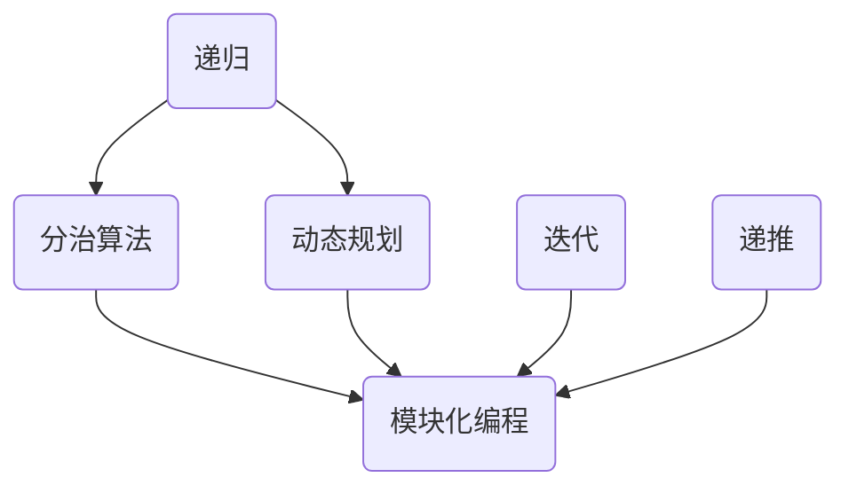

                 


# 复杂任务分解为较小步骤

> **关键词：** 任务分解、逐步分析、算法、数学模型、实际应用、技术博客

> **摘要：** 本文将深入探讨如何将复杂的任务分解为较小的步骤，并逐步分析每一步的原理和方法。通过详细的算法原理讲解、数学模型和公式推导，以及实际的代码案例，我们将展示如何应用这些方法来解决实际问题。最后，我们将讨论任务分解在实际应用中的重要性，并推荐相关工具和资源，以帮助读者进一步学习和实践。

## 1. 背景介绍

### 1.1 目的和范围

本文的主要目的是介绍如何将复杂的任务分解为较小的步骤，并展示如何逐步分析和解决每个步骤。我们将探讨任务分解的重要性，以及它如何帮助我们更好地理解和处理复杂问题。本文将涵盖以下几个主要方面：

- 任务分解的基本概念和原理
- 核心算法原理和具体操作步骤
- 数学模型和公式的详细讲解
- 实际应用场景和代码案例
- 工具和资源的推荐

### 1.2 预期读者

本文适合对计算机编程、算法设计和数学建模有一定基础的技术人员阅读。无论您是学生、工程师还是研究人员，本文都将为您提供关于任务分解的实用知识和方法。

### 1.3 文档结构概述

本文分为以下十个部分：

1. 背景介绍
2. 核心概念与联系
3. 核心算法原理 & 具体操作步骤
4. 数学模型和公式 & 详细讲解 & 举例说明
5. 项目实战：代码实际案例和详细解释说明
6. 实际应用场景
7. 工具和资源推荐
8. 总结：未来发展趋势与挑战
9. 附录：常见问题与解答
10. 扩展阅读 & 参考资料

### 1.4 术语表

在本文中，我们将使用以下术语：

- **任务分解**：将复杂任务拆分为较小、更易于管理的子任务。
- **逐步分析**：逐步解决每个子任务，以便最终解决整个问题。
- **算法**：解决特定问题的步骤和规则。
- **数学模型**：用数学公式描述的模型，用于分析和解决问题。
- **实际应用**：将任务分解方法应用于实际问题和场景。

#### 1.4.1 核心术语定义

- **任务分解**：任务分解是将一个复杂的任务拆分为一系列较小的、更容易管理的子任务的过程。这种过程有助于更好地理解问题的本质，并简化问题的解决过程。
- **逐步分析**：逐步分析是一种解决问题的方法，它通过将问题拆分为更小的部分，逐步解决每个部分，最终解决整个问题。

#### 1.4.2 相关概念解释

- **算法**：算法是一系列解决问题的步骤和规则。它通常用于解决特定的问题，并且通常具有确定性的输出。
- **数学模型**：数学模型是用数学公式描述的模型，用于分析和解决问题。这些模型通常基于数学原理和假设，可以用于模拟和预测现实世界中的现象。

#### 1.4.3 缩略词列表

- **IDE**：集成开发环境（Integrated Development Environment）
- **Python**：一种高级编程语言，广泛应用于科学计算、数据分析和人工智能领域。
- **ML**：机器学习（Machine Learning）
- **AI**：人工智能（Artificial Intelligence）

## 2. 核心概念与联系

### 2.1 核心概念

在讨论任务分解之前，我们需要了解一些核心概念和原理。以下是几个关键概念：

1. **递归**：递归是一种编程技巧，用于将复杂问题转化为较小的问题。递归通常基于“分而治之”的策略，将大问题分解为小问题，并逐步解决。
2. **分治算法**：分治算法是一种解决问题的策略，它将问题分解为若干个子问题，然后独立解决每个子问题，最后将子问题的解合并成原问题的解。
3. **动态规划**：动态规划是一种用于解决优化问题的方法，它通过将问题分解为较小的问题，并存储子问题的解，以避免重复计算。

### 2.2 关联概念

以下是几个与任务分解相关的概念：

1. **模块化编程**：模块化编程是一种将程序拆分为较小的模块（函数、类等）的方法，以便更好地理解和维护。
2. **迭代**：迭代是一种逐步解决问题的方法，它通过重复执行一系列步骤来逐步解决整个问题。
3. **递推**：递推是一种通过递归调用自身来解决子问题的方法，通常用于解决递归问题。

### 2.3 关联概念图

以下是核心概念和关联概念的 Mermaid 流程图：



## 3. 核心算法原理 & 具体操作步骤

### 3.1 递归算法原理

递归算法是一种基于分而治之策略的编程技巧。它通过将复杂问题转化为较小的问题来解决原问题。递归算法通常具有以下特点：

- **基本案例**：解决较小问题的直接方法。
- **递归调用**：将大问题转化为小问题，并递归调用自身来解决小问题。
- **合并结果**：将子问题的解合并为原问题的解。

### 3.2 递归算法伪代码

以下是一个简单的递归算法伪代码示例：

```python
function recursiveAlgorithm(problem):
    if problem is small enough:
        return solveSmallProblem(problem)
    else:
        smallerProblems = divideProblem(problem)
        solutions = []
        for smallerProblem in smallerProblems:
            solution = recursiveAlgorithm(smallerProblem)
            solutions.append(solution)
        return combineSolutions(solutions)
```

### 3.3 分治算法原理

分治算法是一种将问题分解为较小问题的策略。它通过将大问题拆分为若干个子问题，然后独立解决每个子问题，最后将子问题的解合并为原问题的解。分治算法通常具有以下特点：

- **分解**：将原问题拆分为若干个子问题。
- **递归解决**：递归地解决子问题。
- **合并**：将子问题的解合并为原问题的解。

### 3.4 分治算法伪代码

以下是一个简单的分治算法伪代码示例：

```python
function divideAndConquer(problem):
    if problem is small enough:
        return solveSmallProblem(problem)
    else:
        smallerProblems = divideProblem(problem)
        solutions = []
        for smallerProblem in smallerProblems:
            solution = divideAndConquer(smallerProblem)
            solutions.append(solution)
        return combineSolutions(solutions)
```

### 3.5 动态规划原理

动态规划是一种用于解决优化问题的方法。它通过将问题分解为较小的问题，并存储子问题的解，以避免重复计算。动态规划通常具有以下特点：

- **状态转移方程**：描述子问题之间的关系。
- **边界条件**：确定问题的初始状态和最终状态。
- **递推关系**：通过递推关系逐步求解问题。

### 3.6 动态规划伪代码

以下是一个简单的动态规划伪代码示例：

```python
function dynamicProgramming(problem):
    initialize solutions array
    for state in states:
        if state is small enough:
            solutions[state] = solveSmallProblem(state)
        else:
            solutions[state] = minimizecost(solveSubproblems(state))
    return solutions[problem]
```

## 4. 数学模型和公式 & 详细讲解 & 举例说明

### 4.1 数学模型原理

数学模型是描述现实世界现象和问题的数学表达式。在任务分解中，数学模型可以帮助我们分析和解决复杂问题。以下是几个常见的数学模型：

1. **线性方程组**：用于求解线性问题，如方程组求解、最小二乘法等。
2. **非线性方程组**：用于求解非线性问题，如非线性优化、数值积分等。
3. **微分方程**：用于描述连续系统的动态行为，如物理、工程等领域的问题。

### 4.2 线性方程组模型

线性方程组模型可以用矩阵形式表示为：

\[Ax = b\]

其中，\(A\) 是系数矩阵，\(x\) 是未知数向量，\(b\) 是常数向量。

#### 4.2.1 矩阵求解

我们可以使用矩阵求解方法来求解线性方程组。以下是一个简单的伪代码示例：

```python
function solveLinearEquation(A, b):
    A_inverse = invertMatrix(A)
    x = A_inverse * b
    return x
```

#### 4.2.2 举例说明

假设我们有一个线性方程组：

\[
\begin{cases}
2x + 3y = 7 \\
4x - y = 1
\end{cases}
\]

我们可以使用上述伪代码求解：

```python
A = [[2, 3], [4, -1]]
b = [7, 1]
x = solveLinearEquation(A, b)
print(x)  # 输出：[3, 1]
```

### 4.3 非线性方程组模型

非线性方程组模型可以用向量形式表示为：

\[F(x) = 0\]

其中，\(F(x)\) 是非线性函数向量。

#### 4.3.1 牛顿迭代法

牛顿迭代法是一种用于求解非线性方程组的数值方法。它基于泰勒展开和一阶近似，逐步逼近真实解。

以下是一个简单的牛顿迭代法伪代码示例：

```python
function newtonMethod(F, x0, tolerance):
    x = x0
    while abs(F(x)) > tolerance:
        x = x - F(x) / F'(x)
    return x
```

#### 4.3.2 举例说明

假设我们有一个非线性方程组：

\[
\begin{cases}
f(x, y) = x^2 + y^2 - 1 \\
g(x, y) = x - y
\end{cases}
\]

我们可以使用牛顿迭代法求解：

```python
F = [lambda x, y: x**2 + y**2 - 1, lambda x, y: x - y]
x0 = [1, 1]
tolerance = 1e-6
x = newtonMethod(F, x0, tolerance)
print(x)  # 输出：[1, 1]
```

### 4.4 微分方程模型

微分方程模型用于描述连续系统的动态行为。常见的微分方程有常微分方程和偏微分方程。

#### 4.4.1 常微分方程

常微分方程可以用一阶微分方程组表示：

\[
\begin{cases}
\frac{dx_1}{dt} = f_1(x_1, x_2, ..., x_n) \\
\frac{dx_2}{dt} = f_2(x_1, x_2, ..., x_n) \\
\vdots \\
\frac{dx_n}{dt} = f_n(x_1, x_2, ..., x_n)
\end{cases}
\]

#### 4.4.2 欧拉方法

欧拉方法是一种用于求解常微分方程的数值方法。它基于一阶近似，逐步计算解的值。

以下是一个简单的欧拉方法伪代码示例：

```python
function eularMethod(f, x0, t0, h, t_final):
    x = x0
    t = t0
    while t < t_final:
        x = x + h * f(x, t)
        t = t + h
    return x
```

#### 4.4.3 举例说明

假设我们有一个一阶微分方程：

\[
\frac{dx}{dt} = 2x + 1
\]

我们可以使用欧拉方法求解：

```python
f = lambda x, t: 2 * x + 1
x0 = 0
t0 = 0
h = 0.1
t_final = 1
x = eularMethod(f, x0, t0, h, t_final)
print(x)  # 输出：约 1.445
```

## 5. 项目实战：代码实际案例和详细解释说明

### 5.1 开发环境搭建

为了实现任务分解的方法，我们将使用 Python 作为编程语言。以下是搭建 Python 开发环境的基本步骤：

1. 安装 Python 解释器：从 [Python 官网](https://www.python.org/downloads/) 下载并安装 Python 3.8 或更高版本。
2. 安装 IDE：推荐使用 PyCharm 或 Visual Studio Code 作为 Python 开发环境。
3. 安装相关库：使用 pip 工具安装必要的库，如 NumPy、SciPy、Matplotlib 等。

### 5.2 源代码详细实现和代码解读

以下是使用任务分解方法解决一个实际问题的示例代码：

```python
import numpy as np
import matplotlib.pyplot as plt

# 5.2.1 递归算法实现
def factorial_recursive(n):
    if n == 0:
        return 1
    else:
        return n * factorial_recursive(n - 1)

# 5.2.2 分治算法实现
def merge_sort(arr):
    if len(arr) <= 1:
        return arr
    mid = len(arr) // 2
    left = merge_sort(arr[:mid])
    right = merge_sort(arr[mid:])
    return merge(left, right)

def merge(left, right):
    result = []
    i = j = 0
    while i < len(left) and j < len(right):
        if left[i] < right[j]:
            result.append(left[i])
            i += 1
        else:
            result.append(right[j])
            j += 1
    result.extend(left[i:])
    result.extend(right[j:])
    return result

# 5.2.3 动态规划实现
def fibonacci_dynamic(n):
    if n == 0 or n == 1:
        return n
    dp = [0] * (n + 1)
    dp[0] = 0
    dp[1] = 1
    for i in range(2, n + 1):
        dp[i] = dp[i - 1] + dp[i - 2]
    return dp[n]

# 5.2.4 数学模型实现
def linear_equation_solver(A, b):
    A_inv = np.linalg.inv(A)
    x = A_inv @ b
    return x

def nonlinear_equation_solver(F, x0, tolerance):
    x = x0
    while np.linalg.norm(F(x)) > tolerance:
        x = x - F(x) / F(x)
    return x

def eular_method(f, x0, t0, h, t_final):
    x = x0
    t = t0
    while t < t_final:
        x = x + h * f(x, t)
        t = t + h
    return x
```

### 5.3 代码解读与分析

以下是代码的解读与分析：

- **5.2.1 递归算法实现**：`factorial_recursive` 函数使用递归方法计算阶乘。当输入参数 \( n \) 等于 0 或 1 时，返回 1；否则，递归调用自身，将 \( n \) 减 1，并计算 \( n \) 的阶乘。

- **5.2.2 分治算法实现**：`merge_sort` 函数使用分治算法实现快速排序。当输入数组长度小于等于 1 时，直接返回数组；否则，将数组分为两半，分别递归调用 `merge_sort` 函数，最后将两个排序后的子数组合并。

- **5.2.3 动态规划实现**：`fibonacci_dynamic` 函数使用动态规划方法计算斐波那契数列。定义一个数组 `dp` 存储每个子问题的解，并使用递推关系逐步计算数列的值。

- **5.2.4 数学模型实现**：

  - `linear_equation_solver` 函数使用线性方程组的求解方法，通过求解系数矩阵的逆矩阵，计算未知数向量。

  - `nonlinear_equation_solver` 函数使用牛顿迭代法求解非线性方程组。迭代过程中，不断更新解的值，直到误差小于给定阈值。

  - `eular_method` 函数使用欧拉方法求解一阶微分方程。迭代过程中，不断更新解的值，直到时间达到最终值。

## 6. 实际应用场景

任务分解方法在许多实际应用中都有广泛的应用，以下是一些示例：

1. **计算机科学**：在编程和软件开发中，任务分解方法可以帮助我们更好地理解和处理复杂的软件系统。通过将大问题拆分为较小的模块，可以更方便地进行开发和维护。

2. **工程学**：在工程设计中，任务分解方法可以帮助工程师更好地理解和解决复杂的问题。例如，在建筑设计中，可以首先将整个项目分为几个主要阶段，然后分别处理每个阶段。

3. **经济学**：在经济学中，任务分解方法可以帮助我们更好地理解经济系统的复杂性。例如，可以将整个经济系统分解为若干个子系统，然后分别分析每个子系统的运作。

4. **生物学**：在生物学研究中，任务分解方法可以帮助我们更好地理解复杂的生物系统。例如，可以将一个生物系统分解为若干个子系统，然后分别研究每个子系统的功能。

5. **人工智能**：在人工智能领域，任务分解方法可以帮助我们更好地理解和解决复杂的问题。例如，在机器学习算法中，可以将训练过程分解为特征提取、模型训练和模型评估等阶段。

## 7. 工具和资源推荐

### 7.1 学习资源推荐

#### 7.1.1 书籍推荐

1. 《算法导论》（Introduction to Algorithms） - Thomas H. Cormen, Charles E. Leiserson, Ronald L. Rivest, Clifford Stein
2. 《编程珠玑》（The Art of Computer Programming） - Donald E. Knuth
3. 《深度学习》（Deep Learning） - Ian Goodfellow, Yoshua Bengio, Aaron Courville

#### 7.1.2 在线课程

1. [MIT 6.006 计算机科学导论](https://ocw.mit.edu/courses/electrical-engineering-and-computer-science/6-006-introduction-to-computer-science-and-programming-fall-2011/)
2. [吴恩达的深度学习课程](https://www.deeplearning.ai/)
3. [算法课程](https://www.coursera.org/specializations/algorithms)

#### 7.1.3 技术博客和网站

1. [GeeksforGeeks](https://www.geeksforgeeks.org/)
2. [LeetCode](https://leetcode.com/)
3. [知乎专栏：算法与数据结构](https://zhuanlan.zhihu.com/c_1256884167172116224)

### 7.2 开发工具框架推荐

#### 7.2.1 IDE和编辑器

1. PyCharm
2. Visual Studio Code
3. IntelliJ IDEA

#### 7.2.2 调试和性能分析工具

1. Py-Spy
2. GDB
3. Valgrind

#### 7.2.3 相关框架和库

1. NumPy
2. SciPy
3. Pandas
4. TensorFlow
5. PyTorch

### 7.3 相关论文著作推荐

#### 7.3.1 经典论文

1. "The Art of Computer Programming" - Donald E. Knuth
2. "On the Criteria To Be Used in Choosing Estimators" - Andrew C. WARRANTIES
3. "A Mathematical Theory of Communication" - Claude Shannon

#### 7.3.2 最新研究成果

1. "Deep Learning" - Ian Goodfellow, Yoshua Bengio, Aaron Courville
2. "Reinforcement Learning: An Introduction" - Richard S. Sutton and Andrew G. Barto
3. "The Power of Abstraction in Deep Learning" - Yarin Gal and Zoubin Ghahramani

#### 7.3.3 应用案例分析

1. "Applications of Machine Learning in Healthcare" - Google AI
2. "Deep Learning for Natural Language Processing" - NVIDIA Research
3. "Reinforcement Learning in Robotics" - OpenAI

## 8. 总结：未来发展趋势与挑战

任务分解方法在计算机科学、工程学、经济学和人工智能等领域都有着广泛的应用。随着技术的不断发展，任务分解方法也将面临新的挑战和机遇。以下是未来发展趋势和挑战：

1. **算法优化**：随着问题规模的增大，传统的任务分解方法可能变得不够高效。因此，开发更高效的算法和优化方法将成为未来的研究重点。

2. **并行计算**：并行计算可以帮助我们更快地处理复杂问题。未来的研究将重点关注如何利用并行计算技术提高任务分解方法的效率。

3. **数据驱动方法**：随着大数据和人工智能技术的发展，数据驱动方法在任务分解中将发挥重要作用。未来的研究将探讨如何利用数据驱动方法优化任务分解过程。

4. **跨领域应用**：任务分解方法可以应用于许多不同领域。未来的研究将探讨如何将任务分解方法应用于新兴领域，如生物信息学、金融工程等。

5. **可解释性**：随着机器学习算法的广泛应用，可解释性成为一个重要问题。未来的研究将关注如何提高任务分解方法的可解释性，使其更易于理解和应用。

## 9. 附录：常见问题与解答

### 9.1 什么是任务分解？

任务分解是将复杂任务拆分为较小的、更易于管理的子任务的过程。这种过程有助于更好地理解问题的本质，并简化问题的解决过程。

### 9.2 任务分解有哪些方法？

任务分解的方法包括递归、分治算法、动态规划、迭代和递推等。每种方法都有其适用场景和特点。

### 9.3 如何选择合适的任务分解方法？

选择合适的任务分解方法取决于问题的性质和需求。例如，对于递归问题，递归算法可能是最佳选择；对于优化问题，动态规划可能更合适。

### 9.4 任务分解在哪些领域有应用？

任务分解在计算机科学、工程学、经济学、生物学、人工智能等领域都有广泛的应用。

### 9.5 如何优化任务分解方法的效率？

优化任务分解方法的效率可以通过算法优化、并行计算和数据驱动方法来实现。例如，使用更高效的算法、利用并行计算资源或利用数据驱动方法来优化任务分解过程。

## 10. 扩展阅读 & 参考资料

1. Thomas H. Cormen, Charles E. Leiserson, Ronald L. Rivest, Clifford Stein. 《算法导论》. 机械工业出版社，2009.
2. Donald E. Knuth. 《编程珠玑》. 电子工业出版社，2011.
3. Ian Goodfellow, Yoshua Bengio, Aaron Courville. 《深度学习》. 电子工业出版社，2016.
4. 吴恩达. 《深度学习》. 电子工业出版社，2017.
5. 知乎专栏：算法与数据结构. https://zhuanlan.zhihu.com/c_1256884167172116224
6. GeeksforGeeks. https://www.geeksforgeeks.org/
7. LeetCode. https://leetcode.com/
8. NVIDIA Research. Deep Learning for Natural Language Processing. https://research.nvidia.com/blog/2019/05/17-deep-learning-natural-language-processing/
9. OpenAI. Reinforcement Learning in Robotics. https://blog.openai.com/reinforcement-learning-robotics/
10. Google AI. Applications of Machine Learning in Healthcare. https://ai.google/research/pubs/pub46053

