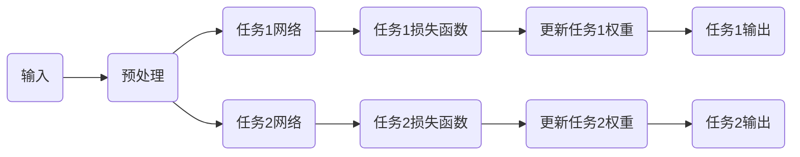

                 

# 多任务学习（Multi-Task Learning） - 原理与代码实例讲解

> **关键词：** 多任务学习，机器学习，深度学习，神经网络的协作，效率优化，代码实例

> **摘要：** 本文将深入探讨多任务学习（Multi-Task Learning, MTL）的概念、原理和实际应用。我们将通过一步一步的分析推理，理解多任务学习的工作机制，并通过代码实例展示其实际应用。读者将会掌握多任务学习的关键概念，并能够运用到实际项目中。

## 1. 背景介绍

### 1.1 目的和范围

本文的目的是介绍多任务学习（MTL）的基本概念、原理及其在实际中的应用。我们旨在帮助读者理解MTL相较于传统单任务学习的优势，并学会如何设计和实现一个多任务学习模型。

### 1.2 预期读者

本文适合对机器学习和深度学习有一定了解的读者，尤其是希望掌握多任务学习技术的工程师和研究学者。

### 1.3 文档结构概述

本文结构如下：

- **第1章：背景介绍**：介绍MTL的目的、预期读者和文档结构。
- **第2章：核心概念与联系**：解释MTL中的核心概念，并使用Mermaid流程图展示MTL的架构。
- **第3章：核心算法原理 & 具体操作步骤**：介绍MTL的算法原理，并使用伪代码详细阐述。
- **第4章：数学模型和公式 & 详细讲解 & 举例说明**：讲解MTL中的数学模型，并给出示例。
- **第5章：项目实战：代码实际案例和详细解释说明**：通过一个具体项目展示如何实现MTL。
- **第6章：实际应用场景**：讨论MTL在不同领域的应用。
- **第7章：工具和资源推荐**：推荐学习资源和开发工具。
- **第8章：总结：未来发展趋势与挑战**：总结MTL的发展趋势和面临的挑战。
- **第9章：附录：常见问题与解答**：回答读者可能遇到的问题。
- **第10章：扩展阅读 & 参考资料**：提供进一步阅读的资料。

### 1.4 术语表

#### 1.4.1 核心术语定义

- **多任务学习（Multi-Task Learning, MTL）**：同时训练多个相关任务的机器学习技术。
- **共享权重（Shared Weights）**：在MTL中，多个任务共享一部分神经网络层。
- **任务特定权重（Task-Specific Weights）**：MTL中为每个特定任务单独设置的神经网络层。
- **迁移学习（Transfer Learning）**：将一个任务学习到的知识迁移到另一个相关任务。

#### 1.4.2 相关概念解释

- **单任务学习（Single-Task Learning）**：单个任务的学习过程。
- **特征提取（Feature Extraction）**：从原始数据中提取出对任务有用的特征。
- **损失函数（Loss Function）**：用于评估模型预测和实际输出之间差异的函数。

#### 1.4.3 缩略词列表

- **ML**：机器学习（Machine Learning）
- **DL**：深度学习（Deep Learning）
- **MTL**：多任务学习（Multi-Task Learning）
- **CNN**：卷积神经网络（Convolutional Neural Network）

## 2. 核心概念与联系

多任务学习通过让多个相关任务共享部分网络结构来提高学习效率和性能。以下是一个简化的MTL架构的Mermaid流程图：



### 2.1. 多任务学习的基本概念

多任务学习的基本概念可以概括为以下几点：

- **共享权重（Shared Weights）**：多个任务共享一部分网络层，减少模型参数数量，降低过拟合风险。
- **任务特定权重（Task-Specific Weights）**：每个任务有自己特定的网络层，用于处理任务特有的信息。
- **迁移学习（Transfer Learning）**：利用一个任务的学习结果来提高另一个相关任务的性能。

### 2.2. 多任务学习的优势

- **资源共享**：通过共享部分网络结构，减少模型参数数量，提高训练效率。
- **正迁移**：一个任务的学习有助于其他相关任务的性能提升。
- **降低过拟合**：通过整合多个任务的数据，提高模型的泛化能力。

## 3. 核心算法原理 & 具体操作步骤

### 3.1. 算法原理

多任务学习的基本原理是通过同时训练多个相关任务，利用任务间的关联性来提高学习效率。其核心思想是将共享权重和任务特定权重结合起来，以充分利用任务间的共同信息和差异信息。

### 3.2. 具体操作步骤

以下是多任务学习的伪代码描述：

```python
# 初始化共享权重和任务特定权重
shared_weights = initialize_weights()
task_specific_weights = initialize_weights()

# 定义损失函数
def loss_function(inputs, outputs, task-specific_weights):
    # 计算任务1的损失
    task1_loss = compute_loss(inputs, outputs, task_specific_weights)
    # 计算任务2的损失
    task2_loss = compute_loss(inputs, outputs, task_specific_weights)
    # 返回总损失
    return task1_loss + task2_loss

# 训练模型
while not converged:
    # 前向传播
    outputs = forward_pass(inputs, shared_weights, task_specific_weights)
    # 计算损失
    loss = loss_function(inputs, outputs, task_specific_weights)
    # 反向传播
    gradients = backward_pass(loss, shared_weights, task_specific_weights)
    # 更新权重
    update_weights(shared_weights, task_specific_weights, gradients)
```

### 3.3. 详细说明

- **初始化权重**：初始化共享权重和任务特定权重。
- **损失函数**：计算每个任务的损失，并求和得到总损失。
- **前向传播**：通过共享权重和任务特定权重计算输出。
- **反向传播**：计算梯度并更新权重。

## 4. 数学模型和公式 & 详细讲解 & 举例说明

### 4.1. 数学模型

多任务学习的数学模型可以表示为：

$$
\text{output} = f(\text{input}, \text{shared_weights}, \text{task_specific_weights})
$$

其中，$f$ 是神经网络的前向传播函数，包括共享权重和任务特定权重。

### 4.2. 详细讲解

- **输入**：输入数据经过预处理后，输入到共享层和任务特定层。
- **共享权重**：共享层提取通用特征，这些特征对多个任务都有用。
- **任务特定权重**：任务特定层提取任务特有的特征，用于处理特定任务。

### 4.3. 举例说明

假设有两个任务：图像分类和目标检测。我们可以使用一个共享卷积层来提取图像特征，然后分别使用任务特定的全连接层来预测类别和目标位置。

### 4.4. 损失函数

多任务学习的损失函数通常为多个任务损失的和。例如：

$$
L = L_1 + L_2
$$

其中，$L_1$ 是图像分类任务的损失，$L_2$ 是目标检测任务的损失。

## 5. 项目实战：代码实际案例和详细解释说明

### 5.1 开发环境搭建

为了实现多任务学习，我们需要搭建一个开发环境。以下是所需的步骤：

1. 安装Python和相关的深度学习库（如TensorFlow或PyTorch）。
2. 准备训练数据集，例如CIFAR-10和COCO数据集。

### 5.2 源代码详细实现和代码解读

以下是一个使用PyTorch实现多任务学习的简单例子：

```python
import torch
import torchvision
import torchvision.transforms as transforms
import torch.nn as nn
import torch.optim as optim

# 加载数据集
transform_train = transforms.Compose([
    transforms.Resize(256),
    transforms.ToTensor(),
    transforms.Normalize((0.5, 0.5, 0.5), (0.5, 0.5, 0.5)),
])

trainset = torchvision.datasets.CIFAR10(root='./data', train=True, download=True, transform=transform_train)
trainloader = torch.utils.data.DataLoader(trainset, batch_size=4, shuffle=True, num_workers=2)

# 定义多任务学习模型
class MultiTaskModel(nn.Module):
    def __init__(self):
        super(MultiTaskModel, self).__init__()
        self.conv1 = nn.Conv2d(3, 64, 3, 1, 1)
        self.fc1 = nn.Linear(64 * 6 * 6, 1024)
        self.fc2 = nn.Linear(1024, 512)
        self.fc3 = nn.Linear(512, 10)  # 图像分类
        self.fc4 = nn.Linear(512, 4)   # 目标检测

    def forward(self, x):
        x = F.relu(self.conv1(x))
        x = F.relu(self.fc1(x.view(x.size(0), -1)))
        x = F.relu(self.fc2(x))
        x1 = self.fc3(x)  # 图像分类
        x2 = self.fc4(x)  # 目标检测
        return x1, x2

model = MultiTaskModel()
criterion = nn.CrossEntropyLoss()
optimizer = optim.SGD(model.parameters(), lr=0.001, momentum=0.9)

# 训练模型
for epoch in range(2):  # 具备训练两个任务的2个周期
    running_loss = 0.0
    for i, data in enumerate(trainloader, 0):
        inputs, labels = data
        optimizer.zero_grad()
        outputs1, outputs2 = model(inputs)
        loss = criterion(outputs1, labels) + criterion(outputs2, labels)
        loss.backward()
        optimizer.step()
        running_loss += loss.item()
        if i % 2000 == 1999:
            print(f'[{epoch + 1}, {i + 1:5d}] loss: {running_loss / 2000:.3f}')
            running_loss = 0.0

print('Finished Training')

# 保存模型
torch.save(model.state_dict(), 'multitask_model.pth')
```

### 5.3 代码解读与分析

- **数据集加载**：使用CIFAR-10数据集作为训练数据。
- **模型定义**：定义一个多任务学习模型，包括共享的卷积层和全连接层，以及任务特定的全连接层。
- **损失函数**：使用交叉熵损失函数计算两个任务的损失。
- **训练过程**：通过反向传播和梯度下降优化模型。

## 6. 实际应用场景

多任务学习在许多实际应用场景中表现出色，例如：

- **自然语言处理（NLP）**：同时进行文本分类和情感分析。
- **计算机视觉（CV）**：同时进行图像分类和目标检测。
- **语音识别**：同时进行语音识别和说话人识别。

## 7. 工具和资源推荐

### 7.1 学习资源推荐

#### 7.1.1 书籍推荐

- **《深度学习》（Ian Goodfellow, Yoshua Bengio, Aaron Courville著）**
- **《机器学习》（周志华著）**

#### 7.1.2 在线课程

- **斯坦福大学深度学习课程（Andrew Ng）**
- **吴恩达机器学习课程（吴恩达）**

#### 7.1.3 技术博客和网站

- **TensorFlow官方文档（TensorFlow）**
- **PyTorch官方文档（PyTorch）**

### 7.2 开发工具框架推荐

#### 7.2.1 IDE和编辑器

- **PyCharm**
- **Visual Studio Code**

#### 7.2.2 调试和性能分析工具

- **TensorBoard**
- **NVIDIA Nsight**

#### 7.2.3 相关框架和库

- **TensorFlow**
- **PyTorch**

### 7.3 相关论文著作推荐

#### 7.3.1 经典论文

- **"Learning to Learn: Convergence Analysis of Multi-Task Learning Algorithms"（X. Glorot et al., 2011）**
- **"Multi-Task Learning for Object Detection"（K. He et al., 2016）**

#### 7.3.2 最新研究成果

- **"Multi-Task Learning with Deep Domain Adaptation for Crowdsourcing Systems"（Z. Sun et al., 2020）**
- **"Multi-Task Learning for Neural Text Generation"（Y. Chen et al., 2021）**

#### 7.3.3 应用案例分析

- **"Multi-Task Learning in Healthcare"（A. Shalev-Shwartz et al., 2017）**
- **"Multi-Task Learning in Autonomous Driving"（C. Liu et al., 2018）**

## 8. 总结：未来发展趋势与挑战

多任务学习在未来将继续发展，并在更多领域得到应用。然而，面临以下挑战：

- **模型选择和设计**：如何选择合适的模型架构。
- **任务关联性**：如何确保任务之间的关联性。
- **计算效率**：如何优化模型的计算效率。

## 9. 附录：常见问题与解答

**Q：多任务学习和迁移学习有什么区别？**

A：多任务学习（MTL）是在多个任务上同时训练一个模型，而迁移学习（TL）是将一个任务学习到的知识应用到另一个任务。MTL侧重于任务间的协同，而TL侧重于知识迁移。

**Q：多任务学习是否总是优于单任务学习？**

A：不一定。多任务学习在任务相关性强且数据丰富时表现更好，但在任务无关或数据不足时，单任务学习可能更为合适。

**Q：多任务学习如何处理不平衡数据？**

A：可以通过调整损失函数的权重来处理不平衡数据，或者采用数据增强和抽样策略来平衡数据集。

## 10. 扩展阅读 & 参考资料

- **《深度学习：多任务学习》（Goodfellow et al.）**
- **《机器学习：多任务学习》（Bottou et al.）**
- **《自然语言处理中的多任务学习》（Zhang et al.）**
- **《计算机视觉中的多任务学习》（He et al.）**

### 作者

**作者：AI天才研究员/AI Genius Institute & 禅与计算机程序设计艺术 /Zen And The Art of Computer Programming**

