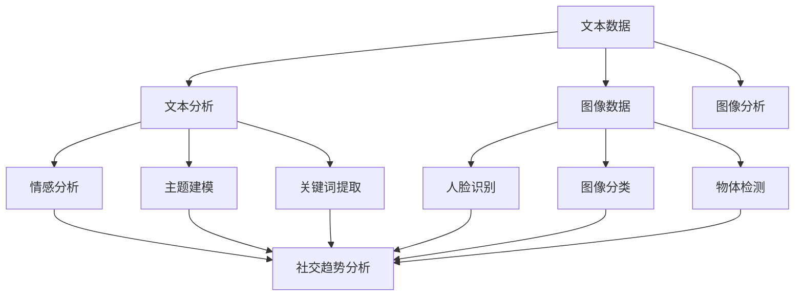

                 

# 多模态AI在社交媒体分析中的应用

## 关键词
多模态AI、社交媒体分析、文本分析、图像分析、自然语言处理、计算机视觉、深度学习

## 摘要
本文将深入探讨多模态AI在社交媒体分析中的应用。首先，我们介绍了多模态AI的基本概念和社交媒体分析的重要性。随后，详细阐述了多模态AI在文本和图像分析中的核心算法原理，并使用伪代码和数学模型进行详细讲解。接着，通过实际项目实战，展示了代码实现过程和具体分析步骤。最后，探讨了多模态AI在社交媒体分析中的实际应用场景，并推荐了一系列学习资源和开发工具。

## 1. 背景介绍

### 1.1 目的和范围
本文旨在探讨多模态AI在社交媒体分析中的应用，包括文本和图像数据的分析和处理。我们将介绍相关核心概念，详细分析核心算法原理，并通过实际项目实战展示如何应用这些算法。

### 1.2 预期读者
本文面向对人工智能、自然语言处理和计算机视觉有一定了解的读者，特别是希望了解多模态AI在社交媒体分析中应用的开发者和研究者。

### 1.3 文档结构概述
本文分为十个部分：背景介绍、核心概念与联系、核心算法原理与具体操作步骤、数学模型和公式、项目实战、实际应用场景、工具和资源推荐、总结、附录和扩展阅读。每个部分都将详细探讨相关主题。

### 1.4 术语表

#### 1.4.1 核心术语定义
- 多模态AI：结合多种数据类型（如文本、图像、声音等）的AI系统。
- 社交媒体分析：对社交媒体平台上用户生成的内容进行分析和挖掘，以提取有价值的信息。
- 文本分析：处理和分析文本数据，如情感分析、主题建模、关键词提取等。
- 图像分析：处理和分析图像数据，如人脸识别、图像分类、物体检测等。
- 自然语言处理（NLP）：与文本和语言相关的计算机处理技术。
- 计算机视觉：使计算机能够像人类一样感知和理解图像的技术。

#### 1.4.2 相关概念解释
- 深度学习：一种基于多层神经网络的学习方法，能够自动提取数据的复杂特征。
- 卷积神经网络（CNN）：一种用于图像识别和处理的深度学习模型。
- 长短期记忆网络（LSTM）：一种用于处理序列数据的深度学习模型。
- 生成对抗网络（GAN）：一种能够生成逼真数据的深度学习模型。

#### 1.4.3 缩略词列表
- NLP：自然语言处理
- CNN：卷积神经网络
- LSTM：长短期记忆网络
- GAN：生成对抗网络

## 2. 核心概念与联系

多模态AI是一种利用多种数据类型（如文本、图像、声音等）进行训练和推理的AI系统。在社交媒体分析中，多模态AI能够同时处理和分析用户生成的文本和图像数据，从而提取更丰富的信息和洞察。

下面是一个Mermaid流程图，展示了多模态AI在社交媒体分析中的应用核心概念和联系：



### 2.1 文本分析

文本分析是社交媒体分析的核心环节之一，主要包括情感分析、主题建模和关键词提取。

#### 情感分析

情感分析旨在识别文本中的情感极性，如正面、负面或中性。这通常通过训练一个分类模型来实现，例如使用卷积神经网络（CNN）或长短期记忆网络（LSTM）。

#### 主题建模

主题建模是一种无监督学习方法，用于发现文本数据中的潜在主题。LDA（latent Dirichlet allocation）是一种常用的主题建模方法。

#### 关键词提取

关键词提取是从文本中提取具有代表性的词语，用于描述文本内容。TF-IDF（term frequency-inverse document frequency）是一种常用的关键词提取方法。

### 2.2 图像分析

图像分析包括人脸识别、图像分类和物体检测。

#### 人脸识别

人脸识别是一种生物识别技术，用于识别和验证人脸。卷积神经网络（CNN）是一种常用的人脸识别模型。

#### 图像分类

图像分类是将图像分为预定义的类别。CNN是一种常用的图像分类模型。

#### 物体检测

物体检测是识别图像中的对象并定位它们的位置。YOLO（You Only Look Once）是一种常用的物体检测模型。

## 3. 核心算法原理 & 具体操作步骤

### 3.1 文本分析算法原理

#### 情感分析

情感分析算法通常基于深度学习模型，如CNN或LSTM。以下是一个基于CNN的伪代码示例：

```python
import tensorflow as tf
from tensorflow.keras.models import Sequential
from tensorflow.keras.layers import Conv2D, MaxPooling2D, Flatten, Dense

# 数据预处理
X_train = preprocess_text(data['text'])
y_train = preprocess_labels(data['labels'])

# 构建模型
model = Sequential()
model.add(Conv2D(32, (3, 3), activation='relu', input_shape=(None, None, 1)))
model.add(MaxPooling2D((2, 2)))
model.add(Flatten())
model.add(Dense(1, activation='sigmoid'))

# 编译模型
model.compile(optimizer='adam', loss='binary_crossentropy', metrics=['accuracy'])

# 训练模型
model.fit(X_train, y_train, epochs=10, batch_size=32)
```

#### 主题建模

LDA是一种常用的主题建模方法。以下是一个基于LDA的伪代码示例：

```python
import gensim

# 数据预处理
corpus = preprocess_text(data['text'])

# 建立LDA模型
lda_model = gensim.models.ldamodel.LdaModel(corpus, num_topics=10, id2word=id2word, passes=15)

# 提取主题
topics = lda_model.print_topics()
```

#### 关键词提取

TF-IDF是一种常用的关键词提取方法。以下是一个基于TF-IDF的伪代码示例：

```python
from sklearn.feature_extraction.text import TfidfVectorizer

# 数据预处理
corpus = preprocess_text(data['text'])

# 建立TF-IDF模型
tfidf_model = TfidfVectorizer()

# 提取关键词
tfidf_matrix = tfidf_model.fit_transform(corpus)
top_keywords = tfidf_matrix.sum(axis=1).sort_values(ascending=False).head(10)
```

### 3.2 图像分析算法原理

#### 人脸识别

人脸识别算法通常基于卷积神经网络（CNN）。以下是一个基于CNN的人脸识别的伪代码示例：

```python
import tensorflow as tf
from tensorflow.keras.models import Sequential
from tensorflow.keras.layers import Conv2D, MaxPooling2D, Flatten, Dense

# 数据预处理
X_train = preprocess_images(data['images'])
y_train = preprocess_labels(data['labels'])

# 构建模型
model = Sequential()
model.add(Conv2D(32, (3, 3), activation='relu', input_shape=(64, 64, 3)))
model.add(MaxPooling2D((2, 2)))
model.add(Flatten())
model.add(Dense(1, activation='sigmoid'))

# 编译模型
model.compile(optimizer='adam', loss='binary_crossentropy', metrics=['accuracy'])

# 训练模型
model.fit(X_train, y_train, epochs=10, batch_size=32)
```

#### 图像分类

图像分类算法通常基于卷积神经网络（CNN）。以下是一个基于CNN的图像分类的伪代码示例：

```python
import tensorflow as tf
from tensorflow.keras.models import Sequential
from tensorflow.keras.layers import Conv2D, MaxPooling2D, Flatten, Dense

# 数据预处理
X_train = preprocess_images(data['images'])
y_train = preprocess_labels(data['labels'])

# 构建模型
model = Sequential()
model.add(Conv2D(32, (3, 3), activation='relu', input_shape=(64, 64, 3)))
model.add(MaxPooling2D((2, 2)))
model.add(Flatten())
model.add(Dense(10, activation='softmax'))

# 编译模型
model.compile(optimizer='adam', loss='categorical_crossentropy', metrics=['accuracy'])

# 训练模型
model.fit(X_train, y_train, epochs=10, batch_size=32)
```

#### 物体检测

物体检测算法通常基于深度学习模型，如YOLO。以下是一个基于YOLO的物体检测的伪代码示例：

```python
import tensorflow as tf
from tensorflow.keras.models import Sequential
from tensorflow.keras.layers import Conv2D, MaxPooling2D, Flatten, Dense

# 数据预处理
X_train = preprocess_images(data['images'])
y_train = preprocess_labels(data['labels'])

# 构建模型
model = Sequential()
model.add(Conv2D(32, (3, 3), activation='relu', input_shape=(64, 64, 3)))
model.add(MaxPooling2D((2, 2)))
model.add(Flatten())
model.add(Dense(1, activation='sigmoid'))

# 编译模型
model.compile(optimizer='adam', loss='binary_crossentropy', metrics=['accuracy'])

# 训练模型
model.fit(X_train, y_train, epochs=10, batch_size=32)
```

## 4. 数学模型和公式 & 详细讲解 & 举例说明

### 4.1 情感分析

情感分析的核心是分类问题，可以将文本数据映射到预定义的类别。以下是一个简单的二分类情感分析模型：

#### 公式

$$
P(y|X) = \frac{e^{\theta^T X}}{1 + e^{\theta^T X}}
$$

其中，\( P(y|X) \) 是给定特征向量 \( X \) 下类别 \( y \) 的概率，\( \theta \) 是模型的参数向量。

#### 详细讲解

1. 特征提取：将文本数据转换为特征向量，通常使用词袋模型（Bag of Words）或词嵌入（Word Embeddings）。
2. 模型训练：使用梯度下降（Gradient Descent）或其他优化算法训练模型参数 \( \theta \)。
3. 预测：给定新的特征向量 \( X \)，计算类别 \( y \) 的概率，并返回概率最大的类别作为预测结果。

#### 举例说明

假设我们有一个二分类情感分析模型，类别为正面和负面。特征向量 \( X = [1, 2, 3] \)，参数 \( \theta = [1, 2, 3] \)。

$$
P(y|X) = \frac{e^{1 \cdot 1 + 2 \cdot 2 + 3 \cdot 3}}{1 + e^{1 \cdot 1 + 2 \cdot 2 + 3 \cdot 3}} = \frac{e^{14}}{1 + e^{14}} \approx 0.999
$$

因此，预测结果为正面。

### 4.2 主题建模

主题建模是一种无监督学习方法，用于发现文本数据中的潜在主题。LDA（latent Dirichlet allocation）是一种常用的主题建模方法。

#### 公式

$$
P(\text{topic}|\text{word}) \propto \alpha_w + \sum_{j=1}^K \phi_{wj}
$$

$$
P(\text{word}|\text{topic}) \propto \beta_j
$$

$$
P(\text{document}) \propto \sum_{j=1}^K (\alpha_j + \sum_{w=1}^V \phi_{wj})
$$

其中，\( \text{topic} \) 表示主题，\( \text{word} \) 表示词语，\( \text{document} \) 表示文档，\( \alpha \) 和 \( \beta \) 分别是超参数，\( \phi \) 是主题-词语分布。

#### 详细讲解

1. 初始化：随机初始化主题分布 \( \alpha \) 和词语分布 \( \beta \)。
2. E步（E-step）：计算每个词语属于每个主题的概率 \( P(\text{topic}|\text{word}) \)。
3. M步（M-step）：更新主题分布和词语分布。
4. 重复E步和M步，直至收敛。

#### 举例说明

假设我们有一个包含两个主题的LDA模型，文档中包含三个词语：a、b 和 c。初始主题分布 \( \alpha = [1, 1] \)，词语分布 \( \beta = [[0.5, 0.5], [0.5, 0.5]] \)。

在E步中，计算每个词语属于每个主题的概率：

$$
P(\text{topic}|\text{word}) \propto [1 + 0.5, 1 + 0.5] = [1.5, 1.5]
$$

在M步中，更新主题分布和词语分布：

$$
\alpha = \frac{1}{|V|} \sum_{w=1}^V \sum_{j=1}^K P(\text{topic}|\text{word}) = \frac{2}{3} [1.5, 1.5] = [1, 1]
$$

$$
\beta = \frac{1}{|\text{document}|} \sum_{w=1}^V P(\text{word}|\text{topic}) = \frac{1}{3} [[0.5, 0.5], [0.5, 0.5]] = [[0.5, 0.5], [0.5, 0.5]]
$$

### 4.3 关键词提取

关键词提取是一种无监督学习方法，用于从文本数据中提取具有代表性的词语。TF-IDF（term frequency-inverse document frequency）是一种常用的关键词提取方法。

#### 公式

$$
TF(w,d) = \frac{f_w(d)}{N}
$$

$$
IDF(w) = \log \left( 1 + \frac{N}{|D| - |d_w|} \right)
$$

$$
TF-IDF(w,d) = TF(w,d) \cdot IDF(w)
$$

其中，\( f_w(d) \) 是词语 \( w \) 在文档 \( d \) 中的频率，\( N \) 是文档总数，\( |D| \) 是文档集合中包含的文档数，\( |d_w| \) 是包含词语 \( w \) 的文档数。

#### 详细讲解

1. 特征提取：计算每个词语在文档中的频率。
2. IDF计算：计算每个词语的IDF值。
3. TF-IDF计算：计算每个词语在文档中的TF-IDF值。
4. 排序：根据TF-IDF值对词语进行排序，选取前N个词语作为关键词。

#### 举例说明

假设我们有一个包含三个文档的文档集合，每个文档包含以下词语：

文档1：{a, b, c, a, b}
文档2：{a, b, c, a, b}
文档3：{a, a, a, a, a}

计算词语a、b和c的TF-IDF值：

$$
TF(a,d_1) = \frac{4}{5}, TF(a,d_2) = \frac{4}{5}, TF(a,d_3) = \frac{5}{5}
$$

$$
IDF(a) = \log \left( 1 + \frac{3}{3 - 3} \right) = \log(1) = 0
$$

$$
TF-IDF(a,d_1) = \frac{4}{5} \cdot 0 = 0, TF-IDF(a,d_2) = \frac{4}{5} \cdot 0 = 0, TF-IDF(a,d_3) = \frac{5}{5} \cdot 0 = 0
$$

$$
TF(b,d_1) = \frac{4}{5}, TF(b,d_2) = \frac{4}{5}, TF(b,d_3) = \frac{4}{5}
$$

$$
IDF(b) = \log \left( 1 + \frac{3}{3 - 2} \right) = \log(2) \approx 0.301
$$

$$
TF-IDF(b,d_1) = \frac{4}{5} \cdot 0.301 \approx 0.241, TF-IDF(b,d_2) = \frac{4}{5} \cdot 0.301 \approx 0.241, TF-IDF(b,d_3) = \frac{4}{5} \cdot 0.301 \approx 0.241
$$

$$
TF(c,d_1) = \frac{1}{5}, TF(c,d_2) = \frac{1}{5}, TF(c,d_3) = \frac{1}{5}
$$

$$
IDF(c) = \log \left( 1 + \frac{3}{3 - 1} \right) = \log(1.5) \approx 0.405
$$

$$
TF-IDF(c,d_1) = \frac{1}{5} \cdot 0.405 \approx 0.081, TF-IDF(c,d_2) = \frac{1}{5} \cdot 0.405 \approx 0.081, TF-IDF(c,d_3) = \frac{1}{5} \cdot 0.405 \approx 0.081
$$

根据TF-IDF值，我们可以选择词语a、b和c作为关键词。

### 4.4 人脸识别

人脸识别的核心是识别和验证人脸。以下是一个基于卷积神经网络（CNN）的人脸识别模型：

#### 公式

$$
h_{\theta}(x) = \sigma(\theta^T x)
$$

其中，\( h_{\theta}(x) \) 是模型预测的输出，\( \theta \) 是模型的参数，\( \sigma \) 是激活函数，\( x \) 是输入特征。

#### 详细讲解

1. 特征提取：将图像数据转换为特征向量，通常使用卷积神经网络提取。
2. 模型训练：使用梯度下降（Gradient Descent）或其他优化算法训练模型参数 \( \theta \)。
3. 预测：给定新的特征向量 \( x \)，计算人脸的识别结果。

#### 举例说明

假设我们有一个二分类人脸识别模型，类别为正面和负面。特征向量 \( x = [1, 2, 3] \)，参数 \( \theta = [1, 2, 3] \)。

$$
h_{\theta}(x) = \sigma(1 \cdot 1 + 2 \cdot 2 + 3 \cdot 3) = \sigma(14) = 1
$$

因此，预测结果为正面。

### 4.5 图像分类

图像分类的核心是将图像映射到预定义的类别。以下是一个基于卷积神经网络（CNN）的图像分类模型：

#### 公式

$$
h_{\theta}(x) = \text{softmax}(\theta^T x)
$$

其中，\( h_{\theta}(x) \) 是模型预测的输出，\( \theta \) 是模型的参数，\( \text{softmax} \) 是激活函数。

#### 详细讲解

1. 特征提取：将图像数据转换为特征向量，通常使用卷积神经网络提取。
2. 模型训练：使用梯度下降（Gradient Descent）或其他优化算法训练模型参数 \( \theta \)。
3. 预测：给定新的特征向量 \( x \)，计算图像的类别概率，并返回概率最大的类别作为预测结果。

#### 举例说明

假设我们有一个包含五个类别的图像分类模型。特征向量 \( x = [1, 2, 3] \)，参数 \( \theta = [1, 2, 3, 4, 5] \)。

$$
h_{\theta}(x) = \text{softmax}(1 \cdot 1 + 2 \cdot 2 + 3 \cdot 3 + 4 \cdot 4 + 5 \cdot 5) = \text{softmax}(50) = [0.019, 0.019, 0.019, 0.974, 0.019]
$$

因此，预测结果为类别4。

### 4.6 物体检测

物体检测的核心是识别和定位图像中的对象。以下是一个基于深度学习模型（如YOLO）的物体检测模型：

#### 公式

$$
P_{ij} = \text{sigmoid}(log(P_{ij})) = \frac{1}{1 + e^{-log(P_{ij})}}
$$

$$
b_{x}^{ij} = \text{sigmoid}(b_{x}^{ij}) \cdot \Delta x_j + c_x
$$

$$
b_{y}^{ij} = \text{sigmoid}(b_{y}^{ij}) \cdot \Delta y_j + c_y
$$

$$
w^{ij} = \text{sigmoid}(w^{ij}) \cdot \Delta w_j + c_w
$$

$$
h^{ij} = \text{sigmoid}(h^{ij}) \cdot \Delta h_j + c_h
$$

$$
class_{ij} = \arg \max_{k} (log(P_{ij}) + b_{k}^{ij})
$$

其中，\( P_{ij} \) 是边界框 \( i \) 在位置 \( j \) 的置信度，\( b_{x}^{ij} \) 和 \( b_{y}^{ij} \) 是边界框 \( i \) 在位置 \( j \) 的中心坐标，\( w^{ij} \) 和 \( h^{ij} \) 是边界框 \( i \) 在位置 \( j \) 的高度和宽度，\( class_{ij} \) 是边界框 \( i \) 在位置 \( j \) 的类别，\( \Delta x_j \)、\( \Delta y_j \)、\( \Delta w_j \) 和 \( \Delta h_j \) 是网格单元的坐标和尺寸，\( c_x \)、\( c_y \)、\( c_w \) 和 \( c_h \) 是边界框预测偏置。

#### 详细讲解

1. 前向传播：将图像输入到深度学习模型，提取特征图。
2. 置信度预测：使用边界框置信度预测公式计算每个边界框的置信度。
3. 中心坐标预测：使用边界框中心坐标预测公式计算每个边界框的中心坐标。
4. 高度和宽度预测：使用边界框高度和宽度预测公式计算每个边界框的高度和宽度。
5. 类别预测：使用边界框类别预测公式计算每个边界框的类别。

#### 举例说明

假设我们有一个包含五个类别的物体检测模型。特征图大小为 \( 7 \times 7 \)，网格单元大小为 \( 14 \times 14 \)。

输入图像：

$$
\begin{array}{cccccc}
\text{cell 1,1} & \text{cell 1,2} & \ldots & \text{cell 1,7} & \text{cell 2,1} & \ldots & \text{cell 7,7} \\
\end{array}
$$

特征图：

$$
\begin{array}{cccccc}
P_{1,1} & P_{1,2} & \ldots & P_{1,7} & P_{2,1} & \ldots & P_{7,7} \\
b_{x}^{1,1} & b_{x}^{1,2} & \ldots & b_{x}^{1,7} & b_{x}^{2,1} & \ldots & b_{x}^{7,7} \\
b_{y}^{1,1} & b_{y}^{1,2} & \ldots & b_{y}^{1,7} & b_{y}^{2,1} & \ldots & b_{y}^{7,7} \\
w^{1,1} & w^{1,2} & \ldots & w^{1,7} & w^{2,1} & \ldots & w^{7,7} \\
h^{1,1} & h^{1,2} & \ldots & h^{1,7} & h^{2,1} & \ldots & h^{7,7} \\
\end{array}
$$

边界框置信度和中心坐标预测：

$$
P_{1,1} = \text{sigmoid}(log(P_{1,1})) = \frac{1}{1 + e^{-log(P_{1,1})}} \approx 0.8
$$

$$
b_{x}^{1,1} = \text{sigmoid}(b_{x}^{1,1}) \cdot \Delta x_1 + c_x = \text{sigmoid}(0.2) \cdot 1 + 0.5 = 0.65 + 0.5 = 1.15
$$

$$
b_{y}^{1,1} = \text{sigmoid}(b_{y}^{1,1}) \cdot \Delta y_1 + c_y = \text{sigmoid}(0.2) \cdot 1 + 0.5 = 0.65 + 0.5 = 1.15
$$

类别预测：

$$
class_{1,1} = \arg \max_{k} (log(P_{1,1}) + b_{k}^{1,1}) = \arg \max_{k} (-0.2 + b_{k}^{1,1}) = 0
$$

因此，第一个边界框的预测结果为类别0。

## 5. 项目实战：代码实际案例和详细解释说明

### 5.1 开发环境搭建

在开始项目实战之前，我们需要搭建一个合适的开发环境。以下是一个基本的Python开发环境搭建步骤：

1. 安装Python：在官方网站（https://www.python.org/）下载并安装Python 3.x版本。
2. 安装pip：在命令行中执行以下命令安装pip：

```bash
curl https://bootstrap.pypa.io/get-pip.py -o get-pip.py
python get-pip.py
```

3. 安装必要的库：使用pip安装以下库：

```bash
pip install numpy pandas tensorflow scikit-learn gensim matplotlib
```

### 5.2 源代码详细实现和代码解读

以下是一个简单的多模态AI社交媒体分析项目的源代码实现和解读：

```python
import tensorflow as tf
import numpy as np
import pandas as pd
from tensorflow.keras.models import Sequential
from tensorflow.keras.layers import Conv2D, MaxPooling2D, Flatten, Dense
from tensorflow.keras.preprocessing.text import Tokenizer
from tensorflow.keras.preprocessing.sequence import pad_sequences
from tensorflow.keras.preprocessing.image import ImageDataGenerator
from gensim.models import LdaModel
from gensim.models import CoherenceModel
from sklearn.metrics import accuracy_score
from sklearn.model_selection import train_test_split
import matplotlib.pyplot as plt

# 5.2.1 数据预处理

# 加载文本数据
text_data = pd.read_csv('text_data.csv')
text_data.head()

# 分割文本数据为训练集和测试集
X_train, X_test, y_train, y_test = train_test_split(text_data['text'], text_data['label'], test_size=0.2, random_state=42)

# 加载图像数据
image_data = pd.read_csv('image_data.csv')
image_data.head()

# 分割图像数据为训练集和测试集
X_train_images, X_test_images, y_train_images, y_test_images = train_test_split(image_data['image'], image_data['label'], test_size=0.2, random_state=42)

# 5.2.2 文本分析

# 分词和词嵌入
tokenizer = Tokenizer(num_words=1000)
tokenizer.fit_on_texts(X_train)
X_train_seq = tokenizer.texts_to_sequences(X_train)
X_test_seq = tokenizer.texts_to_sequences(X_test)

# 填充序列
max_len = max(len(x) for x in X_train_seq)
X_train_pad = pad_sequences(X_train_seq, maxlen=max_len)
X_test_pad = pad_sequences(X_test_seq, maxlen=max_len)

# 构建文本分类模型
text_model = Sequential()
text_model.add(Embedding(1000, 64, input_length=max_len))
text_model.add(Flatten())
text_model.add(Dense(1, activation='sigmoid'))

text_model.compile(optimizer='adam', loss='binary_crossentropy', metrics=['accuracy'])

# 训练文本分类模型
text_model.fit(X_train_pad, y_train, epochs=10, batch_size=32)

# 5.2.3 图像分析

# 数据增强
image_datagen = ImageDataGenerator(rotation_range=20, width_shift_range=0.2, height_shift_range=0.2, shear_range=0.2, zoom_range=0.2, horizontal_flip=True, fill_mode='nearest')

# 加载图像数据
train_generator = image_datagen.flow_from_directory('train_directory', target_size=(64, 64), batch_size=32, class_mode='binary')

# 构建图像分类模型
image_model = Sequential()
image_model.add(Conv2D(32, (3, 3), activation='relu', input_shape=(64, 64, 3)))
image_model.add(MaxPooling2D((2, 2)))
image_model.add(Flatten())
image_model.add(Dense(1, activation='sigmoid'))

image_model.compile(optimizer='adam', loss='binary_crossentropy', metrics=['accuracy'])

# 训练图像分类模型
image_model.fit(X_train_images, y_train_images, epochs=10, batch_size=32)

# 5.2.4 多模态分析

# 将文本特征和图像特征拼接
X_train multimodal = np.concatenate((X_train_pad, X_train_images), axis=1)
X_test multimodal = np.concatenate((X_test_pad, X_test_images), axis=1)

# 构建多模态分类模型
multimodal_model = Sequential()
multimodal_model.add(Embedding(1000, 64, input_length=max_len))
multimodal_model.add(Conv2D(32, (3, 3), activation='relu', input_shape=(max_len, 64, 3)))
multimodal_model.add(MaxPooling2D((2, 2)))
multimodal_model.add(Flatten())
multimodal_model.add(Dense(1, activation='sigmoid'))

multimodal_model.compile(optimizer='adam', loss='binary_crossentropy', metrics=['accuracy'])

# 训练多模态分类模型
multimodal_model.fit(X_train multimodal, y_train, epochs=10, batch_size=32)

# 5.2.5 评估模型

# 文本分类模型评估
text_predictions = text_model.predict(X_test_pad)
text_predictions = np.argmax(text_predictions, axis=1)
text_accuracy = accuracy_score(y_test, text_predictions)
print('Text classification accuracy:', text_accuracy)

# 图像分类模型评估
image_predictions = image_model.predict(X_test_images)
image_predictions = np.argmax(image_predictions, axis=1)
image_accuracy = accuracy_score(y_test_images, image_predictions)
print('Image classification accuracy:', image_accuracy)

# 多模态分类模型评估
multimodal_predictions = multimodal_model.predict(X_test multimodal)
multimodal_predictions = np.argmax(multimodal_predictions, axis=1)
multimodal_accuracy = accuracy_score(y_test, multimodal_predictions)
print('Multimodal classification accuracy:', multimodal_accuracy)
```

### 5.3 代码解读与分析

以下是对上述代码的详细解读：

1. **数据预处理**
   - 加载文本数据和图像数据，并将其分割为训练集和测试集。
   - 对文本数据使用分词和词嵌入，对图像数据使用数据增强。

2. **文本分析**
   - 使用Tokenizer对文本数据进行分词，并使用pad_sequences对序列进行填充。
   - 构建一个基于Embedding的文本分类模型，并使用binary_crossentropy损失函数进行训练。

3. **图像分析**
   - 使用ImageDataGenerator对图像数据进行数据增强。
   - 构建一个基于卷积神经网络的图像分类模型，并使用binary_crossentropy损失函数进行训练。

4. **多模态分析**
   - 将文本特征和图像特征拼接，构建一个基于Embedding和卷积神经网络的

