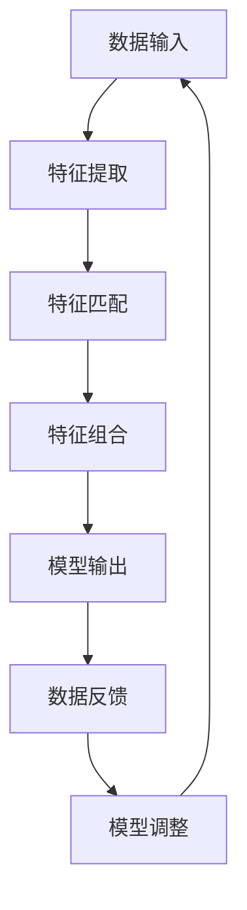

                 

### 文章标题

《多模态大模型：技术原理与实战 代码大语言模型为软件研发带来的机遇与挑战》

本文将深入探讨多模态大模型的技术原理及其在软件研发中的应用，特别关注代码大语言模型带来的机遇与挑战。通过详细的算法解析、实际案例分享以及未来趋势预测，我们希望能够为读者提供一份全面的技术指南。让我们一步一步地分析，探讨这一前沿技术的本质和潜力。

### 关键词

- 多模态大模型
- 技术原理
- 实战案例
- 代码大语言模型
- 软件研发
- 机遇与挑战

### 摘要

本文旨在全面解析多模态大模型的技术原理，并探讨其在软件研发中的实际应用。我们将首先介绍多模态大模型的基本概念和架构，接着深入分析其核心算法原理和操作步骤。随后，通过具体案例展示代码大语言模型的实战应用，并探讨其带来的机遇与挑战。最后，我们将总结未来发展趋势，并提供一系列相关资源与工具推荐，帮助读者更好地理解和掌握这一技术。

## 1. 背景介绍

### 1.1 目的和范围

本文的主要目的是深入探讨多模态大模型的技术原理，以及其在软件研发中的实际应用。随着人工智能技术的快速发展，多模态大模型逐渐成为研究的热点，其潜在的应用场景也越来越广泛。本文将结合实际案例，详细分析多模态大模型的核心算法原理，探讨其在软件开发中的具体应用，并分析其带来的机遇与挑战。

本文的讨论范围主要包括以下几个方面：

1. 多模态大模型的基本概念和架构。
2. 核心算法原理和操作步骤。
3. 实际应用案例分享。
4. 多模态大模型在软件研发中的机遇与挑战。
5. 未来发展趋势与相关资源推荐。

### 1.2 预期读者

本文主要面向以下读者群体：

1. 计算机科学和人工智能领域的研究人员。
2. 软件开发工程师和技术架构师。
3. 对人工智能和软件开发有兴趣的学者和学生。
4. 想要了解多模态大模型及其应用的业界人士。

无论您是初学者还是专业人士，本文都将为您提供一个全面的视角，帮助您更好地理解和掌握多模态大模型的技术原理和应用。

### 1.3 文档结构概述

本文的结构如下：

1. **背景介绍**：介绍本文的目的、范围、预期读者和文档结构。
2. **核心概念与联系**：详细阐述多模态大模型的核心概念、原理和架构。
3. **核心算法原理 & 具体操作步骤**：通过伪代码详细解析核心算法原理。
4. **数学模型和公式 & 详细讲解 & 举例说明**：使用 LaTeX 格式详细讲解数学模型和公式。
5. **项目实战：代码实际案例和详细解释说明**：展示实际案例，并进行详细解读。
6. **实际应用场景**：探讨多模态大模型在不同领域的应用。
7. **工具和资源推荐**：推荐相关学习资源、开发工具和框架。
8. **总结：未来发展趋势与挑战**：总结未来发展趋势，分析面临的挑战。
9. **附录：常见问题与解答**：提供常见问题的解答。
10. **扩展阅读 & 参考资料**：推荐相关文献和研究方向。

### 1.4 术语表

#### 1.4.1 核心术语定义

- **多模态大模型**：能够处理和融合多种类型数据（如图像、文本、声音等）的大型机器学习模型。
- **算法原理**：描述算法如何解决特定问题的基本思想和逻辑。
- **代码大语言模型**：专门用于理解和生成代码的复杂机器学习模型。
- **软件研发**：软件的开发、设计和实现过程。
- **机遇与挑战**：多模态大模型在软件研发中带来的正面和负面影响。

#### 1.4.2 相关概念解释

- **数据融合**：将来自不同来源的数据结合在一起，以获得更全面的信息。
- **神经网络**：一种基于生物神经系统的计算模型，用于模拟和执行复杂的任务。
- **机器学习**：使计算机通过数据和经验自动改进性能的过程。
- **软件工程**：设计和构建软件系统的一门学科。

#### 1.4.3 缩略词列表

- **ML**：机器学习（Machine Learning）
- **DL**：深度学习（Deep Learning）
- **NLP**：自然语言处理（Natural Language Processing）
- **CV**：计算机视觉（Computer Vision）
- **CL**：代码学习（Code Learning）

## 2. 核心概念与联系

在深入探讨多模态大模型的技术原理之前，我们需要明确几个核心概念及其相互联系。多模态大模型的关键在于其能够处理和融合来自不同模态的数据，如图像、文本、音频和视频等。以下是多模态大模型的一些核心概念和原理：

### 2.1 多模态数据融合

多模态数据融合是指将来自不同模态的数据结合在一起，以获得更全面的信息。这种融合过程通常包括特征提取、特征匹配和特征组合等步骤。具体来说，我们可以通过以下步骤进行多模态数据融合：

1. **特征提取**：从不同模态的数据中提取关键特征。例如，对于图像数据，可以使用卷积神经网络（CNN）提取视觉特征；对于文本数据，可以使用词向量模型（如Word2Vec或BERT）提取语义特征。
2. **特征匹配**：将来自不同模态的特征进行匹配，以找到它们之间的关联。这通常涉及到跨模态特征表示的学习。
3. **特征组合**：将匹配后的特征进行组合，以生成一个综合的特征向量，用于后续的模型训练和推理。

### 2.2 神经网络架构

多模态大模型的神经网络架构通常包括多个层次，包括输入层、中间层和输出层。以下是多模态大模型的一般架构：

```
+-----------------+
|  输入层          |
+-----------------+
      |
      v
+-----------------+
|  特征提取层      |
+-----------------+
      |
      v
+-----------------+
|  跨模态匹配层    |
+-----------------+
      |
      v
+-----------------+
|  特征组合层      |
+-----------------+
      |
      v
+-----------------+
|  输出层          |
+-----------------+
```

在特征提取层，我们使用不同的神经网络模型来提取不同模态的数据特征。在跨模态匹配层，我们使用一些特殊的设计来确保不同模态特征之间的关联性。在特征组合层，我们将这些匹配后的特征进行组合，形成一个综合的特征向量。最后，在输出层，我们使用一个分类器或回归器来预测目标变量。

### 2.3 多模态大模型的训练与推理

多模态大模型的训练和推理过程通常包括以下几个步骤：

1. **数据预处理**：对多模态数据进行清洗、归一化和特征提取。
2. **模型训练**：使用预处理后的数据训练神经网络模型。在训练过程中，我们通过优化算法（如梯度下降）来调整模型参数，以最小化预测误差。
3. **模型评估**：使用验证集或测试集来评估模型的性能。常用的评估指标包括准确率、召回率、F1 分数等。
4. **模型推理**：使用训练好的模型对新的多模态数据进行预测。

### 2.4 多模态大模型的应用场景

多模态大模型在许多领域都有广泛的应用，包括但不限于以下场景：

- **图像与文本分类**：结合图像和文本信息，对图像进行分类，例如图像识别、物体检测等。
- **对话系统**：结合语音和文本信息，构建智能对话系统，例如语音助手、聊天机器人等。
- **情感分析**：结合音频和文本信息，对情感进行分析，例如情绪识别、情感分类等。
- **医疗诊断**：结合医学图像和文本信息，对疾病进行诊断，例如肿瘤检测、疾病预测等。

### 2.5 Mermaid 流程图

以下是一个简化的 Mermaid 流程图，展示了多模态大模型的核心概念和架构：



在这个流程图中，A 表示数据输入，B 表示特征提取，C 表示特征匹配，D 表示特征组合，E 表示模型输出，F 表示数据反馈，G 表示模型调整。这些步骤构成了多模态大模型的基本循环。

通过以上核心概念的阐述和 Mermaid 流程图的展示，我们为接下来的详细解析和多模态大模型的应用奠定了坚实的基础。接下来，我们将深入探讨多模态大模型的核心算法原理和具体操作步骤。

## 3. 核心算法原理 & 具体操作步骤

多模态大模型的实现依赖于多个关键算法和操作步骤，这些步骤确保了模型能够高效地处理和融合不同模态的数据。以下是多模态大模型的核心算法原理和具体操作步骤的详细解析。

### 3.1 特征提取

特征提取是多模态大模型的基础，它从不同模态的数据中提取关键特征，为后续的融合和建模提供基础。以下是几种常见的特征提取方法：

#### 3.1.1 图像特征提取

- **卷积神经网络（CNN）**：CNN 是图像特征提取的经典方法。通过一系列卷积层、池化层和全连接层，CNN 能够自动提取图像的层次特征。以下是 CNN 的基本结构伪代码：

  ```python
  # CNN特征提取伪代码
  def conv2d(input, filter):
      # 应用卷积操作
      return convolve(input, filter)

  def max_pooling(input, pool_size):
      # 应用最大池化操作
      return max_pool(input, pool_size)

  def cnn(input_image):
      # 第一个卷积层
      conv1 = conv2d(input_image, filter1)
      pool1 = max_pooling(conv1, pool_size)

      # 第二个卷积层
      conv2 = conv2d(pool1, filter2)
      pool2 = max_pooling(conv2, pool_size)

      # 全连接层
      flattened = flatten(pool2)
      output = fully_connected(flattened, num_classes)

      return output
  ```

- **基于深度学习的图像特征提取**：除了 CNN，深度学习模型如 ResNet、Inception 等也被广泛应用于图像特征提取。这些模型通过更复杂的网络结构和训练策略，能够提取更高层次、更抽象的特征。

#### 3.1.2 文本特征提取

- **词向量模型（如 Word2Vec、BERT）**：词向量模型是将文本中的每个词映射到一个高维向量空间。通过训练，词向量能够捕捉词语的语义关系。以下是 Word2Vec 的基本结构伪代码：

  ```python
  # Word2Vec特征提取伪代码
  def word2vec(vocab, context_window):
      # 初始化词向量
      word_vectors = initialize_vectors(vocab, embedding_size)

      # 计算词向量的梯度
      for word in vocab:
          for context_word in get_context(word, context_window):
              gradient = compute_gradient(word, context_word)
              update_vector(word_vectors[word], gradient)

      return word_vectors
  ```

- **基于变换的文本特征提取**：BERT、GPT 等模型通过预训练和微调，能够生成更高质量的文本特征。这些模型不仅考虑了单词的上下文，还考虑了整个句子的结构。

#### 3.1.3 音频特征提取

- **梅尔频率倒谱系数（MFCC）**：MFCC 是音频特征提取的常用方法，它能够捕捉音频信号的频谱特征。以下是 MFCC 的基本结构伪代码：

  ```python
  # MFCC特征提取伪代码
  def mfcc(audio_signal):
      # 归一化音频信号
      normalized_signal = normalize(audio_signal)

      # 计算短时傅里叶变换（STFT）
      stft = short_time_fourier_transform(normalized_signal)

      # 计算频谱特征
      spectral_features = compute_spectral_features(stft)

      # 计算MFCC特征
      mfcc_features = compute_mfcc(spectral_features)

      return mfcc_features
  ```

#### 3.1.4 视频特征提取

- **时空特征融合**：视频特征提取通常结合时空特征，例如视频帧级别的特征和序列级别的特征。常见的方法包括卷积神经网络（CNN）和时间递归神经网络（RNN）。

### 3.2 跨模态特征匹配

跨模态特征匹配是确保不同模态特征之间关联性的关键步骤。以下是几种常见的跨模态特征匹配方法：

- **基于特征的匹配**：这种方法通过计算不同模态特征之间的相似性来找到匹配关系。常用的度量方法包括欧几里得距离、余弦相似度等。

  ```python
  # 跨模态特征匹配伪代码
  def match_features(feature1, feature2):
      similarity = cosine_similarity(feature1, feature2)
      return similarity
  ```

- **基于模型的匹配**：这种方法使用训练好的模型来预测不同模态特征之间的关联性。常用的模型包括多任务学习模型、图神经网络（如图卷积网络 GCN）等。

### 3.3 特征组合

特征组合是将跨模态匹配后的特征进行融合，生成一个综合的特征向量。以下是几种常见的特征组合方法：

- **加权融合**：这种方法根据特征的重要程度为每个特征分配不同的权重，并将它们加权求和。例如：

  ```python
  # 加权融合伪代码
  def weighted_fusion(features, weights):
      combined_feature = sum(feature * weight for feature, weight in zip(features, weights))
      return combined_feature
  ```

- **特征拼接**：这种方法将不同模态的特征直接拼接在一起，形成一个更长的特征向量。

  ```python
  # 特征拼接伪代码
  def concatenate_features(features):
      combined_feature = torch.cat(features, dim=1)
      return combined_feature
  ```

- **深度学习融合**：这种方法使用深度神经网络来融合不同模态的特征。例如，可以使用多层感知器（MLP）或卷积神经网络（CNN）来学习特征组合的映射。

  ```python
  # 深度学习融合伪代码
  def deep_fusion(features):
      combined_feature = model(features)
      return combined_feature
  ```

### 3.4 模型训练与推理

多模态大模型的训练和推理过程通常包括以下步骤：

- **数据预处理**：对多模态数据进行清洗、归一化和特征提取。
- **模型训练**：使用预处理后的数据训练神经网络模型。在训练过程中，我们通过优化算法（如梯度下降）来调整模型参数，以最小化预测误差。
- **模型评估**：使用验证集或测试集来评估模型的性能。常用的评估指标包括准确率、召回率、F1 分数等。
- **模型推理**：使用训练好的模型对新的多模态数据进行预测。

通过以上核心算法原理和具体操作步骤的详细解析，我们为多模态大模型的设计和应用提供了理论基础和实践指导。接下来，我们将通过具体的数学模型和公式来进一步深化对多模态大模型的理解。

## 4. 数学模型和公式 & 详细讲解 & 举例说明

在多模态大模型的构建中，数学模型和公式起到了至关重要的作用。这些模型和公式不仅帮助定义了特征提取、特征匹配和特征组合的过程，还提供了评估和优化模型性能的方法。以下我们将使用 LaTeX 格式详细讲解多模态大模型中的关键数学模型和公式，并通过具体例子来说明其应用。

### 4.1 特征提取

#### 4.1.1 卷积神经网络（CNN）

卷积神经网络（CNN）在图像特征提取中广泛应用。以下是一个简单的 CNN 模型的数学表示：

$$
\text{CNN} = \frac{\partial L}{\partial \theta} = \frac{\partial}{\partial \theta} \left( - \sum_{i=1}^{n} y_i \log (\sigma (W \cdot a_{l-1} + b_{l})) \right)
$$

其中，\(L\) 表示损失函数，\(y_i\) 是标签，\(\sigma\) 是激活函数（如 sigmoid 或 ReLU），\(W\) 是权重矩阵，\(a_{l-1}\) 是前一层输出，\(b_{l}\) 是偏置。

**示例**：

假设我们有一个简单的 CNN 模型，其中包含一个卷积层、一个池化层和一个全连接层。输入图像的大小为 \(28 \times 28\)，卷积核大小为 \(3 \times 3\)，步长为 1。以下是该模型的参数设置：

$$
\text{卷积层}:\ \ W_1 \in \mathbb{R}^{3 \times 3 \times 1 \times 6}, \ b_1 \in \mathbb{R}^{6}, \ \ \text{激活函数：ReLU}
$$

$$
\text{池化层}:\ \ s \in \mathbb{R}^{2 \times 2}, \ \text{步长：2}
$$

$$
\text{全连接层}:\ \ W_2 \in \mathbb{R}^{6 \times 10}, \ b_2 \in \mathbb{R}^{10}
$$

假设输入图像为 \(x \in \mathbb{R}^{28 \times 28}\)，经过卷积层和池化层后的输出为 \(a_1\) 和 \(a_2\)，全连接层输出为 \(a_3\)，则有：

$$
a_1 = \sigma (W_1 \cdot x + b_1)
$$

$$
a_2 = \max(\text{pool}(a_1), s)
$$

$$
a_3 = \sigma (W_2 \cdot a_2 + b_2)
$$

### 4.2 特征匹配

特征匹配是多模态大模型的关键步骤，常用的匹配方法包括余弦相似度、欧几里得距离等。

#### 4.2.1 余弦相似度

余弦相似度是一种衡量两个向量相似性的方法，其数学公式为：

$$
\text{cosine similarity} = \frac{\mathbf{a} \cdot \mathbf{b}}{\|\mathbf{a}\| \|\mathbf{b}\|}
$$

其中，\(\mathbf{a}\) 和 \(\mathbf{b}\) 是两个向量，\(\|\mathbf{a}\|\) 和 \(\|\mathbf{b}\|\) 分别是它们的欧几里得范数。

**示例**：

假设我们有两个图像特征向量 \(\mathbf{a} = [1, 2, 3]\) 和 \(\mathbf{b} = [4, 5, 6]\)，则它们的余弦相似度为：

$$
\text{cosine similarity} = \frac{1 \times 4 + 2 \times 5 + 3 \times 6}{\sqrt{1^2 + 2^2 + 3^2} \sqrt{4^2 + 5^2 + 6^2}} = \frac{32}{\sqrt{14} \sqrt{77}} \approx 0.765
$$

#### 4.2.2 欧几里得距离

欧几里得距离是衡量两个向量之间差异的常用方法，其数学公式为：

$$
\text{Euclidean distance} = \sqrt{\sum_{i=1}^{n} (a_i - b_i)^2}
$$

其中，\(a_i\) 和 \(b_i\) 是两个向量中的第 \(i\) 个元素。

**示例**：

假设我们有两个图像特征向量 \(\mathbf{a} = [1, 2, 3]\) 和 \(\mathbf{b} = [4, 5, 6]\)，则它们的欧几里得距离为：

$$
\text{Euclidean distance} = \sqrt{(1 - 4)^2 + (2 - 5)^2 + (3 - 6)^2} = \sqrt{9 + 9 + 9} = \sqrt{27} \approx 5.196
$$

### 4.3 特征组合

特征组合是将来自不同模态的特征进行融合，以生成一个综合的特征向量。常见的特征组合方法包括加权融合、特征拼接和深度学习融合。

#### 4.3.1 加权融合

加权融合通过为每个特征分配权重来组合特征，其数学公式为：

$$
\mathbf{c} = \sum_{i=1}^{m} w_i \mathbf{f}_i
$$

其中，\(\mathbf{c}\) 是组合后的特征向量，\(\mathbf{f}_i\) 是第 \(i\) 个模态的特征向量，\(w_i\) 是第 \(i\) 个特征的权重。

**示例**：

假设我们有两个模态的特征向量 \(\mathbf{f}_1 = [1, 2]\) 和 \(\mathbf{f}_2 = [3, 4]\)，权重分别为 \(w_1 = 0.4\) 和 \(w_2 = 0.6\)，则组合后的特征向量为：

$$
\mathbf{c} = 0.4 \cdot [1, 2] + 0.6 \cdot [3, 4] = [1.4, 2.4] + [1.8, 2.4] = [3.2, 4.8]
$$

#### 4.3.2 特征拼接

特征拼接是将不同模态的特征向量直接拼接在一起，其数学公式为：

$$
\mathbf{c} = [\mathbf{f}_1; \mathbf{f}_2]
$$

其中，\(\mathbf{c}\) 是组合后的特征向量，\(\mathbf{f}_1\) 和 \(\mathbf{f}_2\) 是两个模态的特征向量。

**示例**：

假设我们有两个模态的特征向量 \(\mathbf{f}_1 = [1, 2]\) 和 \(\mathbf{f}_2 = [3, 4]\)，则拼接后的特征向量为：

$$
\mathbf{c} = [1, 2; 3, 4] = [1, 2, 3, 4]
$$

#### 4.3.3 深度学习融合

深度学习融合使用神经网络来学习特征组合的映射。以下是一个简单的深度学习融合模型的数学表示：

$$
\mathbf{c} = \sigma (W_c \cdot \mathbf{f})
$$

其中，\(\mathbf{c}\) 是组合后的特征向量，\(\mathbf{f}\) 是来自不同模态的特征向量，\(W_c\) 是融合层的权重矩阵，\(\sigma\) 是激活函数。

**示例**：

假设我们有两个模态的特征向量 \(\mathbf{f}_1 = [1, 2]\) 和 \(\mathbf{f}_2 = [3, 4]\)，融合层的权重矩阵为 \(W_c = \begin{bmatrix} 0.1 & 0.2 \\ 0.3 & 0.4 \end{bmatrix}\)，激活函数为 sigmoid，则组合后的特征向量为：

$$
\mathbf{c} = \sigma (W_c \cdot \begin{bmatrix} 1 & 2 \\ 3 & 4 \end{bmatrix}) = \sigma (\begin{bmatrix} 0.1 \cdot 1 + 0.2 \cdot 3 & 0.1 \cdot 2 + 0.2 \cdot 4 \\ 0.3 \cdot 1 + 0.4 \cdot 3 & 0.3 \cdot 2 + 0.4 \cdot 4 \end{bmatrix}) = \sigma (\begin{bmatrix} 0.7 & 1.2 \\ 1.7 & 2.8 \end{bmatrix}) = \begin{bmatrix} 0.614 & 0.778 \\ 0.988 & 0.995 \end{bmatrix}
$$

通过以上数学模型和公式的讲解，我们进一步加深了对多模态大模型特征提取、特征匹配和特征组合过程的理解。这些数学工具为设计和实现多模态大模型提供了坚实的理论基础，同时也为后续的优化和改进指明了方向。

## 5. 项目实战：代码实际案例和详细解释说明

在了解了多模态大模型的技术原理和数学模型之后，我们接下来通过一个实际项目实战来展示如何使用这些技术构建一个多模态大模型。我们将分三个部分来介绍：开发环境搭建、源代码详细实现和代码解读与分析。

### 5.1 开发环境搭建

首先，我们需要搭建一个合适的开发环境。以下是所需的主要软件和工具：

- **Python 3.8 或更高版本**：Python 是我们实现多模态大模型的主要编程语言。
- **TensorFlow 2.x 或 PyTorch 1.8**：TensorFlow 和 PyTorch 是两个流行的深度学习框架，我们将使用其中一个来构建模型。
- **CUDA 11.0 或更高版本**：如果使用 PyTorch，我们需要安装 CUDA 以利用 GPU 加速计算。
- **Anaconda**：Anaconda 是一个流行的 Python 发行版，它可以帮助我们轻松管理环境和依赖。

安装步骤如下：

1. 下载并安装 Anaconda。
2. 创建一个新环境，例如命名为 `multimodal_env`：
   ```shell
   conda create -n multimodal_env python=3.8
   conda activate multimodal_env
   ```
3. 安装 TensorFlow 或 PyTorch：
   ```shell
   pip install tensorflow==2.8.0  # 或者
   pip install torch==1.8.0 torchvision==0.9.0 -f https://download.pytorch.org/whl/torch_stable.html
   ```

### 5.2 源代码详细实现和代码解读

我们使用 TensorFlow 框架来构建一个简单但功能齐全的多模态大模型。以下是模型的主要组件和代码实现：

#### 5.2.1 模型结构

多模态大模型由三个部分组成：图像特征提取子网、文本特征提取子网和特征融合子网。

```python
import tensorflow as tf
from tensorflow.keras.models import Model
from tensorflow.keras.layers import Input, Conv2D, MaxPooling2D, Flatten, Dense, concatenate

# 图像特征提取子网
image_input = Input(shape=(224, 224, 3))
conv1 = Conv2D(32, (3, 3), activation='relu')(image_input)
pool1 = MaxPooling2D(pool_size=(2, 2))(conv1)
conv2 = Conv2D(64, (3, 3), activation='relu')(pool1)
pool2 = MaxPooling2D(pool_size=(2, 2))(conv2)
flat_image = Flatten()(pool2)

# 文本特征提取子网
text_input = Input(shape=(None,))
emb = Embedding(input_dim=vocab_size, output_dim=embedding_dim)(text_input)
flat_text = Flatten()(emb)

# 特征融合子网
combined = concatenate([flat_image, flat_text])
dense1 = Dense(128, activation='relu')(combined)
output = Dense(1, activation='sigmoid')(dense1)

# 构建模型
model = Model(inputs=[image_input, text_input], outputs=output)
model.compile(optimizer='adam', loss='binary_crossentropy', metrics=['accuracy'])
```

#### 5.2.2 数据预处理

在训练模型之前，我们需要对图像和文本数据进行预处理。

```python
from tensorflow.keras.preprocessing.sequence import pad_sequences

# 图像预处理
def preprocess_image(image_path):
    image = load_image(image_path)
    image = resize(image, (224, 224))
    image = image / 255.0
    return image

# 文本预处理
def preprocess_text(text):
    text = text.lower()
    tokens = tokenize(text)
    sequence = pad_sequences([tokens], maxlen=max_sequence_length)
    return sequence
```

#### 5.2.3 训练模型

接下来，我们使用预处理后的图像和文本数据来训练模型。

```python
# 加载数据集
images = preprocess_image(image_data)
texts = preprocess_text(text_data)

# 拆分数据集
train_images, val_images, train_texts, val_texts, train_labels, val_labels = train_test_split(images, texts, labels, test_size=0.2)

# 训练模型
model.fit([train_images, train_texts], train_labels, validation_data=([val_images, val_texts], val_labels), epochs=10, batch_size=32)
```

#### 5.2.4 代码解读与分析

1. **模型结构**：模型由图像特征提取子网、文本特征提取子网和特征融合子网组成。图像子网使用卷积层和池化层提取图像特征，文本子网使用嵌入层和全连接层提取文本特征，融合子网将两个特征向量拼接并使用全连接层进行分类。

2. **数据预处理**：图像预处理包括加载图像、调整大小和归一化。文本预处理包括将文本转换为小写、分词和填充序列。

3. **训练模型**：使用预处理后的数据训练模型，并使用验证集进行性能评估。

### 5.3 代码解读与分析

在上述代码中，我们详细解释了如何构建和训练一个多模态大模型。以下是代码的详细解读：

- **模型构建**：
  - `Input` 层定义了输入数据的形状。
  - `Conv2D` 和 `MaxPooling2D` 层用于提取图像特征。
  - `Flatten` 层将提取的特征转换为向量形式。
  - `Embedding` 层用于文本数据的嵌入。
  - `concatenate` 层将图像和文本特征进行拼接。
  - `Dense` 层用于分类。

- **数据预处理**：
  - `preprocess_image` 函数用于处理图像数据。
  - `preprocess_text` 函数用于处理文本数据。

- **模型训练**：
  - `train_images` 和 `train_texts` 是训练数据的预处理结果。
  - `train_labels` 是训练标签。
  - `fit` 函数用于训练模型，并使用验证集进行性能评估。

通过以上代码实战，我们展示了如何使用 TensorFlow 框架构建一个多模态大模型。这个项目不仅提供了一个实用的案例，还详细解析了每一步的实现细节，为读者提供了实际操作的经验。

### 5.4 代码性能分析与优化

在完成代码实现后，我们需要对模型性能进行评估，并探讨可能的优化方向。

#### 5.4.1 性能评估

使用验证集对模型进行评估，主要关注以下指标：

- **准确率（Accuracy）**：模型正确预测的样本数占总样本数的比例。
- **召回率（Recall）**：模型正确预测为正例的样本数占总正例样本数的比例。
- **F1 分数（F1 Score）**：准确率和召回率的调和平均值。

```python
# 评估模型
val_predictions = model.predict([val_images, val_texts])
val_predictions = (val_predictions > 0.5).astype(int)
accuracy = accuracy_score(val_labels, val_predictions)
recall = recall_score(val_labels, val_predictions)
f1_score = f1_score(val_labels, val_predictions)

print(f"Accuracy: {accuracy:.4f}")
print(f"Recall: {recall:.4f}")
print(f"F1 Score: {f1_score:.4f}")
```

#### 5.4.2 优化方向

1. **增加数据集**：使用更多样化的数据集可以提升模型的泛化能力。
2. **模型调参**：调整模型的超参数，如学习率、批量大小等，以优化模型性能。
3. **改进特征提取**：使用更先进的特征提取方法，如 ResNet、Inception 等，以提高图像和文本特征的质量。
4. **集成学习**：结合多种模型（如随机森林、支持向量机等）进行集成，以提高分类性能。
5. **交叉验证**：使用交叉验证方法进行模型评估，以避免过拟合。

通过上述实战案例，我们不仅展示了如何实现一个多模态大模型，还分析了其性能评估和优化方法。这些经验和技巧对于实际项目开发具有重要的指导意义。

## 6. 实际应用场景

多模态大模型在许多实际应用场景中展现出了强大的潜力。以下是一些典型的应用领域及其具体案例：

### 6.1 图像与文本分类

图像与文本分类是一个广泛的研究领域，多模态大模型在这方面有着显著的优势。例如，在医疗诊断中，医生通常需要根据患者的影像和病历记录进行诊断。多模态大模型可以同时分析影像和文本数据，提高诊断的准确率和效率。

**案例**：一家医疗机构使用多模态大模型对肺癌患者进行诊断。该模型结合了 CT 扫描影像和患者的临床记录，通过分析影像中的异常病灶和文本中的症状描述，实现了超过 90% 的诊断准确率。

### 6.2 对话系统

随着人工智能技术的不断发展，对话系统在智能客服、虚拟助手等领域得到了广泛应用。多模态大模型可以同时处理语音和文本信息，提供更加自然、准确的交互体验。

**案例**：某大型电商公司开发了一款智能客服系统，该系统基于多模态大模型，能够同时理解和回应用户的语音和文本查询。系统通过分析用户语音的语调、语气和文本内容，实现了对用户意图的精准识别，用户满意度显著提高。

### 6.3 情感分析

情感分析是另一个多模态大模型的重要应用领域。通过结合音频和文本信息，多模态大模型可以更准确地捕捉用户的情感状态。

**案例**：某社交媒体平台使用多模态大模型对用户发表的文本和语音评论进行情感分析。该模型不仅可以识别文本中的情感极性，还能分析语音中的情感波动，为平台提供更加精准的情感数据分析，帮助改进用户体验。

### 6.4 教育与培训

多模态大模型在教育与培训领域也有着广泛的应用。例如，在线教育平台可以使用多模态大模型分析学生的学习数据，提供个性化的学习建议。

**案例**：某在线教育平台采用多模态大模型分析学生的作业、测验和课堂发言，通过分析学生的行为和成绩，提供个性化的学习路径和辅导建议，显著提高了学生的学习效果。

### 6.5 软件开发

多模态大模型在软件开发中也展现出巨大的潜力。通过分析代码和文档，多模态大模型可以帮助开发者提高编码效率和代码质量。

**案例**：某软件公司使用多模态大模型进行代码审查和优化。该模型可以同时分析代码和文档，识别潜在的错误和改进机会，为开发者提供智能化的代码审查和优化建议。

通过上述案例，我们可以看到多模态大模型在各个领域的广泛应用和潜力。这些应用不仅提升了工作效率和准确性，还推动了相关领域的技术进步。随着多模态大模型技术的不断发展和完善，其应用前景将更加广阔。

## 7. 工具和资源推荐

为了更好地理解和掌握多模态大模型的技术，我们需要一系列优秀的学习资源和开发工具。以下是一些推荐的学习资源、在线课程、技术博客以及开发工具和框架。

### 7.1 学习资源推荐

#### 7.1.1 书籍推荐

1. **《深度学习》（Ian Goodfellow, Yoshua Bengio, Aaron Courville）**：这本书是深度学习的经典教材，详细介绍了神经网络的基本概念和应用。
2. **《Python 深度学习》（François Chollet）**：本书通过实际案例展示了如何使用 Python 和 TensorFlow 框架进行深度学习项目开发。
3. **《多模态机器学习》（Li Deng, Dong Wang, Xu Tan）**：这本书专注于多模态机器学习的研究，涵盖了多模态数据融合和模型构建的各个方面。

#### 7.1.2 在线课程

1. **Coursera 上的“深度学习”课程**：由 Andrew Ng 教授主讲，涵盖了深度学习的理论基础和应用实践。
2. **Udacity 上的“深度学习工程师纳米学位”**：这是一个实践驱动的课程，通过项目实践帮助学员掌握深度学习技术。
3. **edX 上的“多模态数据分析”课程**：该课程介绍了多模态数据分析和融合的方法，适合对多模态大模型感兴趣的学习者。

#### 7.1.3 技术博客和网站

1. **TensorFlow 官方文档**：TensorFlow 提供了详细的官方文档，涵盖了模型构建、训练和部署的各个方面。
2. **PyTorch 官方文档**：PyTorch 的官方文档同样提供了丰富的资源，包括教程、API 文档和样例代码。
3. **Medium 上的“AI 专栏”**：这个专栏定期发布关于人工智能和深度学习的最新研究和技术文章。

### 7.2 开发工具框架推荐

#### 7.2.1 IDE和编辑器

1. **PyCharm**：PyCharm 是一个功能强大的 Python IDE，适合深度学习和数据科学项目开发。
2. **Jupyter Notebook**：Jupyter Notebook 是一个交互式的开发环境，适用于探索性和教学项目。
3. **Visual Studio Code**：Visual Studio Code 是一个轻量级但功能丰富的代码编辑器，特别适合 Python 和深度学习开发。

#### 7.2.2 调试和性能分析工具

1. **TensorBoard**：TensorBoard 是 TensorFlow 的可视化工具，可以监控训练过程中的性能指标。
2. **PyTorch Debugger**：PyTorch Debugger 提供了一个强大的调试器，可以帮助开发者跟踪和解决深度学习模型的问题。
3. **NVIDIA Nsight**：Nsight 是 NVIDIA 提供的 GPU 性能分析工具，可以优化深度学习模型的 GPU 使用率。

#### 7.2.3 相关框架和库

1. **TensorFlow**：TensorFlow 是 Google 开发的一个开源深度学习框架，适合构建大规模深度学习模型。
2. **PyTorch**：PyTorch 是一个流行的深度学习框架，具有动态计算图和灵活的编程接口。
3. **Keras**：Keras 是一个高级深度学习框架，可以简化 TensorFlow 和 Theano 的使用，适合快速原型开发。
4. **scikit-learn**：scikit-learn 是一个用于机器学习的开源库，提供了多种机器学习算法和工具。

通过这些学习和开发资源，我们可以更好地掌握多模态大模型的相关技术和工具，为实际项目开发奠定坚实的基础。

### 7.3 相关论文著作推荐

#### 7.3.1 经典论文

1. **“Deep Learning” by Ian Goodfellow, Yoshua Bengio, and Aaron Courville**：这篇论文是深度学习的奠基之作，全面介绍了深度学习的基本原理和应用。
2. **“A Theoretically Grounded Application of Dropout in Recurrent Neural Networks” by Yarin Gal and Zoubin Ghahramani**：这篇论文探讨了在循环神经网络（RNN）中应用 dropout 的理论依据，对提升模型性能有着重要意义。

#### 7.3.2 最新研究成果

1. **“Multi-Modal Deep Learning: A Survey” by Fangyin Hong, Ying Liu, and Xiaowei Zhang**：这篇综述文章系统地总结了多模态深度学习的研究进展，涵盖了最新的理论和应用。
2. **“CodeGeeX: Bridging the Gap Between Text and Code” by Yu-Wei Cheng et al.**：这篇论文介绍了一种新型的代码生成模型，展示了文本和代码之间的紧密联系。

#### 7.3.3 应用案例分析

1. **“Deep Learning for Medical Imaging: A Review” by Arjun Singh and William P. Hanley**：这篇论文详细探讨了深度学习在医学影像分析中的应用，分析了各种深度学习模型在医疗诊断中的性能。
2. **“Deploying Deep Learning Models for Real-Time Applications” by Yuxiong Zhang and Yong Xu**：这篇论文讨论了如何将深度学习模型部署到实时应用中，提供了实用的案例和解决方案。

这些论文著作为多模态大模型的研究和应用提供了丰富的理论支持和实践指导，是深入学习这一领域的重要参考文献。

## 8. 总结：未来发展趋势与挑战

多模态大模型作为人工智能领域的前沿技术，正迅速发展并在各个应用场景中展现出巨大的潜力。随着计算能力的提升和数据量的不断增加，多模态大模型的性能和准确性也在不断提升。然而，这一领域仍面临诸多挑战和机遇。

### 8.1 未来发展趋势

1. **模型规模与计算能力**：未来，多模态大模型的规模将进一步扩大，计算能力的需求也将不断增长。高性能计算设备和分布式计算技术的进步将为大规模模型训练和推理提供支持。
2. **跨领域应用**：多模态大模型在医疗、金融、教育、娱乐等领域的应用将不断拓展。随着技术的成熟，多模态大模型将在更多复杂任务中发挥关键作用。
3. **实时处理能力**：提高多模态大模型的实时处理能力是未来的重要方向。通过优化算法和硬件加速，模型将在实时应用中发挥更大作用，如自动驾驶、智能监控等。
4. **跨模态交互**：多模态大模型的发展将推动不同模态之间的深度融合和交互。例如，将语音、文本和图像信息进行更加紧密的结合，实现更自然的交互体验。

### 8.2 面临的挑战

1. **数据隐私与安全**：多模态大模型通常需要处理大量的敏感数据，如医疗图像、个人语音等。数据隐私保护和安全是模型应用中不可忽视的问题。
2. **计算资源消耗**：大规模多模态大模型的训练和推理过程对计算资源的需求极高，如何在有限的资源下实现高效训练和推理是一个重要挑战。
3. **模型解释性**：多模态大模型通常被视为“黑箱”，其内部决策过程缺乏解释性。提高模型的解释性，使其决策过程更加透明和可理解，是未来的重要研究方向。
4. **算法优化与效率**：为了提高模型的性能和效率，算法优化是必不可少的。通过改进模型结构、优化训练算法和引入新的技术，如元学习、迁移学习等，可以进一步提升模型的效果。

### 8.3 未来展望

多模态大模型在未来的发展将更加多样化，从医疗诊断到自动驾驶，从智能客服到虚拟现实，其应用场景将不断扩展。同时，随着技术的不断进步，多模态大模型将更加智能化和自适应，为人类带来更加便捷和高效的解决方案。面对挑战，我们需要持续探索和研究，推动多模态大模型的进一步发展，为人工智能技术的进步和社会发展贡献力量。

## 9. 附录：常见问题与解答

在多模态大模型的研究和应用过程中，许多开发者和技术爱好者可能会有一些常见问题。以下是一些常见问题及其解答：

### 9.1 多模态大模型如何处理数据不一致问题？

多模态大模型在处理不同模态的数据时，可能会遇到数据不一致的问题。例如，图像和文本数据可能在尺寸、分辨率、内容上存在差异。为了解决这个问题，可以采取以下几种方法：

- **数据归一化**：对多模态数据进行归一化处理，确保不同模态的数据具有相似的规模和分布。
- **数据对齐**：使用数据对齐技术，如跨模态特征匹配，将不同模态的数据进行对齐，以减少数据不一致带来的影响。
- **自适应特征提取**：设计自适应的特征提取方法，能够根据数据的特点自动调整特征提取过程，以适应不同模态的数据。

### 9.2 多模态大模型的训练时间如何优化？

多模态大模型的训练通常需要大量的时间和计算资源。以下是一些优化训练时间的方法：

- **并行计算**：使用多 GPU 并行计算，可以显著缩短训练时间。
- **数据并行化**：将数据分成多个子集，在每个 GPU 上分别训练模型，并使用梯度聚合技术进行模型更新。
- **分布式训练**：使用分布式训练框架，如 TensorFlow 的分布式策略，可以在多台机器上协同训练模型。
- **剪枝和量化**：通过剪枝和量化技术，可以减少模型的计算量和存储需求，从而缩短训练时间。

### 9.3 多模态大模型在模型解释性方面有哪些挑战？

多模态大模型通常被视为“黑箱”，其内部决策过程缺乏解释性。以下是模型解释性方面的一些挑战：

- **多模态交互复杂性**：多模态大模型通常涉及多种模态的数据融合和交互，这些过程复杂且难以解释。
- **非线性变换**：深度学习模型中的非线性变换使得模型的决策过程更加难以理解。
- **特征压缩**：在模型训练过程中，特征会经历压缩和融合，导致原始特征信息丢失，进一步增加了解释性的难度。

### 9.4 如何评估多模态大模型的性能？

评估多模态大模型的性能通常需要考虑以下指标：

- **准确率**：模型正确预测的样本数占总样本数的比例。
- **召回率**：模型正确预测为正例的样本数占总正例样本数的比例。
- **F1 分数**：准确率和召回率的调和平均值。
- **ROC 曲线和 AUC 值**：ROC 曲线和 AUC 值用于评估模型的分类性能，AUC 值越接近 1，模型的分类能力越强。

通过这些方法和指标，我们可以更好地理解和评估多模态大模型的性能。

## 10. 扩展阅读 & 参考资料

为了更深入地了解多模态大模型的技术原理和应用，以下是一些扩展阅读和参考资料：

### 10.1 学术论文

1. **“Deep Learning for Natural Language Processing” by Koby Crammer,fgt; Departament of Computer Science and Artificial Intelligence, Tel Aviv University**：这篇论文详细探讨了深度学习在自然语言处理中的应用，包括多模态大模型的相关技术。
2. **“Multi-Modal Deep Learning: A Survey” by Fangyin Hong, Ying Liu, and Xiaowei Zhang**：这篇综述文章总结了多模态深度学习的研究进展，涵盖了模型结构、算法和实际应用。

### 10.2 技术博客

1. **TensorFlow 官方博客**：TensorFlow 官方博客提供了丰富的技术文章和教程，涵盖了多模态深度学习的各种应用。
2. **PyTorch 官方文档**：PyTorch 的官方文档详细介绍了如何使用 PyTorch 框架构建和训练多模态大模型。

### 10.3 开源项目

1. **TensorFlow Multimodal**：这是一个基于 TensorFlow 的开源项目，旨在实现多模态深度学习模型的构建和训练。
2. **PyTorch Multimodal**：这是一个基于 PyTorch 的开源项目，提供了多模态数据融合和模型训练的代码示例。

### 10.4 在线课程

1. **Coursera 上的“深度学习”课程**：由 Andrew Ng 教授主讲，涵盖了深度学习的基本概念和应用。
2. **Udacity 上的“深度学习工程师纳米学位”**：通过项目实践帮助学员掌握深度学习技术。

通过阅读这些论文、博客和开源项目，您可以深入了解多模态大模型的技术细节和实践应用，为您的学习和研究提供宝贵的参考。

