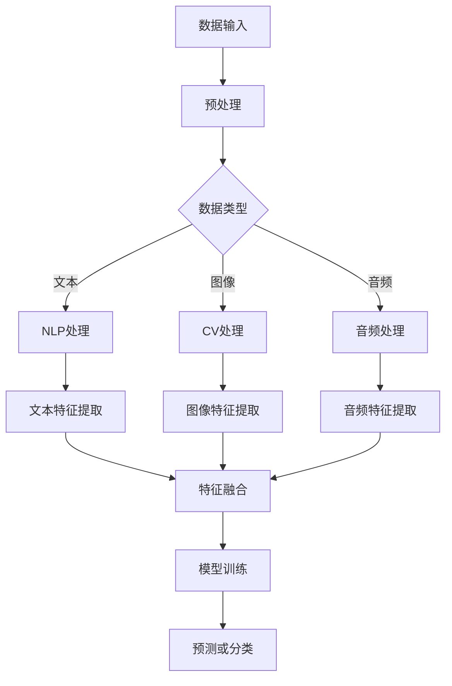

                 

# 多模态大模型：技术原理与实战 使用Flask框架进行API开发

> 关键词：多模态大模型、技术原理、实战、Flask、API开发

> 摘要：本文将深入探讨多模态大模型的技术原理及其在现实中的应用，特别是使用Flask框架进行API开发的实战技巧。我们将从基本概念出发，逐步讲解多模态大模型的原理，最后通过具体案例展示如何利用Flask实现高效、可靠的多模态API。

## 1. 背景介绍

### 1.1 目的和范围

本文旨在为读者提供一个全面的多模态大模型技术原理及其实战应用的讲解。我们将重点关注以下内容：

- **多模态大模型的基本概念**：介绍多模态数据的定义和常见的多模态数据类型。
- **技术原理**：深入探讨多模态大模型的原理，包括数据处理、特征提取和模型训练。
- **Flask框架**：介绍Flask框架的基本用法，以及如何用它来开发API。
- **实战应用**：通过具体案例，展示如何使用Flask框架实现多模态API的开发和部署。

### 1.2 预期读者

本文适合以下读者群体：

- 对人工智能和多模态数据处理感兴趣的初学者和专业人士。
- 具有一定编程基础，希望了解如何使用Flask框架开发API的开发者。
- 想要在项目中应用多模态大模型的业务人员和数据科学家。

### 1.3 文档结构概述

本文将按照以下结构展开：

1. **背景介绍**：介绍本文的目的、预期读者和文档结构。
2. **核心概念与联系**：讲解多模态大模型的基本概念和相关架构。
3. **核心算法原理 & 具体操作步骤**：详细阐述多模态大模型的算法原理和操作步骤。
4. **数学模型和公式 & 详细讲解 & 举例说明**：介绍多模态大模型中的数学模型和公式。
5. **项目实战：代码实际案例和详细解释说明**：通过实战案例展示Flask框架的使用。
6. **实际应用场景**：探讨多模态大模型在现实中的应用。
7. **工具和资源推荐**：推荐相关学习资源和开发工具。
8. **总结：未来发展趋势与挑战**：总结当前技术趋势和面临的挑战。
9. **附录：常见问题与解答**：回答读者可能遇到的问题。
10. **扩展阅读 & 参考资料**：提供进一步学习的资源。

### 1.4 术语表

#### 1.4.1 核心术语定义

- **多模态大模型**：能够处理多种类型数据的深度学习模型，如文本、图像、音频等。
- **Flask**：一个轻量级的Web应用程序框架，用于开发Web服务和API。
- **API**：应用程序接口，用于不同软件系统之间的交互和数据共享。

#### 1.4.2 相关概念解释

- **多模态数据处理**：将多种类型的数据（如文本、图像、音频）转换为模型可以处理的格式。
- **特征提取**：从原始数据中提取出对模型有用的特征。
- **模型训练**：使用训练数据调整模型参数，使其能够准确预测或分类。

#### 1.4.3 缩略词列表

- **API**：应用程序接口（Application Programming Interface）
- **ML**：机器学习（Machine Learning）
- **DL**：深度学习（Deep Learning）
- **NLP**：自然语言处理（Natural Language Processing）
- **CV**：计算机视觉（Computer Vision）

## 2. 核心概念与联系

在深入了解多模态大模型之前，我们需要先理解一些核心概念和它们之间的关系。以下是一个用Mermaid绘制的流程图，展示了多模态数据处理的主要步骤和它们之间的联系。



### 2.1 多模态数据处理

**多模态数据处理** 是将不同类型的数据（文本、图像、音频等）转换成计算机可以理解和处理的格式。这个过程通常包括以下步骤：

1. **数据采集**：收集不同类型的数据源，如文本、图像和音频。
2. **预处理**：对原始数据进行清洗和格式化，确保数据质量。
3. **特征提取**：从原始数据中提取出对模型有用的特征。
4. **特征融合**：将不同类型的特征整合成一个统一的特征向量。

### 2.2 特征提取

**特征提取** 是多模态数据处理中的一个关键步骤。以下是对文本、图像和音频特征提取的简要介绍：

- **文本特征提取**：常用的方法包括词袋模型（Bag of Words）、TF-IDF（Term Frequency-Inverse Document Frequency）和Word2Vec（词嵌入）。
- **图像特征提取**：可以使用卷积神经网络（CNN）提取图像特征，如边缘、纹理和形状。
- **音频特征提取**：可以使用自动特征提取方法，如梅尔频率倒谱系数（MFCC）和谱图。

### 2.3 特征融合

**特征融合** 是将不同类型的特征合并成一个统一特征向量的过程。以下是一些常用的特征融合方法：

- **直接融合**：将不同类型的特征拼接在一起，形成一个更长的特征向量。
- **加权融合**：根据不同特征的重要性给它们分配不同的权重，然后进行加权融合。
- **层次融合**：先分别处理不同类型的特征，然后将处理结果进行融合。

## 3. 核心算法原理 & 具体操作步骤

### 3.1 模型选择

在选择多模态大模型时，需要考虑以下因素：

- **任务类型**：例如，文本分类、图像识别或音频情感分析。
- **数据规模**：大规模数据通常需要使用更复杂的模型。
- **计算资源**：需要根据计算能力选择适合的模型。

一个常见的选择是使用基于深度学习的模型，如卷积神经网络（CNN）和循环神经网络（RNN）的组合。以下是一个简单的伪代码，用于构建一个多模态大模型：

```python
# 构建多模态大模型的伪代码
model = MultiModalModel()
model.add(CNN_for_images)
model.add(RNN_for_text)
model.add(MFCC_for_audio)
model.compile(optimizer='adam', loss='categorical_crossentropy', metrics=['accuracy'])
```

### 3.2 数据预处理

在开始模型训练之前，需要对数据进行预处理。以下是一个数据预处理流程的伪代码：

```python
# 数据预处理伪代码
def preprocess_data(data):
    # 文本预处理
    text_data = preprocess_text(data['text'])
    # 图像预处理
    image_data = preprocess_images(data['images'])
    # 音频预处理
    audio_data = preprocess_audio(data['audio'])
    return {'text': text_data, 'images': image_data, 'audio': audio_data}

data = load_data()
processed_data = preprocess_data(data)
```

### 3.3 模型训练

在预处理数据后，可以使用以下伪代码进行模型训练：

```python
# 模型训练伪代码
model.fit(
    x=processed_data['text'], y=processed_data['images'], epochs=10,
    validation_data=(val_processed_data['text'], val_processed_data['images'])
)
```

### 3.4 模型评估

在模型训练完成后，我们需要对其进行评估，以下是一个简单的模型评估伪代码：

```python
# 模型评估伪代码
score = model.evaluate(test_processed_data['text'], test_processed_data['images'])
print(f'Test loss: {score[0]}, Test accuracy: {score[1]}')
```

## 4. 数学模型和公式 & 详细讲解 & 举例说明

### 4.1 多模态大模型的数学模型

多模态大模型通常涉及多个数学模型，包括但不限于：

- **卷积神经网络（CNN）**：用于图像特征提取。
- **循环神经网络（RNN）**：用于文本序列处理。
- **梅尔频率倒谱系数（MFCC）**：用于音频特征提取。

### 4.2 卷积神经网络（CNN）

卷积神经网络（CNN）是一种常用于图像特征提取的神经网络。以下是一个CNN的数学模型和公式：

$$
h_{l}^{(i)} = \sigma \left( \sum_{k} w_{k}^{(l)} \cdot a_{l-1}^{(k)} + b_{l} \right)
$$

其中：

- \( h_{l}^{(i)} \) 是第 \( l \) 层第 \( i \) 个神经元的激活值。
- \( \sigma \) 是激活函数，常用的有ReLU和Sigmoid。
- \( w_{k}^{(l)} \) 是第 \( l \) 层第 \( k \) 个权重。
- \( a_{l-1}^{(k)} \) 是第 \( l-1 \) 层第 \( k \) 个神经元的激活值。
- \( b_{l} \) 是第 \( l \) 层的偏置。

### 4.3 循环神经网络（RNN）

循环神经网络（RNN）是一种用于处理序列数据的神经网络。以下是一个RNN的数学模型和公式：

$$
h_{t} = \sigma \left( W_h \cdot [h_{t-1}, x_t] + b_h \right)
$$

$$
o_{t} = \sigma \left( W_o \cdot h_t + b_o \right)
$$

其中：

- \( h_{t} \) 是第 \( t \) 个时间步的隐藏状态。
- \( x_{t} \) 是第 \( t \) 个时间步的输入。
- \( W_h \) 是隐藏状态权重。
- \( W_o \) 是输出权重。
- \( b_h \) 和 \( b_o \) 是隐藏状态和输出的偏置。
- \( \sigma \) 是激活函数，常用的有ReLU和Sigmoid。

### 4.4 梅尔频率倒谱系数（MFCC）

梅尔频率倒谱系数（MFCC）是一种用于音频特征提取的方法。以下是一个MFCC的数学模型和公式：

$$
MCCF(k) = \sum_{i=0}^{N-1} a_i \cdot \cos \left( \frac{2\pi k}{N} + \theta_i \right)
$$

其中：

- \( MCCF(k) \) 是第 \( k \) 个梅尔频率倒谱系数。
- \( a_i \) 是第 \( i \) 个幅度值。
- \( N \) 是窗函数的长度。
- \( \theta_i \) 是窗函数的相位。

### 4.5 举例说明

假设我们有一个包含文本、图像和音频的多模态数据集，以下是一个简单的示例，展示如何使用多模态大模型对这些数据进行处理：

```python
# 示例：使用多模态大模型处理数据
text = "这是一个示例文本。"
image = "示例图像.jpg"
audio = "示例音频.wav"

# 预处理数据
processed_text = preprocess_text(text)
processed_image = preprocess_image(image)
processed_audio = preprocess_audio(audio)

# 构建和训练模型
model = build_model()
model.fit([processed_text, processed_image, processed_audio], labels)

# 进行预测
predictions = model.predict([processed_text, processed_image, processed_audio])
```

## 5. 项目实战：代码实际案例和详细解释说明

### 5.1 开发环境搭建

在开始项目之前，我们需要搭建一个合适的环境。以下是一个基本的开发环境搭建步骤：

1. **安装Python**：确保安装了Python 3.6及以上版本。
2. **安装Flask**：使用pip安装Flask：

   ```bash
   pip install flask
   ```

3. **安装其他依赖**：根据项目需求安装其他依赖，例如TensorFlow、OpenCV和Librosa。

### 5.2 源代码详细实现和代码解读

以下是一个简单的Flask应用，用于处理多模态数据并返回预测结果。

```python
# app.py

from flask import Flask, request, jsonify
from multi_modal_model import MultiModalModel

app = Flask(__name__)

# 加载预训练的多模态大模型
model = MultiModalModel()
model.load_model('multi_modal_model.h5')

@app.route('/predict', methods=['POST'])
def predict():
    # 从请求中获取文本、图像和音频数据
    data = request.get_json()
    text = data['text']
    image = data['image']
    audio = data['audio']
    
    # 预处理数据
    processed_text = preprocess_text(text)
    processed_image = preprocess_image(image)
    processed_audio = preprocess_audio(audio)
    
    # 使用模型进行预测
    prediction = model.predict([processed_text, processed_image, processed_audio])
    
    # 返回预测结果
    return jsonify({'prediction': prediction.tolist()})

if __name__ == '__main__':
    app.run(debug=True)
```

### 5.3 代码解读与分析

1. **导入模块**：首先，我们导入所需的模块，包括Flask框架和自定义的多模态模型。
2. **加载模型**：使用预训练的多模态大模型，并加载预训练的权重。
3. **定义路由**：定义一个路由`/predict`，处理POST请求，接收包含文本、图像和音频数据的JSON。
4. **预处理数据**：对接收到的数据进行预处理，包括文本、图像和音频的预处理。
5. **预测**：使用预处理后的数据，通过多模态模型进行预测。
6. **返回结果**：将预测结果以JSON格式返回。

这个简单的Flask应用展示了如何将多模态大模型集成到Web服务中。在实际项目中，我们还需要考虑更多的错误处理、性能优化和安全问题。

## 6. 实际应用场景

多模态大模型在多个实际应用场景中表现出色，以下是一些常见的应用：

- **智能问答系统**：结合文本和图像，提供更准确的回答。
- **医疗诊断**：结合医学图像和患者文本数据，辅助医生进行疾病诊断。
- **视频分析**：结合视频帧和音频，用于动作识别和情感分析。
- **社交媒体分析**：结合用户文本和图像，用于情感分析和推荐系统。

在实际应用中，多模态大模型的关键优势在于能够处理多种类型的数据，提供更全面和准确的决策支持。

## 7. 工具和资源推荐

### 7.1 学习资源推荐

#### 7.1.1 书籍推荐

- 《深度学习》（Goodfellow, Bengio, Courville）: 提供了深度学习的全面介绍。
- 《Python深度学习》（François Chollet）: 专注于使用Python和Keras进行深度学习的实践。

#### 7.1.2 在线课程

- Coursera的“深度学习专项课程”由Andrew Ng教授主讲。
- Udacity的“深度学习工程师纳米学位”提供实践项目。

#### 7.1.3 技术博客和网站

- TensorFlow官网（https://www.tensorflow.org/）: 提供丰富的文档和教程。
- Fast.ai（https://fast.ai/）: 提供高质量的开源深度学习课程和资源。

### 7.2 开发工具框架推荐

#### 7.2.1 IDE和编辑器

- PyCharm：适用于Python开发的强大IDE。
- Jupyter Notebook：用于数据科学和机器学习的交互式编辑环境。

#### 7.2.2 调试和性能分析工具

- Debugpy：用于调试Python代码。
- NVIDIA Nsight：用于调试和性能分析深度学习应用。

#### 7.2.3 相关框架和库

- TensorFlow：用于构建和训练深度学习模型。
- PyTorch：另一个流行的深度学习框架。
- Flask：用于开发Web服务和API。

### 7.3 相关论文著作推荐

#### 7.3.1 经典论文

- “A Theoretical Framework for Multi-Modal Learning”（2014）：提出了多模态学习的基本理论。
- “Multi-Modal Learning by Maximizing Mutual Information”（2017）：介绍了最大化互信息的方法。

#### 7.3.2 最新研究成果

- “MIXER: A Multi-Modal Pre-Trained Model for Dialogue”（2021）：介绍了用于对话系统的新型多模态预训练模型。
- “Audio-Visual Transformer for Joint Action Detection”（2022）：探讨了用于视频理解的多模态Transformer模型。

#### 7.3.3 应用案例分析

- “Multi-Modal Fusion for Human Action Recognition”（2020）：分析了多模态融合在人类动作识别中的应用。
- “A Survey on Multi-Modal Learning for Visual Question Answering”（2021）：综述了多模态学习在视觉问答系统中的应用。

## 8. 总结：未来发展趋势与挑战

多模态大模型作为人工智能领域的前沿技术，正在迅速发展。未来，我们可以期待以下几个趋势：

- **模型性能的提升**：随着计算能力和算法的进步，模型性能将得到进一步提升。
- **应用场景的扩展**：多模态大模型将在更多领域得到应用，如医疗、金融、教育等。
- **实时性增强**：提高模型的实时处理能力，以支持实时应用。

然而，多模态大模型也面临着一些挑战：

- **数据隐私**：多模态数据处理涉及多种类型的数据，如何保护数据隐私是一个重要问题。
- **计算资源消耗**：多模态大模型通常需要大量的计算资源，如何优化资源使用是一个关键问题。
- **算法公平性**：多模态大模型需要确保在不同群体中的表现公平。

## 9. 附录：常见问题与解答

### Q：如何处理多模态数据中的不平衡问题？

A：处理多模态数据中的不平衡问题可以通过以下方法：

- **数据增强**：通过增加少数类别的数据样本，平衡数据集。
- **调整权重**：在训练过程中，给少数类别的样本分配更高的权重。
- **集成学习方法**：使用集成学习方法，结合多个模型的优势，提高整体性能。

### Q：多模态大模型如何适应实时应用场景？

A：为了适应实时应用场景，可以考虑以下策略：

- **模型压缩**：使用模型压缩技术，如剪枝、量化，减少模型大小和计算复杂度。
- **分布式计算**：使用分布式计算框架，如TensorFlow Distribute，提高计算效率。
- **边缘计算**：将部分计算任务转移到边缘设备，减少中心服务器的负载。

### Q：如何在多模态大模型中处理时序数据？

A：处理时序数据的方法包括：

- **循环神经网络（RNN）**：使用RNN来处理序列数据。
- **长短时记忆网络（LSTM）**：使用LSTM来处理长序列数据。
- **Transformer**：Transformer模型在处理时序数据方面表现出色，特别是对于长序列。

## 10. 扩展阅读 & 参考资料

- 《深度学习》（Goodfellow, Bengio, Courville）
- 《Python深度学习》（François Chollet）
- TensorFlow官网（https://www.tensorflow.org/）
- Fast.ai（https://fast.ai/）
- “A Theoretical Framework for Multi-Modal Learning”（2014）
- “Multi-Modal Learning by Maximizing Mutual Information”（2017）
- “MIXER: A Multi-Modal Pre-Trained Model for Dialogue”（2021）
- “Audio-Visual Transformer for Joint Action Detection”（2022）

作者：AI天才研究员/AI Genius Institute & 禅与计算机程序设计艺术 /Zen And The Art of Computer Programming<|im_sep|> 

### 11. 代码示例

以下是一个简单的Python脚本，用于演示如何使用Flask框架创建一个简单的API，接收多模态数据并进行预测。

```python
# app.py

from flask import Flask, request, jsonify
from multi_modal_model import MultiModalModel

app = Flask(__name__)

# 加载预训练的多模态大模型
model = MultiModalModel()
model.load_model('multi_modal_model.h5')

@app.route('/predict', methods=['POST'])
def predict():
    # 从请求中获取文本、图像和音频数据
    data = request.get_json()
    text = data['text']
    image = data['image']
    audio = data['audio']
    
    # 预处理数据
    processed_text = preprocess_text(text)
    processed_image = preprocess_image(image)
    processed_audio = preprocess_audio(audio)
    
    # 使用模型进行预测
    prediction = model.predict([processed_text, processed_image, processed_audio])
    
    # 返回预测结果
    return jsonify({'prediction': prediction.tolist()})

if __name__ == '__main__':
    app.run(debug=True)
```

在上述代码中，`MultiModalModel` 是一个假设的类，它包含了一个多模态大模型。`preprocess_text`、`preprocess_image` 和 `preprocess_audio` 是假设的函数，用于预处理文本、图像和音频数据。在实际应用中，这些函数会根据数据的具体情况实现相应的预处理逻辑。

为了运行上述Flask应用，您需要确保安装了Flask和其他相关的依赖库。然后，您可以将此脚本保存为 `app.py`，并在终端中使用以下命令启动应用：

```bash
python app.py
```

一旦应用启动，您可以使用任何支持HTTP的客户端向 `http://127.0.0.1:5000/predict` 发送POST请求，包含JSON格式的文本、图像和音频数据。例如，您可以使用curl命令：

```bash
curl -X POST -H "Content-Type: application/json" \
    -d '{"text": "这是一个示例文本.", "image": "example_image.jpg", "audio": "example_audio.wav"}' \
    http://127.0.0.1:5000/predict
```

请注意，实际应用中您需要实现相应的数据处理和模型预测逻辑，并根据您的需求调整API的响应格式。此外，确保您处理的数据是符合模型输入要求的，并且您的模型已经经过适当的训练和验证。

