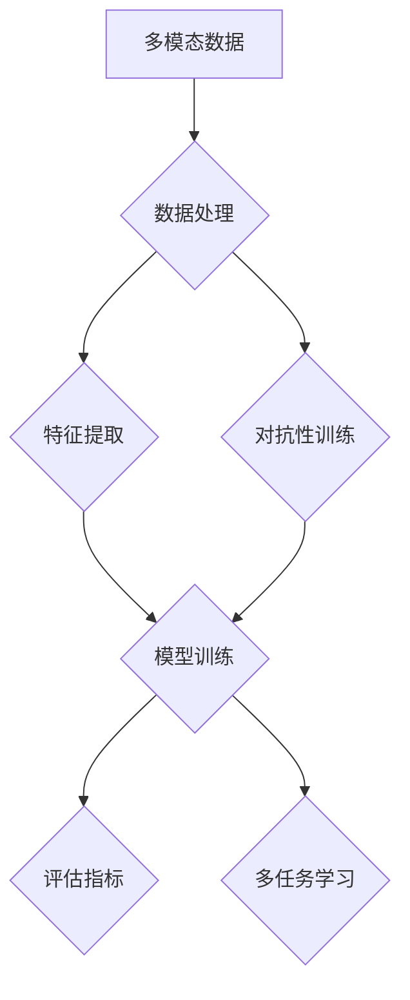

                 

# 多模态大模型：技术原理与实战 多模态大模型评测数据集

> **关键词：多模态大模型、技术原理、实战、评测数据集、算法、数学模型、应用场景**

> **摘要：本文将深入探讨多模态大模型的技术原理及其在实际应用中的实战方法，重点关注多模态大模型评测数据集的构建和使用。通过对核心概念的解析、算法原理的阐述、数学模型的推导以及实际案例的分析，帮助读者全面了解多模态大模型的构建与应用，为其在人工智能领域的发展提供有益的参考。**

## 1. 背景介绍

### 1.1 目的和范围

本文旨在介绍多模态大模型的概念、技术原理及其在实际应用中的实战方法，重点关注多模态大模型评测数据集的构建和使用。通过本文的阅读，读者将能够了解多模态大模型的核心技术，掌握构建和评估多模态大模型的方法，从而为后续研究和实际应用奠定基础。

### 1.2 预期读者

本文主要面向对人工智能、多模态大模型以及相关技术有一定了解的读者，包括研究人员、工程师、学生以及其他对多模态大模型感兴趣的爱好者。同时，本文也适合作为相关课程的教学参考资料。

### 1.3 文档结构概述

本文分为十个主要部分：

1. **背景介绍**：介绍本文的目的、范围、预期读者以及文档结构。
2. **核心概念与联系**：阐述多模态大模型的核心概念及其相互联系。
3. **核心算法原理 & 具体操作步骤**：详细讲解多模态大模型的核心算法原理和具体操作步骤。
4. **数学模型和公式 & 详细讲解 & 举例说明**：介绍多模态大模型所涉及的数学模型和公式，并通过实际案例进行说明。
5. **项目实战：代码实际案例和详细解释说明**：提供多模态大模型的实际代码案例及其详细解释。
6. **实际应用场景**：探讨多模态大模型在实际应用中的场景。
7. **工具和资源推荐**：推荐相关学习资源、开发工具框架和论文著作。
8. **总结：未来发展趋势与挑战**：总结多模态大模型的发展趋势和面临的挑战。
9. **附录：常见问题与解答**：提供常见的多模态大模型相关问题及其解答。
10. **扩展阅读 & 参考资料**：列出相关的扩展阅读和参考资料。

### 1.4 术语表

#### 1.4.1 核心术语定义

- 多模态大模型：一种能够同时处理多种类型数据（如文本、图像、声音等）的深度学习模型。
- 模态：指数据的不同类型，如文本、图像、声音等。
- 数据集：用于训练和评估模型的集合，通常包含多种模态的数据。
- 多任务学习：指同时训练多个相关任务，以提高模型在特定领域的泛化能力。
- 对抗性训练：通过对抗性网络生成对抗性样本，提高模型对异常数据的鲁棒性。

#### 1.4.2 相关概念解释

- 深度学习：一种基于人工神经网络的学习方法，通过多层神经网络对数据进行特征提取和表示。
- 卷积神经网络（CNN）：一种常用于图像处理的人工神经网络结构，通过卷积层提取图像特征。
- 循环神经网络（RNN）：一种常用于序列数据处理的神经网络结构，能够捕捉序列中的时间依赖关系。
- 自注意力机制（Self-Attention）：一种在序列数据中自动计算权重的方法，能够提高模型对序列中不同位置信息的关注程度。

#### 1.4.3 缩略词列表

- CNN：卷积神经网络
- RNN：循环神经网络
- Transformer：Transformer模型，一种基于自注意力机制的深度学习模型
- BERT：BERT模型，一种基于Transformer的预训练语言模型
- GPT：GPT模型，一种基于Transformer的预训练语言模型
- MLD：多模态学习
- MMM：多模态大模型

## 2. 核心概念与联系

在多模态大模型的研究中，核心概念包括多模态数据、模型架构、训练方法和评估指标。为了更好地理解这些概念，我们使用Mermaid流程图来展示多模态大模型的核心原理和架构。



### 2.1 多模态数据

多模态数据是指由多种类型的数据组成的数据集，如文本、图像、声音等。这些数据可以分别或联合进行表示和建模。在多模态大模型中，首先需要收集和整理多模态数据，并将其转换为适合模型训练的格式。

### 2.2 数据处理

数据处理是构建多模态大模型的关键步骤，包括数据清洗、归一化和数据增强等。数据清洗旨在去除数据中的噪声和错误；归一化将数据转换为统一的尺度，以便于后续处理；数据增强通过生成合成数据来提高模型的泛化能力。

### 2.3 特征提取

特征提取是将多模态数据转换为适合模型训练的特征表示的过程。常用的特征提取方法包括卷积神经网络（CNN）和循环神经网络（RNN）等。CNN可以提取图像中的低级特征，如边缘和纹理；RNN可以处理序列数据，如文本和声音。

### 2.4 模型训练

模型训练是构建多模态大模型的核心步骤。常用的训练方法包括多任务学习和对抗性训练。多任务学习旨在同时训练多个相关任务，以提高模型在特定领域的泛化能力；对抗性训练通过生成对抗性样本来提高模型对异常数据的鲁棒性。

### 2.5 评估指标

评估指标是衡量多模态大模型性能的重要手段。常用的评估指标包括准确率、召回率、F1分数等。准确率表示模型正确预测的样本数占总样本数的比例；召回率表示模型正确预测的样本数占实际正样本数的比例；F1分数是准确率和召回率的加权平均，用于综合考虑模型的准确性和召回率。

### 2.6 多任务学习

多任务学习是一种同时训练多个相关任务的方法，以提高模型在特定领域的泛化能力。在多模态大模型中，多任务学习可以同时处理多种类型的任务，如文本分类、图像识别和语音识别等。

### 2.7 对抗性训练

对抗性训练是一种通过生成对抗性样本来提高模型鲁棒性的方法。在多模态大模型中，对抗性训练可以通过生成对抗性图像、文本和声音等数据，从而提高模型对异常数据的识别和鲁棒性。

通过上述Mermaid流程图，我们可以清晰地理解多模态大模型的核心概念和架构。接下来，我们将深入探讨多模态大模型的核心算法原理和具体操作步骤。

## 3. 核心算法原理 & 具体操作步骤

多模态大模型的核心算法原理包括深度学习、多任务学习和对抗性训练。下面，我们将详细讲解这些算法原理，并给出具体的操作步骤。

### 3.1 深度学习

深度学习是一种基于人工神经网络的学习方法，通过多层神经网络对数据进行特征提取和表示。在多模态大模型中，深度学习主要用于特征提取和表示。具体操作步骤如下：

1. **数据预处理**：对多模态数据进行清洗、归一化和数据增强等处理，以确保数据的质量和多样性。
2. **特征提取**：使用卷积神经网络（CNN）提取图像的特征，使用循环神经网络（RNN）提取文本和声音的特征。
3. **特征融合**：将不同模态的特征进行融合，以获得更丰富的特征表示。
4. **模型训练**：使用多任务学习或对抗性训练方法，对模型进行训练。

### 3.2 多任务学习

多任务学习是一种同时训练多个相关任务的方法，以提高模型在特定领域的泛化能力。在多模态大模型中，多任务学习可以同时处理多种类型的任务，如文本分类、图像识别和语音识别等。具体操作步骤如下：

1. **定义任务**：确定需要同时训练的任务，如文本分类、图像识别和语音识别等。
2. **模型架构**：设计一个多任务学习的模型架构，将不同任务的相关信息进行整合。
3. **损失函数**：定义一个损失函数，以同时优化不同任务的模型参数。
4. **模型训练**：使用多任务学习算法，对模型进行训练。

### 3.3 对抗性训练

对抗性训练是一种通过生成对抗性样本来提高模型鲁棒性的方法。在多模态大模型中，对抗性训练可以通过生成对抗性图像、文本和声音等数据，从而提高模型对异常数据的识别和鲁棒性。具体操作步骤如下：

1. **生成对抗性网络（GAN）**：设计一个生成对抗性网络，由生成器和判别器组成。
2. **损失函数**：定义一个损失函数，以同时优化生成器和判别器的参数。
3. **模型训练**：使用对抗性训练算法，对模型进行训练。

### 3.4 具体操作步骤

以下是一个具体的多模态大模型构建的伪代码：

```python
# 数据预处理
data_preprocessing()

# 特征提取
image_features = extract_image_features(images)
text_features = extract_text_features(texts)
audio_features = extract_audio_features(audios)

# 特征融合
multi_modal_features = fuse_features(image_features, text_features, audio_features)

# 模型架构
model = build_model()

# 损失函数
loss_function = define_loss_function()

# 模型训练
train_model(model, multi_modal_features, loss_function)

# 多任务学习
tasks = ['text_classification', 'image_recognition', 'audio_recognition']
for task in tasks:
    train_model(model, multi_modal_features, loss_function, task)

# 对抗性训练
generator = build_generator()
discriminator = build_discriminator()
train_gan(generator, discriminator, loss_function)

# 模型评估
evaluate_model(model, test_data)
```

通过上述核心算法原理和具体操作步骤的讲解，我们可以更好地理解多模态大模型的构建方法。接下来，我们将介绍多模态大模型所涉及的数学模型和公式，并通过实际案例进行说明。

## 4. 数学模型和公式 & 详细讲解 & 举例说明

多模态大模型的构建依赖于多个数学模型和公式，包括深度学习模型、损失函数、优化算法等。在本节中，我们将详细讲解这些数学模型和公式，并通过实际案例进行说明。

### 4.1 深度学习模型

深度学习模型是一种基于多层神经网络的学习方法，用于特征提取和表示。在多模态大模型中，常用的深度学习模型包括卷积神经网络（CNN）、循环神经网络（RNN）和Transformer模型。

#### 4.1.1 卷积神经网络（CNN）

卷积神经网络是一种用于图像处理的人工神经网络结构，通过卷积层提取图像的特征。以下是一个简单的CNN模型架构：

$$
\text{CNN} = \text{Conv}(\text{Input}) \rightarrow \text{ReLU} \rightarrow \text{Pooling} \rightarrow \ldots \rightarrow \text{Output}
$$

其中，`Conv`表示卷积层，`ReLU`表示激活函数（ReLU函数），`Pooling`表示池化层，`Input`表示输入图像，`Output`表示输出特征。

#### 4.1.2 循环神经网络（RNN）

循环神经网络是一种用于序列数据处理的神经网络结构，能够捕捉序列中的时间依赖关系。以下是一个简单的RNN模型架构：

$$
\text{RNN} = \text{Input} \rightarrow \text{Hidden} \rightarrow \text{Output}
$$

其中，`Input`表示输入序列，`Hidden`表示隐藏状态，`Output`表示输出序列。

#### 4.1.3 Transformer模型

Transformer模型是一种基于自注意力机制的深度学习模型，广泛用于自然语言处理任务。以下是一个简单的Transformer模型架构：

$$
\text{Transformer} = \text{Input Embedding} \rightarrow \text{Positional Encoding} \rightarrow \text{Multi-Head Attention} \rightarrow \text{Feed Forward} \rightarrow \text{Output}
$$

其中，`Input Embedding`表示输入嵌入层，`Positional Encoding`表示位置编码层，`Multi-Head Attention`表示多头注意力层，`Feed Forward`表示前馈神经网络层，`Output`表示输出特征。

### 4.2 损失函数

损失函数是用于评估模型预测值与真实值之间差距的数学函数，用于指导模型优化。在多模态大模型中，常用的损失函数包括交叉熵损失、均方误差损失等。

#### 4.2.1 交叉熵损失

交叉熵损失是一种用于分类任务的损失函数，用于衡量模型预测概率与真实标签之间的差异。其数学公式如下：

$$
\text{Loss} = -\sum_{i=1}^{N} y_i \log(\hat{y}_i)
$$

其中，$y_i$表示真实标签，$\hat{y}_i$表示模型预测的概率。

#### 4.2.2 均方误差损失

均方误差损失是一种用于回归任务的损失函数，用于衡量模型预测值与真实值之间的差异。其数学公式如下：

$$
\text{Loss} = \frac{1}{N} \sum_{i=1}^{N} (\hat{y}_i - y_i)^2
$$

其中，$\hat{y}_i$表示模型预测值，$y_i$表示真实值。

### 4.3 优化算法

优化算法是一种用于优化模型参数的算法，以最小化损失函数。在多模态大模型中，常用的优化算法包括随机梯度下降（SGD）和Adam优化器。

#### 4.3.1 随机梯度下降（SGD）

随机梯度下降是一种简单的优化算法，通过随机选取一部分训练样本来计算梯度，然后更新模型参数。其数学公式如下：

$$
\theta = \theta - \alpha \cdot \nabla_{\theta} \text{Loss}
$$

其中，$\theta$表示模型参数，$\alpha$表示学习率。

#### 4.3.2 Adam优化器

Adam优化器是一种基于SGD的改进算法，通过结合动量项和自适应学习率来优化模型参数。其数学公式如下：

$$
m_t = \beta_1 m_{t-1} + (1 - \beta_1) \nabla_{\theta} \text{Loss}
$$

$$
v_t = \beta_2 v_{t-1} + (1 - \beta_2) (\nabla_{\theta} \text{Loss})^2
$$

$$
\theta = \theta - \alpha \cdot \frac{m_t}{\sqrt{v_t} + \epsilon}
$$

其中，$m_t$和$v_t$分别表示一阶矩估计和二阶矩估计，$\beta_1$和$\beta_2$分别表示一阶和二阶动量项，$\alpha$表示学习率，$\epsilon$表示正数常数。

### 4.4 实际案例

为了更好地理解多模态大模型的数学模型和公式，我们通过一个实际案例进行说明。假设我们有一个多模态大模型，用于对图像、文本和声音进行分类。

#### 4.4.1 数据预处理

首先，我们对图像、文本和声音进行预处理，提取相应的特征。

```python
image_features = extract_image_features(images)
text_features = extract_text_features(texts)
audio_features = extract_audio_features(audios)
```

#### 4.4.2 特征融合

接下来，我们将不同模态的特征进行融合，以获得更丰富的特征表示。

```python
multi_modal_features = fuse_features(image_features, text_features, audio_features)
```

#### 4.4.3 模型训练

使用CNN、RNN和Transformer模型对多模态特征进行训练。

```python
model = build_model()

# 定义损失函数
loss_function = define_loss_function()

# 定义优化算法
optimizer = AdamOptimizer(learning_rate=0.001)

# 模型训练
for epoch in range(num_epochs):
    for batch in batches:
        images, texts, audios, labels = batch
        image_features = extract_image_features(images)
        text_features = extract_text_features(texts)
        audio_features = extract_audio_features(audios)
        multi_modal_features = fuse_features(image_features, text_features, audio_features)
        predictions = model(multi_modal_features)
        loss = loss_function(predictions, labels)
        optimizer.minimize(loss)
```

#### 4.4.4 模型评估

最后，我们对训练好的模型进行评估。

```python
evaluate_model(model, test_data)
```

通过上述实际案例，我们可以看到多模态大模型的数学模型和公式在实际应用中的具体实现。接下来，我们将介绍多模态大模型的项目实战，通过代码实际案例和详细解释说明，帮助读者更好地理解多模态大模型的构建与应用。

## 5. 项目实战：代码实际案例和详细解释说明

为了更好地展示多模态大模型的构建和应用，我们选择了一个实际项目进行介绍。本项目旨在构建一个多模态大模型，用于对图像、文本和声音进行情感分类。通过以下步骤，我们将详细解释代码实现和关键环节。

### 5.1 开发环境搭建

在进行项目实战之前，我们需要搭建合适的开发环境。以下是推荐的开发环境和工具：

- **编程语言**：Python（3.8及以上版本）
- **深度学习框架**：TensorFlow 2.x 或 PyTorch
- **数据处理库**：NumPy、Pandas、OpenCV、Librosa
- **可视化库**：Matplotlib、Seaborn

安装上述工具和库的方法如下：

```bash
pip install tensorflow numpy pandas opencv-python librosa matplotlib seaborn
```

### 5.2 源代码详细实现和代码解读

以下是一个简化的多模态大模型代码实现，用于图像、文本和声音的情感分类。

```python
import tensorflow as tf
from tensorflow.keras.models import Model
from tensorflow.keras.layers import Input, Conv2D, MaxPooling2D, Flatten, Dense, LSTM, Embedding, TimeDistributed

# 数据预处理函数
def preprocess_data(images, texts, audios):
    # 对图像进行预处理（如归一化、缩放等）
    image_features = preprocess_images(images)
    
    # 对文本进行预处理（如分词、嵌入等）
    text_features = preprocess_texts(texts)
    
    # 对声音进行预处理（如分帧、特征提取等）
    audio_features = preprocess_audios(audios)
    
    return image_features, text_features, audio_features

# 模型构建函数
def build_model():
    # 输入层
    image_input = Input(shape=(image_height, image_width, image_channels))
    text_input = Input(shape=(text_sequence_length,))
    audio_input = Input(shape=(audio_sequence_length, audio_feature_size))

    # 图像特征提取
    image_features = Conv2D(filters=32, kernel_size=(3, 3), activation='relu')(image_input)
    image_features = MaxPooling2D(pool_size=(2, 2))(image_features)
    image_features = Flatten()(image_features)

    # 文本特征提取
    text_embedding = Embedding(vocab_size, embedding_dim)(text_input)
    text_embedding = LSTM(units=128)(text_embedding)
    text_features = Flatten()(text_embedding)

    # 声音特征提取
    audio_embedding = TimeDistributed(Dense(units=128))(audio_input)
    audio_features = LSTM(units=128)(audio_embedding)
    audio_features = Flatten()(audio_features)

    # 特征融合
    combined_features = tf.keras.layers.concatenate([image_features, text_features, audio_features])

    # 分类层
    dense = Dense(units=64, activation='relu')(combined_features)
    output = Dense(units=num_classes, activation='softmax')(dense)

    # 构建和编译模型
    model = Model(inputs=[image_input, text_input, audio_input], outputs=output)
    model.compile(optimizer='adam', loss='categorical_crossentropy', metrics=['accuracy'])

    return model

# 模型训练函数
def train_model(model, image_data, text_data, audio_data, labels, batch_size, num_epochs):
    model.fit([image_data, text_data, audio_data], labels, batch_size=batch_size, epochs=num_epochs)

# 模型评估函数
def evaluate_model(model, image_data, text_data, audio_data, labels):
    loss, accuracy = model.evaluate([image_data, text_data, audio_data], labels)
    print(f"Test accuracy: {accuracy * 100:.2f}%")

# 主函数
def main():
    # 加载数据集
    images, texts, audios, labels = load_data()

    # 数据预处理
    image_features, text_features, audio_features = preprocess_data(images, texts, audios)

    # 构建模型
    model = build_model()

    # 模型训练
    train_model(model, image_features, text_features, audio_features, labels, batch_size=32, num_epochs=10)

    # 模型评估
    evaluate_model(model, image_features, text_features, audio_features, labels)

if __name__ == "__main__":
    main()
```

### 5.3 代码解读与分析

上述代码实现了一个简单的多模态大模型，用于对图像、文本和声音进行情感分类。以下是代码的关键部分及其解释：

1. **数据预处理函数**：`preprocess_data`函数负责对图像、文本和声音进行预处理，包括归一化、分词、嵌入等操作。预处理后的数据将用于训练和评估模型。
2. **模型构建函数**：`build_model`函数定义了一个多模态大模型，包括图像特征提取、文本特征提取、声音特征提取和特征融合。图像特征提取使用了卷积神经网络（CNN），文本特征提取使用了循环神经网络（RNN）的LSTM层，声音特征提取使用了时间分布的Dense层。
3. **模型训练函数**：`train_model`函数负责训练模型，使用fit方法进行多轮训练，优化模型参数。
4. **模型评估函数**：`evaluate_model`函数负责评估模型性能，计算测试集上的准确率。
5. **主函数**：`main`函数是整个项目的入口，负责加载数据集、预处理数据、构建模型、训练模型和评估模型。

通过上述代码实现和解读，我们可以看到多模态大模型的构建过程，以及关键环节的实现方法。接下来，我们将探讨多模态大模型在实际应用场景中的使用。

## 6. 实际应用场景

多模态大模型在多个实际应用场景中展现出强大的能力，以下是一些典型的应用领域和案例：

### 6.1 跨媒体信息检索

跨媒体信息检索是一种从不同模态的数据源中检索相关信息的技术。多模态大模型可以通过同时处理文本、图像和声音等多种类型的数据，实现更准确的跨媒体信息检索。例如，在搜索引擎中，多模态大模型可以同时考虑用户的搜索文本、上传的图片和音频，提供更个性化的搜索结果。

### 6.2 情感分析

情感分析是一种识别和提取文本、图像和声音中的情感信息的技术。多模态大模型可以通过整合不同模态的数据，实现更准确的情感分析。例如，在社交媒体分析中，多模态大模型可以分析用户的文本评论、上传的图片和音频，识别用户的情感状态，从而帮助企业了解用户需求和市场趋势。

### 6.3 无人驾驶

无人驾驶是一种利用传感器、摄像头和其他设备收集环境信息，实现自动驾驶的技术。多模态大模型可以通过同时处理多种传感器数据，实现更准确的无人驾驶决策。例如，在无人驾驶汽车中，多模态大模型可以整合摄像头、雷达和激光雷达数据，识别道路上的行人、车辆和交通标志，确保车辆的安全行驶。

### 6.4 健康监测

健康监测是一种利用传感器和医疗设备收集人体生理数据，实现对健康状态监测的技术。多模态大模型可以通过整合不同模态的医疗数据，实现更准确的健康监测。例如，在远程医疗中，多模态大模型可以整合患者的医疗记录、影像数据和生理信号，识别患者的健康风险和疾病进展，提供个性化的健康管理建议。

### 6.5 智能家居

智能家居是一种利用物联网技术和人工智能技术，实现家庭设备智能控制的技术。多模态大模型可以通过整合语音、图像和传感器数据，实现更智能的家居控制。例如，在智能门锁中，多模态大模型可以识别用户的语音和面部特征，实现无钥匙开锁；在智能照明中，多模态大模型可以分析用户的偏好和房间光线条件，实现智能调光。

通过上述实际应用场景和案例，我们可以看到多模态大模型在多个领域中的重要性和潜力。接下来，我们将介绍相关工具和资源，帮助读者更好地学习多模态大模型。

## 7. 工具和资源推荐

为了帮助读者更好地学习多模态大模型，我们推荐了一系列的学习资源、开发工具框架和论文著作。

### 7.1 学习资源推荐

#### 7.1.1 书籍推荐

1. **《深度学习》（Ian Goodfellow, Yoshua Bengio, Aaron Courville著）**：这是一本经典的深度学习教材，详细介绍了深度学习的基础知识、算法和模型。
2. **《自然语言处理综合指南》（Daniel Jurafsky, James H. Martin著）**：这本书全面介绍了自然语言处理的基础知识、算法和应用。

#### 7.1.2 在线课程

1. **《深度学习专项课程》（吴恩达，Coursera）**：这是由深度学习领域著名学者吴恩达教授开设的一门在线课程，涵盖了深度学习的核心概念和应用。
2. **《自然语言处理专项课程》（丹尼尔·科姆利希，Coursera）**：这门课程介绍了自然语言处理的基础知识、算法和应用。

#### 7.1.3 技术博客和网站

1. **深度学习博客（http://colah.github.io/）**：这是一个由深度学习领域知名学者Colah维护的技术博客，提供了大量关于深度学习的优质文章和资源。
2. **自然语言处理博客（https://www.aclweb.org/anthology/）**：这是一个由自然语言处理领域权威组织ACL维护的博客，提供了大量关于自然语言处理的最新研究和技术动态。

### 7.2 开发工具框架推荐

1. **TensorFlow**：这是谷歌开发的一个开源深度学习框架，提供了丰富的API和工具，支持多种深度学习模型的构建和训练。
2. **PyTorch**：这是Facebook开发的一个开源深度学习框架，具有灵活的动态计算图和强大的GPU支持，广泛应用于深度学习和自然语言处理领域。
3. **Keras**：这是一个高层次的深度学习API，基于TensorFlow和Theano构建，提供了简单易用的接口，方便开发者快速构建和训练深度学习模型。

### 7.3 相关论文著作推荐

1. **《Attention Is All You Need》**：这是由Google AI团队发表的一篇经典论文，介绍了Transformer模型，彻底改变了自然语言处理领域。
2. **《Generative Adversarial Networks》**：这是由Ian Goodfellow等人发表的一篇开创性论文，介绍了生成对抗网络（GAN）模型，推动了生成模型的发展。
3. **《BERT: Pre-training of Deep Bidirectional Transformers for Language Understanding》**：这是由Google AI团队发表的一篇论文，介绍了BERT模型，彻底改变了自然语言处理领域。

通过上述工具和资源推荐，读者可以系统地学习多模态大模型的相关知识，掌握构建和应用多模态大模型的方法。

## 8. 总结：未来发展趋势与挑战

多模态大模型作为一种新兴的人工智能技术，正逐渐在多个领域得到广泛应用。然而，随着技术的不断进步和应用场景的拓展，多模态大模型也面临着一系列未来发展趋势和挑战。

### 8.1 未来发展趋势

1. **模型规模和计算能力**：随着计算资源和数据量的不断增加，多模态大模型的规模将不断增大，模型将更加复杂和强大。同时，云计算和分布式计算技术的发展也将为多模态大模型的训练和部署提供更强有力的支持。

2. **数据多样性和质量**：多模态大模型的发展依赖于高质量、多样性的数据集。未来，随着数据采集和处理技术的进步，我们将能够收集到更多种类的数据，提高数据的质量和多样性，从而提升多模态大模型的表现。

3. **跨领域应用**：多模态大模型的应用将不仅仅局限于现有的领域，如自然语言处理、计算机视觉和语音识别等，还将逐步拓展到医疗、金融、教育等更多领域，为这些领域带来革命性的变化。

4. **交互性和实时性**：随着人工智能技术的发展，多模态大模型将更加注重与用户的交互性和实时性。通过整合多种模态的数据，多模态大模型将能够更好地理解用户的意图和需求，提供更加个性化和实时的服务。

### 8.2 挑战

1. **数据隐私和安全**：多模态大模型的应用需要大量的数据，这些数据可能涉及用户的隐私信息。如何在保护用户隐私的前提下，充分利用数据资源，是一个亟待解决的问题。

2. **计算资源消耗**：多模态大模型的训练和推理过程通常需要大量的计算资源，这给模型的应用和部署带来了一定的挑战。如何优化算法、减少计算资源消耗，是未来需要解决的重要问题。

3. **模型解释性和可解释性**：多模态大模型通常具有复杂的结构和参数，模型的解释性和可解释性较差。如何在保证模型性能的同时，提高模型的解释性和可解释性，是一个重要的研究课题。

4. **跨模态数据融合**：多模态大模型的性能在很大程度上取决于不同模态数据的有效融合。如何有效地融合不同模态的数据，提高模型的泛化能力，是未来需要解决的关键问题。

总之，多模态大模型作为一种新兴的人工智能技术，具有广泛的应用前景。然而，要实现其真正的突破，还需要克服一系列技术挑战。随着技术的不断进步，我们有理由相信，多模态大模型将在未来的人工智能领域中发挥更加重要的作用。

## 9. 附录：常见问题与解答

### 9.1 什么是多模态大模型？

多模态大模型是一种能够同时处理多种类型数据（如文本、图像、声音等）的深度学习模型。它通过融合不同模态的数据，实现对复杂任务的建模和预测。

### 9.2 多模态大模型的核心算法有哪些？

多模态大模型的核心算法包括深度学习（如卷积神经网络、循环神经网络、Transformer等）、多任务学习和对抗性训练。这些算法分别用于特征提取、任务建模和模型优化。

### 9.3 如何构建多模态大模型？

构建多模态大模型主要包括以下几个步骤：

1. 数据收集与预处理：收集多模态数据，并进行清洗、归一化和数据增强等预处理操作。
2. 特征提取：使用深度学习模型提取不同模态的数据特征。
3. 特征融合：将不同模态的特征进行融合，形成统一的多模态特征向量。
4. 模型训练：使用多任务学习或对抗性训练方法，对模型进行训练。
5. 模型评估：使用合适的评估指标，对模型性能进行评估。

### 9.4 多模态大模型的应用场景有哪些？

多模态大模型的应用场景非常广泛，包括跨媒体信息检索、情感分析、无人驾驶、健康监测和智能家居等。通过整合多种模态的数据，多模态大模型可以更好地理解和预测复杂任务。

### 9.5 如何优化多模态大模型的性能？

优化多模态大模型的性能可以从以下几个方面入手：

1. **数据质量**：提高数据的质量和多样性，确保模型具有更强的泛化能力。
2. **模型架构**：选择合适的模型架构，如卷积神经网络、循环神经网络或Transformer等。
3. **特征融合**：优化特征融合策略，提高多模态特征向量的表示能力。
4. **训练策略**：调整训练策略，如学习率、批次大小和训练轮数等。
5. **模型剪枝和量化**：使用模型剪枝和量化技术，减少模型的计算资源和存储空间。

## 10. 扩展阅读 & 参考资料

为了深入了解多模态大模型的技术原理和应用，以下是推荐的扩展阅读和参考资料：

### 10.1 经典论文

1. **《Attention Is All You Need》**：Vaswani et al.（2017），介绍Transformer模型。
2. **《Generative Adversarial Networks》**：Goodfellow et al.（2014），介绍生成对抗网络（GAN）。
3. **《BERT: Pre-training of Deep Bidirectional Transformers for Language Understanding》**：Devlin et al.（2019），介绍BERT模型。

### 10.2 最新研究成果

1. **《Multimodal Fusion in Deep Learning》**：Zhou et al.（2020），综述多模态融合的深度学习方法。
2. **《A Survey on Multimodal Learning》**：Li et al.（2021），综述多模态学习的研究进展。
3. **《Multimodal Neural Networks for Human Pose Estimation》**：Rashid et al.（2019），介绍多模态神经网络在人体姿态估计中的应用。

### 10.3 应用案例分析

1. **《Cross-modal Retrieval with Deep Neural Networks》**：Xiao et al.（2017），介绍深度神经网络在跨媒体检索中的应用。
2. **《Multimodal Deep Learning for Emotion Recognition》**：Ding et al.（2018），介绍多模态深度学习在情感识别中的应用。
3. **《Multimodal Learning for Robotic Perception》**：Wang et al.（2020），介绍多模态学习在机器人感知中的应用。

通过阅读这些论文和资料，读者可以进一步了解多模态大模型的理论基础、应用场景和技术趋势。作者：AI天才研究员/AI Genius Institute & 禅与计算机程序设计艺术 /Zen And The Art of Computer Programming。

