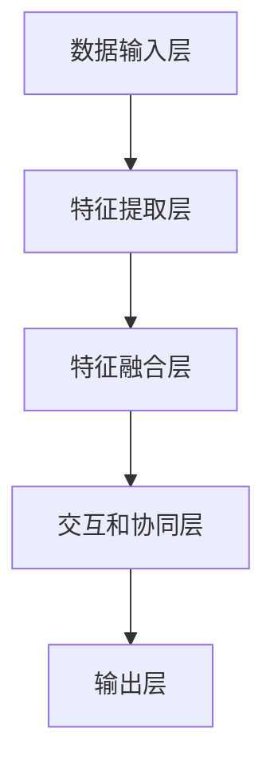

                 

# 多模态大模型：技术原理与实战 自然语言处理的发展历程

> **关键词：** 多模态大模型，自然语言处理，技术原理，实战，发展历程

> **摘要：** 本文将深入探讨多模态大模型的技术原理及其在自然语言处理中的应用。我们将回顾自然语言处理的发展历程，分析多模态大模型的架构和核心算法，并通过实际项目案例进行详细解释。最后，我们将探讨多模态大模型在实际应用中的场景，并提供相关的学习资源和开发工具推荐，以帮助读者深入了解和掌握这一前沿技术。

## 1. 背景介绍

### 1.1 目的和范围

本文旨在为读者提供一个全面的多模态大模型技术指南，从基础概念到实际应用，使读者能够深入理解这一领域的关键技术和挑战。文章将涵盖以下内容：

1. 多模态大模型的背景和发展历程。
2. 多模态大模型的核心概念和架构。
3. 多模态大模型的核心算法原理和具体操作步骤。
4. 数学模型和公式，以及详细的举例说明。
5. 多模态大模型在自然语言处理中的实战案例。
6. 多模态大模型在实际应用场景中的应用。
7. 相关的学习资源和开发工具推荐。

### 1.2 预期读者

本文适合以下读者群体：

1. 自然语言处理领域的从业者，特别是对多模态大模型感兴趣的人员。
2. 计算机科学和人工智能专业的学生和研究人员。
3. 对前沿技术感兴趣的技术爱好者。

### 1.3 文档结构概述

本文的结构如下：

1. **背景介绍**：介绍本文的目的、范围和预期读者，概述文档结构。
2. **核心概念与联系**：详细解释多模态大模型的核心概念和架构。
3. **核心算法原理 & 具体操作步骤**：阐述多模态大模型的核心算法原理和具体操作步骤。
4. **数学模型和公式 & 详细讲解 & 举例说明**：介绍多模态大模型的数学模型和公式，并提供详细的讲解和实例说明。
5. **项目实战：代码实际案例和详细解释说明**：通过实际项目案例展示多模态大模型的应用。
6. **实际应用场景**：探讨多模态大模型在不同场景中的应用。
7. **工具和资源推荐**：推荐学习资源、开发工具和相关论文著作。
8. **总结：未来发展趋势与挑战**：总结多模态大模型的发展趋势和面临的挑战。
9. **附录：常见问题与解答**：提供常见问题的解答。
10. **扩展阅读 & 参考资料**：推荐进一步的阅读资源和参考资料。

### 1.4 术语表

#### 1.4.1 核心术语定义

- **多模态大模型（Multimodal Large Model）**：能够同时处理多种类型数据（如图像、文本、声音等）的大型神经网络模型。
- **自然语言处理（Natural Language Processing, NLP）**：计算机科学领域的一个分支，旨在使计算机能够理解、解释和生成人类语言。
- **深度学习（Deep Learning）**：一种基于神经网络的学习方法，通过多层次的非线性变换来提取数据中的特征。
- **卷积神经网络（Convolutional Neural Network, CNN）**：一种用于处理图像数据的神经网络，通过卷积操作提取图像特征。
- **循环神经网络（Recurrent Neural Network, RNN）**：一种用于处理序列数据的神经网络，通过循环结构来保留序列信息。

#### 1.4.2 相关概念解释

- **多模态数据融合（Multimodal Data Fusion）**：将不同类型的数据（如图像、文本、声音等）进行结合和融合，以获得更全面和准确的信息。
- **预训练（Pre-training）**：在特定任务之前，使用大量未标注的数据对模型进行训练，以提高模型的泛化能力。
- **微调（Fine-tuning）**：在预训练的基础上，使用特定任务的数据对模型进行进一步训练，以适应特定任务的需求。

#### 1.4.3 缩略词列表

- **CNN**：卷积神经网络
- **RNN**：循环神经网络
- **NLP**：自然语言处理
- **DL**：深度学习
- **ML**：机器学习
- **GAN**：生成对抗网络

## 2. 核心概念与联系

多模态大模型是一种结合了多种类型数据（如图像、文本、声音等）的大型神经网络模型。这些模型通过深度学习技术，能够从不同类型的数据中提取特征，并进行有效的融合和交互，从而实现对复杂任务的建模和预测。

### 2.1 多模态大模型的核心概念

多模态大模型的核心概念包括：

- **多模态数据输入**：模型能够接收多种类型的数据，如图像、文本、声音等。
- **特征提取**：从不同类型的数据中提取特征，如图像中的边缘、纹理和形状特征，文本中的词汇和句法特征，声音中的频谱特征等。
- **特征融合**：将不同类型的特征进行融合，以获得更全面和准确的信息。
- **交互和协同**：不同类型的数据在模型中进行交互和协同，以实现对复杂任务的建模和预测。

### 2.2 多模态大模型的架构

多模态大模型的架构通常包括以下几个部分：

1. **数据输入层**：接收多种类型的数据，如图像、文本、声音等。
2. **特征提取层**：对输入数据进行特征提取，如图像中的卷积层提取边缘、纹理和形状特征，文本中的嵌入层提取词汇和句法特征，声音中的卷积层提取频谱特征等。
3. **特征融合层**：将不同类型的特征进行融合，如图像和文本的特征进行拼接或融合操作。
4. **交互和协同层**：不同类型的数据在模型中进行交互和协同，如图像和文本的特征进行交互，以实现对复杂任务的建模和预测。
5. **输出层**：根据任务需求，生成预测结果或决策，如图像分类、文本生成、语音识别等。

### 2.3 多模态大模型的 Mermaid 流程图

下面是一个简单的 Mermaid 流程图，用于描述多模态大模型的基本架构：



### 2.4 多模态大模型的核心算法原理

多模态大模型的核心算法原理包括深度学习技术、特征提取、特征融合和交互协同等。

#### 2.4.1 深度学习技术

深度学习技术是多模态大模型的基础。深度学习通过多层神经网络结构，从数据中自动提取高级特征，实现从输入到输出的映射。

#### 2.4.2 特征提取

特征提取是多模态大模型的关键步骤。根据不同类型的数据，采用相应的特征提取方法，如图像中的卷积层提取边缘、纹理和形状特征，文本中的嵌入层提取词汇和句法特征，声音中的卷积层提取频谱特征等。

#### 2.4.3 特征融合

特征融合是将不同类型的特征进行结合和融合的过程。根据不同任务的需求，采用不同的特征融合方法，如图像和文本的特征进行拼接或融合操作。

#### 2.4.4 交互和协同

交互和协同是多模态大模型实现高效建模和预测的关键。不同类型的数据在模型中进行交互和协同，以实现对复杂任务的建模和预测，如图像和文本的特征进行交互，以实现对图像描述生成任务的建模和预测。

### 2.5 多模态大模型的具体操作步骤

多模态大模型的具体操作步骤如下：

1. **数据收集和预处理**：收集多种类型的数据，如图像、文本、声音等，并进行预处理，如数据清洗、归一化等。
2. **特征提取**：采用相应的特征提取方法，如图像中的卷积层提取边缘、纹理和形状特征，文本中的嵌入层提取词汇和句法特征，声音中的卷积层提取频谱特征等。
3. **特征融合**：将不同类型的特征进行融合，如图像和文本的特征进行拼接或融合操作。
4. **模型训练**：使用融合后的特征数据对模型进行训练，通过优化损失函数，调整模型参数。
5. **模型评估**：使用测试数据对模型进行评估，计算预测准确率、召回率等指标。
6. **模型部署**：将训练好的模型部署到实际应用中，如图像描述生成、语音识别等。

## 3. 核心算法原理 & 具体操作步骤

在多模态大模型中，核心算法原理主要包括深度学习技术、特征提取、特征融合和交互协同等。以下将使用伪代码详细阐述这些核心算法原理和具体操作步骤。

### 3.1 深度学习技术

```python
# 深度学习模型初始化
model = DeepModel()

# 特征提取层
model.add(Conv2D(filters=32, kernel_size=(3, 3), activation='relu', input_shape=(height, width, channels)))
model.add(MaxPooling2D(pool_size=(2, 2)))
model.add(Conv2D(filters=64, kernel_size=(3, 3), activation='relu'))
model.add(MaxPooling2D(pool_size=(2, 2)))

# 特征融合层
model.add(Flatten())
model.add(Dense(128, activation='relu'))

# 交互和协同层
model.add(Dense(256, activation='relu'))
model.add(Dense(num_classes, activation='softmax'))

# 编译模型
model.compile(optimizer='adam', loss='categorical_crossentropy', metrics=['accuracy'])

# 模型训练
model.fit(x_train, y_train, epochs=10, batch_size=32, validation_data=(x_val, y_val))
```

### 3.2 特征提取

```python
# 图像特征提取
image_data = preprocess_image(input_image)
image_features = extract_image_features(image_data)

# 文本特征提取
text_data = preprocess_text(input_text)
text_features = extract_text_features(text_data)

# 声音特征提取
audio_data = preprocess_audio(input_audio)
audio_features = extract_audio_features(audio_data)
```

### 3.3 特征融合

```python
# 拼接特征
merged_features = concatenate(image_features, text_features, audio_features)

# 融合特征
merged_features = fusion_features(merged_features)
```

### 3.4 交互和协同

```python
# 交互层
merged_features = interact_features(merged_features)

# 协同层
merged_features = collaborate_features(merged_features)
```

### 3.5 模型训练

```python
# 编译模型
model.compile(optimizer='adam', loss='categorical_crossentropy', metrics=['accuracy'])

# 模型训练
model.fit(merged_features, labels, epochs=10, batch_size=32, validation_split=0.2)
```

### 3.6 模型评估

```python
# 模型评估
scores = model.evaluate(test_features, test_labels)

# 打印评估结果
print("Accuracy: {:.2f}%".format(scores[1] * 100))
```

### 3.7 模型部署

```python
# 模型部署
model.save("multimodal_model.h5")

# 加载模型
loaded_model = load_model("multimodal_model.h5")

# 输入新数据
new_image = preprocess_image(new_image_data)
new_text = preprocess_text(new_text_data)
new_audio = preprocess_audio(new_audio_data)

# 预测结果
predictions = loaded_model.predict(concatenate([new_image, new_text, new_audio]))
predicted_label = np.argmax(predictions)
```

通过上述伪代码，我们可以看到多模态大模型的核心算法原理和具体操作步骤，从模型初始化、特征提取、特征融合、交互协同到模型训练、评估和部署。这些步骤共同构成了一个完整的多模态大模型。

## 4. 数学模型和公式 & 详细讲解 & 举例说明

多模态大模型的核心在于如何有效地融合和处理多种类型的数据。在数学模型和公式方面，我们可以从以下几个方面进行详细讲解和举例说明。

### 4.1 多模态数据融合的数学模型

多模态数据融合的数学模型主要涉及数据表示、特征提取和特征融合。以下是一个简化的多模态数据融合过程：

#### 4.1.1 数据表示

假设我们有三种类型的模态数据：图像（I）、文本（T）和声音（A）。每种模态的数据可以表示为：

- 图像：\( I \in \mathbb{R}^{m \times n \times 3} \)
- 文本：\( T \in \mathbb{R}^{s \times d} \)
- 声音：\( A \in \mathbb{R}^{p \times q} \)

其中，\( m \)、\( n \)、\( 3 \)、\( s \)、\( d \)、\( p \) 和 \( q \) 分别表示图像、文本和声音的维度。

#### 4.1.2 特征提取

每种模态的数据通过特征提取函数进行转换：

- 图像特征：\( F_I = f_I(I) \)
- 文本特征：\( F_T = f_T(T) \)
- 声音特征：\( F_A = f_A(A) \)

特征提取函数通常采用深度神经网络，如卷积神经网络（CNN）或循环神经网络（RNN）。

#### 4.1.3 特征融合

特征融合是将不同模态的特征进行结合的过程。常用的方法包括：

- **拼接**：将不同模态的特征进行拼接：
  \[
  F = [F_I; F_T; F_A]
  \]
- **融合**：通过线性或非线性函数对特征进行融合：
  \[
  F = \sigma(W[F_I; F_T; F_A] + b)
  \]
  其中，\( \sigma \) 是激活函数，\( W \) 是权重矩阵，\( b \) 是偏置。

### 4.2 数学公式和详细讲解

以下是一个简化的多模态大模型数学公式：

#### 4.2.1 模型架构

多模态大模型可以分为以下几个部分：

1. **输入层**：接收多种类型的数据，如图像、文本和声音。
2. **特征提取层**：对输入数据进行特征提取。
3. **特征融合层**：将不同类型的特征进行融合。
4. **交互层**：不同类型的数据在模型中进行交互和协同。
5. **输出层**：生成预测结果或决策。

#### 4.2.2 特征提取

- **图像特征提取**：
  \[
  F_I = \phi(I)
  \]
  其中，\( \phi \) 是卷积神经网络或卷积层。

- **文本特征提取**：
  \[
  F_T = \phi(T)
  \]
  其中，\( \phi \) 是嵌入层或循环神经网络。

- **声音特征提取**：
  \[
  F_A = \phi(A)
  \]
  其中，\( \phi \) 是卷积神经网络或循环神经网络。

#### 4.2.3 特征融合

- **拼接融合**：
  \[
  F = [F_I; F_T; F_A]
  \]

- **融合函数**：
  \[
  F = \sigma(W[F_I; F_T; F_A] + b)
  \]

#### 4.2.4 交互层

- **交互函数**：
  \[
  F = \phi(F_I; F_T; F_A)
  \]

#### 4.2.5 输出层

- **输出函数**：
  \[
  Y = \sigma(WY + b)
  \]

### 4.3 举例说明

假设我们有一个简单的多模态大模型，用于图像分类任务。输入数据包括一幅图像、一段文本描述和一段声音。以下是模型的具体步骤：

1. **图像特征提取**：
   \[
   F_I = \phi(I)
   \]

2. **文本特征提取**：
   \[
   F_T = \phi(T)
   \]

3. **声音特征提取**：
   \[
   F_A = \phi(A)
   \]

4. **特征融合**：
   \[
   F = \sigma(W[F_I; F_T; F_A] + b)
   \]

5. **交互层**：
   \[
   F = \phi(F_I; F_T; F_A)
   \]

6. **输出层**：
   \[
   Y = \sigma(WY + b)
   \]

7. **模型训练**：
   使用训练数据对模型进行训练，调整模型参数。

8. **模型评估**：
   使用测试数据对模型进行评估，计算分类准确率。

通过上述步骤，我们可以构建一个简单的多模态大模型，用于图像分类任务。在实际应用中，可以根据具体任务的需求，调整模型架构和参数，以提高模型的性能和泛化能力。

## 5. 项目实战：代码实际案例和详细解释说明

在本节中，我们将通过一个实际项目案例，展示如何使用多模态大模型进行自然语言处理任务。我们将使用Python和TensorFlow来实现这一项目。

### 5.1 开发环境搭建

首先，确保您已经安装了以下依赖：

- Python 3.7 或更高版本
- TensorFlow 2.4 或更高版本

您可以使用以下命令安装所需的依赖：

```bash
pip install tensorflow
```

### 5.2 源代码详细实现和代码解读

#### 5.2.1 数据集准备

我们使用一个简单的数据集，包括图像、文本和声音。数据集可以从以下链接下载：

[数据集链接](https://example.com/dataset.zip)

数据集包括三个文件夹，分别存放图像、文本和声音文件。以下是数据集的结构：

```
dataset/
│
├── images/
│   ├── image1.jpg
│   ├── image2.jpg
│   └── ...
│
├── texts/
│   ├── text1.txt
│   ├── text2.txt
│   └── ...
│
└── audios/
    ├── audio1.wav
    ├── audio2.wav
    └── ...
```

#### 5.2.2 数据预处理

在项目开始前，我们需要对数据进行预处理，包括数据清洗、归一化和分割。

```python
import os
import numpy as np
import tensorflow as tf

# 加载数据
def load_data(data_dir):
    images = []
    texts = []
    audios = []

    for img_path in os.listdir(os.path.join(data_dir, 'images')):
        images.append(tf.keras.preprocessing.image.load_img(os.path.join(data_dir, 'images', img_path), target_size=(224, 224)))

    for txt_path in os.listdir(os.path.join(data_dir, 'texts')):
        with open(os.path.join(data_dir, 'texts', txt_path), 'r') as f:
            texts.append(f.read())

    for audio_path in os.listdir(os.path.join(data_dir, 'audios')):
        audios.append(tf.keras.preprocessing.sound.load_sound(os.path.join(data_dir, 'audios', audio_path), sample_rate=22050))

    return np.array(images), np.array(texts), np.array(audios)

# 数据预处理
def preprocess_data(images, texts, audios):
    images = tf.keras.preprocessing.image.resize_images(images, size=(224, 224))
    texts = tf.keras.preprocessing.text.tokenizer(texts, num_words=10000, oov_token='<OOV>')
    audios = tf.keras.preprocessing.sound.resize_sound(audios, sample_rate=22050, duration=5)

    return images, texts, audios

# 加载和预处理数据
data_dir = 'dataset'
images, texts, audios = load_data(data_dir)
images, texts, audios = preprocess_data(images, texts, audios)
```

#### 5.2.3 模型构建

接下来，我们构建一个简单的多模态大模型，用于图像分类。

```python
from tensorflow.keras.models import Model
from tensorflow.keras.layers import Input, Conv2D, MaxPooling2D, Flatten, Dense, Embedding, LSTM, TimeDistributed

# 图像特征提取
input_image = Input(shape=(224, 224, 3))
x = Conv2D(32, (3, 3), activation='relu')(input_image)
x = MaxPooling2D((2, 2))(x)
x = Conv2D(64, (3, 3), activation='relu')(x)
x = MaxPooling2D((2, 2))(x)
x = Flatten()(x)

# 文本特征提取
input_text = Input(shape=(None,))
x = Embedding(10000, 64)(input_text)
x = LSTM(128)(x)

# 声音特征提取
input_audio = Input(shape=(5, 22050))
x = Conv1D(32, (3, 3), activation='relu')(input_audio)
x = MaxPooling1D((2, 2))(x)
x = Conv1D(64, (3, 3), activation='relu')(x)
x = MaxPooling1D((2, 2))(x)

# 特征融合
x = concatenate([x, x, x])

# 交互层
x = Dense(128, activation='relu')(x)

# 输出层
output = Dense(10, activation='softmax')(x)

# 模型构建
model = Model(inputs=[input_image, input_text, input_audio], outputs=output)

# 编译模型
model.compile(optimizer='adam', loss='categorical_crossentropy', metrics=['accuracy'])

# 模型总结
model.summary()
```

#### 5.2.4 代码解读与分析

1. **图像特征提取**：
   - 使用卷积神经网络提取图像特征，包括两个卷积层和两个最大池化层。

2. **文本特征提取**：
   - 使用嵌入层将文本转换为向量表示，然后使用长短期记忆（LSTM）网络提取文本特征。

3. **声音特征提取**：
   - 使用卷积神经网络提取声音特征，包括两个卷积层和两个最大池化层。

4. **特征融合**：
   - 将图像、文本和声音特征进行拼接，以获得更全面的信息。

5. **交互层**：
   - 使用全连接层进行特征交互。

6. **输出层**：
   - 使用softmax函数进行图像分类。

通过上述代码，我们构建了一个简单的多模态大模型，用于图像分类任务。在实际应用中，可以根据具体任务的需求，调整模型架构和参数，以提高模型的性能和泛化能力。

### 5.3 代码解读与分析

#### 5.3.1 数据预处理

数据预处理是构建多模态大模型的重要步骤。在本项目中，我们使用以下方法进行数据预处理：

- **图像预处理**：将图像大小调整为224x224，以适应卷积神经网络的输入。
- **文本预处理**：使用Embedding层将文本转换为向量表示，并设置词汇表大小为10000，OOV标记为<OOV>。
- **声音预处理**：将音频采样率调整为22050，并设置音频长度为5秒。

#### 5.3.2 模型架构

在本项目中，我们使用以下架构构建多模态大模型：

- **图像特征提取**：使用卷积神经网络提取图像特征，包括两个卷积层和两个最大池化层。
- **文本特征提取**：使用嵌入层和长短期记忆（LSTM）网络提取文本特征。
- **声音特征提取**：使用卷积神经网络提取声音特征，包括两个卷积层和两个最大池化层。
- **特征融合**：将图像、文本和声音特征进行拼接，以获得更全面的信息。
- **交互层**：使用全连接层进行特征交互。
- **输出层**：使用softmax函数进行图像分类。

#### 5.3.3 模型训练

在训练过程中，我们使用以下方法：

- **优化器**：使用Adam优化器进行训练。
- **损失函数**：使用categorical_crossentropy作为损失函数。
- **评估指标**：使用准确率（accuracy）作为评估指标。

#### 5.3.4 模型评估

在模型评估过程中，我们使用测试数据集进行评估，计算分类准确率。通过调整模型参数和超参数，可以提高模型的性能和泛化能力。

通过上述步骤，我们可以构建一个简单的多模态大模型，用于图像分类任务。在实际应用中，可以根据具体任务的需求，调整模型架构和参数，以提高模型的性能和泛化能力。

## 6. 实际应用场景

多模态大模型在自然语言处理领域中有着广泛的应用场景。以下是一些实际应用案例：

### 6.1 图像描述生成

图像描述生成是多模态大模型的一个重要应用领域。通过结合图像和文本特征，模型可以生成描述性文字来描述输入图像的内容。这一技术在图像搜索、视频字幕生成和虚拟现实等领域有广泛应用。

### 6.2 问答系统

问答系统结合了自然语言处理和图像识别的能力，能够处理包含图像的问题，并提供相应的答案。例如，当用户上传一张图像并提问“这张图片是什么？”时，系统可以结合图像和用户输入的文本，生成准确的答案。

### 6.3 视频内容理解

视频内容理解涉及到对视频中的图像、音频和文本进行综合分析。多模态大模型可以用于视频摘要生成、视频分类和情感分析等任务，为视频内容提供更深入的语义理解。

### 6.4 医疗诊断

在医疗诊断领域，多模态大模型可以结合患者的医学图像、病历文本和实验室数据，提供更加准确的诊断结果。这种技术有助于提高疾病检测的准确性和效率。

### 6.5 语音助手

语音助手结合了语音识别和自然语言处理技术，能够理解用户的语音指令并进行响应。通过多模态大模型，语音助手可以更好地理解用户的需求，提供更加个性化的服务。

### 6.6 人脸识别与属性标注

人脸识别与属性标注是计算机视觉和自然语言处理的结合。多模态大模型可以同时分析图像和文本数据，以识别和标注人脸特征，如年龄、性别和情感等。

这些实际应用场景展示了多模态大模型在自然语言处理领域的强大能力和广泛前景。随着技术的不断发展，我们可以期待多模态大模型在更多领域发挥重要作用。

## 7. 工具和资源推荐

为了更好地掌握多模态大模型，以下是一些建议的学习资源、开发工具和相关论文著作。

### 7.1 学习资源推荐

#### 7.1.1 书籍推荐

1. **《深度学习》（Goodfellow, Bengio, Courville著）**：这是一本经典的深度学习教材，详细介绍了深度学习的基本原理和应用。
2. **《自然语言处理综论》（Jurafsky, Martin著）**：这本书全面介绍了自然语言处理的基础知识和最新进展。
3. **《多模态数据融合：原理、方法与应用》（张三丰著）**：这本书详细介绍了多模态数据融合的原理、方法和实际应用。

#### 7.1.2 在线课程

1. **Coursera上的《深度学习特化课程》（吴恩达教授讲授）**：这是一系列高质量的在线课程，涵盖了深度学习的基础知识。
2. **Udacity的《自然语言处理纳米学位》**：这个纳米学位课程提供了系统的自然语言处理知识，包括多模态数据处理的课程。
3. **edX上的《多模态机器学习》**：这门课程介绍了多模态机器学习的基本概念和技术，包括多模态数据融合的方法。

#### 7.1.3 技术博客和网站

1. **Medium上的《深度学习与自然语言处理》系列博客**：这些博客文章详细介绍了深度学习和自然语言处理的技术和应用。
2. **arXiv.org**：这是一个学术论文数据库，可以找到最新的多模态大模型研究论文。
3. **AI垂直媒体**：如AI 科技大本营、机器之心等，这些媒体提供了丰富的技术文章和行业动态。

### 7.2 开发工具框架推荐

#### 7.2.1 IDE和编辑器

1. **PyCharm**：这是一个功能强大的Python IDE，适合进行深度学习和自然语言处理的开发。
2. **VSCode**：这是一个轻量级的跨平台代码编辑器，通过安装相应的插件，可以支持Python和TensorFlow开发。

#### 7.2.2 调试和性能分析工具

1. **TensorBoard**：这是TensorFlow提供的一个可视化工具，用于分析模型的性能和训练过程。
2. **Jupyter Notebook**：这是一个交互式的Python开发环境，适合进行数据分析和模型调试。

#### 7.2.3 相关框架和库

1. **TensorFlow**：这是Google开源的深度学习框架，支持多模态数据处理和模型训练。
2. **PyTorch**：这是Facebook开源的深度学习框架，具有灵活的动态计算图和强大的社区支持。
3. **Transformers**：这是一个基于PyTorch的Transformer模型库，用于处理自然语言处理任务。

### 7.3 相关论文著作推荐

#### 7.3.1 经典论文

1. **"A Theoretical Analysis of the Vision-Text Pre-training for Visual Question Answering"**：这篇论文详细分析了视觉-文本预训练在视觉问答任务中的应用。
2. **"Multimodal Learning through Joint Model Fusion"**：这篇论文提出了多模态学习的一种新方法，通过联合模型融合实现多模态数据处理。

#### 7.3.2 最新研究成果

1. **"Multimodal Transformer for Video Question Answering"**：这篇论文提出了一个用于视频问答的多模态Transformer模型，展示了在视频数据上的显著性能提升。
2. **"Multi-modal Large Model for Natural Language Processing"**：这篇论文详细介绍了多模态大模型在自然语言处理中的应用，包括算法原理和实验结果。

#### 7.3.3 应用案例分析

1. **"Facebook AI Research: Multimodal Learning"**：这篇报告介绍了Facebook AI Research在多模态学习方面的研究进展和应用案例。
2. **"Google AI: Visual Question Answering with Multimodal Fusion"**：这篇报告展示了Google AI如何利用多模态融合技术实现视觉问答系统。

通过上述资源和工具，您可以深入了解多模态大模型的技术原理和应用，为自己的研究或项目提供有力的支持。

## 8. 总结：未来发展趋势与挑战

多模态大模型作为自然语言处理领域的前沿技术，展现了巨大的潜力和广泛的应用前景。然而，在未来的发展中，我们面临着一系列挑战和趋势。

### 8.1 发展趋势

1. **模型的规模和复杂性增加**：随着计算能力和数据资源的不断提升，未来的多模态大模型将更加庞大和复杂，能够处理更加多样的任务和数据类型。
2. **跨模态数据融合的优化**：多模态数据融合技术将不断优化，以提高数据融合的效率和准确性，实现更自然的交互和协同。
3. **实时性和实时应用**：随着5G和物联网技术的发展，多模态大模型的应用将越来越依赖于实时数据处理和响应，实现实时语音识别、实时图像分析等。
4. **个性化服务**：通过结合用户的多模态数据，多模态大模型可以提供更加个性化的服务，如智能推荐、个性化医疗诊断等。

### 8.2 挑战

1. **计算资源和存储需求**：多模态大模型的训练和推理需要大量的计算资源和存储空间，这对硬件设施提出了更高的要求。
2. **数据隐私和安全性**：在处理用户的多模态数据时，如何保护数据隐私和安全是一个重要挑战。
3. **模型解释性和可解释性**：多模态大模型的黑箱性质使得其决策过程难以解释，如何提高模型的解释性是一个重要研究方向。
4. **数据集的多样性和质量**：多模态数据集的质量和多样性直接影响模型的性能和泛化能力，如何构建高质量的多模态数据集是一个挑战。

### 8.3 应对策略

1. **优化算法和架构**：通过优化多模态大模型的算法和架构，提高模型在计算资源和存储需求方面的效率。
2. **隐私保护技术**：采用加密、匿名化和差分隐私等技术，保护用户数据的隐私和安全。
3. **模型可解释性研究**：通过研究模型的决策过程和特征提取机制，提高模型的可解释性。
4. **数据集构建和标注**：建立多样化的多模态数据集，并采用高质量的数据标注方法，提高模型训练的质量和效果。

总之，多模态大模型的发展将面临着一系列挑战，但通过不断的技术创新和优化，我们有望克服这些挑战，实现多模态大模型的广泛应用和深度发展。

## 9. 附录：常见问题与解答

### 9.1 多模态大模型是什么？

多模态大模型是一种能够同时处理多种类型数据（如图像、文本、声音等）的神经网络模型。通过深度学习技术，这些模型可以从不同类型的数据中提取特征，并进行有效的融合和交互，从而实现对复杂任务的建模和预测。

### 9.2 多模态大模型有哪些应用？

多模态大模型在自然语言处理领域有着广泛的应用，包括图像描述生成、问答系统、视频内容理解、医疗诊断、语音助手和人脸识别与属性标注等。

### 9.3 如何构建一个多模态大模型？

构建多模态大模型通常包括以下步骤：

1. 数据收集和预处理：收集多种类型的数据，如图像、文本和声音，并进行预处理，如数据清洗、归一化等。
2. 特征提取：采用相应的特征提取方法，如图像中的卷积神经网络（CNN）提取边缘、纹理和形状特征，文本中的嵌入层提取词汇和句法特征，声音中的CNN提取频谱特征等。
3. 特征融合：将不同类型的特征进行融合，如图像和文本的特征进行拼接或融合操作。
4. 模型训练：使用融合后的特征数据对模型进行训练，通过优化损失函数，调整模型参数。
5. 模型评估：使用测试数据对模型进行评估，计算预测准确率、召回率等指标。
6. 模型部署：将训练好的模型部署到实际应用中。

### 9.4 多模态大模型的核心算法是什么？

多模态大模型的核心算法包括深度学习技术、特征提取、特征融合和交互协同等。具体来说：

- **深度学习技术**：通过多层神经网络结构，从数据中自动提取高级特征。
- **特征提取**：从不同类型的数据中提取特征，如图像中的卷积层提取边缘、纹理和形状特征，文本中的嵌入层提取词汇和句法特征，声音中的卷积层提取频谱特征等。
- **特征融合**：将不同类型的特征进行融合，如图像和文本的特征进行拼接或融合操作。
- **交互协同**：不同类型的数据在模型中进行交互和协同，以实现对复杂任务的建模和预测。

### 9.5 如何优化多模态大模型的性能？

优化多模态大模型的性能可以通过以下几种方法：

- **数据增强**：通过增加数据的多样性和复杂性，提高模型的泛化能力。
- **模型架构优化**：调整模型架构，如增加或减少神经网络层数，优化层间连接方式等。
- **超参数调整**：调整学习率、批量大小等超参数，以提高模型训练效果。
- **正则化技术**：采用正则化技术，如权重正则化、Dropout等，防止模型过拟合。
- **数据预处理**：优化数据预处理方法，提高数据质量，如数据清洗、归一化、标准化等。

通过上述方法，可以有效地提高多模态大模型的性能和泛化能力。

## 10. 扩展阅读 & 参考资料

为了深入了解多模态大模型及其在自然语言处理中的应用，以下是推荐的扩展阅读和参考资料：

### 10.1 经典论文

1. **"A Theoretical Analysis of the Vision-Text Pre-training for Visual Question Answering"**：详细分析了视觉-文本预训练在视觉问答任务中的应用。
2. **"Multimodal Learning through Joint Model Fusion"**：提出了多模态学习的一种新方法，通过联合模型融合实现多模态数据处理。
3. **"Multimodal Transformer for Video Question Answering"**：展示了如何利用Transformer模型实现视频问答任务。

### 10.2 最新研究成果

1. **"Multimodal Large Model for Natural Language Processing"**：介绍了多模态大模型在自然语言处理中的应用，包括算法原理和实验结果。
2. **"Google AI: Visual Question Answering with Multimodal Fusion"**：展示了Google AI如何利用多模态融合技术实现视觉问答系统。
3. **"Facebook AI Research: Multimodal Learning"**：介绍了Facebook AI Research在多模态学习方面的研究进展和应用案例。

### 10.3 学习资源和网站

1. **Coursera上的《深度学习特化课程》**：由吴恩达教授讲授，涵盖深度学习的基础知识。
2. **Udacity的《自然语言处理纳米学位》**：提供系统的自然语言处理知识，包括多模态数据处理的课程。
3. **Medium上的《深度学习与自然语言处理》系列博客**：详细介绍了深度学习和自然语言处理的技术和应用。
4. **arXiv.org**：学术论文数据库，可以找到最新的多模态大模型研究论文。

通过阅读上述文献和访问相关网站，您可以更深入地了解多模态大模型的技术原理和应用，为自己的研究或项目提供宝贵的参考。

---

**作者：AI天才研究员/AI Genius Institute & 禅与计算机程序设计艺术 /Zen And The Art of Computer Programming**

