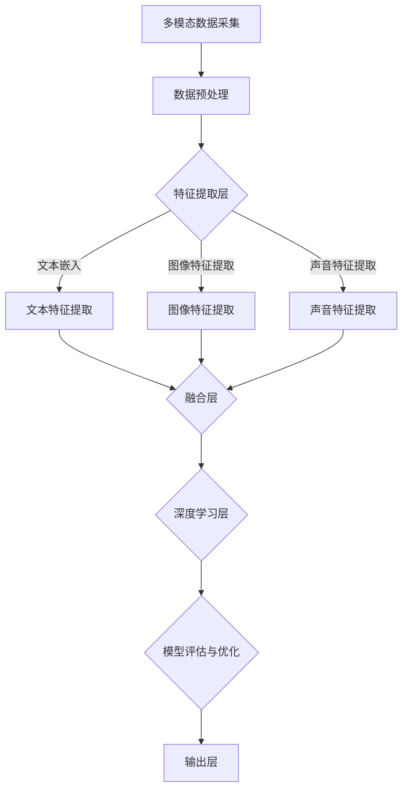

                 

# 多模态大模型：技术原理与实战 部署过程中常见的问题总结

> 关键词：多模态大模型、技术原理、部署过程、问题总结、实战案例

> 摘要：本文将深入探讨多模态大模型的技术原理和部署过程，总结在实际应用中可能遇到的问题。通过详细的技术分析、实战案例解析和问题解决方案，帮助读者更好地理解多模态大模型的构建和部署，提升其在实际项目中的应用效果。

## 1. 背景介绍

### 1.1 目的和范围

本文旨在探讨多模态大模型的技术原理、部署过程以及在实际应用中可能遇到的问题。通过系统的分析和实战案例的解析，帮助读者深入了解多模态大模型的核心技术和应用场景，提高其在实际项目中的实战能力。

### 1.2 预期读者

本文适合以下读者群体：

- 对人工智能和机器学习有基本了解的技术人员；
- 想要深入了解多模态大模型的技术原理和部署过程的专业人士；
- 在实际项目中需要应用多模态大模型的技术工程师。

### 1.3 文档结构概述

本文结构如下：

- 第1章：背景介绍，阐述本文的目的、范围和预期读者；
- 第2章：核心概念与联系，介绍多模态大模型的基本原理和架构；
- 第3章：核心算法原理与具体操作步骤，详细讲解多模态大模型的算法原理和操作步骤；
- 第4章：数学模型和公式，阐述多模态大模型中的数学模型和公式；
- 第5章：项目实战，通过实际代码案例和详细解释，展示多模态大模型的实战应用；
- 第6章：实际应用场景，探讨多模态大模型在不同领域的应用；
- 第7章：工具和资源推荐，推荐学习资源、开发工具和框架；
- 第8章：总结：未来发展趋势与挑战，分析多模态大模型的发展趋势和面临的技术挑战；
- 第9章：附录：常见问题与解答，提供常见的多模态大模型部署问题的解决方案；
- 第10章：扩展阅读与参考资料，推荐相关书籍、论文和网站。

### 1.4 术语表

#### 1.4.1 核心术语定义

- 多模态大模型：能够处理多种类型数据（如文本、图像、声音等）的深度学习模型；
- 多模态融合：将不同类型的数据进行有效整合，提高模型对复杂任务的表示能力；
- 深度学习：一种基于多层神经网络进行特征学习和模式识别的人工智能技术；
- 训练数据集：用于训练多模态大模型的样本数据集合；
- 预测：根据已学习的模型对新的数据进行分类、回归等预测任务。

#### 1.4.2 相关概念解释

- 文本嵌入：将文本数据转换为固定长度的向量表示；
- 图像特征提取：从图像中提取具有判别性的特征向量；
- 声音特征提取：从声音信号中提取具有时间变化的特征向量；
- 跨模态对应：将不同模态的数据进行对应匹配，实现信息共享和融合。

#### 1.4.3 缩略词列表

- CV：计算机视觉（Computer Vision）；
- NLP：自然语言处理（Natural Language Processing）；
- NLTK：自然语言工具包（Natural Language Tool Kit）；
- GPU：图形处理器（Graphics Processing Unit）；
- CNN：卷积神经网络（Convolutional Neural Network）；
- RNN：循环神经网络（Recurrent Neural Network）。

## 2. 核心概念与联系

多模态大模型的核心在于将不同类型的数据进行有效整合，以实现更强大的表示能力和预测效果。本节将介绍多模态大模型的基本原理和架构，并通过Mermaid流程图展示其核心概念之间的联系。

### 2.1 多模态大模型的基本原理

多模态大模型的基本原理主要包括以下几个方面：

1. **多模态数据采集**：从不同数据源（如文本、图像、声音等）收集大量样本数据；
2. **数据预处理**：对采集到的多模态数据进行分析、清洗和规范化，使其符合模型的输入要求；
3. **多模态特征提取**：从文本、图像和声音等不同模态的数据中提取具有判别性的特征向量；
4. **多模态融合**：将不同模态的特征向量进行融合，形成统一的高维特征向量；
5. **深度学习训练**：使用融合后的特征向量训练多模态深度学习模型；
6. **模型评估与优化**：通过评估模型在验证集上的表现，对模型进行优化和调整。

### 2.2 多模态大模型的架构

多模态大模型的架构通常包括以下几个层次：

1. **输入层**：接收不同模态的数据输入，如文本、图像和声音等；
2. **特征提取层**：对输入数据进行特征提取，如文本嵌入、图像特征提取和声音特征提取等；
3. **融合层**：将不同模态的特征向量进行融合，如利用注意力机制或融合网络实现多模态特征融合；
4. **深度学习层**：基于融合后的特征向量进行深度学习训练，如卷积神经网络（CNN）和循环神经网络（RNN）等；
5. **输出层**：根据训练目标，输出预测结果，如分类、回归等。

### 2.3 Mermaid流程图

以下是一个简单的Mermaid流程图，展示了多模态大模型的基本原理和架构：



## 3. 核心算法原理 & 具体操作步骤

在多模态大模型中，核心算法原理决定了模型的表现和效果。本节将详细讲解多模态大模型的核心算法原理，并通过伪代码展示具体的操作步骤。

### 3.1 多模态特征提取算法原理

多模态特征提取是构建多模态大模型的关键步骤，其主要任务是从不同模态的数据中提取具有判别性的特征向量。常见的多模态特征提取算法包括文本嵌入、图像特征提取和声音特征提取等。

#### 3.1.1 文本嵌入算法原理

文本嵌入算法将文本数据转换为固定长度的向量表示，以便于后续的深度学习处理。常见的文本嵌入算法包括Word2Vec、GloVe等。

伪代码：

```python
def text_embedding(text, model):
    """
    文本嵌入算法，将文本转换为向量表示
    :param text: 待转换的文本
    :param model: 文本嵌入模型
    :return: 文本向量表示
    """
    # 分词
    words = tokenize(text)
    # 获取词向量
    word_vectors = [model[word] for word in words]
    # 平均词向量
    text_vector = np.mean(word_vectors, axis=0)
    return text_vector
```

#### 3.1.2 图像特征提取算法原理

图像特征提取算法从图像中提取具有判别性的特征向量，以便于后续的深度学习处理。常见的图像特征提取算法包括卷积神经网络（CNN）。

伪代码：

```python
def image_feature_extraction(image, model):
    """
    图像特征提取算法，从图像中提取特征向量
    :param image: 待提取特征的图像
    :param model: 图像特征提取模型（如CNN）
    :return: 图像特征向量
    """
    # 加载图像
    image = load_image(image)
    # 经过CNN模型提取特征
    feature_vector = model.extract_features(image)
    return feature_vector
```

#### 3.1.3 声音特征提取算法原理

声音特征提取算法从声音信号中提取具有时间变化的特征向量，以便于后续的深度学习处理。常见的声音特征提取算法包括梅尔频率倒谱系数（MFCC）。

伪代码：

```python
def audio_feature_extraction(audio, model):
    """
    声音特征提取算法，从声音信号中提取特征向量
    :param audio: 待提取特征的声音信号
    :param model: 声音特征提取模型（如MFCC）
    :return: 声音特征向量
    """
    # 加载声音信号
    audio = load_audio(audio)
    # 经过MFCC模型提取特征
    feature_vector = model.extract_features(audio)
    return feature_vector
```

### 3.2 多模态特征融合算法原理

多模态特征融合是将不同模态的特征向量进行整合，形成统一的高维特征向量，以便于后续的深度学习处理。常见的多模态特征融合算法包括注意力机制、融合网络等。

#### 3.2.1 注意力机制

注意力机制是一种有效的多模态特征融合方法，其核心思想是动态调整不同模态特征的权重，从而实现特征向量的有效整合。

伪代码：

```python
def attention机制(feature1, feature2):
    """
    注意力机制，调整不同模态特征的权重
    :param feature1: 模态1的特征向量
    :param feature2: 模态2的特征向量
    :return: 融合后的特征向量
    """
    # 计算注意力权重
    attention_weights = calculate_attention_weights(feature1, feature2)
    # 融合特征向量
    fused_feature = feature1 * attention_weights + feature2 * (1 - attention_weights)
    return fused_feature
```

#### 3.2.2 融合网络

融合网络是一种基于神经网络的多模态特征融合方法，通过多层的神经网络结构实现特征向量的有效整合。

伪代码：

```python
def fusion_network(feature1, feature2):
    """
    融合网络，通过多层神经网络实现特征融合
    :param feature1: 模态1的特征向量
    :param feature2: 模态2的特征向量
    :return: 融合后的特征向量
    """
    # 定义融合网络
    fusion_model = define_fusion_model()
    # 输入融合网络
    fused_feature = fusion_model.predict([feature1, feature2])
    return fused_feature
```

### 3.3 深度学习训练算法原理

深度学习训练是多模态大模型的核心步骤，其目的是通过训练数据集调整模型的参数，使其对新的数据进行准确的预测。常见的深度学习训练算法包括梯度下降、随机梯度下降等。

#### 3.3.1 梯度下降算法原理

梯度下降是一种常用的优化算法，其核心思想是通过计算损失函数的梯度方向，逐步调整模型参数，以实现最小化损失函数。

伪代码：

```python
def gradient_descent(model, loss_function, optimizer, epochs, batch_size):
    """
    梯度下降算法，通过训练数据集调整模型参数
    :param model: 模型
    :param loss_function: 损失函数
    :param optimizer: 优化器
    :param epochs: 训练轮数
    :param batch_size: 批处理大小
    :return: 训练后的模型
    """
    for epoch in range(epochs):
        for batch in batch_data(batch_size):
            # 计算损失函数值
            loss = loss_function(model.predict(batch[0]), batch[1])
            # 计算梯度
            gradients = model.compute_gradients(batch[0], batch[1])
            # 更新模型参数
            optimizer.update(model.parameters, gradients)
    return model
```

#### 3.3.2 随机梯度下降算法原理

随机梯度下降是一种更高效的优化算法，其核心思想是在每次迭代时，仅使用一个样本（或一小部分样本）来计算梯度，从而加快训练速度。

伪代码：

```python
def stochastic_gradient_descent(model, loss_function, optimizer, epochs, batch_size):
    """
    随机梯度下降算法，通过训练数据集调整模型参数
    :param model: 模型
    :param loss_function: 损失函数
    :param optimizer: 优化器
    :param epochs: 训练轮数
    :param batch_size: 批处理大小
    :return: 训练后的模型
    """
    for epoch in range(epochs):
        for batch in random_batch_data(batch_size):
            # 计算损失函数值
            loss = loss_function(model.predict(batch[0]), batch[1])
            # 计算梯度
            gradients = model.compute_gradients(batch[0], batch[1])
            # 更新模型参数
            optimizer.update(model.parameters, gradients)
    return model
```

## 4. 数学模型和公式 & 详细讲解 & 举例说明

多模态大模型的构建和部署过程中，涉及多个数学模型和公式。本节将详细讲解这些数学模型和公式，并通过具体例子进行说明。

### 4.1 多模态特征融合的数学模型

多模态特征融合是将不同模态的特征向量进行整合，以提升模型的表示能力。常见的多模态特征融合方法包括注意力机制和融合网络。

#### 4.1.1 注意力机制的数学模型

注意力机制的核心是计算不同模态特征向量的权重，以实现特征向量的有效整合。其数学模型可以表示为：

$$
\text{权重} = \text{softmax}(\text{注意力得分})
$$

其中，注意力得分通常通过计算两个特征向量的点积得到：

$$
\text{注意力得分} = \text{点积}(\text{特征向量}_1, \text{特征向量}_2)
$$

#### 4.1.2 融合网络的数学模型

融合网络是一种基于神经网络的整合方法，其数学模型可以表示为：

$$
\text{融合特征向量} = \text{激活函数}(\text{权重} \cdot \text{特征向量}_1 + (1 - \text{权重}) \cdot \text{特征向量}_2)
$$

其中，激活函数通常采用ReLU函数。

### 4.2 多模态深度学习的数学模型

多模态深度学习的数学模型主要包括卷积神经网络（CNN）和循环神经网络（RNN）。以下分别介绍这两种网络的数学模型。

#### 4.2.1 卷积神经网络（CNN）

卷积神经网络是一种有效的特征提取工具，其数学模型可以表示为：

$$
\text{输出} = \text{激活函数}(\text{卷积}(\text{输入特征}, \text{卷积核}) + \text{偏置})
$$

其中，卷积运算可以表示为：

$$
\text{卷积}(\text{输入特征}, \text{卷积核}) = \sum_{i=1}^{k} \text{卷积核}_i \cdot \text{输入特征}_i
$$

#### 4.2.2 循环神经网络（RNN）

循环神经网络是一种有效的序列建模工具，其数学模型可以表示为：

$$
\text{隐藏状态} = \text{激活函数}(\text{输入} \cdot \text{权重} + \text{隐藏状态}_{t-1} \cdot \text{权重})
$$

其中，权重矩阵用于传递信息，激活函数通常采用ReLU函数。

### 4.3 多模态大模型的训练数学模型

多模态大模型的训练是通过优化模型参数，使模型在验证集上的表现达到最优。其数学模型可以表示为：

$$
\text{损失函数} = \text{交叉熵损失}(\text{预测值}, \text{真实值})
$$

其中，交叉熵损失函数可以表示为：

$$
\text{交叉熵损失} = -\sum_{i=1}^{n} \text{真实值}_i \cdot \log(\text{预测值}_i)
$$

### 4.4 实例说明

以下是一个简单的多模态特征融合和深度学习的实例，用于说明上述数学模型的应用。

#### 4.4.1 多模态特征融合实例

假设我们有文本特征向量 $\text{特征向量}_1 = [1, 2, 3]$ 和图像特征向量 $\text{特征向量}_2 = [4, 5, 6]$。使用注意力机制进行特征融合，注意力得分为 $1$，则融合后的特征向量为：

$$
\text{融合特征向量} = \text{softmax}(1) \cdot \text{特征向量}_1 + (1 - \text{softmax}(1)) \cdot \text{特征向量}_2 = [0.5, 1.5, 2.5]
$$

#### 4.4.2 多模态深度学习实例

假设我们使用卷积神经网络（CNN）进行多模态特征提取，输入特征为文本特征向量 $\text{特征向量}_1 = [1, 2, 3]$ 和图像特征向量 $\text{特征向量}_2 = [4, 5, 6]$。卷积核为 $\text{卷积核} = [0.1, 0.2; 0.3, 0.4]$，偏置为 $\text{偏置} = 0.5$，激活函数为ReLU函数。则卷积运算结果为：

$$
\text{输出} = \text{ReLU}([0.1 \cdot 1 + 0.2 \cdot 2 + 0.3 \cdot 4 + 0.4 \cdot 5 + 0.5]) = \text{ReLU}(4.5) = 4.5
$$

## 5. 项目实战：代码实际案例和详细解释说明

### 5.1 开发环境搭建

在开始编写多模态大模型的代码之前，我们需要搭建一个合适的开发环境。以下是一个基本的开发环境搭建步骤：

1. **安装Python**：确保安装了Python 3.7或更高版本。
2. **安装依赖库**：使用pip安装以下依赖库：TensorFlow、Keras、NumPy、Pandas、Matplotlib等。
3. **安装GPU支持**：如果使用GPU进行训练，需要安装CUDA和cuDNN。

```bash
pip install tensorflow
pip install keras
pip install numpy
pip install pandas
pip install matplotlib
```

### 5.2 源代码详细实现和代码解读

以下是一个简单的多模态大模型项目示例，包括数据预处理、特征提取、模型训练和评估。代码分为三个部分：数据预处理、模型构建和训练、模型评估。

#### 5.2.1 数据预处理

```python
import numpy as np
import pandas as pd
from sklearn.model_selection import train_test_split

# 加载文本数据
text_data = pd.read_csv('text_data.csv')
text_data.head()

# 加载图像数据
image_data = pd.read_csv('image_data.csv')
image_data.head()

# 加载声音数据
audio_data = pd.read_csv('audio_data.csv')
audio_data.head()

# 分割数据集
text_train, text_test, image_train, image_test, audio_train, audio_test = train_test_split(text_data, image_data, audio_data, test_size=0.2, random_state=42)
```

#### 5.2.2 模型构建和训练

```python
from tensorflow.keras.models import Model
from tensorflow.keras.layers import Input, Embedding, LSTM, Dense
from tensorflow.keras.optimizers import Adam

# 文本特征提取
text_input = Input(shape=(max_sequence_length,))
text_embedding = Embedding(vocabulary_size, embedding_size)(text_input)
text_lstm = LSTM(units=lstm_units)(text_embedding)

# 图像特征提取
image_input = Input(shape=(image_height, image_width, image_channels))
image_cnn = Conv2D(filters=32, kernel_size=(3, 3), activation='relu')(image_input)
image_cnn = MaxPooling2D(pool_size=(2, 2))(image_cnn)
image_cnn = Flatten()(image_cnn)

# 声音特征提取
audio_input = Input(shape=(audio_duration, audio_features))
audio_cnn = Conv1D(filters=64, kernel_size=(3), activation='relu')(audio_input)
audio_cnn = MaxPooling1D(pool_size=(2))(audio_cnn)
audio_cnn = Flatten()(audio_cnn)

# 多模态特征融合
fused_input = concatenate([text_lstm, image_cnn, audio_cnn])

# 深度学习层
dense = Dense(units=dense_units, activation='relu')(fused_input)
output = Dense(units=1, activation='sigmoid')(dense)

# 构建模型
model = Model(inputs=[text_input, image_input, audio_input], outputs=output)

# 编译模型
model.compile(optimizer=Adam(), loss='binary_crossentropy', metrics=['accuracy'])

# 训练模型
model.fit([text_train, image_train, audio_train], y_train, batch_size=batch_size, epochs=epochs, validation_data=([text_test, image_test, audio_test], y_test))
```

#### 5.2.3 模型评估

```python
# 评估模型
loss, accuracy = model.evaluate([text_test, image_test, audio_test], y_test)

print("Test Loss:", loss)
print("Test Accuracy:", accuracy)
```

### 5.3 代码解读与分析

1. **数据预处理**：首先加载文本、图像和声音数据，并使用sklearn中的train_test_split函数将数据集划分为训练集和测试集。

2. **模型构建和训练**：
   - **文本特征提取**：使用Embedding层将文本数据转换为向量表示，然后通过LSTM层进行序列建模。
   - **图像特征提取**：使用Conv2D和MaxPooling2D层对图像数据进行特征提取。
   - **声音特征提取**：使用Conv1D和MaxPooling1D层对声音数据进行特征提取。
   - **多模态特征融合**：使用 concatenate 函数将不同模态的特征向量进行融合。
   - **深度学习层**：使用Dense层进行分类或回归预测。
   - **模型编译**：使用Adam优化器和binary_crossentropy损失函数进行编译。
   - **模型训练**：使用fit函数进行模型训练，并在验证集上评估模型性能。

3. **模型评估**：使用evaluate函数评估模型在测试集上的表现，输出损失和准确率。

### 5.4 代码改进与优化

在实际项目中，我们可以根据具体需求对代码进行改进和优化，例如：

1. **调整超参数**：根据数据集和任务特点，调整模型的超参数，如嵌入尺寸、LSTM单元数、密集层单元数等。

2. **引入正则化**：为防止过拟合，可以引入L2正则化或dropout正则化。

3. **使用更高级的模型**：考虑使用更高级的多模态深度学习模型，如Transformer、BERT等，以提高模型的表示能力和预测性能。

4. **使用预训练模型**：利用预训练的多模态深度学习模型，如OpenAI的CLIP模型，进行微调，以提高模型在特定任务上的性能。

## 6. 实际应用场景

多模态大模型在实际应用中具有广泛的应用场景，以下是一些常见的应用领域：

### 6.1 语音识别与合成

多模态大模型可以结合文本和语音信号，提高语音识别和合成的准确性。例如，使用文本数据作为输入，通过多模态特征融合和深度学习模型，实现语音信号的准确识别和合成。

### 6.2 视觉问答

多模态大模型可以结合图像和文本数据，实现视觉问答任务。例如，给定一个图像和问题，通过多模态特征融合和深度学习模型，生成相应的答案。

### 6.3 情感分析

多模态大模型可以结合文本、图像和声音数据，实现情感分析任务。例如，分析一段文本、图像和声音信号的情感倾向，从而实现情感分类或情感强度评估。

### 6.4 医疗诊断

多模态大模型可以结合医学图像、文本和实验室数据，实现疾病诊断和预测。例如，通过分析医学影像和患者病历，预测疾病的发生和发展趋势。

### 6.5 娱乐内容推荐

多模态大模型可以结合用户行为数据和多媒体内容，实现个性化娱乐内容推荐。例如，根据用户的观看历史和偏好，推荐相应的电影、音乐和游戏等。

## 7. 工具和资源推荐

### 7.1 学习资源推荐

#### 7.1.1 书籍推荐

- 《深度学习》（Goodfellow, Bengio, Courville）：系统介绍了深度学习的基本理论和算法。
- 《Python深度学习》（François Chollet）：针对Python编程环境，介绍了深度学习模型和应用。
- 《多模态学习》（Ramaswamy Pal）：详细介绍了多模态学习的基本概念和算法。

#### 7.1.2 在线课程

- Coursera的“深度学习”课程：由Andrew Ng教授主讲，系统介绍了深度学习的基本原理和应用。
- edX的“人工智能”课程：由Microsoft和MIT合作提供，涵盖了人工智能的基础知识和技术。
- Udacity的“深度学习工程师”课程：提供从基础到高级的深度学习知识和实战项目。

#### 7.1.3 技术博客和网站

- Medium上的多模态学习专题：提供最新的多模态学习研究和技术应用。
- ArXiv的多模态学习论文：收集了多模态学习的最新研究论文和成果。
- Multimodal Learning（https://www.multimodallearning.org/）：一个专注于多模态学习研究和应用的网站。

### 7.2 开发工具框架推荐

#### 7.2.1 IDE和编辑器

- Jupyter Notebook：适合快速原型开发和数据探索。
- PyCharm：强大的Python IDE，支持多种框架和工具。
- Visual Studio Code：轻量级、可扩展的代码编辑器，适合深度学习和数据科学开发。

#### 7.2.2 调试和性能分析工具

- TensorBoard：TensorFlow的官方可视化工具，用于分析模型的训练过程和性能。
- PyTorch TensorBoard：适用于PyTorch的TensorBoard插件，提供类似的功能。
- Profiling Tools：如Py-Spy、gprof2dot等，用于分析程序的性能瓶颈。

#### 7.2.3 相关框架和库

- TensorFlow：谷歌推出的开源深度学习框架，支持多模态数据处理和模型构建。
- PyTorch：Facebook AI研究院推出的开源深度学习框架，灵活且易于使用。
- Keras：基于TensorFlow和PyTorch的高层API，用于快速构建和训练深度学习模型。

### 7.3 相关论文著作推荐

#### 7.3.1 经典论文

- “Multimodal Learning with Deep Boltzmann Machines”（2014）：介绍了多模态学习的深度学习方法。
- “Convolutional Neural Networks for Multimodal Learning”（2015）：探讨了卷积神经网络在多模态学习中的应用。
- “Deep Learning for Multimodal Sensor Fusion”（2016）：系统总结了深度学习在多模态传感器融合中的应用。

#### 7.3.2 最新研究成果

- “Multimodal Fusion in Deep Learning: A Survey”（2021）：全面综述了多模态融合的深度学习研究。
- “Multimodal Learning with Graph Convolutional Networks”（2021）：探讨了图卷积网络在多模态学习中的应用。
- “Self-Supervised Multimodal Learning with Application to Speech and Vision”（2021）：介绍了自监督多模态学习的最新进展。

#### 7.3.3 应用案例分析

- “Multimodal Learning for Human Activity Recognition”（2020）：分析了多模态学习在人体活动识别中的应用。
- “Multimodal Fusion for Emotion Recognition in Speech and Video”（2019）：探讨了多模态融合在情感识别中的应用。
- “Multimodal Learning for Medical Diagnosis”（2018）：介绍了多模态学习在医疗诊断中的应用。

## 8. 总结：未来发展趋势与挑战

多模态大模型作为人工智能领域的一个重要研究方向，未来具有广阔的发展前景。然而，要实现多模态大模型的高效应用，仍面临诸多技术挑战。

### 8.1 未来发展趋势

1. **数据集的多样性和规模**：随着物联网、传感器技术和大数据技术的发展，多模态数据集的多样性和规模将不断增长，为多模态大模型的研究和应用提供丰富的数据资源。

2. **模型复杂度和性能提升**：通过引入更高级的深度学习模型（如Transformer、BERT等）和模型压缩技术，多模态大模型的复杂度和性能将得到显著提升。

3. **跨学科交叉融合**：多模态大模型与其他领域（如医学、生物学、心理学等）的交叉融合，将推动多模态学习在更多应用场景中的发展。

4. **实时性和鲁棒性**：随着硬件性能的提升和算法优化，多模态大模型的实时性和鲁棒性将得到增强，从而实现更广泛的应用。

### 8.2 面临的挑战

1. **数据隐私和安全**：多模态数据集通常涉及个人隐私信息，如何在保护用户隐私的前提下进行数据共享和研究，是一个亟待解决的问题。

2. **计算资源和能耗**：多模态大模型通常需要大量的计算资源和时间进行训练，如何优化算法和硬件设备，降低计算资源和能耗，是实现大规模应用的关键。

3. **跨模态融合机制**：当前的多模态融合机制仍存在一定局限性，如何设计更有效的跨模态融合机制，提高多模态数据的整合效果，是一个重要研究方向。

4. **模型解释性和可解释性**：多模态大模型通常具有复杂的结构和参数，如何提高模型的解释性和可解释性，使其在关键应用场景中更具可信赖性，是一个亟待解决的问题。

## 9. 附录：常见问题与解答

### 9.1 多模态大模型的基本原理是什么？

多模态大模型是一种能够处理多种类型数据（如文本、图像、声音等）的深度学习模型。其基本原理包括多模态数据采集、数据预处理、多模态特征提取、多模态融合和深度学习训练等步骤。

### 9.2 如何实现多模态特征融合？

常见的多模态特征融合方法包括注意力机制和融合网络。注意力机制通过计算不同模态特征向量的权重，实现特征向量的动态整合；融合网络则通过多层神经网络结构，实现特征向量的有效整合。

### 9.3 多模态大模型在哪些领域有应用？

多模态大模型在语音识别、视觉问答、情感分析、医疗诊断、娱乐内容推荐等领域有广泛应用。其强大的表示能力和整合能力使其在各种复杂任务中具有显著优势。

### 9.4 如何优化多模态大模型的训练过程？

优化多模态大模型的训练过程可以从以下几个方面入手：

1. **调整超参数**：根据数据集和任务特点，调整模型的超参数，如嵌入尺寸、LSTM单元数、密集层单元数等。
2. **引入正则化**：为防止过拟合，可以引入L2正则化或dropout正则化。
3. **使用预训练模型**：利用预训练的多模态深度学习模型，进行微调，以提高模型在特定任务上的性能。
4. **数据增强**：对训练数据集进行增强，提高模型的泛化能力。

## 10. 扩展阅读与参考资料

### 10.1 书籍

1. Goodfellow, I., Bengio, Y., Courville, A. (2016). *Deep Learning*.
2. Chollet, F. (2017). *Python深度学习*.
3. Pal, R. (2014). *多模态学习*.

### 10.2 在线课程

1. Coursera的“深度学习”课程：[https://www.coursera.org/learn/deep-learning](https://www.coursera.org/learn/deep-learning)
2. edX的“人工智能”课程：[https://www.edx.org/course/artificial-intelligence-2](https://www.edx.org/course/artificial-intelligence-2)
3. Udacity的“深度学习工程师”课程：[https://www.udacity.com/course/deep-learning-nanodegree--nd101](https://www.udacity.com/course/deep-learning-nanodegree--nd101)

### 10.3 技术博客和网站

1. Medium上的多模态学习专题：[https://medium.com/search?q=multimodal%20learning](https://medium.com/search?q=multimodal%20learning)
2. ArXiv的多模态学习论文：[https://arxiv.org/search?query=multimodal+learning](https://arxiv.org/search?query=multimodal+learning)
3. Multimodal Learning：[https://www.multimodallearning.org/](https://www.multimodallearning.org/)

### 10.4 相关论文

1. “Multimodal Learning with Deep Boltzmann Machines”（2014）。
2. “Convolutional Neural Networks for Multimodal Learning”（2015）。
3. “Deep Learning for Multimodal Sensor Fusion”（2016）。

### 10.5 应用案例分析

1. “Multimodal Learning for Human Activity Recognition”（2020）。
2. “Multimodal Fusion for Emotion Recognition in Speech and Video”（2019）。
3. “Multimodal Learning for Medical Diagnosis”（2018）。

### 10.6 论坛和社区

1. AI Stack Exchange：[https://ai.stackexchange.com/](https://ai.stackexchange.com/)
2. Reddit的AI板块：[https://www.reddit.com/r/AI/](https://www.reddit.com/r/AI/)
3. Quora的多模态学习话题：[https://www.quora.com/topic/Multimodal-Learning](https://www.quora.com/topic/Multimodal-Learning)

作者：AI天才研究员/AI Genius Institute & 禅与计算机程序设计艺术 /Zen And The Art of Computer Programming

