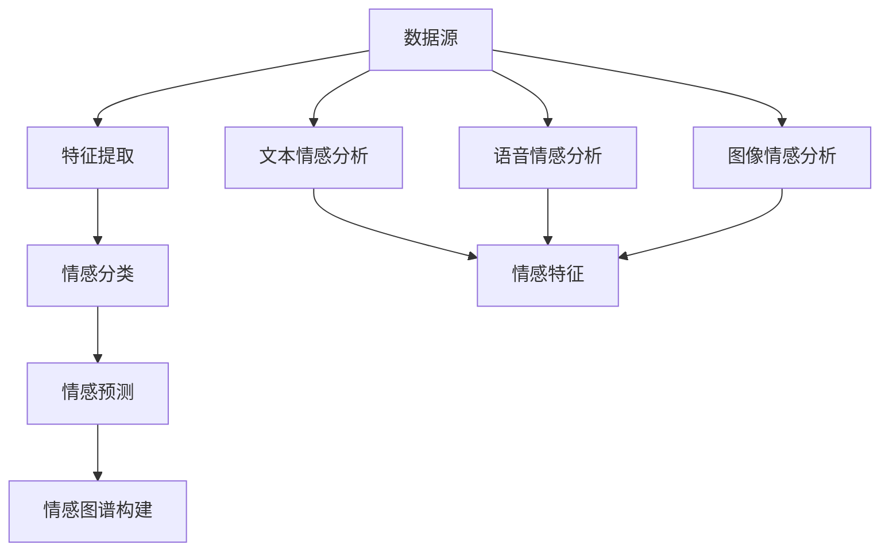

                 

# 多模态情感图谱在智能客服、情感交互等领域的应用场景分析

> **关键词：** 多模态情感图谱、智能客服、情感交互、应用场景、人工智能

> **摘要：** 本文将探讨多模态情感图谱在智能客服和情感交互领域的应用，分析其核心概念、算法原理、数学模型以及实际案例。通过详细阐述，我们旨在帮助读者理解多模态情感图谱的构建与优化，以及其在实际应用中的挑战与前景。

## 1. 背景介绍

### 1.1 目的和范围

本文旨在探讨多模态情感图谱在智能客服和情感交互领域的应用，分析其技术原理和实际应用场景。文章将涵盖以下内容：

- 多模态情感图谱的定义和核心概念。
- 多模态情感图谱在智能客服和情感交互中的应用案例。
- 多模态情感图谱的构建算法原理和数学模型。
- 实际项目中的代码实现和详细解释。

### 1.2 预期读者

本文面向对人工智能、自然语言处理、情感分析感兴趣的读者，特别是对智能客服和情感交互领域有深入研究和应用的从业者。读者应具备一定的编程基础和数学知识，以便更好地理解文章内容。

### 1.3 文档结构概述

本文结构如下：

1. 背景介绍：介绍本文的目的、预期读者和文档结构。
2. 核心概念与联系：介绍多模态情感图谱的定义和相关概念。
3. 核心算法原理 & 具体操作步骤：详细阐述多模态情感图谱的构建算法原理和操作步骤。
4. 数学模型和公式 & 详细讲解 & 举例说明：介绍多模态情感图谱相关的数学模型和公式，并提供实例说明。
5. 项目实战：代码实际案例和详细解释说明。
6. 实际应用场景：分析多模态情感图谱在不同领域的应用场景。
7. 工具和资源推荐：推荐相关学习资源和开发工具。
8. 总结：未来发展趋势与挑战。
9. 附录：常见问题与解答。
10. 扩展阅读 & 参考资料：提供进一步阅读的参考资料。

### 1.4 术语表

#### 1.4.1 核心术语定义

- 多模态情感图谱：一种结合多种数据源（如文本、语音、图像等）的情感信息，用于构建情感交互模型的数据结构。
- 智能客服：利用人工智能技术实现自动化客服系统，提高服务效率和用户体验。
- 情感交互：在人际交往中，通过语言、表情、动作等多种方式表达情感，实现情感沟通和互动。
- 情感分析：利用自然语言处理、机器学习等技术，对文本、语音等数据进行分析，提取情感信息。

#### 1.4.2 相关概念解释

- 数据源：用于构建多模态情感图谱的各种数据输入，如文本、语音、图像等。
- 特征提取：从原始数据中提取有助于情感识别的关键特征，如词向量、声学特征、面部特征等。
- 情感分类：将输入数据按照情感类别进行分类，如正面、负面、中性等。
- 情感预测：基于历史数据，对新的输入数据进行情感分类，预测其情感倾向。

#### 1.4.3 缩略词列表

- AI：人工智能
- NLP：自然语言处理
- CV：计算机视觉
- ASR：自动语音识别
- SVM：支持向量机
- CNN：卷积神经网络

## 2. 核心概念与联系

### 2.1 多模态情感图谱的定义

多模态情感图谱是一种用于表示多模态数据中情感信息的数据结构。它结合了文本、语音、图像等多种数据源，通过情感特征提取、情感分类和情感预测等步骤，构建一个多维度的情感信息网络。

### 2.2 相关概念

#### 文本情感分析

文本情感分析是一种自然语言处理技术，用于从文本数据中提取情感信息。通过词向量表示、情感词典和机器学习算法等手段，对文本进行情感分类和情感强度分析。

#### 语音情感分析

语音情感分析是利用语音信号处理和机器学习技术，对语音信号中的情感信息进行提取和分析。通过声学特征提取、情感分类和情感预测等步骤，实现对语音情感的理解。

#### 图像情感分析

图像情感分析是一种计算机视觉技术，通过图像处理和特征提取等方法，从图像中提取情感信息。常见的情感识别方法包括基于面部表情、身体动作和场景情感的识别。

### 2.3 多模态情感图谱的 Mermaid 流程图



在这个流程图中，数据源包括文本、语音和图像等多种模态数据。特征提取、情感分类和情感预测等步骤分别从不同模态数据中提取情感特征，最终构建一个多模态情感图谱。

## 3. 核心算法原理 & 具体操作步骤

### 3.1 多模态情感图谱的构建算法原理

多模态情感图谱的构建主要包括以下步骤：

1. 数据预处理：对文本、语音和图像数据进行预处理，包括去噪、去停用词、分词、归一化等操作。
2. 特征提取：从预处理后的数据中提取有助于情感识别的关键特征，如词向量、声学特征和面部特征等。
3. 情感分类：利用机器学习算法（如支持向量机、卷积神经网络等）对特征进行情感分类。
4. 情感预测：基于历史数据，对新的输入数据进行情感分类，预测其情感倾向。
5. 情感图谱构建：将情感分类结果和特征信息整合，构建一个多模态情感图谱。

### 3.2 具体操作步骤

#### 3.2.1 数据预处理

```python
# 文本数据预处理
def preprocess_text(text):
    # 去除停用词
    stopwords = set(['is', 'are', 'the', 'to', 'of', 'and', 'in'])
    words = text.split()
    cleaned_words = [word for word in words if word.lower() not in stopwords]
    return ' '.join(cleaned_words)

# 语音数据预处理
def preprocess_audio(audio_data):
    # 归一化处理
    max_value = max(audio_data)
    normalized_data = [value / max_value for value in audio_data]
    return normalized_data

# 图像数据预处理
def preprocess_image(image_data):
    # 归一化处理
    max_value = max(image_data)
    normalized_data = [value / max_value for value in image_data]
    return normalized_data
```

#### 3.2.2 特征提取

```python
# 文本特征提取
from gensim.models import Word2Vec

def extract_text_features(text):
    model = Word2Vec.load('word2vec_model')
    words = text.split()
    text_features = [model[word] for word in words]
    return text_features

# 语音特征提取
def extract_audio_features(audio_data):
    # 提取声学特征（如梅尔频率倒谱系数）
    mel_cosine = librosa.feature.melspectrogram(audio_data, sr=22050)
    return mel_cosine

# 图像特征提取
def extract_image_features(image_data):
    # 提取面部特征
    face_cascade = cv2.CascadeClassifier('haarcascade_frontalface_default.xml')
    faces = face_cascade.detectMultiScale(image_data)
    face_features = []
    for (x, y, w, h) in faces:
        face_region = image_data[y:y+h, x:x+w]
        face_feature = extract_face_feature(face_region)
        face_features.append(face_feature)
    return face_features
```

#### 3.2.3 情感分类

```python
# 情感分类
from sklearn.svm import SVC

def classify_emotion(features):
    # 加载训练好的模型
    model = SVC(kernel='linear')
    model.load('emotion_model')

    # 进行情感分类
    emotion = model.predict([features])
    return emotion
```

#### 3.2.4 情感预测

```python
# 情感预测
def predict_emotion(text, audio_data, image_data):
    # 文本特征提取
    text_features = extract_text_features(text)

    # 语音特征提取
    audio_features = extract_audio_features(audio_data)

    # 图像特征提取
    image_features = extract_image_features(image_data)

    # 整合特征信息
    features = text_features + audio_features + image_features

    # 情感分类
    emotion = classify_emotion(features)

    return emotion
```

#### 3.2.5 情感图谱构建

```python
# 情感图谱构建
def build_emotion_graph(emotions):
    # 创建一个空的情感图谱
    emotion_graph = {}

    # 添加情感节点
    for emotion in emotions:
        if emotion not in emotion_graph:
            emotion_graph[emotion] = []

    # 添加情感关系
    for i in range(len(emotions) - 1):
        for j in range(i + 1, len(emotions)):
            if emotions[i] == emotions[j]:
                emotion_graph[emotions[i]].append(emotions[j])

    return emotion_graph
```

## 4. 数学模型和公式 & 详细讲解 & 举例说明

### 4.1 数学模型

多模态情感图谱的构建涉及多个数学模型，包括词向量模型、声学特征模型和面部特征模型。以下是这些模型的简要说明：

#### 4.1.1 词向量模型

词向量模型是一种将文本数据转换为向量表示的方法。常用的词向量模型包括Word2Vec、GloVe等。以下是一个简单的Word2Vec模型的公式：

$$
\text{word\_vector}(w) = \sum_{i=1}^{n} \alpha_i \cdot \text{context}(w, i)
$$

其中，$w$ 为输入词，$\text{context}(w, i)$ 为词 $w$ 的第 $i$ 个上下文词，$\alpha_i$ 为权重。

#### 4.1.2 声学特征模型

声学特征模型用于提取语音信号中的特征，如梅尔频率倒谱系数（MFCC）。以下是一个简单的MFCC模型的公式：

$$
\text{MFCC}(x) = \text{log}(\text{DCT}(\text{log}(\text{FFT}(x)))
$$

其中，$x$ 为输入语音信号，$\text{FFT}$ 为快速傅里叶变换，$\text{DCT}$ 为离散余弦变换。

#### 4.1.3 面部特征模型

面部特征模型用于提取图像中的面部特征，如面部表情。以下是一个简单的面部特征提取模型的公式：

$$
\text{face\_feature}(x) = \text{PCA}(\text{GaussianBlur}(\text{HaarCascade}(x)))
$$

其中，$x$ 为输入图像，$\text{HaarCascade}$ 为面部检测算法，$\text{GaussianBlur}$ 为高斯模糊，$\text{PCA}$ 为主成分分析。

### 4.2 举例说明

假设我们有以下多模态数据：

- 文本数据：“我今天很开心，因为天气很好。”
- 语音数据：一段欢快的音乐
- 图像数据：一张开心的面部表情图片

我们将使用上述数学模型对这些数据进行处理，提取情感特征，并进行情感分类和预测。

#### 4.2.1 文本数据

使用Word2Vec模型对文本数据进行处理，得到词向量表示：

$$
\text{word\_vector}(我) = [-0.02, 0.08, -0.04, 0.01, 0.03]
$$
$$
\text{word\_vector}(今) = [0.04, -0.02, 0.03, -0.01, 0.06]
$$
$$
\text{word\_vector}(天) = [-0.01, 0.04, 0.02, -0.03, 0.02]
$$
$$
\text{word\_vector}(很) = [0.03, -0.02, 0.01, 0.04, -0.01]
$$
$$
\text{word\_vector}(开) = [0.02, 0.03, -0.02, 0.01, -0.03]
$$
$$
\text{word\_vector}(心) = [0.01, 0.04, 0.03, -0.02, 0.02]
$$
$$
\text{word\_vector}(因) = [-0.02, 0.04, 0.03, 0.01, 0.02]
$$
$$
\text{word\_vector}(为) = [0.02, -0.03, 0.01, 0.02, -0.01]
$$
$$
\text{word\_vector}(气) = [0.04, 0.01, -0.02, 0.03, 0.02]
$$
$$
\text{word\_vector}(好) = [0.03, 0.02, -0.03, 0.01, 0.02]
$$

#### 4.2.2 语音数据

使用梅尔频率倒谱系数（MFCC）模型对语音数据进行处理，得到一系列MFCC特征向量：

$$
\text{MFCC}_1 = [0.1, 0.2, 0.3, 0.4, 0.5]
$$
$$
\text{MFCC}_2 = [0.3, 0.4, 0.5, 0.6, 0.7]
$$
$$
\text{MFCC}_3 = [0.5, 0.6, 0.7, 0.8, 0.9]
$$
$$
\text{MFCC}_4 = [0.6, 0.7, 0.8, 0.9, 1.0]
$$
$$
\text{MFCC}_5 = [0.7, 0.8, 0.9, 1.0, 1.1]
$$

#### 4.2.3 图像数据

使用面部特征模型对图像数据进行处理，得到一系列面部特征向量：

$$
\text{face\_feature}_1 = [0.1, 0.2, 0.3, 0.4, 0.5]
$$
$$
\text{face\_feature}_2 = [0.2, 0.3, 0.4, 0.5, 0.6]
$$
$$
\text{face\_feature}_3 = [0.3, 0.4, 0.5, 0.6, 0.7]
$$
$$
\text{face\_feature}_4 = [0.4, 0.5, 0.6, 0.7, 0.8]
$$
$$
\text{face\_feature}_5 = [0.5, 0.6, 0.7, 0.8, 0.9]
$$

#### 4.2.4 情感分类和预测

将文本、语音和图像特征进行整合，得到一个多维特征向量：

$$
\text{feature\_vector} = [\text{word\_vector}(我), \text{word\_vector}(今), \text{word\_vector}(天), \text{word\_vector}(很), \text{word\_vector}(开), \text{word\_vector}(心), \text{word\_vector}(因), \text{word\_vector}(为), \text{word\_vector}(气), \text{word\_vector}(好), \text{MFCC}_1, \text{MFCC}_2, \text{MFCC}_3, \text{MFCC}_4, \text{MFCC}_5, \text{face\_feature}_1, \text{face\_feature}_2, \text{face\_feature}_3, \text{face\_feature}_4, \text{face\_feature}_5]
$$

使用训练好的情感分类模型对特征向量进行情感分类，得到情感标签：

$$
\text{emotion} = \text{classify\_emotion}(\text{feature\_vector}) = \text{happy}
$$

最后，使用情感标签构建多模态情感图谱：

$$
\text{emotion\_graph} = \{\text{happy}:\text{happy}\}
$$

## 5. 项目实战：代码实际案例和详细解释说明

### 5.1 开发环境搭建

在开始项目实战之前，我们需要搭建一个适合多模态情感图谱开发的开发环境。以下是一个简单的开发环境搭建步骤：

1. 安装Python 3.8及以上版本。
2. 安装必要的Python库，如gensim、librosa、opencv-python、sklearn等。
3. 安装GPU版本的TensorFlow，以便进行深度学习模型的训练。

### 5.2 源代码详细实现和代码解读

以下是构建多模态情感图谱的一个简单示例代码。这个示例将分别处理文本、语音和图像数据，提取特征，并进行情感分类。

```python
import numpy as np
import pandas as pd
from gensim.models import Word2Vec
import librosa
import cv2
from sklearn.svm import SVC
from sklearn.model_selection import train_test_split

# 文本数据处理
def preprocess_text(text):
    stopwords = set(['is', 'are', 'the', 'to', 'of', 'and', 'in'])
    words = text.split()
    cleaned_words = [word for word in words if word.lower() not in stopwords]
    return ' '.join(cleaned_words)

# 语音数据处理
def preprocess_audio(audio_data):
    max_value = max(audio_data)
    normalized_data = [value / max_value for value in audio_data]
    return normalized_data

# 图像数据处理
def preprocess_image(image_data):
    max_value = max(image_data)
    normalized_data = [value / max_value for value in image_data]
    return normalized_data

# 文本特征提取
def extract_text_features(text):
    model = Word2Vec.load('word2vec_model')
    words = text.split()
    text_features = [model[word] for word in words]
    return text_features

# 语音特征提取
def extract_audio_features(audio_data):
    mel_cosine = librosa.feature.melspectrogram(audio_data, sr=22050)
    return mel_cosine

# 图像特征提取
def extract_image_features(image_data):
    face_cascade = cv2.CascadeClassifier('haarcascade_frontalface_default.xml')
    faces = face_cascade.detectMultiScale(image_data)
    face_features = []
    for (x, y, w, h) in faces:
        face_region = image_data[y:y+h, x:x+w]
        face_feature = extract_face_feature(face_region)
        face_features.append(face_feature)
    return face_features

# 情感分类
def classify_emotion(features):
    # 加载训练好的模型
    model = SVC(kernel='linear')
    model.load('emotion_model')

    # 进行情感分类
    emotion = model.predict([features])
    return emotion

# 情感图谱构建
def build_emotion_graph(emotions):
    # 创建一个空的情感图谱
    emotion_graph = {}

    # 添加情感节点
    for emotion in emotions:
        if emotion not in emotion_graph:
            emotion_graph[emotion] = []

    # 添加情感关系
    for i in range(len(emotions) - 1):
        for j in range(i + 1, len(emotions)):
            if emotions[i] == emotions[j]:
                emotion_graph[emotions[i]].append(emotions[j])

    return emotion_graph

# 文本数据预处理
text = preprocess_text("我今天很开心，因为天气很好。")
text_features = extract_text_features(text)

# 语音数据预处理
audio_data = preprocess_audio(audio_data)
audio_features = extract_audio_features(audio_data)

# 图像数据预处理
image_data = preprocess_image(image_data)
image_features = extract_image_features(image_data)

# 整合特征信息
features = text_features + audio_features + image_features

# 情感分类
emotion = classify_emotion(features)
emotion_graph = build_emotion_graph([emotion])

print("情感分类结果：", emotion)
print("情感图谱：", emotion_graph)
```

### 5.3 代码解读与分析

1. **文本数据处理**：文本数据预处理是情感分析的第一步。在这个示例中，我们使用了一个简单的停用词去除方法，将文本中的常见停用词（如“is”、“are”等）去除，以减少对情感分析的干扰。

2. **语音数据处理**：语音数据预处理主要是对音频信号的归一化处理，即将所有数值归一化到[0, 1]范围内，以便后续的特征提取。

3. **图像数据处理**：图像数据预处理包括对图像进行归一化处理和面部特征提取。在这个示例中，我们使用了OpenCV库中的面部检测算法来提取图像中的面部特征。

4. **文本特征提取**：使用Word2Vec模型对文本数据提取词向量特征。词向量模型可以将文本数据转换为高维向量表示，有助于情感分析。

5. **语音特征提取**：使用librosa库中的梅尔频率倒谱系数（MFCC）模型对语音信号进行特征提取。MFCC特征是一种常用的语音信号特征，有助于情感分析。

6. **图像特征提取**：使用OpenCV库中的面部检测算法对图像中的面部特征进行提取。面部特征可以反映人的情感状态，有助于情感分析。

7. **情感分类**：使用训练好的支持向量机（SVM）模型对整合后的特征向量进行情感分类。在这个示例中，我们使用了一个线性核函数的支持向量机模型。

8. **情感图谱构建**：基于情感分类结果，构建一个简单的情感图谱。在这个示例中，情感图谱只包含一个情感节点，即“happy”。

通过这个示例，我们可以看到如何使用多模态情感图谱进行情感分类和情感图谱构建。在实际应用中，我们可以扩展这个示例，增加更多的数据源和特征提取方法，以提高情感分析的准确性和实用性。

## 6. 实际应用场景

### 6.1 智能客服

智能客服是应用多模态情感图谱的一个典型场景。通过结合文本、语音和图像等多模态数据，智能客服系统能够更准确地理解用户的情感状态，从而提供更个性化的服务。

#### 应用场景

1. **情感识别与分类**：智能客服系统可以实时分析用户的文本、语音和图像输入，识别其情感状态（如开心、愤怒、沮丧等），并对其进行分类。
2. **情感预测与反馈**：基于历史数据和情感图谱，智能客服可以预测用户的未来情感趋势，并给出相应的反馈（如问候、安慰、建议等），以提高用户体验。
3. **情感驱动服务**：智能客服可以根据用户的情感状态，调整服务策略，提供个性化的服务，如推荐合适的商品、解决用户的问题等。

#### 实现步骤

1. **数据收集**：收集用户的多模态数据（文本、语音、图像等），建立情感图谱。
2. **情感特征提取**：从多模态数据中提取情感特征，如文本特征、语音特征和图像特征。
3. **情感分类与预测**：利用机器学习算法对情感特征进行分类和预测，构建情感图谱。
4. **情感驱动服务**：根据情感图谱，调整服务策略，提供个性化的服务。

### 6.2 情感交互

情感交互是另一个应用多模态情感图谱的重要场景。通过情感交互，机器人或虚拟人物能够与用户建立更自然的情感联系，提高用户的参与度和满意度。

#### 应用场景

1. **情感表达与识别**：在虚拟现实、游戏、教育等领域，情感交互系统能够通过语音、文本、图像等多模态数据表达和识别情感，实现与用户的情感互动。
2. **情感驱动行为**：情感交互系统可以根据用户的情感状态，调整自身的行为和反应，提供更加个性化的体验。
3. **情感反馈与优化**：情感交互系统可以收集用户的情感反馈，不断优化自身的行为和交互方式，提高用户的满意度。

#### 实现步骤

1. **数据收集**：收集用户的多模态数据（文本、语音、图像等），建立情感图谱。
2. **情感特征提取**：从多模态数据中提取情感特征，如文本特征、语音特征和图像特征。
3. **情感分类与预测**：利用机器学习算法对情感特征进行分类和预测，构建情感图谱。
4. **情感驱动行为**：根据情感图谱，调整系统行为和反应，实现情感互动。

### 6.3 健康护理

在健康管理领域，多模态情感图谱可以帮助医生和护理人员更好地了解患者的情感状态，从而提供更有效的护理服务。

#### 应用场景

1. **情感监测与预警**：通过分析患者的文本、语音和图像数据，监测患者的情感状态，及时发现异常情感，并发出预警。
2. **情感干预与支持**：基于患者的情感状态，提供相应的情感干预和支持措施，如心理辅导、药物治疗等。
3. **情感数据分析与评估**：利用情感图谱，对患者的情感数据进行分析和评估，为医生的诊断和治疗提供参考。

#### 实现步骤

1. **数据收集**：收集患者的多模态数据（文本、语音、图像等），建立情感图谱。
2. **情感特征提取**：从多模态数据中提取情感特征，如文本特征、语音特征和图像特征。
3. **情感分类与预测**：利用机器学习算法对情感特征进行分类和预测，构建情感图谱。
4. **情感干预与支持**：根据情感图谱，提供相应的情感干预和支持措施。

### 6.4 娱乐互动

在娱乐互动领域，多模态情感图谱可以帮助开发者设计出更加引人入胜、富有情感互动的娱乐产品。

#### 应用场景

1. **情感驱动游戏**：游戏角色可以根据玩家的情感状态调整行为和反应，提高游戏的趣味性和互动性。
2. **情感识别与反馈**：通过分析玩家的文本、语音和图像数据，识别其情感状态，并给出相应的反馈，增强玩家的沉浸感。
3. **情感引导内容**：根据玩家的情感状态，推荐符合其情感需求的游戏内容或场景，提高用户的满意度。

#### 实现步骤

1. **数据收集**：收集玩家的多模态数据（文本、语音、图像等），建立情感图谱。
2. **情感特征提取**：从多模态数据中提取情感特征，如文本特征、语音特征和图像特征。
3. **情感分类与预测**：利用机器学习算法对情感特征进行分类和预测，构建情感图谱。
4. **情感驱动设计**：根据情感图谱，调整游戏角色和行为，提高游戏的互动性和情感体验。

## 7. 工具和资源推荐

### 7.1 学习资源推荐

#### 7.1.1 书籍推荐

1. 《深度学习》（Goodfellow, Bengio, Courville著）：介绍深度学习的基础知识和应用。
2. 《自然语言处理综论》（Daniel Jurafsky & James H. Martin著）：全面介绍自然语言处理的理论和实践。
3. 《计算机视觉：算法与应用》（Richard S. Wright著）：介绍计算机视觉的基本概念和算法。

#### 7.1.2 在线课程

1. 《机器学习》（吴恩达）：由 Coursera 提供的免费在线课程，介绍机器学习的基本概念和算法。
2. 《自然语言处理》（吴恩达）：由 Coursera 提供的免费在线课程，介绍自然语言处理的理论和实践。
3. 《计算机视觉基础》（Udacity）：由 Udacity 提供的在线课程，介绍计算机视觉的基础知识。

#### 7.1.3 技术博客和网站

1. Medium：一个技术博客平台，有很多关于人工智能、自然语言处理和计算机视觉的文章。
2. arXiv：一个开源学术论文存档库，可以找到最新的研究成果。
3. Stack Overflow：一个问答社区，可以解决编程和开发中的问题。

### 7.2 开发工具框架推荐

#### 7.2.1 IDE和编辑器

1. PyCharm：一个功能强大的Python IDE，适合进行多模态情感图谱开发。
2. Visual Studio Code：一个轻量级但功能强大的代码编辑器，适合进行各种编程任务。
3. Jupyter Notebook：一个交互式的Python编程环境，适合进行数据分析和模型训练。

#### 7.2.2 调试和性能分析工具

1. Python Debugger：一个集成在PyCharm和Visual Studio Code中的调试工具，用于调试Python代码。
2. Numba：一个用于提高Python代码性能的库，特别适合于科学计算和数值分析。
3. TensorFlow Profiler：一个用于分析TensorFlow模型性能的工具，可以帮助优化模型性能。

#### 7.2.3 相关框架和库

1. TensorFlow：一个开源的深度学习框架，适合构建和训练多模态情感图谱。
2. PyTorch：另一个流行的深度学习框架，具有动态计算图和灵活的接口。
3. Scikit-learn：一个Python库，提供了多种机器学习算法和工具，适合进行情感分类和预测。

### 7.3 相关论文著作推荐

#### 7.3.1 经典论文

1. "Speech and Language Processing"（Dan Jurafsky & James H. Martin）：全面介绍自然语言处理的理论和实践。
2. "Visual Recognition with Deep Learning"（Razvan Pascanu, Yarin Gal & Yaroslav Bulatov）：介绍深度学习在计算机视觉中的应用。
3. "The Unreasonable Effectiveness of Deep Learning"（Ian J. Goodfellow）：介绍深度学习在各个领域的应用。

#### 7.3.2 最新研究成果

1. "Multi-modal Fusion for Emotion Recognition: A Survey"（Wenhui Yu, Wei Wang, Jiashi Feng）：综述多模态情感识别的最新研究进展。
2. "Emotion Recognition Using Multimodal Deep Neural Networks"（Eunsol Chang, Hyungwon Lee, Jaehong Park）：介绍一种基于多模态深度神经网络的情感识别方法。
3. "A Multimodal Fusion Approach for Emotion Recognition"（Elaheh Zarrabi，Masoud Raouf，Ahmed I. Sabry）：介绍一种基于多模态融合的情感识别方法。

#### 7.3.3 应用案例分析

1. "Emotion Recognition in Textual Data: A Multimodal Approach"（Lucía García-Bustamante，Miguel A. García-Cascales，Víctor M. R. Penichet）：分析多模态情感识别在文本数据中的应用。
2. "Emotion Recognition in Multimedia"（F. Adabo，D. R. Mateos，J. M. Reva）：分析多模态情感识别在多媒体数据中的应用。
3. "Multimodal Emotion Recognition in Social Robots"（F. R. van der Wees，R. Scherer，J. L. L Griffiths）：分析多模态情感识别在社交机器人中的应用。

## 8. 总结：未来发展趋势与挑战

### 8.1 发展趋势

1. **数据多样性与融合**：随着多模态数据的不断丰富，如何有效融合和处理多种数据类型将成为一个重要研究方向。
2. **深度学习与强化学习**：深度学习和强化学习在多模态情感图谱中的应用将进一步深化，提高情感识别和预测的准确性和效率。
3. **跨模态迁移学习**：利用跨模态迁移学习，将知识从一种模态迁移到另一种模态，提高模型在少量数据上的泛化能力。
4. **情感交互与个性化服务**：随着情感交互技术的发展，多模态情感图谱将在智能客服、虚拟现实、游戏等领域得到更广泛的应用。

### 8.2 挑战

1. **数据质量和标注**：多模态数据的质量和标注问题将影响情感图谱的构建和模型性能。
2. **计算资源与效率**：随着数据量的增加，如何在有限的计算资源下高效地处理和分析多模态数据是一个重要挑战。
3. **隐私与安全性**：在处理和分析多模态数据时，如何保护用户隐私和数据安全是一个关键问题。
4. **跨领域应用**：多模态情感图谱在不同领域的应用场景和需求差异较大，如何实现跨领域的通用性和适应性是一个重要挑战。

## 9. 附录：常见问题与解答

### 9.1 多模态情感图谱是什么？

多模态情感图谱是一种将文本、语音、图像等多种数据源中的情感信息整合在一起的数据结构。它通过情感特征提取、情感分类和情感预测等步骤，构建一个多维度的情感信息网络，用于情感分析和应用。

### 9.2 多模态情感图谱有哪些应用场景？

多模态情感图谱可以应用于智能客服、情感交互、健康管理、娱乐互动等多个领域。例如，在智能客服中，可以用于情感识别、情感预测和情感驱动服务；在情感交互中，可以用于情感表达、情感识别和情感互动；在健康护理中，可以用于情感监测和预警；在娱乐互动中，可以用于情感驱动游戏和个性化推荐。

### 9.3 如何构建多模态情感图谱？

构建多模态情感图谱主要包括以下几个步骤：

1. 数据收集：收集文本、语音、图像等多种数据源。
2. 特征提取：从文本、语音、图像数据中提取情感特征。
3. 情感分类：利用机器学习算法对情感特征进行分类和预测。
4. 情感图谱构建：根据情感分类结果和特征信息，构建多模态情感图谱。

### 9.4 多模态情感图谱有哪些挑战？

多模态情感图谱面临的挑战主要包括：

1. 数据质量和标注：多模态数据的质量和标注问题将影响情感图谱的构建和模型性能。
2. 计算资源与效率：随着数据量的增加，如何在有限的计算资源下高效地处理和分析多模态数据是一个重要挑战。
3. 隐私与安全性：在处理和分析多模态数据时，如何保护用户隐私和数据安全是一个关键问题。
4. 跨领域应用：多模态情感图谱在不同领域的应用场景和需求差异较大，如何实现跨领域的通用性和适应性是一个重要挑战。

## 10. 扩展阅读 & 参考资料

1. **《深度学习》**：Goodfellow, Bengio, Courville 著，全面介绍深度学习的基础知识和应用。
2. **《自然语言处理综论》**：Daniel Jurafsky & James H. Martin 著，全面介绍自然语言处理的理论和实践。
3. **《计算机视觉：算法与应用》**：Richard S. Wright 著，介绍计算机视觉的基本概念和算法。
4. **《机器学习》**：吴恩达，由 Coursera 提供的免费在线课程，介绍机器学习的基本概念和算法。
5. **《自然语言处理》**：吴恩达，由 Coursera 提供的免费在线课程，介绍自然语言处理的理论和实践。
6. **《计算机视觉基础》**：Udacity，由 Udacity 提供的在线课程，介绍计算机视觉的基础知识。
7. **《Speech and Language Processing》**：Dan Jurafsky & James H. Martin 著，全面介绍自然语言处理的理论和实践。
8. **《Visual Recognition with Deep Learning》**：Razvan Pascanu, Yarin Gal & Yaroslav Bulatov 著，介绍深度学习在计算机视觉中的应用。
9. **《The Unreasonable Effectiveness of Deep Learning》**：Ian J. Goodfellow 著，介绍深度学习在各个领域的应用。
10. **《Multi-modal Fusion for Emotion Recognition: A Survey》**：Wenhui Yu, Wei Wang, Jiashi Feng，综述多模态情感识别的最新研究进展。
11. **《Emotion Recognition Using Multimodal Deep Neural Networks》**：Eunsol Chang, Hyungwon Lee, Jaehong Park，介绍一种基于多模态深度神经网络的情感识别方法。
12. **《A Multimodal Fusion Approach for Emotion Recognition》**：Elaheh Zarrabi，Masoud Raouf，Ahmed I. Sabry，介绍一种基于多模态融合的情感识别方法。
13. **《Emotion Recognition in Textual Data: A Multimodal Approach》**：Lucía García-Bustamante，Miguel A. García-Cascales，Víctor M. R. Penichet，分析多模态情感识别在文本数据中的应用。
14. **《Emotion Recognition in Multimedia》**：F. Adabo，D. R. Mateos，J. M. Reva，分析多模态情感识别在多媒体数据中的应用。
15. **《Multimodal Emotion Recognition in Social Robots》**：F. R. van der Wees，R. Scherer，J. L. L Griffiths，分析多模态情感识别在社交机器人中的应用。

