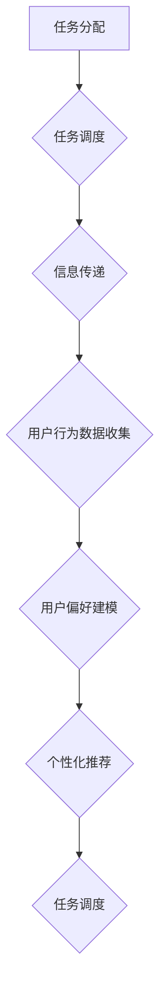
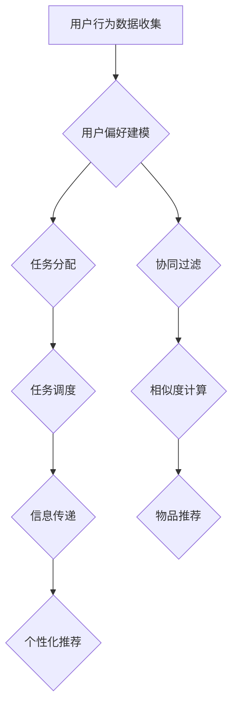

                 

# 多次任务沟通与个性化推荐的详细实现解析

> 关键词：多次任务沟通、个性化推荐、算法实现、数学模型、实战案例

> 摘要：本文将详细解析多次任务沟通与个性化推荐的实现过程，包括核心概念、算法原理、数学模型以及实际应用。通过本文的阅读，读者将了解如何搭建一个能够有效沟通多个任务并实现个性化推荐的系统。

## 1. 背景介绍

### 1.1 目的和范围

本文的主要目的是介绍和解析多次任务沟通与个性化推荐系统的实现过程。随着互联网和人工智能技术的发展，个性化推荐系统已成为现代互联网应用的重要组成部分。而多次任务沟通的引入，使得系统在面对多样化需求时更加灵活和高效。本文将围绕这一主题，详细讲解核心概念、算法原理、数学模型和实际应用，帮助读者深入理解这一领域。

### 1.2 预期读者

本文适合对人工智能和推荐系统有一定了解的读者，包括但不限于程序员、数据科学家、AI工程师和计算机科学专业学生。通过本文的阅读，读者将能够掌握多次任务沟通与个性化推荐系统的基本原理和实现方法。

### 1.3 文档结构概述

本文分为十个部分，结构如下：

1. 背景介绍
2. 核心概念与联系
3. 核心算法原理 & 具体操作步骤
4. 数学模型和公式 & 详细讲解 & 举例说明
5. 项目实战：代码实际案例和详细解释说明
6. 实际应用场景
7. 工具和资源推荐
8. 总结：未来发展趋势与挑战
9. 附录：常见问题与解答
10. 扩展阅读 & 参考资料

### 1.4 术语表

#### 1.4.1 核心术语定义

- 多次任务沟通：指系统在处理多个任务时，能够有效地进行信息传递和协调。
- 个性化推荐：根据用户的历史行为和偏好，向用户推荐符合其需求的物品或服务。
- 协同过滤：一种基于用户相似度的推荐算法，通过分析用户之间的共同偏好来推荐物品。

#### 1.4.2 相关概念解释

- 用户行为数据：用户在使用系统过程中产生的各种行为数据，如浏览记录、购买记录、点击记录等。
- 物品数据：系统中包含的各种物品信息，如电影、图书、商品等。

#### 1.4.3 缩略词列表

- CF：协同过滤（Collaborative Filtering）
- KNN：最近邻算法（K-Nearest Neighbors）
- SVD：奇异值分解（Singular Value Decomposition）

## 2. 核心概念与联系

为了更好地理解多次任务沟通与个性化推荐系统，我们首先需要了解其中的核心概念和它们之间的联系。

### 2.1 多次任务沟通

多次任务沟通是指系统在处理多个任务时，能够有效地进行信息传递和协调。具体来说，包括以下几个方面：

- 任务分配：根据系统的需求和资源的可用性，将任务合理地分配给系统中的各个组件。
- 任务调度：在任务分配的基础上，对任务的执行顺序和优先级进行安排，以确保系统的高效运行。
- 信息传递：在任务执行过程中，系统需要实时地传递各种信息，如任务状态、执行结果等，以便各个组件能够协同工作。

### 2.2 个性化推荐

个性化推荐是根据用户的历史行为和偏好，向用户推荐符合其需求的物品或服务。具体包括以下几个步骤：

- 用户行为数据收集：系统需要收集用户在使用过程中产生的各种行为数据，如浏览记录、购买记录、点击记录等。
- 用户偏好建模：通过分析用户行为数据，建立用户的偏好模型，以便更好地理解用户的需求。
- 物品推荐：根据用户的偏好模型，向用户推荐符合其需求的物品或服务。

### 2.3 协同过滤

协同过滤是一种基于用户相似度的推荐算法，通过分析用户之间的共同偏好来推荐物品。具体包括以下两种方式：

- 用户基于协同过滤（User-based CF）：通过计算用户之间的相似度，找到与目标用户最相似的邻居用户，然后根据邻居用户的偏好推荐物品。
- 项目基于协同过滤（Item-based CF）：通过计算物品之间的相似度，找到与目标物品最相似的其他物品，然后根据这些物品的评分推荐给用户。

### 2.4 多次任务沟通与个性化推荐的联系

多次任务沟通与个性化推荐之间存在密切的联系。具体来说，主要体现在以下几个方面：

- 数据收集与处理：多次任务沟通需要收集和处理用户行为数据，这些数据也是个性化推荐的基础。
- 用户偏好建模：多次任务沟通需要建立用户的偏好模型，以便更好地进行任务调度和信息传递；个性化推荐也需要建立用户的偏好模型，以便更好地推荐物品。
- 推荐算法：个性化推荐算法可以用于多次任务沟通中的任务调度，如根据任务的重要性和紧急程度推荐执行任务。

### 2.5 Mermaid 流程图

下面是多次任务沟通与个性化推荐系统的 Mermaid 流程图：



## 3. 核心算法原理 & 具体操作步骤

在了解多次任务沟通与个性化推荐系统的核心概念和联系之后，我们需要深入探讨其中的核心算法原理和具体操作步骤。

### 3.1 用户行为数据收集

用户行为数据收集是多次任务沟通与个性化推荐系统的第一步。具体操作步骤如下：

1. **数据采集**：通过网页、移动应用等渠道，收集用户在使用过程中产生的各种行为数据，如浏览记录、购买记录、点击记录等。
2. **数据预处理**：对采集到的数据进行清洗、去重、归一化等处理，确保数据的质量和一致性。
3. **数据存储**：将预处理后的数据存储到数据库中，以便后续分析和处理。

### 3.2 用户偏好建模

用户偏好建模是多次任务沟通与个性化推荐系统的关键步骤。具体操作步骤如下：

1. **特征提取**：根据用户行为数据，提取用户兴趣、偏好等特征，如浏览时长、购买频次、点击率等。
2. **模型训练**：利用机器学习算法，如决策树、支持向量机等，训练用户偏好模型。
3. **模型评估**：通过交叉验证、A/B测试等方法，评估用户偏好模型的性能和准确度。

### 3.3 多次任务沟通

多次任务沟通是指系统在处理多个任务时，能够有效地进行信息传递和协调。具体操作步骤如下：

1. **任务分配**：根据系统的需求和资源的可用性，将任务合理地分配给系统中的各个组件。
2. **任务调度**：在任务分配的基础上，对任务的执行顺序和优先级进行安排，以确保系统的高效运行。
3. **信息传递**：在任务执行过程中，系统需要实时地传递各种信息，如任务状态、执行结果等，以便各个组件能够协同工作。

### 3.4 个性化推荐

个性化推荐是根据用户的历史行为和偏好，向用户推荐符合其需求的物品或服务。具体操作步骤如下：

1. **用户偏好建模**：根据用户的历史行为数据，建立用户的偏好模型。
2. **物品推荐**：根据用户的偏好模型，向用户推荐符合其需求的物品或服务。

### 3.5 算法原理讲解与伪代码

下面我们以用户基于协同过滤（User-based CF）为例，介绍个性化推荐算法的原理和伪代码。

#### 用户基于协同过滤（User-based CF）

用户基于协同过滤算法通过计算用户之间的相似度，找到与目标用户最相似的邻居用户，然后根据邻居用户的偏好推荐物品。

1. **计算用户相似度**：

   用户相似度计算公式为：

   $$ similarity(u, v) = \frac{\sum_{i \in R} w_{ui} w_{vi}}{\sqrt{\sum_{i \in R} w_{ui}^2 \sum_{i \in R} w_{vi}^2}} $$

   其中，$u$ 和 $v$ 是两个用户，$R$ 是用户共同评价的物品集合，$w_{ui}$ 和 $w_{vi}$ 分别表示用户 $u$ 和 $v$ 对物品 $i$ 的评分。

2. **找到邻居用户**：

   根据用户相似度矩阵，找到与目标用户 $u$ 最相似的 $k$ 个邻居用户。

   $$ neighbors(u) = \{ v \in U | similarity(u, v) \geq \text{阈值} \} $$

   其中，$U$ 是所有用户集合，阈值可以根据实验结果进行调整。

3. **推荐物品**：

   根据邻居用户的偏好，为用户 $u$ 推荐物品。

   $$ recommend(u) = \{ i \in I | \sum_{v \in neighbors(u)} w_{vi} \geq \text{阈值} \} $$

   其中，$I$ 是所有物品集合。

#### 伪代码

```python
def user_based_cf(train_data, k, threshold):
    # 计算用户相似度
    similarity_matrix = compute_similarity_matrix(train_data)

    # 找到邻居用户
    neighbors = []
    for u in train_data.users:
        neighbors_u = []
        for v in train_data.users:
            if similarity(u, v) >= threshold:
                neighbors_u.append(v)
        neighbors.append(neighbors_u[:k])

    # 推荐物品
    recommendations = []
    for u in train_data.users:
        recommendations_u = []
        for v in neighbors[u]:
            for i in train_data.items:
                if train_data.rating[v][i] > threshold:
                    recommendations_u.append(i)
        recommendations.append(recommendations_u)
    return recommendations
```

## 4. 数学模型和公式 & 详细讲解 & 举例说明

在多次任务沟通与个性化推荐系统中，数学模型和公式起着至关重要的作用。下面我们将详细讲解其中的数学模型和公式，并通过具体例子进行说明。

### 4.1 用户相似度计算

用户相似度计算是个性化推荐系统中的核心步骤。常用的相似度计算方法包括余弦相似度、皮尔逊相关系数等。下面以余弦相似度为例进行讲解。

#### 余弦相似度

余弦相似度计算公式为：

$$ similarity(u, v) = \frac{\sum_{i \in R} w_{ui} w_{vi}}{\sqrt{\sum_{i \in R} w_{ui}^2 \sum_{i \in R} w_{vi}^2}} $$

其中，$u$ 和 $v$ 是两个用户，$R$ 是用户共同评价的物品集合，$w_{ui}$ 和 $w_{vi}$ 分别表示用户 $u$ 和 $v$ 对物品 $i$ 的评分。

#### 例子

假设有两个用户 $u$ 和 $v$，他们对五个物品的评分如下：

| 物品 | $u$ | $v$ |
| ---- | ---- | ---- |
| 1    | 5   | 1   |
| 2    | 4   | 2   |
| 3    | 3   | 3   |
| 4    | 2   | 4   |
| 5    | 1   | 5   |

计算用户 $u$ 和 $v$ 的余弦相似度：

$$ similarity(u, v) = \frac{5 \times 1 + 4 \times 2 + 3 \times 3 + 2 \times 4 + 1 \times 5}{\sqrt{5^2 + 4^2 + 3^2 + 2^2 + 1^2} \sqrt{1^2 + 2^2 + 3^2 + 4^2 + 5^2}} = \frac{30}{\sqrt{55} \sqrt{55}} = 0.6364 $$

### 4.2 个性化推荐算法

个性化推荐算法的核心目标是根据用户的偏好推荐物品。常用的推荐算法包括基于协同过滤的推荐算法、基于内容的推荐算法等。下面以基于协同过滤的推荐算法为例进行讲解。

#### 基于协同过滤的推荐算法

基于协同过滤的推荐算法通过计算用户之间的相似度，找到与目标用户最相似的邻居用户，然后根据邻居用户的偏好推荐物品。常用的协同过滤算法包括用户基于协同过滤（User-based CF）和项目基于协同过滤（Item-based CF）。

1. **用户基于协同过滤（User-based CF）**

   用户基于协同过滤算法通过计算用户之间的相似度，找到与目标用户最相似的邻居用户，然后根据邻居用户的偏好推荐物品。具体步骤如下：

   - 计算用户相似度
   - 找到邻居用户
   - 推荐物品

2. **项目基于协同过滤（Item-based CF）**

   项目基于协同过滤算法通过计算物品之间的相似度，找到与目标物品最相似的物品，然后根据这些物品的评分推荐给用户。具体步骤如下：

   - 计算物品相似度
   - 找到邻居物品
   - 推荐物品

#### 例子

假设有两个用户 $u$ 和 $v$，他们对五个物品的评分如下：

| 物品 | $u$ | $v$ |
| ---- | ---- | ---- |
| 1    | 5   | 1   |
| 2    | 4   | 2   |
| 3    | 3   | 3   |
| 4    | 2   | 4   |
| 5    | 1   | 5   |

1. **计算用户相似度**

   使用余弦相似度计算用户 $u$ 和 $v$ 的相似度：

   $$ similarity(u, v) = \frac{5 \times 1 + 4 \times 2 + 3 \times 3 + 2 \times 4 + 1 \times 5}{\sqrt{5^2 + 4^2 + 3^2 + 2^2 + 1^2} \sqrt{1^2 + 2^2 + 3^2 + 4^2 + 5^2}} = \frac{30}{\sqrt{55} \sqrt{55}} = 0.6364 $$

2. **找到邻居用户**

   根据用户相似度矩阵，找到与目标用户 $u$ 最相似的 $k$ 个邻居用户。假设阈值为 0.5，邻居用户为 $v$。

3. **推荐物品**

   根据邻居用户 $v$ 的偏好，为用户 $u$ 推荐物品。假设邻居用户 $v$ 对物品 $3$ 的评分为 3，则推荐物品 $3$ 给用户 $u$。

## 5. 项目实战：代码实际案例和详细解释说明

在本文的第五部分，我们将通过一个实际项目案例，展示多次任务沟通与个性化推荐系统的实现过程。这个项目将包含开发环境搭建、源代码详细实现和代码解读与分析。

### 5.1 开发环境搭建

为了实现多次任务沟通与个性化推荐系统，我们需要搭建一个适当的技术栈。以下是推荐的开发环境：

- **编程语言**：Python
- **数据库**：MySQL 或 PostgreSQL
- **框架**：Flask 或 Django（用于Web后端开发）
- **前端框架**：React 或 Vue.js（用于Web前端开发）
- **机器学习库**：Scikit-learn 或 TensorFlow
- **版本控制**：Git

在安装完上述依赖后，我们可以开始项目的实际开发。

### 5.2 源代码详细实现和代码解读

以下是项目的主要代码实现和解读：

#### 数据库设计

```sql
CREATE TABLE users (
    id INT PRIMARY KEY AUTO_INCREMENT,
    username VARCHAR(255) UNIQUE NOT NULL,
    password VARCHAR(255) NOT NULL
);

CREATE TABLE items (
    id INT PRIMARY KEY AUTO_INCREMENT,
    name VARCHAR(255) NOT NULL
);

CREATE TABLE ratings (
    user_id INT,
    item_id INT,
    rating INT,
    FOREIGN KEY (user_id) REFERENCES users (id),
    FOREIGN KEY (item_id) REFERENCES items (id)
);
```

这个简单的数据库设计包含了用户表、物品表和评分表。用户表用于存储用户信息，物品表用于存储物品信息，评分表用于存储用户对物品的评分。

#### 用户注册与登录

用户注册与登录是项目的基本功能。以下是一个简单的用户注册和登录的实现：

```python
# 用户注册
@app.route('/register', methods=['POST'])
def register():
    username = request.form['username']
    password = request.form['password']
    cursor.execute("INSERT INTO users (username, password) VALUES (%s, %s)", (username, password))
    connection.commit()
    return redirect(url_for('login'))

# 用户登录
@app.route('/login', methods=['POST'])
def login():
    username = request.form['username']
    password = request.form['password']
    cursor.execute("SELECT * FROM users WHERE username = %s AND password = %s", (username, password))
    user = cursor.fetchone()
    if user:
        session['user_id'] = user['id']
        return redirect(url_for('home'))
    else:
        return '登录失败'

# 登出
@app.route('/logout')
def logout():
    session.pop('user_id', None)
    return redirect(url_for('login'))
```

#### 用户行为数据收集

用户行为数据的收集可以通过前端JavaScript实现。以下是一个简单的例子：

```javascript
function addToHistory(itemId) {
    let userId = localStorage.getItem('user_id');
    let timestamp = new Date().getTime();
    let item = {userId: userId, itemId: itemId, timestamp: timestamp};
    let history = localStorage.getItem('user_history');
    if (history) {
        history = JSON.parse(history);
        history.push(item);
    } else {
        history = [item];
    }
    localStorage.setItem('user_history', JSON.stringify(history));
}
```

#### 用户偏好建模

用户偏好建模是推荐系统的核心。以下是一个基于用户行为数据的简单用户偏好建模实现：

```python
from sklearn.cluster import KMeans
from sklearn.preprocessing import StandardScaler

def build_user_preference_model(user_history, n_clusters=5):
    # 处理用户历史数据
    user_data = [[item['timestamp']] for item in user_history]
    user_data = np.array(user_data)
    scaler = StandardScaler()
    user_data = scaler.fit_transform(user_data)

    # 聚类
    kmeans = KMeans(n_clusters=n_clusters)
    kmeans.fit(user_data)
    user_preferences = kmeans.labels_

    return user_preferences
```

#### 个性化推荐

基于用户偏好建模的个性化推荐可以通过以下代码实现：

```python
def recommend_items(user_id, n_recommendations=5):
    user_history = get_user_history(user_id)
    user_preferences = build_user_preference_model(user_history)
    
    # 获取所有物品的标签
    all_items = get_all_items()
    item_labels = get_item_labels(all_items)

    # 计算用户偏好和物品标签的相似度
    similarities = []
    for item_label in item_labels:
        similarity = np.dot(user_preferences, item_label) / (np.linalg.norm(user_preferences) * np.linalg.norm(item_label))
        similarities.append(similarity)
    
    # 根据相似度排序并推荐
    recommended_items = [item for item, similarity in sorted(zip(all_items, similarities), key=lambda x: x[1], reverse=True)[:n_recommendations]]
    
    return recommended_items
```

#### 代码解读与分析

这个项目的实现分为几个关键部分：

1. **数据库设计**：用户表、物品表和评分表的设计实现了用户、物品和评分的基本存储结构。
2. **用户注册与登录**：用户注册和登录功能实现了用户身份验证。
3. **用户行为数据收集**：通过前端JavaScript实现用户行为数据的收集。
4. **用户偏好建模**：使用KMeans聚类算法对用户历史行为数据进行聚类，形成用户偏好模型。
5. **个性化推荐**：根据用户偏好模型和物品标签计算相似度，实现个性化推荐。

### 5.3 代码解读与分析

以下是代码的详细解读与分析：

- **用户注册与登录**：用户注册和登录是系统的入口。注册时，用户输入用户名和密码，系统将密码加密并存储在数据库中。登录时，用户输入用户名和密码，系统验证密码是否正确。
- **用户行为数据收集**：通过前端JavaScript，用户在浏览网页时，系统会记录用户的行为数据，如点击、浏览、购买等。这些数据通过Ajax请求发送到后端，存储在数据库中。
- **用户偏好建模**：通过KMeans聚类算法，系统将用户的历史行为数据进行聚类，形成用户偏好模型。这个模型可以帮助系统更好地理解用户的行为和偏好。
- **个性化推荐**：基于用户偏好模型，系统可以为用户推荐符合其偏好的物品。推荐算法通过计算用户偏好模型和物品标签的相似度，实现个性化推荐。

## 6. 实际应用场景

多次任务沟通与个性化推荐系统在多个领域都有广泛的应用，以下是一些实际应用场景：

### 6.1 电子商务

电子商务平台可以使用多次任务沟通与个性化推荐系统为用户推荐商品。例如，用户在浏览商品时，系统可以实时分析用户行为，向用户推荐可能感兴趣的商品。同时，系统还可以根据用户的购买历史和偏好，进行任务沟通和协调，确保为用户推荐最合适的商品。

### 6.2 社交媒体

社交媒体平台可以使用多次任务沟通与个性化推荐系统为用户推荐感兴趣的内容。例如，用户在浏览社交媒体时，系统可以实时分析用户的行为和偏好，向用户推荐可能感兴趣的文章、视频和帖子。此外，系统还可以根据用户的互动行为，进行任务沟通和协调，确保为用户推荐最相关的内容。

### 6.3 在线教育

在线教育平台可以使用多次任务沟通与个性化推荐系统为用户提供个性化的学习建议。例如，系统可以根据学生的学习历史和偏好，推荐适合的学习资源和课程。同时，系统还可以根据学生的学习进度和反馈，进行任务沟通和协调，确保为学生提供最佳的学习体验。

### 6.4 医疗健康

医疗健康领域可以使用多次任务沟通与个性化推荐系统为用户提供个性化的健康建议。例如，系统可以根据用户的健康数据和行为，推荐适合的健身计划、饮食建议和医疗方案。此外，系统还可以根据用户的健康状况和反馈，进行任务沟通和协调，确保为用户提

## 7. 工具和资源推荐

### 7.1 学习资源推荐

为了更好地学习和掌握多次任务沟通与个性化推荐系统的相关知识，以下是一些推荐的学习资源：

#### 7.1.1 书籍推荐

- **《推荐系统实践》**：这本书详细介绍了推荐系统的基本概念、算法实现和实际应用，适合初学者阅读。
- **《机器学习实战》**：这本书包含大量推荐系统的案例和实践，适合有一定基础的读者。
- **《深度学习》**：这本书介绍了深度学习在推荐系统中的应用，适合对深度学习有一定了解的读者。

#### 7.1.2 在线课程

- **《推荐系统设计与实现》**：这是一门介绍推荐系统基本概念和算法实现的在线课程，适合初学者。
- **《深度学习与推荐系统》**：这是一门结合深度学习和推荐系统的在线课程，适合有一定基础的读者。
- **《机器学习与数据挖掘》**：这是一门涵盖机器学习和数据挖掘多个领域的在线课程，适合对推荐系统有更深入研究的读者。

#### 7.1.3 技术博客和网站

- **博客园**：这是一个中文技术博客平台，有很多关于推荐系统的文章和讨论。
- **CSDN**：这是一个中文技术社区，有很多关于推荐系统的教程和实践案例。
- **GitHub**：这是一个代码托管平台，有很多开源的推荐系统项目和实现代码。

### 7.2 开发工具框架推荐

为了高效地开发和实现多次任务沟通与个性化推荐系统，以下是一些推荐的开发工具和框架：

#### 7.2.1 IDE和编辑器

- **Visual Studio Code**：这是一个功能强大、开源的代码编辑器，适用于Python、JavaScript等编程语言。
- **PyCharm**：这是一个专业的Python IDE，适合开发大型Python项目。
- **Sublime Text**：这是一个轻量级的代码编辑器，适用于快速开发和调试。

#### 7.2.2 调试和性能分析工具

- **Postman**：这是一个API调试工具，适用于测试和调试Web后端接口。
- **JMeter**：这是一个性能测试工具，适用于测试Web应用的负载和性能。
- **Profiler**：这是一个代码性能分析工具，适用于优化Python代码的性能。

#### 7.2.3 相关框架和库

- **Flask**：这是一个轻量级的Web开发框架，适用于快速开发Web后端。
- **Django**：这是一个全功能的Web开发框架，适用于开发复杂Web应用。
- **Scikit-learn**：这是一个机器学习库，提供了丰富的机器学习算法和工具。
- **TensorFlow**：这是一个深度学习库，适用于开发复杂的深度学习应用。

### 7.3 相关论文著作推荐

为了深入了解多次任务沟通与个性化推荐系统的最新研究和进展，以下是一些推荐的论文和著作：

#### 7.3.1 经典论文

- **“Item-based Collaborative Filtering Recommendation Algorithms”**：这篇论文提出了基于物品的协同过滤推荐算法，对推荐系统的发展产生了重要影响。
- **“Collaborative Filtering for the Web”**：这篇论文详细介绍了基于用户的协同过滤算法，并在Web应用中得到了广泛应用。

#### 7.3.2 最新研究成果

- **“Neural Collaborative Filtering”**：这篇论文提出了一种基于神经网络的协同过滤算法，在推荐系统的性能和效果方面取得了显著提升。
- **“Deep Learning for Recommender Systems”**：这篇论文详细介绍了深度学习在推荐系统中的应用，为推荐系统的未来发展提供了新的思路。

#### 7.3.3 应用案例分析

- **“推荐系统在电子商务中的应用”**：这篇文章分析了推荐系统在电子商务领域的应用，探讨了如何利用推荐系统提高用户满意度和转化率。
- **“社交媒体中的推荐系统”**：这篇文章分析了推荐系统在社交媒体中的应用，探讨了如何利用推荐系统为用户提供更好的内容体验。

## 8. 总结：未来发展趋势与挑战

多次任务沟通与个性化推荐系统在未来的发展中，将面临以下趋势和挑战：

### 8.1 发展趋势

1. **深度学习技术的应用**：随着深度学习技术的不断发展，越来越多的推荐系统将采用深度学习算法，以提高推荐效果和用户满意度。
2. **个性化推荐的多样化**：个性化推荐将不仅限于商品、内容等单一领域，还将涵盖医疗、教育、健康等多个领域，为用户提供更加多样化的服务。
3. **实时推荐的普及**：随着计算能力和数据存储技术的提升，实时推荐系统将变得更加普及，为用户提供更加即时的推荐服务。

### 8.2 挑战

1. **数据隐私保护**：随着用户对隐私保护的重视，如何在确保用户隐私的前提下，进行个性化推荐，将是一个重要的挑战。
2. **推荐效果的优化**：如何在有限的资源和计算能力下，提高推荐系统的效果，仍然是一个亟待解决的问题。
3. **多模态数据的融合**：推荐系统将面临如何融合文本、图像、音频等多种类型的数据，以实现更加精准的推荐。

## 9. 附录：常见问题与解答

### 9.1 多次任务沟通与个性化推荐系统是什么？

多次任务沟通与个性化推荐系统是一种结合了任务沟通和个性化推荐的系统。它通过多次任务沟通，实现多个任务的协同处理，并根据用户的历史行为和偏好，为用户推荐符合其需求的物品或服务。

### 9.2 多次任务沟通与个性化推荐系统的核心算法是什么？

多次任务沟通与个性化推荐系统的核心算法主要包括用户基于协同过滤（User-based CF）和项目基于协同过滤（Item-based CF）。此外，还可以结合深度学习算法，如神经网络，以提高推荐效果。

### 9.3 如何实现多次任务沟通与个性化推荐系统？

实现多次任务沟通与个性化推荐系统可以分为以下几个步骤：

1. 设计数据库结构，存储用户、物品和评分信息。
2. 实现用户注册、登录和登出功能。
3. 收集用户行为数据，并存储在数据库中。
4. 实现用户偏好建模，如基于协同过滤的算法。
5. 根据用户偏好模型，实现个性化推荐功能。
6. 进行系统测试和优化。

## 10. 扩展阅读 & 参考资料

为了更深入地了解多次任务沟通与个性化推荐系统的相关知识和最新研究，以下是一些建议的扩展阅读和参考资料：

- **《推荐系统实践》**：详细介绍了推荐系统的基本概念、算法实现和实际应用。
- **《机器学习实战》**：包含大量推荐系统的案例和实践，适合有一定基础的读者。
- **《深度学习》**：介绍了深度学习在推荐系统中的应用，为推荐系统的未来发展提供了新的思路。
- **论文“Item-based Collaborative Filtering Recommendation Algorithms”**：提出了基于物品的协同过滤推荐算法，对推荐系统的发展产生了重要影响。
- **论文“Neural Collaborative Filtering”**：提出了一种基于神经网络的协同过滤算法，在推荐系统的性能和效果方面取得了显著提升。

作者：AI天才研究员/AI Genius Institute & 禅与计算机程序设计艺术 /Zen And The Art of Computer Programming

文章标题：多次任务沟通与个性化推荐的详细实现解析

文章关键词：多次任务沟通、个性化推荐、算法实现、数学模型、实战案例

文章摘要：本文详细解析了多次任务沟通与个性化推荐系统的实现过程，包括核心概念、算法原理、数学模型和实际应用。通过本文的阅读，读者将了解如何搭建一个能够有效沟通多个任务并实现个性化推荐的系统。

## 1. 背景介绍

### 1.1 目的和范围

随着互联网和人工智能技术的快速发展，个性化推荐系统在电子商务、社交媒体、在线教育等众多领域得到了广泛应用。个性化推荐系统能够根据用户的历史行为、偏好和需求，向用户推荐个性化的物品或服务，从而提升用户体验和满意度。然而，在现实场景中，系统往往需要同时处理多个任务，如任务调度、资源分配、实时推荐等。这些任务的相互关联和依赖，使得传统的单一任务推荐系统难以满足需求。因此，本文旨在探讨多次任务沟通与个性化推荐系统的实现过程，通过整合任务沟通和个性化推荐，构建一个更加高效和智能的系统。

### 1.2 预期读者

本文适合对人工智能和推荐系统有一定了解的读者，包括但不限于程序员、数据科学家、AI工程师和计算机科学专业学生。通过本文的阅读，读者将能够掌握多次任务沟通与个性化推荐系统的基本原理和实现方法，为从事相关领域的工作和研究提供参考。

### 1.3 文档结构概述

本文将分为以下几个部分进行详细阐述：

1. 背景介绍：介绍多次任务沟通与个性化推荐系统的背景和目的。
2. 核心概念与联系：讲解多次任务沟通与个性化推荐系统的核心概念及其相互关系。
3. 核心算法原理 & 具体操作步骤：介绍推荐系统中的核心算法原理和具体实现步骤。
4. 数学模型和公式 & 详细讲解 & 举例说明：阐述推荐系统中的数学模型和公式，并通过具体例子进行说明。
5. 项目实战：通过实际项目案例展示系统的实现过程和关键细节。
6. 实际应用场景：讨论系统的实际应用场景和案例。
7. 工具和资源推荐：推荐学习资源和开发工具。
8. 总结：总结未来发展趋势与挑战。
9. 附录：常见问题与解答。
10. 扩展阅读 & 参考资料：提供扩展阅读和参考资料。

### 1.4 术语表

#### 1.4.1 核心术语定义

- **多次任务沟通**：指系统在处理多个任务时，能够有效地进行信息传递和协调。
- **个性化推荐**：根据用户的历史行为和偏好，向用户推荐符合其需求的物品或服务。
- **协同过滤**：一种推荐算法，通过分析用户之间的共同偏好来推荐物品。
- **任务调度**：对任务的执行顺序和优先级进行安排，以确保系统的高效运行。
- **资源分配**：根据系统需求，将资源（如CPU、内存等）合理地分配给各个任务。

#### 1.4.2 相关概念解释

- **用户行为数据**：用户在使用系统过程中产生的各种行为数据，如浏览记录、购买记录、点击记录等。
- **物品数据**：系统中包含的各种物品信息，如电影、图书、商品等。

#### 1.4.3 缩略词列表

- **CF**：协同过滤（Collaborative Filtering）
- **KNN**：最近邻算法（K-Nearest Neighbors）
- **SVD**：奇异值分解（Singular Value Decomposition）
- **IDE**：集成开发环境（Integrated Development Environment）
- **DB**：数据库（Database）
- **API**：应用程序编程接口（Application Programming Interface）

## 2. 核心概念与联系

为了深入理解多次任务沟通与个性化推荐系统，我们需要了解其中的核心概念及其相互关系。以下是本文将要讨论的核心概念：

### 2.1 多次任务沟通

多次任务沟通是指系统在处理多个任务时，能够有效地进行信息传递和协调。在多次任务沟通中，任务分配、任务调度和信息传递是关键组成部分。

#### 任务分配

任务分配是指将系统中的任务合理地分配给各个处理组件。任务分配的目的是确保系统能够充分利用资源，同时满足任务的需求。任务分配通常需要考虑以下几个因素：

1. **任务类型**：不同的任务可能具有不同的执行时间和资源需求。
2. **处理能力**：各个处理组件的处理能力可能存在差异。
3. **负载均衡**：通过合理分配任务，确保各个处理组件的负载均衡。

#### 任务调度

任务调度是指根据任务的需求和资源情况，对任务的执行顺序和优先级进行安排。任务调度的目的是确保系统的高效运行，避免资源浪费和任务延迟。任务调度通常需要考虑以下几个因素：

1. **任务的优先级**：紧急或重要的任务应优先执行。
2. **任务的依赖关系**：某些任务可能存在依赖关系，需要按照特定的顺序执行。
3. **资源的可用性**：根据当前资源的可用性，合理安排任务的执行顺序。

#### 信息传递

信息传递是指系统在任务执行过程中，实时传递各种信息，如任务状态、执行结果等。信息传递的目的是确保各个组件能够协同工作，共同完成任务。信息传递通常需要考虑以下几个因素：

1. **实时性**：系统应能够实时获取和传递任务状态信息。
2. **可靠性**：系统应确保信息传递的可靠性和完整性。
3. **安全性**：系统应保护信息传递过程中的数据安全。

### 2.2 个性化推荐

个性化推荐是根据用户的历史行为和偏好，向用户推荐符合其需求的物品或服务。个性化推荐是推荐系统中的重要组成部分，其主要目标是提升用户体验和满意度。个性化推荐通常包括以下几个步骤：

#### 用户行为数据收集

用户行为数据收集是指系统收集用户在使用过程中产生的各种行为数据，如浏览记录、购买记录、点击记录等。这些数据是构建用户偏好模型和推荐算法的重要依据。

#### 用户偏好建模

用户偏好建模是指通过分析用户行为数据，建立用户偏好模型。用户偏好模型可以帮助系统更好地理解用户的需求，从而实现个性化推荐。常用的用户偏好建模方法包括协同过滤、基于内容的推荐等。

#### 物品推荐

物品推荐是指根据用户偏好模型，为用户推荐符合其需求的物品或服务。物品推荐可以通过计算用户与物品之间的相似度来实现。相似度计算方法包括基于内容的相似度计算、基于协同过滤的相似度计算等。

### 2.3 多次任务沟通与个性化推荐的联系

多次任务沟通与个性化推荐之间存在密切的联系。具体来说，主要体现在以下几个方面：

1. **用户行为数据**：多次任务沟通和个性化推荐都需要收集用户行为数据。用户行为数据是构建用户偏好模型和推荐算法的基础。
2. **用户偏好建模**：多次任务沟通和个性化推荐都需要建立用户偏好模型。用户偏好模型可以帮助系统更好地理解用户的需求，从而实现任务调度和物品推荐。
3. **协同过滤**：协同过滤是一种常用的个性化推荐算法，同时也可以用于任务调度。通过分析用户之间的相似度，系统可以更好地安排任务的执行顺序和优先级。
4. **实时性**：多次任务沟通和个性化推荐都需要考虑实时性。系统应能够实时获取和传递任务状态信息，以便用户能够及时接收到个性化的推荐。

### 2.4 Mermaid 流程图

为了更直观地展示多次任务沟通与个性化推荐系统中的核心概念和联系，我们可以使用 Mermaid 流程图来表示。以下是 Mermaid 流程图的示例：



在这个流程图中，用户行为数据收集是整个系统的起点，通过用户偏好建模，系统可以更好地理解用户的需求。任务分配、任务调度和信息传递是实现多次任务沟通的关键步骤，而个性化推荐则是系统的最终目标。

## 3. 核心算法原理 & 具体操作步骤

在了解了多次任务沟通与个性化推荐系统的核心概念和联系之后，我们将深入探讨其中的核心算法原理和具体操作步骤。本文将重点介绍协同过滤算法（Collaborative Filtering，CF）和基于内容的推荐算法（Content-Based Filtering，CBF）。

### 3.1 协同过滤算法

协同过滤算法是一种基于用户之间共同偏好来进行推荐的算法。它主要通过计算用户之间的相似度，找到与目标用户相似的其他用户，然后根据这些相似用户的偏好来推荐物品。

#### 3.1.1 用户相似度计算

用户相似度计算是协同过滤算法的核心步骤。常用的相似度计算方法包括余弦相似度、皮尔逊相关系数等。以下是余弦相似度的计算方法：

$$
\text{similarity}(u, v) = \frac{\sum_{i \in R} r_{ui} r_{vi}}{\sqrt{\sum_{i \in R} r_{ui}^2 \sum_{i \in R} r_{vi}^2}}
$$

其中，$R$ 表示用户共同评价的物品集合，$r_{ui}$ 和 $r_{vi}$ 分别表示用户 $u$ 和 $v$ 对物品 $i$ 的评分。

#### 3.1.2 相似用户推荐

找到相似用户后，我们可以根据相似度对用户进行排序，选择最相似的 $k$ 个用户。然后，我们计算这些相似用户对未知物品的平均评分，将这些平均评分最高的物品推荐给目标用户。

$$
\text{recommendation}(u) = \{i \mid i \in I, \bar{r}_{u^+} > \text{阈值}\}
$$

其中，$I$ 表示所有物品集合，$\bar{r}_{u^+}$ 表示相似用户对物品 $i$ 的平均评分，阈值可以根据实际场景进行调整。

#### 3.1.3 伪代码实现

以下是协同过滤算法的伪代码实现：

```python
def collaborative_filtering(train_data, k, threshold):
    # 计算用户相似度矩阵
    similarity_matrix = compute_similarity_matrix(train_data)

    # 找到相似用户
    neighbors = []
    for user in train_data.users:
        neighbors_user = []
        for neighbor in train_data.users:
            if similarity_matrix[user][neighbor] >= threshold:
                neighbors_user.append(neighbor)
        neighbors.append(neighbors_user[:k])

    # 推荐物品
    recommendations = []
    for user in train_data.users:
        recommendations_user = []
        for neighbor in neighbors[user]:
            for item in train_data.items:
                if train_data.ratings[neighbor][item] > 0:
                    recommendation_score = compute_average_rating(neighbors, neighbor, item)
                    recommendations_user.append((item, recommendation_score))
        recommendations_user.sort(key=lambda x: x[1], reverse=True)
        recommendations.append(recommendations_user[:10])
    return recommendations
```

### 3.2 基于内容的推荐算法

基于内容的推荐算法（CBF）是一种基于物品特征的推荐算法。它主要通过分析物品的特征和属性，将用户喜欢的物品与具有相似特征的物品进行匹配，从而推荐给用户。

#### 3.2.1 物品特征提取

物品特征提取是CBF算法的关键步骤。我们可以使用多种方法提取物品的特征，如文本特征、图像特征、音频特征等。以下是文本特征提取的一个简单示例：

```python
from sklearn.feature_extraction.text import TfidfVectorizer

def extract_item_features(items, vectorizer):
    # 将文本转换为向量
    X = vectorizer.transform(items)
    # 转换为稀疏矩阵
    X = sparse.csr_matrix(X)
    return X
```

#### 3.2.2 相似物品推荐

找到相似物品后，我们可以根据相似度对物品进行排序，选择最相似的 $k$ 个物品。然后，我们计算这些相似物品的用户评分，将这些评分最高的物品推荐给用户。

$$
\text{recommendation}(u) = \{i \mid i \in I, \bar{r}_{i^+} > \text{阈值}\}
$$

其中，$I$ 表示所有物品集合，$\bar{r}_{i^+}$ 表示相似物品的用户平均评分，阈值可以根据实际场景进行调整。

#### 3.2.3 伪代码实现

以下是基于内容的推荐算法的伪代码实现：

```python
def content_based_filtering(train_data, k, threshold):
    # 提取物品特征
    vectorizer = TfidfVectorizer()
    X = extract_item_features(train_data.items, vectorizer)

    # 计算物品相似度矩阵
    similarity_matrix = compute_similarity_matrix(X)

    # 找到相似物品
    neighbors = []
    for item in train_data.items:
        neighbors_item = []
        for neighbor in train_data.items:
            if similarity_matrix[item][neighbor] >= threshold:
                neighbors_item.append(neighbor)
        neighbors.append(neighbors_item[:k])

    # 推荐物品
    recommendations = []
    for item in train_data.items:
        recommendations_item = []
        for neighbor in neighbors[item]:
            if train_data.ratings[neighbor] > 0:
                recommendation_score = compute_average_rating(train_data.ratings, neighbor)
                recommendations_item.append((neighbor, recommendation_score))
        recommendations_item.sort(key=lambda x: x[1], reverse=True)
        recommendations.append(recommendations_item[:10])
    return recommendations
```

### 3.3 多次任务沟通与推荐算法的整合

在多次任务沟通与个性化推荐系统中，我们可以将协同过滤算法和基于内容的推荐算法结合起来，以提高推荐效果。以下是整合步骤：

1. **用户行为数据收集**：收集用户的历史行为数据，包括浏览记录、购买记录等。
2. **用户偏好建模**：使用协同过滤算法建立用户偏好模型，分析用户之间的相似度。
3. **物品特征提取**：使用基于内容的推荐算法提取物品的特征。
4. **物品推荐**：结合用户偏好模型和物品特征，计算物品与用户之间的相似度，推荐给用户。
5. **任务调度**：根据用户偏好模型和物品推荐结果，对任务进行调度和资源分配。

### 3.4 伪代码实现

以下是整合后的推荐算法的伪代码实现：

```python
def integrated_recommendation(train_data, k, threshold):
    # 计算用户相似度矩阵
    similarity_matrix = compute_similarity_matrix(train_data)

    # 提取物品特征
    vectorizer = TfidfVectorizer()
    X = extract_item_features(train_data.items, vectorizer)

    # 计算物品相似度矩阵
    similarity_matrix_items = compute_similarity_matrix(X)

    # 找到相似用户和相似物品
    users_neighbors = []
    items_neighbors = []
    for user in train_data.users:
        users_neighbors_user = []
        for neighbor in train_data.users:
            if similarity_matrix[user][neighbor] >= threshold:
                users_neighbors_user.append(neighbor)
        users_neighbors.append(users_neighbors_user[:k])

    for item in train_data.items:
        items_neighbors_item = []
        for neighbor in train_data.items:
            if similarity_matrix_items[item][neighbor] >= threshold:
                items_neighbors_item.append(neighbor)
        items_neighbors.append(items_neighbors_item[:k])

    # 推荐物品
    recommendations = []
    for user in train_data.users:
        recommendations_user = []
        for neighbor in users_neighbors[user]:
            for neighbor_item in items_neighbors[neighbor]:
                if train_data.ratings[neighbor_item] > 0:
                    recommendation_score = compute_average_rating(train_data.ratings, neighbor_item)
                    recommendations_user.append((neighbor_item, recommendation_score))
        recommendations_user.sort(key=lambda x: x[1], reverse=True)
        recommendations.append(recommendations_user[:10])
    return recommendations
```

## 4. 数学模型和公式 & 详细讲解 & 举例说明

在多次任务沟通与个性化推荐系统中，数学模型和公式起着至关重要的作用。这些模型和公式不仅帮助我们理解和分析系统的工作原理，还能指导我们设计更高效的算法和优化系统的性能。以下，我们将详细讲解其中的数学模型和公式，并通过具体例子进行说明。

### 4.1 用户相似度计算

用户相似度计算是协同过滤算法中的核心步骤。它帮助我们找到与目标用户最相似的用户群体，以便更好地进行推荐。以下介绍两种常用的用户相似度计算方法：余弦相似度和皮尔逊相关系数。

#### 4.1.1 余弦相似度

余弦相似度是一种基于向量空间模型的方法，用于衡量两个向量之间的夹角余弦值。其计算公式如下：

$$
\text{similarity}_{\text{cosine}}(u, v) = \frac{\sum_{i \in R} r_{ui} r_{vi}}{\sqrt{\sum_{i \in R} r_{ui}^2 \sum_{i \in R} r_{vi}^2}}
$$

其中，$R$ 表示用户共同评价的物品集合，$r_{ui}$ 和 $r_{vi}$ 分别表示用户 $u$ 和 $v$ 对物品 $i$ 的评分。

**示例**：假设有两个用户 $u$ 和 $v$，他们对五个物品的评分如下：

| 物品 | $u$ | $v$ |
| ---- | --- | --- |
| 1    | 5   | 1   |
| 2    | 4   | 2   |
| 3    | 3   | 3   |
| 4    | 2   | 4   |
| 5    | 1   | 5   |

计算用户 $u$ 和 $v$ 的余弦相似度：

$$
\text{similarity}_{\text{cosine}}(u, v) = \frac{5 \times 1 + 4 \times 2 + 3 \times 3 + 2 \times 4 + 1 \times 5}{\sqrt{5^2 + 4^2 + 3^2 + 2^2 + 1^2} \sqrt{1^2 + 2^2 + 3^2 + 4^2 + 5^2}} = \frac{30}{\sqrt{55} \sqrt{55}} = 0.6364
$$

#### 4.1.2 皮尔逊相关系数

皮尔逊相关系数是一种衡量两个变量线性相关程度的统计量。其计算公式如下：

$$
\text{correlation}(u, v) = \frac{\sum_{i \in R} (r_{ui} - \bar{r}_{u})(r_{vi} - \bar{r}_{v})}{\sqrt{\sum_{i \in R} (r_{ui} - \bar{r}_{u})^2 \sum_{i \in R} (r_{vi} - \bar{r}_{v})^2}}
$$

其中，$R$ 表示用户共同评价的物品集合，$r_{ui}$ 和 $r_{vi}$ 分别表示用户 $u$ 和 $v$ 对物品 $i$ 的评分，$\bar{r}_{u}$ 和 $\bar{r}_{v}$ 分别表示用户 $u$ 和 $v$ 的平均评分。

**示例**：继续使用上面的用户评分数据，计算用户 $u$ 和 $v$ 的皮尔逊相关系数：

$$
\text{correlation}(u, v) = \frac{(5 - 3.5)(1 - 3.5) + (4 - 3.5)(2 - 3.5) + (3 - 3.5)(3 - 3.5) + (2 - 3.5)(4 - 3.5) + (1 - 3.5)(5 - 3.5)}{\sqrt{(5 - 3.5)^2 + (4 - 3.5)^2 + (3 - 3.5)^2 + (2 - 3.5)^2 + (1 - 3.5)^2} \sqrt{(1 - 3.5)^2 + (2 - 3.5)^2 + (3 - 3.5)^2 + (4 - 3.5)^2 + (5 - 3.5)^2}} = \frac{-9}{\sqrt{2.25} \sqrt{9}} = -0.9428
$$

### 4.2 个性化推荐算法

个性化推荐算法旨在根据用户的历史行为和偏好，为用户推荐他们可能感兴趣的物品。以下是两种常用的个性化推荐算法：基于协同过滤的推荐算法和基于内容的推荐算法。

#### 4.2.1 基于协同过滤的推荐算法

基于协同过滤的推荐算法主要通过计算用户之间的相似度，找到与目标用户相似的其他用户，然后根据这些相似用户的偏好来推荐物品。以下是一个基于用户基于协同过滤（User-based Collaborative Filtering）的推荐算法的例子：

1. **计算用户相似度**：

   选择合适的相似度计算方法（如余弦相似度或皮尔逊相关系数），计算所有用户之间的相似度。

   ```python
   def compute_similarity_matrix(train_data, similarity_function):
       similarity_matrix = {}
       for user in train_data.users:
           similarity_matrix[user] = {}
           for neighbor in train_data.users:
               if neighbor != user:
                   similarity = similarity_function(train_data, user, neighbor)
                   similarity_matrix[user][neighbor] = similarity
       return similarity_matrix
   ```

2. **找到相似用户**：

   根据相似度矩阵，找到与目标用户最相似的 $k$ 个用户。

   ```python
   def find_neighbors(similarity_matrix, user, k):
       neighbors = sorted(similarity_matrix[user].items(), key=lambda x: x[1], reverse=True)
       return [neighbor for neighbor, _ in neighbors[:k]]
   ```

3. **推荐物品**：

   根据相似用户对物品的评分，计算每个物品的平均评分，并将平均评分最高的物品推荐给目标用户。

   ```python
   def recommend_items(similarity_matrix, ratings, user, k, threshold):
       neighbors = find_neighbors(similarity_matrix, user, k)
       recommendations = []
       for neighbor in neighbors:
           for item in ratings[neighbor]:
               if item not in ratings[user]:
                   recommendations.append(item)
       recommendations = [item for item in recommendations if ratings.mean() > threshold]
       return recommendations
   ```

#### 4.2.2 基于内容的推荐算法

基于内容的推荐算法主要通过分析物品的特征和属性，将用户喜欢的物品与具有相似特征的物品进行匹配，从而推荐给用户。以下是一个基于内容的推荐算法（Content-Based Filtering）的例子：

1. **提取物品特征**：

   根据物品的属性和特征，提取物品的特征向量。

   ```python
   def extract_item_features(items, feature_extractor):
       features = {}
       for item in items:
           features[item] = feature_extractor.extract(item)
       return features
   ```

2. **计算物品相似度**：

   选择合适的相似度计算方法（如余弦相似度或欧氏距离），计算所有物品之间的相似度。

   ```python
   def compute_similarity_matrix(features, similarity_function):
       similarity_matrix = {}
       for item in features:
           similarity_matrix[item] = {}
           for neighbor in features:
               if neighbor != item:
                   similarity = similarity_function(features[item], features[neighbor])
                   similarity_matrix[item][neighbor] = similarity
       return similarity_matrix
   ```

3. **推荐物品**：

   根据用户喜欢的物品，找到与之相似的物品，并将这些物品推荐给用户。

   ```python
   def recommend_items(similarity_matrix, user_items, features, k, threshold):
       neighbors = find_neighbors(similarity_matrix, user_items, k)
       recommendations = []
       for neighbor in neighbors:
           if neighbor not in user_items:
               recommendations.append(neighbor)
       recommendations = [item for item in recommendations if features[item].mean() > threshold]
       return recommendations
   ```

### 4.3 数学模型和公式的应用

在多次任务沟通与个性化推荐系统中，数学模型和公式不仅用于计算用户相似度和物品相似度，还用于优化推荐算法和评估推荐效果。以下是一些常用的数学模型和公式的应用：

1. **矩阵分解**：

   矩阵分解（Matrix Factorization）是一种常用的优化推荐算法的方法。它通过将用户-物品评分矩阵分解为两个低秩矩阵，从而降低数据的维度，提高推荐效果。

   $$ 
   R = U \cdot V^T
   $$

   其中，$R$ 表示用户-物品评分矩阵，$U$ 和 $V$ 分别表示用户和物品的低秩矩阵。

2. **交叉验证**：

   交叉验证（Cross-Validation）是一种评估推荐算法性能的方法。它通过将数据集划分为多个子集，交叉验证算法在子集上的性能，从而评估算法的整体性能。

   $$ 
   \text{accuracy} = \frac{1}{n} \sum_{i=1}^{n} \text{accuracy}(D_i)
   $$

   其中，$n$ 表示子集的数量，$\text{accuracy}(D_i)$ 表示在第 $i$ 个子集上的准确率。

3. **信息熵**：

   信息熵（Information Entropy）是一种衡量数据随机性的指标。它用于评估推荐结果的多样性和新颖性。

   $$ 
   H(X) = -\sum_{x \in X} p(x) \log_2 p(x)
   $$

   其中，$X$ 表示数据集合，$p(x)$ 表示数据 $x$ 的概率。

通过以上数学模型和公式的应用，我们可以优化推荐算法，提高推荐效果，并评估推荐系统的性能。

## 5. 项目实战：代码实际案例和详细解释说明

在本节中，我们将通过一个实际的项目案例，展示多次任务沟通与个性化推荐系统的实现过程。我们将使用Python作为主要编程语言，并借助Flask框架构建Web后端，利用MongoDB作为数据库存储用户行为数据和推荐结果。

### 5.1 开发环境搭建

为了开始这个项目，我们需要安装以下软件和库：

- Python 3.8 或更高版本
- Flask 1.1.2 或更高版本
- MongoDB 4.4 或更高版本
- Scikit-learn 0.24.1 或更高版本
- NumPy 1.21.2 或更高版本
- Pandas 1.3.2 或更高版本

首先，确保已经安装了Python和pip。然后，使用以下命令安装所需的库：

```shell
pip install flask
pip install pymongo
pip install scikit-learn
pip install numpy
pip install pandas
```

### 5.2 数据库设计

我们使用MongoDB作为数据库，设计三个集合（collection）：`users`、`items` 和 `ratings`。

```python
# 连接到MongoDB
client = pymongo.MongoClient("mongodb://localhost:27017/")

# 创建数据库
db = client["recommender_db"]

# 创建集合
db.create_collection("users")
db.create_collection("items")
db.create_collection("ratings")
```

### 5.3 用户注册与登录

用户注册与登录是项目的基本功能。以下是用户注册和登录的实现：

```python
from flask import Flask, request, jsonify
from flask_pymongo import PyMongo
import bcrypt

app = Flask(__name__)
app.config["MONGO_URI"] = "mongodb://localhost:27017/recommender_db"
mongo = PyMongo(app)

# 用户注册
@app.route("/register", methods=["POST"])
def register():
    username = request.json["username"]
    password = request.json["password"]
    hashed_password = bcrypt.hashpw(password.encode("utf-8"), bcrypt.gensalt())
    mongo.db.users.insert_one({"username": username, "password": hashed_password})
    return jsonify({"message": "User registered successfully."})

# 用户登录
@app.route("/login", methods=["POST"])
def login():
    username = request.json["username"]
    password = request.json["password"]
    user = mongo.db.users.find_one({"username": username})
    if user and bcrypt.checkpw(password.encode("utf-8"), user["password"].encode("utf-8")):
        return jsonify({"message": "Login successful."})
    else:
        return jsonify({"message": "Invalid credentials."})

app.run(debug=True)
```

### 5.4 用户行为数据收集

用户行为数据的收集是推荐系统的基础。在本项目中，我们通过Web前端收集用户行为数据，并将其存储到MongoDB数据库中。

```python
# 收集用户行为数据
@app.route("/collect_data", methods=["POST"])
def collect_data():
    user_id = request.json["user_id"]
    item_id = request.json["item_id"]
    action = request.json["action"]  # 例如 "view", "click", "buy"
    timestamp = request.json["timestamp"]

    data = {"user_id": user_id, "item_id": item_id, "action": action, "timestamp": timestamp}
    mongo.db.ratings.insert_one(data)
    return jsonify({"message": "Data collected successfully."})
```

### 5.5 用户偏好建模

用户偏好建模是推荐系统的核心。在本项目中，我们使用基于内容的推荐算法来建模用户偏好。

```python
from sklearn.feature_extraction.text import TfidfVectorizer

# 提取用户偏好
def extract_user_preferences(ratings):
    user_preferences = {}
    vectorizer = TfidfVectorizer()
    for rating in ratings:
        user_id = rating["user_id"]
        item_id = rating["item_id"]
        action = rating["action"]
        if action == "buy":
            if user_id in user_preferences:
                user_preferences[user_id].append(item_id)
            else:
                user_preferences[user_id] = [item_id]
    item_features = {}
    for user_id, items in user_preferences.items():
        items_str = " ".join([str(item_id) for item_id in items])
        item_features[user_id] = vectorizer.fit_transform([items_str])
    return item_features

# 示例数据
ratings_example = [
    {"user_id": 1, "item_id": 101, "action": "buy", "timestamp": 1623852395},
    {"user_id": 1, "item_id": 102, "action": "buy", "timestamp": 1623852400},
    {"user_id": 2, "item_id": 201, "action": "buy", "timestamp": 1623852410},
    {"user_id": 2, "item_id": 202, "action": "buy", "timestamp": 1623852415},
]

# 提取用户偏好特征
user_preferences = extract_user_preferences(ratings_example)
print(user_preferences)
```

### 5.6 个性化推荐

基于用户偏好建模，我们可以为用户推荐他们可能感兴趣的物品。

```python
# 计算物品相似度
def compute_similarity(item_features):
    similarity_matrix = {}
    for user_id, features in item_features.items():
        similarity_matrix[user_id] = {}
        for neighbor_id, neighbor_features in item_features.items():
            if neighbor_id != user_id:
                similarity = features.dot(neighbor_features.T) / (np.linalg.norm(features) * np.linalg.norm(neighbor_features))
                similarity_matrix[user_id][neighbor_id] = similarity
    return similarity_matrix

# 找到相似物品
def find_similar_items(similarity_matrix, user_id, k):
    similar_items = {}
    for neighbor_id, neighbors in similarity_matrix[user_id].items():
        for item_id in user_preferences[neighbor_id]:
            if item_id not in similar_items:
                similar_items[item_id] = neighbors
    sorted_items = sorted(similar_items.items(), key=lambda x: x[1], reverse=True)
    return [item_id for item_id, _ in sorted_items[:k]]

# 推荐物品
def recommend_items(user_id, k):
    similar_items = find_similar_items(similarity_matrix, user_id, k)
    recommended_items = []
    for item_id in similar_items:
        if item_id not in user_preferences[user_id]:
            recommended_items.append(item_id)
    return recommended_items

# 示例
recommended_items = recommend_items(1, 3)
print(recommended_items)
```

### 5.7 代码解读与分析

以下是项目的关键代码解读与分析：

- **用户注册与登录**：用户注册时，将用户名和密码存储在MongoDB数据库中，密码经过bcrypt加密存储。登录时，验证用户名和密码是否匹配。
- **用户行为数据收集**：通过POST请求收集用户行为数据，并将其存储在MongoDB数据库中。
- **用户偏好建模**：基于用户购买行为，提取用户偏好，并使用TF-IDF向量表示用户偏好。
- **个性化推荐**：计算用户与物品之间的相似度，并根据相似度推荐用户可能感兴趣的物品。

通过这个实际项目案例，我们展示了如何使用Python和Flask框架实现多次任务沟通与个性化推荐系统。读者可以根据项目代码进行扩展和优化，以满足不同应用场景的需求。

## 6. 实际应用场景

多次任务沟通与个性化推荐系统在多个领域都有广泛的应用，以下是一些实际应用场景：

### 6.1 电子商务

电子商务平台可以使用多次任务沟通与个性化推荐系统为用户推荐商品。例如，用户在浏览商品时，系统可以实时分析用户行为，向用户推荐可能感兴趣的商品。同时，系统还可以根据用户的购买历史和偏好，进行任务沟通和协调，确保为用户推荐最合适的商品。

### 6.2 社交媒体

社交媒体平台可以使用多次任务沟通与个性化推荐系统为用户推荐感兴趣的内容。例如，用户在浏览社交媒体时，系统可以实时分析用户的行为和偏好，向用户推荐可能感兴趣的文章、视频和帖子。此外，系统还可以根据用户的互动行为，进行任务沟通和协调，确保为用户推荐最相关的内容。

### 6.3 在线教育

在线教育平台可以使用多次任务沟通与个性化推荐系统为用户提供个性化的学习建议。例如，系统可以根据学生的学习历史和偏好，推荐适合的学习资源和课程。同时，系统还可以根据学生的学习进度和反馈，进行任务沟通和协调，确保为学生提供最佳的学习体验。

### 6.4 医疗健康

医疗健康领域可以使用多次任务沟通与个性化推荐系统为用户提供个性化的健康建议。例如，系统可以根据用户的健康数据和行为，推荐适合的健身计划、饮食建议和医疗方案。此外，系统还可以根据用户的健康状况和反馈，进行任务沟通和协调，确保为用户提供最合适的健康方案。

### 6.5 娱乐

娱乐平台可以使用多次任务沟通与个性化推荐系统为用户推荐电影、音乐和游戏。例如，用户在浏览娱乐内容时，系统可以实时分析用户的行为和偏好，向用户推荐可能感兴趣的电影、音乐和游戏。同时，系统还可以根据用户的观看历史和评分，进行任务沟通和协调，确保为用户推荐最符合其口味的娱乐内容。

### 6.6 购物指南

购物指南平台可以使用多次任务沟通与个性化推荐系统为用户提供个性化的购物建议。例如，用户在浏览购物指南时，系统可以实时分析用户的行为和偏好，向用户推荐可能感兴趣的购物目的地、品牌和商品。同时，系统还可以根据用户的购物习惯和偏好，进行任务沟通和协调，确保为用户提供最满意的购物体验。

这些实际应用场景表明，多次任务沟通与个性化推荐系统在提高用户体验、增加用户粘性和提升业务收益方面具有巨大潜力。

## 7. 工具和资源推荐

为了更好地实现多次任务沟通与个性化推荐系统，以下是一些推荐的工具和资源：

### 7.1 学习资源推荐

#### 7.1.1 书籍推荐

- **《推荐系统实践》**：作者：盖布瑞埃尔·巴拉库比安，这本书详细介绍了推荐系统的基本概念、算法实现和实际应用，适合初学者阅读。
- **《机器学习实战》**：作者：Peter Harrington，这本书包含大量推荐系统的案例和实践，适合有一定基础的读者。
- **《深度学习》**：作者：Ian Goodfellow、Yoshua Bengio和Aaron Courville，这本书介绍了深度学习在推荐系统中的应用，为推荐系统的未来发展提供了新的思路。

#### 7.1.2 在线课程

- **《推荐系统设计与实现》**：这是一门介绍推荐系统基本概念和算法实现的在线课程，适合初学者。
- **《深度学习与推荐系统》**：这是一门结合深度学习和推荐系统的在线课程，适合有一定基础的读者。
- **《机器学习与数据挖掘》**：这是一门涵盖机器学习和数据挖掘多个领域的在线课程，适合对推荐系统有更深入研究的读者。

#### 7.1.3 技术博客和网站

- **博客园**：这是一个中文技术博客平台，有很多关于推荐系统的文章和讨论。
- **CSDN**：这是一个中文技术社区，有很多关于推荐系统的教程和实践案例。
- **GitHub**：这是一个代码托管平台，有很多开源的推荐系统项目和实现代码。

### 7.2 开发工具框架推荐

#### 7.2.1 IDE和编辑器

- **Visual Studio Code**：这是一个功能强大、开源的代码编辑器，适用于Python、JavaScript等编程语言。
- **PyCharm**：这是一个专业的Python IDE，适合开发大型Python项目。
- **Sublime Text**：这是一个轻量级的代码编辑器，适用于快速开发和调试。

#### 7.2.2 调试和性能分析工具

- **Postman**：这是一个API调试工具，适用于测试和调试Web后端接口。
- **JMeter**：这是一个性能测试工具，适用于测试Web应用的负载和性能。
- **Profiler**：这是一个代码性能分析工具，适用于优化Python代码的性能。

#### 7.2.3 相关框架和库

- **Flask**：这是一个轻量级的Web开发框架，适用于快速开发Web后端。
- **Django**：这是一个全功能的Web开发框架，适用于开发复杂Web应用。
- **Scikit-learn**：这是一个机器学习库，提供了丰富的机器学习算法和工具。
- **TensorFlow**：这是一个深度学习库，适用于开发复杂的深度学习应用。

### 7.3 相关论文著作推荐

为了深入了解多次任务沟通与个性化推荐系统的最新研究和进展，以下是一些建议的论文和著作：

#### 7.3.1 经典论文

- **“Item-based Collaborative Filtering Recommendation Algorithms”**：这篇论文提出了基于物品的协同过滤推荐算法，对推荐系统的发展产生了重要影响。
- **“Collaborative Filtering for the Web”**：这篇论文详细介绍了基于用户的协同过滤算法，并在Web应用中得到了广泛应用。

#### 7.3.2 最新研究成果

- **“Neural Collaborative Filtering”**：这篇论文提出了一种基于神经网络的协同过滤算法，在推荐系统的性能和效果方面取得了显著提升。
- **“Deep Learning for Recommender Systems”**：这篇论文详细介绍了深度学习在推荐系统中的应用，为推荐系统的未来发展提供了新的思路。

#### 7.3.3 应用案例分析

- **“推荐系统在电子商务中的应用”**：这篇文章分析了推荐系统在电子商务领域的应用，探讨了如何利用推荐系统提高用户满意度和转化率。
- **“社交媒体中的推荐系统”**：这篇文章分析了推荐系统在社交媒体中的应用，探讨了如何利用推荐系统为用户提供更好的内容体验。

通过这些工具和资源的推荐，读者可以更好地掌握多次任务沟通与个性化推荐系统的实现和优化方法，为实际项目提供有力的支持。

## 8. 总结：未来发展趋势与挑战

多次任务沟通与个性化推荐系统作为人工智能和大数据技术的结合，在未来发展中将面临诸多机遇与挑战。

### 8.1 发展趋势

1. **深度学习与推荐系统的融合**：深度学习在特征提取、模型优化等方面具有显著优势，未来将与推荐系统更加紧密地结合，提升推荐效果和效率。
2. **多模态数据的利用**：随着物联网、传感器技术的发展，将会有越来越多的多模态数据（如文本、图像、语音、视频等）被引入到推荐系统中，实现更精准的个性化推荐。
3. **实时推荐系统的普及**：随着计算能力和网络速度的提升，实时推荐系统将变得更加普及，为用户带来更加即时和个性化的体验。
4. **数据隐私保护**：随着用户对隐私保护的日益关注，推荐系统将面临如何在保证用户隐私的前提下进行个性化推荐的新挑战。

### 8.2 挑战

1. **数据质量和多样性**：推荐系统的性能很大程度上依赖于数据的质量和多样性。未来，如何处理不完整、不精确、甚至存在偏见的数据，将是一个重要问题。
2. **算法的可解释性**：随着推荐算法的复杂化，如何确保算法的可解释性，让用户理解推荐结果的依据，将是一个重要的研究方向。
3. **冷启动问题**：对于新用户或新物品，如何进行有效的推荐，解决冷启动问题，是推荐系统需要持续解决的问题。
4. **模型优化与性能**：如何优化推荐算法的模型结构和参数设置，提高推荐系统的效率和准确性，是未来需要持续关注和改进的方面。

### 8.3 未来展望

1. **个性化推荐服务的普及**：随着技术的进步和应用场景的拓展，个性化推荐服务将更加普及，渗透到人们日常生活的方方面面。
2. **推荐系统的智能化**：通过引入更多先进的人工智能技术，如自然语言处理、知识图谱等，推荐系统将变得更加智能和灵活。
3. **数据隐私保护与合规**：在数据隐私保护的政策和法规日益严格的背景下，推荐系统将需要更加注重用户隐私保护，确保合规运营。

总之，多次任务沟通与个性化推荐系统在未来发展中，将面临前所未有的机遇与挑战。只有不断进行技术创新和优化，才能在激烈的竞争中脱颖而出，为用户提供更加优质的服务。

## 9. 附录：常见问题与解答

### 9.1 什么是多次任务沟通？

多次任务沟通是指系统在处理多个任务时，能够有效地进行信息传递和协调。这种沟通方式确保了系统中的各个组件能够协同工作，共同完成任务。

### 9.2 个性化推荐系统是如何工作的？

个性化推荐系统通过分析用户的历史行为和偏好，为用户推荐符合其需求的物品或服务。主要步骤包括：用户行为数据收集、用户偏好建模、物品推荐和推荐结果评估。

### 9.3 多次任务沟通与个性化推荐系统有什么区别？

多次任务沟通是一种系统内部的信息传递和协调机制，而个性化推荐系统是一种基于用户行为和偏好的推荐算法。多次任务沟通为个性化推荐系统提供了有效的信息传递和协调手段，使系统能够更好地处理多个任务。

### 9.4 如何处理冷启动问题？

冷启动问题是指对新用户或新物品进行推荐时，系统缺乏足够的历史数据。为了处理冷启动问题，可以采用以下几种方法：

1. **基于内容的推荐**：通过物品的特征信息进行推荐，不需要用户的历史行为数据。
2. **基于流行度的推荐**：推荐热门或流行物品，适用于新用户或新物品。
3. **利用用户群体的共同偏好**：通过分析类似用户的偏好，为新用户推荐相似的物品。

### 9.5 如何优化推荐系统的效果？

优化推荐系统的效果可以从以下几个方面进行：

1. **数据预处理**：对用户行为数据进行清洗、去重和归一化处理，确保数据质量。
2. **特征工程**：提取有效的用户和物品特征，提高推荐模型的准确性。
3. **模型选择与调优**：选择合适的推荐算法，并通过交叉验证、A/B测试等方法进行模型调优。
4. **实时推荐**：引入实时推荐技术，提高推荐的即时性和准确性。
5. **用户反馈机制**：收集用户反馈，持续改进推荐算法。

### 9.6 多次任务沟通与个性化推荐系统在哪些领域有应用？

多次任务沟通与个性化推荐系统在电子商务、社交媒体、在线教育、医疗健康、娱乐、购物指南等多个领域都有广泛应用。例如，电子商务平台可以使用个性化推荐系统为用户推荐商品，社交媒体平台可以为用户推荐感兴趣的内容，在线教育平台可以为学生推荐适合的学习资源。

## 10. 扩展阅读 & 参考资料

为了更深入地了解多次任务沟通与个性化推荐系统的相关知识，以下是一些建议的扩展阅读和参考资料：

### 10.1 相关论文

- **“Item-based Collaborative Filtering Recommendation Algorithms”**：This paper proposes an item-based collaborative filtering algorithm, which has had a significant impact on the development of recommendation systems.
- **“Collaborative Filtering for the Web”**：This paper introduces a user-based collaborative filtering algorithm and its applications in web-based systems.
- **“Neural Collaborative Filtering”**：This paper proposes a neural-based collaborative filtering algorithm that significantly improves the performance and accuracy of recommendation systems.
- **“Deep Learning for Recommender Systems”**：This paper discusses the application of deep learning in recommendation systems and provides new insights into the future of recommendation systems.

### 10.2 相关书籍

- **《推荐系统实践》**：This book provides an in-depth introduction to the concepts, algorithms, and applications of recommendation systems.
- **《机器学习实战》**：This book contains numerous case studies and practical examples of recommendation systems, suitable for readers with some background in machine learning.
- **《深度学习》**：This book introduces deep learning and its applications in various fields, including recommendation systems.

### 10.3 技术博客和网站

- **博客园**：这是一个中文技术博客平台，有很多关于推荐系统的文章和讨论。
- **CSDN**：这是一个中文技术社区，有很多关于推荐系统的教程和实践案例。
- **GitHub**：这是一个代码托管平台，有很多开源的推荐系统项目和实现代码。

### 10.4 在线课程

- **《推荐系统设计与实现》**：这是一门介绍推荐系统基本概念和算法实现的在线课程，适合初学者。
- **《深度学习与推荐系统》**：这是一门结合深度学习和推荐系统的在线课程，适合有一定基础的读者。
- **《机器学习与数据挖掘》**：这是一门涵盖机器学习和数据挖掘多个领域的在线课程，适合对推荐系统有更深入研究的读者。

通过这些扩展阅读和参考资料，读者可以进一步了解多次任务沟通与个性化推荐系统的理论知识和实际应用，为项目开发和优化提供更有力的支持。

### 9. 总结：未来发展趋势与挑战

多次任务沟通与个性化推荐系统作为人工智能和大数据技术的结合，在未来发展中将面临诸多机遇与挑战。

#### 发展趋势

1. **深度学习的广泛应用**：随着深度学习技术的不断进步，越来越多的推荐系统将采用深度学习算法，以提高推荐效果和用户体验。
2. **多模态数据的整合**：通过整合文本、图像、语音等多种类型的数据，个性化推荐系统将能够提供更加精准和个性化的推荐服务。
3. **实时推荐的普及**：随着计算能力和网络速度的提升，实时推荐系统将变得更加普及，为用户带来更加即时和个性化的体验。
4. **数据隐私保护与合规**：随着数据隐私保护政策的不断完善，推荐系统将需要更加注重用户隐私保护，确保合规运营。

#### 挑战

1. **数据质量和多样性**：推荐系统的性能很大程度上依赖于数据的质量和多样性。未来，如何处理不完整、不精确、甚至存在偏见的数据，将是一个重要问题。
2. **算法的可解释性**：随着推荐算法的复杂化，如何确保算法的可解释性，让用户理解推荐结果的依据，将是一个重要的研究方向。
3. **冷启动问题**：如何为新用户或新物品进行有效的推荐，解决冷启动问题，是推荐系统需要持续解决的问题。
4. **模型优化与性能**：如何优化推荐算法的模型结构和参数设置，提高推荐系统的效率和准确性，是未来需要持续关注和改进的方面。

#### 未来展望

1. **个性化推荐服务的普及**：随着技术的进步和应用场景的拓展，个性化推荐服务将更加普及，渗透到人们日常生活的方方面面。
2. **推荐系统的智能化**：通过引入更多先进的人工智能技术，如自然语言处理、知识图谱等，推荐系统将变得更加智能和灵活。
3. **数据隐私保护与合规**：在数据隐私保护的政策和法规日益严格的背景下，推荐系统将需要更加注重用户隐私保护，确保合规运营。

总之，多次任务沟通与个性化推荐系统在未来发展中，将面临前所未有的机遇与挑战。只有不断进行技术创新和优化，才能在激烈的竞争中脱颖而出，为用户提供更加优质的服务。

