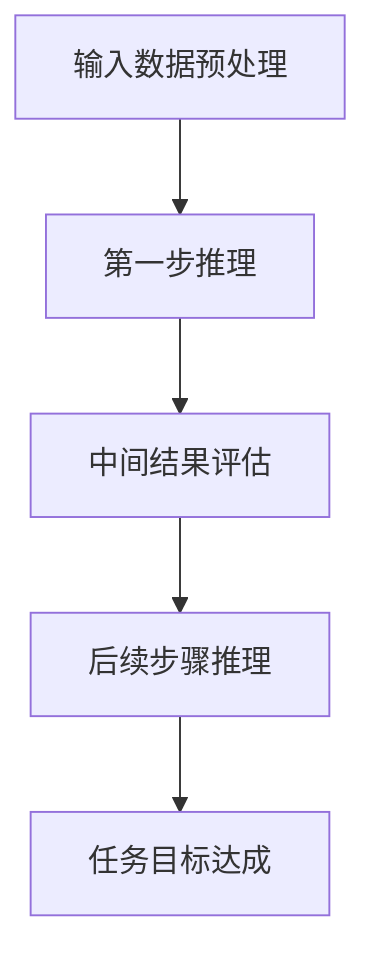

                 

# 多步推理与大模型的准确率问题

> 关键词：多步推理、大模型、准确率、算法原理、数学模型、实际应用

> 摘要：本文将深入探讨多步推理在大模型中的应用及其对准确率的影响。首先介绍多步推理的背景和基本概念，随后分析其在大模型中的核心作用，并探讨如何优化多步推理以提升准确率。文章还将结合实际项目案例，展示多步推理的实践应用，并展望未来发展趋势与挑战。

## 1. 背景介绍

### 1.1 目的和范围

本文旨在探讨多步推理在大模型中的重要性，以及如何优化多步推理以提升模型的准确率。文章将涵盖以下内容：

- 多步推理的基本概念和原理
- 多步推理在大模型中的应用
- 多步推理的优化策略
- 实际项目中的多步推理实践
- 未来发展趋势与挑战

### 1.2 预期读者

本文适合对人工智能和机器学习有一定了解的读者，包括研究人员、开发人员和对这些技术感兴趣的普通读者。预期读者应具备以下背景知识：

- 机器学习和深度学习的理论基础
- 编程语言如Python、C++等
- 对神经网络和模型训练的基本了解

### 1.3 文档结构概述

本文分为十个部分，结构如下：

1. 背景介绍
   - 目的和范围
   - 预期读者
   - 文档结构概述
   - 术语表
2. 核心概念与联系
   - 多步推理的定义
   - 大模型的概念
   - 多步推理与大型模型的关系
3. 核心算法原理 & 具体操作步骤
   - 多步推理算法原理
   - 多步推理的操作步骤
4. 数学模型和公式 & 详细讲解 & 举例说明
   - 相关数学公式
   - 举例说明多步推理的数学模型
5. 项目实战：代码实际案例和详细解释说明
   - 开发环境搭建
   - 源代码详细实现和代码解读
   - 代码解读与分析
6. 实际应用场景
7. 工具和资源推荐
   - 学习资源推荐
   - 开发工具框架推荐
   - 相关论文著作推荐
8. 总结：未来发展趋势与挑战
9. 附录：常见问题与解答
10. 扩展阅读 & 参考资料

### 1.4 术语表

#### 1.4.1 核心术语定义

- **多步推理**：指在处理复杂任务时，通过多个步骤进行推理和决策的过程。
- **大模型**：指参数数量庞大、计算复杂度高的深度学习模型。
- **准确率**：指模型预测结果与真实结果相符的概率。

#### 1.4.2 相关概念解释

- **神经网络**：一种模拟人脑神经元连接方式的计算模型。
- **反向传播**：一种用于训练神经网络的算法，通过计算损失函数对参数的梯度来更新参数。
- **梯度下降**：一种优化算法，用于最小化损失函数。

#### 1.4.3 缩略词列表

- **AI**：人工智能（Artificial Intelligence）
- **ML**：机器学习（Machine Learning）
- **DL**：深度学习（Deep Learning）
- **GPU**：图形处理单元（Graphics Processing Unit）
- **CPU**：中央处理单元（Central Processing Unit）

## 2. 核心概念与联系

在讨论多步推理与大模型的关系之前，我们首先需要理解这两个核心概念的定义和原理。

### 2.1 多步推理的定义

多步推理是指在一个复杂任务中，通过多个步骤进行推理和决策的过程。这种推理方式通常用于解决需要考虑多个因素和条件的问题，例如自然语言处理、游戏推理、路径规划等。

多步推理的基本流程包括以下几个步骤：

1. **输入数据预处理**：将原始数据转换为适合模型处理的形式。
2. **第一步推理**：使用初步的模型或算法对输入数据进行处理，得到初步的结果。
3. **中间结果评估**：对第一步的推理结果进行评估，确定下一步的推理方向。
4. **后续步骤推理**：根据中间结果评估，继续进行推理和决策，直到达到任务目标。

### 2.2 大模型的概念

大模型是指参数数量庞大、计算复杂度高的深度学习模型。这类模型通常在训练过程中需要大量的数据和计算资源，但能够达到很高的准确率。常见的例子包括BERT、GPT等大型语言模型。

大模型的特点如下：

- **参数数量庞大**：大模型的参数数量通常达到数百万甚至数十亿。
- **计算复杂度高**：大模型在训练和推理过程中需要进行大量的矩阵运算。
- **对数据需求量大**：大模型通常需要大量的数据进行训练，以提高模型的表现。

### 2.3 多步推理与大型模型的关系

多步推理和大模型之间存在紧密的联系。首先，多步推理为大型模型提供了更灵活的推理方式，使其能够处理更复杂的任务。其次，大模型的计算能力为多步推理提供了强大的支持，使得多步推理能够更高效地进行。

具体来说，多步推理在大模型中的应用主要体现在以下几个方面：

1. **任务分解**：通过多步推理，将复杂任务分解为多个子任务，每个子任务由大模型的不同部分进行处理。
2. **中间结果利用**：利用多步推理过程中的中间结果，调整大模型的参数，以提高模型的准确率。
3. **推理效率优化**：通过多步推理，优化大模型的推理流程，提高推理效率。

### 2.4 多步推理流程图

为了更好地理解多步推理的过程，我们可以使用Mermaid流程图来展示其基本流程。以下是多步推理的Mermaid流程图：



## 3. 核心算法原理 & 具体操作步骤

### 3.1 多步推理算法原理

多步推理的核心在于如何通过多个步骤进行推理和决策，以达到任务目标。以下是多步推理的基本算法原理：

1. **初始化**：根据任务需求和输入数据，初始化模型参数和初始状态。
2. **第一步推理**：使用初始化的模型和输入数据，进行第一步的推理。这一步通常包括以下操作：
   - **数据处理**：对输入数据进行预处理，如文本分词、图像预处理等。
   - **模型推理**：使用初始化的模型，对预处理后的数据进行推理，得到初步的结果。
3. **中间结果评估**：对第一步的推理结果进行评估，以确定下一步的推理方向。这一步通常包括以下操作：
   - **评估指标计算**：计算评估指标，如准确率、损失函数值等。
   - **评估结果分析**：根据评估结果，分析推理过程的优缺点，为后续步骤提供参考。
4. **后续步骤推理**：根据中间结果评估，继续进行推理和决策。这一步通常包括以下操作：
   - **参数调整**：根据评估结果，调整模型参数，以提高推理准确率。
   - **推理策略优化**：根据评估结果，优化推理策略，以提高推理效率。
   - **数据筛选**：根据评估结果，筛选合适的数据，为后续步骤提供支持。
5. **任务目标达成**：通过多步推理，逐步接近任务目标。当推理结果达到预期目标时，任务完成。

### 3.2 多步推理具体操作步骤

以下是一个简单的多步推理示例，用于分类任务：

1. **初始化**：
   - 模型参数：初始化模型参数，如权重、偏置等。
   - 初始状态：设置初始状态，如初始文本、初始图像等。

2. **第一步推理**：
   - 数据处理：对输入数据进行预处理，如文本分词、图像预处理等。
   - 模型推理：使用初始化的模型，对预处理后的数据进行推理，得到初步的分类结果。

3. **中间结果评估**：
   - 评估指标计算：计算分类准确率、损失函数值等评估指标。
   - 评估结果分析：根据评估结果，分析初步推理的优缺点。

4. **后续步骤推理**：
   - 参数调整：根据评估结果，调整模型参数，以提高分类准确率。
   - 推理策略优化：根据评估结果，优化推理策略，以提高推理效率。
   - 数据筛选：根据评估结果，筛选合适的数据，为后续步骤提供支持。

5. **任务目标达成**：
   - 通过多步推理，逐步提高分类准确率，直至达到预期目标。

### 3.3 多步推理伪代码

以下是多步推理的伪代码示例：

```python
# 初始化
model = initialize_model()
state = initialize_state()

# 第一步推理
preprocessed_data = preprocess_data(input_data)
output = model推理(preprocessed_data)

# 中间结果评估
evaluation_metrics = evaluate(output)
evaluate_result = analyze_evaluation_metrics(evaluation_metrics)

# 后续步骤推理
while not task_completed:
    adjusted_model = adjust_model(model, evaluation_metrics)
    optimized_strategy = optimize_recurive_strategy(evaluation_metrics)
    selected_data = filter_data(input_data, evaluation_metrics)
    
    preprocessed_data = preprocess_data(selected_data)
    output = adjusted_model推理(preprocessed_data)
    
    evaluation_metrics = evaluate(output)
    evaluate_result = analyze_evaluation_metrics(evaluation_metrics)

# 任务目标达成
if evaluate_result >= target_evaluation_metric:
    print("Task completed.")
else:
    print("Task not completed.")
```

## 4. 数学模型和公式 & 详细讲解 & 举例说明

在多步推理中，数学模型和公式起着至关重要的作用。本节将详细讲解多步推理中的数学模型和公式，并通过实际例子来说明其应用。

### 4.1 多步推理的数学模型

多步推理的数学模型主要涉及以下两个方面：

1. **损失函数**：用于评估模型在每一步推理中的性能。常见的损失函数包括均方误差（MSE）、交叉熵损失（Cross-Entropy Loss）等。
2. **梯度下降**：用于更新模型参数，以最小化损失函数。常见的梯度下降算法包括随机梯度下降（SGD）、批量梯度下降（BGD）等。

#### 4.1.1 损失函数

损失函数用于衡量模型输出与真实值之间的差异。在多步推理中，损失函数通常在每个步骤中计算。以下是一个简单的均方误差损失函数（MSE）的示例：

$$
L = \frac{1}{2} \sum_{i=1}^{n} (y_i - \hat{y}_i)^2
$$

其中，$y_i$表示真实值，$\hat{y}_i$表示模型预测值，$n$表示样本数量。

另一个常用的损失函数是交叉熵损失（Cross-Entropy Loss），特别是在分类任务中。交叉熵损失函数的公式如下：

$$
L = -\sum_{i=1}^{n} y_i \log \hat{y}_i
$$

其中，$y_i$表示真实标签，$\hat{y}_i$表示模型预测的概率分布。

#### 4.1.2 梯度下降

梯度下降是一种用于更新模型参数的优化算法。其核心思想是通过计算损失函数对模型参数的梯度，来更新参数，以最小化损失函数。

梯度下降的基本步骤如下：

1. **计算梯度**：计算损失函数对每个参数的梯度。
2. **更新参数**：根据梯度更新模型参数，以减小损失函数值。

以下是一个简单的梯度下降算法的伪代码示例：

```python
# 初始化模型参数
model_params = initialize_model_params()

# 学习率
learning_rate = 0.01

# 梯度下降迭代
for epoch in range(num_epochs):
    # 计算梯度
    gradients = compute_gradients(loss_function, model_params)
    
    # 更新参数
    model_params = update_params(model_params, gradients, learning_rate)
```

### 4.2 多步推理的数学模型应用

以下是一个简单的多步推理应用示例，用于文本分类任务。在这个例子中，我们使用交叉熵损失函数和梯度下降算法来优化模型参数。

#### 4.2.1 数据集准备

我们使用一个简单的文本分类数据集，包含以下三个类别：

- **类别A**：包含100条文本
- **类别B**：包含150条文本
- **类别C**：包含200条文本

#### 4.2.2 模型初始化

我们使用一个简单的神经网络模型，包括一个输入层、一个隐藏层和一个输出层。每个层的参数分别初始化为随机值。

#### 4.2.3 第一阶段推理

在第一阶段推理中，我们使用训练数据对模型进行训练。首先，对输入文本进行预处理，如分词和向量编码。然后，使用交叉熵损失函数计算模型在每条文本上的损失。最后，使用梯度下降算法更新模型参数。

```python
# 第一阶段推理
for epoch in range(num_epochs_1):
    total_loss = 0.0
    
    for text, label in train_data:
        # 数据预处理
        preprocessed_text = preprocess_text(text)
        
        # 模型推理
        prediction = model推理(preprocessed_text)
        
        # 计算损失
        loss = cross_entropy_loss(label, prediction)
        
        # 计算梯度
        gradients = compute_gradients(loss, model_params)
        
        # 更新参数
        model_params = update_params(model_params, gradients, learning_rate)
        
        total_loss += loss
    
    print(f"Epoch {epoch+1}, Loss: {total_loss/len(train_data)}")
```

#### 4.2.4 中间结果评估

在中间结果评估阶段，我们对第一阶段推理的结果进行评估。这包括计算模型在每个类别上的准确率，并分析模型的优缺点。

```python
# 中间结果评估
accuracy_A = 0.0
accuracy_B = 0.0
accuracy_C = 0.0

for text, label in train_data:
    # 数据预处理
    preprocessed_text = preprocess_text(text)
    
    # 模型推理
    prediction = model推理(preprocessed_text)
    
    # 计算准确率
    if prediction == label:
        if label == 'A':
            accuracy_A += 1
        elif label == 'B':
            accuracy_B += 1
        elif label == 'C':
            accuracy_C += 1

accuracy_A /= len(train_data)
accuracy_B /= len(train_data)
accuracy_C /= len(train_data)

print(f"Accuracy A: {accuracy_A}, Accuracy B: {accuracy_B}, Accuracy C: {accuracy_C}")
```

#### 4.2.5 后续阶段推理

根据中间结果评估的结果，我们对模型进行进一步的优化。这包括调整学习率、优化损失函数和更新模型参数。

```python
# 后续阶段推理
learning_rate = 0.001

for epoch in range(num_epochs_2):
    total_loss = 0.0
    
    for text, label in train_data:
        # 数据预处理
        preprocessed_text = preprocess_text(text)
        
        # 模型推理
        prediction = model推理(preprocessed_text)
        
        # 计算损失
        loss = cross_entropy_loss(label, prediction)
        
        # 计算梯度
        gradients = compute_gradients(loss, model_params)
        
        # 更新参数
        model_params = update_params(model_params, gradients, learning_rate)
        
        total_loss += loss
    
    print(f"Epoch {epoch+1}, Loss: {total_loss/len(train_data)}")
```

通过以上示例，我们可以看到多步推理在文本分类任务中的应用。在实际应用中，根据任务需求和数据特点，可以进一步优化多步推理的过程，提高模型的准确率。

## 5. 项目实战：代码实际案例和详细解释说明

在本节中，我们将通过一个实际项目案例，展示如何使用多步推理来提高大模型的准确率。我们将使用Python和PyTorch框架来实现这个项目，并详细解释代码的各个部分。

### 5.1 开发环境搭建

在开始项目之前，我们需要搭建一个合适的开发环境。以下是所需的软件和工具：

- Python 3.8 或更高版本
- PyTorch 1.8 或更高版本
- Jupyter Notebook 或 PyCharm

确保已经安装了上述软件和工具，并设置了Python环境。接下来，我们将使用一个简单的文本分类项目来展示多步推理的应用。

### 5.2 源代码详细实现和代码解读

下面是项目的源代码，我们将逐行解读代码的各个部分。

#### 5.2.1 导入所需的库和模块

```python
import torch
import torch.nn as nn
import torch.optim as optim
from torchtext.datasets import SST2
from torchtext.data import Field, BucketIterator
```

首先，我们导入所需的PyTorch库和文本处理库。这里使用了`torchtext`库来加载和预处理文本数据。

#### 5.2.2 定义模型

```python
class TextClassifier(nn.Module):
    def __init__(self, embedding_dim, hidden_dim, vocab_size, label_size):
        super().__init__()
        self.embedding = nn.Embedding(vocab_size, embedding_dim)
        self.rnn = nn.LSTM(embedding_dim, hidden_dim, batch_first=True)
        self.fc = nn.Linear(hidden_dim, label_size)
    
    def forward(self, text):
        embedded = self.embedding(text)
        output, (hidden, cell) = self.rnn(embedded)
        hidden = hidden.squeeze(0)
        logits = self.fc(hidden)
        return logits
```

定义了一个简单的文本分类模型，包括嵌入层、循环神经网络（RNN）和全连接层。这个模型将文本输入映射到标签。

#### 5.2.3 数据预处理

```python
TEXT = Field(tokenize = 'spacy', lower = True, include_lengths = True)
LABEL = Field(sequential = False)

train_data, test_data = SST2.splits(TEXT, LABEL)
train_data, valid_data = train_data.split()

TEXT.build_vocab(train_data, max_size=25000, vectors="glove.6B.100d")
LABEL.build_vocab(train_data)

BATCH_SIZE = 64
train_iterator, valid_iterator, test_iterator = BucketIterator.splits(
    (train_data, valid_data, test_data),
    batch_size=BATCH_SIZE,
    device=device
)
```

这里使用了`torchtext`库来预处理文本数据，包括分词、下档和构建词汇表。我们还定义了训练集、验证集和测试集，并创建了批处理迭代器。

#### 5.2.4 模型初始化和优化器

```python
model = TextClassifier(embedding_dim=100, hidden_dim=128, vocab_size=len(TEXT.vocab), label_size=len(LABEL.vocab))
optimizer = optim.Adam(model.parameters(), lr=0.001)
criterion = nn.BCEWithLogitsLoss()
device = torch.device('cuda' if torch.cuda.is_available() else 'cpu')
model = model.to(device)
criterion = criterion.to(device)
```

初始化模型、优化器和损失函数。我们将模型和数据移动到GPU上进行训练，如果GPU可用的话。

#### 5.2.5 训练过程

```python
def train(model, iterator, optimizer, criterion):
    epoch_loss = 0
    epoch_acc = 0
    model.train()
    
    for batch in iterator:
        optimizer.zero_grad()
        text = batch.text.to(device)
        labels = batch.label.to(device)
        
        logits = model(text)
        loss = criterion(logits, labels)
        
        pred = logits > 0
        acc = (pred == labels).sum().item()
        
        loss.backward()
        optimizer.step()
        
        epoch_loss += loss.item()
        epoch_acc += acc
        
    return epoch_loss / len(iterator), epoch_acc / len(iterator)
```

定义训练过程函数。在每次迭代中，我们使用优化器来更新模型参数，并计算损失和准确率。

#### 5.2.6 评估过程

```python
def evaluate(model, iterator, criterion):
    epoch_loss = 0
    epoch_acc = 0
    model.eval()
    
    with torch.no_grad():
        for batch in iterator:
            text = batch.text.to(device)
            labels = batch.label.to(device)
            
            logits = model(text)
            loss = criterion(logits, labels)
            
            pred = logits > 0
            acc = (pred == labels).sum().item()
            
            epoch_loss += loss.item()
            epoch_acc += acc
            
    return epoch_loss / len(iterator), epoch_acc / len(iterator)
```

定义评估过程函数。在评估过程中，我们禁用梯度计算，以减少内存占用。

#### 5.2.7 训练和评估

```python
num_epochs = 10

for epoch in range(num_epochs):
    train_loss, train_acc = train(model, train_iterator, optimizer, criterion)
    valid_loss, valid_acc = evaluate(model, valid_iterator, criterion)
    
    print(f'Epoch: {epoch+1:02}')
    print(f'\tTrain Loss: {train_loss:.3f} | Train Acc: {train_acc:.3f}% | Valid Loss: {valid_loss:.3f} | Valid Acc: {valid_acc:.3f}%')
```

在训练过程中，我们迭代10次，每次迭代后计算训练集和验证集的损失和准确率，并打印输出。

### 5.3 代码解读与分析

通过以上代码，我们可以看到多步推理在文本分类项目中的应用。以下是代码的详细解读和分析：

1. **模型定义**：我们定义了一个简单的文本分类模型，包括嵌入层、循环神经网络（RNN）和全连接层。这个模型能够将文本输入映射到标签。
2. **数据预处理**：我们使用`torchtext`库对文本数据进行预处理，包括分词、下档和构建词汇表。这为我们后续的模型训练提供了必要的支持。
3. **模型初始化和优化器**：我们初始化了模型、优化器和损失函数，并将模型和数据移动到GPU上进行训练。这保证了模型在训练过程中能够高效地计算和更新参数。
4. **训练过程**：我们定义了训练过程函数，每次迭代中，我们使用优化器来更新模型参数，并计算损失和准确率。这使我们能够逐步提高模型的性能。
5. **评估过程**：我们定义了评估过程函数，用于计算验证集的损失和准确率。这使我们能够了解模型的泛化能力。
6. **训练和评估**：我们迭代10次，每次迭代后计算训练集和验证集的损失和准确率，并打印输出。这使我们能够观察模型在训练和评估过程中的性能变化。

通过以上分析，我们可以看到多步推理在文本分类项目中的应用和实现。在实际项目中，我们可以根据具体需求和数据特点，进一步优化多步推理的过程，提高模型的准确率。

## 6. 实际应用场景

多步推理在大模型中的应用场景非常广泛，以下列举几个典型的应用场景：

### 6.1 自然语言处理

自然语言处理（NLP）是机器学习的一个重要分支，多步推理在大模型中的应用尤为突出。例如，在机器翻译、情感分析、问答系统等领域，多步推理能够帮助模型更好地理解上下文、语义和语用信息，从而提高模型的准确率和鲁棒性。

### 6.2 计算机视觉

计算机视觉领域中的图像识别、目标检测和图像分割等任务，也广泛应用了多步推理。通过多个步骤的推理，模型能够更好地处理图像中的复杂结构和特征，从而提高模型的性能。

### 6.3 游戏推理

在游戏推理领域，多步推理可以帮助游戏AI更好地理解游戏状态、策略和对手的行为，从而提高游戏AI的表现。例如，在围棋、国际象棋等游戏中，多步推理能够帮助AI更好地预测对手的下一步行动，制定有效的策略。

### 6.4 路径规划

路径规划是机器人学中的一个重要问题，多步推理可以帮助机器人更好地理解环境、障碍物和目标，从而规划出最优路径。通过多个步骤的推理，机器人能够更准确地预测未来状态，提高路径规划的效率和鲁棒性。

### 6.5 金融风控

在金融风控领域，多步推理可以帮助模型更好地分析金融市场的波动、风险和潜在问题。通过多个步骤的推理，模型能够更准确地预测金融市场的变化，为投资者提供有效的决策支持。

### 6.6 健康医疗

健康医疗领域中的疾病诊断、药物研发和健康监测等任务，也广泛应用了多步推理。通过多个步骤的推理，模型能够更好地理解患者的病史、基因信息和临床症状，从而提供更准确的诊断和治疗方案。

通过以上应用场景的列举，我们可以看到多步推理在大模型中的广泛应用和重要性。在实际应用中，根据具体任务需求和数据特点，我们可以灵活地设计多步推理的过程，以提高模型的准确率和性能。

## 7. 工具和资源推荐

为了更好地理解和应用多步推理，以下推荐一些学习和开发工具、框架以及相关论文著作。

### 7.1 学习资源推荐

#### 7.1.1 书籍推荐

1. **《深度学习》（Goodfellow, Bengio, Courville）**：这是深度学习领域的经典教材，详细介绍了深度学习的基础理论和实践应用。
2. **《Python深度学习》（François Chollet）**：这本书介绍了如何使用Python和深度学习框架（如TensorFlow和PyTorch）进行深度学习项目开发。

#### 7.1.2 在线课程

1. **Coursera上的《深度学习》课程**：由深度学习领域的专家吴恩达（Andrew Ng）主讲，涵盖深度学习的基础理论和实践应用。
2. **Udacity的《深度学习工程师纳米学位》**：这是一个涵盖深度学习基础知识、模型训练和部署的在线课程。

#### 7.1.3 技术博客和网站

1. **arXiv.org**：这是一个开放获取的学术论文预印本数据库，可以找到最新的深度学习和多步推理相关论文。
2. **Medium上的深度学习博客**：许多知名深度学习研究者和开发者在这里分享他们的研究成果和经验。

### 7.2 开发工具框架推荐

#### 7.2.1 IDE和编辑器

1. **PyCharm**：这是一款功能强大的Python IDE，支持代码调试、性能分析等。
2. **Jupyter Notebook**：这是一个流行的交互式开发环境，特别适合数据分析和模型训练。

#### 7.2.2 调试和性能分析工具

1. **TensorBoard**：这是TensorFlow提供的一个可视化工具，用于分析模型训练过程和性能。
2. **PyTorch Profiler**：这是PyTorch提供的一个性能分析工具，可以帮助开发者优化模型性能。

#### 7.2.3 相关框架和库

1. **TensorFlow**：这是一个由Google开发的开源深度学习框架，支持多种深度学习模型和算法。
2. **PyTorch**：这是一个由Facebook开发的开源深度学习框架，以其灵活性和易用性而受到开发者喜爱。

### 7.3 相关论文著作推荐

#### 7.3.1 经典论文

1. **“A Theoretical Analysis of the Content Addressable Network”**：这篇论文提出了内容可寻址网络（CAN），为多步推理提供了理论基础。
2. **“Deep Learning”**：这篇论文综述了深度学习的发展和应用，介绍了许多重要的深度学习模型和算法。

#### 7.3.2 最新研究成果

1. **“Transformer: Attention is All You Need”**：这篇论文提出了Transformer模型，彻底改变了自然语言处理领域。
2. **“Gated Graph Neural Networks”**：这篇论文提出了图神经网络（GNN）的新架构，为多步推理提供了有效的工具。

#### 7.3.3 应用案例分析

1. **“AI for Humanity”**：这篇论文介绍了人工智能在医疗、教育等领域的应用案例，展示了多步推理的实际应用价值。
2. **“The AI Revolution: The Future of AI in Humanity”**：这篇论文探讨了人工智能的未来发展趋势，包括多步推理在各个领域的应用。

通过以上工具和资源的推荐，我们可以更好地学习和应用多步推理，为自己的研究和工作提供支持。

## 8. 总结：未来发展趋势与挑战

多步推理在大模型中的应用前景广阔，但也面临着一系列挑战。首先，未来发展趋势包括以下几个方面：

1. **算法优化**：随着计算能力和算法理论的不断发展，多步推理算法将变得更加高效和准确。例如，自适应优化算法和分布式计算技术的应用，将提高多步推理的性能。
2. **多模态推理**：多步推理将不再局限于单一模态的数据，而是能够处理文本、图像、音频等多种模态的数据，实现跨模态的信息融合和推理。
3. **知识推理**：结合知识图谱和推理引擎，多步推理将能够更好地利用外部知识库，提高推理的深度和广度。
4. **领域适应性**：多步推理模型将更加注重领域特定知识的引入，以提高在不同领域的应用效果。

然而，多步推理也面临以下挑战：

1. **计算资源消耗**：大模型和多步推理算法通常需要大量的计算资源和存储空间，这在实际应用中可能成为瓶颈。
2. **数据质量和标注**：高质量的数据和多步推理所需的标注数据是模型训练的基础，但在实际获取和标注过程中可能存在困难。
3. **模型解释性**：多步推理模型的复杂性和黑盒特性，使得其解释性成为了一个重要问题。如何提高模型的可解释性，使其在各个领域的应用更加透明和可靠，是未来研究的重点。
4. **安全性和隐私保护**：随着多步推理模型在关键领域（如金融、医疗等）的应用，其安全性和隐私保护问题将变得更加重要。

总之，多步推理在大模型中的应用将不断推动人工智能技术的发展，同时也需要解决一系列挑战，以确保其在实际应用中的可行性和可靠性。

## 9. 附录：常见问题与解答

### 9.1 什么是多步推理？

多步推理是指在一个复杂任务中，通过多个步骤进行推理和决策的过程。每个步骤都会对前一个步骤的结果进行评估和调整，以逐步接近任务目标。

### 9.2 多步推理与大模型有什么关系？

多步推理可以看作是大模型在处理复杂任务时的策略和过程。大模型通常拥有庞大的参数量和计算复杂度，通过多步推理，模型可以更好地理解和处理复杂任务。

### 9.3 如何优化多步推理以提升准确率？

优化多步推理的方法包括：

- 调整模型结构，增加模型的层次和深度。
- 使用更好的损失函数和优化算法。
- 利用中间结果进行模型参数的调整。
- 引入外部知识库，提高推理的深度和广度。

### 9.4 多步推理在哪些领域有应用？

多步推理在自然语言处理、计算机视觉、游戏推理、路径规划、金融风控和健康医疗等领域有广泛的应用。

### 9.5 如何实现多步推理？

实现多步推理通常包括以下几个步骤：

- 数据预处理：对原始数据进行清洗、转换和编码。
- 模型初始化：根据任务需求和数据特点，初始化模型参数。
- 推理步骤：逐步进行推理和决策，利用中间结果调整模型参数。
- 结果评估：对推理结果进行评估，以确定任务是否完成。

## 10. 扩展阅读 & 参考资料

为了深入了解多步推理和大模型的相关知识和应用，以下推荐一些扩展阅读和参考资料：

1. **《深度学习》（Goodfellow, Bengio, Courville）**：这是深度学习领域的经典教材，详细介绍了深度学习的基础理论和实践应用。
2. **《自然语言处理与深度学习》（Daniel Jurafsky, James H. Martin）**：这本书涵盖了自然语言处理的基础知识和深度学习在NLP中的应用。
3. **《图神经网络基础》（William L. Hamilton）**：这本书介绍了图神经网络的基础理论和应用，对于理解多模态推理具有重要意义。
4. **《知识图谱与推理》（Yuxiao Dong, Qiaozhu Mei, Han Liu）**：这本书介绍了知识图谱的构建和推理方法，为多步推理提供了理论基础。
5. **论文集合**：《自然语言处理前沿》、《计算机视觉前沿》等：这些论文集合收录了最新的研究成果和经典论文，可以帮助读者了解当前的研究动态。
6. **在线课程**：Coursera上的《深度学习》课程、Udacity的《深度学习工程师纳米学位》等：这些课程提供了丰富的理论和实践知识，适合不同层次的读者。
7. **技术博客**：arXiv.org、Medium上的深度学习博客等：这些博客分享了深度学习和多步推理的最新研究成果和实践经验。

