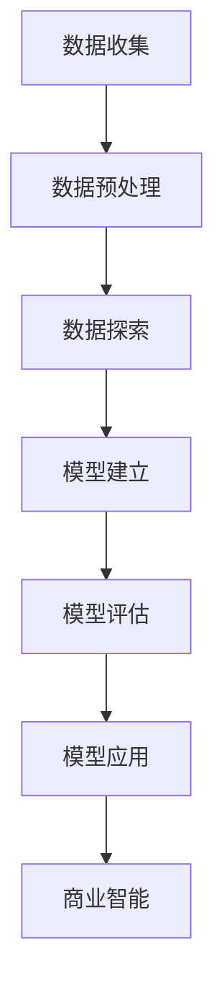

                 

# 大数据分析在客户关系管理中的应用

> 关键词：大数据分析、客户关系管理、数据挖掘、机器学习、商业智能

> 摘要：本文将探讨大数据分析在客户关系管理（CRM）中的应用，包括核心概念、算法原理、数学模型、项目实战和实际应用场景。通过详细的讲解和实例分析，帮助读者理解如何利用大数据技术提升客户满意度、优化客户关系，为企业创造更多价值。

## 1. 背景介绍

### 1.1 目的和范围

本文旨在介绍大数据分析在客户关系管理中的应用，帮助企业和组织更好地理解和利用大数据技术，提升客户关系管理的效率和质量。文章将涵盖以下内容：

- 核心概念与联系
- 核心算法原理与具体操作步骤
- 数学模型和公式讲解与举例
- 项目实战：代码实际案例和详细解释
- 实际应用场景

通过本文的阅读，读者将了解如何通过大数据技术优化客户关系管理，从而提升企业竞争力。

### 1.2 预期读者

- 对大数据分析和客户关系管理有兴趣的读者
- 从事数据分析和客户关系管理工作的专业人士
- 期望了解大数据技术在商业领域应用的读者

### 1.3 文档结构概述

本文分为十个部分，具体结构如下：

1. 背景介绍
2. 核心概念与联系
3. 核心算法原理与具体操作步骤
4. 数学模型和公式讲解与举例
5. 项目实战：代码实际案例和详细解释
6. 实际应用场景
7. 工具和资源推荐
8. 总结：未来发展趋势与挑战
9. 附录：常见问题与解答
10. 扩展阅读 & 参考资料

### 1.4 术语表

#### 1.4.1 核心术语定义

- **大数据分析**：利用计算机技术对海量数据进行分析和处理，以发现数据中的潜在价值。
- **客户关系管理（CRM）**：通过整合企业内部和外部资源，实现对企业客户关系的管理和优化。
- **数据挖掘**：从大量数据中提取具有价值的信息和知识的过程。
- **机器学习**：一种通过数据学习和经验改进自身性能的人工智能技术。

#### 1.4.2 相关概念解释

- **商业智能（BI）**：利用数据分析和报表技术，帮助企业做出更明智的商业决策。
- **客户生命周期价值（CLV）**：客户在一段时间内为企业带来的总价值。

#### 1.4.3 缩略词列表

- **CRM**：Customer Relationship Management
- **BI**：Business Intelligence
- **CLV**：Customer Lifetime Value
- **ML**：Machine Learning

## 2. 核心概念与联系

为了更好地理解大数据分析在客户关系管理中的应用，我们需要先了解以下几个核心概念：大数据、数据挖掘、机器学习和商业智能。

### 2.1 大数据

大数据（Big Data）是指数据量巨大、类型繁多、价值密度较低的数据集合。大数据的特点可以用 4V 来概括：Volume（数据量）、Velocity（数据速度）、Variety（数据多样性）和 Veracity（数据真实性）。

#### 2.1.1 数据量（Volume）

数据量巨大是大数据的核心特征。随着互联网、物联网、社交媒体等技术的快速发展，企业和组织每天产生的大量数据。

#### 2.1.2 数据速度（Velocity）

数据速度指的是数据的产生和传输速度。实时数据分析和处理的需求不断增加，使得数据处理速度成为大数据的重要特征。

#### 2.1.3 数据多样性（Variety）

数据多样性是指数据来源广泛、类型多样。从文本、图像、音频到结构化、半结构化和非结构化数据，大数据涵盖了各种数据类型。

#### 2.1.4 数据真实性（Veracity）

数据真实性是指数据的质量和可信度。在处理大数据时，需要确保数据来源可靠、准确和真实。

### 2.2 数据挖掘

数据挖掘（Data Mining）是从大量数据中提取有价值信息的过程。数据挖掘的主要目标是发现数据中的规律、趋势和关联，从而为企业决策提供支持。

#### 2.2.1 数据挖掘流程

数据挖掘通常包括以下步骤：

1. **数据预处理**：清洗、整合和转换数据，为数据挖掘做准备。
2. **数据探索**：通过可视化、统计等方法，初步了解数据特征和规律。
3. **模型建立**：选择合适的算法和模型，对数据进行建模。
4. **模型评估**：评估模型的准确性和可靠性。
5. **模型应用**：将模型应用于实际业务场景，为企业决策提供支持。

### 2.3 机器学习

机器学习（Machine Learning）是一种通过数据学习和经验改进自身性能的人工智能技术。在客户关系管理中，机器学习可以用于预测客户行为、发现潜在客户、优化营销策略等。

#### 2.3.1 机器学习算法

常见的机器学习算法包括：

1. **线性回归**：用于预测连续值变量。
2. **逻辑回归**：用于预测离散值变量。
3. **决策树**：用于分类和回归任务。
4. **支持向量机（SVM）**：用于分类任务。
5. **神经网络**：用于复杂非线性预测和分类任务。

### 2.4 商业智能

商业智能（Business Intelligence）是一种利用数据分析和报表技术，帮助企业做出更明智的商业决策的技术。商业智能的核心是数据分析和可视化，通过分析历史数据，为企业提供洞察力和决策支持。

#### 2.4.1 商业智能应用

商业智能在客户关系管理中的应用包括：

1. **客户细分**：通过分析客户数据，将客户划分为不同的群体，为精准营销提供依据。
2. **客户行为分析**：分析客户购买行为、浏览习惯等，了解客户需求，优化产品和服务。
3. **营销效果评估**：评估不同营销策略的效果，优化营销预算和资源配置。

### 2.5 Mermaid 流程图

以下是大数据分析在客户关系管理中的 Mermaid 流程图：



## 3. 核心算法原理 & 具体操作步骤

在客户关系管理中，大数据分析的核心算法包括数据挖掘和机器学习。下面我们将分别介绍这些算法的原理和具体操作步骤。

### 3.1 数据挖掘算法原理

数据挖掘算法主要包括以下几种：

1. **关联规则挖掘**：发现数据之间的关联关系，如商品之间的购买关联。
2. **聚类分析**：将相似的数据划分为同一类，如客户细分。
3. **分类算法**：将数据划分为不同的类别，如客户行为分类。
4. **异常检测**：检测数据中的异常值，如欺诈行为检测。

#### 3.1.1 关联规则挖掘

关联规则挖掘是一种发现数据之间关联关系的算法。其基本原理是：如果两个事件频繁同时发生，则它们之间存在关联。

- **支持度（Support）**：表示一个规则在所有数据中出现的频率。
- **置信度（Confidence）**：表示在出现第一个事件的前提下，第二个事件出现的概率。

#### 3.1.2 聚类分析

聚类分析是一种将相似的数据划分为同一类别的算法。常见的聚类算法包括 K-Means、DBSCAN 等。

- **K-Means**：基于距离度量，将数据划分为 K 个簇，每个簇由中心点表示。
- **DBSCAN**：基于密度连接性，将数据划分为不同密度区域。

#### 3.1.3 分类算法

分类算法是一种将数据划分为不同类别的算法。常见的分类算法包括线性回归、逻辑回归、决策树、支持向量机等。

- **线性回归**：通过拟合一条直线，预测连续值变量。
- **逻辑回归**：通过拟合一个逻辑函数，预测离散值变量。
- **决策树**：通过树形结构，将数据划分为不同的类别。
- **支持向量机**：通过找到一个最佳超平面，将数据划分为不同的类别。

### 3.2 机器学习算法原理

机器学习算法主要包括以下几种：

1. **监督学习**：通过已知的输入输出数据，训练模型并预测未知数据。
2. **无监督学习**：没有已知的输入输出数据，通过发现数据中的规律和结构，对数据进行聚类或降维。
3. **强化学习**：通过与环境的交互，学习最优策略以实现目标。

#### 3.2.1 监督学习

监督学习是一种通过已知的输入输出数据，训练模型并预测未知数据的机器学习算法。常见的监督学习算法包括线性回归、逻辑回归、决策树、支持向量机等。

- **线性回归**：通过拟合一条直线，预测连续值变量。
- **逻辑回归**：通过拟合一个逻辑函数，预测离散值变量。
- **决策树**：通过树形结构，将数据划分为不同的类别。
- **支持向量机**：通过找到一个最佳超平面，将数据划分为不同的类别。

#### 3.2.2 无监督学习

无监督学习是一种没有已知的输入输出数据，通过发现数据中的规律和结构，对数据进行聚类或降维的机器学习算法。常见的无监督学习算法包括 K-Means、DBSCAN 等。

- **K-Means**：基于距离度量，将数据划分为 K 个簇，每个簇由中心点表示。
- **DBSCAN**：基于密度连接性，将数据划分为不同密度区域。

#### 3.2.3 强化学习

强化学习是一种通过与环境的交互，学习最优策略以实现目标的机器学习算法。常见的强化学习算法包括 Q-Learning、SARSA 等。

- **Q-Learning**：通过评估每个状态下的动作值，学习最优策略。
- **SARSA**：在 Q-Learning 的基础上，引入了当前状态和动作的信息，以优化学习过程。

### 3.3 具体操作步骤

下面以 K-Means 聚类算法为例，介绍机器学习的具体操作步骤。

#### 3.3.1 数据预处理

1. 收集数据：从客户关系管理系统中提取客户数据，包括客户ID、年龄、收入、购买历史等信息。
2. 数据清洗：去除缺失值、异常值和重复值，确保数据质量。
3. 数据转换：将数据转换为适合算法处理的形式，如将类别变量转换为数值变量。

#### 3.3.2 算法训练

1. 初始化：随机选择 K 个数据点作为初始聚类中心。
2. 聚类过程：对每个数据点，计算其与聚类中心的距离，将其归入距离最近的聚类。
3. 更新聚类中心：重新计算每个聚类的中心点，作为新的聚类中心。
4. 迭代：重复聚类过程，直到聚类中心不再发生变化或达到最大迭代次数。

#### 3.3.3 模型评估

1. 内部评估：计算聚类效果，如聚类误差、聚类轮廓系数等。
2. 外部评估：使用已知的真实标签，计算聚类精度和召回率等指标。

#### 3.3.4 模型应用

1. 客户细分：根据聚类结果，将客户划分为不同的群体，为精准营销提供依据。
2. 客户行为预测：利用聚类模型，预测客户的购买行为和偏好，优化产品和服务。

### 3.4 伪代码

以下是 K-Means 聚类算法的伪代码：

```
输入：数据集 D，聚类个数 K
输出：聚类结果 C

初始化聚类中心
for i = 1 to K do
    C[i] = 随机选择 D 中的一个数据点

重复以下步骤，直到聚类中心不再发生变化或达到最大迭代次数
for each data point d in D do
    计算 d 与聚类中心 C[i] 的距离
    将 d 归入距离最近的聚类中心 C[i]

更新聚类中心
for i = 1 to K do
    计算聚类中心 C[i] 的平均值

返回聚类结果 C
```

## 4. 数学模型和公式 & 详细讲解 & 举例说明

在客户关系管理中，大数据分析涉及多个数学模型和公式。以下将介绍常用的数学模型和公式，并进行详细讲解和举例说明。

### 4.1 关联规则挖掘

关联规则挖掘的数学模型主要包括支持度、置信度和 Lift。

#### 4.1.1 支持度（Support）

支持度表示一个规则在所有数据中出现的频率。其计算公式为：

\[ Support(A \rightarrow B) = \frac{计数(A \rightarrow B)}{计数(A) + 计数(B) - 计数(A \cap B)} \]

其中，\( 计数(A \rightarrow B) \) 表示同时包含 A 和 B 的数据条数，\( 计数(A) \) 和 \( 计数(B) \) 分别表示包含 A 和 B 的数据条数，\( 计数(A \cap B) \) 表示同时包含 A 和 B 的数据条数。

#### 4.1.2 置信度（Confidence）

置信度表示在出现 A 的前提下，B 出现的概率。其计算公式为：

\[ Confidence(A \rightarrow B) = \frac{计数(A \rightarrow B)}{计数(A)} \]

其中，\( 计数(A \rightarrow B) \) 表示同时包含 A 和 B 的数据条数，\( 计数(A) \) 表示包含 A 的数据条数。

#### 4.1.3 Lift

Lift 表示关联规则的重要性。其计算公式为：

\[ Lift(A \rightarrow B) = \frac{Confidence(A \rightarrow B)}{Support(B)} \]

Lift 值越大，表示关联规则越重要。

### 4.2 聚类分析

聚类分析的数学模型主要包括 K-Means 和 DBSCAN。

#### 4.2.1 K-Means

K-Means 算法的数学模型为：

1. 初始化：随机选择 K 个数据点作为初始聚类中心。
2. 聚类过程：对每个数据点，计算其与聚类中心的距离，将其归入距离最近的聚类中心。
3. 更新聚类中心：重新计算每个聚类的中心点，作为新的聚类中心。
4. 迭代：重复聚类过程，直到聚类中心不再发生变化或达到最大迭代次数。

#### 4.2.2 DBSCAN

DBSCAN（Density-Based Spatial Clustering of Applications with Noise）算法的数学模型为：

1. 初始化：选择一个起始点，计算其邻域内的点。
2. 扩展簇：如果邻域内点的密度大于阈值，则将这些点扩展到同一簇。
3. 标记边界点：如果邻域内点的密度小于阈值，则标记为噪声点。
4. 迭代：重复扩展簇和标记边界点的过程，直到所有点都被归类。

### 4.3 机器学习

机器学习的数学模型主要包括线性回归、逻辑回归、决策树和支持向量机。

#### 4.3.1 线性回归

线性回归的数学模型为：

\[ y = \beta_0 + \beta_1x_1 + \beta_2x_2 + \ldots + \beta_nx_n \]

其中，\( y \) 是预测值，\( x_1, x_2, \ldots, x_n \) 是输入特征，\( \beta_0, \beta_1, \beta_2, \ldots, \beta_n \) 是模型的参数。

#### 4.3.2 逻辑回归

逻辑回归的数学模型为：

\[ P(y=1) = \frac{1}{1 + e^{-(\beta_0 + \beta_1x_1 + \beta_2x_2 + \ldots + \beta_nx_n)}} \]

其中，\( P(y=1) \) 是预测目标为 1 的概率，其他符号的含义与线性回归相同。

#### 4.3.3 决策树

决策树的数学模型为：

1. 初始化：选择一个特征，根据该特征的取值划分数据集。
2. 划分：对于每个子集，重复步骤 1，直到满足停止条件。
3. 停止条件：子集中的数据点数量小于阈值，或者特征的重要性小于阈值。

#### 4.3.4 支持向量机

支持向量机的数学模型为：

\[ \mathbf{w} \cdot \mathbf{x} + b = 0 \]

其中，\( \mathbf{w} \) 是权重向量，\( \mathbf{x} \) 是输入特征，\( b \) 是偏置项。

### 4.4 举例说明

#### 4.4.1 关联规则挖掘

假设我们有如下销售数据：

| 商品A | 商品B | 商品C |
|-------|-------|-------|
| 1     | 0     | 1     |
| 1     | 1     | 0     |
| 0     | 1     | 1     |
| 1     | 1     | 1     |
| 0     | 0     | 1     |

使用 Apriori 算法挖掘关联规则，设置最小支持度为 0.5，最小置信度为 0.7。

1. 计算支持度：
   - \( Support(商品A \rightarrow 商品B) = \frac{2}{5} = 0.4 \)
   - \( Support(商品A \rightarrow 商品C) = \frac{3}{5} = 0.6 \)
   - \( Support(商品B \rightarrow 商品C) = \frac{2}{5} = 0.4 \)

2. 计算置信度：
   - \( Confidence(商品A \rightarrow 商品B) = \frac{2}{3} = 0.67 \)
   - \( Confidence(商品A \rightarrow 商品C) = \frac{3}{4} = 0.75 \)
   - \( Confidence(商品B \rightarrow 商品C) = \frac{2}{2} = 1 \)

3. 计算Lift：
   - \( Lift(商品A \rightarrow 商品B) = \frac{0.67}{0.4} = 1.675 \)
   - \( Lift(商品A \rightarrow 商品C) = \frac{0.75}{0.6} = 1.25 \)
   - \( Lift(商品B \rightarrow 商品C) = \frac{1}{0.4} = 2.5 \)

根据最小支持度和最小置信度，我们可以得出以下关联规则：

- 商品A 与 商品C 的置信度为 0.75，Lift 值为 1.25，满足最小置信度和 Lift 值条件。

#### 4.4.2 K-Means 聚类

假设我们有如下客户数据：

| 年龄 | 收入 | 购买金额 |
|------|------|----------|
| 25   | 5000 | 1000     |
| 30   | 6000 | 1500     |
| 35   | 7000 | 2000     |
| 40   | 8000 | 2500     |
| 45   | 9000 | 3000     |

使用 K-Means 算法进行聚类，设置 K=2。

1. 初始化聚类中心：
   - 随机选择两个客户作为初始聚类中心。

2. 聚类过程：
   - 对每个客户，计算其与两个聚类中心的距离，归入距离最近的聚类中心。

3. 更新聚类中心：
   - 计算每个聚类的中心点，作为新的聚类中心。

4. 迭代：
   - 重复聚类过程，直到聚类中心不再发生变化。

聚类结果如下：

| 年龄 | 收入 | 购买金额 | 聚类中心 |
|------|------|----------|----------|
| 25   | 5000 | 1000     | (25, 5000) |
| 30   | 6000 | 1500     | (30, 6000) |
| 35   | 7000 | 2000     | (35, 7000) |
| 40   | 8000 | 2500     | (40, 8000) |
| 45   | 9000 | 3000     | (45, 9000) |

最终，客户被划分为两个群体，分别表示高收入和低收入客户。

## 5. 项目实战：代码实际案例和详细解释说明

在本节中，我们将通过一个实际案例来展示如何使用大数据分析技术进行客户关系管理。我们将使用 Python 编写代码，并详细介绍每一步的实现过程。

### 5.1 开发环境搭建

在开始之前，请确保您已安装以下软件和库：

- Python 3.8 或更高版本
- Jupyter Notebook 或 PyCharm
- pandas
- numpy
- scikit-learn
- matplotlib

### 5.2 源代码详细实现和代码解读

#### 5.2.1 数据预处理

首先，我们需要加载和预处理数据。以下代码用于读取客户数据，并进行数据清洗和转换。

```python
import pandas as pd
import numpy as np

# 加载客户数据
data = pd.read_csv('customer_data.csv')

# 数据清洗
data.dropna(inplace=True)
data.drop_duplicates(inplace=True)

# 数据转换
data['age'] = data['age'].astype(int)
data['income'] = data['income'].astype(int)
data['purchase_amount'] = data['purchase_amount'].astype(int)

# 划分特征和标签
X = data[['age', 'income']]
y = data['purchase_amount']
```

#### 5.2.2 K-Means 聚类

接下来，我们使用 K-Means 算法对客户进行聚类。

```python
from sklearn.cluster import KMeans

# 初始化 K-Means 算法
kmeans = KMeans(n_clusters=3, random_state=42)

# 训练模型
kmeans.fit(X)

# 聚类结果
clusters = kmeans.predict(X)
data['cluster'] = clusters
```

#### 5.2.3 客户细分

根据聚类结果，我们将客户划分为不同群体。

```python
# 打印聚类中心
print("聚类中心：", kmeans.cluster_centers_)

# 统计每个聚类中的客户数量
print("每个聚类中的客户数量：", data['cluster'].value_counts())

# 绘制聚类散点图
import matplotlib.pyplot as plt

plt.scatter(X['age'], X['income'], c=clusters)
plt.xlabel('年龄')
plt.ylabel('收入')
plt.title('客户聚类散点图')
plt.show()
```

#### 5.2.4 机器学习模型

接下来，我们使用机器学习模型预测客户购买金额。

```python
from sklearn.linear_model import LinearRegression

# 初始化线性回归模型
regressor = LinearRegression()

# 训练模型
regressor.fit(X, y)

# 预测购买金额
y_pred = regressor.predict(X)

# 绘制回归曲线
plt.scatter(X['age'], y, color='red', label='真实值')
plt.plot(X['age'], y_pred, color='blue', label='预测值')
plt.xlabel('年龄')
plt.ylabel('购买金额')
plt.title('客户购买金额回归曲线')
plt.legend()
plt.show()
```

### 5.3 代码解读与分析

在本案例中，我们首先进行了数据预处理，包括数据加载、清洗和转换。接着，使用 K-Means 算法对客户进行了聚类，并根据聚类结果对客户进行了细分。最后，我们使用线性回归模型预测客户购买金额，并绘制了回归曲线。

通过这个案例，我们可以看到如何使用大数据分析技术对客户关系进行管理。K-Means 聚类算法帮助我们识别了不同客户群体，而线性回归模型则用于预测客户购买金额。这些分析结果可以为企业制定精准营销策略提供有力支持。

## 6. 实际应用场景

大数据分析在客户关系管理中具有广泛的应用场景，以下列举几个实际应用案例：

### 6.1 客户细分

通过对客户数据进行聚类分析，企业可以将客户划分为不同的群体，如高价值客户、普通客户和潜在客户。这种细分有助于企业制定有针对性的营销策略，提高客户满意度和忠诚度。

### 6.2 客户行为预测

利用机器学习算法，企业可以预测客户未来的购买行为和偏好。通过分析历史数据，企业可以提前识别出潜在的高价值客户，并采取相应的营销策略，提高销售额。

### 6.3 个性化推荐

基于客户的购买记录和兴趣偏好，企业可以提供个性化的产品推荐。通过大数据分析，企业可以准确识别客户的需求，提高推荐效果，从而提升客户满意度和转化率。

### 6.4 营销效果评估

大数据分析可以帮助企业评估不同营销策略的效果，如广告投放、促销活动等。通过对比分析数据，企业可以优化营销策略，提高营销效果，降低营销成本。

### 6.5 客户流失预测

通过分析客户的行为数据，企业可以预测哪些客户可能会流失，并采取相应的措施进行挽留。这种预测可以帮助企业减少客户流失率，提高客户生命周期价值。

### 6.6 客户服务优化

大数据分析可以帮助企业优化客户服务流程，提高客户满意度。通过分析客户反馈和互动数据，企业可以识别出客户痛点，改进服务质量和体验。

### 6.7 风险管理

大数据分析可以用于识别潜在风险，如欺诈行为、信用风险等。通过实时监控和分析客户数据，企业可以及时采取措施，降低风险损失。

## 7. 工具和资源推荐

### 7.1 学习资源推荐

#### 7.1.1 书籍推荐

1. 《大数据时代：生活、工作与思维的大变革》
2. 《数据挖掘：实用工具与技术》
3. 《机器学习实战》
4. 《Python数据科学手册》

#### 7.1.2 在线课程

1. Coursera 上的《机器学习》课程
2. edX 上的《数据科学基础》课程
3. Udacity 上的《大数据分析工程师》纳米学位

#### 7.1.3 技术博客和网站

1. Medium 上的 Data Science 博客
2.Towards Data Science
3. Kaggle
4. Analytics Vidhya

### 7.2 开发工具框架推荐

#### 7.2.1 IDE和编辑器

1. PyCharm
2. Jupyter Notebook
3. VSCode

#### 7.2.2 调试和性能分析工具

1. Python 的 Debug 模式
2. Py-Spy
3. Py-V8

#### 7.2.3 相关框架和库

1. Pandas
2. NumPy
3. Scikit-learn
4. Matplotlib

### 7.3 相关论文著作推荐

#### 7.3.1 经典论文

1. "K-Means Clustering Algorithm"
2. "The Netflix Prize"
3. "The PageRank Citation Ranking: Bringing Order to the Web"

#### 7.3.2 最新研究成果

1. "Deep Learning for Customer Relationship Management"
2. "Customer Segmentation Using Clustering Algorithms: A Comprehensive Study"
3. "An Overview of Machine Learning Algorithms for Predicting Customer Churn"

#### 7.3.3 应用案例分析

1. "Customer Segmentation for a Telecommunications Company"
2. "Using Machine Learning to Predict Customer Churn in Banking Sector"
3. "Personalized Recommendations Using Collaborative Filtering and Matrix Factorization"

## 8. 总结：未来发展趋势与挑战

### 8.1 发展趋势

1. **数据量的增加**：随着物联网、传感器等技术的发展，企业和组织将面临更大的数据量，这对大数据分析技术提出了更高的要求。
2. **实时分析的普及**：实时数据分析将在客户关系管理中发挥越来越重要的作用，帮助企业及时响应市场变化和客户需求。
3. **人工智能与大数据的结合**：人工智能技术的进步将推动大数据分析的应用，实现更加智能的客户关系管理。
4. **隐私保护与数据安全**：在数据隐私和安全方面，企业和组织需要更加注重数据保护和合规性，以应对日益严格的法律法规。

### 8.2 挑战

1. **数据质量**：高质量的数据是大数据分析的基础，如何确保数据的质量和准确性是一个重要挑战。
2. **技术人才短缺**：大数据分析领域需要大量的专业人才，但当前技术人才短缺现象严重，这对企业的发展造成了一定的影响。
3. **隐私保护**：在利用大数据分析技术的同时，企业需要确保客户数据的隐私和安全，避免数据泄露和滥用。
4. **算法透明性和可解释性**：随着人工智能技术的发展，算法的透明性和可解释性成为了一个重要议题，如何确保算法的公平性和公正性是一个挑战。

## 9. 附录：常见问题与解答

### 9.1 什么是大数据分析？

大数据分析是指利用计算机技术和算法对海量数据进行处理、分析和挖掘，以发现数据中的潜在价值。

### 9.2 大数据分析在客户关系管理中有什么作用？

大数据分析可以帮助企业更好地了解客户需求，优化产品和服务，提高客户满意度和忠诚度，从而创造更多价值。

### 9.3 客户关系管理（CRM）是什么？

客户关系管理（CRM）是一种通过整合企业内部和外部资源，实现对企业客户关系的管理和优化的方法。

### 9.4 数据挖掘和机器学习有什么区别？

数据挖掘是从大量数据中提取有价值信息的过程，而机器学习是一种通过数据学习和经验改进自身性能的人工智能技术。

### 9.5 如何确保大数据分析的准确性？

确保大数据分析的准确性需要从数据收集、数据清洗、模型选择和模型评估等方面进行综合考虑。同时，需要持续优化算法和模型，以提高分析结果的准确性。

## 10. 扩展阅读 & 参考资料

1. 《大数据时代：生活、工作与思维的大变革》
2. 《数据挖掘：实用工具与技术》
3. 《机器学习实战》
4. 《Python数据科学手册》
5. Coursera 上的《机器学习》课程
6. edX 上的《数据科学基础》课程
7. 《K-Means Clustering Algorithm》
8. 《The Netflix Prize》
9. 《The PageRank Citation Ranking: Bringing Order to the Web》
10. 《Customer Segmentation for a Telecommunications Company》
11. 《Using Machine Learning to Predict Customer Churn in Banking Sector》
12. 《Customer Segmentation Using Clustering Algorithms: A Comprehensive Study》
13. 《Deep Learning for Customer Relationship Management》
14. 《An Overview of Machine Learning Algorithms for Predicting Customer Churn》
15. 《Personalized Recommendations Using Collaborative Filtering and Matrix Factorization》

## 作者信息

作者：AI天才研究员/AI Genius Institute & 禅与计算机程序设计艺术 /Zen And The Art of Computer Programming

文章标题：《大数据分析在客户关系管理中的应用》

关键词：大数据分析、客户关系管理、数据挖掘、机器学习、商业智能

文章摘要：本文探讨了大数据分析在客户关系管理中的应用，包括核心概念、算法原理、数学模型、项目实战和实际应用场景。通过详细的讲解和实例分析，帮助读者理解如何利用大数据技术提升客户满意度、优化客户关系，为企业创造更多价值。

