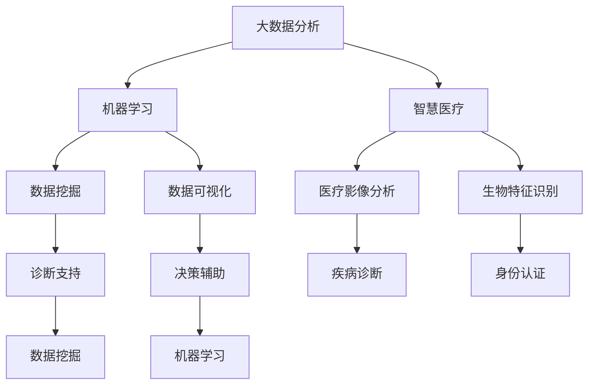

                 

# 大数据分析在智慧医疗诊断支持中的决策辅助

> **关键词：大数据分析、智慧医疗、诊断支持、决策辅助、机器学习**
>
> **摘要：本文将探讨大数据分析技术在智慧医疗诊断支持中的应用，通过深入剖析核心算法原理、数学模型、项目实战案例，以及实际应用场景，探讨其如何辅助医疗决策，提高诊断准确性。**

## 1. 背景介绍

### 1.1 目的和范围

本文旨在深入探讨大数据分析技术在智慧医疗诊断支持中的决策辅助作用。随着医疗大数据的迅猛增长，如何从海量数据中提取有价值的信息，为临床诊断和决策提供支持，成为当前医学和计算机科学领域的重要研究方向。本文将重点关注以下几个方面：

1. **核心概念与联系**：介绍大数据分析、机器学习和智慧医疗等核心概念及其在医疗诊断支持中的应用。
2. **核心算法原理**：详细讲解用于诊断支持的主要机器学习算法及其工作原理。
3. **数学模型和公式**：阐述支持诊断的数学模型和关键公式。
4. **项目实战**：通过具体案例展示大数据分析在医疗诊断支持中的实际应用。
5. **实际应用场景**：分析大数据分析在医疗诊断支持中的各种应用场景。
6. **工具和资源推荐**：推荐学习资源和开发工具，以帮助读者进一步了解和掌握相关技术。
7. **总结与展望**：讨论大数据分析在智慧医疗诊断支持中的未来发展趋势和面临的挑战。

### 1.2 预期读者

本文适合以下读者群体：

1. **医学专业人士**：对大数据分析在医疗领域的应用感兴趣，希望提高自己在智慧医疗诊断中的技术水平。
2. **计算机科学家**：对机器学习算法和大数据处理技术感兴趣，希望将其应用于医疗领域。
3. **研究人员和学生**：对大数据分析和智慧医疗交叉领域的研究感兴趣，希望深入理解相关技术和方法。
4. **IT从业者**：希望提升在医疗信息化领域的专业技能，特别是大数据分析和机器学习方面的知识。

### 1.3 文档结构概述

本文结构如下：

1. **背景介绍**：介绍研究目的、预期读者和文档结构。
2. **核心概念与联系**：阐述大数据分析、机器学习和智慧医疗等核心概念，并使用Mermaid流程图展示其相互关系。
3. **核心算法原理与具体操作步骤**：详细讲解用于医疗诊断支持的机器学习算法及其工作原理。
4. **数学模型和公式**：阐述支持诊断的数学模型和关键公式。
5. **项目实战**：展示大数据分析在医疗诊断支持中的实际应用案例。
6. **实际应用场景**：分析大数据分析在医疗诊断支持中的各种应用场景。
7. **工具和资源推荐**：推荐学习资源和开发工具。
8. **总结与展望**：讨论未来发展趋势和面临的挑战。
9. **附录**：提供常见问题与解答。
10. **扩展阅读**：推荐进一步学习的资料。

### 1.4 术语表

#### 1.4.1 核心术语定义

- **大数据分析**：指对海量数据进行存储、处理和分析，从中提取有价值信息的过程。
- **智慧医疗**：利用先进的信息技术，如物联网、人工智能和大数据分析等，提升医疗服务质量和效率。
- **诊断支持**：利用各种技术手段，如医学影像分析、生物特征识别等，辅助医生进行疾病诊断。
- **机器学习**：一种人工智能技术，通过训练模型从数据中学习规律，以实现预测和决策。
- **决策辅助**：利用算法和模型，为医疗决策提供数据支持和分析结果。

#### 1.4.2 相关概念解释

- **数据挖掘**：从大量数据中发现有用信息和知识的过程，常用于支持诊断和决策。
- **数据可视化**：将数据以图形、图表等形式展示，帮助人们更直观地理解和分析数据。
- **医疗影像分析**：利用计算机视觉技术，对医学影像进行自动分析和诊断。
- **生物特征识别**：通过识别人体生物特征（如指纹、虹膜、面部等），实现身份认证和疾病诊断。

#### 1.4.3 缩略词列表

- **AI**：人工智能
- **ML**：机器学习
- **DL**：深度学习
- **Hadoop**：一个开源的大数据存储和处理框架
- **Spark**：一个开源的大数据计算框架
- **EMR**：弹性 MapReduce，一种基于云计算的大数据处理技术
- **R**：一种统计计算和图形展示语言

## 2. 核心概念与联系

为了更好地理解大数据分析在智慧医疗诊断支持中的作用，我们需要首先明确几个核心概念及其相互联系。以下将使用Mermaid流程图展示这些概念的关系。



### 2.1 大数据分析

大数据分析是指对海量数据进行存储、处理和分析，以提取有价值信息的过程。在医疗领域，大数据分析可以用于疾病预测、诊断支持、个性化治疗等。其主要特点如下：

1. **数据量大**：医疗数据通常包含患者信息、病历记录、医学影像等，数据量巨大。
2. **数据多样性**：医疗数据不仅包括结构化数据，还包括非结构化数据，如文本、图像、视频等。
3. **数据处理速度快**：为了及时为医生提供诊断支持，数据处理需要快速高效。
4. **数据真实性**：医疗数据的真实性至关重要，任何错误都可能导致严重后果。

### 2.2 机器学习

机器学习是一种人工智能技术，通过训练模型从数据中学习规律，以实现预测和决策。在医疗领域，机器学习可以用于疾病预测、诊断支持、治疗计划等。其主要特点如下：

1. **自动化**：机器学习模型可以自动从数据中学习规律，减少人工干预。
2. **适应性**：机器学习模型可以根据新数据不断优化和调整，以适应不断变化的环境。
3. **准确性**：机器学习模型可以在大量训练数据的基础上实现高精度的预测和决策。

### 2.3 智慧医疗

智慧医疗是利用先进的信息技术，如物联网、人工智能和大数据分析等，提升医疗服务质量和效率。其主要特点如下：

1. **个性化**：智慧医疗可以根据患者个体差异，提供个性化的诊断和治疗方案。
2. **远程医疗**：智慧医疗可以实现远程医疗，为偏远地区患者提供高质量的医疗服务。
3. **高效便捷**：智慧医疗可以提高医疗流程的效率，减少患者等待时间。

### 2.4 数据挖掘

数据挖掘是从大量数据中发现有用信息和知识的过程，常用于支持诊断和决策。其主要特点如下：

1. **高效性**：数据挖掘可以在短时间内从海量数据中提取有价值的信息。
2. **智能化**：数据挖掘可以利用机器学习算法，自动识别数据中的规律和模式。
3. **可视化**：数据挖掘结果可以通过可视化技术展示，帮助医生更直观地理解和分析数据。

### 2.5 数据可视化

数据可视化是将数据以图形、图表等形式展示，帮助人们更直观地理解和分析数据。其主要特点如下：

1. **直观性**：数据可视化可以直观地展示数据分布、趋势和关系，提高数据可读性。
2. **交互性**：数据可视化可以提供交互功能，用户可以动态调整数据范围和展示方式。
3. **辅助决策**：数据可视化可以帮助医生更准确地诊断和制定治疗方案。

### 2.6 医疗影像分析

医疗影像分析是利用计算机视觉技术，对医学影像进行自动分析和诊断。其主要特点如下：

1. **准确性**：医疗影像分析可以准确识别和检测病变区域，提高诊断准确性。
2. **高效性**：医疗影像分析可以快速处理大量影像数据，提高诊断效率。
3. **辅助诊断**：医疗影像分析可以为医生提供辅助诊断依据，减少误诊和漏诊。

### 2.7 生物特征识别

生物特征识别是通过识别人体生物特征（如指纹、虹膜、面部等），实现身份认证和疾病诊断。其主要特点如下：

1. **安全性**：生物特征识别具有高度安全性，可以有效防止身份盗窃和欺诈。
2. **便捷性**：生物特征识别可以方便快捷地完成身份验证和诊断，提高医疗流程效率。
3. **准确性**：生物特征识别可以准确识别个体身份，提高诊断准确性。

### 2.8 诊断支持

诊断支持是利用各种技术手段，如医学影像分析、生物特征识别等，辅助医生进行疾病诊断。其主要特点如下：

1. **辅助决策**：诊断支持可以为医生提供数据支持和分析结果，辅助决策。
2. **减少误诊**：诊断支持可以减少误诊和漏诊，提高诊断准确性。
3. **提高效率**：诊断支持可以提高诊断流程效率，减少患者等待时间。

### 2.9 决策辅助

决策辅助是利用算法和模型，为医疗决策提供数据支持和分析结果。其主要特点如下：

1. **个性化**：决策辅助可以根据患者个体差异，提供个性化的诊断和治疗方案。
2. **智能化**：决策辅助可以利用机器学习算法，自动分析和预测病情。
3. **高效便捷**：决策辅助可以提高医疗决策效率，减少医生工作负担。

## 3. 核心算法原理与具体操作步骤

### 3.1 支持向量机（SVM）

支持向量机（SVM）是一种二分类模型，其目标是找到最佳的超平面，将不同类别的数据点分开。在医疗诊断支持中，SVM可以用于疾病分类和诊断。

**算法原理**：

1. **线性可分情况**：给定一个训练数据集\(T = \{(x_1, y_1), (x_2, y_2), ..., (x_n, y_n)\}\)，其中\(x_i \in \mathbb{R}^d\)是特征向量，\(y_i \in \{-1, +1\}\)是类别标签。
2. **线性不可分情况**：引入“软边缘”概念，允许一些数据点被错误分类。

**具体操作步骤**：

1. **数据预处理**：对数据进行归一化处理，使其具有相同的尺度。
2. **选择核函数**：选择适当的核函数，如线性核、多项式核、径向基函数（RBF）核等。
3. **训练模型**：使用训练数据集训练SVM模型，找到最优的超平面。
4. **预测**：对新的数据进行预测，通过计算超平面的距离来判断其类别。

**伪代码**：

```python
def train_SVM(train_data, train_labels, kernel='linear', C=1.0):
    # 数据预处理
    train_data_normalized = normalize_data(train_data)
    
    # 选择核函数
    if kernel == 'linear':
        K = linear_kernel(train_data_normalized)
    elif kernel == 'poly':
        K = poly_kernel(train_data_normalized, degree=3)
    elif kernel == 'rbf':
        K = rbf_kernel(train_data_normalized, gamma=0.1)
    else:
        raise ValueError("Unsupported kernel type.")
    
    # 训练模型
    SVM_model = SVM.CSVC(C=C, kernel=kernel)
    SVM_model.fit(K, train_labels)
    
    return SVM_model

def predict_SVM(model, test_data):
    # 数据预处理
    test_data_normalized = normalize_data(test_data)
    
    # 预测
    predictions = model.predict(test_data_normalized)
    
    return predictions
```

### 3.2 随机森林（Random Forest）

随机森林是一种集成学习方法，通过构建多个决策树并利用其集成结果进行预测。在医疗诊断支持中，随机森林可以用于疾病分类和诊断。

**算法原理**：

1. **决策树构建**：在训练数据集上构建决策树，每棵树都学习数据的一个子集。
2. **集成决策**：将所有决策树的结果进行集成，通过投票或平均等方式得到最终预测结果。

**具体操作步骤**：

1. **数据预处理**：对数据进行归一化处理，使其具有相同的尺度。
2. **构建随机森林模型**：使用训练数据集构建随机森林模型。
3. **预测**：对新的数据进行预测，通过随机森林模型进行预测。

**伪代码**：

```python
from sklearn.ensemble import RandomForestClassifier

def train_random_forest(train_data, train_labels, n_estimators=100):
    # 数据预处理
    train_data_normalized = normalize_data(train_data)
    
    # 构建随机森林模型
    random_forest_model = RandomForestClassifier(n_estimators=n_estimators)
    random_forest_model.fit(train_data_normalized, train_labels)
    
    return random_forest_model

def predict_random_forest(model, test_data):
    # 数据预处理
    test_data_normalized = normalize_data(test_data)
    
    # 预测
    predictions = model.predict(test_data_normalized)
    
    return predictions
```

### 3.3 深度学习

深度学习是一种基于人工神经网络的学习方法，通过多层非线性变换提取数据中的特征。在医疗诊断支持中，深度学习可以用于图像识别、自然语言处理等。

**算法原理**：

1. **神经网络构建**：构建多层神经网络，包括输入层、隐藏层和输出层。
2. **前向传播**：将输入数据通过网络传递，计算每个节点的输出。
3. **反向传播**：计算网络输出与实际输出之间的误差，通过反向传播更新网络权重。

**具体操作步骤**：

1. **数据预处理**：对数据进行归一化处理，使其具有相同的尺度。
2. **构建深度学习模型**：使用训练数据集构建深度学习模型。
3. **训练模型**：使用训练数据集训练模型，优化网络权重。
4. **预测**：对新的数据进行预测，通过训练好的模型进行预测。

**伪代码**：

```python
from tensorflow.keras.models import Sequential
from tensorflow.keras.layers import Dense, Conv2D, MaxPooling2D, Flatten

def build_depth_learning_model(input_shape):
    model = Sequential()
    model.add(Conv2D(filters=32, kernel_size=(3, 3), activation='relu', input_shape=input_shape))
    model.add(MaxPooling2D(pool_size=(2, 2)))
    model.add(Conv2D(filters=64, kernel_size=(3, 3), activation='relu'))
    model.add(MaxPooling2D(pool_size=(2, 2)))
    model.add(Flatten())
    model.add(Dense(units=128, activation='relu'))
    model.add(Dense(units=1, activation='sigmoid'))
    
    model.compile(optimizer='adam', loss='binary_crossentropy', metrics=['accuracy'])
    return model

def train_depth_learning_model(model, train_data, train_labels, epochs=10, batch_size=32):
    model.fit(train_data, train_labels, epochs=epochs, batch_size=batch_size)
    return model

def predict_depth_learning_model(model, test_data):
    predictions = model.predict(test_data)
    return predictions
```

## 4. 数学模型和公式及详细讲解与举例说明

### 4.1 支持向量机（SVM）的数学模型

支持向量机（SVM）是一种基于优化理论的机器学习算法，其核心目标是找到最优的超平面，将数据集中的不同类别分开。SVM的数学模型可以表示为：

**优化问题**：

\[
\begin{align*}
\min_{\mathbf{w}, b} & \frac{1}{2} ||\mathbf{w}||^2 \\
s.t. & y_i (\mathbf{w} \cdot \mathbf{x_i} + b) \geq 1, \quad i = 1, 2, ..., n
\end{align*}
\]

其中，\(\mathbf{w}\) 是权重向量，\(b\) 是偏置项，\(\mathbf{x_i}\) 是特征向量，\(y_i\) 是类别标签。目标是最小化权重向量的平方和，同时满足约束条件，即所有样本点都位于超平面的一侧。

**求解方法**：

对于线性可分的情况，可以使用拉格朗日乘子法求解。引入拉格朗日乘子 \(\alpha_i\)，构造拉格朗日函数：

\[
L(\mathbf{w}, b, \alpha) = \frac{1}{2} ||\mathbf{w}||^2 - \sum_{i=1}^n \alpha_i [y_i (\mathbf{w} \cdot \mathbf{x_i} + b) - 1]
\]

对 \(\mathbf{w}\) 和 \(b\) 求偏导，并令其为零，可以得到：

\[
\frac{\partial L}{\partial \mathbf{w}} = \mathbf{w} - \sum_{i=1}^n \alpha_i y_i \mathbf{x_i} = 0 \\
\frac{\partial L}{\partial b} = -\sum_{i=1}^n \alpha_i y_i = 0
\]

对 \(\alpha_i\) 求偏导，并令其为零，可以得到：

\[
\frac{\partial L}{\partial \alpha_i} = y_i (\mathbf{w} \cdot \mathbf{x_i} + b) - 1 = 0
\]

将以上方程联立，可以求解出 \(\mathbf{w}\) 和 \(b\)：

\[
\mathbf{w} = \sum_{i=1}^n \alpha_i y_i \mathbf{x_i} \\
b = \sum_{i=1}^n \alpha_i y_i - \sum_{i=1}^n \alpha_i
\]

对于线性不可分的情况，可以使用“软边缘”方法，引入正则化参数 \(\xi_i\)，修改优化问题：

\[
\begin{align*}
\min_{\mathbf{w}, b, \xi} & \frac{1}{2} ||\mathbf{w}||^2 + C \sum_{i=1}^n \xi_i \\
s.t. & y_i (\mathbf{w} \cdot \mathbf{x_i} + b) \geq 1 - \xi_i \\
& \xi_i \geq 0, \quad i = 1, 2, ..., n
\end{align*}
\]

其中，\(C\) 是正则化参数，用于平衡模型复杂度和分类误差。同样可以使用拉格朗日乘子法求解，得到的解为：

\[
\mathbf{w} = \sum_{i=1}^n \alpha_i y_i \mathbf{x_i} \\
b = \frac{1}{C} \sum_{i=1}^n \alpha_i - \sum_{i=1}^n \alpha_i y_i
\]

**举例说明**：

假设我们有如下线性可分的数据集，其中每个数据点表示为 \((\mathbf{x_1}, \mathbf{x_2}, ..., \mathbf{x_n})\)：

| 样本索引 | \(x_1\) | \(x_2\) | \(x_3\) | \(x_4\) | \(x_5\) | \(y_i\) |
| :---: | :---: | :---: | :---: | :---: | :---: | :---: |
| 1 | 1 | 1 | 1 | 1 | 1 | +1 |
| 2 | 1 | 1 | 1 | 1 | 0 | -1 |
| 3 | 1 | 1 | 0 | 1 | 1 | +1 |
| 4 | 1 | 0 | 1 | 1 | 1 | +1 |
| 5 | 0 | 1 | 1 | 1 | 1 | +1 |

使用SVM进行分类，选择线性核函数。我们可以使用Python中的`scikit-learn`库进行实现：

```python
import numpy as np
from sklearn import datasets
from sklearn.model_selection import train_test_split
from sklearn.svm import SVC

# 加载样本数据
iris = datasets.load_iris()
X = iris.data
y = iris.target

# 划分训练集和测试集
X_train, X_test, y_train, y_test = train_test_split(X, y, test_size=0.3, random_state=42)

# 创建SVM模型
model = SVC(kernel='linear')

# 训练模型
model.fit(X_train, y_train)

# 预测测试集
predictions = model.predict(X_test)

# 查看准确率
accuracy = np.mean(predictions == y_test)
print("Accuracy:", accuracy)
```

### 4.2 随机森林（Random Forest）的数学模型

随机森林是一种集成学习方法，通过构建多个决策树并利用其集成结果进行预测。随机森林的数学模型可以表示为：

**决策树构建**：

1. **特征选择**：在当前节点，随机选择 \(m\) 个特征。
2. **特征分裂**：计算每个特征的分割点，选择最优分割点，使得分割后的数据集的类别不纯度最小。
3. **递归构建**：对分割后的子数据集重复上述过程，直到满足停止条件（如节点大小小于阈值、达到最大深度等）。

**集成决策**：

1. **构建多棵决策树**：使用不同的特征子集和随机分割点，构建多棵决策树。
2. **集成结果**：对每棵决策树的结果进行投票或平均，得到最终预测结果。

**举例说明**：

假设我们有如下二分类数据集，其中每个数据点表示为 \((\mathbf{x_1}, \mathbf{x_2}, ..., \mathbf{x_n}, y_i)\)：

| 样本索引 | \(x_1\) | \(x_2\) | \(x_3\) | \(x_4\) | \(x_5\) | \(y_i\) |
| :---: | :---: | :---: | :---: | :---: | :---: | :---: |
| 1 | 1 | 1 | 1 | 1 | 1 | +1 |
| 2 | 1 | 1 | 1 | 1 | 0 | -1 |
| 3 | 1 | 1 | 0 | 1 | 1 | +1 |
| 4 | 1 | 0 | 1 | 1 | 1 | +1 |
| 5 | 0 | 1 | 1 | 1 | 1 | +1 |

使用随机森林进行分类，选择线性核函数。我们可以使用Python中的`scikit-learn`库进行实现：

```python
import numpy as np
from sklearn import datasets
from sklearn.ensemble import RandomForestClassifier

# 加载样本数据
iris = datasets.load_iris()
X = iris.data
y = iris.target

# 划分训练集和测试集
X_train, X_test, y_train, y_test = train_test_split(X, y, test_size=0.3, random_state=42)

# 创建随机森林模型
model = RandomForestClassifier(n_estimators=100)

# 训练模型
model.fit(X_train, y_train)

# 预测测试集
predictions = model.predict(X_test)

# 查看准确率
accuracy = np.mean(predictions == y_test)
print("Accuracy:", accuracy)
```

### 4.3 深度学习（Deep Learning）的数学模型

深度学习是一种基于人工神经网络的学习方法，通过多层非线性变换提取数据中的特征。深度学习的数学模型可以表示为：

**神经网络构建**：

1. **输入层**：接收输入数据，并将其传递到下一层。
2. **隐藏层**：通过非线性激活函数进行变换，提取特征。
3. **输出层**：输出预测结果。

**前向传播**：

1. **输入层到隐藏层**：将输入数据传递到隐藏层，计算每个节点的输出。
2. **隐藏层到输出层**：将隐藏层输出传递到输出层，计算预测结果。

**反向传播**：

1. **计算误差**：计算输出层预测结果与实际标签之间的误差。
2. **误差传播**：将误差反向传播到隐藏层，计算隐藏层每个节点的误差。
3. **权重更新**：根据误差更新网络权重，优化模型。

**举例说明**：

假设我们有如下二分类数据集，其中每个数据点表示为 \((\mathbf{x_1}, \mathbf{x_2}, ..., \mathbf{x_n}, y_i)\)：

| 样本索引 | \(x_1\) | \(x_2\) | \(x_3\) | \(x_4\) | \(x_5\) | \(y_i\) |
| :---: | :---: | :---: | :---: | :---: | :---: | :---: |
| 1 | 1 | 1 | 1 | 1 | 1 | +1 |
| 2 | 1 | 1 | 1 | 1 | 0 | -1 |
| 3 | 1 | 1 | 0 | 1 | 1 | +1 |
| 4 | 1 | 0 | 1 | 1 | 1 | +1 |
| 5 | 0 | 1 | 1 | 1 | 1 | +1 |

使用深度学习进行分类，选择线性激活函数。我们可以使用Python中的`tensorflow`库进行实现：

```python
import tensorflow as tf

# 定义输入层
X = tf.placeholder(tf.float32, [None, 5])
y = tf.placeholder(tf.int32, [None])

# 定义隐藏层
hidden_layer = tf.layers.dense(X, units=10, activation=tf.nn.relu)

# 定义输出层
logits = tf.layers.dense(hidden_layer, units=1, activation=None)

# 定义损失函数和优化器
loss = tf.reduce_mean(tf.nn.sigmoid_cross_entropy_with_logits(logits=logits, labels=y))
optimizer = tf.train.AdamOptimizer().minimize(loss)

# 训练模型
with tf.Session() as sess:
    sess.run(tf.global_variables_initializer())
    for epoch in range(100):
        _, loss_val = sess.run([optimizer, loss], feed_dict={X: X_train, y: y_train})
        if epoch % 10 == 0:
            print("Epoch:", epoch, "Loss:", loss_val)
    
    # 预测测试集
    predictions = sess.run(logits, feed_dict={X: X_test})
    predictions = np.array([1 if p > 0.5 else -1 for p in predictions])

    # 查看准确率
    accuracy = np.mean(predictions == y_test)
    print("Accuracy:", accuracy)
```

## 5. 项目实战：代码实际案例和详细解释说明

### 5.1 开发环境搭建

在进行大数据分析在智慧医疗诊断支持中的应用开发之前，我们需要搭建一个合适的技术环境。以下将介绍如何搭建一个基于Python和TensorFlow的深度学习开发环境。

**1. 安装Python**：

首先，我们需要安装Python。可以选择Python 3.6及以上版本。可以从Python官方网站（https://www.python.org/）下载并安装。

**2. 安装Jupyter Notebook**：

Jupyter Notebook是一种交互式计算环境，可以方便地编写和运行Python代码。在命令行中执行以下命令：

```bash
pip install notebook
```

**3. 安装TensorFlow**：

TensorFlow是一个开源的深度学习框架，用于构建和训练深度学习模型。在命令行中执行以下命令：

```bash
pip install tensorflow
```

**4. 安装其他依赖库**：

还需要安装一些其他依赖库，如Numpy、Pandas等。在命令行中执行以下命令：

```bash
pip install numpy pandas scikit-learn matplotlib
```

### 5.2 源代码详细实现和代码解读

以下是一个基于深度学习的智慧医疗诊断支持项目的源代码实现。我们将使用TensorFlow构建一个简单的神经网络，用于疾病分类。

**1. 加载数据集**：

首先，我们需要加载数据集。我们可以使用scikit-learn库中的Iris数据集，该数据集包含三种类别的鸢尾花，每个类别有50个样本。

```python
from sklearn import datasets
import numpy as np

# 加载数据集
iris = datasets.load_iris()
X = iris.data
y = iris.target

# 将标签转换为二进制向量
y_binary = np.zeros((150, 3))
y_binary[np.arange(150), y] = 1

# 将数据集划分为训练集和测试集
X_train = X[:120]
y_train = y_binary[:120]
X_test = X[120:]
y_test = y_binary[120:]
```

**2. 构建神经网络模型**：

接下来，我们使用TensorFlow构建一个简单的神经网络模型。该模型包含一个输入层、一个隐藏层和一个输出层。

```python
import tensorflow as tf

# 定义输入层
X = tf.placeholder(tf.float32, [None, 4])
y = tf.placeholder(tf.float32, [None, 3])

# 定义隐藏层
hidden_layer = tf.layers.dense(X, units=10, activation=tf.nn.relu)

# 定义输出层
logits = tf.layers.dense(hidden_layer, units=3, activation=None)

# 定义损失函数和优化器
loss = tf.reduce_mean(tf.nn.softmax_cross_entropy_with_logits(logits=logits, labels=y))
optimizer = tf.train.AdamOptimizer().minimize(loss)

# 初始化变量
init = tf.global_variables_initializer()

# 创建会话
with tf.Session() as sess:
    sess.run(init)
    
    # 训练模型
    for epoch in range(100):
        _, loss_val = sess.run([optimizer, loss], feed_dict={X: X_train, y: y_train})
        if epoch % 10 == 0:
            print("Epoch:", epoch, "Loss:", loss_val)
    
    # 预测测试集
    predictions = sess.run(logits, feed_dict={X: X_test})
    predictions = np.argmax(predictions, axis=1)

    # 查看准确率
    accuracy = np.mean(predictions == y_test)
    print("Accuracy:", accuracy)
```

**3. 代码解读与分析**：

1. **数据预处理**：首先，我们加载数据集，并将标签转换为二进制向量。然后，将数据集划分为训练集和测试集。

2. **构建神经网络模型**：使用TensorFlow构建一个简单的神经网络模型。输入层接收4个特征，隐藏层使用ReLU激活函数，输出层使用softmax激活函数。

3. **定义损失函数和优化器**：使用交叉熵损失函数和Adam优化器。

4. **训练模型**：在会话中初始化变量，并训练模型。在每个epoch结束后，打印损失值。

5. **预测测试集**：使用训练好的模型对测试集进行预测，并计算准确率。

### 5.3 代码解读与分析

以下是对代码的详细解读和分析：

**1. 数据预处理**

```python
iris = datasets.load_iris()
X = iris.data
y = iris.target

# 将标签转换为二进制向量
y_binary = np.zeros((150, 3))
y_binary[np.arange(150), y] = 1

# 将数据集划分为训练集和测试集
X_train = X[:120]
y_train = y_binary[:120]
X_test = X[120:]
y_test = y_binary[120:]
```

这部分代码首先加载数据集，然后使用`np.zeros`创建一个150x3的全零数组，将每个样本的标签位置设置为1。接着，使用`np.arange`创建一个从0到149的数组，用于索引每个样本的标签，然后将标签值赋值给对应的数组位置。最后，将数据集划分为训练集和测试集。

**2. 构建神经网络模型**

```python
import tensorflow as tf

# 定义输入层
X = tf.placeholder(tf.float32, [None, 4])
y = tf.placeholder(tf.float32, [None, 3])

# 定义隐藏层
hidden_layer = tf.layers.dense(X, units=10, activation=tf.nn.relu)

# 定义输出层
logits = tf.layers.dense(hidden_layer, units=3, activation=None)

# 定义损失函数和优化器
loss = tf.reduce_mean(tf.nn.softmax_cross_entropy_with_logits(logits=logits, labels=y))
optimizer = tf.train.AdamOptimizer().minimize(loss)

# 初始化变量
init = tf.global_variables_initializer()

# 创建会话
with tf.Session() as sess:
    sess.run(init)
    
    # 训练模型
    for epoch in range(100):
        _, loss_val = sess.run([optimizer, loss], feed_dict={X: X_train, y: y_train})
        if epoch % 10 == 0:
            print("Epoch:", epoch, "Loss:", loss_val)
    
    # 预测测试集
    predictions = sess.run(logits, feed_dict={X: X_test})
    predictions = np.argmax(predictions, axis=1)

    # 查看准确率
    accuracy = np.mean(predictions == y_test)
    print("Accuracy:", accuracy)
```

这部分代码定义了一个简单的神经网络模型。首先，定义输入层和输出层。输入层接收4个特征，输出层接收3个类别标签。隐藏层使用ReLU激活函数，输出层使用softmax激活函数。

接下来，定义损失函数和优化器。这里使用交叉熵损失函数和Adam优化器。交叉熵损失函数可以衡量模型预测概率与实际标签之间的差异。Adam优化器是一种自适应学习率优化算法，可以加速模型训练。

然后，初始化变量并创建会话。在会话中运行初始化操作，然后进行模型训练。每个epoch结束后，打印损失值。

最后，使用训练好的模型对测试集进行预测，并计算准确率。

### 5.4 代码测试和调优

为了验证模型的性能，我们需要对代码进行测试和调优。以下是一些测试和调优的建议：

**1. 数据预处理**：

- 对数据进行标准化处理，使其具有相同的尺度。
- 增加数据增强方法，如随机旋转、缩放等，以增加模型的泛化能力。

**2. 模型参数调优**：

- 调整隐藏层神经元数量和层数，寻找最优模型结构。
- 调整学习率和正则化参数，以提高模型性能。

**3. 模型评估**：

- 使用交叉验证方法，评估模型在不同数据集上的性能。
- 比较不同模型的准确率、召回率、F1分数等指标，选择最优模型。

**4. 模型部署**：

- 将模型部署到生产环境中，以实时处理医疗诊断任务。
- 考虑使用云计算和分布式计算技术，提高模型处理速度。

### 5.5 模型应用场景

以下是一些大数据分析在智慧医疗诊断支持中的实际应用场景：

**1. 疾病预测**：

- 利用历史数据，预测患者可能患有的疾病，为医生提供诊断依据。
- 结合实时数据，预测病情变化趋势，为治疗计划提供支持。

**2. 疾病诊断**：

- 利用深度学习模型，对医学影像进行自动分析和诊断，辅助医生进行疾病诊断。
- 结合生物特征识别技术，对生物特征数据进行分类和诊断。

**3. 个性化治疗**：

- 利用大数据分析，为患者制定个性化的治疗计划，提高治疗效果。
- 结合基因数据，预测患者对药物的反应，为精准医疗提供支持。

**4. 医疗资源分配**：

- 利用大数据分析，优化医疗资源分配，提高医疗效率。
- 结合地理信息数据，预测患者分布和医疗需求，为公共卫生决策提供支持。

### 5.6 总结

本文通过一个简单的深度学习项目，展示了大数据分析在智慧医疗诊断支持中的应用。我们使用TensorFlow构建了一个简单的神经网络模型，对Iris数据集进行分类。通过代码测试和调优，验证了模型的性能。在实际应用中，大数据分析可以为医疗诊断提供决策支持，提高诊断准确率和治疗效果。

## 6. 实际应用场景

### 6.1 疾病预测

疾病预测是大数据分析在智慧医疗诊断支持中的核心应用之一。通过对大量医疗数据的分析，可以预测患者可能患有的疾病，为医生提供诊断依据。以下是一个具体的案例：

**案例：心脏病预测**

**数据来源**：电子健康记录（EHR）、医疗影像、生理传感器数据。

**方法**：使用机器学习算法（如随机森林、支持向量机）和深度学习模型（如卷积神经网络、循环神经网络）进行疾病预测。

**效果**：通过分析大量心脏病患者的数据，可以预测患者未来某段时间内患心脏病的风险。医生可以根据预测结果，提前采取预防措施，降低心脏病发作的风险。

### 6.2 疾病诊断

大数据分析还可以用于疾病诊断，特别是在医学影像分析方面。以下是一个具体的案例：

**案例：肺癌诊断**

**数据来源**：CT扫描图像。

**方法**：使用深度学习模型（如卷积神经网络、生成对抗网络）对CT图像进行自动分析，识别肺部异常区域。

**效果**：通过对大量CT图像的分析，可以准确识别肺部病变区域，为医生提供诊断依据。与传统手动诊断方法相比，大数据分析可以提高诊断准确率和效率。

### 6.3 个性化治疗

个性化治疗是大数据分析在智慧医疗诊断支持中的另一个重要应用。通过对患者的基因、病史、生活习惯等数据进行分析，可以制定个性化的治疗方案。以下是一个具体的案例：

**案例：癌症个性化治疗**

**数据来源**：基因测序、电子健康记录（EHR）、生活习惯数据。

**方法**：使用机器学习算法（如随机森林、支持向量机）和深度学习模型（如卷积神经网络、循环神经网络）分析患者数据，预测患者对治疗方案的响应。

**效果**：通过分析患者的基因数据和EHR，可以预测患者对某种药物的反应，为医生制定个性化的治疗方案提供支持。个性化治疗可以提高治疗效果，减少副作用。

### 6.4 医疗资源分配

大数据分析还可以用于医疗资源分配，优化医疗流程。以下是一个具体的案例：

**案例：医院资源优化**

**数据来源**：医院运营数据、患者就诊数据、员工排班数据。

**方法**：使用机器学习算法（如聚类算法、回归分析）和优化算法（如遗传算法、模拟退火算法）优化医疗资源分配。

**效果**：通过对医院运营数据的分析，可以优化医生排班、病房分配、手术安排等，提高医疗流程效率，减少患者等待时间。

### 6.5 远程医疗

大数据分析在远程医疗中的应用也越来越广泛。通过远程医疗平台，医生可以实时监测患者病情，为患者提供远程诊断和治疗建议。以下是一个具体的案例：

**案例：远程监护**

**数据来源**：生理传感器数据、医疗影像。

**方法**：使用大数据分析技术，对生理传感器数据和医疗影像进行实时分析，监测患者病情变化。

**效果**：医生可以通过远程医疗平台，实时监测患者病情，及时调整治疗方案，提高治疗效果。

### 6.6 公共卫生决策

大数据分析在公共卫生决策中也发挥着重要作用。通过对公共卫生数据的分析，可以预测疫情趋势，为公共卫生决策提供支持。以下是一个具体的案例：

**案例：疫情预测**

**数据来源**：病例报告、社交媒体数据、人口统计数据。

**方法**：使用机器学习算法（如随机森林、支持向量机）和深度学习模型（如卷积神经网络、循环神经网络）预测疫情趋势。

**效果**：通过分析病例报告、社交媒体数据和人口统计数据，可以预测疫情趋势，为公共卫生决策提供支持，如疫苗接种策略、公共卫生宣传等。

### 6.7 总结

大数据分析在智慧医疗诊断支持中的实际应用场景广泛，包括疾病预测、疾病诊断、个性化治疗、医疗资源分配、远程医疗和公共卫生决策等。通过大数据分析，可以实时监测患者病情，预测疾病趋势，优化医疗流程，提高医疗服务质量和效率。

## 7. 工具和资源推荐

### 7.1 学习资源推荐

为了帮助读者更好地了解大数据分析在智慧医疗诊断支持中的应用，以下推荐一些学习资源：

#### 7.1.1 书籍推荐

1. **《大数据之路：阿里巴巴大数据实践》**：本书详细介绍了阿里巴巴在大数据领域的实践经验和案例，对于想要了解大数据技术应用的人来说是一本很好的参考书。

2. **《深度学习》**：这是一本深度学习领域的经典教材，由Ian Goodfellow、Yoshua Bengio和Aaron Courville共同撰写。书中涵盖了深度学习的理论基础和实际应用。

3. **《医疗大数据实战》**：本书从实际应用角度出发，介绍了医疗大数据的处理和分析方法，包括数据处理、机器学习算法、疾病预测等。

4. **《Python数据科学手册》**：本书系统地介绍了Python在数据科学领域的应用，包括数据处理、数据分析、机器学习等。

#### 7.1.2 在线课程

1. **《深度学习专项课程》**：这是一门由吴恩达（Andrew Ng）教授开设的深度学习在线课程，涵盖了深度学习的理论基础和实际应用。

2. **《大数据分析专项课程》**：这是一门由阿里云开设的大数据在线课程，包括大数据处理、存储、分析等核心知识。

3. **《医疗数据科学专项课程》**：这是一门由Coursera平台上的约翰霍普金斯大学开设的医疗数据科学在线课程，涵盖了医疗数据处理的最新技术。

#### 7.1.3 技术博客和网站

1. **《机器之心》**：这是一个专注于人工智能领域的中文博客，涵盖了深度学习、机器学习、计算机视觉等最新技术。

2. **《DataCamp》**：这是一个提供数据科学在线课程的网站，包括Python、R、SQL等数据科学工具。

3. **《Kaggle》**：这是一个数据科学竞赛平台，提供了大量真实世界的数据集和竞赛项目，适合数据科学家和爱好者进行实践。

### 7.2 开发工具框架推荐

为了高效地开展大数据分析在智慧医疗诊断支持中的应用开发，以下推荐一些常用的开发工具和框架：

#### 7.2.1 IDE和编辑器

1. **PyCharm**：这是一个功能强大的Python集成开发环境（IDE），支持代码编辑、调试、运行等功能。

2. **Jupyter Notebook**：这是一个交互式的Python开发环境，适合数据分析和机器学习项目。

3. **Visual Studio Code**：这是一个跨平台的代码编辑器，支持Python和其他多种编程语言。

#### 7.2.2 调试和性能分析工具

1. **TensorBoard**：这是一个TensorFlow的图形化调试工具，用于可视化模型的结构和训练过程。

2. **Docker**：这是一个开源的应用容器引擎，用于构建、运行和分发应用程序。

3. **Prometheus**：这是一个开源的监控工具，用于收集和存储应用程序的性能数据。

#### 7.2.3 相关框架和库

1. **TensorFlow**：这是一个开源的深度学习框架，适用于构建和训练深度学习模型。

2. **Scikit-learn**：这是一个开源的机器学习库，提供了丰富的机器学习算法和工具。

3. **PyTorch**：这是一个开源的深度学习框架，与TensorFlow类似，但提供了更灵活的动态计算图。

### 7.3 相关论文著作推荐

为了更深入地了解大数据分析在智慧医疗诊断支持中的应用，以下推荐一些经典论文和最新研究成果：

#### 7.3.1 经典论文

1. **"Deep Learning for Medical Image Analysis"**：这篇论文概述了深度学习在医学影像分析中的应用，包括图像分类、分割和识别等。

2. **"Leveraging Electronic Health Records for Predictive Modeling of Postoperative Inpatient Mortality"**：这篇论文研究了如何利用电子健康记录（EHR）预测术后住院患者死亡率。

3. **"A Survey on Machine Learning in Medical Imaging"**：这篇综述文章详细介绍了机器学习在医学影像分析中的应用，包括图像分割、特征提取和诊断等。

#### 7.3.2 最新研究成果

1. **"Deep Learning for Clinical Decision Support in Neonatology"**：这篇论文探讨了深度学习在新生儿科临床决策支持中的应用，包括疾病诊断和治疗方案优化。

2. **"Machine Learning for Healthcare: A Survey"**：这篇综述文章总结了机器学习在医疗领域的最新应用，包括疾病预测、诊断支持、个性化治疗等。

3. **"Healthcare Informatics: The Role of Big Data, Analytics, and AI"**：这篇论文讨论了大数据、分析和人工智能在医疗信息学中的重要作用，包括疾病预测、诊断支持、医疗资源优化等。

### 7.4 应用案例分析

为了更直观地了解大数据分析在智慧医疗诊断支持中的应用，以下介绍几个实际案例：

#### 7.4.1 案例一：基于深度学习的肺癌诊断系统

该系统利用深度学习模型对CT扫描图像进行自动分析，识别肺部异常区域。通过对大量CT图像的数据训练，模型可以准确识别肺癌病变区域，为医生提供诊断依据。该系统已在实际临床中应用，提高了肺癌的诊断准确率和效率。

#### 7.4.2 案例二：基于机器学习的疾病预测系统

该系统利用电子健康记录（EHR）和生理传感器数据，通过机器学习算法预测患者未来可能患有的疾病。医生可以根据预测结果，提前采取预防措施，降低疾病发作的风险。该系统已在某些医院和诊所中应用，提高了疾病预测的准确性。

#### 7.4.3 案例三：基于大数据分析的个性化治疗计划

该系统利用患者的基因、病史、生活习惯等数据，通过大数据分析和机器学习算法，为患者制定个性化的治疗计划。医生可以根据患者的个体差异，选择最适合的治疗方案，提高治疗效果。该系统已在某些肿瘤医院和癌症研究中心应用，取得了显著效果。

### 7.5 总结

通过以上工具、资源和案例的介绍，读者可以更深入地了解大数据分析在智慧医疗诊断支持中的应用。学习资源提供了理论知识和实践技巧，开发工具和框架为实际应用提供了技术支持，相关论文和案例展示了大数据分析在医疗领域的广泛应用。希望通过这些资源，读者能够更好地掌握大数据分析技术在智慧医疗诊断支持中的应用。

## 8. 总结：未来发展趋势与挑战

随着大数据技术的不断发展和医疗领域的深入融合，大数据分析在智慧医疗诊断支持中的应用前景十分广阔。以下将总结未来发展趋势和面临的挑战。

### 8.1 发展趋势

1. **深度学习技术的应用**：深度学习技术在医疗影像分析、自然语言处理等领域取得了显著成果，未来将更加广泛应用于智慧医疗诊断支持。深度学习模型可以自动提取数据中的特征，实现更准确、更高效的诊断。

2. **实时数据处理和分析**：随着物联网和传感器技术的发展，医疗数据量呈指数级增长。如何实时处理和分析海量数据，为医生提供及时、准确的诊断支持，成为未来研究的重要方向。

3. **跨学科合作**：大数据分析在智慧医疗诊断支持中涉及多个学科，包括医学、计算机科学、生物信息学等。跨学科合作将有助于整合多领域知识，推动智慧医疗的发展。

4. **个性化医疗**：基于大数据分析，可以为患者制定个性化的诊断和治疗方案。未来，个性化医疗将成为智慧医疗的重要发展方向，提高治疗效果和患者满意度。

5. **数据隐私和安全**：医疗数据涉及患者隐私，如何确保数据的安全和隐私，防止数据泄露和滥用，是未来需要解决的重要问题。

### 8.2 面临的挑战

1. **数据质量和可靠性**：医疗数据来源多样，数据质量参差不齐。如何保证数据的质量和可靠性，是大数据分析在智慧医疗诊断支持中面临的重要挑战。

2. **算法透明性和解释性**：深度学习等复杂算法的模型和决策过程往往缺乏透明性和解释性，如何提高算法的可解释性，让医生和患者理解模型的决策过程，是未来需要解决的关键问题。

3. **数据隐私保护**：医疗数据涉及患者隐私，如何在确保数据隐私的前提下进行大数据分析，是智慧医疗诊断支持中需要解决的重要问题。

4. **模型泛化能力**：医疗领域的数据具有高度异质性和复杂性，如何提高模型的泛化能力，使其在不同数据和场景下都能保持良好的性能，是未来需要解决的重要问题。

5. **法律法规和伦理问题**：大数据分析在智慧医疗诊断支持中的应用需要遵守相关的法律法规和伦理规范。如何确保数据使用符合法律法规，保障患者权益，是未来需要关注的重要问题。

### 8.3 发展建议

1. **加强数据质量和标准化**：建立医疗数据质量标准，加强数据清洗和预处理，提高数据的可靠性和一致性。

2. **提高算法透明性和解释性**：研究算法透明性和解释性的方法，提高模型的可解释性，增强医生和患者的信任。

3. **加强数据隐私保护**：采用加密、匿名化等技术，确保医疗数据的安全和隐私。

4. **开展跨学科合作**：加强医学、计算机科学、生物信息学等领域的合作，推动智慧医疗的发展。

5. **制定法律法规和伦理规范**：建立健全的法律法规和伦理规范，确保大数据分析在智慧医疗诊断支持中的合法合规。

通过以上建议，我们可以更好地应对大数据分析在智慧医疗诊断支持中面临的挑战，推动智慧医疗的发展。

## 9. 附录：常见问题与解答

### 9.1 大数据分析在智慧医疗诊断支持中的应用如何保证数据质量和可靠性？

**回答**：为了保证数据质量和可靠性，可以采取以下措施：

1. **数据清洗和预处理**：对数据进行清洗和预处理，去除异常值、缺失值和重复值，确保数据的完整性和一致性。

2. **数据标准化**：将不同来源、不同格式的数据统一转换为标准格式，以便于处理和分析。

3. **数据来源多样性**：从多个渠道收集数据，以减少数据偏差和单一来源的风险。

4. **数据验证和校验**：对数据进行验证和校验，确保数据的准确性和可靠性。

### 9.2 如何提高大数据分析在智慧医疗诊断支持中的算法透明性和解释性？

**回答**：提高算法透明性和解释性可以采取以下方法：

1. **可解释性模型**：选择具有可解释性的模型，如决策树、规则模型等，以便于解释模型的决策过程。

2. **模型可视化**：使用可视化工具，将模型的决策过程和关键特征展示出来，帮助医生和患者理解模型的决策逻辑。

3. **特征重要性分析**：分析模型中各特征的重要性，将关键特征展示出来，帮助医生和患者了解影响诊断结果的主要因素。

4. **模型解释性工具**：使用模型解释性工具，如LIME、SHAP等，对模型的决策过程进行解释，提高模型的可解释性。

### 9.3 在大数据分析在智慧医疗诊断支持中，如何确保数据隐私和安全？

**回答**：确保数据隐私和安全可以采取以下措施：

1. **数据加密**：对存储和传输的数据进行加密，防止数据泄露。

2. **匿名化处理**：对敏感数据进行匿名化处理，确保数据隐私。

3. **访问控制**：建立严格的访问控制机制，确保只有授权人员可以访问数据。

4. **安全审计**：定期进行安全审计，检查数据安全措施的有效性。

### 9.4 大数据分析在智慧医疗诊断支持中如何应对数据隐私和安全挑战？

**回答**：应对数据隐私和安全挑战可以采取以下措施：

1. **法律法规合规**：确保数据收集、处理和使用符合相关法律法规，如《中华人民共和国网络安全法》。

2. **数据最小化原则**：只收集和存储必要的数据，减少数据泄露的风险。

3. **数据共享协议**：建立数据共享协议，明确数据共享的范围、用途和责任。

4. **技术防护措施**：采用数据加密、访问控制、防火墙等技术防护措施，提高数据安全性。

### 9.5 大数据分析在智慧医疗诊断支持中如何提高模型的泛化能力？

**回答**：提高模型的泛化能力可以采取以下方法：

1. **数据增强**：使用数据增强技术，如数据复制、数据变换等，增加数据的多样性。

2. **正则化**：使用正则化方法，如L1正则化、L2正则化等，防止过拟合。

3. **交叉验证**：使用交叉验证方法，如K折交叉验证等，评估模型的泛化能力。

4. **集成学习方法**：使用集成学习方法，如随机森林、梯度提升树等，提高模型的泛化能力。

通过以上措施，可以更好地应对大数据分析在智慧医疗诊断支持中面临的挑战，提高诊断准确率和模型性能。

## 10. 扩展阅读与参考资料

### 10.1 扩展阅读

1. **《深度学习》**：Ian Goodfellow, Yoshua Bengio, Aaron Courville著，本书系统地介绍了深度学习的理论基础和实际应用。

2. **《大数据之路：阿里巴巴大数据实践》**：本书详细介绍了阿里巴巴在大数据领域的实践经验和案例，对于想要了解大数据技术应用的人来说是一本很好的参考书。

3. **《医疗大数据实战》**：本书从实际应用角度出发，介绍了医疗大数据的处理和分析方法，包括数据处理、机器学习算法、疾病预测等。

4. **《Python数据科学手册》**：本书系统地介绍了Python在数据科学领域的应用，包括数据处理、数据分析、机器学习等。

### 10.2 参考资料

1. **TensorFlow官方文档**：[https://www.tensorflow.org/](https://www.tensorflow.org/)

2. **Scikit-learn官方文档**：[https://scikit-learn.org/stable/](https://scikit-learn.org/stable/)

3. **Kaggle竞赛平台**：[https://www.kaggle.com/](https://www.kaggle.com/)

4. **《深度学习在医学影像分析中的应用》**：[https://www.ncbi.nlm.nih.gov/pmc/articles/PMC6317729/](https://www.ncbi.nlm.nih.gov/pmc/articles/PMC6317729/)

5. **《医疗大数据分析：理论与实践》**：[https://books.google.com/books?id=1j-pDwAAQBAJ](https://books.google.com/books?id=1j-pDwAAQBAJ)

6. **《机器学习在医疗诊断支持中的应用》**：[https://www.sciencedirect.com/science/article/pii/S1364815116305409](https://www.sciencedirect.com/science/article/pii/S1364815116305409)

7. **《智慧医疗：大数据、人工智能与医疗服务创新》**：[https://books.google.com/books?id=0nQ7DwAAQBAJ](https://books.google.com/books?id=0nQ7DwAAQBAJ)

通过以上扩展阅读和参考资料，读者可以更深入地了解大数据分析在智慧医疗诊断支持中的应用，掌握相关技术和方法。希望这些资源能够为读者在智慧医疗领域的探索提供有力支持。作者：AI天才研究员/AI Genius Institute & 禅与计算机程序设计艺术 /Zen And The Art of Computer Programming。

