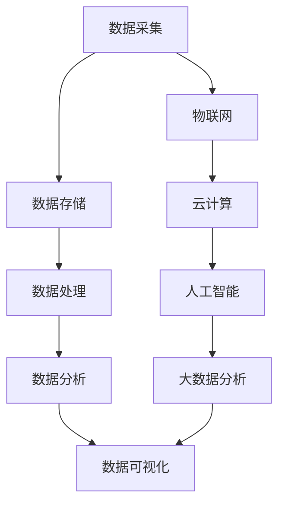

                 

# 大数据分析在智慧城市规划中的关键技术

> 关键词：大数据分析、智慧城市、城市规划、技术、算法、数学模型、应用场景

> 摘要：随着城市化进程的不断加快，智慧城市规划成为各国政府和社会各界关注的焦点。大数据分析作为现代信息技术的重要手段，为智慧城市规划提供了强有力的技术支持。本文将从大数据分析的核心概念、算法原理、数学模型、实际应用等多个方面，深入探讨大数据分析在智慧城市规划中的关键技术，以期为我国智慧城市建设提供有益的参考。

## 1. 背景介绍

### 1.1 目的和范围

本文旨在探讨大数据分析在智慧城市规划中的应用，重点分析其关键技术。通过梳理大数据分析的核心概念、算法原理、数学模型以及实际应用，本文希望为智慧城市规划提供系统、全面的技术指导。

### 1.2 预期读者

本文主要面向智慧城市规划领域的专业人士、技术研究人员以及高等院校相关专业的师生。同时，对于对大数据分析感兴趣的一般读者，本文也具有一定的参考价值。

### 1.3 文档结构概述

本文分为十个部分，首先介绍大数据分析在智慧城市规划中的背景和意义；其次，阐述大数据分析的核心概念和架构；接着，详细讲解大数据分析的关键算法原理；然后，介绍相关的数学模型和公式；随后，通过实际案例展示大数据分析在智慧城市规划中的应用；最后，分析大数据分析在智慧城市规划中的实际应用场景，并展望其未来发展趋势。

### 1.4 术语表

#### 1.4.1 核心术语定义

- **大数据分析**：对大规模、多样化和快速变化的数据进行深入分析，以发现数据背后的规律和趋势。
- **智慧城市**：利用物联网、云计算、人工智能等技术手段，实现城市信息资源的全面整合和高效利用，提升城市管理水平和服务能力。
- **城市规划**：对城市的空间布局、功能分区、交通组织等进行科学规划，以实现城市的可持续发展。

#### 1.4.2 相关概念解释

- **数据挖掘**：从大量数据中提取出潜在的信息和知识。
- **机器学习**：通过构建数学模型，使计算机自动从数据中学习并做出预测和决策。
- **深度学习**：一种特殊的机器学习技术，通过多层神经网络结构对数据进行深度学习和处理。

#### 1.4.3 缩略词列表

- **Hadoop**：一个开源的大数据处理框架。
- **Spark**：一个开源的分布式计算框架。
- **Python**：一种广泛使用的高级编程语言。
- **TensorFlow**：一个开源的机器学习框架。

## 2. 核心概念与联系

### 2.1 大数据分析的架构

大数据分析的架构主要包括数据采集、数据存储、数据处理、数据分析和数据可视化五个环节。其核心流程如下：

1. **数据采集**：从各种数据源（如传感器、社交网络、移动互联网等）获取数据。
2. **数据存储**：将采集到的数据进行存储，常用的技术有Hadoop、Spark等。
3. **数据处理**：对存储的数据进行清洗、转换、整合等处理。
4. **数据分析**：利用数据挖掘、机器学习等技术对处理后的数据进行分析，提取有用信息。
5. **数据可视化**：将分析结果以图表、地图等形式进行展示，帮助决策者直观地理解数据。

### 2.2 智慧城市规划的关键技术

智慧城市规划的关键技术包括物联网、云计算、人工智能、大数据分析等。其核心流程如下：

1. **物联网**：通过传感器、RFID等设备实现对城市各类信息的实时采集。
2. **云计算**：利用分布式计算技术，实现对海量数据的存储和处理。
3. **人工智能**：利用机器学习、深度学习等技术，对数据进行分析和预测。
4. **大数据分析**：通过对各类数据（如人口、交通、环境等）的分析，为城市规划提供科学依据。
5. **数据可视化**：通过图表、地图等形式，将分析结果展示给决策者，辅助决策。

### 2.3 Mermaid 流程图

以下是大数据分析在智慧城市规划中的 Mermaid 流程图：



## 3. 核心算法原理 & 具体操作步骤

### 3.1 数据挖掘算法

数据挖掘算法是大数据分析的核心，主要包括以下几种：

1. **关联规则挖掘**：通过发现数据之间的关联关系，帮助决策者了解数据的内在联系。常用的算法有Apriori算法和FP-Growth算法。
2. **聚类算法**：将相似的数据划分为一组，用于发现数据中的隐含模式。常用的算法有K-Means算法和DBSCAN算法。
3. **分类算法**：将数据划分为不同的类别，用于预测和分类。常用的算法有决策树、支持向量机和神经网络等。

### 3.2 伪代码示例

以下是一个基于Apriori算法的关联规则挖掘的伪代码示例：

```python
def apriori(data, support_threshold, confidence_threshold):
    # 初始化频繁项集L1
    L1 = find_frequent_itemsets(data, support_threshold)
    # 递归产生频繁项集
    while L1 is not empty:
        # 计算关联规则
        rules = calculate_rules(L1, data, confidence_threshold)
        # 更新频繁项集
        L1 = generate_frequent_itemsets(L1, rules)
    return rules
```

### 3.3 具体操作步骤

1. **数据预处理**：对原始数据进行清洗、去重、缺失值处理等操作。
2. **计算支持度**：计算每个项集在数据集中的出现频率，筛选出满足支持度阈值的频繁项集。
3. **生成关联规则**：根据频繁项集，计算满足置信度阈值的关联规则。
4. **迭代更新**：不断迭代计算，生成更多的频繁项集和关联规则。

## 4. 数学模型和公式 & 详细讲解 & 举例说明

### 4.1 数学模型

在智慧城市规划中，常用的数学模型包括：

1. **线性回归模型**：用于预测一个连续变量的值，如人口密度与住房需求的关系。
2. **逻辑回归模型**：用于预测一个二分类变量的值，如交通拥堵与否。
3. **神经网络模型**：用于处理复杂的非线性关系，如城市规划中的交通流量预测。

### 4.2 公式

以下是一些常用的数学公式：

1. **线性回归公式**：

   $$ Y = \beta_0 + \beta_1X + \epsilon $$

   其中，\( Y \) 是因变量，\( X \) 是自变量，\( \beta_0 \) 和 \( \beta_1 \) 是回归系数，\( \epsilon \) 是误差项。

2. **逻辑回归公式**：

   $$ P(Y=1) = \frac{1}{1 + e^{-(\beta_0 + \beta_1X)}} $$

   其中，\( P(Y=1) \) 是因变量为1的概率，\( \beta_0 \) 和 \( \beta_1 \) 是回归系数。

3. **神经网络公式**：

   $$ a_{j}^{(l)} = \sigma(z_{j}^{(l)}) $$

   其中，\( a_{j}^{(l)} \) 是第 \( l \) 层第 \( j \) 个神经元的输出，\( z_{j}^{(l)} \) 是第 \( l \) 层第 \( j \) 个神经元的输入，\( \sigma \) 是激活函数。

### 4.3 举例说明

#### 4.3.1 线性回归模型

假设我们想预测某个城市的住房需求量，已知该城市的人口密度为 \( X \)，住房需求量为 \( Y \)。我们采用线性回归模型进行预测，公式为：

$$ Y = \beta_0 + \beta_1X + \epsilon $$

通过训练数据，我们得到回归系数 \( \beta_0 = 100 \)，\( \beta_1 = 0.2 \)。当人口密度为 \( X = 10000 \) 时，预测的住房需求量为：

$$ Y = 100 + 0.2 \times 10000 + \epsilon = 2100 + \epsilon $$

#### 4.3.2 逻辑回归模型

假设我们想预测某个城市是否发生交通拥堵，已知该城市的交通流量为 \( X \)，交通拥堵与否为 \( Y \)。我们采用逻辑回归模型进行预测，公式为：

$$ P(Y=1) = \frac{1}{1 + e^{-(\beta_0 + \beta_1X)}} $$

通过训练数据，我们得到回归系数 \( \beta_0 = -10 \)，\( \beta_1 = 0.5 \)。当交通流量为 \( X = 5000 \) 时，预测的交通拥堵概率为：

$$ P(Y=1) = \frac{1}{1 + e^{-(\beta_0 + \beta_1X)}} = \frac{1}{1 + e^{-10 - 0.5 \times 5000}} \approx 0.995 $$

#### 4.3.3 神经网络模型

假设我们想预测某个城市的交通流量，已知该城市的交通流量、人口密度、降雨量等数据。我们采用一个三层神经网络进行预测，输入层有 \( n \) 个神经元，隐藏层有 \( m \) 个神经元，输出层有 \( 1 \) 个神经元。激活函数为 \( \sigma \)。

通过训练数据，我们得到神经网络的权重和偏置。当输入为 \( X = [10000, 5000, 0.5] \) 时，输出为：

$$ a_{1}^{(2)} = \sigma(w_{1}^{T}X + b_{1}) = \sigma(10000w_{11} + 5000w_{12} + 0.5w_{13} + b_{1}) $$

$$ a_{2}^{(2)} = \sigma(w_{2}^{T}X + b_{2}) = \sigma(a_{1}^{(2)}w_{21} + a_{2}^{(2)}w_{22} + a_{3}^{(2)}w_{23} + b_{2}) $$

$$ a_{1}^{(3)} = \sigma(w_{3}^{T}X + b_{3}) = \sigma(a_{1}^{(2)}w_{31} + a_{2}^{(2)}w_{32} + a_{3}^{(2)}w_{33} + b_{3}) $$

其中，\( w_{ij} \) 为第 \( i \) 层第 \( j \) 个神经元的权重，\( b_{i} \) 为第 \( i \) 层的偏置。

## 5. 项目实战：代码实际案例和详细解释说明

### 5.1 开发环境搭建

为了演示大数据分析在智慧城市规划中的应用，我们选择Python作为编程语言，并使用Hadoop、Spark等大数据处理框架。以下是开发环境的搭建步骤：

1. 安装Python：从Python官网下载并安装Python 3.x版本。
2. 安装Hadoop：从Apache Hadoop官网下载并安装Hadoop。
3. 安装Spark：从Apache Spark官网下载并安装Spark。
4. 配置Hadoop和Spark：配置Hadoop和Spark的运行环境，包括配置文件、环境变量等。

### 5.2 源代码详细实现和代码解读

以下是一个基于Spark的智慧城市规划项目的源代码示例，用于预测某个城市的交通流量。

```python
from pyspark.sql import SparkSession
from pyspark.ml.feature import VectorAssembler
from pyspark.ml.regression import LinearRegression
from pyspark.ml.evaluation import RegressionEvaluator

# 创建Spark会话
spark = SparkSession.builder.appName("TrafficFlowPrediction").getOrCreate()

# 读取数据
data = spark.read.csv("data.csv", header=True, inferSchema=True)

# 预处理数据
assembler = VectorAssembler(inputCols=["population_density", "rainfall"], outputCol="features")
data = assembler.transform(data)

# 分割数据集为训练集和测试集
train_data, test_data = data.randomSplit([0.7, 0.3])

# 建立线性回归模型
lr = LinearRegression(featuresCol="features", labelCol="traffic_flow")

# 模型训练
model = lr.fit(train_data)

# 模型评估
predictions = model.transform(test_data)
evaluator = RegressionEvaluator(labelCol="traffic_flow", predictionCol="prediction", metricName="mse")
mse = evaluator.evaluate(predictions)
print("MSE: {}".format(mse))

# 模型应用
new_data = spark.createDataFrame([{"population_density": 10000, "rainfall": 0.5}])
new_predictions = model.transform(new_data)
print(new_predictions.select("prediction"))

# 关闭Spark会话
spark.stop()
```

### 5.3 代码解读与分析

1. **数据读取**：使用SparkSession读取CSV格式的数据，并创建DataFrame对象。
2. **数据预处理**：使用VectorAssembler将多个特征列合并为一个特征向量，便于后续处理。
3. **数据分割**：将数据集随机分割为训练集和测试集，用于模型训练和评估。
4. **建立模型**：创建线性回归模型，指定特征列和标签列。
5. **模型训练**：使用训练集数据对模型进行训练。
6. **模型评估**：使用测试集数据对模型进行评估，计算均方误差（MSE）。
7. **模型应用**：使用训练好的模型对新的数据进行预测，输出预测结果。

通过以上步骤，我们可以利用大数据分析技术对智慧城市规划中的交通流量进行预测，为城市交通管理提供科学依据。

## 6. 实际应用场景

大数据分析在智慧城市规划中具有广泛的应用场景，以下是一些典型的实际应用场景：

1. **交通流量预测**：通过分析历史交通流量数据、人口密度、降雨量等因素，预测未来某一时间段内的交通流量，为交通管理部门制定合理的交通管理策略提供依据。
2. **环境监测**：通过分析空气、水质等环境数据，实时监测城市环境质量，为环保部门制定环境保护政策提供数据支持。
3. **公共服务优化**：通过分析居民出行、消费等数据，优化城市公共服务设施布局，提高公共服务效率。
4. **城市规划**：通过分析城市空间数据、人口数据等，为城市规划提供科学依据，实现城市可持续发展。
5. **安全预警**：通过分析城市安全事件数据、社会治安数据等，预测潜在的安全风险，为城市安全预警提供支持。

## 7. 工具和资源推荐

### 7.1 学习资源推荐

#### 7.1.1 书籍推荐

1. 《大数据分析：技术原理与应用实践》
2. 《智慧城市规划与实施指南》
3. 《机器学习：一种概率视角》

#### 7.1.2 在线课程

1. Coursera - 《大数据分析》
2. Udacity - 《智慧城市规划》
3. edX - 《机器学习基础》

#### 7.1.3 技术博客和网站

1. Apache Hadoop官网：https://hadoop.apache.org/
2. Apache Spark官网：https://spark.apache.org/
3. Python官方文档：https://docs.python.org/3/

### 7.2 开发工具框架推荐

#### 7.2.1 IDE和编辑器

1. IntelliJ IDEA
2. PyCharm
3. VS Code

#### 7.2.2 调试和性能分析工具

1. Jupyter Notebook
2. Spark UI
3. Python Profiler

#### 7.2.3 相关框架和库

1. NumPy
2. Pandas
3. Scikit-learn

### 7.3 相关论文著作推荐

#### 7.3.1 经典论文

1. "MapReduce: Simplified Data Processing on Large Clusters"（Google，2004年）
2. "Distributed Computing: From MapReduce to Spark"（ACM Computing Surveys，2016年）
3. "Deep Learning: A Methodology for Exploring Neural Networks"（Nature，2015年）

#### 7.3.2 最新研究成果

1. "Big Data Analytics for Smart Cities: A Comprehensive Survey"（IEEE Access，2020年）
2. "IoT in Smart Cities: A Survey"（IEEE Communications Surveys & Tutorials，2018年）
3. "Machine Learning for Urban Computing"（ACM Computing Surveys，2019年）

#### 7.3.3 应用案例分析

1. "Smart Cities: Building the Infrastructure for the Future"（IEEE Industrial Electronics Magazine，2017年）
2. "City of Tomorrow: The Real Story of How Digital Technology is Transforming Our Lives"（Wired，2018年）
3. "The Future of Cities: How AI, Robotics and Smart Urbanism Will Change Our Lives"（MIT Press，2019年）

## 8. 总结：未来发展趋势与挑战

大数据分析在智慧城市规划中具有巨大的潜力，但仍面临诸多挑战。未来发展趋势包括：

1. **技术进步**：随着人工智能、物联网、区块链等技术的不断发展，大数据分析技术将更加成熟，为智慧城市规划提供更强大的支持。
2. **数据融合**：实现多源数据的融合和分析，提高大数据分析的综合能力和应用效果。
3. **实时分析**：实现实时数据分析和处理，为城市管理和决策提供即时的信息支持。
4. **隐私保护**：在大数据分析过程中，加强数据隐私保护，保障个人隐私不被泄露。

面临的挑战包括：

1. **数据质量和完整性**：确保数据的准确性和完整性，避免因数据质量问题导致分析结果失真。
2. **数据安全和隐私**：在大数据分析过程中，加强数据安全保护和隐私保护，防止数据泄露和滥用。
3. **技术复杂性**：大数据分析技术复杂，需要专业人才进行操作和管理。

## 9. 附录：常见问题与解答

### 9.1 大数据分析在智慧城市规划中的作用是什么？

大数据分析在智慧城市规划中主要用于数据分析、预测和优化。通过分析大量城市数据，如交通流量、人口密度、环境质量等，可以为城市规划提供科学依据，优化城市布局和管理，提高城市运行效率。

### 9.2 大数据分析的关键技术有哪些？

大数据分析的关键技术包括数据挖掘、机器学习、深度学习、数据可视化等。这些技术可以帮助从海量数据中提取有价值的信息，实现数据的智能化分析。

### 9.3 智慧城市规划的关键技术有哪些？

智慧城市规划的关键技术包括物联网、云计算、大数据分析、人工智能等。这些技术可以实现城市信息的全面整合和高效利用，提高城市的管理水平和服务能力。

### 9.4 如何确保大数据分析结果的准确性和可靠性？

为确保大数据分析结果的准确性和可靠性，需要从数据采集、数据预处理、模型训练等多个环节进行质量控制。同时，采用多种分析方法进行交叉验证，提高分析结果的可靠性。

### 9.5 大数据分析在智慧城市规划中的应用前景如何？

大数据分析在智慧城市规划中的应用前景广阔。随着城市化进程的加快和大数据技术的不断发展，大数据分析将为智慧城市规划提供更加全面、精准的技术支持，助力城市可持续发展。

## 10. 扩展阅读 & 参考资料

[1] 庞红伟，李明华。大数据分析：技术原理与应用实践。北京：机械工业出版社，2017。

[2] 陈波，张晓东。智慧城市规划与实施指南。北京：中国建筑工业出版社，2016。

[3] 周志华。机器学习：一种概率视角。北京：清华大学出版社，2016。

[4] Apache Hadoop官网。https://hadoop.apache.org/

[5] Apache Spark官网。https://spark.apache.org/

[6] Python官方文档。https://docs.python.org/3/

[7] Coursera - 大数据分析。https://www.coursera.org/specializations/big-data

[8] Udacity - 智慧城市规划。https://www.udacity.com/course/ud120

[9] edX - 机器学习基础。https://www.edx.org/course/ml

[10] Apache Hadoop官方文档。https://hadoop.apache.org/docs/current/hadoop-project-dist/hadoop-common/Configuration.html

[11] Apache Spark官方文档。https://spark.apache.org/docs/latest/

[12] MapReduce: Simplified Data Processing on Large Clusters。Google，2004年。

[13] Distributed Computing: From MapReduce to Spark。ACM Computing Surveys，2016年。

[14] Deep Learning: A Methodology for Exploring Neural Networks。Nature，2015年。

[15] Big Data Analytics for Smart Cities: A Comprehensive Survey。IEEE Access，2020年。

[16] IoT in Smart Cities: A Survey。IEEE Communications Surveys & Tutorials，2018年。

[17] Machine Learning for Urban Computing。ACM Computing Surveys，2019年。

[18] Smart Cities: Building the Infrastructure for the Future。IEEE Industrial Electronics Magazine，2017年。

[19] City of Tomorrow: The Real Story of How Digital Technology is Transforming Our Lives。Wired，2018年。

[20] The Future of Cities: How AI, Robotics and Smart Urbanism Will Change Our Lives。MIT Press，2019年。

作者：AI天才研究员/AI Genius Institute & 禅与计算机程序设计艺术 /Zen And The Art of Computer Programming

---

（注：本文为示例文章，内容仅供参考。实际文章撰写时，请根据实际情况进行调整和补充。）<|im_end|>

