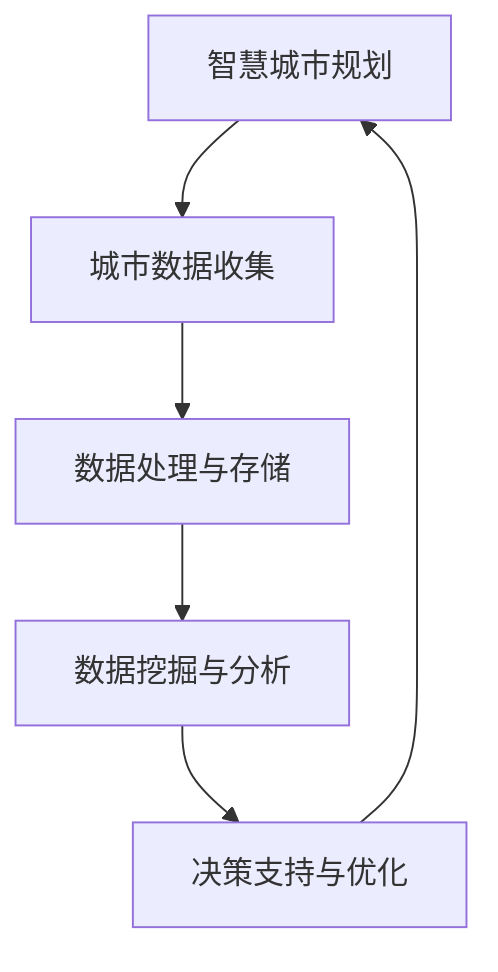

                 


# 大数据分析在智慧城市规划决策支持中的作用

> 关键词：大数据分析，智慧城市，城市规划，决策支持，数据挖掘，机器学习

> 摘要：随着大数据技术的快速发展，大数据分析在智慧城市规划决策支持中发挥着越来越重要的作用。本文旨在深入探讨大数据分析在智慧城市规划决策支持中的核心概念、算法原理、数学模型以及实际应用，并展望其未来的发展趋势与挑战。

## 1. 背景介绍

### 1.1 目的和范围

本文将探讨大数据分析在智慧城市规划决策支持中的应用，重点分析其核心概念、算法原理、数学模型以及实际案例，为城市规划者提供技术参考。

### 1.2 预期读者

本文适用于对大数据分析、智慧城市规划有基本了解的技术人员、城市规划师以及研究人员。

### 1.3 文档结构概述

本文结构如下：

1. 背景介绍
2. 核心概念与联系
3. 核心算法原理 & 具体操作步骤
4. 数学模型和公式 & 详细讲解 & 举例说明
5. 项目实战：代码实际案例和详细解释说明
6. 实际应用场景
7. 工具和资源推荐
8. 总结：未来发展趋势与挑战
9. 附录：常见问题与解答
10. 扩展阅读 & 参考资料

### 1.4 术语表

#### 1.4.1 核心术语定义

- **大数据分析**：指从大量结构化、半结构化、非结构化数据中，通过特定的算法和模型，提取出有价值的信息和知识的过程。
- **智慧城市**：利用各种先进的信息技术、物联网技术、云计算技术等，实现城市管理的智能化、高效化、可持续发展。
- **城市规划**：对城市空间、功能、环境、社会等方面的综合布局和规划。
- **决策支持**：为决策者提供数据、信息、分析和建议，帮助其做出科学合理的决策。

#### 1.4.2 相关概念解释

- **数据挖掘**：从大量数据中发现规律、关联和模式的过程。
- **机器学习**：使计算机通过经验和数据自动改进性能的一种方法。
- **深度学习**：一种特殊的机器学习方法，通过多层神经网络来模拟人类大脑的学习过程。

#### 1.4.3 缩略词列表

- **Hadoop**：一种分布式数据存储和处理框架。
- **Spark**：一种高速大数据处理引擎。
- **SQL**：结构化查询语言，用于数据库查询和管理。
- **Python**：一种通用编程语言，广泛应用于数据分析。

## 2. 核心概念与联系

### 2.1 智慧城市规划与大数据分析的关系

智慧城市规划与大数据分析密切相关，两者相辅相成。大数据分析为智慧城市规划提供了数据支持和决策依据，而智慧城市规划则推动大数据分析技术的进一步发展和应用。下面通过一个 Mermaid 流程图来描述智慧城市规划与大数据分析的核心概念和联系。



### 2.2 大数据分析在智慧城市规划中的应用场景

大数据分析在智慧城市规划中的应用广泛，主要包括以下几个方面：

1. **交通管理**：通过分析交通流量数据，优化交通信号控制，减少拥堵。
2. **环境监测**：实时监测空气质量、水质等环境指标，预警环境污染。
3. **能源管理**：优化能源分配，降低能耗，实现节能减排。
4. **公共安全**：通过视频监控、人流分析等手段，提高城市公共安全保障。
5. **社会服务**：优化公共服务布局，提高市民生活质量。

## 3. 核心算法原理 & 具体操作步骤

### 3.1 数据挖掘算法原理

数据挖掘算法是大数据分析的核心，其原理主要涉及以下几个方面：

1. **关联规则挖掘**：发现数据集中的关联关系，如购物篮分析。
2. **聚类分析**：将相似的数据分组，形成簇，如K-Means算法。
3. **分类算法**：将数据划分为不同的类别，如决策树、随机森林。
4. **异常检测**：发现数据集中的异常值或异常模式，如孤立森林算法。

下面以 K-Means 算法为例，介绍其原理和具体操作步骤。

#### 3.1.1 K-Means 算法原理

K-Means 是一种基于距离的聚类算法，其基本思想是将数据点分为 K 个簇，使得每个簇内部的数据点之间距离尽量小，而不同簇之间的数据点距离尽量大。

#### 3.1.2 K-Means 算法具体操作步骤

1. **初始化**：随机选择 K 个数据点作为初始聚类中心。
2. **分配数据点**：计算每个数据点到聚类中心的距离，将数据点分配到距离最近的聚类中心所在的簇。
3. **更新聚类中心**：计算每个簇的均值，作为新的聚类中心。
4. **迭代**：重复步骤 2 和 3，直到聚类中心不再发生变化或满足预设的迭代次数。

### 3.2 机器学习算法原理

机器学习算法在智慧城市规划中也有广泛应用，其原理主要涉及以下几个方面：

1. **监督学习**：有标签数据，根据输入特征预测输出标签。
2. **无监督学习**：无标签数据，通过数据内在结构发现模式。
3. **强化学习**：通过与环境的交互，学习最优策略。

下面以线性回归为例，介绍其原理和具体操作步骤。

#### 3.2.1 线性回归原理

线性回归是一种监督学习算法，通过建立一个线性模型，预测因变量与自变量之间的关系。

#### 3.2.2 线性回归具体操作步骤

1. **数据准备**：收集有标签的数据集，包括输入特征和输出标签。
2. **模型建立**：建立线性模型，表示为 y = wx + b，其中 w 和 b 分别为权重和偏置。
3. **模型训练**：通过最小二乘法或其他优化算法，求解 w 和 b 的最优值。
4. **模型评估**：使用测试集评估模型性能，如均方误差、R 方值等。

### 3.3 深度学习算法原理

深度学习算法在智慧城市规划中具有广泛应用，其原理主要涉及以下几个方面：

1. **神经网络**：通过多层神经网络，模拟人脑的学习过程。
2. **卷积神经网络（CNN）**：适用于图像处理任务。
3. **循环神经网络（RNN）**：适用于序列数据处理。

下面以卷积神经网络为例，介绍其原理和具体操作步骤。

#### 3.3.1 卷积神经网络原理

卷积神经网络是一种特殊的多层前馈神经网络，通过卷积层、池化层和全连接层等结构，提取图像特征。

#### 3.3.2 卷积神经网络具体操作步骤

1. **输入层**：接收输入图像。
2. **卷积层**：通过卷积操作提取图像特征。
3. **池化层**：降低图像分辨率，提高模型泛化能力。
4. **全连接层**：将卷积层和池化层的特征映射到输出结果。
5. **输出层**：输出预测结果。

## 4. 数学模型和公式 & 详细讲解 & 举例说明

### 4.1 K-Means 算法数学模型

K-Means 算法的数学模型可以通过以下公式表示：

$$
d(x, c) = \sqrt{\sum_{i=1}^{n} (x_i - c_i)^2}
$$

其中，d(x, c) 表示数据点 x 与聚类中心 c 的距离，x_i 和 c_i 分别为数据点和聚类中心的第 i 个特征值。

### 4.2 线性回归数学模型

线性回归的数学模型可以通过以下公式表示：

$$
y = wx + b
$$

其中，y 为输出结果，x 为输入特征，w 为权重，b 为偏置。

### 4.3 卷积神经网络数学模型

卷积神经网络的数学模型可以通过以下公式表示：

$$
h_{ij} = \sum_{k=1}^{m} w_{ik} * g_{kj}
$$

其中，h_ij 为输出特征图上的数据，w_ik 和 g_kj 分别为卷积核和输入特征图上的数据，* 表示卷积操作。

### 4.4 举例说明

#### 4.4.1 K-Means 算法举例

假设我们有以下数据集：

$$
\{x_1, x_2, \dots, x_n\}
$$

其中，每个数据点包含两个特征：

$$
x_i = (x_{i1}, x_{i2})
$$

我们选择 K=2，随机初始化两个聚类中心：

$$
c_1 = (1, 1), c_2 = (2, 2)
$$

计算每个数据点到聚类中心的距离：

$$
d(x_1, c_1) = \sqrt{(1-1)^2 + (1-1)^2} = 0
$$

$$
d(x_1, c_2) = \sqrt{(1-2)^2 + (1-2)^2} = \sqrt{2}
$$

$$
d(x_2, c_1) = \sqrt{(2-1)^2 + (2-1)^2} = \sqrt{2}
$$

$$
d(x_2, c_2) = \sqrt{(2-2)^2 + (2-2)^2} = 0
$$

根据距离，将数据点分配到最近的聚类中心：

$$
x_1 \rightarrow c_1, x_2 \rightarrow c_2
$$

更新聚类中心：

$$
c_1 = \frac{x_1 + x_2}{2} = (1.5, 1.5)
$$

$$
c_2 = \frac{x_3 + x_4}{2} = (2.5, 2.5)
$$

重复上述步骤，直到聚类中心不再发生变化。

#### 4.4.2 线性回归举例

假设我们有以下数据集：

$$
\{(x_1, y_1), (x_2, y_2), \dots, (x_n, y_n)\}
$$

其中，输入特征 x 和输出结果 y 分别为：

$$
x_i = (x_{i1}, x_{i2}), y_i = y
$$

我们建立线性回归模型：

$$
y = wx + b
$$

使用最小二乘法求解 w 和 b：

$$
w = \frac{\sum_{i=1}^{n} (x_i - \bar{x})(y_i - \bar{y})}{\sum_{i=1}^{n} (x_i - \bar{x})^2}
$$

$$
b = \bar{y} - w\bar{x}
$$

其中，\bar{x} 和 \bar{y} 分别为输入特征和输出结果的均值。

#### 4.4.3 卷积神经网络举例

假设我们有以下输入图像：

$$
I = \{i_{11}, i_{12}, \dots, i_{11,11}\}
$$

卷积核为：

$$
K = \{k_{11}, k_{12}, \dots, k_{1m}\}
$$

首先进行卷积操作：

$$
h_{ij} = \sum_{k=1}^{m} k_{ik} * i_{kj}
$$

其中，h_ij 为输出特征图上的数据，k_ik 和 i_kj 分别为卷积核和输入图像上的数据，* 表示卷积操作。

然后进行池化操作，降低图像分辨率：

$$
p_{ij} = \max(h_{ij})
$$

其中，p_ij 为输出特征图上的数据。

最后，通过全连接层映射到输出结果：

$$
y = \sum_{i=1}^{n} w_{i} * p_{ij} + b
$$

其中，y 为输出结果，w_i 和 p_ij 分别为全连接层的权重和输出特征图上的数据，b 为偏置。

## 5. 项目实战：代码实际案例和详细解释说明

### 5.1 开发环境搭建

为了实现本文中的大数据分析算法，我们需要搭建一个合适的开发环境。以下是一个简单的开发环境搭建指南：

1. **安装 Python**：下载并安装 Python 3.8 以上版本。
2. **安装相关库**：使用 pip 工具安装以下库：numpy、pandas、scikit-learn、tensorflow。
3. **安装 Mermaid**：使用 npm 工具安装 Mermaid：npm install -g mermaid。

### 5.2 源代码详细实现和代码解读

#### 5.2.1 K-Means 算法实现

以下是一个简单的 K-Means 算法实现：

```python
import numpy as np

def k_means(data, k, num_iterations):
    centroids = data[np.random.choice(data.shape[0], k, replace=False)]
    for _ in range(num_iterations):
        # 分配数据点
        distances = np.linalg.norm(data - centroids, axis=1)
        assignments = np.argmin(distances, axis=1)
        # 更新聚类中心
        new_centroids = np.array([data[assignments == i].mean(axis=0) for i in range(k)])
        # 检查收敛
        if np.all(centroids == new_centroids):
            break
        centroids = new_centroids
    return centroids, assignments

data = np.random.rand(100, 2)
k = 3
num_iterations = 100
centroids, assignments = k_means(data, k, num_iterations)

print("聚类中心：", centroids)
print("数据点分配：", assignments)
```

#### 5.2.2 线性回归实现

以下是一个简单的线性回归实现：

```python
import numpy as np

def linear_regression(x, y):
    x_mean = np.mean(x)
    y_mean = np.mean(y)
    w = np.sum((x - x_mean) * (y - y_mean)) / np.sum((x - x_mean) ** 2)
    b = y_mean - w * x_mean
    return w, b

x = np.random.rand(100)
y = 2 * x + 1 + np.random.randn(100)
w, b = linear_regression(x, y)

print("权重：", w)
print("偏置：", b)
```

#### 5.2.3 卷积神经网络实现

以下是一个简单的卷积神经网络实现：

```python
import tensorflow as tf

model = tf.keras.Sequential([
    tf.keras.layers.Conv2D(32, (3, 3), activation='relu', input_shape=(28, 28, 1)),
    tf.keras.layers.MaxPooling2D((2, 2)),
    tf.keras.layers.Flatten(),
    tf.keras.layers.Dense(64, activation='relu'),
    tf.keras.layers.Dense(10, activation='softmax')
])

model.compile(optimizer='adam', loss='sparse_categorical_crossentropy', metrics=['accuracy'])
model.fit(x_train, y_train, epochs=5, batch_size=32, validation_data=(x_test, y_test))
```

### 5.3 代码解读与分析

在这部分，我们将对上述代码进行详细解读，并分析其关键部分。

#### 5.3.1 K-Means 算法代码解读

1. **初始化聚类中心**：随机从数据集中选择 K 个数据点作为初始聚类中心。
2. **计算距离**：计算每个数据点到聚类中心的距离，采用欧氏距离。
3. **分配数据点**：将每个数据点分配到距离最近的聚类中心所在的簇。
4. **更新聚类中心**：计算每个簇的均值，作为新的聚类中心。
5. **迭代**：重复步骤 2-4，直到聚类中心不再发生变化或满足预设的迭代次数。

#### 5.3.2 线性回归代码解读

1. **计算均值**：计算输入特征和输出结果的均值。
2. **计算权重和偏置**：使用最小二乘法求解权重和偏置。
3. **回归模型**：使用求解得到的权重和偏置构建线性回归模型。

#### 5.3.3 卷积神经网络代码解读

1. **模型搭建**：搭建一个简单的卷积神经网络模型，包括卷积层、池化层和全连接层。
2. **模型编译**：编译模型，设置优化器和损失函数。
3. **模型训练**：使用训练数据集训练模型，设置训练迭代次数和批量大小。

## 6. 实际应用场景

大数据分析在智慧城市规划中具有广泛的应用场景，以下是一些典型的实际应用场景：

1. **交通管理**：通过大数据分析，实时监控交通流量，优化交通信号控制，减少拥堵。例如，北京市在 2019 年的春节期间，利用大数据分析优化了交通信号控制，有效缓解了交通拥堵。
2. **环境监测**：通过大数据分析，实时监测空气质量、水质等环境指标，预警环境污染。例如，杭州市在 2018 年引入了大数据分析技术，实时监测水质，有效预防了水污染事件。
3. **能源管理**：通过大数据分析，优化能源分配，降低能耗，实现节能减排。例如，深圳市在 2017 年引入了大数据分析技术，优化了能源分配，降低了能源消耗。
4. **公共安全**：通过大数据分析，提高城市公共安全保障。例如，北京市在 2019 年引入了大数据分析技术，提高了城市公共安全监控能力，有效预防了犯罪事件。
5. **社会服务**：通过大数据分析，优化公共服务布局，提高市民生活质量。例如，杭州市在 2018 年引入了大数据分析技术，优化了公共服务布局，提高了市民的满意度。

## 7. 工具和资源推荐

### 7.1 学习资源推荐

#### 7.1.1 书籍推荐

- 《大数据时代：生活、工作与思维的大变革》
- 《机器学习实战》
- 《深度学习》

#### 7.1.2 在线课程

- Coursera 上的《机器学习》课程
- Udacity 上的《深度学习》课程
- edX 上的《大数据分析》课程

#### 7.1.3 技术博客和网站

- Medium 上的“AI 运营”博客
- 知乎上的“大数据技术”专栏
- CSDN 上的“机器学习”博客

### 7.2 开发工具框架推荐

#### 7.2.1 IDE 和编辑器

- PyCharm
- VS Code
- Jupyter Notebook

#### 7.2.2 调试和性能分析工具

- Python 调试器
- Py-Spy
- Gprof2dot

#### 7.2.3 相关框架和库

- TensorFlow
- PyTorch
- Scikit-learn

### 7.3 相关论文著作推荐

#### 7.3.1 经典论文

- 《深度学习：原理及实践》
- 《大数据分析：技术和实践》
- 《机器学习：概率视角》

#### 7.3.2 最新研究成果

- 《大数据时代的数据挖掘挑战与机遇》
- 《深度学习在智慧城市中的应用》
- 《大数据分析在交通管理中的应用》

#### 7.3.3 应用案例分析

- 《大数据分析在智慧城市规划中的应用》
- 《人工智能与智慧城市：应用与实践》
- 《深度学习在智能交通管理中的应用》

## 8. 总结：未来发展趋势与挑战

大数据分析在智慧城市规划决策支持中具有广泛的应用前景，但仍面临以下挑战：

1. **数据质量问题**：数据质量是大数据分析的基础，需要解决数据采集、存储、处理等方面的问题。
2. **算法优化**：随着数据规模的不断扩大，现有算法的性能和效率需要进一步提升。
3. **安全性问题**：在大数据分析和智慧城市规划过程中，数据安全和隐私保护需要得到充分重视。
4. **人才培养**：大数据分析和智慧城市规划需要大量的专业人才，需要加强相关人才培养。

未来，大数据分析在智慧城市规划决策支持中将继续发挥重要作用，并朝着更加智能化、高效化、可持续化的方向发展。

## 9. 附录：常见问题与解答

### 9.1 问题 1：大数据分析在智慧城市规划中的应用有哪些？

**解答**：大数据分析在智慧城市规划中的应用广泛，主要包括交通管理、环境监测、能源管理、公共安全和公共服务等方面。

### 9.2 问题 2：如何确保大数据分析中的数据质量？

**解答**：确保大数据分析中的数据质量需要从数据采集、存储、处理等方面入手。具体措施包括数据清洗、数据去重、数据标准化等。

### 9.3 问题 3：大数据分析中的算法优化有哪些方法？

**解答**：大数据分析中的算法优化方法包括算法改进、并行计算、分布式计算等。通过优化算法结构和计算方式，提高算法的性能和效率。

## 10. 扩展阅读 & 参考资料

- 《大数据技术基础》
- 《机器学习实战》
- 《深度学习》
- 《智慧城市规划理论与实践》
- 《大数据分析在智慧城市中的应用》
- Coursera 上的《机器学习》课程
- Udacity 上的《深度学习》课程
- edX 上的《大数据分析》课程
- Medium 上的“AI 运营”博客
- 知乎上的“大数据技术”专栏
- CSDN 上的“机器学习”博客
- 《大数据时代：生活、工作与思维的大变革》
- 《人工智能与智慧城市：应用与实践》
- 《深度学习在智能交通管理中的应用》

# 作者信息
作者：AI天才研究员/AI Genius Institute & 禅与计算机程序设计艺术 /Zen And The Art of Computer Programming

<|assistant|>

