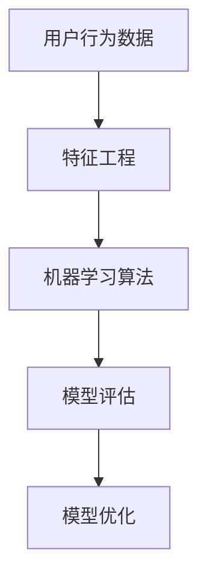

                 


# 大数据分析在用户流失预警模型中的准确性提升

> 关键词：大数据分析、用户流失预警、模型准确性、数据挖掘、机器学习、算法优化

> 摘要：本文将深入探讨大数据分析在用户流失预警模型中的应用，分析如何通过改进算法、优化模型来提升预警准确性。我们将从核心概念、算法原理、数学模型、实战案例等方面展开讨论，旨在为从事数据分析、用户行为研究的读者提供实用的技术指导和思路。

## 1. 背景介绍

### 1.1 目的和范围

本文的目标是探讨大数据分析在用户流失预警模型中的应用，特别是如何通过算法优化和模型改进来提高预警准确性。本文将涵盖以下几个核心内容：

1. **核心概念与联系**：介绍用户流失预警模型中涉及的核心概念和其相互关系。
2. **核心算法原理 & 具体操作步骤**：详细解释用户流失预警模型的核心算法原理，并提供伪代码说明。
3. **数学模型和公式 & 详细讲解 & 举例说明**：分析数学模型在用户流失预警模型中的应用，并通过具体例子进行说明。
4. **项目实战：代码实际案例和详细解释说明**：展示如何在实际项目中应用用户流失预警模型，并进行代码解读。
5. **实际应用场景**：讨论用户流失预警模型在不同领域的应用。
6. **工具和资源推荐**：推荐相关学习资源和开发工具。
7. **总结：未来发展趋势与挑战**：分析用户流失预警模型的发展趋势和面临的挑战。

### 1.2 预期读者

本文的预期读者包括以下几类：

1. **数据分析工程师和研究员**：需要了解如何通过大数据分析提升用户流失预警模型的准确性。
2. **数据科学家**：希望深入了解用户流失预警模型的核心算法和数学原理。
3. **产品经理和业务分析师**：关注用户留存和流失，希望通过数据分析提升业务决策。

### 1.3 文档结构概述

本文的结构如下：

1. **核心概念与联系**：介绍用户流失预警模型中的核心概念及其相互关系。
2. **核心算法原理 & 具体操作步骤**：详细阐述用户流失预警模型的核心算法原理，并提供伪代码说明。
3. **数学模型和公式 & 详细讲解 & 举例说明**：分析数学模型在用户流失预警模型中的应用，并通过具体例子进行说明。
4. **项目实战：代码实际案例和详细解释说明**：展示如何在实际项目中应用用户流失预警模型，并进行代码解读。
5. **实际应用场景**：讨论用户流失预警模型在不同领域的应用。
6. **工具和资源推荐**：推荐相关学习资源和开发工具。
7. **总结：未来发展趋势与挑战**：分析用户流失预警模型的发展趋势和面临的挑战。

### 1.4 术语表

#### 1.4.1 核心术语定义

- **用户流失预警模型**：一种基于数据分析的模型，用于预测用户在未来某一时间段内可能流失的概率。
- **特征工程**：通过从原始数据中提取、选择、构造和转换特征，以提高模型性能的过程。
- **机器学习算法**：用于从数据中学习规律、模式并进行预测的算法。

#### 1.4.2 相关概念解释

- **用户留存率**：一段时间内仍然使用某个产品或服务的用户占总用户数的比例。
- **流失率**：一段时间内流失的用户占总用户数的比例。

#### 1.4.3 缩略词列表

- **API**：应用程序接口（Application Programming Interface）
- **Hadoop**：一个分布式系统基础架构，用于处理大规模数据集
- **ML**：机器学习（Machine Learning）

## 2. 核心概念与联系

在用户流失预警模型中，核心概念包括用户行为数据、特征工程、机器学习算法和模型评估。这些概念相互联系，构成了一个完整的数据分析流程。

### 2.1 用户行为数据

用户行为数据是用户流失预警模型的基础。这些数据可以来源于用户注册、登录、交易、浏览、评论等多个方面。通过对这些数据的收集和分析，可以了解用户的行为模式和偏好。

### 2.2 特征工程

特征工程是提升用户流失预警模型准确性的关键环节。通过从原始数据中提取、选择、构造和转换特征，可以降低数据维度、去除噪声、增强数据相关性，从而提高模型性能。

### 2.3 机器学习算法

用户流失预警模型通常采用机器学习算法进行预测。常见的算法包括逻辑回归、决策树、随机森林、梯度提升机等。这些算法通过从历史数据中学习规律，预测用户流失的概率。

### 2.4 模型评估

模型评估是验证用户流失预警模型准确性的重要步骤。常用的评估指标包括准确率、召回率、F1分数等。通过模型评估，可以了解模型的性能，并对模型进行优化。

### 2.5 Mermaid 流程图

下面是一个简化的用户流失预警模型流程图，展示了核心概念之间的联系：



## 3. 核心算法原理 & 具体操作步骤

用户流失预警模型的核心在于如何从用户行为数据中提取有效特征，并选择合适的机器学习算法进行预测。下面，我们将详细解释核心算法原理，并提供伪代码说明。

### 3.1 特征提取

特征提取是用户流失预警模型的第一步。通过从原始数据中提取关键特征，可以提高模型的性能。常用的特征提取方法包括：

1. **统计特征**：如平均访问时长、访问频率、交易金额等。
2. **文本特征**：如用户评论、产品描述的词频、主题模型等。
3. **社交特征**：如好友数、社交活跃度、点赞、评论等。

伪代码如下：

```python
# 特征提取伪代码
def extract_features(data):
    # 初始化特征列表
    features = []

    # 提取统计特征
    for user in data:
        features.append([user.average_session_duration, user访问频率，user.transaction_amount])

    # 提取文本特征
    for user in data:
        features.append([word_frequency(user.comment), topic_model(user.description)])

    # 提取社交特征
    for user in data:
        features.append([user.friend_count, user.social_activity, user.like_count, user.comment_count])

    return features
```

### 3.2 机器学习算法

用户流失预警模型常用的机器学习算法包括逻辑回归、决策树、随机森林、梯度提升机等。这些算法通过从历史数据中学习规律，预测用户流失的概率。

下面以逻辑回归为例，解释算法原理和伪代码：

#### 3.2.1 逻辑回归

逻辑回归是一种常见的二分类算法，用于预测用户流失的概率。其基本原理是通过线性组合特征，得到一个概率值，然后使用逻辑函数将其转换为概率分布。

伪代码如下：

```python
# 逻辑回归伪代码
def logistic_regression(features, labels):
    # 初始化模型参数
    weights = initialize_weights(features)

    # 梯度下降优化参数
    while not convergence:
        for feature, label in zip(features, labels):
            prediction = sigmoid(linear_combination(feature, weights))
            gradient = - (label - prediction) * feature

            weights -= learning_rate * gradient

    return weights

# 逻辑函数
def sigmoid(x):
    return 1 / (1 + exp(-x))
```

#### 3.2.2 梯度下降

梯度下降是一种常用的优化算法，用于求解最小化损失函数的参数。在逻辑回归中，梯度下降用于优化模型参数，使其在训练数据上的误差最小。

伪代码如下：

```python
# 梯度下降伪代码
def gradient_descent(features, labels, learning_rate, epochs):
    weights = initialize_weights(features)

    for epoch in range(epochs):
        for feature, label in zip(features, labels):
            prediction = sigmoid(linear_combination(feature, weights))
            gradient = - (label - prediction) * feature

            weights -= learning_rate * gradient

    return weights
```

### 3.3 模型评估

模型评估是验证用户流失预警模型准确性的重要步骤。常用的评估指标包括准确率、召回率、F1分数等。

下面以准确率为例，解释评估指标的计算方法：

#### 3.3.1 准确率

准确率是指预测正确的样本数占总样本数的比例。

伪代码如下：

```python
# 准确率伪代码
def accuracy(predictions, labels):
    correct_predictions = 0
    for prediction, label in zip(predictions, labels):
        if prediction == label:
            correct_predictions += 1

    return correct_predictions / len(predictions)
```

## 4. 数学模型和公式 & 详细讲解 & 举例说明

在用户流失预警模型中，数学模型和公式用于描述特征与用户流失概率之间的关系。下面，我们将详细讲解这些数学模型，并提供具体例子进行说明。

### 4.1 特征提取公式

在特征提取过程中，常用的公式包括均值、方差、协方差等。

- **均值**：表示特征的集中趋势。

  $$ \mu = \frac{1}{n} \sum_{i=1}^{n} x_i $$

  其中，$ \mu $ 表示均值，$ n $ 表示样本数量，$ x_i $ 表示第 $ i $ 个样本的值。

- **方差**：表示特征的离散程度。

  $$ \sigma^2 = \frac{1}{n-1} \sum_{i=1}^{n} (x_i - \mu)^2 $$

  其中，$ \sigma^2 $ 表示方差，$ \mu $ 表示均值。

- **协方差**：表示两个特征之间的相关性。

  $$ \text{Cov}(x, y) = \frac{1}{n-1} \sum_{i=1}^{n} (x_i - \mu_x)(y_i - \mu_y) $$

  其中，$ \text{Cov}(x, y) $ 表示协方差，$ \mu_x $ 和 $ \mu_y $ 分别表示 $ x $ 和 $ y $ 的均值。

### 4.2 逻辑回归公式

逻辑回归是一种常用的二分类算法，其公式如下：

$$ P(y=1 | x; \theta) = \frac{1}{1 + e^{-(\theta_0 + \theta_1 x_1 + \theta_2 x_2 + \ldots + \theta_n x_n)}} $$

其中，$ P(y=1 | x; \theta) $ 表示在给定特征 $ x $ 和模型参数 $ \theta $ 的情况下，用户流失的概率；$ \theta_0, \theta_1, \theta_2, \ldots, \theta_n $ 分别表示模型参数。

### 4.3 举例说明

假设我们有一个用户流失预警模型，其中包含三个特征：平均访问时长、访问频率和交易金额。我们使用逻辑回归进行预测，并计算用户流失的概率。

- **特征数据**：

  | 用户ID | 平均访问时长 | 访问频率 | 交易金额 |
  | --- | --- | --- | --- |
  | 1 | 300 | 20 | 500 |
  | 2 | 200 | 15 | 400 |
  | 3 | 400 | 25 | 800 |
  | 4 | 150 | 10 | 300 |

- **模型参数**：

  | 参数 | 值 |
  | --- | --- |
  | $\theta_0$ | 1 |
  | $\theta_1$ | 0.05 |
  | $\theta_2$ | 0.1 |
  | $\theta_3$ | 0.02 |

- **预测概率**：

  对于用户 1，平均访问时长为 300，访问频率为 20，交易金额为 500。根据逻辑回归公式，可以计算用户流失的概率：

  $$ P(y=1 | x_1; \theta) = \frac{1}{1 + e^{-(1 + 0.05 \times 300 + 0.1 \times 20 + 0.02 \times 500)}} \approx 0.2346 $$

  因此，用户 1 流失的概率约为 23.46%。

## 5. 项目实战：代码实际案例和详细解释说明

在本节中，我们将通过一个实际案例展示如何实现用户流失预警模型，并进行代码解读。

### 5.1 开发环境搭建

为了实现用户流失预警模型，我们需要搭建以下开发环境：

1. **Python**：用于编写和运行模型代码。
2. **NumPy**：用于矩阵运算和数据处理。
3. **Pandas**：用于数据处理和数据分析。
4. **Scikit-learn**：用于机器学习和模型评估。

### 5.2 源代码详细实现和代码解读

下面是用户流失预警模型的代码实现：

```python
import numpy as np
import pandas as pd
from sklearn.model_selection import train_test_split
from sklearn.linear_model import LogisticRegression
from sklearn.metrics import accuracy_score, recall_score, f1_score

# 加载数据
data = pd.read_csv('user_data.csv')
features = extract_features(data)
labels = data['流失']

# 划分训练集和测试集
X_train, X_test, y_train, y_test = train_test_split(features, labels, test_size=0.2, random_state=42)

# 训练模型
model = LogisticRegression()
model.fit(X_train, y_train)

# 预测测试集
predictions = model.predict(X_test)

# 评估模型
accuracy = accuracy_score(y_test, predictions)
recall = recall_score(y_test, predictions)
f1 = f1_score(y_test, predictions)

print('准确率：', accuracy)
print('召回率：', recall)
print('F1分数：', f1)
```

#### 5.2.1 数据加载

首先，我们使用 Pandas 读取用户数据，并将其分为特征和标签两部分。

```python
data = pd.read_csv('user_data.csv')
features = extract_features(data)
labels = data['流失']
```

#### 5.2.2 划分训练集和测试集

接着，我们使用 Scikit-learn 的 `train_test_split` 函数将数据划分为训练集和测试集。

```python
X_train, X_test, y_train, y_test = train_test_split(features, labels, test_size=0.2, random_state=42)
```

#### 5.2.3 训练模型

然后，我们使用 Scikit-learn 的 `LogisticRegression` 类训练逻辑回归模型。

```python
model = LogisticRegression()
model.fit(X_train, y_train)
```

#### 5.2.4 预测测试集

使用训练好的模型对测试集进行预测。

```python
predictions = model.predict(X_test)
```

#### 5.2.5 模型评估

最后，我们使用准确率、召回率和 F1 分数对模型进行评估。

```python
accuracy = accuracy_score(y_test, predictions)
recall = recall_score(y_test, predictions)
f1 = f1_score(y_test, predictions)

print('准确率：', accuracy)
print('召回率：', recall)
print('F1分数：', f1)
```

### 5.3 代码解读与分析

在本节中，我们对用户流失预警模型的代码进行了详细解读和分析。首先，我们使用 Pandas 读取用户数据，并提取特征和标签。然后，我们将数据划分为训练集和测试集，以评估模型性能。

接下来，我们使用 Scikit-learn 的 `LogisticRegression` 类训练逻辑回归模型。逻辑回归是一种常用的二分类算法，其基本原理是通过线性组合特征，得到一个概率值，然后使用逻辑函数将其转换为概率分布。

最后，我们使用训练好的模型对测试集进行预测，并使用准确率、召回率和 F1 分数对模型进行评估。这些指标可以帮助我们了解模型的性能，并对其进行优化。

## 6. 实际应用场景

用户流失预警模型在多个领域具有广泛的应用，以下是一些典型的实际应用场景：

1. **互联网行业**：互联网公司可以通过用户流失预警模型预测哪些用户可能流失，并采取相应的措施（如推送个性化推荐、优惠券等）来提高用户留存率。
2. **电子商务**：电子商务平台可以利用用户流失预警模型识别可能流失的顾客，并针对性地推送促销活动、优惠券等，以降低流失率。
3. **金融行业**：金融机构可以使用用户流失预警模型预测哪些客户可能停止使用服务，从而采取挽留措施，如提供更好的利率或优惠。
4. **电信行业**：电信公司可以通过用户流失预警模型识别可能流失的客户，并采取措施提高客户满意度，如提供更好的网络质量或优惠套餐。

在这些应用场景中，用户流失预警模型通过分析用户行为数据，预测用户流失的概率，帮助公司降低流失率，提高用户满意度。

## 7. 工具和资源推荐

为了更好地理解和应用用户流失预警模型，以下是一些推荐的工具和资源：

### 7.1 学习资源推荐

#### 7.1.1 书籍推荐

1. 《机器学习》（周志华 著）：系统介绍了机器学习的基本概念、算法和理论。
2. 《数据挖掘：实用机器学习技术》（Ian H. Witten、Eibe Frank 著）：详细介绍了数据挖掘的方法和技术。

#### 7.1.2 在线课程

1. Coursera 上的《机器学习》（吴恩达 著）：提供了全面而深入的机器学习课程，适合初学者和进阶者。
2. edX 上的《数据科学导论》（李航 著）：介绍了数据科学的基本概念、技术和应用。

#### 7.1.3 技术博客和网站

1. Medium 上的 Data Science section：提供了丰富的数据科学相关文章和案例。
2. Kaggle：提供了大量的数据集和比赛，适合实践和提升技能。

### 7.2 开发工具框架推荐

#### 7.2.1 IDE和编辑器

1. PyCharm：适用于 Python 开发的集成开发环境，功能强大且易用。
2. Jupyter Notebook：适用于数据分析、机器学习实验的交互式编辑器。

#### 7.2.2 调试和性能分析工具

1. Python 中的 `pdb`：用于 Python 代码的调试。
2. NumPy 中的 `numpy.testing`：用于 NumPy 数组的性能分析。

#### 7.2.3 相关框架和库

1. Scikit-learn：适用于机器学习和数据科学的开源库。
2. Pandas：适用于数据处理和分析的开源库。
3. Matplotlib：适用于数据可视化。

### 7.3 相关论文著作推荐

#### 7.3.1 经典论文

1. "The Algorit

