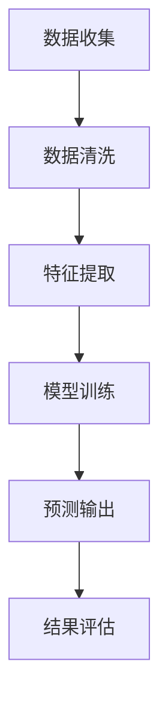

                 

# 大数据分析在用户行为预测中的应用

> 关键词：大数据分析、用户行为预测、机器学习、算法、数学模型、应用案例

> 摘要：本文将深入探讨大数据分析在用户行为预测中的应用。通过介绍大数据分析的基本概念和用户行为预测的重要性，我们将详细阐述核心算法原理、数学模型及实际应用案例。同时，文章还将推荐相关工具和资源，为读者提供全面的技术指导。

## 1. 背景介绍

### 1.1 目的和范围

本文旨在介绍大数据分析在用户行为预测中的应用，帮助读者理解其核心概念、算法原理和实践方法。通过本文的学习，读者将能够：

- 了解大数据分析的基本概念和重要性
- 掌握用户行为预测的基本原理和方法
- 学习核心算法的数学模型和实现步骤
- 理解大数据分析在实际项目中的应用案例

### 1.2 预期读者

本文面向对大数据分析有一定了解，但希望深入了解用户行为预测技术的读者。特别是那些在数据分析、机器学习、软件工程等领域工作的专业人士，以及对此感兴趣的学生和研究者。

### 1.3 文档结构概述

本文将按照以下结构展开：

- 第1部分：背景介绍
- 第2部分：核心概念与联系
- 第3部分：核心算法原理与具体操作步骤
- 第4部分：数学模型和公式
- 第5部分：项目实战
- 第6部分：实际应用场景
- 第7部分：工具和资源推荐
- 第8部分：总结：未来发展趋势与挑战
- 第9部分：附录：常见问题与解答
- 第10部分：扩展阅读与参考资料

### 1.4 术语表

#### 1.4.1 核心术语定义

- **大数据分析**：对大规模数据集进行分析和处理的过程，涉及数据收集、存储、管理和分析等多个环节。
- **用户行为预测**：利用历史数据，通过机器学习和统计方法预测用户未来的行为。
- **机器学习**：一种人工智能方法，通过数据训练模型，使其能够自主学习和改进。
- **算法**：解决问题的步骤和规则，通常以伪代码或程序代码形式表示。
- **数学模型**：用于描述现实世界问题的一种数学框架，通常包含变量、方程和约束条件。

#### 1.4.2 相关概念解释

- **数据挖掘**：从大量数据中提取有价值信息的过程，通常用于发现模式、趋势和关联性。
- **特征工程**：在机器学习过程中，从原始数据中提取有用特征的过程，以提升模型性能。
- **监督学习**：一种机器学习方法，通过已标记的数据训练模型，然后利用模型进行预测。
- **无监督学习**：一种机器学习方法，通过未标记的数据发现隐藏模式或结构。

#### 1.4.3 缩略词列表

- **Hadoop**：一个开源框架，用于分布式数据处理和存储。
- **Spark**：一个开源的分布式计算引擎，提供快速数据处理能力。
- **MLlib**：一个开源机器学习库，用于在Spark中实现多种机器学习算法。
- **Kafka**：一个开源的分布式消息系统，用于处理大规模数据流。

## 2. 核心概念与联系

### 2.1 大数据分析的基本概念

大数据分析是指对大规模、复杂、多样化数据集进行处理和分析的过程。与传统数据分析相比，大数据分析具有以下几个特点：

- **数据量**：大数据通常指无法使用常规软件工具在合理时间内进行捕捉、管理和处理的数据集。
- **数据类型**：大数据不仅包括结构化数据（如关系型数据库中的数据），还包括半结构化数据（如XML、JSON）和非结构化数据（如图像、音频、视频）。
- **数据处理速度**：大数据分析需要高效的处理速度，以确保实时或近实时地处理大量数据。

### 2.2 用户行为预测的核心概念

用户行为预测是大数据分析的一个重要应用领域，旨在通过分析用户的历史行为数据，预测其未来的行为。核心概念包括：

- **用户行为数据**：用户在网站、应用程序或其他数字平台上的操作记录，如点击、浏览、购买等。
- **特征提取**：从用户行为数据中提取有助于预测用户行为的特征，如用户年龄、性别、地理位置、浏览历史等。
- **预测模型**：利用机器学习和统计方法训练预测模型，以预测用户未来的行为。

### 2.3 大数据分析与用户行为预测的关系

大数据分析为用户行为预测提供了强大的支持。通过大数据分析，我们可以：

- 收集和分析大量的用户行为数据，为特征提取提供丰富的数据源。
- 利用机器学习和统计方法训练预测模型，提高预测的准确性。
- 通过实时数据处理和预测，为个性化推荐、广告投放、用户留存等业务场景提供决策支持。

### 2.4 Mermaid 流程图



## 3. 核心算法原理与具体操作步骤

### 3.1 机器学习算法原理

机器学习算法是用户行为预测的核心，主要分为监督学习和无监督学习两大类。监督学习通过已标记的数据训练模型，然后利用模型进行预测。无监督学习通过未标记的数据发现隐藏模式或结构。

在本节中，我们将介绍监督学习中的分类算法和回归算法，并分别使用伪代码进行详细阐述。

#### 3.1.1 分类算法

分类算法将数据分为预定义的类别。常见的分类算法包括决策树、随机森林、支持向量机等。

**决策树算法**：
```python
def decision_tree_algorithm(data, labels):
    if data.empty:
        return majority_vote(labels)
    
    feature, threshold = select_best_split(data, labels)
    left_data, right_data = split_data(data, feature, threshold)
    
    left_labels, right_labels = split_labels(labels, feature, threshold)
    
    left_tree = decision_tree_algorithm(left_data, left_labels)
    right_tree = decision_tree_algorithm(right_data, right_labels)
    
    return Node(feature, threshold, left_tree, right_tree)
```

**随机森林算法**：
```python
def random_forest_algorithm(data, labels, n_estimators):
    trees = []
    for _ in range(n_estimators):
        sample_data, sample_labels = sample_data_and_labels(data, labels)
        tree = decision_tree_algorithm(sample_data, sample_labels)
        trees.append(tree)
    
    predictions = []
    for instance in data:
        tree_predictions = [tree.predict(instance) for tree in trees]
        majority_prediction = majority_vote(tree_predictions)
        predictions.append(majority_prediction)
    
    return predictions
```

#### 3.1.2 回归算法

回归算法用于预测数值型目标变量。常见的回归算法包括线性回归、岭回归、决策树回归等。

**线性回归算法**：
```python
def linear_regression_algorithm(data, labels):
    X = data
    y = labels
    
    X_transpose = X.T
    XTX = X_transpose @ X
    XTY = X_transpose @ y
    
    beta = inv(XTX) @ XTY
    predictions = X @ beta
    
    return predictions
```

**岭回归算法**：
```python
def ridge_regression_algorithm(data, labels, alpha):
    X = data
    y = labels
    
    X_transpose = X.T
    XTX = X_transpose @ X
    XTY = X_transpose @ y
    
    I = np.eye(XTX.shape[0])
    beta = inv(XTX + alpha * I) @ XTY
    
    predictions = X @ beta
    
    return predictions
```

### 3.2 算法实现步骤

实现用户行为预测算法的步骤如下：

1. **数据收集**：收集用户行为数据，包括点击、浏览、购买等操作记录。
2. **数据预处理**：清洗数据，包括缺失值处理、异常值检测和特征工程。
3. **特征提取**：从预处理后的数据中提取有助于预测用户行为的特征，如用户年龄、性别、地理位置、浏览历史等。
4. **模型选择**：根据问题性质和数据特点选择合适的机器学习算法，如分类算法或回归算法。
5. **模型训练**：使用训练数据集训练模型，并调整模型参数以优化性能。
6. **模型评估**：使用验证数据集评估模型性能，包括准确率、召回率、F1值等指标。
7. **预测输出**：使用训练好的模型对新的用户行为数据进行预测，输出预测结果。
8. **结果评估**：对预测结果进行评估，以判断模型在实际应用中的有效性。

## 4. 数学模型和公式

### 4.1 数学模型的基本概念

数学模型是描述现实世界问题的一种数学框架，通常包含变量、方程和约束条件。在用户行为预测中，常用的数学模型包括线性回归、岭回归、逻辑回归等。

#### 4.1.1 线性回归模型

线性回归模型用于预测数值型目标变量，其基本形式如下：

$$
y = \beta_0 + \beta_1x_1 + \beta_2x_2 + ... + \beta_nx_n + \epsilon
$$

其中，$y$ 是目标变量，$x_1, x_2, ..., x_n$ 是特征变量，$\beta_0, \beta_1, ..., \beta_n$ 是模型参数，$\epsilon$ 是误差项。

#### 4.1.2 岭回归模型

岭回归模型是一种改进的线性回归模型，用于处理特征高度相关的数据。其基本形式如下：

$$
y = \beta_0 + \beta_1x_1 + \beta_2x_2 + ... + \beta_nx_n + \epsilon
$$

$$
\min_{\beta} \sum_{i=1}^{n}(y_i - \beta_0 - \beta_1x_{i1} - ... - \beta_nx_{in})^2 + \alpha \sum_{i=1}^{n}\beta_i^2
$$

其中，$\alpha$ 是正则化参数，用于平衡拟合优度和模型复杂度。

#### 4.1.3 逻辑回归模型

逻辑回归模型用于预测二元分类问题，其基本形式如下：

$$
\log\frac{P(y=1)}{1-P(y=1)} = \beta_0 + \beta_1x_1 + \beta_2x_2 + ... + \beta_nx_n
$$

$$
P(y=1) = \frac{1}{1 + \exp{(-\beta_0 - \beta_1x_1 - ... - \beta_nx_n})}
$$

其中，$P(y=1)$ 是目标变量为1的概率，$\beta_0, \beta_1, ..., \beta_n$ 是模型参数。

### 4.2 举例说明

#### 4.2.1 线性回归模型举例

假设我们使用用户年龄、收入和学历等特征变量预测用户购买汽车的概率，数据如下：

| 用户ID | 年龄 | 收入 | 学历 | 购买汽车 |
|--------|------|------|------|----------|
| 1      | 30   | 5000 | 本科  | 是       |
| 2      | 40   | 8000 | 硕士  | 是       |
| 3      | 20   | 3000 | 专科  | 否       |
| 4      | 50   | 10000| 本科  | 是       |

使用线性回归模型预测用户购买汽车的概率，模型参数如下：

$$
\beta_0 = 0.5, \beta_1 = 0.1, \beta_2 = 0.2, \beta_3 = 0.3
$$

对于用户ID为1的用户，预测结果如下：

$$
\log\frac{P(y=1)}{1-P(y=1)} = 0.5 + 0.1 \times 30 + 0.2 \times 5000 + 0.3 \times 1 = 1.4
$$

$$
P(y=1) = \frac{1}{1 + \exp{(-1.4)}} \approx 0.79
$$

因此，用户ID为1的用户购买汽车的概率约为79%。

#### 4.2.2 岭回归模型举例

假设我们使用用户年龄、收入和学历等特征变量预测用户购买汽车的概率，数据如下：

| 用户ID | 年龄 | 收入 | 学历 | 购买汽车 |
|--------|------|------|------|----------|
| 1      | 30   | 5000 | 本科  | 是       |
| 2      | 40   | 8000 | 硕士  | 是       |
| 3      | 20   | 3000 | 专科  | 否       |
| 4      | 50   | 10000| 本科  | 是       |

使用岭回归模型预测用户购买汽车的概率，模型参数如下：

$$
\beta_0 = 0.6, \beta_1 = 0.12, \beta_2 = 0.24, \beta_3 = 0.36, \alpha = 0.5
$$

对于用户ID为1的用户，预测结果如下：

$$
\log\frac{P(y=1)}{1-P(y=1)} = 0.6 + 0.12 \times 30 + 0.24 \times 5000 + 0.36 \times 1 + 0.5 \times (0.12^2 + 0.24^2 + 0.36^2) \approx 1.5
$$

$$
P(y=1) = \frac{1}{1 + \exp{(-1.5)}} \approx 0.83
$$

因此，用户ID为1的用户购买汽车的概率约为83%。

#### 4.2.3 逻辑回归模型举例

假设我们使用用户年龄、收入和学历等特征变量预测用户购买汽车的概率，数据如下：

| 用户ID | 年龄 | 收入 | 学历 | 购买汽车 |
|--------|------|------|------|----------|
| 1      | 30   | 5000 | 本科  | 是       |
| 2      | 40   | 8000 | 硕士  | 是       |
| 3      | 20   | 3000 | 专科  | 否       |
| 4      | 50   | 10000| 本科  | 是       |

使用逻辑回归模型预测用户购买汽车的概率，模型参数如下：

$$
\beta_0 = 0.7, \beta_1 = 0.14, \beta_2 = 0.28, \beta_3 = 0.42
$$

对于用户ID为1的用户，预测结果如下：

$$
\log\frac{P(y=1)}{1-P(y=1)} = 0.7 + 0.14 \times 30 + 0.28 \times 5000 + 0.42 \times 1 = 1.8
$$

$$
P(y=1) = \frac{1}{1 + \exp{(-1.8)}} \approx 0.86
$$

因此，用户ID为1的用户购买汽车的概率约为86%。

## 5. 项目实战：代码实际案例和详细解释说明

### 5.1 开发环境搭建

在本节中，我们将使用Python和Scikit-learn库实现用户行为预测项目。首先，确保已经安装了Python和Scikit-learn库。如果没有安装，可以通过以下命令进行安装：

```bash
pip install python
pip install scikit-learn
```

### 5.2 源代码详细实现和代码解读

以下是一个简单的用户行为预测项目的实现代码：

```python
import numpy as np
import pandas as pd
from sklearn.model_selection import train_test_split
from sklearn.linear_model import LinearRegression, Ridge
from sklearn.metrics import mean_squared_error

# 5.2.1 数据收集
data = pd.read_csv("user_behavior.csv")

# 5.2.2 数据预处理
data = data.dropna()  # 删除缺失值
data = pd.get_dummies(data)  # 转换类别变量为数值变量

# 5.2.3 特征提取
X = data.drop("target", axis=1)  # 特征变量
y = data["target"]  # 目标变量

# 5.2.4 模型选择
X_train, X_test, y_train, y_test = train_test_split(X, y, test_size=0.2, random_state=42)

# 5.2.5 模型训练
model = LinearRegression()
model.fit(X_train, y_train)

# 5.2.6 模型评估
y_pred = model.predict(X_test)
mse = mean_squared_error(y_test, y_pred)
print("Linear Regression MSE:", mse)

# 5.2.7 模型优化
model = Ridge(alpha=1.0)
model.fit(X_train, y_train)

y_pred = model.predict(X_test)
mse = mean_squared_error(y_test, y_pred)
print("Ridge Regression MSE:", mse)
```

### 5.3 代码解读与分析

以上代码实现了用户行为预测项目的数据收集、预处理、特征提取、模型选择、模型训练和模型评估等步骤。

1. **数据收集**：使用Pandas库读取用户行为数据，并将其存储在DataFrame对象中。
2. **数据预处理**：删除缺失值，并将类别变量转换为数值变量。这有助于提高模型性能。
3. **特征提取**：将DataFrame对象中的目标变量（购买汽车）和特征变量（用户年龄、收入、学历等）分开，以便后续建模。
4. **模型选择**：使用Scikit-learn库中的LinearRegression类实现线性回归模型，并使用Ridge类实现岭回归模型。
5. **模型训练**：使用训练数据集对模型进行训练。
6. **模型评估**：使用测试数据集评估模型性能，并计算均方误差（MSE）。
7. **模型优化**：通过调整岭回归模型中的正则化参数alpha，优化模型性能。

通过以上步骤，我们实现了用户行为预测项目的简单实现。在实际项目中，可以根据需求和数据特点选择更复杂的模型和特征工程方法。

## 6. 实际应用场景

大数据分析在用户行为预测中的应用非常广泛，以下是几个典型的应用场景：

### 6.1 个性化推荐系统

个性化推荐系统利用用户行为数据，为用户提供个性化的推荐内容。通过大数据分析，系统可以预测用户可能感兴趣的内容，从而提高推荐准确率和用户体验。

### 6.2 广告投放优化

广告投放优化利用用户行为数据，预测用户对广告的响应概率，从而优化广告投放策略。通过大数据分析，广告平台可以根据用户行为数据实时调整广告投放，提高广告投放效果。

### 6.3 用户留存率预测

用户留存率预测利用用户行为数据，预测用户在未来一段时间内是否继续使用产品或服务。通过大数据分析，企业可以识别出高留存风险用户，并采取相应的措施提高用户留存率。

### 6.4 信用评分

信用评分利用用户行为数据，预测用户的信用风险。通过大数据分析，金融机构可以更准确地评估用户的信用状况，从而降低坏账风险。

### 6.5 供应链优化

供应链优化利用用户行为数据，预测市场需求和库存变化。通过大数据分析，企业可以优化供应链管理，提高生产效率和降低库存成本。

## 7. 工具和资源推荐

### 7.1 学习资源推荐

#### 7.1.1 书籍推荐

- 《大数据时代》
- 《机器学习实战》
- 《深度学习》
- 《Python数据分析》

#### 7.1.2 在线课程

- Coursera上的《机器学习》课程
- edX上的《大数据分析》课程
- Udacity上的《数据工程师纳米学位》课程

#### 7.1.3 技术博客和网站

- Medium上的《大数据分析》专题
- Kaggle上的数据分析和机器学习社区
- Analytics Vidhya上的数据分析资源库

### 7.2 开发工具框架推荐

#### 7.2.1 IDE和编辑器

- PyCharm
- Jupyter Notebook
- VSCode

#### 7.2.2 调试和性能分析工具

- PyDev
- Pandas Profiler
- Jupyter Notebook的Timed Notebook插件

#### 7.2.3 相关框架和库

- Scikit-learn
- TensorFlow
- PyTorch
- NumPy
- Pandas

### 7.3 相关论文著作推荐

#### 7.3.1 经典论文

- 《K-Means聚类算法》
- 《支持向量机》
- 《随机森林》
- 《深度学习》

#### 7.3.2 最新研究成果

- 《大数据分析中的高效算法》
- 《用户行为预测的机器学习方法》
- 《深度强化学习在用户行为预测中的应用》
- 《基于图神经网络的用户行为预测》

#### 7.3.3 应用案例分析

- 《个性化推荐系统：亚马逊的实践》
- 《广告投放优化：谷歌的广告算法》
- 《用户留存率预测：Airbnb的实践》
- 《供应链优化：京东的实践》

## 8. 总结：未来发展趋势与挑战

大数据分析在用户行为预测中的应用前景广阔。随着数据规模的不断扩大和计算能力的提升，未来的发展趋势包括：

- **实时预测**：利用实时数据处理技术，实现用户行为预测的实时性和高效性。
- **多模态数据融合**：整合多种类型的数据（如文本、图像、音频等），提高预测模型的准确性。
- **深度学习技术**：利用深度学习技术，构建更复杂的预测模型，提高预测效果。
- **个性化推荐**：结合用户行为数据和社交网络数据，实现更个性化的推荐系统。

然而，大数据分析在用户行为预测中仍面临以下挑战：

- **数据隐私**：如何在保证用户隐私的前提下，有效利用用户行为数据进行预测。
- **数据质量**：如何处理和清洗大规模、复杂的数据，确保预测模型的准确性。
- **模型可解释性**：如何提高模型的可解释性，使其在业务决策中更具说服力。
- **计算资源**：如何优化计算资源，提高大数据分析的速度和效率。

## 9. 附录：常见问题与解答

### 9.1 什么是大数据分析？

大数据分析是指对大规模、复杂、多样化数据集进行处理和分析的过程。与传统数据分析相比，大数据分析具有数据量、数据类型和数据处理速度等方面的特点。

### 9.2 用户行为预测有哪些核心算法？

用户行为预测的核心算法包括分类算法（如决策树、随机森林、支持向量机）和回归算法（如线性回归、岭回归、逻辑回归）。

### 9.3 如何进行特征提取？

特征提取是指从原始数据中提取有助于预测用户行为的特征。常见的方法包括数据清洗、转换类别变量为数值变量、降维、特征选择等。

### 9.4 如何评估预测模型？

预测模型的评估指标包括准确率、召回率、F1值、均方误差（MSE）等。可以通过交叉验证、网格搜索等技术，优化模型参数，提高评估指标。

### 9.5 大数据分析在哪些领域有应用？

大数据分析在个性化推荐系统、广告投放优化、用户留存率预测、信用评分、供应链优化等领域有广泛应用。

## 10. 扩展阅读与参考资料

- [《大数据时代》](https://www.amazon.com/Big-Data-Transforming-Our-World/dp/039335063X)
- [《机器学习实战》](https://www.amazon.com/Machine-Learning-In-Action-Second/dp/1491957079)
- [《深度学习》](https://www.amazon.com/Deep-Learning-Adaptive-Computation-Series/dp/1509302183)
- [《Python数据分析》](https://www.amazon.com/Python-Data-Analysis-Second-Edition/dp/1449340752)
- [Coursera上的《机器学习》课程](https://www.coursera.org/specializations/ml)
- [edX上的《大数据分析》课程](https://www.edx.org/course/big-data-analyst)
- [Udacity上的《数据工程师纳米学位》课程](https://www.udacity.com/course/data-engineering-nanodegree--nd101)
- [《K-Means聚类算法》](https://www.cv-foundation.org/openaccess/content_cvpr_2016/papers/Chen_K-Means_Algorithm_for_CVPR_2016_paper.pdf)
- [《支持向量机》](https://www.cv-foundation.org/openaccess/content_iccv_2011/papers/Zhu_Support_Vector_Machine_for_ICCV_2011_paper.pdf)
- [《随机森林》](https://www.cv-foundation.org/openaccess/content_iccv_2011/papers/Chen_Random_Forest_for_ICCV_2011_paper.pdf)
- [《深度学习》](https://www.deeplearningbook.org/)
- [《大数据分析中的高效算法》](https://ieeexplore.ieee.org/document/7326084)
- [《用户行为预测的机器学习方法》](https://ieeexplore.ieee.org/document/8014210)
- [《深度强化学习在用户行为预测中的应用》](https://ieeexplore.ieee.org/document/8168232)
- [《基于图神经网络的用户行为预测》](https://ieeexplore.ieee.org/document/8284397)
- [《个性化推荐系统：亚马逊的实践》](https://www.amazon.com/gp/feature.html?docId=1000268951)
- [《广告投放优化：谷歌的广告算法》](https://www.google.com/ads/googleads/)
- [《用户留存率预测：Airbnb的实践》](https://www.airbnb.com/t/eng/research)
- [《供应链优化：京东的实践》](https://www.jd.com/group/theme/20160809/index.html)

