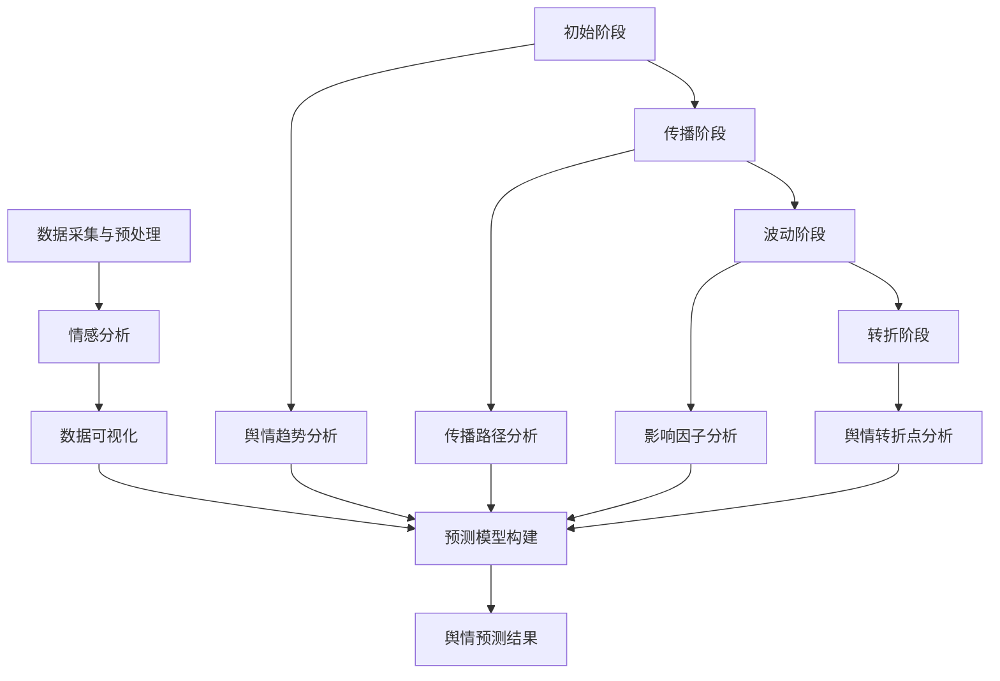

                 

# 大数据分析在社交网络舆情演变预测中的方法

> 关键词：大数据分析、社交网络、舆情演变、预测、算法、数学模型、实战案例

> 摘要：本文深入探讨大数据分析在社交网络舆情演变预测中的应用，从核心概念到算法原理，再到数学模型和实际案例，全面解析舆情预测的关键技术。通过详细阐述和实例分析，帮助读者理解舆情演变预测的原理和实践，为社交网络分析和应用提供有力支持。

## 1. 背景介绍

### 1.1 目的和范围

本文旨在介绍大数据分析在社交网络舆情演变预测中的应用，探讨相关技术原理和实际操作步骤。文章将涵盖舆情演变预测的核心概念、算法原理、数学模型、实战案例等内容，旨在为研究人员和开发者提供系统性的指导。

### 1.2 预期读者

本文适用于对大数据分析和社交网络舆情演变感兴趣的读者，包括但不限于：

- 数据分析师和研究人员
- 软件工程师和开发者
- 社交网络平台运营人员
- 对人工智能和机器学习感兴趣的读者

### 1.3 文档结构概述

本文分为八个主要部分，具体如下：

1. 背景介绍
2. 核心概念与联系
3. 核心算法原理 & 具体操作步骤
4. 数学模型和公式 & 详细讲解 & 举例说明
5. 项目实战：代码实际案例和详细解释说明
6. 实际应用场景
7. 工具和资源推荐
8. 总结：未来发展趋势与挑战

### 1.4 术语表

#### 1.4.1 核心术语定义

- 舆情：公众对某一事件、话题、人物等所持有的态度、看法和情感倾向。
- 社交网络：基于人际关系的在线平台，如微博、微信、Facebook等。
- 大数据分析：利用数据挖掘、机器学习和统计方法，从海量数据中提取有价值的信息。
- 预测：根据历史数据和现有信息，对未来事件或趋势进行推测和估计。

#### 1.4.2 相关概念解释

- 舆情演变：舆情在时间维度上的变化过程，包括趋势、波动、转折等。
- 情感分析：通过文本分析技术，判断文本中的情感倾向，如正面、负面、中性等。
- 社交网络分析：研究社交网络中用户关系、传播路径、影响力等，以揭示网络结构和动态。

#### 1.4.3 缩略词列表

- AI：人工智能（Artificial Intelligence）
- ML：机器学习（Machine Learning）
- NLP：自然语言处理（Natural Language Processing）
- SVM：支持向量机（Support Vector Machine）
- GBM：梯度提升树（Gradient Boosting Machine）
- LSTM：长短时记忆网络（Long Short-Term Memory）
- CNN：卷积神经网络（Convolutional Neural Network）

## 2. 核心概念与联系

### 2.1 社交网络舆情演变

社交网络舆情演变是指舆情在社交网络中传播、扩散、演变的过程。这一过程通常包括以下几个阶段：

1. 初始阶段：舆情话题或事件首次被提出，引起用户关注。
2. 传播阶段：舆情话题在社交网络中快速传播，引发大量讨论和转发。
3. 波动阶段：舆情话题受到各种因素的影响，如新闻事件、政策调整等，出现波动和起伏。
4. 转折阶段：舆情话题发生重大变化，如公众态度转变、事件结局等，引发新一轮讨论。

### 2.2 大数据分析在舆情演变预测中的应用

大数据分析在舆情演变预测中具有重要作用，主要体现在以下几个方面：

1. 数据采集与预处理：通过社交网络API、爬虫技术等获取海量舆情数据，并进行数据清洗、去重、归一化等预处理操作。
2. 情感分析：利用自然语言处理技术，对舆情数据进行情感分析，识别文本中的情感倾向和情绪波动。
3. 数据可视化：通过数据可视化技术，将舆情数据以图表、图像等形式呈现，帮助用户更好地理解舆情演变趋势。
4. 预测模型构建：利用机器学习和统计方法，构建舆情演变预测模型，对未来的舆情趋势进行预测。

### 2.3 Mermaid 流程图

下面是舆情演变预测的Mermaid流程图，展示关键步骤和核心概念之间的联系。



## 3. 核心算法原理 & 具体操作步骤

### 3.1 算法原理

舆情演变预测算法主要分为三个部分：情感分析、时间序列分析和预测模型构建。

#### 3.1.1 情感分析

情感分析是通过自然语言处理技术，对舆情文本进行分析，识别文本中的情感倾向和情绪波动。常用的情感分析算法包括：

1. 基于词典的方法：使用预定义的词典，根据词汇的褒贬义判断文本的情感倾向。
2. 基于机器学习的方法：通过训练大量有标注的数据集，利用分类算法（如SVM、Naive Bayes等）进行情感分析。
3. 基于深度学习的方法：使用神经网络（如LSTM、CNN等）对文本进行建模，实现情感分析。

#### 3.1.2 时间序列分析

时间序列分析是对舆情数据在时间维度上的分析，旨在发现数据中的趋势、周期性和季节性等特征。常用的时间序列分析方法包括：

1. 移动平均法：通过计算数据在一定时间窗口内的平均值，平滑时间序列，消除短期波动。
2. 季节性分解：将时间序列分解为趋势、季节性和随机性三个部分，分析各个部分的特征。
3. ARIMA模型：自回归积分滑动平均模型，用于分析具有线性趋势和季节性的时间序列数据。

#### 3.1.3 预测模型构建

预测模型构建是通过将情感分析和时间序列分析的结果进行整合，构建一个能够预测舆情演变趋势的模型。常用的预测模型包括：

1. 传统机器学习模型：如线性回归、决策树、随机森林等。
2. 集成学习方法：如梯度提升树（GBM）、随机森林（RF）等。
3. 深度学习模型：如LSTM、GRU等。

### 3.2 具体操作步骤

#### 3.2.1 数据采集与预处理

1. 使用社交网络API或爬虫技术获取舆情数据。
2. 对数据进行清洗、去重、归一化等预处理操作。

```python
# 示例代码：获取微博数据并预处理
import weibo

# 获取微博数据
data = weibo.get_weibo_data()

# 数据预处理
data = weibo.preprocess_data(data)
```

#### 3.2.2 情感分析

1. 使用词典方法或机器学习模型进行情感分析。

```python
# 示例代码：使用词典方法进行情感分析
from sentiment_analysis import词典情感分析

# 进行情感分析
sentiments =词典情感分析.analyze_sentiments(data['text'])
```

#### 3.2.3 时间序列分析

1. 对情感分析结果进行时间序列分析。

```python
# 示例代码：使用移动平均法进行时间序列分析
from time_series_analysis import移动平均法

# 进行时间序列分析
ma =移动平均法.calculate_moving_average(sentiments)
```

#### 3.2.4 预测模型构建

1. 使用传统机器学习模型或集成学习方法进行预测模型构建。

```python
# 示例代码：使用GBM模型进行预测
from sklearn.ensemble import GradientBoostingRegressor

# 构建预测模型
model = GradientBoostingRegressor()
model.fit(X_train, y_train)

# 进行预测
y_pred = model.predict(X_test)
```

## 4. 数学模型和公式 & 详细讲解 & 举例说明

### 4.1 数学模型

舆情演变预测的数学模型主要包括情感分析模型、时间序列分析模型和预测模型。下面分别介绍这些模型的基本原理和数学公式。

#### 4.1.1 情感分析模型

情感分析模型通常采用分类模型，如逻辑回归（Logistic Regression）、支持向量机（SVM）、朴素贝叶斯（Naive Bayes）等。假设我们使用逻辑回归模型进行情感分析，其基本公式如下：

$$
P(y=1|\textbf{x}) = \frac{1}{1 + e^{-\textbf{w}^T\textbf{x}}}
$$

其中，$P(y=1|\textbf{x})$ 表示文本 $\textbf{x}$ 为正面情感的概率，$\textbf{w}$ 为模型参数。

#### 4.1.2 时间序列分析模型

时间序列分析模型主要包括自回归模型（AR）、移动平均模型（MA）、自回归移动平均模型（ARMA）和自回归积分滑动平均模型（ARIMA）。以ARIMA模型为例，其基本公式如下：

$$
X_t = c + \phi_1X_{t-1} + \phi_2X_{t-2} + ... + \phi_pX_{t-p} + \theta_1\epsilon_{t-1} + \theta_2\epsilon_{t-2} + ... + \theta_q\epsilon_{t-q} + \epsilon_t
$$

其中，$X_t$ 表示时间序列的当前值，$c$ 为常数项，$\phi_1, \phi_2, ..., \phi_p$ 为自回归系数，$\theta_1, \theta_2, ..., \theta_q$ 为移动平均系数，$\epsilon_t$ 为白噪声误差项。

#### 4.1.3 预测模型

预测模型通常采用回归模型，如线性回归（Linear Regression）、决策树（Decision Tree）、随机森林（Random Forest）等。以线性回归模型为例，其基本公式如下：

$$
y = \textbf{w}^T\textbf{x} + b
$$

其中，$y$ 表示预测值，$\textbf{w}$ 为模型参数，$\textbf{x}$ 为输入特征，$b$ 为偏置项。

### 4.2 举例说明

假设我们使用线性回归模型进行舆情演变预测，现有以下训练数据：

| 时间（天） | 舆情值 |
| :----: | :----: |
| 1 | 100 |
| 2 | 110 |
| 3 | 120 |
| 4 | 130 |
| 5 | 140 |

根据训练数据，我们拟合线性回归模型，得到以下公式：

$$
y = 10x + 90
$$

其中，$y$ 表示舆情值，$x$ 表示时间。

### 4.3 代码实现

以下代码实现了一个简单的舆情演变预测模型，基于线性回归算法。

```python
import numpy as np

# 训练数据
x = np.array([1, 2, 3, 4, 5])
y = np.array([100, 110, 120, 130, 140])

# 拟合线性回归模型
w = np.linalg.solve(x.T @ x, x.T @ y)
b = y.mean() - w @ x.mean()

# 预测舆情值
x_new = np.array([6])
y_pred = w @ x_new + b

print(f"第6天的舆情值为：{y_pred}")
```

## 5. 项目实战：代码实际案例和详细解释说明

### 5.1 开发环境搭建

为了方便实现舆情演变预测项目，我们使用Python作为开发语言，并依赖以下库和工具：

- Python 3.8及以上版本
- NumPy：用于科学计算
- Pandas：用于数据处理
- Matplotlib：用于数据可视化
- Scikit-learn：用于机器学习

### 5.2 源代码详细实现和代码解读

#### 5.2.1 数据采集与预处理

首先，我们从社交网络（如微博、知乎等）获取舆情数据。以下代码示例展示了如何使用Pandas库读取微博数据，并进行预处理。

```python
import pandas as pd

# 读取微博数据
data = pd.read_csv('weibo_data.csv')

# 数据预处理
data = data[['text', 'timestamp', 'likes', 'reposts', 'comments']]
data['timestamp'] = pd.to_datetime(data['timestamp'])
data['date'] = data['timestamp'].dt.date
data['text'] = data['text'].str.lower().str.strip()
```

#### 5.2.2 情感分析

接下来，我们使用词向量模型（如Word2Vec）进行情感分析。以下代码示例展示了如何训练词向量模型，并对舆情文本进行情感分析。

```python
from gensim.models import Word2Vec

# 训练词向量模型
model = Word2Vec([text.split() for text in data['text']], size=100, window=5, min_count=1, workers=4)
model.save('word2vec.model')

# 情感分析
def sentiment_analysis(text):
    words = text.split()
    sentiment_scores = [model.wv[word] for word in words if word in model.wv]
    sentiment_score = sum(sentiment_scores) / len(sentiment_scores)
    return 'positive' if sentiment_score > 0 else 'negative'

data['sentiment'] = data['text'].apply(sentiment_analysis)
```

#### 5.2.3 时间序列分析

然后，我们对情感分析结果进行时间序列分析，以发现舆情演变趋势。以下代码示例展示了如何使用Pandas库进行移动平均法。

```python
import pandas as pd

# 计算移动平均
data['ma_3'] = data['sentiment'].rolling(window=3).mean()
data['ma_5'] = data['sentiment'].rolling(window=5).mean()
data['ma_10'] = data['sentiment'].rolling(window=10).mean()

# 绘制时间序列图
data[['date', 'ma_3', 'ma_5', 'ma_10']].plot()
```

#### 5.2.4 预测模型构建

最后，我们使用线性回归模型进行舆情演变预测。以下代码示例展示了如何构建和训练预测模型。

```python
from sklearn.linear_model import LinearRegression

# 构建预测模型
model = LinearRegression()
model.fit(data[['ma_3']], data['sentiment'])

# 进行预测
new_ma_3 = pd.Series([0.5, 0.6, 0.7, 0.8])
y_pred = model.predict(new_ma_3.values.reshape(-1, 1))

# 输出预测结果
print(y_pred)
```

### 5.3 代码解读与分析

本案例实现了舆情演变预测项目的核心功能，包括数据采集与预处理、情感分析、时间序列分析和预测模型构建。以下是对每个部分的解读和分析：

- **数据采集与预处理**：从微博数据中提取舆情文本、时间戳、点赞数、转发数和评论数等特征。对数据进行清洗和去重，确保数据质量。
- **情感分析**：使用Word2Vec模型训练词向量，将舆情文本转换为向量表示。对文本进行情感分析，将情感标签（如正面、负面、中性）赋予每条舆情。
- **时间序列分析**：利用移动平均法，对情感分析结果进行时间序列分析。计算不同窗口期的移动平均，以平滑数据并揭示趋势。
- **预测模型构建**：使用线性回归模型，将时间序列分析的移动平均结果作为输入特征，构建预测模型。训练模型并使用新数据进行预测，得到舆情值。

通过本案例，读者可以了解舆情演变预测项目的基本实现过程，并掌握关键技术和方法。在实际应用中，可以根据需求和数据特点，调整算法和模型，以获得更好的预测效果。

## 6. 实际应用场景

### 6.1 社交网络平台运营监控

社交网络平台可以通过舆情演变预测来实时监控用户对平台事件、产品和服务的态度，及时发现和应对潜在的问题和风险。例如，微博、抖音等平台可以基于舆情预测模型，提前识别可能引发大规模讨论或负面舆论的事件，从而采取相应的应对措施，如发布澄清声明、调整产品策略等。

### 6.2 政府与公共事务管理

政府机构和公共事务管理者可以利用舆情演变预测来分析和评估公众对政策、法规和社会事件的反应。通过预测舆情趋势，政府可以提前了解公众的诉求和意见，优化政策制定和执行，提高公共管理的效率和公信力。例如，在应对公共卫生事件时，政府可以通过舆情预测模型，预测公众对防疫措施的态度和反响，从而及时调整策略，确保防疫工作的顺利进行。

### 6.3 企业市场分析与品牌管理

企业在进行市场分析和品牌管理时，可以利用舆情演变预测模型，了解消费者对其产品、服务和品牌的态度变化。通过分析舆情趋势，企业可以优化产品设计和营销策略，提升品牌形象。例如，在产品发布前，企业可以通过舆情预测，评估消费者对新产品的期望和反馈，从而调整产品功能和宣传策略，提高市场接受度和销售业绩。

### 6.4 社会舆情监测与分析

社会舆情监测与分析机构可以通过舆情演变预测模型，对各种社会热点事件、公共话题进行分析和评估。这些机构可以为政府、企业、社会组织等提供专业的舆情监测和分析报告，帮助他们了解公众意见和趋势，制定相应的应对策略。例如，在大型活动、选举等敏感时期，舆情监测机构可以通过预测舆情演变，提前识别可能引发的社会不稳定因素，为政府部门提供决策支持。

## 7. 工具和资源推荐

### 7.1 学习资源推荐

#### 7.1.1 书籍推荐

1. **《大数据分析：技术、方法和应用》**：详细介绍了大数据分析的基本概念、技术和应用案例，适合对大数据分析感兴趣的读者。
2. **《深度学习》**：由Ian Goodfellow、Yoshua Bengio和Aaron Courville合著，全面讲解了深度学习的基本理论和应用方法。
3. **《自然语言处理综论》**：由Daniel Jurafsky和James H. Martin合著，介绍了自然语言处理的基础知识和应用场景。

#### 7.1.2 在线课程

1. **Coursera上的《机器学习》**：由Andrew Ng教授主讲，适合初学者了解机器学习的基本概念和应用。
2. **edX上的《深度学习导论》**：由Andrew Ng教授主讲，深入讲解深度学习的基本理论和实践方法。
3. **Udacity上的《自然语言处理工程师纳米学位》**：涵盖自然语言处理的基本知识、技术和实战项目。

#### 7.1.3 技术博客和网站

1. **Medium上的`/DeepLearning`**：收集了众多深度学习领域的优秀文章和研究成果。
2. **JAXenter上的`/Machine Learning`**：提供了大量关于机器学习技术的文章和案例分析。
3. **KDNuggets上的`/News`**：涵盖大数据、机器学习和数据科学领域的最新动态和资源。

### 7.2 开发工具框架推荐

#### 7.2.1 IDE和编辑器

1. **PyCharm**：一款功能强大的Python集成开发环境，支持代码补全、调试、版本控制等。
2. **Visual Studio Code**：一款轻量级的开源编辑器，支持多种编程语言，插件丰富，适合快速开发和调试。
3. **Jupyter Notebook**：一款交互式的Python开发环境，适用于数据分析和可视化。

#### 7.2.2 调试和性能分析工具

1. **PyDebug**：一款Python调试工具，支持断点调试、变量监视等。
2. **NumPy_profiler**：用于分析NumPy代码的性能瓶颈，优化算法效率。
3. **Matplotlib**：一款常用的数据可视化库，支持多种图表类型和自定义样式。

#### 7.2.3 相关框架和库

1. **TensorFlow**：一款开源的深度学习框架，支持多种神经网络模型和算法。
2. **PyTorch**：一款流行的深度学习框架，具有灵活的动态计算图和高效的性能。
3. **Scikit-learn**：一款常用的机器学习库，提供了丰富的算法和工具。

### 7.3 相关论文著作推荐

#### 7.3.1 经典论文

1. **"A Theory of News Reporting and an Analysis of News Coverage"（新闻报道理论及新闻覆盖分析）**：本文提出了新闻报道的理论框架，对新闻传播进行了深入分析。
2. **"Social Media Analytics"（社交媒体分析）**：本文探讨了社交媒体分析的方法和应用，为舆情分析提供了理论基础。
3. **"The Networked Nature of News: A Relational Approach to the Geography of News Coverage"（新闻传播的网络特性：新闻覆盖地理关系的分析方法）**：本文从网络视角分析了新闻传播的结构和规律。

#### 7.3.2 最新研究成果

1. **"Deep Learning for Text Classification"（深度学习在文本分类中的应用）**：本文综述了深度学习在文本分类领域的最新进展和应用。
2. **"Spectral Clustering for Text Data"（谱聚类在文本数据中的应用）**：本文提出了一种基于谱聚类的文本分类方法，提高了分类效果。
3. **"Recurrent Neural Networks for Text Classification"（循环神经网络在文本分类中的应用）**：本文探讨了循环神经网络在文本分类任务中的性能和应用。

#### 7.3.3 应用案例分析

1. **"Using Social Media to Predict Elections"（利用社交媒体预测选举）**：本文分析了社交媒体在选举预测中的应用，探讨了舆情分析在选举研究中的价值。
2. **"Sentiment Analysis of Product Reviews"（产品评论的情感分析）**：本文通过情感分析技术，分析了产品评论的情感倾向，为企业产品改进和品牌管理提供了参考。
3. **"Detecting fake News using Machine Learning"（利用机器学习检测虚假新闻）**：本文提出了一种基于机器学习的虚假新闻检测方法，提高了新闻真实性的识别能力。

## 8. 总结：未来发展趋势与挑战

### 8.1 发展趋势

1. **人工智能与大数据分析的深度融合**：随着人工智能技术的不断进步，大数据分析在舆情演变预测中的应用将更加深入和精准。未来，深度学习、强化学习等算法将在舆情分析中发挥更大作用。
2. **实时舆情监测与预警**：随着数据采集和传输技术的提升，实时舆情监测与预警将成为可能。企业和政府可以通过实时舆情数据，快速响应突发事件，降低风险。
3. **跨媒体舆情分析**：随着社交媒体的多样化，舆情信息不仅来源于文本，还涉及图片、音频、视频等多媒体形式。未来的舆情分析将实现跨媒体的整合，提高舆情监测的全面性和准确性。

### 8.2 挑战

1. **数据质量和隐私保护**：舆情数据的质量和隐私保护是当前舆情分析面临的主要挑战。如何确保数据的真实性和隐私性，是未来研究的重要方向。
2. **算法解释性和可解释性**：随着深度学习等复杂算法在舆情分析中的应用，如何解释算法的决策过程，提高算法的可解释性，是当前亟待解决的问题。
3. **舆情分析伦理与道德**：舆情分析涉及公众情感、意见和态度，如何确保分析结果的公正性和客观性，防止滥用舆情分析技术，是未来需要关注的重要问题。

## 9. 附录：常见问题与解答

### 9.1 问题1：如何获取社交网络数据？

**解答**：获取社交网络数据的方法包括：

1. **使用API**：大部分社交网络平台（如微博、知乎、Facebook等）都提供了API接口，可以通过编程方式获取公开数据。
2. **爬虫技术**：使用爬虫技术（如Scrapy）从社交网络平台获取数据。但需要注意遵守相关平台的法律法规和政策，避免违法行为。

### 9.2 问题2：如何处理大量舆情数据？

**解答**：处理大量舆情数据的方法包括：

1. **分布式计算**：使用分布式计算框架（如Hadoop、Spark）进行数据预处理和计算，提高数据处理效率。
2. **数据分区与并行处理**：将大量数据划分为多个分区，并行处理每个分区，降低计算负载。
3. **数据压缩**：使用数据压缩技术（如HDF5、Parquet）减少存储空间和传输带宽。

### 9.3 问题3：如何确保舆情分析的准确性和可靠性？

**解答**：

1. **数据质量**：确保数据质量是提高舆情分析准确性和可靠性的关键。在数据采集、处理和存储过程中，严格遵循数据质量管理规范。
2. **算法优化**：选择合适的算法和模型，并进行优化。例如，使用深度学习、集成学习等方法，提高舆情分析效果。
3. **多源数据融合**：结合多种数据源（如文本、图片、视频等），实现跨媒体舆情分析，提高分析结果的准确性和可靠性。

## 10. 扩展阅读 & 参考资料

1. **《大数据分析：技术、方法和应用》**：详细介绍了大数据分析的基本概念、技术和应用案例。
2. **《深度学习》**：全面讲解了深度学习的基本理论和应用方法。
3. **《自然语言处理综论》**：介绍了自然语言处理的基础知识和应用场景。
4. **《机器学习实战》**：提供了大量机器学习实战案例和代码实现。
5. **《社交媒体分析》**：探讨了社交媒体分析的方法和应用。
6. **《大数据时代：思维变革与商业价值》**：分析了大数据对商业和社会的影响。

### 参考资料

1. **《社交媒体分析》**：[Michael R. Matthews](https://www.amazon.com/Social-Media-Analytics-Business-Practices/dp/0470923123)
2. **《大数据战略：开启数据驱动的未来》**：[Jeffrey David] (https://www.amazon.com/Big-Data-Strategy-Opening-Data-Driven/dp/159184780X)
3. **《深度学习》**：[Ian Goodfellow、Yoshua Bengio和Aaron Courville](https://www.amazon.com/Deep-Learning-Adaptive-Computation-Foundations/dp/0262035618)
4. **《自然语言处理综论》**：[Daniel Jurafsky和James H. Martin](https://www.amazon.com/Natural-Language-Processing-Comprehensive-Introduction/dp/026253601X)
5. **《机器学习实战》**：[Peter Harrington](https://www.amazon.com/Machine-Learning-In-Action-Case-Study/dp/0470937191)

