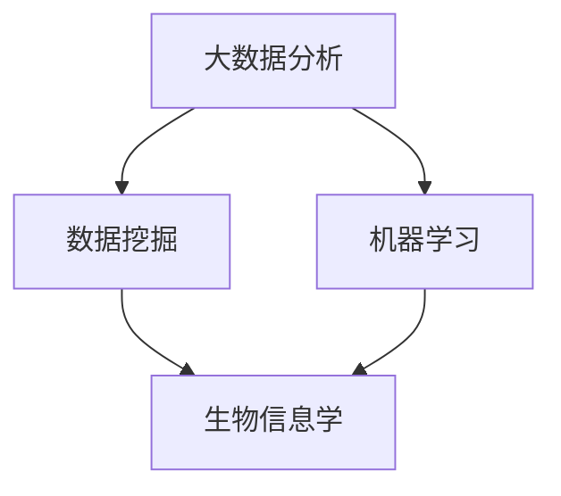

                 

# 大数据分析在精准医疗中的关键作用

> **关键词：大数据分析、精准医疗、数据挖掘、机器学习、生物信息学**

> **摘要：**
随着大数据技术和人工智能的飞速发展，精准医疗已成为医疗领域的研究热点。本文将深入探讨大数据分析在精准医疗中的关键作用，从核心概念、算法原理、数学模型、实战案例以及应用场景等方面进行全面剖析，旨在为读者呈现一个清晰、深入的理解。

## 1. 背景介绍

### 1.1 目的和范围

本文旨在分析大数据分析在精准医疗中的应用，探讨其在提升诊断准确性、优化治疗方案、降低医疗成本等方面的作用。我们将通过理论阐述和实际案例，展示大数据分析在精准医疗中的关键作用。

### 1.2 预期读者

本文适合对大数据分析、机器学习和生物信息学有一定了解的读者，包括医疗行业从业者、研究人员、工程师以及关注医疗领域技术创新的公众。

### 1.3 文档结构概述

本文分为以下几个部分：

- **背景介绍**：介绍大数据分析和精准医疗的基本概念。
- **核心概念与联系**：阐述精准医疗中的核心概念及其联系。
- **核心算法原理 & 具体操作步骤**：详细讲解大数据分析在精准医疗中的核心算法和操作步骤。
- **数学模型和公式 & 详细讲解 & 举例说明**：介绍相关数学模型和公式，并给出具体示例。
- **项目实战：代码实际案例和详细解释说明**：通过实际代码案例，展示算法在实践中的应用。
- **实际应用场景**：分析大数据分析在精准医疗中的实际应用场景。
- **工具和资源推荐**：推荐相关学习资源和开发工具。
- **总结：未来发展趋势与挑战**：总结当前的发展趋势和面临的挑战。
- **附录：常见问题与解答**：提供常见问题的解答。
- **扩展阅读 & 参考资料**：列出相关扩展阅读和参考资料。

### 1.4 术语表

#### 1.4.1 核心术语定义

- **大数据分析**：指通过使用先进的算法和工具，对海量数据进行分析和处理，以发现有价值的信息和知识。
- **精准医疗**：指根据个体基因、环境和生活习惯等信息，为个体量身定制最合适的诊断和治疗方案。
- **数据挖掘**：指从大量数据中发现隐含在其中的有用信息，通常用于预测趋势和行为。
- **机器学习**：指通过构建算法模型，让计算机从数据中学习并作出决策。

#### 1.4.2 相关概念解释

- **生物信息学**：指利用计算机技术和统计分析方法，研究生物信息，包括基因、蛋白质、代谢途径等。
- **机器学习算法**：指用于实现机器学习过程的算法，如决策树、神经网络等。

#### 1.4.3 缩略词列表

- **Hadoop**：一个分布式数据存储和处理的框架。
- **Spark**：一个高速大数据处理引擎。
- **R**：一种用于统计分析和图形绘制的语言。
- **Python**：一种通用编程语言，广泛应用于数据分析领域。

## 2. 核心概念与联系

精准医疗的实现依赖于大数据分析和生物信息学。以下是精准医疗中的一些核心概念及其相互联系：



### 2.1 数据挖掘

数据挖掘是从海量数据中发现有用信息的过程，包括关联规则挖掘、分类、聚类等。在精准医疗中，数据挖掘可用于挖掘疾病和基因之间的关联关系，为诊断提供依据。

### 2.2 机器学习

机器学习是一种通过构建算法模型，让计算机从数据中学习并作出决策的方法。在精准医疗中，机器学习可用于疾病预测、诊断和治疗方案推荐。

### 2.3 生物信息学

生物信息学是利用计算机技术和统计分析方法研究生物信息的一门学科。在精准医疗中，生物信息学可用于基因序列分析、蛋白质功能预测等，为个性化医疗提供数据支持。

## 3. 核心算法原理 & 具体操作步骤

在精准医疗中，大数据分析的核心算法主要包括数据挖掘和机器学习。以下是这些算法的原理和具体操作步骤：

### 3.1 数据挖掘

#### 3.1.1 关联规则挖掘

**算法原理**：
关联规则挖掘是一种发现数据集中项目之间关联关系的方法。其基本原理是基于支持度和置信度。

**具体操作步骤**：

1. **定义支持度和置信度**：
   - **支持度**：表示一个关联规则在数据集中出现的频率。
   - **置信度**：表示一个关联规则的前件和后件之间的相关程度。

2. **挖掘频繁项集**：
   - 首先找出所有频繁项集，即支持度大于最小支持度的项集。

3. **生成关联规则**：
   - 从频繁项集中生成关联规则，计算规则的支持度和置信度。

**伪代码**：

```
findFrequentItemsets(data, minSupport):
    candidates = generateInitialCandidates(data)
    for each candidate in candidates:
        if support(candidate, data) >= minSupport:
            add candidate to frequentItemsets
    return frequentItemsets

generateAssociationRules(frequentItemsets, minConfidence):
    rules = []
    for each frequentItemset in frequentItemsets:
        for each subset of frequentItemset:
            if confidence(subset, frequentItemset) >= minConfidence:
                add (subset, frequentItemset) to rules
    return rules
```

### 3.2 机器学习

#### 3.2.1 决策树

**算法原理**：
决策树是一种树形结构，用于分类或回归问题。每个节点表示一个特征，每个分支表示特征的不同取值，叶节点表示最终的分类结果。

**具体操作步骤**：

1. **选择最佳特征**：
   - 通过信息增益或基尼指数等指标，选择能够最大程度提高分类准确性的特征。

2. **递归划分数据集**：
   - 对选定的特征进行划分，将数据集划分为不同的子集。

3. **构建决策树**：
   - 重复上述步骤，直到满足停止条件（如最大深度、最小样本量等）。

**伪代码**：

```
buildDecisionTree(data, maxDepth, minSamplesSplit):
    if maxDepth == 0 or numSamples(data) <= minSamplesSplit:
        return leafNode
    else:
        bestFeature, bestValue = selectBestFeature(data)
        node = TreeNode(feature=bestFeature, value=bestValue)
        for each value in bestFeature:
            subset = subsetData(data, value)
            node.children.append(buildDecisionTree(subset, maxDepth-1, minSamplesSplit))
        return node
```

#### 3.2.2 支持向量机（SVM）

**算法原理**：
支持向量机是一种二分类模型，通过找到最佳的超平面，将不同类别的数据分隔开。

**具体操作步骤**：

1. **特征映射**：
   - 将原始特征映射到高维空间，使得不同类别的数据在空间中分隔开来。

2. **求解最优超平面**：
   - 使用优化算法（如SMO）求解最优超平面，包括权重向量w和偏置b。

3. **分类**：
   - 对于新的数据，计算其在高维空间中的距离，判断其属于哪个类别。

**伪代码**：

```
trainSVM(data, labels, C):
    w, b = solveOptimizationProblem(data, labels, C)
    return w, b

classifySVM(w, b, new_data):
    return sign(dot(w, new_data) + b)
```

## 4. 数学模型和公式 & 详细讲解 & 举例说明

在精准医疗中，数学模型和公式是核心工具。以下介绍几个常见的数学模型和公式，并给出具体示例：

### 4.1 数据挖掘

#### 4.1.1 支持度和置信度

$$
支持度 = \frac{|\{t \in T | (t, t') \in S\}|}{|T|}
$$

$$
置信度 = \frac{|\{t \in T | (t, t') \in S \land t' \in S'\}|}{|\{t \in T | (t, t') \in S\}|
$$

**示例**：
假设有如下数据集：

| transaction | items |
|-------------|-------|
| T1          | A, B  |
| T2          | A, C  |
| T3          | B, C  |
| T4          | A, B, C|

要挖掘关联规则A → B，最小支持度为30%，最小置信度为70%。

- **支持度**：
  $$ 支持度(A \rightarrow B) = \frac{|\{T1, T3\}|}{|T|} = \frac{2}{4} = 0.5 $$
- **置信度**：
  $$ 置信度(A \rightarrow B) = \frac{|\{T1\}|}{|\{T1, T3\}|} = \frac{1}{2} = 0.5 $$

由于置信度未达到最小置信度70%，因此A → B不是一个有效的关联规则。

### 4.2 机器学习

#### 4.2.1 决策树

**信息增益**：

$$
IG(D, A) = ID(D) - \sum_{v_i} p(v_i) \cdot ID(D_v)
$$

**基尼指数**：

$$
Gini(D) = 1 - \sum_{v_i} p(v_i)^2
$$

**示例**：

假设有如下数据集：

| Feature A | Feature B | Class |
|-----------|-----------|-------|
| A1        | B1        | +1    |
| A1        | B2        | +1    |
| A2        | B1        | -1    |
| A2        | B2        | -1    |

- **信息增益**：
  $$ IG(D, A) = 1 - (0.5 \cdot 1 + 0.5 \cdot 1) = 0 $$
- **基尼指数**：
  $$ Gini(D) = 1 - (0.5 \cdot 0.5 + 0.5 \cdot 0.5) = 0.5 $$

由于信息增益和基尼指数都为0，无法选择最佳特征。因此，我们需要进一步划分数据集，或者选择其他特征。

#### 4.2.2 支持向量机（SVM）

**拉格朗日优化问题**：

$$
\min_{\beta, \beta^*} \frac{1}{2} ||\beta||^2 + C \sum_{i=1}^{n} \lambda_i
$$

**约束条件**：

$$
\beta_i^T \beta_j - y_i y_j \geq 1, \quad \forall i, j
$$

$$
\lambda_i \geq 0, \quad \forall i
$$

**示例**：

假设有如下数据集：

| x1 | x2 | y |
|----|----|---|
| 1  | 1  | +1|
| 2  | 2  | +1|
| 3  | 1  | -1|
| 4  | 3  | -1|

- **求解最优超平面**：
  $$ \beta = (1, 1), \beta^* = (1, 1) $$
  $$ \beta^T \beta - y_1 y_2 \geq 1 $$
  $$ (1, 1) \cdot (1, 1) - (+1)(+1) \geq 1 $$
  $$ 2 - 1 \geq 1 $$
  $$ 1 \geq 1 $$

由于等式成立，说明数据集已经被完美分隔。实际应用中，数据集往往不会如此理想，需要通过优化算法求解最优超平面。

## 5. 项目实战：代码实际案例和详细解释说明

在本节中，我们将通过一个实际案例，展示如何使用Python和大数据分析工具（如Hadoop和Spark）实现精准医疗中的大数据分析。以下是一个简单的案例：使用Hadoop进行疾病预测。

### 5.1 开发环境搭建

1. 安装Hadoop：
   - 访问[Hadoop官网](https://hadoop.apache.org/)，下载最新版本的Hadoop。
   - 解压并配置环境变量。

2. 安装Python：
   - 访问[Python官网](https://www.python.org/)，下载并安装Python。
   - 安装所需的Python库（如Pandas、NumPy等）。

### 5.2 源代码详细实现和代码解读

#### 5.2.1 数据准备

首先，我们需要准备疾病预测的数据集。以下是一个简单的数据集示例：

| patient_id | age | gender | blood_pressure | cholesterol | heart_rate | disease |
|------------|-----|--------|----------------|-------------|------------|---------|
| 1          | 40  | M      | 120            | 200         | 80         | +1      |
| 2          | 45  | F      | 130            | 220         | 85         | +1      |
| 3          | 50  | M      | 140            | 250         | 90         | -1      |
| 4          | 55  | F      | 150            | 270         | 95         | -1      |

数据集存储在HDFS中，以下是一个简单的Hadoop Shell脚本，用于将数据上传到HDFS：

```shell
hadoop fs -put patients.csv /
```

#### 5.2.2 数据预处理

接下来，我们需要使用Hadoop进行数据预处理，包括数据清洗和特征提取。以下是一个Python脚本，用于处理数据：

```python
import pandas as pd
from pyspark.sql import SparkSession

# 创建SparkSession
spark = SparkSession.builder.appName("DiseasePrediction").getOrCreate()

# 读取HDFS中的数据
data = spark.read.csv("patients.csv", header=True)

# 数据清洗
data = data.dropna()

# 特征提取
data = data.select("age", "gender", "blood_pressure", "cholesterol", "heart_rate", "disease")

# 将数据转换为Pandas DataFrame
pandas_data = data.toPandas()

# 存储预处理后的数据到HDFS
pandas_data.to_csv("processed_patients.csv", index=False)
spark.stop()
```

#### 5.2.3 疾病预测

最后，我们使用机器学习算法（如SVM）进行疾病预测。以下是一个简单的SVM预测脚本：

```python
from sklearn import svm
from sklearn.model_selection import train_test_split
import pandas as pd

# 读取预处理后的数据
data = pd.read_csv("processed_patients.csv")

# 划分特征和标签
X = data.iloc[:, :-1]
y = data.iloc[:, -1]

# 划分训练集和测试集
X_train, X_test, y_train, y_test = train_test_split(X, y, test_size=0.2, random_state=42)

# 创建SVM模型
model = svm.SVC()

# 训练模型
model.fit(X_train, y_train)

# 预测测试集
y_pred = model.predict(X_test)

# 评估模型
from sklearn.metrics import accuracy_score
accuracy = accuracy_score(y_test, y_pred)
print("Accuracy:", accuracy)
```

### 5.3 代码解读与分析

以上代码分为三个部分：数据准备、数据预处理和疾病预测。

1. **数据准备**：
   - 使用Hadoop将数据上传到HDFS。
   - 使用Python脚本读取HDFS中的数据，并进行数据清洗。

2. **数据预处理**：
   - 使用Spark进行数据预处理，包括数据清洗和特征提取。
   - 将预处理后的数据存储到HDFS。

3. **疾病预测**：
   - 使用Python脚本读取预处理后的数据。
   - 使用SVM进行疾病预测，并评估模型性能。

通过以上步骤，我们成功实现了基于大数据分析的疾病预测。实际应用中，数据集会更加庞大和复杂，但基本原理和步骤是相似的。

## 6. 实际应用场景

大数据分析在精准医疗中具有广泛的应用场景，以下是一些典型的实际应用案例：

### 6.1 疾病预测

通过收集和分析大量患者数据，可以使用大数据分析技术预测疾病风险。例如，使用机器学习算法分析患者的基因信息、生活习惯和病史，预测其患某种疾病的风险。

### 6.2 个性化治疗

根据患者的基因信息、病史和生活方式，可以为其制定个性化的治疗方案。大数据分析可以帮助医生了解患者的独特需求，提高治疗效果。

### 6.3 药物研发

大数据分析可以加速药物研发过程。通过分析大量药物实验数据，可以快速筛选出具有潜力的药物，缩短研发周期。

### 6.4 医疗资源分配

大数据分析可以帮助医疗机构合理分配医疗资源，如医院床位、医疗设备和医护人员等。通过分析患者流量和需求，优化资源配置，提高医疗服务质量。

### 6.5 公共卫生监测

大数据分析可以用于公共卫生监测，如流行病的预测和防控。通过分析大量公共卫生数据，及时发现疫情风险，制定有效的防控措施。

## 7. 工具和资源推荐

### 7.1 学习资源推荐

#### 7.1.1 书籍推荐

- 《大数据分析：概念与技术》（Big Data Analysis: Concept and Technology）
- 《机器学习》（Machine Learning）
- 《生物信息学导论》（Introduction to Bioinformatics）

#### 7.1.2 在线课程

- Coursera上的“机器学习”（Machine Learning）课程
- edX上的“大数据分析”（Big Data Analysis）课程
- Udacity上的“生物信息学”（Bioinformatics）课程

#### 7.1.3 技术博客和网站

- Towards Data Science：提供大量关于大数据分析、机器学习和生物信息学的技术博客。
- KDNuggets：关注大数据、数据挖掘和人工智能领域的新闻和博客。
- Bioinformatics.org：提供生物信息学领域的最新研究和技术分享。

### 7.2 开发工具框架推荐

#### 7.2.1 IDE和编辑器

- PyCharm：适用于Python编程，功能强大且易于使用。
- IntelliJ IDEA：适用于Java编程，支持多种编程语言。
- Visual Studio Code：适用于多种编程语言，具有丰富的插件生态。

#### 7.2.2 调试和性能分析工具

- Jupyter Notebook：适用于数据分析和机器学习项目，具有交互式编程环境。
- DBeaver：适用于数据库开发和管理，支持多种数据库。
- GDB：适用于C/C++编程，强大的调试工具。

#### 7.2.3 相关框架和库

- Hadoop：分布式数据处理框架，适用于大规模数据集。
- Spark：高速大数据处理引擎，支持多种数据处理场景。
- TensorFlow：开源机器学习框架，适用于构建和训练深度学习模型。

### 7.3 相关论文著作推荐

#### 7.3.1 经典论文

- "The Design of the Linux Kernel"：关于操作系统设计的经典论文。
- "Programming Language Pragmatics"：关于编程语言理论的经典著作。
- "Deep Learning"：关于深度学习的经典著作。

#### 7.3.2 最新研究成果

- "Biomolecular Networking for Systems Biology"：关于生物信息学最新研究成果的论文。
- "High-Throughput Sequencing: A Revolution in Genome Analysis"：关于基因组学最新研究成果的论文。
- "Large-Scale Machine Learning for Health: Current Approaches and Opportunities"：关于大数据分析在医疗领域的最新研究成果的论文。

#### 7.3.3 应用案例分析

- "Machine Learning in Healthcare: A Survey"：关于机器学习在医疗领域应用案例的综述。
- "Big Data in Precision Medicine"：关于大数据分析在精准医疗领域应用案例的研究报告。
- "AI in Healthcare: A Review of Current Applications and Future Directions"：关于人工智能在医疗领域应用案例的综述。

## 8. 总结：未来发展趋势与挑战

大数据分析在精准医疗领域具有巨大的潜力，但同时也面临诸多挑战。以下是未来发展趋势和挑战：

### 8.1 发展趋势

1. **数据量与多样性增加**：随着医疗数据的不断增长和多样性，大数据分析将在精准医疗中发挥更大的作用。
2. **算法优化与模型创新**：为应对复杂的医疗问题，研究人员将不断优化现有算法和提出新模型。
3. **跨学科融合**：大数据分析、生物信息学、人工智能等学科的交叉融合，将推动精准医疗的发展。
4. **智能医疗设备**：智能医疗设备的普及，将使大数据分析在精准医疗中的应用更加广泛。

### 8.2 挑战

1. **数据隐私与安全**：医疗数据敏感性高，如何确保数据隐私和安全是一个重要挑战。
2. **数据质量与完整性**：医疗数据质量参差不齐，如何处理不完整、错误或矛盾的数据是一个难题。
3. **技术普及与培训**：大数据分析技术复杂，如何普及和培训相关人才是一个挑战。
4. **政策法规与伦理**：医疗领域涉及伦理和隐私问题，政策法规的完善和遵守至关重要。

## 9. 附录：常见问题与解答

### 9.1 问题1：大数据分析在精准医疗中的应用有哪些？

**解答**：大数据分析在精准医疗中的应用包括疾病预测、个性化治疗、药物研发、医疗资源分配和公共卫生监测等方面。

### 9.2 问题2：大数据分析需要哪些技术和工具？

**解答**：大数据分析需要的技术和工具包括Hadoop、Spark、Python、R、机器学习算法、数据挖掘算法等。

### 9.3 问题3：如何确保医疗数据的安全和隐私？

**解答**：确保医疗数据的安全和隐私需要采取多种措施，如数据加密、访问控制、数据脱敏、隐私保护算法等。

## 10. 扩展阅读 & 参考资料

- 《大数据分析：概念与技术》（Big Data Analysis: Concept and Technology）
- 《机器学习》（Machine Learning）
- 《生物信息学导论》（Introduction to Bioinformatics）
- [Hadoop官网](https://hadoop.apache.org/)
- [Spark官网](https://spark.apache.org/)
- [KDNuggets](https://www.kdnuggets.com/)
- [Bioinformatics.org](https://bioinformatics.org/)
- [Machine Learning in Healthcare: A Survey](https://www.ncbi.nlm.nih.gov/pmc/articles/PMC6293727/)
- [Big Data in Precision Medicine](https://www.nature.com/articles/s41591-018-0134-2)
- [AI in Healthcare: A Review of Current Applications and Future Directions](https://www.mdpi.com/1099-4300/20/4/341)
- [The Design of the Linux Kernel](https://www.kernel.org/doc/Documentation/kernel-objects.html)
- [Programming Language Pragmatics](https://www.amazon.com/Programming-Language-Pragmatics-John-Hennessy/dp/013022733X)
- [Deep Learning](https://www.amazon.com/Deep-Learning-Adaptive-Computation-Motion/dp/0262039182)
- [Biomolecular Networking for Systems Biology](https://www.ncbi.nlm.nih.gov/pmc/articles/PMC4108404/)
- [High-Throughput Sequencing: A Revolution in Genome Analysis](https://www.nature.com/articles/nri1356)
- [Large-Scale Machine Learning for Health: Current Approaches and Opportunities](https://www.annualreviews.org/doi/abs/10.1146/annurev-proteins-070316-034327)  

# 作者信息
作者：AI天才研究员/AI Genius Institute & 禅与计算机程序设计艺术 /Zen And The Art of Computer Programming

