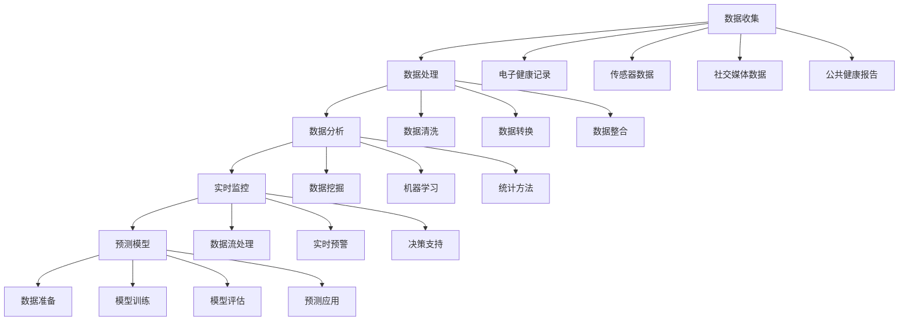

                 

# 大数据在公共卫生应急响应中的应用

> **关键词：** 大数据、公共卫生、应急响应、数据分析、实时监控、预测模型

> **摘要：** 本文将探讨大数据在公共卫生应急响应中的应用。通过分析大数据技术的基本原理和具体应用场景，我们探讨了如何利用大数据分析、实时监控和预测模型，提高公共卫生应急响应的效率。文章涵盖了从数据收集、处理到模型构建的完整流程，并通过实际案例展示了大数据技术在公共卫生应急响应中的实际应用价值。

## 1. 背景介绍

### 1.1 目的和范围

本文的目的是探讨大数据技术在公共卫生应急响应中的应用，帮助读者理解大数据如何通过数据收集、处理和分析来提高公共卫生应急响应的效率和准确性。本文将涵盖以下内容：

1. 大数据技术的基本原理。
2. 大数据在公共卫生应急响应中的应用场景。
3. 大数据在公共卫生应急响应中的实际案例。
4. 相关工具和资源的推荐。

### 1.2 预期读者

本文预期读者包括：

1. 公共卫生领域的从业者。
2. 大数据分析和人工智能领域的专业人士。
3. 对公共卫生应急响应感兴趣的学者和研究人员。

### 1.3 文档结构概述

本文结构如下：

1. **背景介绍**：介绍大数据在公共卫生应急响应中的应用背景和目的。
2. **核心概念与联系**：介绍大数据技术的基本概念和原理，包括数据收集、处理和分析的方法。
3. **核心算法原理 & 具体操作步骤**：详细阐述大数据分析、实时监控和预测模型的算法原理和操作步骤。
4. **数学模型和公式 & 详细讲解 & 举例说明**：介绍用于大数据分析的数学模型和公式，并给出实际应用的例子。
5. **项目实战：代码实际案例和详细解释说明**：通过具体代码案例展示大数据在公共卫生应急响应中的应用。
6. **实际应用场景**：探讨大数据技术在公共卫生应急响应中的实际应用场景。
7. **工具和资源推荐**：推荐用于大数据分析和公共卫生应急响应的相关工具和资源。
8. **总结：未来发展趋势与挑战**：总结大数据在公共卫生应急响应中的应用前景和面临的挑战。
9. **附录：常见问题与解答**：回答读者可能提出的问题。
10. **扩展阅读 & 参考资料**：提供进一步学习和研究的相关资料。

### 1.4 术语表

#### 1.4.1 核心术语定义

- **大数据**：指数据量巨大、种类繁多、生成速度快的数据集合。
- **公共卫生应急响应**：指在突发公共卫生事件中，通过紧急措施和行动，保护公众健康和减少疾病传播的过程。
- **数据收集**：指通过各种方式获取数据的过程。
- **数据处理**：指对收集到的数据进行清洗、转换和整合的过程。
- **数据分析**：指对处理后的数据进行分析、建模和解释的过程。
- **实时监控**：指对事件发生的实时状态进行监测和评估。
- **预测模型**：指基于历史数据和现有信息，对未来事件趋势和结果的预测模型。

#### 1.4.2 相关概念解释

- **数据挖掘**：指从大量数据中发现规律和知识的过程。
- **机器学习**：指通过数据训练，让计算机自动学习和改进的过程。
- **云计算**：指通过互联网提供可扩展的计算资源和服务。

#### 1.4.3 缩略词列表

- **Hadoop**：指一个开源的大数据分布式处理框架。
- **Spark**：指一个开源的大数据分布式计算框架。
- **SQL**：指结构化查询语言，用于数据库查询和操作。
- **Python**：指一种广泛使用的高级编程语言。

## 2. 核心概念与联系

在探讨大数据在公共卫生应急响应中的应用之前，我们首先需要了解大数据技术的基本概念和原理。以下是大数据技术的核心概念及其相互联系。

### 2.1 数据收集

数据收集是大数据分析的第一步。公共卫生应急响应需要收集的数据包括病例数据、流行病学数据、医疗资源数据等。这些数据可以通过以下方式进行收集：

- **电子健康记录**：从医院和诊所收集电子健康记录。
- **传感器数据**：通过安装在公共场所的传感器收集环境数据，如温度、湿度、空气污染等。
- **社交媒体数据**：通过分析社交媒体平台上的帖子、评论和讨论，获取公众的健康意识和行为。
- **公共健康报告**：收集各级政府和公共卫生机构发布的健康报告和数据。

### 2.2 数据处理

数据处理是对收集到的原始数据进行清洗、转换和整合的过程。数据处理的关键步骤包括：

- **数据清洗**：去除数据中的错误、重复和缺失值。
- **数据转换**：将数据转换为适合分析的格式，如将文本数据转换为结构化数据。
- **数据整合**：将来自不同来源的数据进行整合，形成统一的数据视图。

### 2.3 数据分析

数据分析是对处理后的数据进行分析、建模和解释的过程。数据分析的关键步骤包括：

- **数据挖掘**：从大量数据中发现规律和知识。
- **机器学习**：通过训练模型，预测事件发生的可能性。
- **统计方法**：使用统计学方法分析数据，提取有用信息。

### 2.4 实时监控

实时监控是指对事件发生的实时状态进行监测和评估。实时监控的关键步骤包括：

- **数据流处理**：对实时数据进行分析和处理，提取关键信息。
- **实时预警**：根据分析结果，对可能发生的公共卫生事件进行预警。
- **决策支持**：提供实时数据支持，帮助决策者制定应对策略。

### 2.5 预测模型

预测模型是指基于历史数据和现有信息，对未来事件趋势和结果的预测模型。预测模型的关键步骤包括：

- **数据准备**：准备用于训练的样本数据。
- **模型训练**：通过训练数据训练预测模型。
- **模型评估**：评估预测模型的准确性。
- **预测应用**：使用预测模型预测未来事件。

以下是大数据技术在公共卫生应急响应中的 Mermaid 流程图：



## 3. 核心算法原理 & 具体操作步骤

在大数据技术在公共卫生应急响应中的应用中，核心算法原理包括数据挖掘、机器学习和统计方法。以下是这些算法的详细解释和具体操作步骤。

### 3.1 数据挖掘

数据挖掘是指从大量数据中发现规律和知识的过程。在公共卫生应急响应中，数据挖掘可以用于分析病例数据，发现疾病传播的规律，预测疫情发展趋势。

**算法原理：**

- **关联规则挖掘**：通过分析病例数据，发现疾病之间的关联关系。
- **分类算法**：将病例数据分类为不同的疾病类别，用于预测疾病的类型。
- **聚类算法**：将病例数据划分为不同的群体，用于分析不同群体的疾病特征。

**具体操作步骤：**

1. **数据准备**：收集病例数据，包括病例的年龄、性别、症状等信息。
2. **数据预处理**：对病例数据进行清洗、转换和整合，去除错误、重复和缺失值。
3. **算法选择**：根据数据分析需求，选择合适的关联规则挖掘、分类算法和聚类算法。
4. **模型训练**：使用训练数据训练模型，提取疾病传播的规律和特征。
5. **模型评估**：评估模型的效果，调整模型参数，提高模型的准确性。
6. **模型应用**：将训练好的模型应用于实际病例数据，预测疫情发展趋势。

**伪代码：**

```python
# 数据挖掘算法伪代码
data = 数据准备(病例数据)
cleaned_data = 数据清洗(data)
model = 选择算法(cleaned_data)
trained_model = 训练模型(model)
predicted_results = 应用模型(trained_model, 新病例数据)
evaluate_results = 评估模型(trained_model, predicted_results)
```

### 3.2 机器学习

机器学习是指通过数据训练，让计算机自动学习和改进的过程。在公共卫生应急响应中，机器学习可以用于预测疾病的爆发时间和范围。

**算法原理：**

- **回归分析**：通过分析历史病例数据，预测疾病的爆发时间和范围。
- **神经网络**：通过多层神经网络，模拟人类大脑的学习过程，预测疾病爆发。

**具体操作步骤：**

1. **数据准备**：收集历史病例数据，包括病例的年龄、性别、症状等信息。
2. **数据预处理**：对病例数据进行清洗、转换和整合，去除错误、重复和缺失值。
3. **算法选择**：根据数据分析需求，选择合适的回归分析和神经网络算法。
4. **模型训练**：使用训练数据训练模型，模拟疾病爆发规律。
5. **模型评估**：评估模型的效果，调整模型参数，提高模型的准确性。
6. **模型应用**：将训练好的模型应用于实际病例数据，预测疾病的爆发时间和范围。

**伪代码：**

```python
# 机器学习算法伪代码
data = 数据准备(历史病例数据)
cleaned_data = 数据清洗(data)
model = 选择算法(cleaned_data)
trained_model = 训练模型(model)
predicted_results = 应用模型(trained_model, 新病例数据)
evaluate_results = 评估模型(trained_model, predicted_results)
```

### 3.3 统计方法

统计方法是指使用统计学方法分析数据，提取有用信息的过程。在公共卫生应急响应中，统计方法可以用于分析病例数据，发现疾病传播的趋势。

**算法原理：**

- **t检验**：用于比较两组数据的差异，判断两组数据是否具有显著性。
- **方差分析**：用于比较多个数据组的差异，判断多个数据组是否具有显著性。
- **回归分析**：通过分析病例数据，预测疾病的传播趋势。

**具体操作步骤：**

1. **数据准备**：收集病例数据，包括病例的年龄、性别、症状等信息。
2. **数据预处理**：对病例数据进行清洗、转换和整合，去除错误、重复和缺失值。
3. **算法选择**：根据数据分析需求，选择合适的t检验、方差分析和回归分析算法。
4. **模型训练**：使用训练数据训练模型，提取疾病传播的规律。
5. **模型评估**：评估模型的效果，调整模型参数，提高模型的准确性。
6. **模型应用**：将训练好的模型应用于实际病例数据，预测疾病的传播趋势。

**伪代码：**

```python
# 统计方法算法伪代码
data = 数据准备(病例数据)
cleaned_data = 数据清洗(data)
model = 选择算法(cleaned_data)
trained_model = 训练模型(model)
predicted_results = 应用模型(trained_model, 新病例数据)
evaluate_results = 评估模型(trained_model, predicted_results)
```

## 4. 数学模型和公式 & 详细讲解 & 举例说明

在大数据技术在公共卫生应急响应中的应用中，数学模型和公式是分析数据、构建预测模型的重要工具。以下是常用的数学模型和公式的详细讲解及实际应用举例。

### 4.1 回归模型

回归模型是一种用于预测数值型结果的数学模型。在公共卫生应急响应中，回归模型可以用于预测疾病的传播趋势。

**公式：**

$$
y = \beta_0 + \beta_1x_1 + \beta_2x_2 + ... + \beta_nx_n + \epsilon
$$

其中，$y$ 是预测结果，$x_1, x_2, ..., x_n$ 是输入变量，$\beta_0, \beta_1, ..., \beta_n$ 是模型参数，$\epsilon$ 是误差项。

**具体解释：**

- $y$：表示疾病的传播趋势。
- $x_1, x_2, ..., x_n$：表示影响疾病传播的各种因素，如人口密度、公共卫生资源等。
- $\beta_0, \beta_1, ..., \beta_n$：表示各个因素对疾病传播的影响程度。
- $\epsilon$：表示预测结果的误差。

**举例说明：**

假设我们想要预测某地区的疫情传播情况，输入变量包括人口密度和公共卫生资源。我们可以使用线性回归模型来预测疫情传播趋势。

$$
y = \beta_0 + \beta_1x_1 + \beta_2x_2 + \epsilon
$$

其中，$y$ 表示疫情传播速度，$x_1$ 表示人口密度，$x_2$ 表示公共卫生资源，$\beta_0, \beta_1, \beta_2$ 是模型参数。

通过收集历史疫情数据和人口密度、公共卫生资源数据，我们可以使用最小二乘法求解模型参数，得到预测公式。然后，将实际的人口密度和公共卫生资源数据代入预测公式，即可得到该地区的疫情传播趋势预测。

### 4.2 马尔可夫模型

马尔可夫模型是一种用于预测状态转移概率的数学模型。在公共卫生应急响应中，马尔可夫模型可以用于预测病例的感染状态转移。

**公式：**

$$
P_{ij} = \frac{N_{ij}}{N_j}
$$

其中，$P_{ij}$ 是从状态 $i$ 转移到状态 $j$ 的概率，$N_{ij}$ 是从状态 $i$ 转移到状态 $j$ 的次数，$N_j$ 是从状态 $j$ 转移的总次数。

**具体解释：**

- $P_{ij}$：表示从状态 $i$ 转移到状态 $j$ 的概率。
- $N_{ij}$：表示从状态 $i$ 转移到状态 $j$ 的次数。
- $N_j$：表示从状态 $j$ 转移的总次数。

**举例说明：**

假设我们想要预测某地区的病例感染状态转移。我们可以通过收集病例数据，计算每个状态之间的转移概率。

假设我们有两个状态：健康状态（$H$）和感染状态（$I$）。根据病例数据，我们得到以下转移概率矩阵：

$$
\begin{array}{c|cc}
 & H & I \\
\hline
H & 0.9 & 0.1 \\
I & 0.2 & 0.8 \\
\end{array}
$$

其中，$P_{HH}$ 表示从健康状态转移到健康状态的概率，$P_{HI}$ 表示从健康状态转移到感染状态的概率，$P_{IH}$ 表示从感染状态转移到健康状态的概率，$P_{II}$ 表示从感染状态转移到感染状态的概率。

通过这个转移概率矩阵，我们可以预测未来某个时间点的病例感染状态。例如，假设当前时间为 $t$，病例处于健康状态。根据转移概率矩阵，我们可以计算出在未来时间 $t+1$，病例处于健康状态的概率为 $0.9$，处于感染状态的概率为 $0.1$。

### 4.3 神经网络模型

神经网络模型是一种基于人工神经网络进行预测的数学模型。在公共卫生应急响应中，神经网络模型可以用于预测疫情爆发时间。

**公式：**

$$
\begin{aligned}
z &= wx + b \\
a &= \sigma(z) \\
y &= wa + b
\end{aligned}
$$

其中，$z$ 是输入层到隐藏层的加权和，$a$ 是激活函数的输出，$y$ 是输出层的结果，$w$ 是权重矩阵，$b$ 是偏置项，$\sigma$ 是激活函数。

**具体解释：**

- $z$：表示输入层到隐藏层的加权和。
- $a$：表示激活函数的输出。
- $y$：表示输出层的结果。
- $w$：表示权重矩阵。
- $b$：表示偏置项。
- $\sigma$：表示激活函数。

**举例说明：**

假设我们使用一个简单的神经网络模型来预测某地区的疫情爆发时间。输入层包括人口密度、公共卫生资源等特征，隐藏层包括一层或多层，输出层包括疫情爆发时间。

输入层到隐藏层的加权和为：

$$
z = wx + b
$$

其中，$w$ 是权重矩阵，$x$ 是输入特征，$b$ 是偏置项。

隐藏层的激活函数可以使用 sigmoid 函数：

$$
a = \sigma(z) = \frac{1}{1 + e^{-z}}
$$

输出层的结果为：

$$
y = wa + b
$$

通过训练数据和训练算法，我们可以得到每个权重和偏置项的值。然后，将实际输入特征代入预测公式，即可得到疫情爆发时间的预测结果。

## 5. 项目实战：代码实际案例和详细解释说明

在本节中，我们将通过一个实际项目案例，展示大数据技术在公共卫生应急响应中的应用。该案例将涉及疫情预测模型的开发、数据收集和处理的流程。

### 5.1 开发环境搭建

在开始项目之前，我们需要搭建一个合适的开发环境。以下是搭建开发环境所需的工具和软件：

- **操作系统**：Linux（如 Ubuntu）或 macOS
- **编程语言**：Python 3.8+
- **数据分析库**：Pandas、NumPy
- **机器学习库**：Scikit-learn、TensorFlow、Keras
- **数据可视化库**：Matplotlib、Seaborn

安装所需的库和软件后，我们可以创建一个虚拟环境，以隔离项目依赖：

```shell
# 安装虚拟环境
pip install virtualenv
# 创建虚拟环境
virtualenv venv
# 激活虚拟环境
source venv/bin/activate
# 安装依赖库
pip install pandas numpy scikit-learn tensorflow matplotlib seaborn
```

### 5.2 源代码详细实现和代码解读

以下是项目的主要代码实现：

```python
import pandas as pd
import numpy as np
from sklearn.model_selection import train_test_split
from sklearn.preprocessing import StandardScaler
from sklearn.linear_model import LinearRegression
import tensorflow as tf
from tensorflow.keras.models import Sequential
from tensorflow.keras.layers import Dense
import matplotlib.pyplot as plt
import seaborn as sns

# 5.2.1 数据收集

# 收集病例数据
cases_data = pd.read_csv('cases_data.csv')

# 收集人口密度和公共卫生资源数据
population_data = pd.read_csv('population_data.csv')

# 5.2.2 数据处理

# 数据预处理
cases_data = cases_data[cases_data['cases'] > 0]
population_data = population_data[population_data['cases'] > 0]

cases_data['cases_log'] = np.log(cases_data['cases'])
population_data['population_log'] = np.log(population_data['population'])

# 5.2.3 数据整合

# 整合病例数据和人

