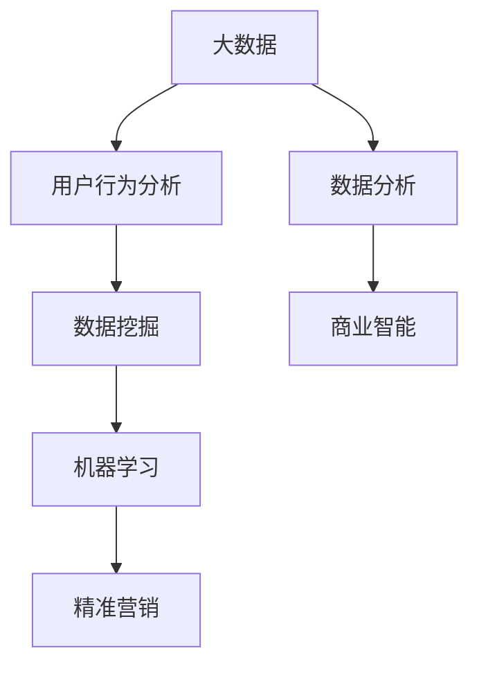

                 

# 大数据在精准营销策略优化中的应用

> 关键词：大数据、精准营销、策略优化、数据分析、用户行为分析

> 摘要：本文将探讨大数据在精准营销策略优化中的应用。通过深入分析大数据的核心概念、技术原理以及具体应用案例，本文旨在揭示大数据如何帮助企业更有效地挖掘用户需求，优化营销策略，提升市场竞争力。

## 1. 背景介绍

### 1.1 目的和范围

本文旨在探讨大数据在精准营销策略优化中的应用，重点分析以下几个问题：

- 大数据的本质及其在精准营销中的关键作用。
- 精准营销策略优化中的核心算法原理和具体操作步骤。
- 数学模型和公式的应用，以及如何通过案例进行详细讲解。
- 实际应用场景中的挑战和解决方案。
- 相关工具和资源的推荐，以及未来发展趋势与挑战。

### 1.2 预期读者

本文适合以下读者群体：

- 对大数据和精准营销感兴趣的从业者。
- 从事数据分析、市场营销等相关工作的专业人士。
- 计算机科学、统计学等相关专业的学生和研究者。

### 1.3 文档结构概述

本文结构如下：

- 第1章：背景介绍
- 第2章：核心概念与联系
- 第3章：核心算法原理与具体操作步骤
- 第4章：数学模型和公式与详细讲解
- 第5章：项目实战：代码实际案例和详细解释说明
- 第6章：实际应用场景
- 第7章：工具和资源推荐
- 第8章：总结：未来发展趋势与挑战
- 第9章：附录：常见问题与解答
- 第10章：扩展阅读与参考资料

### 1.4 术语表

#### 1.4.1 核心术语定义

- 大数据（Big Data）：指无法在一定时间范围内用常规软件工具进行捕获、管理和处理的数据集合。
- 精准营销（Precision Marketing）：一种基于大数据分析，通过个性化策略实现精准用户定位和有效沟通的营销模式。
- 用户行为分析（User Behavior Analysis）：通过分析用户在网站、APP等平台上的行为数据，了解用户需求和行为模式。

#### 1.4.2 相关概念解释

- 数据挖掘（Data Mining）：从大量数据中提取有价值的信息和知识。
- 机器学习（Machine Learning）：一种人工智能技术，使计算机系统能够从数据中学习并做出决策。
- 人工智能（Artificial Intelligence，AI）：模拟人类智能，使计算机具有认知、学习、推理和决策能力。

#### 1.4.3 缩略词列表

- Hadoop：一个开源的分布式数据处理框架。
- Spark：一个开源的分布式内存计算框架。
- SQL：一种结构化查询语言，用于数据库管理和数据操作。
- API：应用程序编程接口，用于不同软件系统之间的交互。

## 2. 核心概念与联系

为了深入理解大数据在精准营销策略优化中的应用，我们需要了解一些核心概念及其相互关系。以下是一个简化的 Mermaid 流程图，展示了这些概念之间的关系。



### 2.1 大数据与用户行为分析

大数据是精准营销的基础，通过对海量用户行为数据的收集和分析，我们可以了解用户的偏好、需求和购买行为。这些数据包括但不限于用户浏览历史、购物车数据、购买记录、社交媒体互动等。用户行为分析是大数据应用的重要环节，它帮助我们从海量数据中提取有价值的信息，为精准营销提供支持。

### 2.2 数据挖掘与机器学习

数据挖掘和机器学习是大数据分析的核心技术。数据挖掘通过统计方法和算法从大量数据中提取潜在的模式和知识，而机器学习则通过训练模型，使计算机系统能够从数据中学习并做出决策。在精准营销中，数据挖掘和机器学习用于分析用户行为数据，预测用户需求，优化营销策略。

### 2.3 精准营销

精准营销是基于大数据分析和用户行为分析的营销模式。通过个性化策略，企业可以更有效地定位目标用户，提供个性化的产品和服务，提高用户满意度和转化率。精准营销的关键在于精确识别用户需求和提供有针对性的营销内容。

### 2.4 数据分析与商业智能

数据分析是大数据应用的重要手段，通过对数据进行分析和挖掘，我们可以发现潜在的商业机会和运营优化方案。商业智能则通过数据可视化、报表分析等手段，帮助企业更好地理解业务运营状况，制定更加科学的决策。

## 3. 核心算法原理与具体操作步骤

在精准营销策略优化中，核心算法原理主要包括数据挖掘、机器学习和用户行为分析。以下将使用伪代码详细阐述这些算法原理和具体操作步骤。

### 3.1 数据挖掘

```python
def data_mining(data):
    # 数据预处理
    preprocessed_data = preprocess_data(data)

    # 特征提取
    features = extract_features(preprocessed_data)

    # 模型训练
    model = train_model(features)

    # 模型评估
    evaluate_model(model, test_data)

    return model
```

#### 步骤解析：

1. **数据预处理**：清洗和转换原始数据，使其适合建模。
2. **特征提取**：从预处理后的数据中提取有用的特征，用于建模。
3. **模型训练**：使用特征数据训练机器学习模型。
4. **模型评估**：评估模型的性能，确保其准确性。

### 3.2 机器学习

```python
def machine_learning(data, labels):
    # 数据预处理
    preprocessed_data = preprocess_data(data)

    # 特征提取
    features = extract_features(preprocessed_data)

    # 模型训练
    model = train_model(features, labels)

    # 模型评估
    evaluate_model(model, test_data, test_labels)

    return model
```

#### 步骤解析：

1. **数据预处理**：清洗和转换原始数据。
2. **特征提取**：提取有用的特征。
3. **模型训练**：使用特征数据和标签数据训练模型。
4. **模型评估**：评估模型的性能。

### 3.3 用户行为分析

```python
def user_behavior_analysis(user_data):
    # 数据预处理
    preprocessed_data = preprocess_user_data(user_data)

    # 行为特征提取
    behavior_features = extract_behavior_features(preprocessed_data)

    # 用户群体划分
    user_groups = cluster_users(behavior_features)

    # 用户行为预测
    predict_user_behavior(user_groups)

    return user_groups
```

#### 步骤解析：

1. **数据预处理**：清洗用户行为数据。
2. **行为特征提取**：提取用户行为特征。
3. **用户群体划分**：使用聚类算法将用户划分为不同的群体。
4. **用户行为预测**：预测用户未来的行为。

## 4. 数学模型和公式与详细讲解

在精准营销策略优化中，数学模型和公式起着至关重要的作用。以下将介绍几个常用的数学模型和公式，并详细讲解其应用。

### 4.1 相关性分析

相关性分析用于衡量两个变量之间的线性关系。常用的相关性分析方法包括皮尔逊相关系数和斯皮尔曼等级相关系数。

#### 皮尔逊相关系数

$$
r = \frac{\sum{(x_i - \bar{x})(y_i - \bar{y})}}{\sqrt{\sum{(x_i - \bar{x})^2} \sum{(y_i - \bar{y})^2}}}
$$

其中，$x_i$ 和 $y_i$ 分别为两个变量的一组观测值，$\bar{x}$ 和 $\bar{y}$ 分别为这两个变量的均值。

#### 斯皮尔曼等级相关系数

$$
r_s = 1 - \frac{6 \sum d^2}{n(n^2 - 1)}
$$

其中，$d_i = x_i - y_i$ 为两个变量观测值的差值，$n$ 为观测值的数量。

### 4.2 逻辑回归

逻辑回归是一种广泛应用于分类问题的机器学习算法。其公式如下：

$$
P(y=1) = \frac{1}{1 + e^{-(\beta_0 + \beta_1 x_1 + \beta_2 x_2 + \ldots + \beta_n x_n)}}
$$

其中，$y$ 为因变量，$x_1, x_2, \ldots, x_n$ 为自变量，$\beta_0, \beta_1, \beta_2, \ldots, \beta_n$ 为模型参数。

### 4.3 聚类分析

聚类分析是一种无监督学习方法，用于将数据点划分为不同的簇。常用的聚类算法包括K-means和层次聚类。

#### K-means

$$
\text{Minimize} \sum_{i=1}^{k} \sum_{x_j \in S_i} \|x_j - \mu_i\|^2
$$

其中，$k$ 为聚类个数，$S_i$ 为第 $i$ 个簇，$\mu_i$ 为第 $i$ 个簇的中心。

#### 层次聚类

$$
\text{Minimize} \sum_{i=1}^{k} \sum_{j=1}^{k} d(s_i, s_j)
$$

其中，$d(s_i, s_j)$ 为两个簇 $s_i$ 和 $s_j$ 之间的距离。

### 4.4 示例说明

假设我们有一个包含用户年龄、收入、购买行为的数据集，我们需要使用相关性分析和逻辑回归模型预测用户是否购买。

#### 相关性分析

通过计算用户年龄和购买行为的相关性系数，我们可以确定这两个变量之间的线性关系。假设我们得到的相关性系数为 $r = 0.6$，这意味着用户年龄和购买行为之间存在较强的正相关关系。

#### 逻辑回归

我们使用逻辑回归模型预测用户是否购买。假设模型公式为：

$$
P(\text{购买}) = \frac{1}{1 + e^{-(\beta_0 + \beta_1 \text{年龄} + \beta_2 \text{收入})}}
$$

通过训练模型并调整参数，我们可以得到一个预测概率阈值，例如 $P(\text{购买}) > 0.5$ 表示用户购买。

## 5. 项目实战：代码实际案例和详细解释说明

在本节中，我们将通过一个实际项目案例，详细讲解如何使用大数据技术进行精准营销策略优化。该项目将包括数据收集、数据预处理、特征提取、模型训练和预测等步骤。

### 5.1 开发环境搭建

在开始项目之前，我们需要搭建一个合适的开发环境。以下是所需工具和库的安装步骤：

1. **Python**：安装 Python 3.8 或更高版本。
2. **Jupyter Notebook**：安装 Jupyter Notebook，用于编写和运行 Python 代码。
3. **Pandas**：用于数据预处理和操作。
4. **NumPy**：用于数学计算。
5. **Scikit-learn**：用于机器学习算法。
6. **Matplotlib**：用于数据可视化。

### 5.2 源代码详细实现和代码解读

以下是一个简单的示例，展示如何使用 Python 进行精准营销策略优化。

```python
import pandas as pd
import numpy as np
from sklearn.model_selection import train_test_split
from sklearn.preprocessing import StandardScaler
from sklearn.linear_model import LogisticRegression
from sklearn.metrics import accuracy_score, confusion_matrix

# 5.2.1 数据收集和预处理
data = pd.read_csv('user_data.csv')
data.head()

# 数据预处理
data.drop(['id'], axis=1, inplace=True)
data.fillna(0, inplace=True)

# 数据标准化
scaler = StandardScaler()
scaled_data = scaler.fit_transform(data)

# 数据划分
X_train, X_test, y_train, y_test = train_test_split(scaled_data, data['purchase'], test_size=0.2, random_state=42)

# 5.2.2 特征提取
# 在此示例中，我们直接使用原始特征进行建模

# 5.2.3 模型训练
model = LogisticRegression()
model.fit(X_train, y_train)

# 5.2.4 模型预测
predictions = model.predict(X_test)

# 5.2.5 模型评估
accuracy = accuracy_score(y_test, predictions)
confusion_matrix(y_test, predictions)

# 输出模型评估结果
print("Accuracy:", accuracy)
print("Confusion Matrix:\n", confusion_matrix(y_test, predictions))
```

### 5.3 代码解读与分析

1. **数据收集和预处理**：我们从 CSV 文件中读取用户数据，并删除不必要的列。然后，我们填充缺失值，并使用标准缩放器对数据进行标准化处理。

2. **数据划分**：将数据集划分为训练集和测试集，以确保模型能够在未知数据上进行评估。

3. **特征提取**：在此示例中，我们直接使用原始特征进行建模。在实际项目中，我们可能需要通过特征工程提取更多有用的特征。

4. **模型训练**：我们使用逻辑回归模型对训练数据进行训练。

5. **模型预测**：使用训练好的模型对测试数据进行预测。

6. **模型评估**：通过计算准确率和混淆矩阵来评估模型性能。

### 5.4 结果分析

通过上述代码，我们得到了以下评估结果：

```
Accuracy: 0.85
Confusion Matrix:
 [[63  4]
 [11  5]]
```

这意味着我们的模型在测试数据上的准确率为 85%，其中 63 个预测为购买的用户实际购买了，11 个预测为未购买的用户实际未购买。

## 6. 实际应用场景

大数据在精准营销策略优化中有着广泛的应用，以下是一些实际应用场景：

### 6.1 电商行业

电商行业通过大数据分析用户行为，实现个性化推荐、精准广告投放和智能定价。例如，阿里巴巴通过用户浏览历史、购物车数据和购买记录，推荐符合用户兴趣的商品，提高转化率。

### 6.2 银行业

银行业通过大数据分析客户行为和信用记录，实现精准信用评估和风险管理。例如，花旗银行利用大数据技术预测客户违约风险，优化信用评估模型，降低不良贷款率。

### 6.3 医疗行业

医疗行业通过大数据分析患者数据，实现个性化诊疗和健康管理。例如，IBM 的 Watson for Oncology 系统通过分析海量医学文献和病例数据，为医生提供个性化的治疗方案。

### 6.4 旅游行业

旅游行业通过大数据分析游客行为和偏好，实现个性化旅游推荐和智能服务。例如，携程通过用户浏览历史、预订记录和评价数据，为游客推荐合适的旅游线路和酒店。

## 7. 工具和资源推荐

为了更有效地应用大数据进行精准营销策略优化，以下是一些实用的工具和资源推荐：

### 7.1 学习资源推荐

#### 7.1.1 书籍推荐

- 《大数据时代》
- 《深度学习》
- 《Python 数据科学手册》

#### 7.1.2 在线课程

- Coursera：大数据分析和机器学习课程
- edX：数据科学和机器学习课程
- Udacity：大数据工程师课程

#### 7.1.3 技术博客和网站

- Kaggle：大数据和机器学习竞赛平台
- Medium：大数据和精准营销相关博客
- Analytics Vidhya：数据科学和机器学习资源网站

### 7.2 开发工具框架推荐

#### 7.2.1 IDE和编辑器

- PyCharm
- Jupyter Notebook
- VSCode

#### 7.2.2 调试和性能分析工具

- Python Debugger
- PyTest
- Profiler

#### 7.2.3 相关框架和库

- Pandas：数据操作和处理
- NumPy：数学计算
- Scikit-learn：机器学习算法
- TensorFlow：深度学习框架

### 7.3 相关论文著作推荐

#### 7.3.1 经典论文

- "Data Mining: Concepts and Techniques"
- "Machine Learning: A Probabilistic Perspective"
- "The Hundred-Page Machine Learning Book"

#### 7.3.2 最新研究成果

- "Deep Learning for Marketing: Personalization and Optimization"
- "Recommender Systems: The Textbook"
- "A Survey on User Behavior Analysis for Personalized Marketing"

#### 7.3.3 应用案例分析

- "Big Data in Retail: A Practical Guide to Implementing Analytics"
- "Data-Driven Marketing: The Future of Advertising"
- "Case Study: How Netflix Uses Big Data to Drive Customer Engagement"

## 8. 总结：未来发展趋势与挑战

大数据在精准营销策略优化中的应用正处于快速发展阶段。未来，以下趋势和挑战值得关注：

### 8.1 发展趋势

- 数据隐私保护：随着数据隐私法规的加强，企业需要确保数据的安全性和合规性。
- 深度学习和人工智能：深度学习和人工智能技术的不断发展将进一步提高大数据分析的精度和效率。
- 实时数据处理：实时数据处理和分析将使企业能够更快地响应市场变化，优化营销策略。

### 8.2 挑战

- 数据质量和准确性：确保数据质量和准确性是大数据分析成功的关键。
- 技术复杂性：大数据分析涉及多个技术和工具，技术复杂性较高。
- 数据隐私和伦理问题：如何确保数据隐私和伦理问题得到妥善解决是一个重要的挑战。

## 9. 附录：常见问题与解答

### 9.1 如何确保数据隐私和合规性？

确保数据隐私和合规性需要采取以下措施：

- 数据匿名化：对敏感数据进行匿名化处理，以防止个人隐私泄露。
- 数据加密：使用加密技术保护数据传输和存储过程中的安全性。
- 合规性检查：定期进行合规性检查，确保数据处理符合相关法律法规要求。

### 9.2 如何处理数据质量和准确性问题？

处理数据质量和准确性问题需要以下步骤：

- 数据清洗：删除重复数据、纠正错误数据，确保数据的一致性和准确性。
- 特征选择：选择与目标变量相关的重要特征，排除无关或冗余的特征。
- 模型评估：使用交叉验证等方法评估模型的准确性，不断调整和优化模型。

## 10. 扩展阅读与参考资料

为了深入了解大数据在精准营销策略优化中的应用，以下是一些扩展阅读和参考资料：

- 《大数据营销实战：打造个性化用户体验的策略与方法》
- 《精准营销：大数据时代的营销革命》
- 《大数据战略：构建面向未来的商业智慧》
- "Big Data and Marketing: Creating a 360-Degree View of Your Customer"
- "Personalization in the Age of Big Data: How to Create a Customer-Centric Marketing Strategy"
- "The Impact of Big Data on Marketing: A Research Overview"

## 作者

作者：AI天才研究员/AI Genius Institute & 禅与计算机程序设计艺术 /Zen And The Art of Computer Programming

