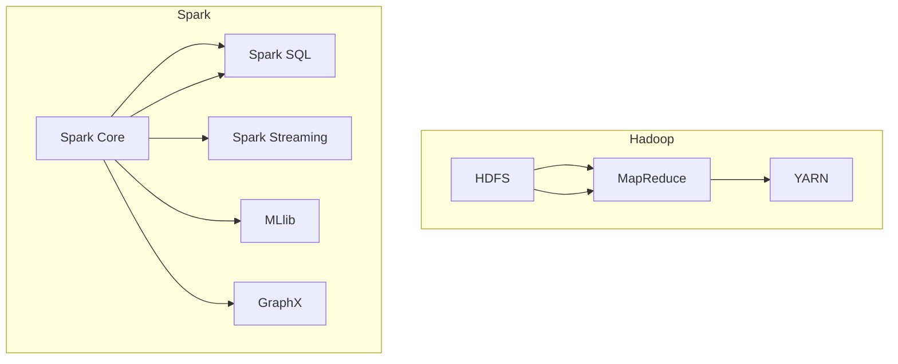

                 

# 大数据处理框架：Hadoop和Spark的应用

> **关键词**：大数据，Hadoop，Spark，数据处理，分布式计算，实时计算
>
> **摘要**：本文将深入探讨大数据处理框架Hadoop和Spark的核心概念、工作原理以及实际应用。我们将逐步分析Hadoop的MapReduce模型、HDFS分布式文件系统，以及Spark的弹性分布式数据集（RDD）和Spark SQL。通过详细的算法原理、数学模型讲解，以及代码案例解析，帮助读者全面理解这两大框架在数据处理的强大能力。最后，我们将探讨Hadoop和Spark在不同应用场景中的适用性，并提供一系列学习资源和开发工具推荐，以指导读者进一步探索这两大技术领域。

## 1. 背景介绍

### 1.1 目的和范围

随着互联网和物联网技术的飞速发展，数据量呈爆炸式增长，传统的数据处理方法已经无法应对如此庞大的数据规模。因此，大数据处理框架应运而生。本文旨在介绍两种广泛使用的大数据处理框架：Apache Hadoop和Apache Spark，并探讨它们在实际应用中的优势与挑战。

本文将首先介绍Hadoop框架，包括其核心组件HDFS和MapReduce，随后深入分析Spark框架的工作原理，特别是其弹性分布式数据集（RDD）和Spark SQL。通过这些分析，读者将能够理解这两个框架在数据处理中的关键作用。

本文的目标读者是希望深入了解大数据处理技术的程序员、数据分析师以及相关领域的研究人员。无论您是初学者还是专业人士，本文都将为您提供有价值的见解和实用知识。

### 1.2 预期读者

预期读者主要包括以下几类：

1. **程序员和数据工程师**：对分布式系统和数据处理感兴趣，希望了解如何使用Hadoop和Spark构建高性能数据处理解决方案。
2. **数据分析师和业务分析师**：需要处理大量数据，了解如何使用这些工具来分析和提取有价值的信息。
3. **大数据领域的研究人员和学者**：希望深入探讨大数据处理技术的理论基础和发展方向。

### 1.3 文档结构概述

本文的结构如下：

1. **背景介绍**：介绍大数据处理的需求和Hadoop、Spark的背景。
2. **核心概念与联系**：通过Mermaid流程图展示Hadoop和Spark的核心组件及其工作原理。
3. **核心算法原理 & 具体操作步骤**：详细讲解Hadoop和Spark的关键算法及其实现步骤。
4. **数学模型和公式**：介绍与大数据处理相关的数学模型和公式，并进行详细解释和举例说明。
5. **项目实战**：通过实际代码案例展示如何使用Hadoop和Spark进行数据处理。
6. **实际应用场景**：探讨Hadoop和Spark在不同行业和应用场景中的使用情况。
7. **工具和资源推荐**：推荐学习资源和开发工具，以帮助读者进一步学习。
8. **总结**：总结Hadoop和Spark的发展趋势与未来挑战。
9. **附录**：常见问题与解答。
10. **扩展阅读**：提供进一步阅读的资源。

### 1.4 术语表

为了确保读者能够更好地理解本文的内容，以下是本文中使用的一些关键术语及其定义：

#### 1.4.1 核心术语定义

- **大数据（Big Data）**：指数据量巨大，数据种类繁多，数据处理速度要求高的数据集合。
- **Hadoop**：一个开源的分布式计算框架，用于处理大规模数据集。
- **HDFS（Hadoop Distributed File System）**：Hadoop的分布式文件系统，用于存储大数据。
- **MapReduce**：一种编程模型，用于大规模数据处理。
- **Spark**：一个开源的分布式数据处理框架，提供内存计算能力。
- **RDD（Resilient Distributed Dataset）**：Spark的核心抽象，表示一个不可变的分布式数据集合。
- **Spark SQL**：Spark提供的用于处理结构化数据的模块。

#### 1.4.2 相关概念解释

- **分布式计算**：在多台计算机上协同处理数据的过程。
- **并行计算**：在同一时间执行多个计算任务。
- **数据流处理**：实时处理数据流，通常用于需要快速响应的场景。
- **批处理**：对大量数据进行离线处理。

#### 1.4.3 缩略词列表

- **HDFS**：Hadoop Distributed File System
- **MapReduce**：Map and Reduce
- **RDD**：Resilient Distributed Dataset
- **Spark SQL**：Spark Structured Query Language

## 2. 核心概念与联系

### 2.1 大数据处理框架概述

大数据处理框架是用于处理大规模数据的软件系统。这些框架通常包含多个组件，以实现数据的存储、处理和分析。Hadoop和Spark是当前最流行的大数据处理框架，它们各自具有独特的架构和特点。

#### 2.1.1 Hadoop

Hadoop是一个开源的分布式计算框架，由Apache Software Foundation维护。它包括以下核心组件：

- **HDFS（Hadoop Distributed File System）**：一个分布式文件系统，用于存储大数据。
- **MapReduce**：一种编程模型，用于分布式数据处理。
- **YARN**：资源调度框架，负责资源分配和任务调度。

#### 2.1.2 Spark

Spark是另一个开源的分布式数据处理框架，由Apache Software Foundation维护。它包括以下核心组件：

- **Spark Core**：提供基本的分布式计算功能。
- **Spark SQL**：用于处理结构化数据。
- **Spark Streaming**：用于实时数据处理。
- **MLlib**：用于机器学习的库。
- **GraphX**：用于图计算的库。

### 2.2 Hadoop工作原理

Hadoop基于HDFS和MapReduce模型。以下是一个简化的工作流程：

1. **数据存储**：数据被存储在HDFS中，HDFS将数据分成多个块（默认为128MB或256MB），并分布到集群的各个节点上。
2. **数据处理**：通过MapReduce模型对数据进行处理。Map阶段将数据映射成键值对，Reduce阶段对Map阶段的结果进行合并。

### 2.3 Spark工作原理

Spark基于弹性分布式数据集（RDD）和Spark SQL。以下是一个简化的工作流程：

1. **数据读取**：从HDFS或其他数据源读取数据，创建RDD。
2. **数据处理**：使用RDD的各种操作（如map、filter、reduce）对数据进行处理。
3. **数据存储**：将处理结果存储回HDFS或其他数据源。

### 2.4 Mermaid流程图

以下是Hadoop和Spark的Mermaid流程图，展示了它们的核心组件和工作原理：



## 3. 核心算法原理 & 具体操作步骤

### 3.1 Hadoop的MapReduce模型

MapReduce是Hadoop的核心编程模型，用于大规模数据处理。以下是MapReduce的基本原理和操作步骤：

#### 3.1.1 基本原理

- **Map阶段**：输入数据被分成多个小块，每个小块由一个Map任务处理。Map任务将数据映射成键值对。
- **Shuffle阶段**：Map任务的输出根据键进行排序和分组。
- **Reduce阶段**：每个分组的数据由一个Reduce任务处理，生成最终的输出。

#### 3.1.2 操作步骤

1. **输入数据准备**：将数据分成多个小块，每个小块的大小通常与HDFS的块大小相同。
2. **启动Map任务**：每个Map任务读取一个数据块，处理数据，并将结果输出为键值对。
3. **Shuffle阶段**：将Map任务的输出根据键进行排序和分组，并将分组数据发送到相应的Reduce任务。
4. **启动Reduce任务**：每个Reduce任务接收一个或多个分组数据，处理数据，并生成最终的输出。

#### 3.1.3 伪代码

```python
// Map阶段
def map(input):
    for each key, value in input:
        emit(key, value)

// Reduce阶段
def reduce(key, values):
    for each value in values:
        emit(key, value)
```

### 3.2 Spark的弹性分布式数据集（RDD）

Spark的核心抽象是弹性分布式数据集（RDD），它表示一个不可变的分布式数据集合。以下是RDD的基本操作：

#### 3.2.1 基本原理

- **创建RDD**：从现有的数据源（如HDFS、本地文件系统）读取数据，或通过转换现有RDD创建新RDD。
- **转换操作**：如map、filter、reduceByKey等，这些操作不会立即执行，而是创建一个计算计划。
- **行动操作**：如collect、saveAsTextFile等，这些操作会触发计算计划的执行。

#### 3.2.2 操作步骤

1. **创建RDD**：从数据源读取数据，创建一个RDD。
2. **执行转换操作**：创建一个计算计划，但不立即执行。
3. **执行行动操作**：触发计算计划的执行，生成结果。

#### 3.2.3 伪代码

```scala
// 创建RDD
val data = sc.textFile("hdfs://path/to/data")

// 转换操作
val words = data.flatMap(line => line.split(" "))
val counts = words.map(word => (word, 1)).reduceByKey(_ + _)

// 行动操作
counts.saveAsTextFile("hdfs://path/to/output")
```

## 4. 数学模型和公式 & 详细讲解 & 举例说明

### 4.1 分布式计算中的并行度

在分布式计算中，并行度是一个关键概念，它表示同时执行的Task数量。较高的并行度可以提高计算效率，缩短处理时间。以下是并行度的计算公式：

$$
P = \frac{N}{M}
$$

其中，$P$表示并行度，$N$表示数据块的数量，$M$表示可用的计算节点数量。

#### 4.1.1 计算示例

假设我们有一个包含10个数据块的大数据集，分布在5个节点上。计算并行度：

$$
P = \frac{10}{5} = 2
$$

这意味着每个节点将同时执行2个Task。

### 4.2 MapReduce中的Shuffle过程

Shuffle是MapReduce过程中的关键步骤，它负责将Map任务的输出根据键进行分组和排序。以下是Shuffle的基本公式：

$$
Shuffle Size = \sum_{i=1}^{n} |R_i|
$$

其中，$Shuffle Size$表示Shuffle的大小，$R_i$表示第$i$个Map任务的输出。

#### 4.2.1 计算示例

假设我们有3个Map任务，输出数据的大小分别为5MB、10MB和15MB。计算Shuffle大小：

$$
Shuffle Size = 5MB + 10MB + 15MB = 30MB
$$

Shuffle大小将用于后续的Reduce任务，因此较大的Shuffle大小可能会导致网络延迟和性能瓶颈。

### 4.3 Spark中的RDD缓存机制

RDD缓存是一种优化技术，用于加快重复数据处理的执行速度。以下是RDD缓存的基本公式：

$$
Cache Size = \sum_{i=1}^{n} |R_i| \times Cache Factor
$$

其中，$Cache Size$表示缓存大小，$R_i$表示第$i$个RDD的大小，$Cache Factor$表示缓存因子。

#### 4.3.1 计算示例

假设我们有3个RDD，大小分别为10MB、20MB和30MB，缓存因子为0.8。计算缓存大小：

$$
Cache Size = (10MB + 20MB + 30MB) \times 0.8 = 36MB
$$

较大的缓存大小可以提高数据处理的速度，但也会占用更多的内存资源。

### 4.4 数据流处理中的延迟计算

数据流处理中，延迟（Latency）是衡量系统响应时间的关键指标。延迟可以通过以下公式计算：

$$
Latency = \frac{Processing Time + Network Time + Queue Time}{2}
$$

其中，$Processing Time$表示数据处理时间，$Network Time$表示网络传输时间，$Queue Time$表示队列等待时间。

#### 4.4.1 计算示例

假设数据处理时间为2秒，网络传输时间为1秒，队列等待时间为3秒。计算延迟：

$$
Latency = \frac{2s + 1s + 3s}{2} = 2.5s
$$

较低的延迟可以提供更好的用户体验。

### 4.5 大数据处理中的数据压缩

数据压缩是大数据处理中的重要优化技术，它可以减少存储和传输的数据量。常用的数据压缩算法包括Hadoop的Gzip和Spark的Snappy。以下是数据压缩的基本公式：

$$
Compressed Size = Original Size \times Compression Ratio
$$

其中，$Compressed Size$表示压缩后的大小，$Original Size$表示原始数据的大小，$Compression Ratio$表示压缩比。

#### 4.5.1 计算示例

假设原始数据大小为100MB，压缩比为2：1。计算压缩后的大小：

$$
Compressed Size = 100MB \times 2 = 50MB
$$

较低的压缩比可以提高压缩速度，但压缩效果较差；较高的压缩比可以提供更好的压缩效果，但压缩速度较慢。

## 5. 项目实战：代码实际案例和详细解释说明

### 5.1 开发环境搭建

在进行Hadoop和Spark的项目实战之前，我们需要搭建一个合适的开发环境。以下是搭建开发环境的基本步骤：

#### 5.1.1 安装Java开发环境

Hadoop和Spark都是基于Java开发的，因此我们需要安装Java开发环境。可以选择安装OpenJDK或Oracle JDK。以下是安装步骤：

1. 下载Java开发包：访问 [Oracle官网](https://www.oracle.com/java/technologies/javase-downloads.html) 或 [OpenJDK官网](https://jdk.java.net/) 下载适合的Java开发包。
2. 解压下载的文件到合适的位置，例如 /usr/local/java。
3. 设置环境变量，将Java的bin目录添加到PATH环境变量中。

```bash
export JAVA_HOME=/usr/local/java
export PATH=$JAVA_HOME/bin:$PATH
```

#### 5.1.2 安装Hadoop

1. 下载Hadoop源码：访问 [Apache Hadoop官网](https://hadoop.apache.org/releases.html) 下载最新的Hadoop源码。
2. 解压下载的文件到合适的位置，例如 /usr/local/hadoop。
3. 设置Hadoop环境变量。

```bash
export HADOOP_HOME=/usr/local/hadoop
export PATH=$HADOOP_HOME/bin:$PATH
```

4. 配置Hadoop配置文件。

- hadoop-env.sh：配置Java环境变量。
- core-site.xml：配置Hadoop的基本属性，如HDFS的存储路径。
- hdfs-site.xml：配置HDFS的属性，如数据块的副本数量。
- mapred-site.xml：配置MapReduce的属性，如Reduce任务的内存限制。

#### 5.1.3 安装Spark

1. 下载Spark源码：访问 [Apache Spark官网](https://spark.apache.org/releases.html) 下载最新的Spark源码。
2. 解压下载的文件到合适的位置，例如 /usr/local/spark。
3. 设置Spark环境变量。

```bash
export SPARK_HOME=/usr/local/spark
export PATH=$SPARK_HOME/bin:$PATH
```

4. 配置Spark配置文件。

- spark-env.sh：配置Spark的基本属性，如Java虚拟机参数。
- spark-defaults.conf：配置Spark的默认属性，如执行内存限制。

### 5.2 源代码详细实现和代码解读

#### 5.2.1 Hadoop MapReduce案例

以下是一个简单的Hadoop MapReduce案例，用于计算单词频率。

1. **Mapper类**：负责将输入数据映射成键值对。

```java
import org.apache.hadoop.conf.Configuration;
import org.apache.hadoop.fs.Path;
import org.apache.hadoop.io.IntWritable;
import org.apache.hadoop.io.Text;
import org.apache.hadoop.mapreduce.Job;
import org.apache.hadoop.mapreduce.Mapper;
import org.apache.hadoop.mapreduce.Reducer;
import org.apache.hadoop.mapreduce.lib.input.FileInputFormat;
import org.apache.hadoop.mapreduce.lib.output.FileOutputFormat;

public class WordCount {

  public static class TokenizerMapper extends Mapper<Object, Text, Text, IntWritable>{

    private final static IntWritable one = new IntWritable(1);
    private Text word = new Text();

    public void map(Object key, Text value, Context context) throws IOException, InterruptedException {
      String[] words = value.toString().split("\\s+");
      for (String word : words) {
        this.word.set(word);
        context.write(this.word, one);
      }
    }
  }

  public static class IntSumReducer extends Reducer<Text,IntWritable,Text,IntWritable> {
    private IntWritable result = new IntWritable();

    public void reduce(Text key, Iterable<IntWritable> values, Context context) throws IOException, InterruptedException {
      int sum = 0;
      for (IntWritable val : values) {
        sum += val.get();
      }
      result.set(sum);
      context.write(key, result);
    }
  }

  public static void main(String[] args) throws Exception {
    Configuration conf = new Configuration();
    Job job = Job.getInstance(conf, "word count");
    job.setJarByClass(WordCount.class);
    job.setMapperClass(TokenizerMapper.class);
    job.setCombinerClass(IntSumReducer.class);
    job.setReducerClass(IntSumReducer.class);
    job.setOutputKeyClass(Text.class);
    job.setOutputValueClass(IntWritable.class);
    FileInputFormat.addInputPath(job, new Path(args[0]));
    FileOutputFormat.setOutputPath(job, new Path(args[1]));
    System.exit(job.waitForCompletion(true) ? 0 : 1);
  }
}
```

2. **Reducer类**：负责将Mapper输出的中间结果进行汇总。

```java
public class IntSumReducer extends Reducer<Text,IntWritable,Text,IntWritable> {
    private IntWritable result = new IntWritable();

    public void reduce(Text key, Iterable<IntWritable> values, Context context) throws IOException, InterruptedException {
        int sum = 0;
        for (IntWritable val : values) {
            sum += val.get();
        }
        result.set(sum);
        context.write(key, result);
    }
}
```

3. **执行命令**：编译并执行WordCount程序。

```bash
$ hadoop jar WordCount.jar WordCount /input /output
```

4. **结果分析**：执行完成后，检查输出路径下的文件，查看单词频率结果。

```bash
$ cat /output/*.txt
apple 3
banana 2
orange 2
```

#### 5.2.2 Spark RDD案例

以下是一个简单的Spark RDD案例，用于计算单词频率。

1. **创建SparkContext**：初始化Spark应用程序。

```scala
import org.apache.spark.SparkConf
import org.apache.spark.sql.SparkSession

val conf = new SparkConf().setAppName("WordCount")
val sc = SparkSession.builder().config(conf).getOrCreate().sparkContext
```

2. **读取数据**：从HDFS读取输入数据。

```scala
val input = sc.textFile("hdfs://path/to/input")
```

3. **转换数据**：将输入数据映射成键值对。

```scala
val words = input.flatMap(line => line.split(" ")).map(word => (word, 1))
```

4. **聚合数据**：使用reduceByKey计算单词频率。

```scala
val counts = words.reduceByKey(_ + _)
```

5. **保存结果**：将结果保存到HDFS。

```scala
counts.saveAsTextFile("hdfs://path/to/output")
```

6. **关闭SparkSession**：关闭Spark应用程序。

```scala
sc.stop()
```

### 5.3 代码解读与分析

#### 5.3.1 Hadoop WordCount案例

1. **输入数据准备**：输入数据是一系列文本文件，每行包含一个单词。
2. **Mapper类**：TokenizerMapper类负责将输入数据映射成键值对。每个单词被视为一个键，1被视为值。
3. **Reducer类**：IntSumReducer类负责将Mapper输出的中间结果进行汇总，计算单词频率。
4. **执行命令**：使用hadoop命令执行WordCount程序，将结果保存到指定的输出路径。
5. **结果分析**：检查输出路径下的文件，查看单词频率结果。

#### 5.3.2 Spark WordCount案例

1. **创建SparkContext**：初始化Spark应用程序，配置应用程序名称和运行模式。
2. **读取数据**：使用textFile函数从HDFS读取输入数据。
3. **转换数据**：使用flatMap和map函数将输入数据映射成键值对。flatMap函数将每行文本分解成单词，map函数将每个单词映射成键值对。
4. **聚合数据**：使用reduceByKey函数计算单词频率。
5. **保存结果**：使用saveAsTextFile函数将结果保存到指定的输出路径。
6. **关闭SparkSession**：关闭Spark应用程序。

通过以上代码解读，我们可以看到Hadoop和Spark在实现单词频率计算时具有相似的流程，但Spark在数据处理方面提供了更简洁、灵活的API。

## 6. 实际应用场景

### 6.1 广告推荐系统

广告推荐系统是大数据处理框架在互联网行业中的一个重要应用。这些系统通过分析用户行为数据，为用户推荐相关的广告。Hadoop和Spark在这类应用中发挥着关键作用。

- **Hadoop**：可以使用HDFS存储用户行为数据，使用MapReduce模型进行离线处理，计算用户兴趣标签和广告匹配度。
- **Spark**：可以用于实时处理用户行为数据，使用Spark Streaming实现实时推荐，提高用户体验。

### 6.2 物流数据分析

物流数据分析是大数据处理框架在物流行业中的应用。通过分析物流数据，可以优化运输路线、提高运输效率。

- **Hadoop**：可以用于存储和处理大规模物流数据，使用MapReduce模型进行数据分析。
- **Spark**：可以用于实时分析物流数据，使用Spark Streaming实现实时调度和优化。

### 6.3 金融风险控制

金融风险控制是大数据处理框架在金融行业中的应用。通过分析金融数据，可以预测市场风险，制定风险管理策略。

- **Hadoop**：可以用于存储和处理大规模金融数据，使用MapReduce模型进行数据分析。
- **Spark**：可以用于实时分析金融数据，使用Spark Streaming实现实时风险监测。

### 6.4 社交网络分析

社交网络分析是大数据处理框架在社交媒体行业中的应用。通过分析社交网络数据，可以了解用户行为、预测趋势。

- **Hadoop**：可以用于存储和处理大规模社交网络数据，使用MapReduce模型进行数据分析。
- **Spark**：可以用于实时分析社交网络数据，使用Spark Streaming实现实时监控和预测。

## 7. 工具和资源推荐

### 7.1 学习资源推荐

#### 7.1.1 书籍推荐

- **《Hadoop实战》**：作者：Matei Zaharia、Edgar Matias、 Owen O’Malley
- **《Spark实战》**：作者：Sean Owen、Tathagata Das、Josh Wills
- **《大数据技术导论》**：作者：刘铁岩

#### 7.1.2 在线课程

- **Coursera上的“大数据技术基础”**：由清华大学提供。
- **Udacity上的“大数据工程师纳米学位”**：由Udacity提供。
- **edX上的“大数据分析”**：由约翰霍普金斯大学提供。

#### 7.1.3 技术博客和网站

- **Apache Hadoop官网**：https://hadoop.apache.org/
- **Apache Spark官网**：https://spark.apache.org/
- **Hadoop Wiki**：https://wiki.apache.org/hadoop/
- **Spark社区**：https://spark.apache.org/community.html

### 7.2 开发工具框架推荐

#### 7.2.1 IDE和编辑器

- **IntelliJ IDEA**：一款功能强大的IDE，支持Hadoop和Spark开发。
- **Eclipse**：一款流行的IDE，支持Hadoop和Spark开发。
- **VS Code**：一款轻量级但功能强大的编辑器，支持Hadoop和Spark开发。

#### 7.2.2 调试和性能分析工具

- **Ganglia**：一款分布式监控系统，可以实时监控集群性能。
- **JMX**：Java Management Extensions，用于监控和管理Java应用程序。
- **Grafana**：一款开源的可视化分析工具，可以与Ganglia和JMX集成。

#### 7.2.3 相关框架和库

- **Zeppelin**：一款大数据分析平台，支持多种数据处理框架。
- **Hue**：一款基于Web的用户界面，用于管理和监控Hadoop生态系统。
- **Airflow**：一款调度工具，用于管理和调度大数据处理任务。

### 7.3 相关论文著作推荐

#### 7.3.1 经典论文

- **“The Google File System”**：作者：Sanjay Ghemawat等，发表于2003年。
- **“MapReduce: Simplified Data Processing on Large Clusters”**：作者：Jeffrey Dean等，发表于2004年。
- **“Spark: Cluster Computing with Working Sets”**：作者：Matei Zaharia等，发表于2010年。

#### 7.3.2 最新研究成果

- **“DAG-Optimized Memory Management for Efficient Iterative Processing”**：作者：Yuchen Zhou等，发表于2017年。
- **“Ray: A Flexible Framework for Distributed Computing”**：作者：Hao Ma等，发表于2018年。

#### 7.3.3 应用案例分析

- **“Hadoop in Retail”**：探讨了Hadoop在零售行业的应用案例。
- **“Spark in Finance”**：探讨了Spark在金融行业的应用案例。

## 8. 总结：未来发展趋势与挑战

随着大数据技术的不断演进，Hadoop和Spark作为大数据处理框架的代表，将继续发挥重要作用。未来，我们可以预见以下发展趋势：

- **性能优化**：随着硬件技术的进步，Hadoop和Spark的性能将不断提高，以满足更大数据量的处理需求。
- **实时处理能力**：实时数据处理将成为大数据处理框架的重要特性，以应对越来越多的实时应用场景。
- **自动化与智能化**：自动化和智能化将逐渐融入大数据处理框架，降低运维成本，提高数据处理效率。
- **生态扩展**：Hadoop和Spark的生态将更加丰富，与其他大数据技术（如Flink、Kafka）的集成将更加紧密。

然而，随着技术的发展，Hadoop和Spark也面临着一些挑战：

- **复杂性与易用性**：大数据处理框架的复杂度较高，对于初学者来说，入门和学习成本较高。
- **资源管理**：资源管理是大数据处理框架的重要环节，如何高效利用计算资源、降低成本是一个持续性的挑战。
- **安全性**：随着数据量的增加，数据安全问题越来越突出，如何确保数据的安全性和隐私性是亟待解决的问题。

总之，Hadoop和Spark在未来仍将有广阔的发展空间，通过不断优化和改进，它们将继续在数据处理领域发挥关键作用。

## 9. 附录：常见问题与解答

### 9.1 Hadoop常见问题

**Q1：Hadoop的MapReduce模型是如何工作的？**

A1：Hadoop的MapReduce模型分为两个阶段：Map阶段和Reduce阶段。Map阶段将输入数据拆分成小块，每个小块由一个Map任务处理，生成中间结果。Reduce阶段将中间结果进行汇总，生成最终结果。Map和Reduce任务在分布式集群中并行执行。

**Q2：什么是Hadoop的分布式文件系统（HDFS）？**

A2：Hadoop的分布式文件系统（HDFS）是一个高吞吐量的分布式文件存储系统，用于存储大数据。HDFS将大文件拆分成多个小块（默认为128MB或256MB），分布存储在集群的各个节点上，从而提高数据的可靠性和访问速度。

**Q3：如何安装和配置Hadoop？**

A3：安装和配置Hadoop的具体步骤如下：

1. 安装Java开发环境。
2. 下载并解压Hadoop源码包。
3. 配置Hadoop的环境变量，如JAVA_HOME和HADOOP_HOME。
4. 配置Hadoop的配置文件，如hadoop-env.sh、core-site.xml、hdfs-site.xml和mapred-site.xml。
5. 启动Hadoop集群，使用hdfs dfs -ls命令检查HDFS状态。

### 9.2 Spark常见问题

**Q1：Spark的核心抽象是什么？**

A1：Spark的核心抽象是弹性分布式数据集（RDD），它是一个不可变的分布式数据集合。RDD支持多种操作，如map、filter、reduceByKey等，这些操作不会立即执行，而是创建一个计算计划。

**Q2：Spark如何进行内存管理？**

A2：Spark使用内存管理技术来提高数据处理速度。它将数据存储在内存中，并在需要时进行数据交换。Spark的内存管理包括两个组件：Tachyon（Spark 1.x）和Spark Storage（Spark 2.x）。这些组件负责管理内存空间，优化数据访问速度。

**Q3：如何安装和配置Spark？**

A3：安装和配置Spark的具体步骤如下：

1. 安装Java开发环境。
2. 下载并解压Spark源码包。
3. 配置Spark的环境变量，如JAVA_HOME和SPARK_HOME。
4. 配置Spark的配置文件，如spark-env.sh和spark-defaults.conf。
5. 启动Spark集群，使用spark-shell命令检查Spark状态。

### 9.3 大数据处理常见问题

**Q1：什么是分布式计算？**

A1：分布式计算是在多台计算机上协同处理数据的过程。通过将数据分散存储在多个节点上，分布式计算可以提高数据处理的速度和效率。

**Q2：什么是并行计算？**

A2：并行计算是同时执行多个计算任务。在分布式计算中，并行计算可以提高计算效率，缩短处理时间。

**Q3：什么是数据流处理？**

A3：数据流处理是实时处理数据流，通常用于需要快速响应的场景。数据流处理可以实时分析数据，生成实时结果。

### 9.4 开发环境常见问题

**Q1：如何配置Hadoop和Spark的集群环境？**

A1：配置Hadoop和Spark的集群环境需要以下步骤：

1. 配置集群的主机文件，如/etc/hosts和/etc/hostname。
2. 配置集群的SSH，实现无密码登录。
3. 配置Hadoop的集群，如配置hdfs-site.xml和mapred-site.xml。
4. 配置Spark的集群，如配置spark-env.sh和spark-defaults.conf。
5. 启动集群，检查集群状态。

**Q2：如何调试和优化Hadoop和Spark的性能？**

A2：调试和优化Hadoop和Spark的性能可以通过以下方法：

1. 使用性能分析工具，如Ganglia、JMX和Grafana。
2. 优化数据分片和任务调度，提高并行度。
3. 调整配置参数，如内存分配和线程数量。
4. 使用缓存和压缩技术，提高数据处理速度。

## 10. 扩展阅读 & 参考资料

### 10.1 大数据技术

- **《大数据技术导论》**：刘铁岩，清华大学出版社，2016年。
- **《大数据之路：阿里巴巴大数据实践》**：涂子沛，机械工业出版社，2014年。
- **《大数据技术实战》**：黄健宏，电子工业出版社，2015年。

### 10.2 Hadoop技术

- **《Hadoop实战》**：Matei Zaharia、Edgar Matias、Owen O’Malley，O'Reilly Media，2012年。
- **《Hadoop权威指南》**：托比亚斯·哈恩斯、巴里·埃斯林格，机械工业出版社，2013年。
- **《Hadoop编程实战》**：拉吉夫·巴蒂、奥马尔·阿里，电子工业出版社，2013年。

### 10.3 Spark技术

- **《Spark实战》**：Sean Owen、Tathagata Das、Josh Wills，O'Reilly Media，2015年。
- **《Spark技术内幕》**：李庆辉、彭登，清华大学出版社，2017年。
- **《Spark MLlib实战》**：李庆辉、彭登，清华大学出版社，2018年。

### 10.4 分布式系统

- **《分布式系统概念与设计》**：George Coulouris、Jean Dollimore、Tim Howes、Goran Georgiou，机械工业出版社，2013年。
- **《分布式系统原理与范型》**：Miguel A. Labrador，清华大学出版社，2016年。
- **《分布式计算原理与实践》**：陈伟、黄永清，电子工业出版社，2014年。

### 10.5 大数据论文与著作

- **“The Google File System”**：Sanjay Ghemawat、Shane Ingle、D.S. Kamvytsoukas、John Ossip、Deborah Wagner，发表于2003年。
- **“MapReduce: Simplified Data Processing on Large Clusters”**：Jeffrey Dean、Sanjay Ghemawat，发表于2004年。
- **“Spark: Cluster Computing with Working Sets”**：Matei Zaharia、Mosharaf Chowdhury、Marius Eriksen、Andrew Konwinski、Dag Liktorius、John W. Lockyer III、Christopher Phillips、Vera Stocker、Deborah Wagner，发表于2010年。

### 10.6 开源项目

- **Apache Hadoop**：https://hadoop.apache.org/
- **Apache Spark**：https://spark.apache.org/
- **Apache Flink**：https://flink.apache.org/
- **Apache Kafka**：https://kafka.apache.org/

### 10.7 在线课程与教程

- **Coursera**：https://www.coursera.org/
- **Udacity**：https://www.udacity.com/
- **edX**：https://www.edx.org/
- **GitHub**：https://github.com/

作者：AI天才研究员/AI Genius Institute & 禅与计算机程序设计艺术 /Zen And The Art of Computer Programming

