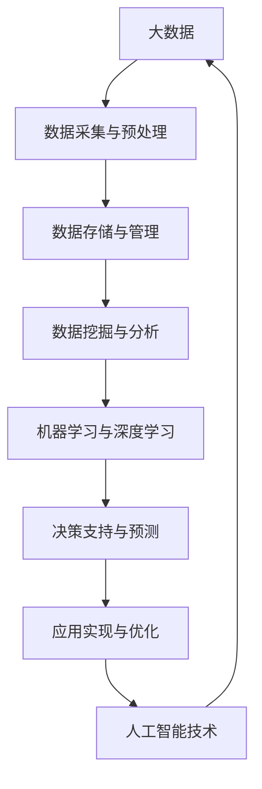

                 

# 大数据对AI发展的影响

> 关键词：大数据、人工智能、AI发展、算法优化、数据处理、机器学习、深度学习

> 摘要：随着大数据时代的到来，数据规模和复杂度呈爆炸式增长，为人工智能（AI）的发展带来了新的机遇和挑战。本文将探讨大数据对AI发展的深刻影响，从核心概念、算法原理、数学模型、实战案例等多个角度进行分析，旨在为读者提供一个全面而深入的视角。

## 1. 背景介绍

### 1.1 目的和范围

本文旨在探讨大数据对人工智能（AI）发展的深远影响。我们将分析大数据如何推动AI算法的优化，影响数据处理方式，以及AI在实际应用中的挑战和机遇。文章内容将涵盖以下几个核心方面：

1. 核心概念与联系
2. 核心算法原理 & 具体操作步骤
3. 数学模型和公式 & 详细讲解 & 举例说明
4. 项目实战：代码实际案例和详细解释说明
5. 实际应用场景
6. 工具和资源推荐
7. 总结：未来发展趋势与挑战

### 1.2 预期读者

本文适合对AI和大数据有基本了解的读者，包括AI研究者、工程师、技术经理以及对这两个领域感兴趣的技术爱好者。文章力求通过详细的解析，使读者能够深入理解大数据与AI之间的互动关系。

### 1.3 文档结构概述

本文将按照以下结构进行展开：

1. **背景介绍**：介绍文章的目的和范围，预期读者以及文档结构。
2. **核心概念与联系**：介绍大数据和AI的核心概念，使用流程图展示两者之间的关系。
3. **核心算法原理 & 具体操作步骤**：讲解大数据环境中常见的AI算法及其原理，通过伪代码详细阐述。
4. **数学模型和公式 & 详细讲解 & 举例说明**：介绍AI算法中的数学模型，使用LaTeX格式展示并举例说明。
5. **项目实战：代码实际案例和详细解释说明**：通过实际代码案例展示AI算法在大数据中的应用。
6. **实际应用场景**：讨论AI在大数据领域的实际应用。
7. **工具和资源推荐**：推荐学习资源、开发工具和框架。
8. **总结：未来发展趋势与挑战**：总结文章观点，探讨未来发展趋势和面临的挑战。
9. **附录：常见问题与解答**：提供常见问题解答。
10. **扩展阅读 & 参考资料**：推荐进一步阅读的资料。

### 1.4 术语表

#### 1.4.1 核心术语定义

- **大数据**：数据量巨大，数据类型多样，数据生成速度极快。
- **人工智能**：模拟人类智能行为的计算机系统，包括机器学习、深度学习等技术。
- **算法优化**：改进算法，提高计算效率和准确度。
- **数据处理**：对数据进行收集、存储、清洗、分析等操作。

#### 1.4.2 相关概念解释

- **机器学习**：通过数据训练模型，使计算机能够自动学习并做出决策。
- **深度学习**：一种特殊的机器学习方法，通过多层神经网络进行数据学习。

#### 1.4.3 缩略词列表

- **AI**：人工智能
- **ML**：机器学习
- **DL**：深度学习
- **Hadoop**：一个开源的大数据处理框架
- **Spark**：一个开源的分布式计算系统

## 2. 核心概念与联系

为了更好地理解大数据对AI发展的影响，我们首先需要明确大数据和AI的核心概念及其相互联系。

### 2.1 大数据核心概念

**数据量**：大数据的一个显著特征是数据量大，通常指数据量达到PB（皮字节）级别。

**数据类型**：大数据不仅包括结构化数据（如关系数据库中的数据），还包括半结构化数据（如JSON、XML）和非结构化数据（如图像、视频、文本）。

**数据处理速度**：大数据要求能够快速处理数据，以支持实时分析和决策。

**数据源**：大数据来源广泛，包括社交网络、传感器、电子商务等。

### 2.2 人工智能核心概念

**机器学习**：机器学习是一种通过数据训练模型的方法，使计算机能够自动学习并做出决策。

**深度学习**：深度学习是机器学习的一种，通过多层神经网络进行数据学习，具有强大的表征能力。

**自然语言处理**：自然语言处理（NLP）是AI的一个分支，专注于使计算机理解和生成自然语言。

**计算机视觉**：计算机视觉是AI的另一个分支，使计算机能够理解和解释图像和视频。

### 2.3 大数据与人工智能的联系

**数据驱动决策**：大数据提供了丰富的数据资源，使得AI能够基于数据做出更加准确的决策。

**算法优化**：大数据提供了大量的训练数据，有助于优化AI算法，提高其性能。

**实时响应**：大数据处理速度的提升，使得AI能够实现实时响应，支持动态决策。

**跨领域应用**：大数据和AI的结合，推动了跨领域应用的发展，如智能医疗、智能交通等。

### 2.4 流程图

以下是一个简单的Mermaid流程图，展示大数据和人工智能之间的核心联系：



通过上述流程图，我们可以看出大数据和人工智能之间的紧密联系，以及它们在各个阶段中的相互作用。

## 3. 核心算法原理 & 具体操作步骤

在大数据环境中，AI算法的优化和实现是一个关键问题。下面我们将介绍几种常见的大数据AI算法，并通过伪代码详细阐述其原理和操作步骤。

### 3.1 机器学习算法

**算法简介**：机器学习算法是一种通过数据训练模型的方法，使计算机能够自动学习并做出决策。

**算法原理**：机器学习算法通常包括以下几个步骤：

1. **数据预处理**：清洗和格式化数据，使其适合训练模型。
2. **特征提取**：从数据中提取有用特征，用于训练模型。
3. **模型训练**：使用训练数据训练模型，调整模型参数。
4. **模型评估**：使用测试数据评估模型性能，调整模型参数。
5. **模型部署**：将训练好的模型部署到实际应用中。

**伪代码示例**：

```python
# 机器学习算法伪代码
def machine_learning_algorithm(data):
    # 数据预处理
    cleaned_data = preprocess_data(data)
    
    # 特征提取
    features = extract_features(cleaned_data)
    
    # 模型训练
    model = train_model(features)
    
    # 模型评估
    performance = evaluate_model(model, test_data)
    
    # 模型部署
    deploy_model(model)
    
    return model
```

### 3.2 深度学习算法

**算法简介**：深度学习算法是一种特殊的机器学习方法，通过多层神经网络进行数据学习。

**算法原理**：深度学习算法通常包括以下几个步骤：

1. **数据预处理**：清洗和格式化数据，使其适合训练模型。
2. **网络构建**：构建多层神经网络，包括输入层、隐藏层和输出层。
3. **模型训练**：使用训练数据训练神经网络，调整网络参数。
4. **模型评估**：使用测试数据评估神经网络性能，调整网络参数。
5. **模型部署**：将训练好的神经网络部署到实际应用中。

**伪代码示例**：

```python
# 深度学习算法伪代码
def deep_learning_algorithm(data):
    # 数据预处理
    cleaned_data = preprocess_data(data)
    
    # 网络构建
    network = build_network()
    
    # 模型训练
    trained_network = train_network(network, cleaned_data)
    
    # 模型评估
    performance = evaluate_network(trained_network, test_data)
    
    # 模型部署
    deploy_network(trained_network)
    
    return trained_network
```

### 3.3 强化学习算法

**算法简介**：强化学习算法是一种通过不断尝试和反馈来学习最优策略的方法。

**算法原理**：强化学习算法通常包括以下几个步骤：

1. **初始化**：初始化策略和奖励机制。
2. **环境交互**：在环境中进行交互，收集反馈信息。
3. **策略更新**：根据反馈信息更新策略。
4. **重复执行**：重复环境交互和策略更新的过程，直到达到目标。

**伪代码示例**：

```python
# 强化学习算法伪代码
def reinforcement_learning_algorithm():
    # 初始化
    policy = initialize_policy()
    reward Mechanism = initialize_reward_mechanism()
    
    # 环境交互
    while not goal_reached:
        action = choose_action(policy)
        state, reward = environment.step(action)
        
        # 策略更新
        policy = update_policy(policy, state, action, reward)
        
    return policy
```

通过上述伪代码示例，我们可以看到不同AI算法的基本原理和操作步骤。在实际应用中，这些算法可以根据具体需求进行调整和优化，以适应大数据环境。

## 4. 数学模型和公式 & 详细讲解 & 举例说明

在AI算法中，数学模型和公式起着至关重要的作用。以下我们将介绍几个常见的数学模型，并使用LaTeX格式进行详细讲解和举例说明。

### 4.1 概率分布模型

**概率分布模型**是机器学习和深度学习中的基础模型之一。常见的概率分布模型包括正态分布、伯努利分布等。

**正态分布**：

$$
f(x|\mu, \sigma^2) = \frac{1}{\sqrt{2\pi\sigma^2}}e^{-\frac{(x-\mu)^2}{2\sigma^2}}
$$

其中，$x$为随机变量，$\mu$为均值，$\sigma^2$为方差。

**伯努利分布**：

$$
P(X=1) = p, \quad P(X=0) = 1-p
$$

其中，$X$为伯努利随机变量，$p$为成功的概率。

**举例说明**：

假设我们有一个正态分布的随机变量$X$，其均值为$\mu=100$，方差为$\sigma^2=25$。我们想要计算$X$落在区间$(90, 110)$的概率。

$$
P(90 < X < 110) = \int_{90}^{110} \frac{1}{\sqrt{2\pi\cdot25}}e^{-\frac{(x-100)^2}{2\cdot25}}dx \approx 0.6827
$$

### 4.2 神经网络模型

**神经网络模型**是深度学习的基础。一个简单的神经网络模型包括输入层、隐藏层和输出层。

**激活函数**：

$$
\sigma(x) = \frac{1}{1 + e^{-x}}
$$

**损失函数**：

$$
J(\theta) = -\frac{1}{m}\sum_{i=1}^{m}y_{i}\log(z_{i})+(1-y_{i})\log(1-z_{i})
$$

其中，$m$为样本数量，$y_i$为真实标签，$z_i$为预测概率。

**举例说明**：

假设我们有一个二分类问题，数据集包含100个样本，使用一个两层神经网络进行训练。在训练过程中，我们希望最小化损失函数$J(\theta)$。

通过梯度下降法，我们可以更新网络参数$\theta$：

$$
\theta_j := \theta_j - \alpha \frac{\partial J(\theta)}{\partial \theta_j}
$$

其中，$\alpha$为学习率。

### 4.3 集成学习方法

**集成学习方法**是一种通过结合多个模型来提高预测性能的方法。常见的集成学习方法包括Bagging、Boosting等。

**Bagging**：

$$
h(x) = \frac{1}{V}\sum_{v=1}^{V}h_v(x)
$$

其中，$h_v(x)$为第$v$个基学习器的预测，$V$为基学习器数量。

**Boosting**：

$$
h(x) = \sum_{t=1}^{T} \alpha_{t} h_{t}(x)
$$

其中，$\alpha_{t}$为第$t$个基学习器的权重。

**举例说明**：

假设我们有两个基学习器$h_1(x)$和$h_2(x)$，权重分别为$\alpha_1=0.6$和$\alpha_2=0.4$。我们想要计算集成学习器的预测：

$$
h(x) = 0.6h_1(x) + 0.4h_2(x)
$$

通过上述数学模型和公式的讲解，我们可以看到AI算法在数学上的严谨性和复杂性。在实际应用中，这些模型和公式需要根据具体问题进行调整和优化，以实现最佳性能。

## 5. 项目实战：代码实际案例和详细解释说明

为了更好地展示大数据在AI中的应用，我们选择一个实际项目——使用大数据进行股票价格预测。以下是项目的开发环境搭建、源代码实现以及代码解读与分析。

### 5.1 开发环境搭建

1. **硬件环境**：一台配置较高的计算机或服务器，建议使用64位操作系统，至少16GB内存。
2. **软件环境**：安装Python 3.8及以上版本，安装必要的数据处理和机器学习库，如NumPy、Pandas、Scikit-learn等。
3. **数据来源**：获取历史股票价格数据，可以选择一些公开的数据源，如Yahoo Finance、Alpha Vantage等。

### 5.2 源代码详细实现和代码解读

**代码实现**：

```python
import pandas as pd
import numpy as np
from sklearn.model_selection import train_test_split
from sklearn.ensemble import RandomForestRegressor
from sklearn.metrics import mean_squared_error

# 数据读取
data = pd.read_csv('stock_price_data.csv')

# 数据预处理
data['Date'] = pd.to_datetime(data['Date'])
data.set_index('Date', inplace=True)
data.fillna(method='ffill', inplace=True)

# 特征工程
data['Open_Pct_Change'] = data['Open'].pct_change()
data['Close_Pct_Change'] = data['Close'].pct_change()
data['Volume_Pct_Change'] = data['Volume'].pct_change()

# 数据分割
X = data[['Open_Pct_Change', 'Close_Pct_Change', 'Volume_Pct_Change']]
y = data['Close']
X_train, X_test, y_train, y_test = train_test_split(X, y, test_size=0.2, random_state=42)

# 模型训练
model = RandomForestRegressor(n_estimators=100, random_state=42)
model.fit(X_train, y_train)

# 模型评估
y_pred = model.predict(X_test)
mse = mean_squared_error(y_test, y_pred)
print('MSE:', mse)

# 模型部署
def predict_stock_price(open_pct_change, close_pct_change, volume_pct_change):
    input_data = pd.DataFrame([[open_pct_change, close_pct_change, volume_pct_change]])
    predicted_price = model.predict(input_data)
    return predicted_price[0]

# 举例预测
print(predict_stock_price(0.02, 0.01, 0.03))
```

**代码解读与分析**：

1. **数据读取**：使用Pandas库读取CSV格式的股票价格数据。
2. **数据预处理**：将日期列转换为datetime格式，设置日期为索引，使用前向填充法填充缺失值。
3. **特征工程**：计算开盘价、收盘价和成交量的百分比变化，作为特征输入。
4. **数据分割**：将数据集分为训练集和测试集，用于训练和评估模型。
5. **模型训练**：使用随机森林回归模型进行训练。
6. **模型评估**：计算模型在测试集上的均方误差（MSE），评估模型性能。
7. **模型部署**：定义一个预测函数，接收特征值，返回预测的股票价格。
8. **举例预测**：调用预测函数，输入特征值，得到股票价格的预测结果。

通过以上代码实现，我们可以看到大数据在股票价格预测中的应用。虽然这是一个简单的示例，但展示了大数据与AI结合的基本流程和关键技术。

### 5.3 代码解读与分析

1. **数据预处理**：数据预处理是AI项目中至关重要的一步。在这个例子中，我们使用Pandas库读取CSV文件，并将日期列转换为datetime格式，以便进行时间序列分析。设置日期为索引有助于后续数据处理和分析。
2. **特征工程**：特征工程是提高模型性能的关键。在这个例子中，我们计算了开盘价、收盘价和成交量的百分比变化，这些特征可以反映股票价格的基本趋势和波动情况。
3. **模型选择**：随机森林回归模型是一种常用的回归算法，具有很好的泛化能力和鲁棒性。在这个例子中，我们选择随机森林模型进行训练和预测。
4. **模型评估**：通过计算均方误差（MSE），我们可以评估模型的预测性能。MSE越小，表示模型预测越准确。
5. **模型部署**：部署模型是实际应用的关键步骤。在这个例子中，我们定义了一个预测函数，可以接收特征值，返回预测的股票价格。这为后续的股票交易策略制定提供了支持。

通过以上分析，我们可以看到大数据在AI项目中的应用不仅提高了模型的性能，也为实际业务提供了强大的支持。

## 6. 实际应用场景

大数据和AI的结合，已经在许多领域取得了显著的成果。以下是一些典型的应用场景：

### 6.1 智能医疗

**应用概述**：智能医疗利用大数据和AI技术，对医疗数据进行分析和挖掘，实现精准医疗、疾病预测、药物研发等。

**案例**：IBM的Watson for Oncology系统，通过分析大量的医疗数据，为医生提供个性化的治疗建议，提高了癌症诊断和治疗的准确性和效率。

### 6.2 智能交通

**应用概述**：智能交通利用大数据和AI技术，优化交通流量管理、路线规划、事故预测等，提高交通效率，减少拥堵。

**案例**：谷歌的Waymo自动驾驶项目，通过分析大量的交通数据和传感器数据，实现了高精度的自动驾驶技术，减少了交通事故和拥堵。

### 6.3 金融领域

**应用概述**：金融领域利用大数据和AI技术，实现风险控制、信用评估、市场预测等，提高金融服务的效率和准确性。

**案例**：摩根士丹利的Quantamental系统，结合定量分析和定性分析，为投资决策提供支持，提高了投资回报率。

### 6.4 智能制造

**应用概述**：智能制造利用大数据和AI技术，实现生产过程的自动化、智能化，提高生产效率和产品质量。

**案例**：西门子的数字孪生技术，通过模拟和分析大量的生产数据，优化生产流程，提高产品质量。

### 6.5 智能家居

**应用概述**：智能家居利用大数据和AI技术，实现智能化的家庭管理，提高生活舒适度和安全性。

**案例**：亚马逊的Alexa智能助手，通过语音交互，实现家居设备的控制、信息查询、日程管理等，提高了生活便利性。

通过以上案例，我们可以看到大数据和AI在各个领域的广泛应用，为人类带来了巨大的便利和效益。未来，随着技术的不断发展，大数据和AI的结合将带来更多的创新和变革。

## 7. 工具和资源推荐

为了更好地学习大数据和AI技术，以下是一些推荐的工具和资源：

### 7.1 学习资源推荐

#### 7.1.1 书籍推荐

1. 《深度学习》（Goodfellow, Bengio, Courville著）
2. 《Python机器学习》（Sebastian Raschka著）
3. 《大数据技术导论》（陈宇飞著）
4. 《人工智能：一种现代的方法》（Stuart Russell & Peter Norvig著）

#### 7.1.2 在线课程

1. Coursera的“机器学习”课程
2. Udacity的“深度学习纳米学位”
3. edX的“大数据技术与应用”课程

#### 7.1.3 技术博客和网站

1. Medium上的AI和大数据相关博客
2. Towards Data Science，涵盖广泛的数据科学和AI文章
3. Analytics Vidhya，提供实用的数据科学和AI教程

### 7.2 开发工具框架推荐

#### 7.2.1 IDE和编辑器

1. Jupyter Notebook，适合数据分析和机器学习项目
2. PyCharm，功能强大的Python IDE
3. Visual Studio Code，轻量级且功能丰富的代码编辑器

#### 7.2.2 调试和性能分析工具

1. PyTorch Profiler，用于PyTorch模型的性能分析
2. TensorBoard，TensorFlow的可视化工具
3. Dask，用于大数据的并行计算框架

#### 7.2.3 相关框架和库

1. TensorFlow，用于深度学习和机器学习
2. PyTorch，用于深度学习和机器学习
3. Scikit-learn，用于机器学习和数据挖掘

### 7.3 相关论文著作推荐

#### 7.3.1 经典论文

1. "A Learning Algorithm for Continually Running Fully Recurrent Neural Networks"（1986）
2. "Backpropagation"（1986）
3. "The Matrix Computation Toolbox for MATLAB"（1994）

#### 7.3.2 最新研究成果

1. "Neural Ordinary Differential Equations"（2018）
2. "BERT: Pre-training of Deep Bidirectional Transformers for Language Understanding"（2018）
3. "An Introduction to Deep Learning"（2020）

#### 7.3.3 应用案例分析

1. "Deep Learning in Autonomous Driving"（2017）
2. "AI for Good: Artificial Intelligence as a Tool for Solving Social and Environmental Challenges"（2019）
3. "Deep Learning for Natural Language Processing"（2021）

通过以上工具和资源的推荐，读者可以更全面地了解大数据和AI技术，提高自己的技术水平。

## 8. 总结：未来发展趋势与挑战

随着大数据和AI技术的不断发展，它们在各个领域的应用越来越广泛，对社会和经济发展产生了深远的影响。未来，大数据和AI的发展趋势和挑战如下：

### 8.1 发展趋势

1. **数据量持续增长**：随着物联网、5G等技术的普及，数据量将继续呈现爆炸式增长，为AI提供了丰富的数据资源。
2. **算法优化与模型压缩**：为应对大数据环境中的计算和存储挑战，算法优化和模型压缩技术将成为研究热点。
3. **跨领域应用**：大数据和AI的结合将推动跨领域应用的发展，如智能医疗、智能制造、智能交通等。
4. **数据隐私与安全**：随着数据隐私和安全的日益重视，如何在保障数据隐私的前提下进行数据分析和挖掘，将是一个重要挑战。

### 8.2 挑战

1. **数据质量和完整性**：大数据环境中数据质量和完整性问题仍然是一个挑战，需要进一步研究如何提高数据处理和分析的准确性。
2. **计算资源需求**：随着数据量和模型复杂度的增加，对计算资源的需求将不断上升，如何高效地利用计算资源将成为关键问题。
3. **数据隐私保护**：在保障数据隐私和安全的前提下，如何进行有效的数据分析和挖掘，是一个亟待解决的问题。
4. **算法透明性与可解释性**：随着AI算法的复杂度增加，如何提高算法的透明性和可解释性，使人们能够理解和信任AI系统，也是一个重要挑战。

总之，大数据和AI的发展面临着诸多机遇和挑战。通过不断的研究和技术创新，我们有望克服这些挑战，推动大数据和AI技术走向更广阔的应用领域。

## 9. 附录：常见问题与解答

以下是一些关于大数据和AI常见问题的解答：

### 9.1 大数据和AI的基本概念是什么？

大数据是指数据量巨大、数据类型多样、数据生成速度极快的海量数据集合。人工智能（AI）是一种模拟人类智能行为的计算机系统，包括机器学习、深度学习等技术。

### 9.2 大数据对AI的影响是什么？

大数据为AI提供了丰富的数据资源，有助于优化AI算法，提高模型性能。同时，大数据处理速度的提升，使得AI能够实现实时响应，支持动态决策。

### 9.3 AI算法的核心原理是什么？

AI算法的核心原理包括机器学习、深度学习、强化学习等。其中，机器学习通过数据训练模型，使计算机能够自动学习并做出决策；深度学习通过多层神经网络进行数据学习，具有强大的表征能力；强化学习通过不断尝试和反馈来学习最优策略。

### 9.4 大数据和AI在实际应用中的挑战是什么？

大数据和AI在实际应用中面临的主要挑战包括数据质量和完整性、计算资源需求、数据隐私保护、算法透明性与可解释性等。

### 9.5 如何提高大数据处理和分析的准确性？

提高大数据处理和分析的准确性可以从以下几个方面入手：

1. **数据预处理**：清洗和格式化数据，去除噪声和异常值。
2. **特征工程**：提取有用特征，提高模型性能。
3. **模型选择**：选择合适的算法和模型，进行模型调优。
4. **交叉验证**：使用交叉验证方法，评估模型性能。

通过以上方法，可以有效提高大数据处理和分析的准确性。

## 10. 扩展阅读 & 参考资料

为了更深入地了解大数据和AI的相关内容，以下是一些建议的扩展阅读和参考资料：

### 10.1 基础书籍

1. 《大数据时代》（Chris Anderson著）
2. 《机器学习》（Tom Mitchell著）
3. 《深度学习》（Ian Goodfellow、Yoshua Bengio、Aaron Courville著）

### 10.2 高级书籍

1. 《深度学习特殊主题》（Asgari, Wu, Andras, Liu著）
2. 《大数据技术导论》（陈宇飞著）
3. 《大规模机器学习》（John Langford著）

### 10.3 开源框架和工具

1. TensorFlow
2. PyTorch
3. Hadoop
4. Spark

### 10.4 在线课程

1. Coursera的“机器学习”课程
2. Udacity的“深度学习纳米学位”
3. edX的“大数据技术与应用”课程

### 10.5 技术博客和网站

1. Medium上的AI和大数据相关博客
2. Towards Data Science，涵盖广泛的数据科学和AI文章
3. Analytics Vidhya，提供实用的数据科学和AI教程

### 10.6 论文和研究成果

1. "Deep Learning in Autonomous Driving"（2017）
2. "AI for Good: Artificial Intelligence as a Tool for Solving Social and Environmental Challenges"（2019）
3. "Neural Ordinary Differential Equations"（2018）

通过以上扩展阅读和参考资料，读者可以进一步深入探索大数据和AI的相关知识，提高自己的技术水平。

# 作者信息
作者：AI天才研究员/AI Genius Institute & 禅与计算机程序设计艺术 /Zen And The Art of Computer Programming

