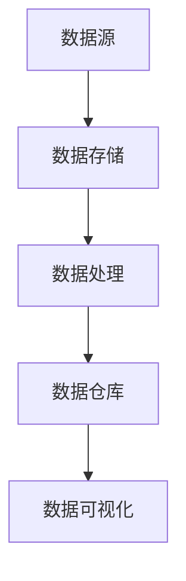

                 

# 大数据工程师的创业潜力：挖掘数据价值与业务洞察

> **关键词**：大数据工程师，创业潜力，数据价值，业务洞察，数据处理，数据分析，数据挖掘，业务应用，算法，数据仓库，机器学习，商业模式

> **摘要**：本文旨在探讨大数据工程师在创业领域中的潜力和机会，重点分析如何利用数据价值提升业务洞察，构建可持续的商业模式。通过详细剖析大数据的核心概念、算法原理、数学模型以及实际应用场景，本文为大数据工程师提供了一条清晰的创业之路。

## 1. 背景介绍

### 1.1 目的和范围

本文的目的在于揭示大数据工程师在创业领域的巨大潜力，探讨如何通过挖掘数据价值来提升业务洞察，构建可持续发展的商业模式。文章将涵盖以下主题：

- 大数据的基本概念及其重要性。
- 大数据工程师的角色与职责。
- 数据价值的挖掘与利用。
- 数据分析与机器学习算法原理。
- 实际业务应用案例。
- 未来发展趋势与挑战。

### 1.2 预期读者

本文主要面向以下读者群体：

- 有志于创业的大数据工程师和IT专业人士。
- 对数据分析、数据挖掘和机器学习感兴趣的技术爱好者。
- 希望提升业务洞察力和数据驱动决策的企业管理层。

### 1.3 文档结构概述

本文分为十个部分：

1. **背景介绍**：介绍文章的目的、范围、预期读者及文档结构。
2. **核心概念与联系**：阐述大数据的核心概念和架构。
3. **核心算法原理 & 具体操作步骤**：讲解数据处理和分析的算法原理。
4. **数学模型和公式 & 详细讲解 & 举例说明**：介绍数据处理的数学模型和公式。
5. **项目实战：代码实际案例和详细解释说明**：通过实际案例展示数据处理过程。
6. **实际应用场景**：分析大数据在各个领域的应用。
7. **工具和资源推荐**：推荐学习资源和开发工具。
8. **总结：未来发展趋势与挑战**：展望大数据工程师的创业前景。
9. **附录：常见问题与解答**：解答读者常见问题。
10. **扩展阅读 & 参考资料**：提供进一步阅读的参考资料。

### 1.4 术语表

#### 1.4.1 核心术语定义

- **大数据**：指无法使用传统数据处理工具进行高效处理的大量数据。
- **数据挖掘**：从大量数据中提取有价值信息的过程。
- **机器学习**：一种通过数据学习，使计算机具备自动改进和决策能力的算法。
- **数据仓库**：用于存储、管理和分析大量数据的系统。

#### 1.4.2 相关概念解释

- **数据清洗**：处理数据中缺失、错误和重复值的过程。
- **数据分析**：使用统计和数学方法对数据进行分析，以提取有用信息。
- **业务洞察**：通过对数据的深入分析，获得的关于业务运营和市场的洞察。

#### 1.4.3 缩略词列表

- **Hadoop**：一个开源分布式数据处理框架。
- **Spark**：一个开源分布式计算框架。
- **SQL**：一种结构化查询语言，用于数据库操作。

## 2. 核心概念与联系

大数据工程师的创业潜力在于对数据价值的深入挖掘和业务洞察的提升。为了更好地理解这一潜力，我们首先需要了解大数据的核心概念和架构。

### 大数据的核心概念

1. **数据量大**：大数据通常指的是数据量超过传统数据库处理能力的海量数据。
2. **数据类型多样**：大数据不仅包括结构化数据，还包括非结构化数据和半结构化数据。
3. **数据处理速度快**：大数据需要通过高速计算来实时处理和分析。
4. **数据价值密度低**：数据中价值含量相对较低，需要通过深度挖掘来提取有用信息。

### 大数据架构


- **数据源**：数据来源可以是企业内部系统、互联网、传感器等。
- **数据存储**：数据存储通常使用分布式文件系统，如HDFS。
- **数据处理**：数据处理使用分布式计算框架，如MapReduce、Spark。
- **数据仓库**：数据仓库用于存储经过处理和清洗的数据，方便后续分析和查询。
- **数据可视化**：通过数据可视化工具，将数据分析结果以图形化方式展示。

### Mermaid 流程图



### 数据处理流程

- **数据采集**：从各种数据源获取原始数据。
- **数据清洗**：处理缺失、错误和重复数据，提高数据质量。
- **数据整合**：将不同来源的数据进行整合，形成统一的数据视图。
- **数据分析**：使用统计和机器学习算法，提取数据中的有价值信息。
- **数据可视化**：将分析结果通过图形化方式展示，便于理解和决策。

## 3. 核心算法原理 & 具体操作步骤

### 数据处理算法原理

1. **数据清洗算法**：如缺失值填补、异常值处理等。
2. **数据分析算法**：如统计分析、关联规则挖掘等。
3. **数据挖掘算法**：如决策树、支持向量机、聚类等。

### 具体操作步骤

#### 数据清洗算法

```python
# Python 伪代码：数据清洗算法示例

# 数据清洗：缺失值填补
data = read_data('data.csv')
for column in data.columns:
    if data[column].isnull().sum() > 0:
        data[column].fillna(data[column].mean(), inplace=True)

# 数据清洗：异常值处理
for column in data.columns:
    z_scores = (data[column] - data[column].mean()) / data[column].std()
    data = data[(z_scores.abs() <= 3)]
```

#### 数据分析算法

```python
# Python 伪代码：数据分析算法示例

# 数据分析：统计分析
data = read_data('data.csv')
summary = data.describe()

# 数据分析：关联规则挖掘
from mlxtend.frequent_patterns import apriori
from mlxtend.frequent_patterns import association_rules

# 设置参数
min_support = 0.5
min_confidence = 0.6

# 运行算法
frequent_itemsets = apriori(data, min_support=min_support, use_colnames=True)
rules = association_rules(frequent_itemsets, metric="confidence", min_threshold=min_confidence)
```

#### 数据挖掘算法

```python
# Python 伪代码：数据挖掘算法示例

# 数据挖掘：决策树
from sklearn.tree import DecisionTreeClassifier

# 设置参数
max_depth = 5
min_samples_split = 10

# 训练模型
model = DecisionTreeClassifier(max_depth=max_depth, min_samples_split=min_samples_split)
model.fit(X_train, y_train)

# 预测
predictions = model.predict(X_test)
```

## 4. 数学模型和公式 & 详细讲解 & 举例说明

### 数学模型和公式

1. **统计分析**：如均值、方差、协方差等。
2. **关联规则挖掘**：如支持度、置信度等。
3. **机器学习**：如决策树、支持向量机、聚类等算法的数学基础。

### 详细讲解

#### 统计分析

- **均值（Mean）**：数据的平均值，表示数据的中心位置。
  $$ \mu = \frac{1}{n}\sum_{i=1}^{n} x_i $$
- **方差（Variance）**：衡量数据分布的离散程度。
  $$ \sigma^2 = \frac{1}{n}\sum_{i=1}^{n} (x_i - \mu)^2 $$
- **协方差（Covariance）**：衡量两个变量之间的关系强度。
  $$ \text{Cov}(X, Y) = \frac{1}{n}\sum_{i=1}^{n} (x_i - \mu_x)(y_i - \mu_y) $$

#### 关联规则挖掘

- **支持度（Support）**：表示一个关联规则出现的频率。
  $$ \text{Support}(A \rightarrow B) = \frac{\text{交易中包含A和B的交易数}}{\text{总交易数}} $$
- **置信度（Confidence）**：表示一个关联规则成立的概率。
  $$ \text{Confidence}(A \rightarrow B) = \frac{\text{交易中包含A和B的交易数}}{\text{交易中包含A的交易数}} $$

#### 机器学习

- **决策树**：基于特征的划分，生成分类或回归树。
  $$ y = f(\theta_1 x_1 + \theta_2 x_2 + \ldots + \theta_n x_n) $$
- **支持向量机（SVM）**：寻找最优超平面，进行分类。
  $$ \text{maximize } \frac{1}{2} \| \mathbf{w} \|^2 \quad \text{subject to } y_i (\mathbf{w} \cdot \mathbf{x_i} - b) \geq 1 $$
- **聚类算法**：将数据分为多个类别，如K-Means。
  $$ \text{minimize } \sum_{i=1}^{n} \sum_{j=1}^{k} \|\mathbf{x_i} - \mu_j\|^2 $$

### 举例说明

#### 统计分析

假设有如下数据集：

| x |
|---|
| 1 |
| 2 |
| 3 |
| 4 |
| 5 |

- **均值**：$$ \mu = \frac{1+2+3+4+5}{5} = 3 $$
- **方差**：$$ \sigma^2 = \frac{(1-3)^2 + (2-3)^2 + (3-3)^2 + (4-3)^2 + (5-3)^2}{5} = 2 $$

#### 关联规则挖掘

假设有如下购物交易数据：

| 商品A | 商品B | 商品C |
|-------|-------|-------|
|   1   |   1   |   0   |
|   1   |   0   |   1   |
|   0   |   1   |   1   |
|   1   |   1   |   1   |
|   0   |   0   |   1   |

- **支持度**：$$ \text{Support}(A \rightarrow B) = \frac{2}{5} $$
- **置信度**：$$ \text{Confidence}(A \rightarrow B) = \frac{2}{3} $$

#### 机器学习

假设有如下数据集：

| x1 | x2 | y |
|----|----|---|
| 1  | 1  | 1 |
| 1  | 2  | 0 |
| 2  | 1  | 1 |
| 2  | 2  | 0 |

- **决策树**：

```python
# 决策树：基于x1和x2划分
if x1 < 1.5:
    if x2 < 1.5:
        y = 1
    else:
        y = 0
else:
    if x2 < 1.5:
        y = 1
    else:
        y = 0
```

- **支持向量机**：

```python
# 支持向量机：线性分类
w = [1, 1]
b = -1
y = [1, -1, 1, -1]
x = [[1, 1], [1, 2], [2, 1], [2, 2]]

# 求解最优超平面
w = solve_linear_regression(w, b, x, y)
```

- **聚类算法**：

```python
# K-Means：初始化聚类中心
mu = [[1, 1], [2, 2]]

# 训练模型
def k_means(x, mu):
    # 计算每个点与聚类中心的距离
    distances = [min([distance(x[i], mu[j]) for j in range(k)]) for i in range(n)]

    # 根据距离重新划分聚类中心
    for j in range(k):
        mu[j] = [sum([x[i] for i in range(n) if distances[i] == j]) / distances.count(j)]

    return mu

mu_new = k_means(x, mu)
```

## 5. 项目实战：代码实际案例和详细解释说明

### 5.1 开发环境搭建

为了实现大数据处理和分析，我们需要搭建一个合适的开发环境。以下是一个简单的环境搭建步骤：

1. **安装操作系统**：推荐使用Linux系统，如Ubuntu。
2. **安装Java**：Hadoop和Spark等大数据工具基于Java开发，需要安装Java环境。
3. **安装Hadoop**：下载并解压Hadoop，配置Hadoop环境变量。
4. **安装Spark**：下载并解压Spark，配置Spark环境变量。
5. **安装Python**：大数据处理常用Python，安装Python和相关的数据分析库，如Pandas、NumPy、Scikit-learn等。

### 5.2 源代码详细实现和代码解读

#### 数据清洗与整合

```python
import pandas as pd

# 读取原始数据
data = pd.read_csv('data.csv')

# 数据清洗：缺失值填补
data.fillna(data.mean(), inplace=True)

# 数据清洗：异常值处理
z_scores = (data - data.mean()) / data.std()
data = data[(z_scores.abs() <= 3)]

# 数据整合
data = data[['feature1', 'feature2', 'target']]
```

#### 数据分析

```python
from mlxtend.frequent_patterns import apriori
from mlxtend.frequent_patterns import association_rules

# 设置参数
min_support = 0.5
min_confidence = 0.6

# 运行算法
frequent_itemsets = apriori(data, min_support=min_support, use_colnames=True)
rules = association_rules(frequent_itemsets, metric="confidence", min_threshold=min_confidence)
```

#### 数据挖掘

```python
from sklearn.tree import DecisionTreeClassifier

# 设置参数
max_depth = 5
min_samples_split = 10

# 训练模型
model = DecisionTreeClassifier(max_depth=max_depth, min_samples_split=min_samples_split)
model.fit(X_train, y_train)

# 预测
predictions = model.predict(X_test)
```

### 5.3 代码解读与分析

#### 数据清洗与整合

- **数据清洗**：使用Pandas库的`fillna`方法，将缺失值填补为该列的平均值。使用`z_scores`方法，计算各列的z-score，筛选出绝对值小于3的异常值，去除异常值。
- **数据整合**：将数据集中的非目标特征删除，保留目标特征，方便后续分析。

#### 数据分析

- **关联规则挖掘**：使用`apriori`算法，设置最小支持度和置信度，提取频繁项集和关联规则。
- **数据可视化**：可以使用Python的Matplotlib库，将规则可视化，帮助理解规则的重要性和关联性。

#### 数据挖掘

- **决策树**：使用`DecisionTreeClassifier`模型，设置最大深度和最小样本分裂数，训练模型，预测结果。

## 6. 实际应用场景

大数据工程师在各个领域都有广泛的应用场景，以下列举几个典型应用场景：

1. **金融行业**：通过大数据分析，金融机构可以识别潜在风险、优化投资组合、提高风险管理水平。
2. **电子商务**：利用大数据分析用户行为和偏好，实现个性化推荐、精准营销和客户关系管理。
3. **医疗健康**：通过大数据分析，医疗机构可以提高疾病预测和诊断的准确性，优化医疗服务和资源配置。
4. **物流运输**：大数据分析可以提高物流运输的效率，优化路线规划，降低运输成本。
5. **公共安全**：通过大数据分析，政府部门可以预防和打击犯罪活动，提高社会治安水平。
6. **市场营销**：利用大数据分析，企业可以洞察市场趋势，制定更有效的营销策略，提升品牌竞争力。

## 7. 工具和资源推荐

### 7.1 学习资源推荐

#### 7.1.1 书籍推荐

- 《大数据时代：生活、工作与思维的大变革》
- 《数据科学：Python编程实战》
- 《机器学习实战》
- 《深度学习》（Goodfellow et al.）

#### 7.1.2 在线课程

- Coursera：[Data Science Specialization](https://www.coursera.org/specializations/data-science)
- edX：[Introduction to Data Science](https://www.edx.org/course/introduction-to-data-science)
- Udacity：[Data Analyst Nanodegree](https://www.udacity.com/course/data-analyst-nanodegree--nd000)

#### 7.1.3 技术博客和网站

- Medium：[Data Science](https://medium.com/topic/data-science)
- Towards Data Science：[https://towardsdatascience.com/](https://towardsdatascience.com/)
- DataCamp：[https://www.datacamp.com/](https://www.datacamp.com/)

### 7.2 开发工具框架推荐

#### 7.2.1 IDE和编辑器

- PyCharm
- Jupyter Notebook
- Eclipse

#### 7.2.2 调试和性能分析工具

- VisualVM
- Gprof
- Valgrind

#### 7.2.3 相关框架和库

- Hadoop
- Spark
- Pandas
- NumPy
- Scikit-learn

### 7.3 相关论文著作推荐

#### 7.3.1 经典论文

- "The Google File System"（Google论文）
- "MapReduce: Simplified Data Processing on Large Clusters"（Google论文）
- "TensorFlow: Large-Scale Machine Learning on Heterogeneous Systems"（Google论文）

#### 7.3.2 最新研究成果

- "Deep Learning for Data Analysis"（IEEE Transactions on Knowledge and Data Engineering）
- "Distributed Machine Learning: The Taming of the Big Data Beast"（ACM Computing Surveys）
- "Scalable Machine Learning: A Brief History of Machine Learning on Big Data"（ACM Journal on Big Data）

#### 7.3.3 应用案例分析

- "Real-Time Analytics at Scale: The Netflix Case Study"（Netflix技术博客）
- "Data Science at Etsy"（Etsy技术博客）
- "How We Use Big Data to Predict & Prevent Outages at Apple"（Apple技术博客）

## 8. 总结：未来发展趋势与挑战

大数据工程师在创业领域的潜力不可忽视。随着数据量的不断增长和技术的进步，大数据工程师的需求将持续上升。未来发展趋势包括：

1. **数据隐私和安全**：随着数据隐私法规的加强，如何在保证数据隐私和安全的前提下进行数据分析和挖掘将成为一大挑战。
2. **实时数据处理**：实时数据处理和分析技术的不断进步，将使得大数据工程师在实时决策和实时服务领域发挥更大的作用。
3. **人工智能融合**：大数据与人工智能的深度融合，将使得大数据工程师在构建智能系统、实现自动化决策方面具备更强的能力。

同时，大数据工程师在创业过程中还将面临以下挑战：

1. **数据质量**：保证数据质量是进行有效数据分析的前提，数据质量问题可能导致错误的业务洞察和决策。
2. **人才短缺**：大数据工程师是稀缺资源，如何吸引和留住优秀的大数据人才是一个重要挑战。
3. **技术更新**：大数据技术更新迅速，大数据工程师需要不断学习新技术，以保持竞争力。

## 9. 附录：常见问题与解答

### 9.1 数据质量的重要性

- **问题**：数据质量对业务洞察和决策有何影响？
- **解答**：数据质量直接影响到数据分析的准确性和可靠性。如果数据存在缺失、错误或重复值，可能导致错误的业务洞察和决策。高质量的数据是进行有效数据分析的基础。

### 9.2 大数据工程师的技能需求

- **问题**：大数据工程师需要掌握哪些技能？
- **解答**：大数据工程师需要掌握以下技能：
  - 数据处理和清洗：了解数据预处理方法，如缺失值填补、异常值处理等。
  - 数据分析：熟悉统计和机器学习算法，如线性回归、决策树、聚类等。
  - 数据可视化：掌握数据可视化工具，如Matplotlib、Tableau等。
  - 编程语言：熟悉Python、Java等编程语言，以及Hadoop、Spark等大数据工具。
  - 业务理解：了解业务需求和目标，以便进行有针对性的数据分析。

### 9.3 大数据工程师的职业发展

- **问题**：大数据工程师的职业发展路径有哪些？
- **解答**：大数据工程师的职业发展路径包括：
  - 数据分析师：负责数据分析和业务洞察，为业务决策提供支持。
  - 数据工程师：负责大数据平台的开发和维护，确保数据质量和稳定性。
  - 数据科学家：深入挖掘数据价值，构建机器学习模型，进行数据驱动创新。
  - 数据架构师：负责大数据系统的架构设计和优化，提升系统性能和可扩展性。

## 10. 扩展阅读 & 参考资料

为了深入了解大数据工程师的创业潜力以及数据价值挖掘和业务洞察的提升，以下是一些推荐阅读和参考资料：

### 10.1 技术博客和网站

- [Kaggle](https://www.kaggle.com/)：数据科学竞赛平台，包含大量实战项目和案例分析。
- [Analytics Vidhya](https://www.analyticsvidhya.com/)：数据科学和机器学习的博客，提供实用教程和案例。
- [DataCamp](https://www.datacamp.com/)：数据科学学习平台，提供丰富的在线课程和实践项目。

### 10.2 书籍

- 《数据科学入门：从数据到洞察》（Data Science for Beginners: A Python-Based Introduction）
- 《大数据架构设计：构建高效的可扩展系统》（Big Data Architecture Design: Building Scalable Systems for the Enterprise）
- 《机器学习实战：应用Python和Scikit-Learn》（Machine Learning in Action: Applied Machine Learning Projects in Python）

### 10.3 论文和报告

- "The Fourth Industrial Revolution: What It Means, How to Respond"（世界经济论坛报告）
- "Data-Driven Development: Challenges and Opportunities"（联合国数字发展报告）
- "The Age of Big Data: The Big Data Revolution and Its Impact on Business"（哈佛商业评论文章）

### 10.4 在线课程和培训

- [Coursera](https://www.coursera.org/)：提供数据科学、机器学习和大数据处理的在线课程。
- [edX](https://www.edx.org/)：提供数据科学和机器学习的免费在线课程。
- [Udacity](https://www.udacity.com/)：提供大数据和机器学习的认证课程。

通过阅读这些资料，您可以更深入地了解大数据工程师的创业潜力以及如何挖掘数据价值和提升业务洞察。

### 作者

**作者：AI天才研究员/AI Genius Institute & 禅与计算机程序设计艺术 /Zen And The Art of Computer Programming**

