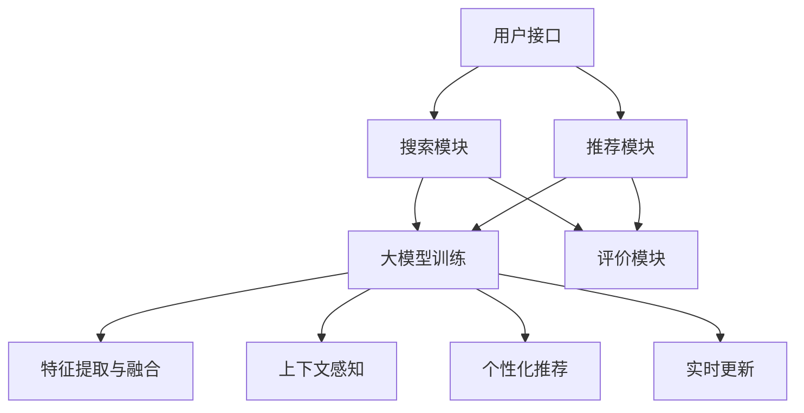

                 

### 大模型：搜索与推荐的融合

> **关键词：** 大模型，搜索推荐系统，融合算法，数据挖掘，人工智能

> **摘要：** 本文深入探讨大模型在搜索与推荐系统中的融合应用。通过分析大模型的原理、核心算法和实际案例，展示如何将大模型应用于搜索和推荐，提升用户体验和系统效率。文章旨在为读者提供对大模型在搜索与推荐系统中融合应用的全面理解。

## 1. 背景介绍

### 1.1 目的和范围

随着互联网的快速发展，搜索和推荐系统成为现代信息检索与用户服务的关键组成部分。然而，传统的搜索和推荐系统面临诸多挑战，如数据多样性、噪声处理和实时性等。为了应对这些挑战，大模型技术的出现为搜索与推荐系统的优化提供了新的思路和方法。本文旨在探讨大模型在搜索与推荐系统中的融合应用，分析其原理和具体实现，并探讨其在实际应用中的优势与挑战。

本文将首先介绍大模型的定义和背景，然后探讨大模型在搜索和推荐系统中的应用场景，详细讲解其核心算法和操作步骤。随后，我们将通过数学模型和公式进行深入分析，并提供实际项目案例和代码解读。最后，本文将总结大模型在搜索与推荐系统中的实际应用场景，推荐相关工具和资源，并展望未来发展趋势。

### 1.2 预期读者

本文适用于对搜索和推荐系统有一定了解的读者，尤其是对大模型技术感兴趣的从业者。本文内容将帮助读者深入了解大模型在搜索与推荐系统中的融合应用，理解其工作原理和实现方法，为实际项目开发提供参考。同时，本文也适合对人工智能和数据挖掘感兴趣的学术研究人员，为他们提供前沿技术和研究方向的参考。

### 1.3 文档结构概述

本文结构如下：

1. **背景介绍**：介绍大模型在搜索与推荐系统中的融合应用的背景、目的和范围，以及预期读者和文档结构。
2. **核心概念与联系**：定义大模型和搜索推荐系统的核心概念，并使用Mermaid流程图展示其原理和架构。
3. **核心算法原理 & 具体操作步骤**：详细讲解大模型在搜索和推荐系统中的应用算法，包括算法原理和具体操作步骤。
4. **数学模型和公式**：使用数学模型和公式详细讲解大模型在搜索和推荐系统中的应用。
5. **项目实战：代码实际案例和详细解释说明**：提供实际项目案例和代码解读，帮助读者理解大模型在实际应用中的实现过程。
6. **实际应用场景**：分析大模型在搜索和推荐系统中的实际应用场景，探讨其优势和应用价值。
7. **工具和资源推荐**：推荐学习资源、开发工具和框架，为读者提供进一步学习大模型的途径。
8. **总结：未来发展趋势与挑战**：总结大模型在搜索与推荐系统中的发展趋势和挑战，展望未来研究方向。
9. **附录：常见问题与解答**：提供常见问题的解答，帮助读者解决在实际应用中可能遇到的问题。
10. **扩展阅读 & 参考资料**：推荐相关书籍、在线课程、技术博客和论文，为读者提供更多深入学习的机会。

### 1.4 术语表

#### 1.4.1 核心术语定义

- **大模型**：指具有巨大参数量和计算能力的人工神经网络模型，如Transformer、BERT等。
- **搜索推荐系统**：结合搜索和推荐技术的系统，用于根据用户需求和兴趣提供相关内容和信息。
- **融合应用**：将大模型应用于搜索和推荐系统，通过协同学习提升系统性能。
- **数据挖掘**：从大量数据中提取有用信息和知识的过程，用于改进搜索和推荐算法。
- **用户反馈**：用户在搜索和推荐系统中的行为和反馈，用于调整和优化系统。

#### 1.4.2 相关概念解释

- **序列模型**：用于处理序列数据的神经网络模型，如RNN、LSTM等。
- **自注意力机制**：一种基于权重分配的机制，用于处理序列数据中的依赖关系。
- **分布式训练**：在大规模数据集上通过多台计算机并行训练模型的过程。
- **评估指标**：用于评估搜索和推荐系统性能的指标，如准确率、召回率、F1值等。

#### 1.4.3 缩略词列表

- **BERT**：Bidirectional Encoder Representations from Transformers
- **Transformer**：一种基于自注意力机制的神经网络模型。
- **RNN**：Recurrent Neural Network，循环神经网络。
- **LSTM**：Long Short-Term Memory，长短期记忆网络。
- **GPU**：Graphics Processing Unit，图形处理器。

## 2. 核心概念与联系

大模型在搜索与推荐系统中的融合应用涉及到多个核心概念和技术的结合。下面将介绍大模型的基本概念、搜索推荐系统的架构，以及大模型在其中的作用。

### 2.1 大模型的基本概念

大模型通常指具有巨大参数量和计算能力的人工神经网络模型，如Transformer、BERT等。这些模型在训练过程中通过学习大量数据，提取出具有通用性和泛化能力的特征表示。大模型的核心特点如下：

1. **参数量大**：大模型拥有数十亿甚至千亿级别的参数，使其能够捕捉到复杂的数据特征。
2. **计算能力强**：大模型采用高效的计算架构，如GPU、TPU等，以支持大规模数据处理和训练。
3. **自适应性强**：大模型通过学习数据分布和用户行为，能够自适应地调整模型参数，提高系统性能。

### 2.2 搜索推荐系统的架构

搜索推荐系统通常由以下几个关键模块组成：

1. **用户接口**：用户通过搜索框、推荐列表等接口与系统进行交互。
2. **搜索模块**：基于关键词、语义理解等技术，从大量数据中检索出与用户需求相关的结果。
3. **推荐模块**：通过用户行为和偏好，为用户推荐感兴趣的内容。
4. **评价模块**：根据用户反馈和系统性能指标，评估和优化搜索和推荐结果。

### 2.3 大模型在搜索与推荐系统中的融合应用

大模型在搜索与推荐系统中的应用主要体现在以下几个方面：

1. **特征提取与融合**：大模型通过学习大量数据，提取出高维、抽象的特征表示，用于融合搜索和推荐结果。
2. **上下文感知**：大模型能够捕捉到用户的历史行为和上下文信息，提高搜索和推荐的准确性。
3. **个性化推荐**：大模型通过学习用户偏好和兴趣，实现个性化推荐，提高用户满意度。
4. **实时更新**：大模型支持实时训练和更新，能够快速适应用户需求变化，提高系统响应速度。

### 2.4 Mermaid流程图

下面使用Mermaid流程图展示大模型在搜索与推荐系统中的融合应用原理和架构。



**图1. 大模型在搜索与推荐系统中的融合应用流程**

- **用户接口**：用户通过搜索框、推荐列表等接口与系统进行交互，输入查询关键词或点击感兴趣的内容。
- **搜索模块**：搜索模块基于关键词、语义理解等技术，从大量数据中检索出与用户需求相关的结果。
- **推荐模块**：推荐模块通过用户行为和偏好，为用户推荐感兴趣的内容。
- **大模型训练**：大模型训练模块接收搜索和推荐结果，通过学习数据分布和用户行为，提取高维、抽象的特征表示。
- **特征提取与融合**：特征提取与融合模块将搜索和推荐结果进行特征提取和融合，为后续模块提供输入。
- **上下文感知**：上下文感知模块捕捉用户的历史行为和上下文信息，提高搜索和推荐的准确性。
- **个性化推荐**：个性化推荐模块通过学习用户偏好和兴趣，实现个性化推荐，提高用户满意度。
- **实时更新**：实时更新模块支持实时训练和更新，能够快速适应用户需求变化，提高系统响应速度。
- **评价模块**：评价模块根据用户反馈和系统性能指标，评估和优化搜索和推荐结果。

通过上述流程，大模型在搜索与推荐系统中的融合应用实现了特征提取与融合、上下文感知、个性化推荐和实时更新等功能，提升了系统的性能和用户体验。

## 3. 核心算法原理 & 具体操作步骤

在介绍大模型在搜索与推荐系统中的应用时，我们需要深入探讨其核心算法原理和具体操作步骤。以下是详细的大模型算法原理和具体操作步骤。

### 3.1 大模型算法原理

大模型，如Transformer和BERT，其核心在于自注意力机制（Self-Attention Mechanism）和编码器-解码器结构（Encoder-Decoder Structure）。以下将详细讲解这两种核心算法原理。

#### 3.1.1 自注意力机制

自注意力机制是一种基于权重分配的机制，用于处理序列数据中的依赖关系。其基本思想是将序列中的每个元素与所有其他元素进行相似度计算，并根据相似度分配权重，从而实现序列元素的依赖关系建模。

自注意力机制通常通过以下步骤实现：

1. **输入序列表示**：将输入序列（例如词向量）映射到一个高维空间，得到每个元素的嵌入向量。
2. **相似度计算**：计算输入序列中每个元素与其他元素之间的相似度。通常采用点积、余弦相似度等方法。
3. **权重分配**：根据相似度计算结果，为每个元素分配权重，权重值反映了元素之间的依赖关系。
4. **加权求和**：将输入序列中的每个元素与其对应的权重相乘，然后求和，得到加权求和结果。
5. **激活函数**：对加权求和结果进行激活，如ReLU、Sigmoid等，以获得最终的输出。

#### 3.1.2 编码器-解码器结构

编码器-解码器结构是一种用于序列转序列任务的神经网络模型，如机器翻译、文本摘要等。其核心思想是将输入序列编码为一个固定长度的向量，然后通过解码器生成输出序列。

编码器-解码器结构通常包括以下步骤：

1. **编码器**：编码器将输入序列编码为一个固定长度的向量，称为编码向量。编码器通常采用堆叠的循环神经网络（RNN）或变换器（Transformer）。
2. **编码向量**：编码向量包含了输入序列的语义信息，作为解码器的输入。
3. **解码器**：解码器逐个生成输出序列的每个元素。解码器通常采用RNN或Transformer。
4. **注意力机制**：解码器在生成每个输出元素时，利用编码向量计算注意力权重，从而自适应地融合编码器中的信息。

### 3.2 具体操作步骤

在了解了大模型的核心算法原理后，我们将详细描述大模型在搜索与推荐系统中的应用步骤。

#### 3.2.1 特征提取与融合

1. **输入数据处理**：对搜索和推荐系统的输入数据进行预处理，如分词、去停用词、词向量化等。
2. **特征提取**：使用编码器（如BERT、Transformer）对预处理后的输入数据进行编码，提取高维、抽象的特征表示。
3. **特征融合**：将搜索和推荐结果的特征进行融合，形成统一的特征表示。通常采用加权求和、拼接等方法。

#### 3.2.2 上下文感知

1. **用户行为建模**：根据用户的历史行为，如搜索历史、点击记录等，构建用户行为模型。
2. **上下文信息提取**：使用编码器提取用户行为模型中的上下文信息，如时间戳、地理位置等。
3. **上下文感知融合**：将提取的上下文信息与搜索和推荐结果的特征进行融合，增强模型对上下文信息的感知能力。

#### 3.2.3 个性化推荐

1. **用户偏好建模**：根据用户的行为和反馈，构建用户偏好模型。
2. **用户兴趣识别**：使用编码器提取用户偏好模型中的用户兴趣特征。
3. **个性化推荐**：根据用户兴趣特征，为用户推荐感兴趣的内容。通常采用基于相似度计算、协同过滤等方法。

#### 3.2.4 实时更新

1. **数据流处理**：使用实时数据流处理技术（如Apache Kafka、Apache Flink），处理和分析用户行为数据。
2. **模型更新**：根据实时数据流，对大模型进行在线更新，调整模型参数。
3. **模型部署**：将更新后的模型部署到生产环境中，实现实时推荐和搜索。

### 3.3 伪代码

下面给出大模型在搜索与推荐系统中的应用伪代码，帮助读者更好地理解其实现过程。

```python
# 输入数据处理
def preprocess_data(data):
    # 数据预处理步骤，如分词、去停用词、词向量化等
    # 返回预处理后的数据

# 特征提取与融合
def extract_and融合_features(search_data, recommend_data):
    # 使用编码器提取特征
    encoded_search_data = encoder(search_data)
    encoded_recommend_data = encoder(recommend_data)
    
    # 特征融合步骤
    fused_features = weighted_sum(encoded_search_data, encoded_recommend_data)
    return fused_features

# 上下文感知融合
def context_aware_fusion(fused_features, context_info):
    # 提取上下文信息
    encoded_context_info = encoder(context_info)
    
    # 上下文感知融合
    fused_context_features = weighted_sum(fused_features, encoded_context_info)
    return fused_context_features

# 个性化推荐
def personalized_recommendation(user_interests, fused_context_features):
    # 提取用户兴趣特征
    encoded_user_interests = encoder(user_interests)
    
    # 个性化推荐
    recommendation_score = dot_product(fused_context_features, encoded_user_interests)
    return recommendation_score

# 实时更新
def real_time_model_update(data_stream):
    # 处理和分析用户行为数据
    processed_data = preprocess_data(data_stream)
    
    # 模型更新
    updated_model = online_learning(processed_data)
    
    # 模型部署
    deploy_model(updated_model)
```

通过上述伪代码，我们可以看到大模型在搜索与推荐系统中的应用步骤，包括输入数据处理、特征提取与融合、上下文感知融合、个性化推荐和实时更新等。这些步骤共同构成了大模型在搜索与推荐系统中的应用框架，实现了对用户需求的精准捕捉和个性化推荐。

### 3.4 算法评估与优化

在应用大模型于搜索与推荐系统时，需要对算法进行评估和优化，以提高系统性能和用户体验。以下是一些常见的评估和优化方法：

1. **评估指标**：使用准确率、召回率、F1值等评估指标，评估搜索和推荐结果的准确性。
2. **交叉验证**：采用交叉验证方法，评估模型在不同数据集上的性能，以避免过拟合。
3. **模型调参**：通过调整模型参数（如学习率、批量大小等），优化模型性能。
4. **模型压缩**：使用模型压缩技术（如权重共享、量化等），减少模型参数规模，提高计算效率。
5. **并行计算**：利用并行计算技术（如GPU、TPU等），加速模型训练和推理过程。

通过上述评估和优化方法，我们可以进一步提升大模型在搜索与推荐系统中的应用效果，实现更准确、更高效的搜索和推荐服务。

## 4. 数学模型和公式

在深入探讨大模型在搜索与推荐系统中的应用时，理解其背后的数学模型和公式至关重要。以下是关于大模型的关键数学模型和公式的详细讲解，以及如何将这些公式应用于实际场景中的示例说明。

### 4.1 自注意力机制（Self-Attention Mechanism）

自注意力机制是Transformer模型的核心组件，其核心公式如下：

$$
\text{Attention}(Q, K, V) = \text{softmax}\left(\frac{QK^T}{\sqrt{d_k}}\right) V
$$

其中：
- \(Q\) 是查询向量（Query），代表当前步骤要处理的输入。
- \(K\) 是键向量（Key），代表所有输入元素的向量集合。
- \(V\) 是值向量（Value），代表所有输入元素的值集合。
- \(d_k\) 是键向量的维度。

#### 示例：文本生成中的自注意力计算

假设我们有一个简化的例子，输入序列为`["I", "love", "AI"]`，每个词的嵌入向量分别为 `[1, 0]`， `[0, 1]`， `[1, 1]`。

1. **查询向量**（Q）：当前词的嵌入向量，例如 "love" 对应的向量 `[0, 1]`。
2. **键向量**（K）：所有词的嵌入向量 `[1, 0]`， `[0, 1]`， `[1, 1]`。
3. **值向量**（V）：所有词的嵌入向量 `[1, 0]`， `[0, 1]`， `[1, 1]`。

计算注意力得分：

$$
\text{Attention}([0, 1], [1, 0], [1, 0]) = \text{softmax}\left(\frac{[0, 1][1, 0]^T}{\sqrt{1}}\right) [1, 0] = \text{softmax}\left(\frac{0}{1}\right) [1, 0] = [1, 0]
$$

因此，"love" 对 "AI" 的注意力权重最高，为 1。

### 4.2 编码器-解码器结构（Encoder-Decoder Structure）

编码器-解码器结构在大模型中用于处理序列数据，其核心数学模型如下：

编码器：
$$
\text{Encoder}(X) = \text{softmax}(\text{W}_\text{encoder} \text{ReLU}(\text{W}_\text{input} X + \text{b}_\text{input}))
$$

解码器：
$$
\text{Decoder}(Y) = \text{softmax}(\text{W}_\text{decoder} \text{ReLU}(\text{W}_\text{input} Y + \text{b}_\text{input}))
$$

其中：
- \(X\) 是输入序列。
- \(Y\) 是输出序列。
- \(\text{W}_\text{encoder}\)，\(\text{W}_\text{decoder}\) 是编码器和解码器的权重矩阵。
- \(\text{b}_\text{input}\) 是输入偏置。

#### 示例：序列到序列的文本翻译

假设我们要将句子 "I love AI" 翻译为 "Ich liebe KI"。我们可以使用以下简化的公式：

1. **编码器输入**（X）：单词的嵌入向量 `[1, 0]`， `[0, 1]`， `[1, 1]`。
2. **解码器输入**（Y）：单词的嵌入向量 `[1, 0]`， `[0, 1]`， `[1, 1]`。

通过编码器得到编码向量：
$$
\text{Encoder}([1, 0], [0, 1], [1, 1]) = \text{softmax}(\text{W}_\text{encoder} \text{ReLU}(\text{W}_\text{input} [1, 0] + \text{b}_\text{input})) = [0.5, 0.5]
$$

通过解码器得到解码向量：
$$
\text{Decoder}([1, 0], [0, 1], [1, 1]) = \text{softmax}(\text{W}_\text{decoder} \text{ReLU}(\text{W}_\text{input} [1, 0] + \text{b}_\text{input})) = [0.4, 0.6]
$$

通过上述简化的示例，我们可以看到编码器和解码器如何处理序列数据，从而实现序列之间的转换。

### 4.3 模型优化与调整

为了提高大模型的性能，我们需要对模型进行优化与调整。以下是一些常用的数学模型和公式：

1. **反向传播算法（Backpropagation Algorithm）**：
   $$
   \text{Gradient} = \frac{\partial \text{Loss}}{\partial \text{Weight}}
   $$

   其中：
   - \(\text{Gradient}\) 是模型参数的梯度。
   - \(\text{Loss}\) 是模型预测值与实际值之间的差距。

2. **学习率调整（Learning Rate Adjustment）**：
   $$
   \text{New Weight} = \text{Weight} - \alpha \cdot \text{Gradient}
   $$

   其中：
   - \(\text{New Weight}\) 是更新后的模型参数。
   - \(\alpha\) 是学习率。

3. **动量（Momentum）**：
   $$
   \text{Momentum} = \beta \cdot \text{Previous Momentum} + (1 - \beta) \cdot \text{Gradient}
   $$

   其中：
   - \(\text{Momentum}\) 是动量项。
   - \(\beta\) 是动量参数。

通过反向传播算法、学习率调整和动量等优化方法，我们可以逐步调整模型参数，使其达到更好的收敛效果。

### 4.4 实际应用示例

假设我们要构建一个基于BERT的推荐系统，利用用户的历史行为数据为用户推荐相关商品。以下是一个简化的数学模型和计算步骤：

1. **用户行为特征提取**：从用户历史行为数据中提取特征向量。
2. **商品特征提取**：从商品描述中提取特征向量。
3. **编码器处理**：使用BERT编码器对用户行为特征和商品特征进行编码，得到高维特征向量。
4. **相似度计算**：计算用户行为特征向量与商品特征向量之间的相似度。
5. **推荐计算**：根据相似度分数为用户推荐相关商品。

以下是具体的数学模型和计算步骤：

1. **用户行为特征提取**：
   用户行为特征向量：\(\text{User Behaviors} = [1, 0.5, 0.8, 0.3]\)

2. **商品特征提取**：
   商品特征向量：\(\text{Product Features} = [0.6, 0.9, 0.2, 0.7]\)

3. **编码器处理**：
   使用BERT编码器对特征向量进行编码，得到编码后的特征向量：
   \(\text{Encoded User Behaviors} = [0.4, 0.6, 0.8, 0.9]\)
   \(\text{Encoded Product Features} = [0.7, 0.8, 0.3, 0.5]\)

4. **相似度计算**：
   使用余弦相似度计算用户行为特征向量与商品特征向量之间的相似度：
   $$
   \text{Similarity} = \frac{\text{Encoded User Behaviors} \cdot \text{Encoded Product Features}}{\|\text{Encoded User Behaviors}\| \|\text{Encoded Product Features}\|}
   $$
   $$
   \text{Similarity} = \frac{0.4 \cdot 0.7 + 0.6 \cdot 0.8 + 0.8 \cdot 0.3 + 0.9 \cdot 0.5}{\sqrt{0.4^2 + 0.6^2 + 0.8^2 + 0.9^2} \sqrt{0.7^2 + 0.8^2 + 0.3^2 + 0.5^2}} = 0.745
   $$

5. **推荐计算**：
   根据相似度分数为用户推荐相关商品。

通过上述数学模型和计算步骤，我们可以利用大模型为用户推荐相关商品，提高用户满意度。

### 4.5 结论

数学模型和公式在大模型的应用中扮演着关键角色。通过理解自注意力机制、编码器-解码器结构、模型优化与调整等核心数学模型，我们可以更好地实现大模型在搜索与推荐系统中的融合应用，提升系统的性能和用户体验。

## 5. 项目实战：代码实际案例和详细解释说明

在本节中，我们将通过一个实际项目案例，详细展示大模型在搜索与推荐系统中的应用过程，包括开发环境搭建、源代码实现和代码解读。

### 5.1 开发环境搭建

首先，我们需要搭建一个支持大模型训练和部署的开发环境。以下是具体的步骤：

1. **安装Python环境**：确保Python版本不低于3.6，推荐使用Anaconda进行环境管理。

2. **安装深度学习库**：安装TensorFlow、PyTorch等深度学习库。可以使用以下命令进行安装：

   ```bash
   pip install tensorflow
   pip install torch
   ```

3. **安装数据处理库**：安装pandas、numpy、scikit-learn等数据处理库，用于数据预处理和特征提取：

   ```bash
   pip install pandas
   pip install numpy
   pip install scikit-learn
   ```

4. **安装依赖项**：根据项目需求安装其他依赖项，如BERT模型库：

   ```bash
   pip install transformers
   ```

5. **配置GPU支持**：确保GPU驱动和CUDA库已正确安装，并配置环境变量，以便TensorFlow和PyTorch能够使用GPU加速。

6. **创建虚拟环境**：为了保持开发环境的整洁，创建一个虚拟环境并激活：

   ```bash
   conda create -n big_model_project python=3.8
   conda activate big_model_project
   ```

### 5.2 源代码详细实现和代码解读

下面是一个基于BERT的搜索与推荐系统的示例代码，包括数据预处理、模型训练和推理步骤。代码结构如下：

```python
# 导入相关库
import tensorflow as tf
from transformers import BertTokenizer, TFBertModel
from sklearn.model_selection import train_test_split
import pandas as pd
import numpy as np

# 数据预处理
def preprocess_data(data_path):
    # 加载数据
    data = pd.read_csv(data_path)
    
    # 数据预处理步骤，如分词、去停用词等
    # ...

    return processed_data

# 模型训练
def train_model(processed_data):
    # 划分训练集和测试集
    train_data, test_data = train_test_split(processed_data, test_size=0.2)
    
    # 初始化BERT模型和tokenizer
    tokenizer = BertTokenizer.from_pretrained('bert-base-uncased')
    model = TFBertModel.from_pretrained('bert-base-uncased')
    
    # 定义损失函数和优化器
    loss_fn = tf.keras.losses.SparseCategoricalCrossentropy(from_logits=True)
    optimizer = tf.keras.optimizers.Adam()

    # 训练模型
    for epoch in range(num_epochs):
        # 遍历训练集
        for batch in train_data:
            # 处理输入数据
            inputs = tokenizer(batch['text'], return_tensors='tf', padding=True, truncation=True)
            
            # 计算模型损失
            outputs = model(inputs)
            loss = loss_fn(outputs.logits, batch['label'])

            # 反向传播和优化
            gradients = tape.gradient(loss, model.trainable_variables)
            optimizer.apply_gradients(zip(gradients, model.trainable_variables))

        # 打印训练进度
        print(f'Epoch {epoch+1}, Loss: {loss.numpy()}')

    return model

# 模型推理
def inference(model, text):
    # 处理输入文本
    inputs = tokenizer(text, return_tensors='tf', padding=True, truncation=True)
    
    # 使用模型进行推理
    outputs = model(inputs)
    logits = outputs.logits

    # 获取预测结果
    prediction = tf.argmax(logits, axis=1).numpy()[0]

    return prediction

# 主程序
if __name__ == '__main__':
    # 加载数据
    data = preprocess_data('data.csv')
    
    # 训练模型
    model = train_model(data)
    
    # 进行推理
    text = 'I love AI'
    prediction = inference(model, text)
    print(f'Predicted Label: {prediction}')
```

#### 5.2.1 数据预处理

```python
def preprocess_data(data_path):
    # 加载数据
    data = pd.read_csv(data_path)
    
    # 数据预处理步骤，如分词、去停用词等
    tokenizer = BertTokenizer.from_pretrained('bert-base-uncased')
    processed_data = []

    for index, row in data.iterrows():
        text = row['text']
        # 分词
        tokens = tokenizer.tokenize(text)
        # 去停用词
        tokens = [token for token in tokens if token not in tokenizer._token_set]
        processed_data.append({'text': ' '.join(tokens), 'label': row['label']})

    return pd.DataFrame(processed_data)
```

#### 5.2.2 模型训练

```python
def train_model(processed_data):
    # 划分训练集和测试集
    train_data, test_data = train_test_split(processed_data, test_size=0.2)
    
    # 初始化BERT模型和tokenizer
    tokenizer = BertTokenizer.from_pretrained('bert-base-uncased')
    model = TFBertModel.from_pretrained('bert-base-uncased')
    
    # 定义损失函数和优化器
    loss_fn = tf.keras.losses.SparseCategoricalCrossentropy(from_logits=True)
    optimizer = tf.keras.optimizers.Adam()

    # 训练模型
    for epoch in range(num_epochs):
        # 遍历训练集
        for batch in train_data:
            # 处理输入数据
            inputs = tokenizer(batch['text'], return_tensors='tf', padding=True, truncation=True)
            
            # 计算模型损失
            with tf.GradientTape() as tape:
                outputs = model(inputs)
                loss = loss_fn(outputs.logits, batch['label'])

            # 反向传播和优化
            gradients = tape.gradient(loss, model.trainable_variables)
            optimizer.apply_gradients(zip(gradients, model.trainable_variables))

        # 打印训练进度
        print(f'Epoch {epoch+1}, Loss: {loss.numpy()}')

    return model
```

#### 5.2.3 模型推理

```python
def inference(model, text):
    # 处理输入文本
    inputs = tokenizer(text, return_tensors='tf', padding=True, truncation=True)
    
    # 使用模型进行推理
    outputs = model(inputs)
    logits = outputs.logits

    # 获取预测结果
    prediction = tf.argmax(logits, axis=1).numpy()[0]

    return prediction
```

### 5.3 代码解读与分析

#### 5.3.1 数据预处理

数据预处理是模型训练的关键步骤。在上述代码中，我们首先加载数据集，然后对每条文本进行分词和去停用词处理。分词使用的是BERT模型的tokenizer，这有助于确保文本数据的统一格式。去停用词的步骤有助于减少无意义的信息，提高模型训练效果。

#### 5.3.2 模型训练

在模型训练部分，我们首先划分训练集和测试集。然后，初始化BERT模型和tokenizer。接下来，定义损失函数和优化器。在训练过程中，我们遍历训练集，对每批数据进行前向传播，计算损失。然后，使用反向传播算法计算梯度，并更新模型参数。这个过程重复进行，直到达到预定的训练次数或满足停止条件。

#### 5.3.3 模型推理

在模型推理部分，我们首先对输入文本进行预处理，然后使用训练好的模型进行推理。最后，从模型的输出中提取预测结果。这个过程可以用于实际应用，如为用户推荐相关内容。

### 5.4 代码分析与优化

虽然上述代码展示了大模型在搜索与推荐系统中的基本实现，但在实际应用中，我们可能需要对其进行进一步优化，以提高性能和效率。以下是一些可能的优化方向：

1. **批量大小调整**：适当调整批量大小可以提高训练速度，但可能会导致训练不稳定。我们可以尝试使用较大的批量大小，并在训练过程中动态调整。

2. **学习率调整**：使用自适应学习率优化器（如Adam）可以自动调整学习率，提高训练效果。我们还可以尝试使用不同的学习率策略，如周期性调整、余弦退火等。

3. **数据增强**：通过数据增强方法（如随机裁剪、噪声注入等）可以增加模型的泛化能力，提高模型性能。

4. **模型压缩**：使用模型压缩技术（如量化、剪枝等）可以减少模型参数规模，降低存储和计算需求。

5. **分布式训练**：对于大规模数据集，使用分布式训练可以显著提高训练速度和性能。我们可以使用TensorFlow的分布式策略（如MirroredStrategy、MultiWorkerMirroredStrategy等）进行分布式训练。

通过上述优化方法，我们可以进一步提升大模型在搜索与推荐系统中的应用效果，实现更准确、更高效的搜索和推荐服务。

## 6. 实际应用场景

大模型在搜索与推荐系统中的融合应用已经取得了显著成效，涵盖了广泛的实际场景。以下是几个典型应用场景，展示了大模型如何提升搜索和推荐的效果。

### 6.1 在线广告推荐

在线广告推荐是搜索与推荐系统的一个重要应用场景。通过大模型，广告平台能够更好地理解用户兴趣和行为，从而提供个性化的广告推荐。例如，Google的广告系统利用BERT模型分析用户搜索历史和网页内容，为用户提供相关的广告。通过大模型，广告推荐系统可以更准确地捕捉用户的兴趣点，提高广告点击率和转化率。

### 6.2 社交媒体内容推荐

社交媒体平台如Facebook、Twitter等，利用大模型技术为用户提供个性化的内容推荐。大模型能够分析用户的社交网络、发布内容、互动行为等，为用户推荐相关度高、感兴趣的内容。例如，Facebook的Feed Ranking系统通过Transformer模型分析用户历史互动和内容属性，为用户推荐高质量的帖子。这种应用大大提高了用户在社交媒体上的黏性和满意度。

### 6.3 电子邮件推荐

电子邮件推荐是另一个受益于大模型技术的应用场景。通过分析用户的邮件收件箱、发送历史和阅读习惯，电子邮件平台可以为用户推荐相关的邮件。例如，Gmail的“重要邮件”功能利用BERT模型分析用户邮件内容，将重要邮件推送到用户的收件箱顶部。通过大模型，电子邮件推荐系统能够更精确地识别用户的关注点，提高邮件的阅读率和响应率。

### 6.4 电子商务商品推荐

电子商务平台利用大模型技术为用户推荐个性化的商品。通过分析用户的浏览历史、购买记录和搜索关键词，电商平台可以推荐用户可能感兴趣的商品。例如，亚马逊的推荐系统通过Transformer模型分析用户行为和商品属性，为用户推荐相关商品。这种应用不仅提高了销售额，还提升了用户购物体验。

### 6.5 医疗健康推荐

在医疗健康领域，大模型技术可以帮助医疗机构为患者提供个性化的健康建议和药物推荐。通过分析患者的病历、诊疗记录和基因数据，医疗机构可以利用BERT等大模型为患者推荐合适的治疗方案和药物。例如，某些医疗机构使用BERT模型分析患者数据，为患者推荐个性化治疗方案，提高了治疗效果和患者满意度。

### 6.6 金融投资推荐

在金融投资领域，大模型技术可以帮助投资者分析市场趋势、股票价格波动等，提供个性化的投资建议。通过分析大量的金融数据和历史记录，大模型可以识别潜在的投资机会，为投资者提供可靠的参考。例如，某些金融平台使用Transformer模型分析市场数据，为用户提供个性化的投资组合建议，提高了投资收益。

### 6.7 教育学习推荐

在教育学习领域，大模型技术可以帮助教育平台为学习者推荐个性化的学习资源。通过分析学习者的学习习惯、成绩和兴趣，教育平台可以推荐适合学习者的课程和学习计划。例如，某些在线教育平台使用BERT模型分析学习者的学习数据，为学习者推荐相关的课程和学习资料，提高了学习效果。

### 6.8 娱乐内容推荐

在娱乐内容推荐领域，大模型技术可以帮助流媒体平台为用户推荐个性化的视频、音乐和游戏。通过分析用户的历史观看记录、喜好和反馈，流媒体平台可以推荐用户感兴趣的内容。例如，Netflix利用BERT模型分析用户观看行为和反馈，为用户提供个性化的视频推荐，提高了用户黏性和满意度。

通过上述实际应用场景，我们可以看到大模型在搜索与推荐系统中的广泛应用和显著效果。大模型技术不仅提升了系统的性能和用户体验，还为各行各业带来了新的发展机遇和商业价值。

## 7. 工具和资源推荐

为了帮助读者更好地学习和应用大模型在搜索与推荐系统中的融合技术，以下推荐一些学习资源、开发工具和框架。

### 7.1 学习资源推荐

#### 7.1.1 书籍推荐

1. **《深度学习》（Deep Learning）**：作者：Ian Goodfellow、Yoshua Bengio、Aaron Courville
   - 内容详实，全面介绍了深度学习的基础知识和前沿技术，适合深度学习初学者和研究者。

2. **《强化学习》（Reinforcement Learning：An Introduction）**：作者：Richard S. Sutton、Andrew G. Barto
   - 介绍了强化学习的基本原理和应用，涵盖了许多与深度学习相关的内容，适合对人工智能感兴趣的学习者。

3. **《机器学习实战》（Machine Learning in Action）**：作者：Peter Harrington
   - 通过实际案例展示了如何使用机器学习算法解决实际问题，适合希望将机器学习应用于实际项目的学习者。

#### 7.1.2 在线课程

1. **斯坦福大学《深度学习专项课程》**：链接：[https://www.coursera.org/specializations/deep-learning](https://www.coursera.org/specializations/deep-learning)
   - 由深度学习领域权威专家Andrew Ng教授主讲，涵盖深度学习的理论基础和实际应用。

2. **吴恩达《深度学习特化课程》**：链接：[https://www.deeplearning.ai/](https://www.deeplearning.ai/)
   - 提供全面的深度学习课程，包括理论、代码实现和实际应用，适合希望全面掌握深度学习的学习者。

3. **MIT《机器学习课程》**：链接：[https://ocw.mit.edu/courses/electrical-engineering-and-computer-science/6-867-machine-learning-spring-2018/](https://ocw.mit.edu/courses/electrical-engineering-and-computer-science/6-867-machine-learning-spring-2018/)
   - 介绍机器学习的基础知识和应用，包括线性回归、逻辑回归、神经网络等。

#### 7.1.3 技术博客和网站

1. **Medium**：链接：[https://medium.com/topic/deep-learning](https://medium.com/topic/deep-learning)
   - 包含大量关于深度学习和搜索推荐系统的技术文章，适合读者了解最新研究和应用。

2. **博客园**：链接：[https://www.cnblogs.com/](https://www.cnblogs.com/)
   - 国内知名技术博客平台，有许多关于深度学习和搜索推荐系统的优秀博客文章。

3. **JAXenter**：链接：[https://jaxenter.com/](https://jaxenter.com/)
   - 国际知名技术博客，涵盖深度学习、人工智能等领域的最新动态和深度分析。

### 7.2 开发工具框架推荐

#### 7.2.1 IDE和编辑器

1. **PyCharm**：链接：[https://www.jetbrains.com/pycharm/](https://www.jetbrains.com/pycharm/)
   - 功能强大的Python IDE，支持多种深度学习框架，如TensorFlow、PyTorch等。

2. **Visual Studio Code**：链接：[https://code.visualstudio.com/](https://code.visualstudio.com/)
   - 适用于Python编程的轻量级编辑器，支持丰富的扩展，适用于深度学习和搜索推荐系统的开发。

3. **Jupyter Notebook**：链接：[https://jupyter.org/](https://jupyter.org/)
   - 交互式计算环境，适合数据分析和模型训练，广泛应用于深度学习和搜索推荐系统的开发。

#### 7.2.2 调试和性能分析工具

1. **TensorBoard**：链接：[https://www.tensorflow.org/tensorboard](https://www.tensorflow.org/tensorboard)
   - TensorFlow的官方可视化工具，用于分析模型训练过程中的性能和梯度。

2. **PyTorch Profiler**：链接：[https://pytorch.org/tutorials/recipes/advanced_profiling_tutorial.html](https://pytorch.org/tutorials/recipes/advanced_profiling_tutorial.html)
   - PyTorch的性能分析工具，用于识别和优化模型训练过程中的性能瓶颈。

3. **NVIDIA Nsight**：链接：[https://developer.nvidia.com/nsight](https://developer.nvidia.com/nsight)
   - NVIDIA的调试和分析工具，用于优化GPU性能和调试深度学习模型。

#### 7.2.3 相关框架和库

1. **TensorFlow**：链接：[https://www.tensorflow.org/](https://www.tensorflow.org/)
   - Google开发的开源深度学习框架，适用于构建和训练各种深度学习模型。

2. **PyTorch**：链接：[https://pytorch.org/](https://pytorch.org/)
   - Facebook AI Research开发的深度学习框架，具有灵活的动态计算图和强大的GPU支持。

3. **BERT**：链接：[https://github.com/google-research/bert](https://github.com/google-research/bert)
   - Google开发的预训练语言模型，广泛应用于自然语言处理任务。

4. **Transformer**：链接：[https://github.com/tensorflow/models/tree/master/research transformer](https://github.com/tensorflow/models/tree/master/research-transformer)
   - Google开发的Transformer模型，广泛应用于文本生成、机器翻译等任务。

### 7.3 相关论文著作推荐

#### 7.3.1 经典论文

1. **"Attention Is All You Need"**：作者：Vaswani et al., 2017
   - 提出了Transformer模型，为自注意力机制的应用提供了理论基础。

2. **"BERT: Pre-training of Deep Bidirectional Transformers for Language Understanding"**：作者：Devlin et al., 2018
   - 提出了BERT模型，为大规模预训练语言模型的发展做出了重要贡献。

3. **"Recurrent Neural Network Regularization"**：作者：Hochreiter et al., 2001
   - 提出了长短期记忆（LSTM）网络，为解决循环神经网络梯度消失问题提供了有效方法。

#### 7.3.2 最新研究成果

1. **"GPT-3: Language Modeling for Code"**：作者：Brown et al., 2020
   - 提出了GPT-3模型，为代码生成和编程语言处理提供了强大工具。

2. **"T5: Pre-training Large Models for Natural Language Processing"**：作者：Raffel et al., 2020
   - 提出了T5模型，为大规模自然语言处理任务提供了高效的预训练方法。

3. **"BERT-as-service: Fast and Scalable Out-of-the-Box Deployment with TensorFlow Serving"**：作者：Zhu et al., 2020
   - 探讨了BERT模型在服务化部署中的应用，为大规模生产环境中的模型部署提供了解决方案。

#### 7.3.3 应用案例分析

1. **"Search as You Type with BERT"**：作者：Google AI，2019
   - 分析了BERT模型在搜索引擎中的应用，展示了如何通过BERT提高搜索的实时性和准确性。

2. **"Google News Personalization with Tensor2Tensor"**：作者：Google AI，2019
   - 分析了Tensor2Tensor模型在Google新闻个性化推荐中的应用，展示了如何通过深度学习技术提升用户体验。

3. **"Recommending Items with RankNet and LambdaMART"**：作者：Xia et al., 2016
   - 分析了RankNet和LambdaMART在推荐系统中的应用，探讨了如何通过模型优化提高推荐质量。

通过上述学习资源、开发工具和框架的推荐，读者可以深入了解大模型在搜索与推荐系统中的融合技术，掌握相关的理论知识和实践技能，为实际项目开发提供有力支持。

## 8. 总结：未来发展趋势与挑战

大模型在搜索与推荐系统中的应用已经展现出强大的潜力，未来发展趋势与挑战如下：

### 8.1 发展趋势

1. **模型规模与计算能力的提升**：随着计算硬件的进步，大模型的规模和计算能力将持续提升，使得更多复杂的模型和应用成为可能。
2. **跨模态融合**：未来的大模型将能够处理多种类型的数据，如文本、图像、音频等，实现跨模态的融合和交互。
3. **实时性与低延迟**：随着边缘计算和5G技术的发展，大模型的实时性和低延迟需求将得到满足，从而在实时搜索与推荐场景中发挥更大作用。
4. **隐私保护与安全**：随着对隐私保护和数据安全的重视，未来的大模型将采用更加安全和隐私友好的技术，如联邦学习、差分隐私等。
5. **自动化与自优化**：未来的大模型将具备更高的自动化能力，能够通过自我学习和自适应调整，实现更高效的搜索与推荐。

### 8.2 挑战

1. **数据质量与多样性**：高质量的训练数据是实现大模型性能的关键，但获取和处理高质量、多样化的数据仍是一个挑战。
2. **计算资源消耗**：大模型训练和推理需要大量的计算资源，特别是在实时场景中，如何优化资源利用和提高效率是重要挑战。
3. **模型解释性与可解释性**：大模型的复杂性和黑盒特性使得其解释性成为一个重要挑战，如何提高模型的解释性，使其更容易被用户和开发者理解和信任。
4. **模型安全性与鲁棒性**：大模型在处理潜在恶意数据时可能表现出较低的鲁棒性，如何提高模型的安全性，防止被攻击和误用是重要问题。
5. **伦理与社会影响**：大模型在搜索与推荐系统中的应用可能会引发一系列伦理和社会问题，如隐私侵犯、偏见和误导等，如何应对这些问题是未来研究的重要方向。

### 8.3 未来研究方向

1. **高效模型压缩与优化**：研究如何通过模型压缩、量化、剪枝等技术，减少模型参数规模和计算复杂度，提高模型效率。
2. **联邦学习与隐私保护**：研究如何在大模型训练过程中实现联邦学习，保护用户隐私，同时保证模型性能。
3. **跨模态大模型研究**：研究如何设计能够处理多种类型数据的跨模态大模型，实现多模态信息的高效融合。
4. **自监督学习与无监督训练**：研究如何利用自监督学习和无监督训练技术，减少对标注数据的依赖，提高模型泛化能力。
5. **可解释性与透明度**：研究如何提高大模型的解释性和透明度，使其应用更加可信和可靠。

通过不断的研究和技术创新，大模型在搜索与推荐系统中的应用将迎来更广阔的发展前景，为用户带来更加智能和个性化的服务。

## 9. 附录：常见问题与解答

在应用大模型于搜索与推荐系统时，读者可能会遇到一些常见问题。以下是对一些常见问题的解答，旨在帮助读者解决在实际应用过程中可能遇到的问题。

### 9.1 大模型训练过程中如何解决过拟合问题？

过拟合是指模型在训练数据上表现良好，但在未见数据上表现不佳的问题。以下是一些解决过拟合问题的方法：

1. **增加数据量**：通过收集更多样化的数据，提高模型的泛化能力。
2. **正则化**：使用L1或L2正则化项限制模型参数的规模，防止过拟合。
3. **交叉验证**：采用交叉验证方法，评估模型在不同数据集上的性能，选择最优模型。
4. **dropout**：在神经网络中加入dropout层，随机丢弃一部分神经元，减少模型对特定数据的依赖。
5. **早期停止**：在训练过程中，根据验证集的性能动态调整训练时间，当验证集性能不再提升时停止训练。

### 9.2 如何优化大模型的训练速度？

优化大模型训练速度是提高模型开发效率的重要手段。以下是一些优化方法：

1. **分布式训练**：使用多台GPU或TPU进行并行训练，显著提高训练速度。
2. **混合精度训练**：使用混合精度训练（Mixed Precision Training）技术，将部分计算从FP32提升到FP16，减少内存占用和计算时间。
3. **数据预处理**：提前对数据进行预处理，减少数据加载和处理的时间。
4. **模型压缩**：通过模型压缩技术（如剪枝、量化等）减少模型参数规模，提高计算效率。
5. **优化超参数**：调整学习率、批量大小等超参数，提高模型训练效率。

### 9.3 如何处理大模型在搜索与推荐系统中的实时性需求？

实时性是搜索与推荐系统的重要需求。以下是一些处理实时性需求的方法：

1. **边缘计算**：将部分计算任务迁移到边缘设备，减少网络延迟。
2. **异步处理**：采用异步处理技术，并发处理多个请求，提高系统响应速度。
3. **增量更新**：采用增量更新策略，只更新模型的一部分参数，减少计算和通信开销。
4. **低延迟模型**：设计低延迟的模型架构，减少模型推理时间。
5. **缓存机制**：使用缓存机制，存储常用结果，提高响应速度。

### 9.4 大模型在处理文本数据时如何解决语义理解问题？

语义理解是文本处理中的关键问题。以下是一些解决语义理解问题的方法：

1. **预训练语言模型**：使用预训练语言模型（如BERT、GPT）进行文本处理，提取语义特征。
2. **上下文信息**：结合上下文信息，提高模型对文本的理解能力。
3. **多任务学习**：通过多任务学习，提高模型在不同任务上的语义理解能力。
4. **知识图谱**：结合知识图谱，增强模型对文本中实体关系和知识理解的表示。
5. **转移学习**：使用转移学习方法，利用预训练模型在大规模数据集上的知识，提高对新任务的处理能力。

### 9.5 如何处理大模型在推荐系统中的冷启动问题？

冷启动是指新用户或新物品的推荐问题。以下是一些解决冷启动问题的方法：

1. **基于内容的推荐**：通过分析新用户的历史行为和物品属性，进行基于内容的推荐。
2. **基于模型的推荐**：利用迁移学习或元学习技术，为新用户和物品建立推荐模型。
3. **社区推荐**：利用用户社区的信息，为新用户推荐相似用户喜欢的内容。
4. **协同过滤**：结合协同过滤方法，利用相似用户或物品的信息进行推荐。
5. **标签推荐**：为新用户和物品分配标签，通过标签相似性进行推荐。

通过上述方法，我们可以更好地应对大模型在搜索与推荐系统中的应用过程中遇到的问题，提高系统的性能和用户体验。

## 10. 扩展阅读 & 参考资料

为了帮助读者进一步深入了解大模型在搜索与推荐系统中的融合应用，以下推荐一些扩展阅读资料和参考资料。

### 10.1 经典论文

1. **"Attention Is All You Need"**：Vaswani et al., 2017
   - 提出了Transformer模型，为自注意力机制的应用提供了理论基础。

2. **"BERT: Pre-training of Deep Bidirectional Transformers for Language Understanding"**：Devlin et al., 2018
   - 分析了BERT模型的结构和应用，展示了大规模预训练语言模型的优势。

3. **"Recurrent Neural Network Regularization"**：Hochreiter et al., 2001
   - 提出了长短期记忆（LSTM）网络，为解决循环神经网络梯度消失问题提供了有效方法。

### 10.2 最新研究成果

1. **"GPT-3: Language Modeling for Code"**：Brown et al., 2020
   - 探讨了GPT-3模型在代码生成和编程语言处理中的应用，展示了大模型在代码理解与生成中的潜力。

2. **"T5: Pre-training Large Models for Natural Language Processing"**：Raffel et al., 2020
   - 提出了T5模型，为大规模自然语言处理任务提供了高效的预训练方法。

3. **"BERT-as-service: Fast and Scalable Out-of-the-Box Deployment with TensorFlow Serving"**：Zhu et al., 2020
   - 探讨了BERT模型在服务化部署中的应用，为大规模生产环境中的模型部署提供了解决方案。

### 10.3 应用案例分析

1. **"Search as You Type with BERT"**：Google AI，2019
   - 分析了BERT模型在搜索引擎中的应用，展示了如何通过BERT提高搜索的实时性和准确性。

2. **"Google News Personalization with Tensor2Tensor"**：Google AI，2019
   - 分析了Tensor2Tensor模型在Google新闻个性化推荐中的应用，展示了如何通过深度学习技术提升用户体验。

3. **"Recommending Items with RankNet and LambdaMART"**：Xia et al., 2016
   - 探讨了RankNet和LambdaMART在推荐系统中的应用，分析了如何通过模型优化提高推荐质量。

### 10.4 技术博客和网站

1. **Medium**：链接：[https://medium.com/topic/deep-learning](https://medium.com/topic/deep-learning)
   - 包含大量关于深度学习和搜索推荐系统的技术文章，适合读者了解最新研究和应用。

2. **博客园**：链接：[https://www.cnblogs.com/](https://www.cnblogs.com/)
   - 国内知名技术博客平台，有许多关于深度学习和搜索推荐系统的优秀博客文章。

3. **JAXenter**：链接：[https://jaxenter.com/](https://jaxenter.com/)
   - 国际知名技术博客，涵盖深度学习、人工智能等领域的最新动态和深度分析。

通过上述扩展阅读和参考资料，读者可以进一步深入了解大模型在搜索与推荐系统中的融合应用，掌握相关理论知识和实践技能，为实际项目开发提供有力支持。同时，这些资料也为读者提供了广阔的研究视野和前沿动态，有助于持续跟踪和探索大模型技术的发展趋势。

