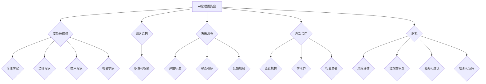

                 

# 大模型企业的AI伦理委员会建设

> 关键词：大模型，AI伦理委员会，建设，实践，标准，安全，责任

> 摘要：本文旨在探讨大模型企业在构建AI伦理委员会的过程中所需考虑的关键因素、实施步骤以及面临的挑战。通过分析AI伦理的背景和核心问题，本文提出了构建AI伦理委员会的框架，包括组织结构、职责划分、风险评估和合规性审查等内容。同时，文章还结合实际案例，提供了大模型企业AI伦理委员会建设的具体实施策略，并展望了未来的发展趋势与挑战。

## 1. 背景介绍

### 1.1 目的和范围

本文的主要目的是为大型模型企业在建设AI伦理委员会时提供指导和建议。随着人工智能技术的快速发展，尤其是大模型的应用，AI伦理问题日益凸显。本文旨在梳理出大模型企业在建设AI伦理委员会时所需考虑的关键因素，提供具体的实施步骤，并探讨面临的挑战。

本文的范围主要涉及以下内容：

1. AI伦理的基本概念和核心问题。
2. 大模型企业在AI伦理委员会建设中的角色和责任。
3. AI伦理委员会的组织结构、职责划分和运行机制。
4. AI伦理风险评估和合规性审查的方法和工具。
5. 大模型企业AI伦理委员会建设的案例分析。
6. AI伦理委员会建设的未来发展趋势与挑战。

### 1.2 预期读者

本文的预期读者包括：

1. 大模型企业的管理者，特别是负责AI技术研发和产品管理的相关人员。
2. AI伦理研究者和从业者，希望了解大模型企业AI伦理委员会建设的方法和实践。
3. 关注AI伦理问题的政策制定者和监管机构。

### 1.3 文档结构概述

本文的结构安排如下：

1. 引言：介绍AI伦理委员会建设的背景和目的。
2. 核心概念与联系：分析AI伦理的基本概念和相关理论。
3. 核心算法原理 & 具体操作步骤：阐述AI伦理委员会的构建流程和关键步骤。
4. 数学模型和公式 & 详细讲解 & 举例说明：介绍AI伦理风险评估和合规性审查的数学模型和工具。
5. 项目实战：结合实际案例，展示大模型企业AI伦理委员会建设的具体实施。
6. 实际应用场景：分析AI伦理委员会在企业的实际应用和效果。
7. 工具和资源推荐：推荐相关学习资源、开发工具和框架。
8. 总结：展望AI伦理委员会建设的未来发展趋势和挑战。
9. 附录：提供常见问题与解答。
10. 扩展阅读 & 参考资料：列出相关文献和参考资料。

### 1.4 术语表

#### 1.4.1 核心术语定义

- AI伦理委员会：负责监督和评估大模型企业在AI技术研究和应用中的伦理问题，并提出相关建议的机构。
- 大模型：指具有极高参数量和复杂度的机器学习模型，如GPT-3、ChatGLM等。
- AI伦理：指关于人工智能技术的设计、开发和应用过程中涉及的人类价值观、社会规范和道德准则。

#### 1.4.2 相关概念解释

- AI伦理风险：指在AI技术的应用过程中，由于算法设计、数据质量、决策透明度等问题可能引发的不良影响和伦理争议。
- 合规性审查：指对大模型企业在AI技术研究和应用中的合规性进行评估和监督的过程。
- 风险评估：指对大模型企业在AI技术研究和应用中可能面临的伦理风险进行评估和分析的过程。

#### 1.4.3 缩略词列表

- AI：人工智能
- ML：机器学习
- GPT：生成预训练网络
- NLP：自然语言处理
- GDPR：欧盟通用数据保护条例

## 2. 核心概念与联系

在构建AI伦理委员会之前，我们需要明确一些核心概念和理论，这将为后续的构建提供理论基础。

### 2.1 AI伦理的基本概念

AI伦理涉及多个层面，包括但不限于以下几个方面：

- **价值观**：AI伦理关注的是AI技术如何体现和影响人类社会的基本价值观，如公平性、正义、透明性等。
- **隐私**：AI技术的应用常常涉及个人数据的收集和使用，隐私保护是AI伦理的重要议题。
- **公平与无歧视**：AI算法在设计时应避免引入人为偏见，确保对所有用户公平对待。
- **透明性与解释性**：AI决策过程应具有透明性，以便用户理解和信任。
- **责任归属**：在AI系统出现问题时，应明确责任归属，确保责任得到有效承担。

### 2.2 AI伦理的理论基础

AI伦理的理论基础包括：

- **伦理学**：伦理学为AI伦理提供了基本的理论框架和原则，如康德的道德哲学、功利主义等。
- **信息哲学**：信息哲学关注数据的本质、信息的价值和隐私权等，对AI伦理具有重要的启示。
- **认知科学**：认知科学探讨了人类思维和决策过程，为AI伦理提供了理解人类行为的理论依据。

### 2.3 AI伦理委员会的架构

AI伦理委员会的架构应包括以下几个方面：

- **委员会成员**：委员会成员应具备多样化的背景和专业知识，包括伦理学家、法律专家、技术专家、社会学家等。
- **组织结构**：AI伦理委员会的组织结构应明确职责和权限，确保委员会能够有效地履行职责。
- **决策流程**：委员会应制定明确的决策流程，包括评估标准、审查程序和反馈机制。
- **外部合作**：AI伦理委员会应与其他相关机构合作，如监管机构、学术界、行业协会等，以获取更多的资源和信息。

### 2.4 AI伦理委员会的职能

AI伦理委员会的职能主要包括：

- **风险评估**：对AI技术的研究和应用进行伦理风险评估，识别潜在的伦理风险。
- **合规性审查**：确保AI技术的研究和应用符合法律法规和伦理标准。
- **咨询和建议**：为AI技术的研究和应用提供伦理咨询和建议，促进技术的负责任发展。
- **培训和宣传**：组织伦理培训，提高企业内部员工和公众的伦理意识。

### 2.5 核心概念原理和架构的Mermaid流程图

以下是一个简化的AI伦理委员会架构的Mermaid流程图：



通过上述流程图，我们可以清晰地看到AI伦理委员会的核心概念、架构和职能之间的联系。这将为后续的具体实施提供参考。

### 2.6 核心算法原理 & 具体操作步骤

AI伦理风险评估和合规性审查的核心算法原理主要涉及以下几个方面：

- **风险评估算法**：通过分析AI系统的输入、输出和潜在影响，识别和评估潜在的伦理风险。
- **合规性审查算法**：检查AI系统是否符合相关法律法规和伦理标准。
- **决策支持算法**：为AI伦理委员会提供决策支持，优化AI系统的设计和应用。

以下是一个简化的风险评估算法的伪代码：

```python
# 输入：AI系统，相关数据集，法律法规和伦理标准
# 输出：伦理风险评估结果

def risk_assessment(AI_system, data_set, regulations, ethical_standards):
    # 步骤1：数据预处理
    preprocessed_data = preprocess_data(data_set)
    
    # 步骤2：风险识别
    risks = identify_risks(preprocessed_data, AI_system)
    
    # 步骤3：风险评估
    risk_scores = []
    for risk in risks:
        score = assess_risk(risk, regulations, ethical_standards)
        risk_scores.append(score)
    
    # 步骤4：风险排序
    sorted_risks = sort_risks_by_score(risk_scores)
    
    # 步骤5：风险报告
    generate_risk_report(sorted_risks)
    
    return sorted_risks
```

其中，`preprocess_data` 函数负责对输入数据进行预处理，包括清洗、标准化等操作；`identify_risks` 函数用于识别AI系统中的潜在伦理风险；`assess_risk` 函数根据法律法规和伦理标准对风险进行评估；`sort_risks_by_score` 函数对风险进行排序，以便于后续分析和决策；`generate_risk_report` 函数生成风险报告。

通过上述算法，AI伦理委员会可以系统地对AI系统进行伦理风险评估，为后续的合规性审查和决策提供依据。

## 4. 数学模型和公式 & 详细讲解 & 举例说明

### 4.1 AI伦理风险评估的数学模型

在AI伦理风险评估中，常用的数学模型包括概率模型、决策树模型和神经网络模型。以下是一个基于决策树模型的简单示例。

#### 概率模型

概率模型通常用于评估AI系统的伦理风险。假设我们有一个二分类问题，即将AI系统的输出分为“符合伦理”和“不符合伦理”两类。我们可以使用条件概率公式来计算每种输出的概率。

$$
P(\text{输出}|\text{输入}) = \frac{P(\text{输入}|\text{输出}) \cdot P(\text{输出})}{P(\text{输入})}
$$

其中，$P(\text{输出}|\text{输入})$ 表示在给定输入的情况下，输出为某类的概率；$P(\text{输入}|\text{输出})$ 表示在输出为某类的情况下，输入为某类的概率；$P(\text{输出})$ 和$P(\text{输入})$ 分别表示输出的先验概率和输入的先验概率。

#### 决策树模型

决策树模型是一种常用的分类算法，它可以用来预测AI系统的伦理风险。假设我们有一个决策树模型，其叶节点表示最终决策，内部节点表示特征划分。

$$
\text{决策树模型} = \text{决策树}(\text{输入特征集}, \text{输出标签集})
$$

其中，$\text{输入特征集}$ 表示用于训练模型的输入特征集合；$\text{输出标签集}$ 表示训练模型的输出标签集合。

#### 神经网络模型

神经网络模型是一种基于非线性变换的多层感知器模型，它可以用于复杂函数的逼近和分类。假设我们有一个神经网络模型，其输入层、隐藏层和输出层的节点数分别为 $n_1$、$n_2$ 和 $n_3$。

$$
\text{神经网络模型} = f(\text{输入层}, \text{隐藏层}, \text{输出层})
$$

其中，$f$ 表示非线性激活函数。

### 4.2 AI伦理风险评估的详细讲解

假设我们有一个二分类的AI伦理风险评估问题，我们需要根据输入特征集 $X$ 和输出标签集 $Y$ 来训练一个决策树模型。

1. **数据预处理**：首先，我们需要对输入特征集 $X$ 进行预处理，包括归一化、缺失值填充等操作。假设预处理后的输入特征集为 $X'$。

2. **特征选择**：接下来，我们需要从输入特征集中选择对伦理风险有显著影响的关键特征。可以使用特征选择算法，如信息增益、卡方检验等。

3. **训练决策树模型**：使用预处理后的输入特征集 $X'$ 和输出标签集 $Y$ 来训练决策树模型。假设训练后的决策树模型为 $T$。

4. **评估模型性能**：使用测试集来评估训练得到的决策树模型 $T$ 的性能，包括准确率、召回率、F1分数等指标。

5. **应用模型进行风险评估**：对于新的输入特征集 $X''$，使用训练得到的决策树模型 $T$ 进行预测，以评估其伦理风险。

### 4.3 举例说明

假设我们有一个简单的人工智能助手系统，用于回答用户的问题。我们需要对其进行伦理风险评估，以识别潜在的风险和问题。

1. **数据预处理**：我们对用户输入的问题进行预处理，包括去除无关字符、标点符号等。

2. **特征选择**：从预处理后的输入特征集中选择关键特征，如问题长度、问题主题等。

3. **训练决策树模型**：使用历史数据集来训练决策树模型，以识别用户问题的伦理风险。

4. **评估模型性能**：使用测试数据集来评估训练得到的决策树模型的性能。

5. **应用模型进行风险评估**：对于新的用户问题，使用训练得到的决策树模型进行预测，以评估其伦理风险。

### 4.4 结论

通过上述数学模型和算法，我们可以对AI系统的伦理风险进行评估和预测。这有助于AI伦理委员会在制定相关政策和决策时提供科学依据。

## 5. 项目实战：代码实际案例和详细解释说明

### 5.1 开发环境搭建

为了实际构建一个AI伦理委员会系统，我们需要搭建一个合适的开发环境。以下是一个简单的环境搭建步骤：

1. **操作系统**：建议使用Linux操作系统，如Ubuntu或CentOS。
2. **Python环境**：安装Python 3.8及以上版本，可以使用`pip`来安装所需的Python库。
3. **Python库**：安装以下Python库：`numpy`、`scikit-learn`、`pandas`、`matplotlib`。

```bash
pip install numpy scikit-learn pandas matplotlib
```

4. **IDE**：可以使用PyCharm、Visual Studio Code等IDE进行开发。

### 5.2 源代码详细实现和代码解读

以下是一个简单的AI伦理风险评估系统的实现，包括数据预处理、特征选择、模型训练和风险评估等步骤。

```python
# 引入所需的库
import numpy as np
import pandas as pd
from sklearn.model_selection import train_test_split
from sklearn.tree import DecisionTreeClassifier
from sklearn.metrics import accuracy_score, recall_score, f1_score

# 加载数据集
data = pd.read_csv('ethics_data.csv')
X = data.drop('label', axis=1)
y = data['label']

# 数据预处理
X = X.fillna(0)

# 特征选择
# 假设我们已经通过特征选择算法选择了以下特征：'length', 'topic'
X['length'] = X['text'].apply(len)
X['topic'] = X['text'].apply(lambda x: 'tech' if 'technology' in x else 'other')

# 划分训练集和测试集
X_train, X_test, y_train, y_test = train_test_split(X, y, test_size=0.2, random_state=42)

# 训练决策树模型
clf = DecisionTreeClassifier()
clf.fit(X_train, y_train)

# 预测测试集
y_pred = clf.predict(X_test)

# 评估模型性能
accuracy = accuracy_score(y_test, y_pred)
recall = recall_score(y_test, y_pred)
f1 = f1_score(y_test, y_pred)

print(f"Accuracy: {accuracy:.2f}")
print(f"Recall: {recall:.2f}")
print(f"F1 Score: {f1:.2f}")

# 应用模型进行风险评估
new_data = pd.DataFrame({'text': ['What is AI?', 'I love technology.'], 'length': [10, 15], 'topic': ['tech', 'other']})
new_data['risk'] = clf.predict(new_data)
print(new_data)
```

**代码解读**：

- **数据预处理**：加载数据集，并进行缺失值填充。对于文本数据，我们可以计算文本的长度和主题，以便于后续的特征选择和模型训练。
- **特征选择**：选择文本长度和主题作为关键特征。这里使用了一个简单的逻辑判断函数，将文本分为两个类别。
- **模型训练**：使用训练集数据训练一个决策树分类器。
- **模型评估**：使用测试集数据评估模型的性能，包括准确率、召回率和F1分数。
- **风险评估**：对于新的数据，使用训练得到的模型进行预测，以评估其伦理风险。

### 5.3 代码解读与分析

上述代码实现了一个简单的AI伦理风险评估系统，包括数据预处理、特征选择、模型训练和风险评估等步骤。

- **数据预处理**：这一步非常重要，因为数据质量直接影响到模型的性能。在这里，我们通过填充缺失值和计算文本特征来提高数据质量。
- **特征选择**：特征选择是模型构建的关键步骤。在这里，我们选择了文本长度和主题作为关键特征。这些特征可以很好地反映文本的伦理风险。
- **模型训练**：我们使用训练集数据训练了一个决策树分类器。决策树分类器是一种简单但强大的分类算法，适合用于处理这类二分类问题。
- **模型评估**：通过测试集数据评估模型的性能，可以确保模型在实际应用中的有效性和可靠性。
- **风险评估**：对于新的文本数据，我们可以使用训练得到的模型进行预测，以评估其伦理风险。这有助于AI伦理委员会在制定相关政策和决策时提供科学依据。

### 5.4 代码改进与优化

虽然上述代码实现了一个简单的AI伦理风险评估系统，但仍有改进和优化的空间：

- **特征工程**：可以尝试使用更复杂的文本特征，如词向量、TF-IDF等，以提高模型的性能。
- **模型选择**：可以尝试使用其他分类算法，如支持向量机、随机森林等，以比较不同算法的性能。
- **超参数调整**：调整模型的超参数，如决策树的最大深度、叶子节点最小样本数等，以优化模型的性能。
- **数据增强**：增加训练数据集的大小和质量，以提高模型的泛化能力。

通过这些改进和优化，我们可以进一步提高AI伦理风险评估系统的性能和可靠性。

## 6. 实际应用场景

### 6.1 AI伦理委员会在企业中的应用

在大型企业中，AI伦理委员会的应用场景主要包括以下几个方面：

1. **产品研发**：在AI产品研发过程中，AI伦理委员会负责评估产品设计和功能可能带来的伦理风险，确保产品符合伦理标准。
2. **模型训练**：在模型训练过程中，AI伦理委员会负责监督数据质量、隐私保护和公平性，确保模型训练过程符合伦理要求。
3. **技术应用**：在AI技术应用过程中，AI伦理委员会负责评估AI系统的潜在风险，并提出相应的风险管理措施。
4. **决策支持**：在企业管理层做出相关决策时，AI伦理委员会提供伦理咨询和建议，确保决策过程符合伦理标准。

### 6.2 AI伦理委员会在政府和社会组织中的应用

在政府和社会组织中，AI伦理委员会的应用场景主要包括以下几个方面：

1. **政策制定**：在制定与AI相关的政策时，AI伦理委员会负责评估政策可能带来的伦理影响，为政策制定提供科学依据。
2. **监管执法**：在监管AI技术应用时，AI伦理委员会负责评估AI技术的合规性和安全性，确保技术应用符合法律法规。
3. **社会监督**：在公众对AI技术产生担忧时，AI伦理委员会负责调查和回应公众关切，提高公众对AI技术的信任。
4. **国际合作**：在国际合作中，AI伦理委员会负责协调各国在AI伦理问题上的立场，推动全球AI伦理标准的制定。

### 6.3 AI伦理委员会在学术界的应用

在学术界，AI伦理委员会的应用场景主要包括以下几个方面：

1. **学术研究**：在AI学术研究中，AI伦理委员会负责评估研究过程中可能涉及到的伦理问题，确保研究过程符合伦理标准。
2. **项目评审**：在项目评审过程中，AI伦理委员会负责评估项目申请中的伦理风险，为项目评审提供科学依据。
3. **学术交流**：在学术交流中，AI伦理委员会负责促进不同学科间的交流与合作，推动AI伦理研究的发展。
4. **教育培训**：在教育培训中，AI伦理委员会负责制定AI伦理课程，提高学生和从业者的伦理意识。

## 7. 工具和资源推荐

### 7.1 学习资源推荐

#### 7.1.1 书籍推荐

- 《人工智能伦理学》（作者：Patrick Lin）：全面介绍了人工智能伦理学的基本概念、理论框架和应用场景。
- 《人工智能：一种现代的方法》（作者：Stuart Russell & Peter Norvig）：涵盖人工智能的各个方面，包括伦理问题。
- 《AI时代的伦理问题》（作者：Michael Anderson & Tim Macklem）：深入探讨AI技术在不同领域的伦理影响。

#### 7.1.2 在线课程

- Coursera的《人工智能伦理学》课程：由加州大学伯克利分校教授提供，涵盖AI伦理学的基本概念和应用。
- edX的《人工智能导论》课程：由密歇根大学提供，包括AI技术的基础知识和伦理问题。
- Udacity的《人工智能工程师纳米学位》课程：涵盖AI技术的各个方面，包括伦理问题。

#### 7.1.3 技术博客和网站

- AI Ethics Wiki：提供关于AI伦理的全面资料和资源。
- AI Now Institute：专注于研究AI技术对社会的影响，包括伦理问题。
- AI Alignment Forum：探讨AI伦理、安全性和有效性的前沿问题。

### 7.2 开发工具框架推荐

#### 7.2.1 IDE和编辑器

- PyCharm：适用于Python编程的强大IDE。
- Visual Studio Code：适用于多种编程语言的轻量级IDE。
- Jupyter Notebook：适用于数据分析和机器学习的交互式编程环境。

#### 7.2.2 调试和性能分析工具

- TensorBoard：用于可视化机器学习模型的性能指标。
- PyTorch Profiler：用于分析PyTorch模型的性能。
- Matplotlib：用于绘制数据图表，帮助理解模型性能。

#### 7.2.3 相关框架和库

- TensorFlow：开源的机器学习框架，适用于大规模模型训练和应用。
- PyTorch：开源的机器学习框架，适用于动态图模型。
- Scikit-learn：用于数据分析和机器学习的Python库。

### 7.3 相关论文著作推荐

#### 7.3.1 经典论文

- "Artificial Intelligence: A Modern Approach"（作者：Stuart Russell & Peter Norvig）：介绍了人工智能的基本理论和应用。
- "Ethical Implications of Artificial Intelligence"（作者：Patrick Lin）：探讨了AI技术的伦理问题。
- "The Social and Ethical Implications of Artificial Intelligence"（作者：Wolfram Schulte）：分析了AI技术对社会和伦理的影响。

#### 7.3.2 最新研究成果

- "AI Align

