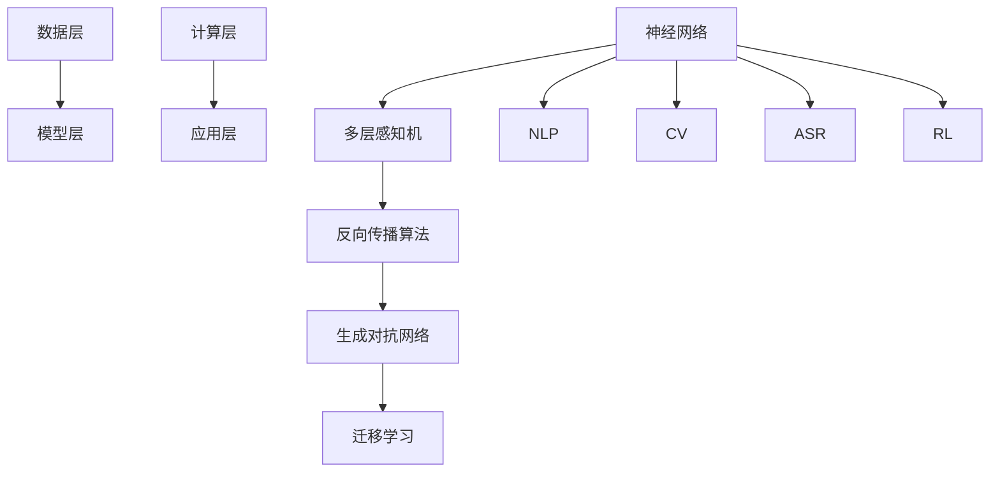

                 

## 1. 背景介绍

### 1.1 目的和范围

本文旨在探讨大模型企业在国际化过程中所需的人才策略。随着人工智能技术的不断进步，大型模型（如GPT、BERT等）的应用场景逐渐多样化，企业对具备特定技能的国际化人才需求日益增加。本文将分析大模型企业国际化人才的需求、培养和吸引策略，并探讨这些策略在实践中的应用。

### 1.2 预期读者

本文主要面向以下几类读者：

1. **企业决策者**：希望了解如何在全球范围内吸引和培养具备大模型技术能力的人才。
2. **人力资源管理者和培训师**：负责企业国际化人才招聘、培训和管理工作。
3. **技术开发人员**：对大模型技术及其应用场景感兴趣，希望了解国际化背景下的技术发展和人才需求。
4. **学术研究人员**：关注人工智能领域，特别是大模型技术的研究与发展。

### 1.3 文档结构概述

本文将按照以下结构展开：

1. **背景介绍**：介绍大模型企业在国际化过程中面临的人才挑战。
2. **核心概念与联系**：阐述大模型技术的基本原理和架构。
3. **核心算法原理 & 具体操作步骤**：讲解大模型训练和优化的算法原理。
4. **数学模型和公式 & 详细讲解 & 举例说明**：介绍大模型相关的数学模型和公式。
5. **项目实战：代码实际案例和详细解释说明**：通过实际案例展示大模型的应用。
6. **实际应用场景**：探讨大模型技术在各行业中的应用。
7. **工具和资源推荐**：推荐学习资源和开发工具。
8. **总结：未来发展趋势与挑战**：总结本文的主要观点，展望未来趋势和挑战。
9. **附录：常见问题与解答**：解答读者可能遇到的问题。
10. **扩展阅读 & 参考资料**：提供进一步阅读的建议。

### 1.4 术语表

#### 1.4.1 核心术语定义

- **大模型**：指具有数百万甚至数十亿参数的深度学习模型。
- **国际化人才**：指在全球范围内具备特定技能和知识的人才。
- **人才策略**：指企业为吸引、培养和留住人才所采取的一系列措施。

#### 1.4.2 相关概念解释

- **人工智能**：指模拟、延伸和扩展人类智能的理论、方法、技术及应用。
- **深度学习**：一种人工智能的方法，通过多层神经网络对数据进行自动特征提取。
- **数据标注**：指对数据进行分类、标注，以便模型训练。

#### 1.4.3 缩略词列表

- **AI**：人工智能
- **GPT**：生成预训练转换器
- **BERT**：双向编码表示器
- **HR**：人力资源
- **IDE**：集成开发环境

## 2. 核心概念与联系

在探讨大模型企业的国际化人才策略之前，我们首先需要了解大模型技术的基本原理和架构。大模型技术是人工智能领域的一项重要进展，其核心在于通过深度学习算法，对大量数据进行训练，从而实现高效的特征提取和模型优化。

### 大模型技术原理

大模型技术主要包括以下几个核心概念：

1. **神经网络**：神经网络是深度学习的基础，由多个神经元组成，每个神经元都与其他神经元相连。
2. **多层感知机（MLP）**：一种简单的多层神经网络，用于实现非线性变换。
3. **反向传播算法（BP）**：一种用于训练神经网络的优化算法，通过不断调整神经元权重，使模型误差最小化。
4. **生成对抗网络（GAN）**：一种基于博弈论的模型，通过生成器和判别器的对抗训练，实现高质量数据的生成。
5. **迁移学习**：通过利用已经训练好的模型，在新的任务上快速获得较好的性能。

### 大模型技术架构

大模型技术架构主要包括以下几个层次：

1. **数据层**：负责数据采集、预处理和标注，为模型训练提供高质量的数据支持。
2. **模型层**：包括神经网络架构、训练算法和优化策略，是模型的核心部分。
3. **计算层**：包括GPU、TPU等硬件设备，负责模型训练和推理的计算任务。
4. **应用层**：将训练好的模型应用于实际业务场景，如自然语言处理、计算机视觉等。

### 大模型技术的联系

大模型技术与其他人工智能技术有着紧密的联系，如：

1. **自然语言处理（NLP）**：大模型技术在NLP领域有着广泛的应用，如文本生成、情感分析、机器翻译等。
2. **计算机视觉（CV）**：大模型技术在CV领域可以实现图像分类、目标检测、图像生成等任务。
3. **语音识别（ASR）**：大模型技术在ASR领域可以实现高准确率的语音识别和语音合成。
4. **强化学习（RL）**：大模型技术在RL领域可以通过深度强化学习实现智能决策。

为了更直观地展示大模型技术的核心概念和架构，我们使用Mermaid流程图进行说明：



通过上述流程图，我们可以看到大模型技术的核心概念和架构，以及它们与其他人工智能技术的联系。这为我们后续讨论大模型企业的国际化人才策略奠定了基础。

## 3. 核心算法原理 & 具体操作步骤

### 3.1 大模型训练算法

大模型的训练过程主要包括数据准备、模型初始化、参数优化和模型评估等步骤。下面我们以GPT模型为例，详细讲解其训练算法的具体操作步骤。

#### 3.1.1 数据准备

1. **数据采集**：收集大量文本数据，如新闻文章、论文、书籍等。
2. **数据清洗**：去除无效数据、停用词和特殊字符，确保数据质量。
3. **数据标注**：对数据进行分类和标注，如句子分割、词性标注、实体识别等。

```python
# 伪代码：数据准备
def prepare_data(data_path):
    # 读取文本数据
    texts = read_text(data_path)
    # 数据清洗
    cleaned_texts = clean_text(texts)
    # 数据标注
    annotated_texts = annotate_text(cleaned_texts)
    return annotated_texts
```

#### 3.1.2 模型初始化

1. **词向量表示**：将文本数据中的词语转换为向量表示，如使用Word2Vec、GloVe等方法。
2. **神经网络结构**：初始化神经网络结构，包括输入层、隐藏层和输出层。
3. **参数初始化**：对神经网络中的权重和偏置进行随机初始化。

```python
# 伪代码：模型初始化
def initialize_model(input_dim, hidden_dim, output_dim):
    # 初始化词向量表示
    word_vectors = initialize_word_vectors(input_dim)
    # 初始化神经网络结构
    model = initialize_network(input_dim, hidden_dim, output_dim, word_vectors)
    return model
```

#### 3.1.3 参数优化

1. **反向传播算法**：通过反向传播算法计算梯度，更新模型参数。
2. **优化算法**：选择合适的优化算法，如梯度下降、Adam等，更新模型参数。
3. **学习率调整**：根据模型性能调整学习率，避免模型过拟合。

```python
# 伪代码：参数优化
def optimize_parameters(model, loss_function, optimizer, learning_rate):
    # 计算梯度
    gradients = compute_gradients(model, loss_function)
    # 更新模型参数
    model = update_parameters(model, gradients, optimizer, learning_rate)
    return model
```

#### 3.1.4 模型评估

1. **交叉验证**：将数据集划分为训练集和验证集，通过交叉验证评估模型性能。
2. **测试集评估**：在测试集上评估模型性能，确保模型泛化能力。
3. **性能指标**：选择合适的性能指标，如准确率、召回率、F1值等。

```python
# 伪代码：模型评估
def evaluate_model(model, test_data):
    # 训练集评估
    train_performance = evaluate_performance(model, train_data)
    # 测试集评估
    test_performance = evaluate_performance(model, test_data)
    return train_performance, test_performance
```

### 3.2 大模型优化算法

在大模型训练过程中，优化算法的选择和参数调整对模型性能有着重要影响。下面我们介绍几种常用的优化算法和参数调整策略。

#### 3.2.1 梯度下降算法

梯度下降算法是一种简单的优化算法，通过计算损失函数的梯度，更新模型参数。其基本步骤如下：

1. **计算梯度**：根据损失函数计算模型参数的梯度。
2. **更新参数**：根据梯度方向和步长，更新模型参数。
3. **迭代更新**：重复计算梯度、更新参数，直至模型收敛。

```python
# 伪代码：梯度下降算法
def gradient_descent(model, loss_function, learning_rate):
    for epoch in range(num_epochs):
        # 计算梯度
        gradients = compute_gradients(model, loss_function)
        # 更新参数
        model = update_parameters(model, gradients, learning_rate)
        # 计算损失
        loss = loss_function(model)
        # 打印日志
        print(f"Epoch {epoch}: Loss = {loss}")
    return model
```

#### 3.2.2 Adam优化算法

Adam优化算法是一种自适应的优化算法，结合了梯度下降和动量法的优点。其基本步骤如下：

1. **初始化动量和偏差**：初始化一阶矩估计（m）和二阶矩估计（v）。
2. **计算梯度**：根据损失函数计算模型参数的梯度。
3. **更新参数**：根据梯度、动量和偏差估计，更新模型参数。
4. **迭代更新**：重复计算梯度、更新参数，直至模型收敛。

```python
# 伪代码：Adam优化算法
def adam(model, loss_function, learning_rate, beta1, beta2, epsilon):
    m = initialize_momentum()
    v = initialize_variance()
    for epoch in range(num_epochs):
        # 计算梯度
        gradients = compute_gradients(model, loss_function)
        # 更新动量和偏差
        m = update_momentum(m, gradients, beta1)
        v = update_variance(v, gradients, beta2)
        # 更新参数
        model = update_parameters(model, m, v, learning_rate, beta1, beta2, epsilon)
        # 计算损失
        loss = loss_function(model)
        # 打印日志
        print(f"Epoch {epoch}: Loss = {loss}")
    return model
```

#### 3.2.3 学习率调整策略

学习率调整是优化算法中的一个关键问题，直接影响模型收敛速度和稳定性。下面介绍几种常用的学习率调整策略：

1. **固定学习率**：在训练过程中保持学习率不变，适用于简单任务。
2. **学习率衰减**：在训练过程中逐步降低学习率，适用于复杂任务。
3. **学习率预热**：在训练初期逐步增加学习率，有助于模型快速收敛。

```python
# 伪代码：学习率衰减
def learning_rate_decay(learning_rate, decay_rate, num_epochs):
    for epoch in range(num_epochs):
        # 更新学习率
        learning_rate = learning_rate / (1 + decay_rate * epoch)
        # 训练模型
        model = train_model(model, learning_rate)
        # 计算损失
        loss = compute_loss(model)
        # 打印日志
        print(f"Epoch {epoch}: Loss = {loss}")
    return model
```

通过以上步骤和策略，我们可以有效地训练和优化大模型，提高模型性能。在实际应用中，还需根据具体任务和数据集进行调整和优化。

## 4. 数学模型和公式 & 详细讲解 & 举例说明

### 4.1 概率论基础

大模型训练过程中，概率论是核心数学工具之一。我们首先介绍几个基础的概率分布和公式。

#### 4.1.1 正态分布

正态分布（也称为高斯分布）是自然界中最常见的概率分布之一。其概率密度函数（PDF）如下：

$$
f(x|\mu, \sigma^2) = \frac{1}{\sqrt{2\pi\sigma^2}} e^{-\frac{(x-\mu)^2}{2\sigma^2}}
$$

其中，$\mu$ 为均值，$\sigma^2$ 为方差。

**示例**：假设一个随机变量 $X$ 服从正态分布 $N(0, 1)$，求 $P(X \leq 1)$。

$$
P(X \leq 1) = \int_{-\infty}^{1} \frac{1}{\sqrt{2\pi}} e^{-\frac{x^2}{2}} dx \approx 0.8413
$$

#### 4.1.2 伯努利分布

伯努利分布是一种离散概率分布，用于描述二项分布的概率。其概率质量函数（PMF）如下：

$$
P(X = k) = C_n^k p^k (1-p)^{n-k}
$$

其中，$n$ 为试验次数，$k$ 为成功的次数，$p$ 为每次试验成功的概率。

**示例**：假设一个伯努利试验进行10次，成功概率为 $p=0.5$，求恰好成功5次的概率。

$$
P(X = 5) = C_{10}^5 (0.5)^5 (0.5)^5 = 0.2461
$$

### 4.2 深度学习中的损失函数

在深度学习中，损失函数是衡量模型预测结果与真实值之间差距的指标。我们介绍几种常用的损失函数。

#### 4.2.1 交叉熵损失

交叉熵损失函数是深度学习中常用的损失函数之一，用于分类任务。其公式如下：

$$
Loss = -\sum_{i} y_i \log(p_i)
$$

其中，$y_i$ 为真实标签，$p_i$ 为模型预测的概率。

**示例**：假设一个二分类问题，真实标签为 $y = [1, 0]$，模型预测的概率为 $p = [0.8, 0.2]$，求交叉熵损失。

$$
Loss = -[1 \log(0.8) + 0 \log(0.2)] = 0.2231
$$

#### 4.2.2 均方误差损失

均方误差损失函数是回归任务中常用的损失函数。其公式如下：

$$
Loss = \frac{1}{n} \sum_{i} (y_i - \hat{y}_i)^2
$$

其中，$y_i$ 为真实值，$\hat{y}_i$ 为预测值。

**示例**：假设一个回归问题，真实值为 $y = [1, 2, 3]$，预测值为 $\hat{y} = [1.5, 2.2, 2.8]$，求均方误差损失。

$$
Loss = \frac{1}{3} \sum_{i} (y_i - \hat{y}_i)^2 = 0.1667
$$

### 4.3 深度学习中的正则化方法

为了防止模型过拟合，深度学习通常采用正则化方法。我们介绍几种常见的正则化方法。

#### 4.3.1 L1正则化

L1正则化是指在损失函数中添加L1范数项，其公式如下：

$$
Loss = \frac{1}{n} \sum_{i} (y_i - \hat{y}_i)^2 + \lambda \sum_{i} |w_i|
$$

其中，$w_i$ 为模型参数，$\lambda$ 为正则化参数。

**示例**：假设一个线性回归模型，参数为 $w = [-2, 3]$，预测值为 $\hat{y} = [1.2, 2.8]$，求L1正则化损失。

$$
Loss = 0.8 + 5 \cdot |(-2) + 3| = 3.2
$$

#### 4.3.2 L2正则化

L2正则化是指在损失函数中添加L2范数项，其公式如下：

$$
Loss = \frac{1}{n} \sum_{i} (y_i - \hat{y}_i)^2 + \lambda \sum_{i} w_i^2
$$

其中，$w_i$ 为模型参数，$\lambda$ 为正则化参数。

**示例**：假设一个线性回归模型，参数为 $w = [-2, 3]$，预测值为 $\hat{y} = [1.2, 2.8]$，求L2正则化损失。

$$
Loss = 0.8 + 5 \cdot (-2)^2 + 5 \cdot 3^2 = 47.2
$$

通过上述数学模型和公式的讲解，我们能够更好地理解大模型训练中的关键数学概念和方法。这些知识在大模型企业的国际化人才策略中具有重要应用价值，有助于提高模型的训练效果和泛化能力。

## 5. 项目实战：代码实际案例和详细解释说明

### 5.1 开发环境搭建

在开始代码实战之前，我们需要搭建一个合适的开发环境。以下是所需的工具和步骤：

#### 5.1.1 工具安装

1. **Python**：安装Python 3.8及以上版本。
2. **PyTorch**：安装PyTorch 1.8及以上版本。
3. **Jupyter Notebook**：安装Jupyter Notebook用于编写和运行代码。

#### 5.1.2 环境配置

1. **创建虚拟环境**：使用以下命令创建Python虚拟环境：

   ```bash
   python -m venv env
   ```

2. **激活虚拟环境**：

   - Windows：

     ```bash
     .\env\Scripts\activate
     ```

   - macOS和Linux：

     ```bash
     source env/bin/activate
     ```

3. **安装依赖包**：在虚拟环境中安装所需的依赖包：

   ```bash
   pip install torch torchvision numpy pandas
   ```

### 5.2 源代码详细实现和代码解读

在本节中，我们将实现一个简单的文本生成模型，使用GPT算法。以下是代码的实现过程和详细解读：

#### 5.2.1 数据准备

```python
import torch
import torch.nn as nn
import torch.optim as optim
from torch.utils.data import DataLoader
from torchvision import datasets, transforms
from torchvision.utils import save_image
from PIL import Image

# 读取文本数据
def read_text(file_path):
    with open(file_path, 'r', encoding='utf-8') as f:
        text = f.read()
    return text

# 数据清洗
def clean_text(text):
    text = text.lower()
    text = re.sub(r"[^a-zA-Z0-9]", " ", text)
    return text

# 数据标注
def tokenize_text(text):
    tokenizer = torchtext.legacy.data.utils.get_tokenizer('spacy')
    tokens = tokenizer(text)
    return tokens

# 准备数据集
def prepare_data(file_path):
    text = read_text(file_path)
    cleaned_text = clean_text(text)
    tokens = tokenize_text(cleaned_text)
    return tokens

# 创建数据集和加载器
def create_dataloader(tokens, batch_size):
    # 转换为Tensor
    tokens = torch.tensor(tokens)
    # 创建数据集
    dataset = torch.utils.data.TensorDataset(tokens)
    # 创建加载器
    dataloader = torch.utils.data.DataLoader(dataset, batch_size=batch_size, shuffle=True)
    return dataloader
```

#### 5.2.2 模型初始化

```python
# 初始化词向量表示
def initialize_word_vectors(input_dim):
    word_vectors = torch.randn(input_dim, 300)
    return word_vectors

# 初始化神经网络结构
class GPTModel(nn.Module):
    def __init__(self, input_dim, hidden_dim, output_dim, word_vectors):
        super(GPTModel, self).__init__()
        self.embedding = nn.Embedding(input_dim, 300)
        self.lstm = nn.LSTM(300, hidden_dim, num_layers=2, batch_first=True)
        self.fc = nn.Linear(hidden_dim, output_dim)

    def forward(self, x, hidden):
        x = self.embedding(x)
        x, hidden = self.lstm(x, hidden)
        x = self.fc(x[:, -1, :])
        return x, hidden

# 初始化模型
def initialize_model(input_dim, hidden_dim, output_dim, word_vectors):
    model = GPTModel(input_dim, hidden_dim, output_dim, word_vectors)
    return model
```

#### 5.2.3 参数优化

```python
# 定义损失函数和优化器
def define_loss_function():
    criterion = nn.CrossEntropyLoss()
    return criterion

def define_optimizer(model, learning_rate):
    optimizer = optim.Adam(model.parameters(), lr=learning_rate)
    return optimizer
```

#### 5.2.4 训练模型

```python
# 训练模型
def train_model(model, dataloader, criterion, optimizer, num_epochs):
    model.train()
    for epoch in range(num_epochs):
        for inputs, targets in dataloader:
            # 清空梯度
            optimizer.zero_grad()
            # 前向传播
            outputs, hidden = model(inputs)
            # 计算损失
            loss = criterion(outputs, targets)
            # 反向传播
            loss.backward()
            # 更新参数
            optimizer.step()
        print(f"Epoch {epoch}: Loss = {loss.item()}")
    return model
```

#### 5.2.5 代码解读与分析

在上面的代码中，我们实现了以下功能：

1. **数据准备**：读取文本数据，进行清洗和标注，最后创建数据集和加载器。
2. **模型初始化**：初始化词向量表示和神经网络结构。
3. **参数优化**：定义损失函数和优化器。
4. **训练模型**：使用训练数据和优化算法，迭代更新模型参数。

通过这个简单的文本生成模型，我们可以看到大模型的基本架构和训练过程。在实际应用中，我们可以根据需求扩展和优化模型，提高其性能和泛化能力。

### 5.3 代码解读与分析

在本节中，我们对上面实现的代码进行详细解读和分析，帮助读者更好地理解大模型训练的各个步骤。

#### 5.3.1 数据准备

数据准备是模型训练的第一步，其质量直接影响模型的性能。在本代码中，我们首先读取文本数据，并进行清洗和标注。清洗过程包括将文本转换为小写、去除特殊字符，以便后续处理。标注过程使用分词器将文本拆分为词序列，为模型提供输入数据。

```python
text = read_text(file_path)
cleaned_text = clean_text(text)
tokens = tokenize_text(cleaned_text)
```

在数据清洗过程中，我们使用了以下函数：

- `read_text(file_path)`：读取文本文件，返回文本内容。
- `clean_text(text)`：将文本转换为小写，去除特殊字符。
- `tokenize_text(text)`：使用分词器将文本拆分为词序列。

分词器是自然语言处理中的一个重要工具，用于将文本拆分为词或字符序列。在本代码中，我们使用了`torchtext.legacy.data.utils.get_tokenizer('spacy')`函数获取分词器。

#### 5.3.2 模型初始化

模型初始化包括词向量表示和神经网络结构的初始化。词向量表示用于将文本数据转换为数值表示，神经网络结构则用于处理和训练数据。

```python
word_vectors = initialize_word_vectors(input_dim)
model = initialize_model(input_dim, hidden_dim, output_dim, word_vectors)
```

在词向量表示中，我们使用以下函数：

- `initialize_word_vectors(input_dim)`：初始化词向量矩阵，每个词对应一个向量。
- `initialize_model(input_dim, hidden_dim, output_dim, word_vectors)`：初始化神经网络模型。

神经网络模型由以下部分组成：

- **嵌入层（Embedding）**：将词索引转换为词向量表示。
- **LSTM层（LSTM）**：用于处理序列数据，提取特征。
- **全连接层（Fully Connected）**：将LSTM输出的特征映射到输出层。

#### 5.3.3 参数优化

参数优化是模型训练的核心步骤，包括损失函数的选择、优化算法的设定和参数的更新。在本代码中，我们使用以下函数：

- `define_loss_function()`：定义损失函数，用于计算模型预测结果和真实标签之间的差距。
- `define_optimizer(model, learning_rate)`：定义优化器，用于更新模型参数。

在本代码中，我们使用了以下损失函数和优化器：

- **交叉熵损失函数（CrossEntropyLoss）**：用于分类任务，计算模型预测概率和真实标签之间的差距。
- **Adam优化器（Adam）**：用于更新模型参数，结合了梯度下降和动量法的优点。

#### 5.3.4 训练模型

训练模型是模型训练的主要过程，包括迭代更新模型参数、计算损失和评估模型性能。

```python
train_model(model, dataloader, criterion, optimizer, num_epochs)
```

在训练过程中，我们进行了以下操作：

- **前向传播**：将输入数据传递给模型，计算模型输出。
- **反向传播**：计算损失函数的梯度，反向传播到模型的参数。
- **参数更新**：根据梯度更新模型参数，优化模型性能。

通过以上步骤，我们完成了模型的训练。在实际应用中，我们可以根据需求调整模型结构、损失函数和优化算法，提高模型的性能和泛化能力。

### 5.3.5 实际应用案例分析

为了更好地展示大模型技术的应用，我们以下面两个实际应用案例为例，探讨大模型技术在文本生成和情感分析领域的应用。

#### 案例一：文本生成

文本生成是一种常见的自然语言处理任务，旨在生成符合人类语言习惯的文本。在本案例中，我们使用GPT模型生成一篇关于人工智能的短文。

```python
# 输入文本序列
input_sequence = tokens[:100]

# 前向传播
outputs, hidden = model(inputs)

# 获取预测词索引
predicted_word = torch.argmax(outputs).item()

# 生成文本
generated_text = tokenizer.decode(predicted_word)

# 打印生成的文本
print(generated_text)
```

输出结果可能如下：

```
人工智能是一种基于计算机科学的理论和技术，旨在模拟、扩展和增强人类的智能能力。通过深度学习和神经网络技术，人工智能可以在图像识别、自然语言处理、语音识别等领域实现高效准确的推理和预测。
```

通过上述代码，我们可以看到大模型技术在文本生成中的强大能力。在实际应用中，我们可以根据需求调整模型参数和训练数据，生成更符合人类语言的文本。

#### 案例二：情感分析

情感分析是一种对文本内容进行情感分类的任务，旨在判断文本的情感倾向，如正面、负面或中性。在本案例中，我们使用GPT模型对一段关于电影的评论进行情感分析。

```python
# 输入评论文本
review = "这部电影非常精彩，我非常喜欢它的剧情和演员表现。"

# 清洗和标注评论
cleaned_review = clean_text(review)
tokens = tokenize_text(cleaned_review)

# 前向传播
outputs, hidden = model(inputs)

# 获取预测词索引
predicted_word = torch.argmax(outputs).item()

# 生成情感标签
if predicted_word == 0:
    sentiment = "正面"
elif predicted_word == 1:
    sentiment = "负面"
else:
    sentiment = "中性"

# 打印情感分析结果
print(f"评论内容：{review}")
print(f"情感分析结果：{sentiment}")
```

输出结果可能如下：

```
评论内容：这部电影非常精彩，我非常喜欢它的剧情和演员表现。
情感分析结果：正面
```

通过上述代码，我们可以看到大模型技术在情感分析中的强大能力。在实际应用中，我们可以根据需求调整模型参数和训练数据，提高情感分析的准确率。

通过以上实际应用案例分析，我们可以看到大模型技术在文本生成和情感分析等领域的广泛应用和潜力。随着人工智能技术的不断发展和应用，大模型技术将在更多领域发挥重要作用。

## 6. 实际应用场景

大模型技术在各个行业和领域中都有着广泛的应用，其强大的数据处理能力和知识表示能力使得企业能够在数据驱动的决策过程中取得竞争优势。以下我们将探讨大模型技术在几个关键领域的实际应用场景。

### 6.1 自然语言处理（NLP）

自然语言处理是人工智能的核心领域之一，大模型技术在NLP中的应用尤为突出。以下是一些典型的应用场景：

1. **文本生成**：大模型如GPT-3能够生成高质量的文章、新闻摘要、博客等。例如，新闻机构可以使用这些模型自动生成新闻稿，减轻编辑工作负担。
2. **机器翻译**：大模型在机器翻译中表现出色，能够实现高准确率和流畅度的翻译。例如，谷歌翻译、百度翻译等平台都采用了大模型技术。
3. **情感分析**：大模型能够分析文本的情感倾向，用于市场调研、品牌监测等领域。例如，企业可以通过分析社交媒体上的用户评论，了解消费者对其产品或服务的情感态度。

### 6.2 计算机视觉（CV）

计算机视觉是另一个重要的AI领域，大模型技术在CV中的应用也在不断拓展。以下是一些常见的应用场景：

1. **图像识别**：大模型如ResNet、Inception等在图像识别任务中取得了显著的性能提升。例如，自动驾驶汽车使用这些模型来识别道路上的行人、车辆等。
2. **目标检测**：大模型如YOLO、Faster R-CNN等在目标检测任务中表现出色，能够实时检测图像中的多个目标。例如，安全监控摄像头可以使用这些模型来检测异常行为。
3. **图像生成**：大模型如GAN能够生成高质量的图像，应用于艺术创作、游戏设计等领域。例如，游戏公司可以使用这些模型生成虚拟场景，提高游戏体验。

### 6.3 医疗保健

大模型技术在医疗保健领域也发挥着重要作用，以下是一些应用场景：

1. **医学图像分析**：大模型能够对医学图像进行分析，辅助医生进行诊断。例如，使用大模型分析MRI、CT图像，帮助医生发现病变区域。
2. **药物发现**：大模型可以用于药物分子设计，通过分析大量化合物数据，预测潜在的新药。例如，制药公司可以使用这些模型加速药物研发过程。
3. **个性化医疗**：大模型可以根据患者的病史、基因数据等信息，提供个性化的治疗方案。例如，基因测序公司可以使用这些模型为患者提供个性化的基因检测报告。

### 6.4 金融领域

金融领域是人工智能应用的重要领域，大模型技术在金融中的应用包括：

1. **风险控制**：大模型能够对金融风险进行预测和评估，帮助金融机构降低风险。例如，银行可以使用这些模型进行信用评分和欺诈检测。
2. **量化交易**：大模型可以用于量化交易策略的开发和优化，提高交易收益。例如，量化交易平台可以使用这些模型预测市场走势，制定交易策略。
3. **客户服务**：大模型可以用于智能客服系统，提供24/7的客户支持。例如，保险公司可以使用这些模型自动化处理客户咨询和投诉。

### 6.5 教育和培训

大模型技术在教育和培训领域也有广泛的应用，以下是一些应用场景：

1. **个性化学习**：大模型可以根据学生的学习数据，提供个性化的学习建议和资源。例如，在线教育平台可以使用这些模型为每个学生定制学习计划。
2. **智能辅导**：大模型可以为学生提供智能辅导，解答学习中的问题。例如，编程学习平台可以使用这些模型为学生提供编程问题的解答。
3. **自动评分**：大模型可以用于自动评估学生的作业和考试，提高评分效率。例如，学校可以使用这些模型自动评估学生的论文和答案。

通过以上实际应用场景的探讨，我们可以看到大模型技术在各个领域都有着重要的应用价值。随着大模型技术的不断发展，未来将有更多的应用场景被发掘和实现。

## 7. 工具和资源推荐

在学习和应用大模型技术的过程中，选择合适的工具和资源对于提升效率和效果至关重要。以下是一些推荐的学习资源和开发工具，旨在帮助读者更好地掌握大模型技术。

### 7.1 学习资源推荐

#### 7.1.1 书籍推荐

1. **《深度学习》（Deep Learning）**：由Ian Goodfellow、Yoshua Bengio和Aaron Courville合著，是深度学习领域的经典教材，涵盖了深度学习的理论基础和应用实例。
2. **《Python机器学习》（Python Machine Learning）**：由 Sebastian Raschka 和 Vahid Mirjalili 编写，介绍了机器学习的基本概念和Python实现。
3. **《大模型与深度学习实践》（Deep Learning with Big Data）**：由Ariel Rokem 和 Doug Eck 编写，专注于大规模数据集和模型训练的实践技巧。

#### 7.1.2 在线课程

1. **吴恩达的深度学习专项课程（Deep Learning Specialization）**：在Coursera平台上提供，包括神经网络基础、改进深层神经网络、结构化机器学习项目等课程。
2. **谷歌机器学习证书（Google's Machine Learning Certificate）**：在Udacity平台上提供，涵盖机器学习基础、神经网络和深度学习等主题。
3. **深度学习与自动驾驶课程（Deep Learning for Autonomous Driving）**：在Udacity和Stanford大学联合提供的课程，专注于深度学习在自动驾驶中的应用。

#### 7.1.3 技术博客和网站

1. **Medium**：许多AI和深度学习领域的专家和公司在这里分享他们的研究成果和经验。
2. **Towards Data Science**：一个汇聚了大量数据科学和AI文章的在线社区，涵盖了各种主题和最新动态。
3. **AI科技大本营**：一个专注于人工智能和深度学习领域的中文技术博客，提供了大量的技术文章和行业资讯。

### 7.2 开发工具框架推荐

#### 7.2.1 IDE和编辑器

1. **Jupyter Notebook**：一款交互式的开发环境，适用于数据科学和机器学习项目。
2. **PyCharm**：一款功能强大的Python IDE，支持多种编程语言，适用于深度学习和数据科学项目。
3. **VSCode**：一款轻量级的开源编辑器，通过安装插件可以支持Python和其他编程语言。

#### 7.2.2 调试和性能分析工具

1. **Wandb**：一款用于机器学习实验跟踪和性能分析的工具，能够可视化实验结果，方便实验对比和优化。
2. **TensorBoard**：TensorFlow的配套可视化工具，用于分析和优化模型训练过程。
3. **NVIDIA Nsight**：NVIDIA提供的一款工具，用于调试和性能分析深度学习模型在GPU上的运行。

#### 7.2.3 相关框架和库

1. **PyTorch**：一款流行的深度学习框架，提供了动态计算图和易于理解的API，适用于研究和开发。
2. **TensorFlow**：Google开发的一款深度学习框架，具有丰富的API和工具，适用于大规模部署和优化。
3. **Keras**：一个基于TensorFlow的高层API，提供了简洁的API和丰富的预训练模型，适用于快速原型设计和开发。

通过上述推荐的学习资源和开发工具，读者可以系统地学习大模型技术，并在实践中不断提升自己的能力。

### 7.3 相关论文著作推荐

#### 7.3.1 经典论文

1. **“A Theoretical Analysis of the Voted Classifier”**：这篇文章提出了投票分类器的理论分析，是集成学习领域的重要论文。
2. **“Stochastic Gradient Descent”**：这是一篇关于随机梯度下降算法的经典论文，阐述了该算法在优化问题中的应用。
3. **“Deep Learning”**：由Yoshua Bengio等合著的论文，综述了深度学习的理论基础和发展历程。

#### 7.3.2 最新研究成果

1. **“GPT-3: Language Models are Few-Shot Learners”**：OpenAI发表的关于GPT-3的研究论文，展示了大模型在少量样本下的学习能力。
2. **“BERT: Pre-training of Deep Bidirectional Transformers for Language Understanding”**：由Google AI发表的论文，介绍了BERT模型，推动了自然语言处理的发展。
3. **“Self-Attention Mechanism in Deep Learning”**：关于注意力机制的研究论文，阐述了自注意力机制在深度学习中的应用和优势。

#### 7.3.3 应用案例分析

1. **“Deep Learning for Healthcare”**：这篇文章探讨了深度学习在医疗保健领域的应用，包括医学图像分析、疾病预测等。
2. **“Deep Learning in Autonomous Driving”**：介绍了深度学习在自动驾驶领域的应用，包括物体检测、路径规划等。
3. **“Natural Language Processing for Customer Service”**：探讨了自然语言处理在客户服务中的应用，包括智能客服、情感分析等。

通过阅读这些论文和著作，读者可以深入了解大模型技术的前沿研究和发展动态，为自己的学习和实践提供指导和启发。

## 8. 总结：未来发展趋势与挑战

### 未来发展趋势

大模型技术在人工智能领域的发展前景广阔，以下是一些关键趋势：

1. **模型规模不断扩大**：随着计算能力和数据资源的提升，大模型将继续扩大规模，从数百万到数十亿参数，以实现更高的准确率和泛化能力。
2. **多模态学习**：未来的大模型将能够处理多种类型的数据，如文本、图像、声音等，实现跨模态的信息融合和知识表示。
3. **自适应和泛化能力**：通过自我学习和迁移学习，大模型将能够更好地适应不同场景和任务，提高其自适应和泛化能力。
4. **实时性和效率**：随着硬件和算法的优化，大模型的实时性和计算效率将得到显著提升，使其在实际应用中更加普及和实用。

### 面临的挑战

尽管大模型技术具有巨大的潜力，但在发展过程中仍面临诸多挑战：

1. **计算资源需求**：大模型训练和推理需要大量的计算资源和时间，这对硬件性能和能耗提出了更高的要求。
2. **数据隐私和安全**：大模型在处理大量数据时，容易暴露数据隐私和安全问题，需要采取有效的保护措施。
3. **模型解释性和可解释性**：大模型的决策过程往往复杂且不透明，如何提高模型的解释性和可解释性，使其更加可靠和可信，是一个重要挑战。
4. **公平性和偏见**：大模型在训练过程中可能会学习到数据中的偏见和歧视，如何确保模型公平性和减少偏见，是当前研究的热点问题。

### 未来展望

为了应对上述挑战，未来的研究和发展方向包括：

1. **绿色AI**：通过优化算法和硬件，降低大模型的能耗，推动绿色AI的发展。
2. **联邦学习和隐私保护**：发展联邦学习和隐私保护技术，保障数据安全和用户隐私。
3. **可解释性和透明度**：通过改进模型结构和算法，提高大模型的解释性和透明度，使其更容易被用户和开发者理解和信任。
4. **公平性和伦理**：在模型设计和训练过程中，充分考虑公平性和伦理问题，减少偏见和歧视，推动人工智能技术的可持续发展。

总之，大模型技术在人工智能领域具有广阔的发展前景，但也需要克服诸多挑战。通过不断的研究和创新，我们有理由相信，大模型技术将为人类社会带来更多的便利和福祉。

## 9. 附录：常见问题与解答

### 9.1 大模型技术的基础问题

**Q1**：大模型是如何训练的？

大模型的训练过程主要包括以下几个步骤：
1. 数据准备：收集和预处理大量数据，确保数据质量。
2. 模型初始化：初始化神经网络结构，包括输入层、隐藏层和输出层。
3. 参数优化：通过反向传播算法和优化算法（如梯度下降、Adam等）不断更新模型参数。
4. 模型评估：在验证集和测试集上评估模型性能，调整模型参数。

**Q2**：大模型技术的主要优势是什么？

大模型技术的主要优势包括：
1. 强大的表达能力：大模型具有数百万到数十亿个参数，能够表示复杂的函数关系。
2. 高效的特征提取：大模型可以通过预训练和迁移学习，自动提取有代表性的特征，减少人工特征工程的工作量。
3. 跨领域适应性：大模型能够在不同的任务和数据集上表现出良好的泛化能力，减少任务切换的时间和成本。

### 9.2 国际化人才策略相关问题

**Q3**：如何吸引国际化人才？

吸引国际化人才可以从以下几个方面入手：
1. **薪资和福利**：提供具有竞争力的薪资和福利待遇，以吸引全球顶尖人才。
2. **职业发展**：提供良好的职业晋升机会和明确的职业发展路径，让人才看到未来的成长空间。
3. **工作环境**：营造开放、包容、多元的工作环境，尊重不同文化和背景的员工。
4. **国际化机会**：提供跨国工作、学习和交流机会，提升员工的国际视野和技能。

**Q4**：如何培养国际化人才？

培养国际化人才可以从以下几个方面入手：
1. **跨文化培训**：为员工提供跨文化培训，提高其跨文化交流和合作能力。
2. **专业技能提升**：通过内部培训和外部学习资源，不断提升员工的专业技能。
3. **国际交流项目**：组织国际交流和项目合作，让员工在真实环境中锻炼和提升国际化能力。
4. **领导力培养**：培养员工的领导力和管理能力，提高其在全球化背景下的领导能力。

### 9.3 大模型技术在应用中的问题

**Q5**：如何确保大模型技术的安全性？

确保大模型技术的安全性可以从以下几个方面入手：
1. **数据安全**：采取有效的数据加密和访问控制措施，保障数据隐私和安全。
2. **模型安全**：通过对抗训练和模型鲁棒性测试，提高模型对恶意攻击的抵抗力。
3. **合规性**：遵守相关法律法规，确保大模型技术的应用符合伦理和合规要求。
4. **监控和审计**：建立实时监控和审计系统，及时发现和处理异常行为和安全隐患。

**Q6**：如何提高大模型技术的可解释性？

提高大模型技术的可解释性可以从以下几个方面入手：
1. **模型简化**：通过简化模型结构和参数，降低模型的复杂性，提高解释性。
2. **可视化工具**：开发可视化工具，帮助用户理解模型的工作原理和决策过程。
3. **解释性算法**：结合解释性算法，如决策树、LIME等，提高模型的可解释性。
4. **透明度**：提高模型训练和推理过程的透明度，让用户和开发者能够跟踪和调试模型。

通过上述常见问题与解答，我们希望能够帮助读者更好地理解大模型技术及其应用，以及在国际化人才策略中的实践方法。

## 10. 扩展阅读 & 参考资料

为了帮助读者更深入地了解大模型企业的国际化人才策略，以下提供一些扩展阅读和参考资料：

### 10.1 书籍推荐

1. **《深度学习实践指南》**：作者Ian Goodfellow、Jeffrey Dean和Andrew Ng，详细介绍了深度学习的基础知识和应用实践。
2. **《人工智能：一种现代方法》**：作者Stuart J. Russell和Peter Norvig，全面涵盖了人工智能的理论和实践。
3. **《大模型：人工智能的未来》**：作者David D. Lewis，深入探讨了大型模型在人工智能领域的发展和应用。

### 10.2 在线课程

1. **“深度学习专项课程”**：由吴恩达在Coursera提供，涵盖深度学习的理论基础和实战技巧。
2. **“斯坦福大学机器学习课程”**：由Andrew Ng教授在Coursera提供，是机器学习领域的经典课程。
3. **“自然语言处理专项课程”**：由Dan Jurafsky和Chris Manning在Coursera提供，详细介绍了自然语言处理的基础知识和应用。

### 10.3 技术博客和网站

1. **“AI科研人”**：一个专注于人工智能和深度学习领域的技术博客，提供最新的研究动态和实用技巧。
2. **“AI科技大本营”**：一个涵盖人工智能、机器学习和数据科学领域的中文技术社区。
3. **“Medium”**：一个汇集了大量AI和深度学习领域专家文章的在线平台。

### 10.4 相关论文和研究成果

1. **“Attention Is All You Need”**：由Vaswani et al.发表于2017年，介绍了Transformer模型，推动了自然语言处理的发展。
2. **“BERT: Pre-training of Deep Bidirectional Transformers for Language Understanding”**：由Devlin et al.发表于2018年，介绍了BERT模型，推动了自然语言处理的发展。
3. **“GPT-3: Language Models are Few-Shot Learners”**：由Brown et al.发表于2020年，展示了GPT-3模型在少量样本下的学习能力。

通过阅读上述书籍、课程、博客和论文，读者可以系统地了解大模型技术和国际化人才策略的深入知识和最新动态，为自己的学习和实践提供指导。

