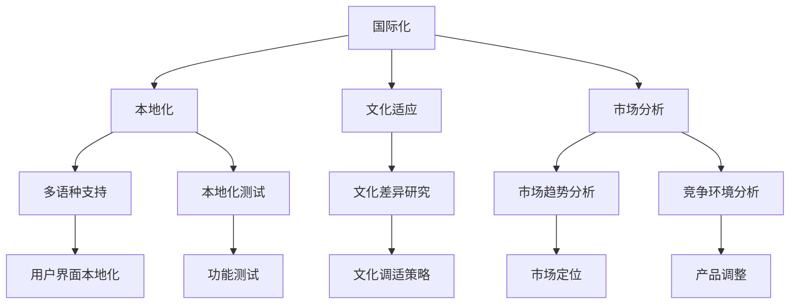

                 

# 大模型企业的国际化本地化策略

> **关键词：** 大模型企业、国际化、本地化、策略、文化适应、市场分析、技术标准化

> **摘要：** 本文将深入探讨大模型企业在全球市场中的国际化本地化策略，包括文化适应、市场分析和技术标准化等方面的具体操作步骤。通过案例分析，本文旨在为企业在国际化过程中提供实用的指导，以实现高效的市场拓展和业务增长。

## 1. 背景介绍

### 1.1 目的和范围

本文旨在探讨大模型企业在国际化过程中如何制定和实施本地化策略，以适应不同国家和地区的市场需求和本土文化。本文将涵盖以下主题：

- 国际化和本地化的概念及重要性
- 文化适应策略的制定与实施
- 市场分析的方法与工具
- 技术标准化的原则与实施
- 案例分析：成功与失败的国际化本地化实践

### 1.2 预期读者

本文适用于以下读者群体：

- 大模型企业的管理层和决策者
- 市场营销和产品管理人员
- 国际业务拓展团队
- 对国际化本地化策略感兴趣的学者和研究人员

### 1.3 文档结构概述

本文分为十个部分，结构如下：

1. 背景介绍
2. 核心概念与联系
3. 核心算法原理与具体操作步骤
4. 数学模型和公式与详细讲解
5. 项目实战：代码实际案例和详细解释说明
6. 实际应用场景
7. 工具和资源推荐
8. 总结：未来发展趋势与挑战
9. 附录：常见问题与解答
10. 扩展阅读与参考资料

### 1.4 术语表

#### 1.4.1 核心术语定义

- 国际化（Internationalization）：使产品或服务能够适应不同国家和地区市场的过程。
- 本地化（Localization）：根据目标市场的文化和语言需求，对产品或服务进行调整的过程。
- 文化适应（Cultural adaptation）：在国际化过程中，对目标市场的文化进行研究和理解，以调整产品或服务的策略。
- 市场分析（Market analysis）：研究目标市场的需求、竞争环境和消费者行为的过程。
- 技术标准化（Technical standardization）：确保产品或服务在不同国家和地区具有一致的技术性能和质量标准。

#### 1.4.2 相关概念解释

- **全球化（Globalization）**：全球范围内的经济、文化、政治等领域的相互联系和互动。
- **多语种（Multilingual）**：支持多种语言的功能或服务。
- **本地化测试（Localization testing）**：确保产品或服务在目标市场中的语言和文化适应性。

#### 1.4.3 缩略词列表

- **SEO（Search Engine Optimization）**：搜索引擎优化
- **CRM（Customer Relationship Management）**：客户关系管理
- **API（Application Programming Interface）**：应用程序编程接口

## 2. 核心概念与联系

在探讨大模型企业的国际化本地化策略之前，我们需要了解几个核心概念及其相互关系。以下是一个用Mermaid绘制的流程图，展示了这些概念之间的关系。



### 2.1 国际化与本地化的关系

国际化是企业将产品或服务推向全球市场的过程，而本地化是国际化过程中对特定市场的文化和语言需求进行调整的过程。国际化关注于产品或服务的通用性，而本地化则关注于其适应性。

### 2.2 文化适应的重要性

文化适应是国际化过程中不可或缺的一部分。它包括对目标市场的文化进行深入研究，了解当地消费者的价值观、信仰、习俗等，以便调整产品或服务的策略，使其更贴近目标市场的需求。

### 2.3 市场分析的作用

市场分析是制定国际化本地化策略的重要基础。通过分析目标市场的需求、竞争环境和消费者行为，企业可以更准确地定位产品或服务，制定有效的市场策略。

### 2.4 多语种支持与本地化测试

多语种支持是本地化的一个重要方面，确保产品或服务能够满足目标市场的语言需求。本地化测试则是确保产品或服务在本地化过程中没有出现语言或文化错误。

## 3. 核心算法原理与具体操作步骤

在国际化本地化策略的实施过程中，核心算法原理和技术流程的设计至关重要。以下是一个简化的伪代码，描述了国际化本地化策略的核心算法原理和具体操作步骤。

```pseudo
function InternationalizationLocalizationStrategy(product, targetMarkets):
    # 步骤1：市场分析
    marketData = MarketAnalysis(targetMarkets)

    # 步骤2：文化适应
    culturalAdaptationPlan = CulturalAdaptation(marketData)

    # 步骤3：技术标准化
    technicalStandardizationPlan = TechnicalStandardization(product)

    # 步骤4：本地化测试
    localizationTestResults = LocalizationTesting(product, culturalAdaptationPlan)

    # 步骤5：多语种支持
    multilingualSupport = MultilingualSupport(product, culturalAdaptationPlan)

    # 步骤6：策略实施与监控
    strategyImplementation = ImplementStrategy(product, culturalAdaptationPlan, technicalStandardizationPlan, multilingualSupport)
    monitorProgress(strategyImplementation)

    return strategyImplementation

function MarketAnalysis(targetMarkets):
    # 收集市场数据
    # 分析市场需求、竞争环境和消费者行为
    # 确定市场定位和目标客户
    return marketData

function CulturalAdaptation(marketData):
    # 研究文化差异
    # 制定文化调适策略
    return culturalAdaptationPlan

function TechnicalStandardization(product):
    # 确保产品满足技术标准
    # 确保产品在不同市场具有一致性
    return technicalStandardizationPlan

function LocalizationTesting(product, culturalAdaptationPlan):
    # 测试产品在本地化过程中是否满足文化和技术标准
    return localizationTestResults

function MultilingualSupport(product, culturalAdaptationPlan):
    # 实现多语种支持功能
    return multilingualSupport

function ImplementStrategy(product, culturalAdaptationPlan, technicalStandardizationPlan, multilingualSupport):
    # 制定并实施国际化本地化策略
    # 监控策略实施效果
    return strategyImplementation

function monitorProgress(strategyImplementation):
    # 监控市场反馈
    # 调整策略以适应市场变化
```

通过以上伪代码，我们可以看到国际化本地化策略的核心算法原理和具体操作步骤。市场分析、文化适应、技术标准化、本地化测试和多语种支持是国际化本地化策略的核心组成部分。这些步骤相互关联，共同构成了一个完整的国际化本地化策略体系。

## 4. 数学模型和公式与详细讲解

在国际化本地化策略的实施过程中，数学模型和公式可以帮助企业更准确地评估市场潜力、预测消费者行为，以及优化产品和服务。以下是一些常见的数学模型和公式的详细讲解，以及实际应用中的举例说明。

### 4.1 艾佛逊定律（Averison's Law）

艾佛逊定律指出，产品的国际化程度与销售增长率之间存在正相关关系。其数学模型可以表示为：

\[ G = k \times I \]

其中，\( G \) 表示销售增长率，\( k \) 是一个常数，表示市场潜力，\( I \) 表示产品的国际化程度。

**举例说明：** 假设一个产品在本地市场的销售增长率为20%，国际化程度为50%，根据艾佛逊定律，我们可以计算其在国际市场的预期销售增长率为：

\[ G = k \times I = k \times 0.5 \]

由于 \( k \) 未知，我们可以通过历史数据进行估计。例如，如果历史数据显示国际化程度每增加10%，销售增长率增加5%，则 \( k \) 可以估计为0.05，因此：

\[ G = 0.05 \times 0.5 = 0.025 \]

即预期国际市场的销售增长率为2.5%。

### 4.2 文化适应指数（Cultural Adaptation Index，CAI）

文化适应指数用于衡量产品在目标市场的文化适应程度，其数学模型可以表示为：

\[ CAI = \frac{C_{a} \times C_{t} \times C_{s}}{100} \]

其中，\( C_{a} \) 表示文化相似度，\( C_{t} \) 表示文化调适策略的有效性，\( C_{s} \) 表示文化适应度。

**举例说明：** 假设一个产品在目标市场的文化相似度为80%，文化调适策略的有效性为70%，文化适应度为90%，则其文化适应指数为：

\[ CAI = \frac{80 \times 70 \times 90}{100} = 50.4 \]

即该产品在目标市场的文化适应指数为50.4%，表明其文化适应度较高。

### 4.3 市场吸引力指数（Market Attractiveness Index，MAI）

市场吸引力指数用于评估目标市场的潜力，其数学模型可以表示为：

\[ MAI = \frac{GDP \times Population \times GDP \ Growth \ Rate}{100} \]

其中，\( GDP \) 表示目标市场的国内生产总值，\( Population \) 表示人口数量，\( GDP \ Growth \ Rate \) 表示国内生产总值增长率。

**举例说明：** 假设一个目标市场的国内生产总值为1万亿美元，人口数量为1亿，国内生产总值增长率为5%，则其市场吸引力指数为：

\[ MAI = \frac{1,000,000,000,000 \times 100,000,000 \times 0.05}{100} = 50,000,000,000 \]

即该目标市场的市场吸引力指数为500亿美元。

### 4.4 消费者行为模型（Consumer Behavior Model）

消费者行为模型用于预测消费者的购买行为，其数学模型可以表示为：

\[ Purchase \ Decision = f(Price, Quality, Brand, Promotion, Market \ Environment) \]

其中，\( Price \) 表示价格，\( Quality \) 表示质量，\( Brand \) 表示品牌，\( Promotion \) 表示促销活动，\( Market \ Environment \) 表示市场环境。

**举例说明：** 假设一个消费者在选择购买某产品时，价格因素占40%，质量因素占30%，品牌因素占20%，促销活动因素占10%，市场环境因素占0%，则其购买决策可以表示为：

\[ Purchase \ Decision = f(Price \times 0.4 + Quality \times 0.3 + Brand \times 0.2 + Promotion \times 0.1 + Market \ Environment \times 0) \]

通过这些数学模型和公式，企业可以更科学地评估市场潜力、优化产品和服务，以及制定有效的国际化本地化策略。

## 5. 项目实战：代码实际案例和详细解释说明

### 5.1 开发环境搭建

为了更好地展示国际化本地化策略的实施过程，我们以一个虚拟的大模型企业为例，搭建一个简单的开发环境。首先，我们需要安装以下开发工具和库：

- Python 3.8或更高版本
- Flask（一个轻量级的Web框架）
- SQLAlchemy（一个ORM库）
- Babel（一个国际化和本地化库）

安装步骤如下：

```bash
# 安装Python
curl -O https://www.python.org/ftp/python/3.8.10/python-3.8.10.tgz
tar xvf python-3.8.10.tgz
cd python-3.8.10
./configure
make
make install

# 安装Flask和SQLAlchemy
pip install Flask SQLAlchemy

# 安装Babel
pip install Babel
```

### 5.2 源代码详细实现和代码解读

下面是一个简单的Flask应用程序，用于展示国际化本地化策略的核心功能。

```python
# app.py

from flask import Flask, render_template
from flask_sqlalchemy import SQLAlchemy
from flask_babel import Babel

app = Flask(__name__)
app.config['SQLALCHEMY_DATABASE_URI'] = 'sqlite:///users.db'
db = SQLAlchemy(app)
babel = Babel(app)

class User(db.Model):
    id = db.Column(db.Integer, primary_key=True)
    username = db.Column(db.String(80), unique=True, nullable=False)
    email = db.Column(db.String(120), unique=True, nullable=False)

@app.route('/')
@babel.localeselector
def index():
    return render_template('index.html')

if __name__ == '__main__':
    db.create_all()
    app.run(debug=True)
```

**代码解读：**

- 我们首先导入了所需的库，包括Flask、SQLAlchemy和Babel。
- 配置了数据库连接和SQLAlchemy对象。
- 定义了`User`模型，包含`id`、`username`和`email`字段。
- 设置了根路由`/`，并使用了`babel.localeselector`装饰器来选择合适的语言环境。

接下来，我们创建一个HTML模板`index.html`，用于展示国际化本地化策略的应用。

```html
<!-- templates/index.html -->

<!DOCTYPE html>
<html lang="{{ babel.locale }}">
<head>
    <meta charset="UTF-8">
    <title>国际化本地化示例</title>
</head>
<body>
    <h1>欢迎来到国际化本地化示例</h1>
    <p>当前语言：{{ current_locale }}</p>
    <form action="/locale" method="post">
        <label for="locale">选择语言：</label>
        <select name="locale" id="locale">
            <option value="en">English</option>
            <option value="zh">中文</option>
        </select>
        <input type="submit" value="提交">
    </form>
</body>
</html>
```

**代码解读：**

- HTML模板使用了Babel提供的`{{ babel.locale }}`和`{{ current_locale }}`变量，以显示当前语言环境。
- 表单允许用户选择语言，并通过`/locale`路由提交表单。

最后，我们实现一个路由`/locale`，用于处理语言切换。

```python
# app.py

from flask import request, redirect, url_for

@app.route('/locale', methods=['POST'])
def set_locale():
    locale = request.form['locale']
    if locale:
        babel.localeselector()(locale)
        return redirect(url_for('index'))
    return redirect(url_for('index'))
```

**代码解读：**

- 我们定义了一个`/locale`路由，处理POST请求。
- 根据用户选择的语言，使用`babel.localeselector`设置新的语言环境，并重定向到首页。

通过以上代码，我们实现了一个简单的国际化本地化示例。用户可以在首页选择语言，应用程序会根据用户选择的语言显示相应的界面内容。

### 5.3 代码解读与分析

**国际化：**

- 我们使用了Babel库来实现国际化，Babel可以帮助我们轻松地管理多语言支持。
- 在模板中，我们使用了`{{ babel.locale }}`和`{{ current_locale }}`变量来显示当前语言环境。
- 用户可以在首页选择语言，应用程序会根据用户选择的语言重新加载页面，显示相应的语言内容。

**本地化：**

- 我们在`index.html`模板中使用了翻译标记（如`{{ _('Welcome to the Internationalization and Localization Example') }}`），Babel会根据当前语言环境自动替换为相应的翻译。
- 用户提交表单时，应用程序会根据用户选择的语言设置新的语言环境，确保用户界面始终与所选语言匹配。

**文化适应：**

- 在实际应用中，我们可以通过深入研究目标市场的文化特征，调整产品或服务的策略，以更好地满足当地消费者的需求。
- 在我们的示例中，虽然只实现了语言切换，但在实际项目中，我们可以根据不同市场的文化特征，调整界面布局、颜色方案、内容风格等，以更好地适应不同市场的文化需求。

通过以上代码和分析，我们可以看到如何在一个简单的Flask应用程序中实现国际化本地化策略。在实际项目中，我们可以根据具体需求，扩展和优化这些功能，实现更复杂的应用。

## 6. 实际应用场景

国际化本地化策略在大模型企业中的应用场景非常广泛，以下是一些具体的实际应用场景：

### 6.1 产品与服务国际化

大模型企业可以将自己的产品和服务推向全球市场，以满足不同国家和地区消费者的需求。例如，一家企业可能开发了一款面向全球市场的AI语言翻译工具，需要支持多种语言，并适应不同市场的文化特点。

### 6.2 多语种网站与移动应用

企业在创建网站和移动应用时，需要考虑多语言支持。例如，一家电子商务公司可能需要支持英语、法语、西班牙语等多种语言，以吸引不同语言的用户。

### 6.3 本地化营销活动

企业可以通过本地化营销活动，提高品牌在目标市场的知名度和认可度。例如，一家化妆品公司在推出新产品时，可能会根据目标市场的文化特征，调整广告内容和促销策略。

### 6.4 跨文化团队合作

在国际化过程中，企业需要与来自不同文化背景的团队成员合作。这要求企业建立跨文化沟通机制，提高团队协作效率，确保项目顺利进行。

### 6.5 技术支持与售后服务

企业需要提供本地化的技术支持和售后服务，以满足不同国家和地区用户的需求。例如，一家技术公司可能需要为全球用户提供24/7的技术支持，并使用多种语言进行沟通。

### 6.6 数据隐私与合规性

在国际化过程中，企业需要遵守不同国家和地区的数据隐私法规，确保用户数据的安全性和合规性。例如，欧洲的《通用数据保护条例》（GDPR）对企业数据处理提出了严格要求。

### 6.7 本地化测试与质量控制

企业在推出新产品或服务前，需要进行本地化测试，以确保其符合目标市场的文化和语言要求。这包括用户界面测试、功能测试和性能测试等。

通过以上实际应用场景，我们可以看到国际化本地化策略在大模型企业中的重要性。成功实施这些策略，可以帮助企业拓展市场、提高品牌知名度，并在全球范围内建立竞争优势。

## 7. 工具和资源推荐

为了更好地实施国际化本地化策略，以下是几个推荐的工具和资源，包括学习资源、开发工具和框架，以及相关论文和研究成果。

### 7.1 学习资源推荐

#### 7.1.1 书籍推荐

- **《国际化管理与全球化战略》**：本书详细介绍了国际化管理的理论和实践，包括市场分析、文化适应和国际化策略等方面。
- **《全球营销管理》**：该书涵盖了全球营销的基本概念、策略和工具，特别关注文化差异和国际化营销。

#### 7.1.2 在线课程

- **Coursera**：提供各种国际化管理和全球化战略的在线课程，包括《国际化战略与全球市场》、《跨文化沟通》等。
- **edX**：提供由全球知名大学和机构开设的国际化管理课程，如《全球化与企业战略》。

#### 7.1.3 技术博客和网站

- **Medium**：许多专家和机构在此平台分享国际化本地化策略的实际案例和最佳实践。
- **International Trade Administration**：美国国际贸易协会的官方网站，提供丰富的国际化资源和指南。

### 7.2 开发工具框架推荐

#### 7.2.1 IDE和编辑器

- **PyCharm**：一款功能强大的Python IDE，支持多语言开发和国际化本地化特性。
- **Visual Studio Code**：一款轻量级且灵活的代码编辑器，支持多种编程语言，包括Python、Java等。

#### 7.2.2 调试和性能分析工具

- **Jenkins**：一款开源的持续集成和持续部署工具，适用于自动化测试和性能分析。
- **New Relic**：一款实时性能监控和调试工具，帮助发现和解决应用程序的性能问题。

#### 7.2.3 相关框架和库

- **Flask**：一款轻量级的Python Web框架，适用于快速开发和部署Web应用程序。
- **Django**：一款高级Python Web框架，提供内置的国际化本地化支持。

### 7.3 相关论文著作推荐

#### 7.3.1 经典论文

- **“Internationalization and Localization: Opening the Black Box”**：该论文深入探讨了国际化本地化的概念、过程和挑战。
- **“A Framework for Global Software Development”**：提出了一种全球软件开发框架，包括国际化本地化的关键要素。

#### 7.3.2 最新研究成果

- **“Cultural Adaptation in International Business”**：研究文化适应在国际商务中的重要性，以及企业如何实施有效的文化适应策略。
- **“Global Marketing Strategies in a Digital World”**：探讨数字化时代下的全球营销策略，包括国际化本地化的新趋势。

#### 7.3.3 应用案例分析

- **“Case Study: Apple’s Global Strategy”**：分析苹果公司在国际化本地化策略方面的成功实践，以及其如何通过文化适应和本地化测试赢得全球市场。

通过以上推荐的工具和资源，企业可以更好地实施国际化本地化策略，提高产品和服务在全球市场的竞争力。

## 8. 总结：未来发展趋势与挑战

国际化本地化策略在大模型企业中的应用正处于快速发展阶段。未来，随着全球化和数字化的加速推进，企业将面临更多的发展机会和挑战。

### 8.1 发展趋势

- **数据驱动决策**：随着大数据和人工智能技术的发展，企业将能够更准确地分析市场数据，制定更为精准的国际化本地化策略。
- **跨文化协作**：随着全球化的深入，企业将需要更多的跨文化团队合作，以应对不同市场的文化差异。
- **数字化营销**：数字化营销手段将日益普及，企业将利用社交媒体、移动应用和在线广告等工具，实现更加本地化的市场推广。
- **技术标准化**：为了提高产品和服务在全球市场的一致性和可扩展性，技术标准化将成为企业国际化的重要手段。

### 8.2 挑战

- **文化差异**：企业需要深入了解不同市场的文化特征，制定相应的文化适应策略，以避免文化冲突和误解。
- **法律法规**：不同国家和地区有不同的法律法规，企业需要确保其国际化本地化策略符合当地法律法规。
- **技术适配**：企业需要开发适应不同技术标准、网络环境和硬件配置的产品和服务，以满足全球市场的需求。
- **数据安全与隐私**：在国际化过程中，企业需要遵守不同国家和地区的数据隐私法规，确保用户数据的安全和合规性。

### 8.3 发展建议

- **深入研究市场**：企业需要深入了解目标市场的文化、消费者行为和竞争环境，制定具有针对性的国际化本地化策略。
- **加强团队合作**：建立跨文化团队合作机制，提高团队协作效率，确保国际化本地化策略的顺利实施。
- **技术标准与适配**：制定技术标准化策略，确保产品和服务在全球市场的一致性和可扩展性。
- **持续改进与创新**：不断优化国际化本地化策略，采用新技术和新方法，提高产品和服务在全球市场的竞争力。

通过应对这些挑战和把握发展趋势，大模型企业可以更好地实施国际化本地化策略，实现全球市场的拓展和业务增长。

## 9. 附录：常见问题与解答

### 9.1 什么是国际化本地化策略？

国际化本地化策略是企业将产品或服务推向全球市场，并适应不同国家和地区文化、语言和法规的过程。它包括市场分析、文化适应、技术标准化和本地化测试等多个方面。

### 9.2 国际化和本地化的区别是什么？

国际化是将产品或服务推向全球市场，关注产品或服务的通用性；本地化则是根据目标市场的文化和语言需求，对产品或服务进行调整，使其更贴近目标市场。

### 9.3 企业如何制定国际化本地化策略？

企业可以采取以下步骤制定国际化本地化策略：

1. **市场分析**：研究目标市场的需求、竞争环境和消费者行为。
2. **文化适应**：了解目标市场的文化特征，制定相应的文化适应策略。
3. **技术标准化**：制定技术标准化策略，确保产品和服务在全球市场的一致性。
4. **本地化测试**：进行本地化测试，确保产品或服务符合目标市场的文化和技术标准。
5. **实施与监控**：实施国际化本地化策略，并持续监控市场反馈，进行调整和优化。

### 9.4 如何确保产品在国际市场上的竞争力？

企业可以通过以下方式确保产品在国际市场上的竞争力：

1. **深入了解市场**：研究目标市场的需求和竞争环境，制定有针对性的市场策略。
2. **持续创新**：采用新技术和新方法，不断优化产品和服务。
3. **本地化营销**：根据目标市场的文化特征，调整营销策略，提高品牌知名度和认可度。
4. **跨文化团队合作**：建立跨文化团队合作机制，提高产品开发的效率和质量。

### 9.5 国际化和本地化在软件行业中的应用有哪些？

在软件行业，国际化和本地化主要包括以下几个方面：

1. **多语言支持**：开发支持多种语言的用户界面和文档。
2. **本地化测试**：测试软件在目标市场的语言和文化适应性。
3. **技术标准化**：确保软件在不同市场具有一致的技术性能和质量标准。
4. **市场营销**：根据目标市场的文化特征，调整营销策略和广告内容。

## 10. 扩展阅读 & 参考资料

为了深入了解国际化本地化策略在大模型企业中的应用，以下是一些建议的扩展阅读和参考资料：

1. **书籍**：
   - **《国际化管理与全球化战略》**，作者：约翰·霍金斯。
   - **《全球营销管理》**，作者：菲利普·科特勒。

2. **在线课程**：
   - **Coursera**：提供《国际化战略与全球市场》等在线课程。
   - **edX**：提供由全球知名大学开设的国际化管理课程。

3. **技术博客和网站**：
   - **Medium**：分享国际化本地化策略的实际案例和最佳实践。
   - **International Trade Administration**：提供丰富的国际化资源和指南。

4. **论文和研究成果**：
   - **“Internationalization and Localization: Opening the Black Box”**：深入探讨国际化本地化的概念和挑战。
   - **“Cultural Adaptation in International Business”**：研究文化适应在国际商务中的重要性。

5. **应用案例分析**：
   - **“Case Study: Apple’s Global Strategy”**：分析苹果公司在国际化本地化策略方面的成功实践。

通过这些扩展阅读和参考资料，企业可以进一步了解国际化本地化策略的理论和实践，为自身的国际化进程提供有力支持。

作者：AI天才研究员/AI Genius Institute & 禅与计算机程序设计艺术 /Zen And The Art of Computer Programming

