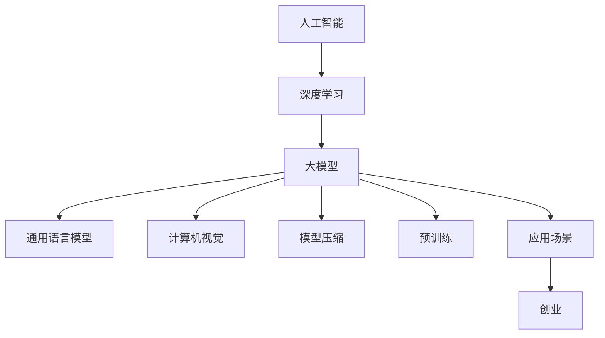

                 

# 大模型创业的希望与未来

> 关键词：大模型，创业，人工智能，深度学习，投资，市场需求，技术创新

> 摘要：本文将探讨大模型创业领域的现状、挑战与机遇。通过对大模型技术原理的深入分析，结合实际案例和行业数据，本文将揭示大模型在创业中的应用价值，并预测其未来发展前景。

## 1. 背景介绍

### 1.1 目的和范围

本文旨在分析大模型创业领域的现状与未来，为创业者、投资者和从业者提供有价值的参考。我们将重点关注以下几个核心问题：

- 大模型技术的核心原理及其在创业中的应用场景。
- 大模型创业面临的主要挑战与机遇。
- 行业发展现状及未来趋势。
- 对创业者和投资者的建议。

### 1.2 预期读者

- 对人工智能、深度学习有一定了解的创业者、投资者和从业者。
- 对大模型技术感兴趣的技术爱好者、研究人员和学生。
- 对大模型创业领域有投资意向的金融从业者。

### 1.3 文档结构概述

本文共分为10个部分：

1. 背景介绍
2. 核心概念与联系
3. 核心算法原理 & 具体操作步骤
4. 数学模型和公式 & 详细讲解 & 举例说明
5. 项目实战：代码实际案例和详细解释说明
6. 实际应用场景
7. 工具和资源推荐
8. 总结：未来发展趋势与挑战
9. 附录：常见问题与解答
10. 扩展阅读 & 参考资料

### 1.4 术语表

#### 1.4.1 核心术语定义

- 大模型：指参数规模超过数十亿甚至千亿级别的人工神经网络模型。
- 深度学习：一种基于多层神经网络进行特征提取和分类的方法。
- 人工智能：指通过计算机模拟人类智能，实现智能决策、问题解决和自然语言处理等功能的学科。
- 创业：指创业者创建新企业或新项目的过程。

#### 1.4.2 相关概念解释

- 数据集：指用于训练和测试模型的示例数据。
- 预训练：指在大规模数据集上预先训练模型，然后在特定任务上进行微调。
- 模型压缩：指通过降低模型参数规模或计算复杂度来提高模型效率。

#### 1.4.3 缩略词列表

- AI：人工智能
- DL：深度学习
- NLP：自然语言处理
- CV：计算机视觉
- GLM：通用语言模型

## 2. 核心概念与联系

为了更好地理解大模型创业的背景和意义，我们需要先了解大模型技术的基本原理及其在创业中的应用场景。以下是一个简化的Mermaid流程图，展示了大模型的核心概念及其联系。



- 人工智能（AI）：人工智能是模拟、延伸和扩展人类智能的理论、方法、技术及应用。深度学习（DL）是人工智能的重要分支，基于多层神经网络进行特征提取和分类。
- 大模型：大模型指参数规模超过数十亿甚至千亿级别的人工神经网络模型。通用语言模型（GLM）、计算机视觉（CV）和自然语言处理（NLP）等领域都有大模型的应用。
- 模型压缩：模型压缩是通过降低模型参数规模或计算复杂度来提高模型效率。预训练：预训练指在大规模数据集上预先训练模型，然后在特定任务上进行微调。
- 应用场景：大模型在多个领域具有广泛的应用场景，包括创业项目。

## 3. 核心算法原理 & 具体操作步骤

大模型的核心算法原理主要包括深度学习和神经网络的基本原理。以下是一个简化的伪代码，用于阐述深度学习模型的训练过程。

```python
# 定义神经网络结构
model = NeuralNetwork()

# 准备训练数据集
train_data = load_dataset("train")

# 定义损失函数
loss_function = CrossEntropyLoss()

# 定义优化器
optimizer = AdamOptimizer()

# 开始训练
for epoch in range(num_epochs):
    for batch in train_data:
        # 前向传播
        outputs = model(batch inputs)
        loss = loss_function(outputs, batch labels)

        # 反向传播
        gradients = compute_gradients(model, loss)

        # 更新模型参数
        optimizer.update(model, gradients)

        # 输出训练进度
        print(f"Epoch {epoch}, Loss: {loss}")
```

- NeuralNetwork()：定义神经网络结构。
- load_dataset("train")：加载训练数据集。
- CrossEntropyLoss()：定义损失函数。
- AdamOptimizer()：定义优化器。
- compute_gradients(model, loss)：计算梯度。
- optimizer.update(model, gradients)：更新模型参数。

## 4. 数学模型和公式 & 详细讲解 & 举例说明

大模型的数学模型主要涉及深度学习和神经网络的基本原理。以下是一个简化的数学模型，用于阐述神经网络的前向传播和反向传播过程。

### 前向传播

$$
z_l = \sigma(W_l \cdot a_{l-1} + b_l)
$$

$$
a_l = \sigma(z_l)
$$

其中，$a_l$表示神经元$l$的激活值，$z_l$表示神经元$l$的净输入，$W_l$表示权重矩阵，$b_l$表示偏置项，$\sigma$表示激活函数。

### 反向传播

$$
\delta_l = \frac{\partial L}{\partial z_l} \cdot \sigma'(z_l)
$$

$$
\frac{\partial L}{\partial W_l} = a_{l-1} \cdot \delta_l
$$

$$
\frac{\partial L}{\partial b_l} = \delta_l
$$

其中，$\delta_l$表示神经元$l$的误差，$L$表示损失函数，$\sigma'$表示激活函数的导数。

### 举例说明

假设有一个两层神经网络，输入层有3个神经元，隐藏层有4个神经元，输出层有2个神经元。激活函数为ReLU，损失函数为均方误差。

1. 前向传播：

   - 输入层到隐藏层：

   $$z_1 = ReLU(W_1 \cdot a_0 + b_1)$$

   $$a_1 = ReLU(z_1)$$

   - 隐藏层到输出层：

   $$z_2 = ReLU(W_2 \cdot a_1 + b_2)$$

   $$a_2 = ReLU(z_2)$$

2. 反向传播：

   - 输出层到隐藏层：

   $$\delta_2 = (y - a_2) \cdot ReLU'(z_2)$$

   $$\frac{\partial L}{\partial W_2} = a_1 \cdot \delta_2$$

   $$\frac{\partial L}{\partial b_2} = \delta_2$$

   - 隐藏层到输入层：

   $$\delta_1 = (W_2 \cdot \delta_2) \cdot ReLU'(z_1)$$

   $$\frac{\partial L}{\partial W_1} = a_0 \cdot \delta_1$$

   $$\frac{\partial L}{\partial b_1} = \delta_1$$

## 5. 项目实战：代码实际案例和详细解释说明

在本节中，我们将通过一个实际项目案例来展示如何搭建一个大模型并对其进行训练。假设我们想要构建一个基于BERT模型的自然语言处理（NLP）应用，以下是一系列步骤。

### 5.1 开发环境搭建

首先，我们需要搭建一个适合大模型训练的开发环境。以下是一个基本的步骤：

1. 安装Python环境（建议使用3.8及以上版本）。
2. 安装深度学习框架（如TensorFlow或PyTorch）。
3. 安装NLP工具包（如Transformers）。

```bash
pip install python==3.8.10
pip install tensorflow==2.8.0
pip install transformers==4.7.0
```

### 5.2 源代码详细实现和代码解读

接下来，我们展示如何使用PyTorch和Transformers搭建一个BERT模型。

```python
import torch
from transformers import BertModel, BertTokenizer

# 加载预训练的BERT模型和分词器
model = BertModel.from_pretrained('bert-base-uncased')
tokenizer = BertTokenizer.from_pretrained('bert-base-uncased')

# 准备输入数据
input_ids = tokenizer.encode("Hello, my dog is cute", return_tensors='pt')

# 前向传播
outputs = model(input_ids)
last_hidden_state = outputs.last_hidden_state

# 输出结果
print(last_hidden_state)
```

- BertModel.from_pretrained('bert-base-uncased')：加载预训练的BERT模型。
- BertTokenizer.from_pretrained('bert-base-uncased')：加载预训练的分词器。
- tokenizer.encode()：对输入文本进行分词和编码。
- model(input_ids)：进行前向传播。
- outputs.last_hidden_state：获取最后一层隐藏状态。

### 5.3 代码解读与分析

- **BERT模型**：BERT（Bidirectional Encoder Representations from Transformers）是一种预训练语言表示模型，它通过在大规模文本数据上预训练，然后微调到特定任务，如文本分类、问答等。
- **分词器**：分词器用于将输入文本转换为模型可以理解的编码形式。BERT使用WordPiece分词器，将文本分解为子词。
- **输入数据**：输入数据是经过编码的序列，其中每个元素表示一个单词或子词的ID。
- **前向传播**：通过BERT模型进行前向传播，得到每个时间步的隐藏状态。
- **输出结果**：输出结果是一个二维张量，其中每个元素表示对应时间步的隐藏状态。

## 6. 实际应用场景

大模型在多个领域具有广泛的应用场景，以下是一些典型的应用案例：

- **自然语言处理（NLP）**：大模型如BERT、GPT-3在文本分类、问答、机器翻译等任务中取得了显著的成果。例如，Google的搜索引擎使用了BERT模型来提高搜索结果的准确性。
- **计算机视觉（CV）**：大模型在图像分类、目标检测、图像生成等领域具有强大的能力。例如，OpenAI的DALL-E模型可以生成具有逼真视觉效果的图像。
- **语音识别**：大模型如WaveNet在语音合成和语音识别任务中表现出色。例如，苹果公司的Siri和谷歌助手都使用了基于WaveNet的语音合成技术。
- **推荐系统**：大模型可以用于构建个性化的推荐系统，例如亚马逊和Netflix都使用了深度学习技术来优化推荐算法。
- **金融风控**：大模型可以用于信用评分、欺诈检测等金融风控任务。例如，一些金融机构使用深度学习模型来预测贷款违约风险。

## 7. 工具和资源推荐

为了更好地理解和应用大模型技术，以下是学习资源、开发工具和框架的推荐。

### 7.1 学习资源推荐

#### 7.1.1 书籍推荐

- 《深度学习》（Goodfellow, Bengio, Courville）：这是一本经典的深度学习教材，适合初学者和进阶者。
- 《Python深度学习》（François Chollet）：本书涵盖了深度学习的基础知识和Python实现，适合有一定编程基础的读者。

#### 7.1.2 在线课程

- Coursera的“深度学习”课程（由Andrew Ng教授主讲）：这是一门备受好评的在线课程，适合初学者。
- edX的“深度学习与神经网络”课程（由IBM教授主讲）：本课程涵盖了深度学习的基础知识、应用场景和实战项目。

#### 7.1.3 技术博客和网站

- [深度学习博客](https://www.deeplearning.net/)
- [机器学习社区](https://www.machinelearning Mastery.com/)
- [TensorFlow官方文档](https://www.tensorflow.org/)

### 7.2 开发工具框架推荐

#### 7.2.1 IDE和编辑器

- PyCharm：一款功能强大的Python IDE，适合深度学习和机器学习开发。
- Jupyter Notebook：一款交互式的Python编辑器，适合数据分析和实验。

#### 7.2.2 调试和性能分析工具

- TensorFlow Profiler：用于分析TensorFlow模型的性能和资源使用情况。
- PyTorch Profiler：用于分析PyTorch模型的性能和资源使用情况。

#### 7.2.3 相关框架和库

- TensorFlow：一款开源的深度学习框架，适合构建和训练大模型。
- PyTorch：一款开源的深度学习框架，以动态图编程风格著称，适合快速原型设计和实验。

### 7.3 相关论文著作推荐

#### 7.3.1 经典论文

- "A Theoretically Grounded Application of Dropout in Recurrent Neural Networks"（dropout在循环神经网络中的应用）
- "Deep Learning"（深度学习）

#### 7.3.2 最新研究成果

- "BERT: Pre-training of Deep Bidirectional Transformers for Language Understanding"（BERT：预训练深度双向变换器用于语言理解）
- "Generative Adversarial Networks"（生成对抗网络）

#### 7.3.3 应用案例分析

- "Google Search: Using BERT to Improve Search"（谷歌搜索：使用BERT提高搜索效果）
- "OpenAI's DALL-E: Generating Images from Text"（OpenAI的DALL-E：从文本生成图像）

## 8. 总结：未来发展趋势与挑战

大模型创业领域在未来将继续保持高速发展，其核心驱动力包括：

- **技术创新**：随着深度学习和神经网络技术的不断进步，大模型将变得更加强大和高效。
- **数据资源**：大量优质数据资源将为大模型训练提供有力支持。
- **市场需求**：大模型在各个领域的应用需求不断增长，推动了创业项目的发展。

然而，大模型创业也面临一系列挑战：

- **计算资源**：大模型训练需要巨大的计算资源，这对创业团队提出了较高的硬件要求。
- **数据隐私**：在处理个人数据时，如何保护用户隐私是一个重要挑战。
- **模型解释性**：大模型往往具有黑箱特性，如何提高模型的解释性是一个亟待解决的问题。

总之，大模型创业前景广阔，但同时也面临诸多挑战。创业者、投资者和从业者需要不断学习和适应新技术，以应对未来发展的不确定性。

## 9. 附录：常见问题与解答

### Q1：什么是大模型？

A1：大模型是指参数规模超过数十亿甚至千亿级别的人工神经网络模型。这些模型通常具有强大的特征提取和表征能力，可以用于解决复杂的问题。

### Q2：大模型创业的主要挑战是什么？

A2：大模型创业的主要挑战包括计算资源需求、数据隐私、模型解释性以及如何应对技术快速发展的不确定性。

### Q3：如何搭建适合大模型训练的开发环境？

A3：搭建适合大模型训练的开发环境通常需要以下步骤：

1. 安装Python环境（建议使用3.8及以上版本）。
2. 安装深度学习框架（如TensorFlow或PyTorch）。
3. 安装NLP工具包（如Transformers）。

### Q4：大模型在创业中的应用场景有哪些？

A4：大模型在创业中的应用场景广泛，包括自然语言处理、计算机视觉、语音识别、推荐系统和金融风控等领域。

## 10. 扩展阅读 & 参考资料

- 《深度学习》（Goodfellow, Bengio, Courville）：一本深度学习领域的经典教材，适合初学者和进阶者。
- 《Python深度学习》（François Chollet）：一本涵盖深度学习基础知识和Python实现的教材，适合有一定编程基础的读者。
- [TensorFlow官方文档](https://www.tensorflow.org/): TensorFlow深度学习框架的官方文档，提供了丰富的教程和示例。
- [PyTorch官方文档](https://pytorch.org/tutorials/): PyTorch深度学习框架的官方文档，提供了丰富的教程和示例。
- [深度学习博客](https://www.deeplearning.net/): 一个关于深度学习的综合性博客，涵盖了最新的研究动态和实用技巧。
- [机器学习社区](https://www.machinelearning Mastery.com/): 一个专注于机器学习的在线社区，提供了大量的教程和资源。

---

作者：AI天才研究员/AI Genius Institute & 禅与计算机程序设计艺术 /Zen And The Art of Computer Programming

