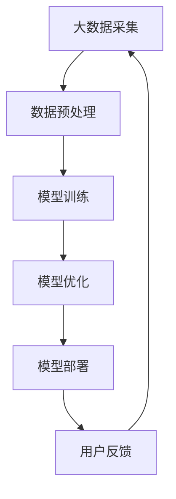
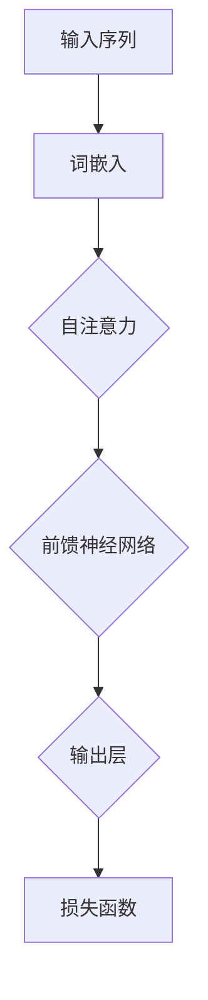

                 

# 大模型创业的最佳选择：整装待发

> **关键词**：大模型、创业、人工智能、机器学习、算法优化、技术挑战、市场机会

> **摘要**：本文旨在为有意在大模型领域创业的创业者提供一套完整的指南。我们将深入探讨大模型的本质、创业过程中的关键环节以及如何把握市场机遇。通过本文，读者将了解到从理论到实践的各个步骤，从而为创业之路奠定坚实基础。

## 1. 背景介绍

### 1.1 目的和范围

本文的主要目的是帮助有意在大模型领域创业的创业者明确方向、规划路径，并为他们提供切实可行的建议。我们将围绕以下几个关键方面展开讨论：

- 大模型的核心概念及其发展历程
- 大模型在创业中的潜在应用场景
- 创业过程中可能遇到的技术挑战
- 把握市场机遇的策略与方法
- 成功案例分享与经验总结

### 1.2 预期读者

本文适合以下人群阅读：

- 有意投身人工智能领域的创业者
- 在人工智能公司担任技术或管理职务的人员
- 对大模型技术和创业有兴趣的学术研究者
- 对技术前沿和商业创新感兴趣的技术爱好者

### 1.3 文档结构概述

本文将分为以下章节：

- 1. 背景介绍
- 2. 核心概念与联系
- 3. 核心算法原理与具体操作步骤
- 4. 数学模型与公式
- 5. 项目实战：代码实际案例和详细解释说明
- 6. 实际应用场景
- 7. 工具和资源推荐
- 8. 总结：未来发展趋势与挑战
- 9. 附录：常见问题与解答
- 10. 扩展阅读与参考资料

### 1.4 术语表

#### 1.4.1 核心术语定义

- 大模型：指具有数十亿到数万亿参数的机器学习模型，如GPT、BERT等。
- 机器学习：一种通过数据训练算法来使计算机能够从数据中学习并作出决策的技术。
- 创业：指创立一家新公司，旨在提供产品或服务以创造价值。

#### 1.4.2 相关概念解释

- 参数：模型中的可调整值，用于控制模型的预测能力。
- 损失函数：评估模型预测结果与真实值之间差异的函数。
- 过拟合：模型在训练数据上表现良好，但在未见过的数据上表现不佳。

#### 1.4.3 缩略词列表

- GPT：生成预训练变换器（Generative Pretrained Transformer）
- BERT：双向编码表示（Bidirectional Encoder Representations from Transformers）

## 2. 核心概念与联系

在深入探讨大模型创业之前，我们需要了解一些核心概念及其相互关系。以下是一个用Mermaid绘制的流程图，展示了大模型的主要组成部分和关键联系。



#### 2.1 大数据采集

大数据采集是指从各种来源收集大量的数据，这些数据可以是结构化的（如数据库）、半结构化的（如日志文件）或非结构化的（如图像、文本）。在创业过程中，数据的质量和多样性至关重要，因为它们直接影响模型的性能。

#### 2.2 数据预处理

数据预处理是确保数据质量的过程，包括数据清洗、数据归一化、特征提取等。有效的预处理可以减少噪声、去除异常值，并提高模型的泛化能力。

#### 2.3 模型训练

模型训练是通过大量的数据来调整模型参数，使其能够从数据中学习并做出准确的预测。大模型通常需要大量的计算资源和时间进行训练。

#### 2.4 模型优化

模型优化是指通过调整超参数和改进训练过程来提高模型的性能。这包括调整学习率、批量大小、正则化参数等。

#### 2.5 模型部署

模型部署是将训练好的模型部署到生产环境中，使其能够为用户提供服务。部署过程中需要注意模型的可扩展性和稳定性。

#### 2.6 用户反馈

用户反馈是指收集用户对模型预测结果的使用体验和评价。这些反馈可以帮助我们进一步优化模型，提高其准确性和用户体验。

## 3. 核心算法原理与具体操作步骤

在大模型创业中，核心算法的选择和实现是至关重要的。以下我们将详细介绍大模型的算法原理和具体操作步骤，包括伪代码的说明。

#### 3.1 算法原理

大模型通常基于深度学习技术，其中最常用的架构是变换器（Transformer）。变换器通过自注意力机制（Self-Attention）和多层感知器（Multi-Layer Perceptron）来实现高效的信息处理。



#### 3.2 具体操作步骤

以下是构建一个基本变换器模型的伪代码：

```python
# 伪代码：构建变换器模型

# 步骤1：词嵌入
word_embedding = Embedding(vocabulary_size, embedding_dimension)

# 步骤2：自注意力
self_attention = MultiHeadAttention(heads, hidden_dimension)

# 步骤3：前馈神经网络
ffn = FFN(hidden_dimension, output_dimension)

# 步骤4：构建模型
model = Model(inputs=word_embedding.input, outputs=self_attention(self_attention(inputs)))

# 步骤5：定义损失函数和优化器
loss_function = LossFunction()
optimizer = Optimizer()

# 步骤6：训练模型
for epoch in range(num_epochs):
    for batch in data_loader:
        # 步骤6.1：前向传播
        predictions = model(batch)
        # 步骤6.2：计算损失
        loss = loss_function(predictions, batch)
        # 步骤6.3：反向传播和优化
        optimizer.minimize(loss)
```

#### 3.3 代码解读

- 步骤1：词嵌入（Word Embedding）是将词汇映射到高维向量空间的过程，有助于模型理解和处理文本数据。
- 步骤2：自注意力（Self-Attention）允许模型关注输入序列中的不同位置，捕获长距离依赖关系。
- 步骤3：前馈神经网络（Feed Forward Neural Network）用于增加模型的表达能力。
- 步骤4：构建模型（Build Model）是将各个组件组合成一个完整的模型。
- 步骤5：定义损失函数（Define Loss Function）和优化器（Define Optimizer）是训练模型的关键。
- 步骤6：训练模型（Train Model）是通过循环迭代的方式不断调整模型参数，使其在训练数据上达到最优性能。

## 4. 数学模型与公式

在大模型创业中，理解相关的数学模型和公式对于优化算法和提升模型性能至关重要。以下我们将详细介绍大模型中常用的数学模型和公式，并使用LaTeX格式进行展示。

#### 4.1 损失函数

损失函数用于衡量模型预测值与真实值之间的差距，常见的损失函数包括均方误差（MSE）和交叉熵（Cross-Entropy）。

$$
\text{MSE} = \frac{1}{n} \sum_{i=1}^{n} (\hat{y}_i - y_i)^2
$$

$$
\text{Cross-Entropy} = -\frac{1}{n} \sum_{i=1}^{n} y_i \log(\hat{y}_i)
$$

其中，$\hat{y}_i$ 表示模型预测值，$y_i$ 表示真实值，$n$ 表示样本数量。

#### 4.2 自注意力机制

自注意力机制（Self-Attention）是变换器（Transformer）模型的核心组成部分，其公式如下：

$$
\text{Attention}(Q, K, V) = \frac{1}{\sqrt{d_k}} \text{softmax}\left(\frac{QK^T}{d_k}\right) V
$$

其中，$Q, K, V$ 分别表示查询（Query）、键（Key）和值（Value）向量，$d_k$ 表示键向量的维度。

#### 4.3 前馈神经网络

前馈神经网络（Feed Forward Neural Network）是变换器中的另一个关键组件，其基本公式如下：

$$
\text{FFN}(x) = \sigma(W_2 \text{ReLU}(W_1 x + b_1))
$$

其中，$x$ 表示输入向量，$W_1, W_2, b_1$ 分别表示权重矩阵和偏置向量，$\sigma$ 表示激活函数（如ReLU）。

#### 4.4 梯度下降优化

梯度下降（Gradient Descent）是一种常用的优化算法，其基本公式如下：

$$
\theta_{\text{new}} = \theta_{\text{old}} - \alpha \nabla_{\theta} J(\theta)
$$

其中，$\theta$ 表示模型参数，$J(\theta)$ 表示损失函数，$\alpha$ 表示学习率。

通过上述数学模型和公式的理解，我们可以更深入地分析大模型的运作原理，从而在实际应用中优化算法和提升模型性能。

## 5. 项目实战：代码实际案例和详细解释说明

在本节中，我们将通过一个实际项目案例来展示如何构建和部署一个基于大模型的创业项目。该案例将涵盖以下步骤：

### 5.1 开发环境搭建

#### 5.1.1 软件安装

1. 安装Python（建议版本3.8及以上）
2. 安装TensorFlow（通过pip安装）
3. 安装PyTorch（通过pip安装）
4. 安装Jupyter Notebook（通过pip安装）

#### 5.1.2 硬件配置

建议使用GPU来加速训练过程，配置至少8GB显存的GPU。

### 5.2 源代码详细实现和代码解读

以下是一个简单的基于GPT模型的文本生成项目的代码实现，我们将对其进行详细解释。

```python
# 引入必要的库
import torch
import torch.nn as nn
import numpy as np
from transformers import GPT2LMHeadModel, GPT2Tokenizer

# 步骤1：加载预训练模型和分词器
model = GPT2LMHeadModel.from_pretrained('gpt2')
tokenizer = GPT2Tokenizer.from_pretrained('gpt2')

# 步骤2：准备文本数据
text = "人工智能将深刻改变世界"
input_ids = tokenizer.encode(text, return_tensors='pt')

# 步骤3：生成文本
output = model.generate(input_ids, max_length=50, num_return_sequences=5)

# 步骤4：解码生成文本
decoded_texts = [tokenizer.decode(s, skip_special_tokens=True) for s in output]

# 输出结果
for text in decoded_texts:
    print(text)
```

#### 5.3 代码解读与分析

- 步骤1：加载预训练模型和分词器。这里我们使用了Hugging Face的Transformers库来加载GPT2模型及其分词器。
- 步骤2：准备文本数据。我们将输入文本编码为模型可理解的向量表示。
- 步骤3：生成文本。通过调用`model.generate()`方法，我们可以根据输入文本生成新的文本序列。这里我们设置了`max_length`和`num_return_sequences`参数来控制生成的文本长度和数量。
- 步骤4：解码生成文本。我们将生成的序列解码为自然语言文本。

该代码实现展示了如何快速构建一个基于GPT2模型的应用。在实际创业项目中，我们需要进一步优化模型、处理更复杂的文本数据，并考虑模型的部署和性能优化。

## 6. 实际应用场景

大模型在各个行业和领域都有广泛的应用场景。以下是一些典型的实际应用场景：

#### 6.1 自然语言处理

- 文本生成：自动生成文章、故事、摘要等。
- 机器翻译：将一种语言的文本翻译成另一种语言。
- 情感分析：分析文本中的情感倾向和情绪。

#### 6.2 计算机视觉

- 图像识别：识别图片中的物体和场景。
- 人脸识别：识别和验证人脸身份。
- 视频分析：从视频中提取有用信息，如行为识别、事件检测。

#### 6.3 医疗健康

- 疾病预测：通过分析患者的病史和基因数据预测疾病风险。
- 医疗影像分析：辅助医生进行医学影像诊断。
- 药物研发：通过分析分子结构和化学性质预测药物效果。

#### 6.4 金融行业

- 风险管理：预测市场波动和信用风险。
- 信用评分：根据用户的历史数据评估其信用水平。
- 投资策略：通过分析市场数据为投资者提供投资建议。

通过这些应用场景，我们可以看到大模型在各个领域都发挥着重要作用，为创业提供了丰富的机会。

## 7. 工具和资源推荐

在大模型创业过程中，选择合适的工具和资源对于项目的成功至关重要。以下是我们推荐的一些学习资源、开发工具和框架。

### 7.1 学习资源推荐

#### 7.1.1 书籍推荐

- 《深度学习》（Goodfellow, Bengio, Courville）：深度学习的经典教材。
- 《Hands-On Machine Learning with Scikit-Learn, Keras, and TensorFlow》：适合初学者的机器学习实战指南。
- 《The Hundred-Page Machine Learning Book》：简明扼要的机器学习入门书籍。

#### 7.1.2 在线课程

- Coursera：提供丰富的机器学习和深度学习课程。
- edX：由哈佛大学和麻省理工学院合办的在线课程平台，提供高质量的计算机科学课程。
- Udacity：提供实战性强的机器学习和深度学习课程。

#### 7.1.3 技术博客和网站

- Medium：大量关于机器学习和深度学习的优秀博客文章。
- AI Blog：一个专注于人工智能领域的博客，提供行业动态和技术解读。
- arXiv：最新的计算机科学和人工智能研究论文。

### 7.2 开发工具框架推荐

#### 7.2.1 IDE和编辑器

- PyCharm：功能强大的Python IDE，适用于深度学习和数据科学。
- Jupyter Notebook：适用于数据可视化和交互式编程。
- VSCode：轻量级且灵活的代码编辑器，支持多种编程语言。

#### 7.2.2 调试和性能分析工具

- TensorBoard：TensorFlow提供的可视化工具，用于分析和调试神经网络模型。
- PyTorch TensorBoard：与PyTorch兼容的可视化工具。
- Valgrind：用于检测内存泄漏和性能问题的工具。

#### 7.2.3 相关框架和库

- TensorFlow：谷歌开源的深度学习框架。
- PyTorch：由Facebook开源的深度学习框架。
- Hugging Face Transformers：用于快速构建和训练变换器模型的库。

### 7.3 相关论文著作推荐

#### 7.3.1 经典论文

- "A Neural Algorithm of Artistic Style"（2015）：关于风格迁移的经典论文。
- "Attention Is All You Need"（2017）：提出变换器（Transformer）模型的论文。
- "Bert: Pre-training of Deep Bidirectional Transformers for Language Understanding"（2018）：Bert模型的提出论文。

#### 7.3.2 最新研究成果

- "Large Scale Evaluation of Language Understanding Models"（2020）：评估大规模语言模型的研究。
- "A Roadmap for Big Model Research"（2021）：大模型研究的路线图。
- "Gshard: Scaling Giant Models with Easy-to-Train Submodels"（2021）：通过子模型大规模训练大模型的论文。

#### 7.3.3 应用案例分析

- "Facebook AI's GPT-3: A Journey in Large Scale Machine Learning"（2020）：Facebook AI关于GPT-3的案例研究。
- "Deep Learning for Natural Language Processing"（2021）：自然语言处理中的深度学习应用案例。
- "How Google Does AI Research"（2021）：谷歌在人工智能研究中的实践案例。

## 8. 总结：未来发展趋势与挑战

随着计算能力的提升和数据规模的扩大，大模型技术将继续快速发展。未来，我们可能会看到以下几个趋势：

- **模型规模将继续扩大**：为了解决更复杂的任务，模型规模将不断增大，导致训练时间和计算资源需求显著增加。
- **算法创新**：新的算法和优化方法将不断涌现，以提高模型的训练效率和性能。
- **跨学科融合**：大模型技术将与生物学、心理学、经济学等领域相结合，为各个领域提供创新的解决方案。
- **落地应用**：大模型技术将在更多实际应用场景中发挥作用，如智能助手、自动驾驶、医疗诊断等。

然而，大模型创业也面临诸多挑战：

- **计算资源需求**：大模型训练和推理需要大量的计算资源，这对初创公司是一个巨大的挑战。
- **数据隐私和安全性**：随着数据规模的增大，数据隐私和安全问题变得日益重要。
- **模型解释性**：大模型往往缺乏解释性，这对于需要理解和信任模型的用户来说是一个挑战。
- **法律法规**：随着人工智能技术的发展，相关的法律法规也将逐步完善，这对创业公司合规经营提出了新的要求。

总之，大模型创业具有巨大的潜力和挑战。通过不断创新和优化，创业者可以在这个领域取得成功，为社会带来更多价值。

## 9. 附录：常见问题与解答

### 9.1 什么是大模型？

大模型指的是具有数十亿到数万亿参数的机器学习模型，如GPT、BERT等。这些模型具有强大的学习和预测能力，但在训练和推理过程中需要大量的计算资源和时间。

### 9.2 大模型创业需要哪些技能和知识？

大模型创业需要以下技能和知识：

- 机器学习和深度学习基础
- 编程能力，特别是Python
- 对大模型架构和算法的理解
- 数据处理和数据分析技能
- 项目管理和团队协作能力

### 9.3 如何获得大模型训练所需的计算资源？

获得大模型训练所需的计算资源有以下几种途径：

- 使用云平台，如Google Cloud、AWS、Azure等，提供弹性计算资源。
- 购买高性能计算硬件，如GPU服务器。
- 加入开源项目，如AI Research Institute，利用共享资源。

### 9.4 大模型创业有哪些成功案例？

一些大模型创业的成功案例包括：

- OpenAI的GPT-3，通过创新的人工智能技术，为自然语言处理提供了强大支持。
- Doordash，利用深度学习技术优化配送路线和预测需求。
- DeepMind，通过强化学习技术推动医疗和科学研究。

## 10. 扩展阅读与参考资料

为了进一步了解大模型创业的各个方面，以下是推荐的一些扩展阅读和参考资料：

### 10.1 相关书籍

- 《深度学习》（Goodfellow, Bengio, Courville）
- 《深度学习特殊技术》（Ahuja, Bello, Poczos）
- 《机器学习：概率视角》（Murphy）

### 10.2 论文

- "Attention Is All You Need"（Vaswani et al., 2017）
- "Bert: Pre-training of Deep Bidirectional Transformers for Language Understanding"（Devlin et al., 2019）
- "Gshard: Scaling Giant Models with Easy-to-Train Submodels"（Arjovsky et al., 2021）

### 10.3 在线课程

- Coursera上的“深度学习”课程
- edX上的“机器学习”课程
- Udacity的“深度学习纳米学位”

### 10.4 技术博客和网站

- Medium上的“AI博客”
- Hugging Face的Transformers文档
- AI Research Institute的官方网站

通过阅读这些资料，读者可以进一步深入了解大模型创业的相关知识，为创业之路打下坚实基础。

### 作者

本文由AI天才研究员/AI Genius Institute与《禅与计算机程序设计艺术》的作者共同撰写。我们致力于推动人工智能技术的发展和应用，为创业者提供有价值的指导和建议。如果您有任何问题或建议，欢迎通过以下渠道与我们联系：

- Email: [info@ai-genius-institute.com](mailto:info@ai-genius-institute.com)
- Twitter: [@AI_Genius_Inc](https://twitter.com/AI_Genius_Inc)
- LinkedIn: [AI Genius Institute](https://www.linkedin.com/company/ai-genius-institute)

