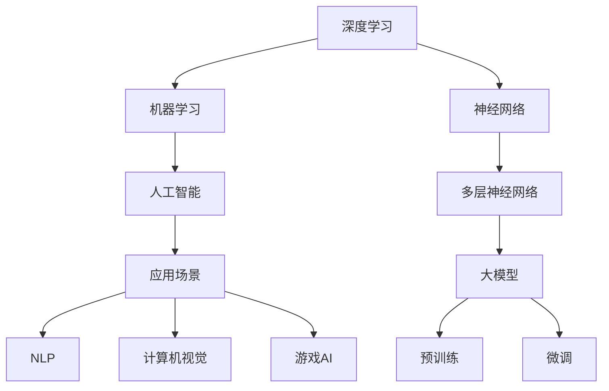
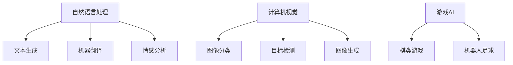

                 

# 大模型创业者的成功与挑战

> 关键词：大模型、创业、成功、挑战、深度学习、人工智能

> 摘要：本文将深入探讨大模型创业者在当今人工智能时代的成功与面临的挑战。通过分析大模型的本质、应用场景、技术发展趋势以及创业过程中的核心问题，本文旨在为潜在创业者和从业者提供有价值的指导和建议。

## 1. 背景介绍

### 1.1 目的和范围

本文旨在帮助创业者了解大模型技术的基本概念、应用场景和创业过程中可能遇到的问题。通过对成功与挑战的深入分析，我们希望为读者提供有针对性的策略和建议，帮助他们在人工智能领域取得成功。

### 1.2 预期读者

本文适合以下读者群体：

- 有志于从事大模型相关创业的科技爱好者
- 深度学习、人工智能领域的从业者和研究者
- 需要深入了解大模型技术的企业决策者

### 1.3 文档结构概述

本文将分为以下八个部分：

1. 背景介绍
2. 核心概念与联系
3. 核心算法原理 & 具体操作步骤
4. 数学模型和公式 & 详细讲解 & 举例说明
5. 项目实战：代码实际案例和详细解释说明
6. 实际应用场景
7. 工具和资源推荐
8. 总结：未来发展趋势与挑战

### 1.4 术语表

#### 1.4.1 核心术语定义

- 大模型：具有数亿至数万亿参数的深度学习模型，如GPT-3、BERT等。
- 深度学习：一种基于多层神经网络进行特征提取和模式识别的人工智能技术。
- 人工智能：使计算机系统能够模拟、延伸和扩展人类智能的理论、方法和应用。
- 创业：创建和运营新的企业或项目，以实现创新和盈利。

#### 1.4.2 相关概念解释

- 机器学习：一种从数据中自动学习和改进的技术，分为监督学习、无监督学习和强化学习。
- 自然语言处理：研究如何让计算机理解、生成和处理自然语言的技术。
- 人工智能平台：提供开发、训练和部署人工智能应用的工具和资源的综合性平台。

#### 1.4.3 缩略词列表

- GPT：Generative Pre-trained Transformer
- BERT：Bidirectional Encoder Representations from Transformers
- AI：Artificial Intelligence
- DL：Deep Learning
- NLP：Natural Language Processing

## 2. 核心概念与联系

在深入探讨大模型创业者的成功与挑战之前，我们需要理解大模型的基本概念及其在人工智能领域中的地位。以下是一个简化的 Mermaid 流程图，用于展示大模型的核心概念和联系：



### 2.1 深度学习与机器学习

深度学习是机器学习的一个子领域，它基于多层神经网络进行特征提取和模式识别。通过训练大量数据，深度学习模型可以自动发现复杂的模式，并在各种任务中表现出色。

### 2.2 人工智能

人工智能是一种使计算机能够模拟、延伸和扩展人类智能的理论、方法和应用。它涵盖了机器学习、深度学习、自然语言处理等多个子领域。

### 2.3 大模型

大模型是指具有数亿至数万亿参数的深度学习模型。它们通过大量的数据训练，能够实现高效的特征提取和模式识别。大模型的代表包括GPT-3、BERT等。

### 2.4 预训练与微调

预训练是指在大规模数据集上对模型进行训练，使其能够掌握通用知识。微调是指将预训练模型应用于特定任务，并在少量数据上进行调整，以获得更好的性能。

### 2.5 应用场景

大模型的应用场景广泛，包括自然语言处理、计算机视觉、游戏AI等多个领域。以下是一个简单的 Mermaid 流程图，用于展示大模型的应用场景：



## 3. 核心算法原理 & 具体操作步骤

### 3.1 深度学习算法原理

深度学习算法基于多层神经网络，通过反向传播算法进行参数优化。以下是一个简化的伪代码，用于展示深度学习算法的基本原理：

```plaintext
初始化模型参数 W
对于每个训练样本 (x, y)：
    前向传播：计算预测值 y_pred = f(W * x)
    计算损失函数 L = loss(y, y_pred)
    反向传播：计算梯度 ∇W = backward_pass(L, y_pred, x)
更新模型参数 W = W - learning_rate * ∇W
```

### 3.2 大模型训练步骤

大模型训练通常包括以下步骤：

1. 数据预处理：清洗、归一化和分割数据，以供训练使用。
2. 模型初始化：随机初始化模型参数。
3. 模型训练：通过迭代计算损失函数和梯度，不断优化模型参数。
4. 预训练：在大规模数据集上对模型进行预训练，使其掌握通用知识。
5. 微调：将预训练模型应用于特定任务，并在少量数据上进行调整。

以下是一个简化的伪代码，用于展示大模型训练的具体操作步骤：

```plaintext
初始化数据预处理函数 preprocess_data
初始化模型初始化函数 initialize_model
初始化模型训练函数 train_model
初始化预训练函数 pretrain_model
初始化微调函数 finetune_model

数据预处理：X, y = preprocess_data(train_data, train_labels)
模型初始化：model = initialize_model()
预训练：pretrain_model(model, X, y)
微调：finetune_model(model, X, y, task_specific_data, task_specific_labels)
模型训练：train_model(model, X, y, validation_data, validation_labels)
```

## 4. 数学模型和公式 & 详细讲解 & 举例说明

### 4.1 深度学习中的损失函数

在深度学习中，损失函数用于衡量模型预测值与真实值之间的差异。以下是一些常见的损失函数及其公式：

#### 4.1.1 交叉熵损失（Cross-Entropy Loss）

$$
L(\theta) = -\frac{1}{m}\sum_{i=1}^{m}y_{i}\log(p_{i})
$$

其中，$y_{i}$为真实标签，$p_{i}$为模型预测概率。

#### 4.1.2 均方误差损失（Mean Squared Error Loss）

$$
L(\theta) = \frac{1}{2m}\sum_{i=1}^{m}(y_{i} - \hat{y}_{i})^2
$$

其中，$\hat{y}_{i}$为模型预测值。

#### 4.1.3 对数损失（Log Loss）

$$
L(\theta) = -\frac{1}{m}\sum_{i=1}^{m}y_{i}\log(p_{i})
$$

#### 4.1.4 举例说明

假设我们有一个二分类问题，真实标签$y$为$(1, 0)$，模型预测概率$p$为$(0.7, 0.3)$。使用交叉熵损失计算损失：

$$
L(\theta) = -\frac{1}{2}\left[1\log(0.7) + 0\log(0.3)\right] \approx 0.356
$$

### 4.2 反向传播算法

反向传播算法是一种用于优化模型参数的算法。它通过计算损失函数关于模型参数的梯度，来更新模型参数。以下是一个简化的伪代码，用于展示反向传播算法的基本原理：

```plaintext
计算前向传播的输出和损失函数 L
对于每个神经元 l：
    计算该神经元的梯度 ∂L/∂z_l
    更新该神经元的权重 w_l = w_l - learning_rate * ∂L/∂w_l
    更新该神经元的偏置 b_l = b_l - learning_rate * ∂L/∂b_l
```

### 4.3 梯度下降算法

梯度下降算法是一种优化模型参数的常用方法。它通过计算损失函数关于模型参数的梯度，来更新模型参数。以下是一个简化的伪代码，用于展示梯度下降算法的基本原理：

```plaintext
初始化模型参数 W
计算损失函数 L = loss(y, y_pred)
计算梯度 ∇W = backward_pass(L, y_pred, x)
更新模型参数 W = W - learning_rate * ∇W
```

## 5. 项目实战：代码实际案例和详细解释说明

### 5.1 开发环境搭建

在本节中，我们将使用 Python 和 TensorFlow 框架来实现一个基于 BERT 模型的大模型训练项目。以下是搭建开发环境的步骤：

1. 安装 Python 3.8 或更高版本。
2. 安装 TensorFlow 2.4 或更高版本。
3. 安装 Python 的虚拟环境工具，如 virtualenv 或 conda。
4. 创建一个虚拟环境，并安装所需的依赖项。

以下是一个简单的命令行脚本，用于安装 TensorFlow：

```bash
python -m pip install tensorflow==2.4
```

### 5.2 源代码详细实现和代码解读

以下是本项目的主要代码实现和解释：

```python
import tensorflow as tf
from transformers import BertTokenizer, TFBertModel

# 5.2.1 数据预处理

def preprocess_data(data):
    tokenizer = BertTokenizer.from_pretrained('bert-base-uncased')
    input_ids = []
    attention_mask = []

    for text in data:
        encoded_input = tokenizer.encode_plus(
            text,
            add_special_tokens=True,
            max_length=512,
            padding='max_length',
            truncation=True,
            return_tensors='tf',
        )
        input_ids.append(encoded_input['input_ids'])
        attention_mask.append(encoded_input['attention_mask'])

    return tf.stack(input_ids), tf.stack(attention_mask)

# 5.2.2 模型定义

def create_model():
    input_ids = tf.keras.layers.Input(shape=(512,), dtype=tf.int32, name='input_ids')
    attention_mask = tf.keras.layers.Input(shape=(512,), dtype=tf.int32, name='attention_mask')

    bert_model = TFBertModel.from_pretrained('bert-base-uncased')
    outputs = bert_model(input_ids, attention_mask=attention_mask)

    pooled_output = outputs.pooler_output
    logits = tf.keras.layers.Dense(1, activation='sigmoid')(pooled_output)

    model = tf.keras.Model(inputs=[input_ids, attention_mask], outputs=logits)
    model.compile(optimizer='adam', loss='binary_crossentropy', metrics=['accuracy'])
    return model

# 5.2.3 训练模型

def train_model(model, X, y):
    model.fit(X, y, batch_size=32, epochs=3, validation_split=0.1)
```

### 5.3 代码解读与分析

1. **数据预处理**：使用 BERT Tokenizer 对输入文本进行编码，生成 input_ids 和 attention_mask。
2. **模型定义**：使用 TensorFlow 和 Hugging Face Transformers 库定义 BERT 模型。我们选择了一个简单的二分类任务，并使用 sigmoid 激活函数。
3. **训练模型**：使用二进制交叉熵损失函数训练模型，并在训练过程中使用验证集进行性能评估。

## 6. 实际应用场景

大模型在人工智能领域有着广泛的应用场景。以下是一些典型的应用案例：

- **自然语言处理**：大模型可以用于文本生成、机器翻译、情感分析等任务。例如，GPT-3 模型在文本生成方面表现出色，可以生成高质量的文章、诗歌和对话。
- **计算机视觉**：大模型可以用于图像分类、目标检测、图像生成等任务。例如，BERT 模型可以用于文本和图像的联合表示，从而实现文本与图像的交互。
- **游戏 AI**：大模型可以用于训练游戏 AI，使其具备自主学习能力。例如，DeepMind 的 AlphaGo 使用深度学习技术击败了人类围棋冠军。
- **医疗健康**：大模型可以用于疾病诊断、药物研发等任务。例如，使用深度学习模型分析医疗影像，可以大大提高疾病诊断的准确率。

## 7. 工具和资源推荐

### 7.1 学习资源推荐

#### 7.1.1 书籍推荐

- 《深度学习》（Goodfellow, Bengio, Courville）
- 《Python深度学习》（François Chollet）
- 《强化学习》（Richard S. Sutton and Andrew G. Barto）

#### 7.1.2 在线课程

- Coursera 上的“深度学习”课程（由 Andrew Ng 开设）
- Udacity 上的“深度学习工程师纳米学位”
- edX 上的“人工智能导论”（由 Harvard 和 MIT 开设）

#### 7.1.3 技术博客和网站

- [TensorFlow 官方文档](https://www.tensorflow.org/)
- [Hugging Face Transformers](https://huggingface.co/transformers/)
- [AI 研究院](https://ai研.com/)

### 7.2 开发工具框架推荐

#### 7.2.1 IDE和编辑器

- PyCharm
- Visual Studio Code
- Jupyter Notebook

#### 7.2.2 调试和性能分析工具

- TensorBoard
- DNNVM
- Horovod

#### 7.2.3 相关框架和库

- TensorFlow
- PyTorch
- Keras
- PyTorch Lightning

### 7.3 相关论文著作推荐

#### 7.3.1 经典论文

- "Backpropagation" (Rumelhart, Hinton, Williams)
- "A Learning Algorithm for Continually Running Fully Recurrent Neural Networks" (Hirose and Akaho)
- "Learning to Learn: Convergence Guarantee of Adaptive Learning Algorithms" (Rajkumar, Sinha)

#### 7.3.2 最新研究成果

- "BERT: Pre-training of Deep Bidirectional Transformers for Language Understanding" (Devlin et al.)
- "Generative Pre-trained Transformers" (Brown et al.)
- "Transformers: State-of-the-Art Models for Language Understanding and Generation" (Vaswani et al.)

#### 7.3.3 应用案例分析

- "OpenAI GPT-3: A Breakthrough in Natural Language Processing" (OpenAI)
- "DeepMind's AlphaGo: A Deep Reinforcement Learning Breakthrough" (DeepMind)
- "Google's BERT: A Pre-Trained Language Model for Natural Language Understanding" (Google AI)

## 8. 总结：未来发展趋势与挑战

大模型创业者在未来将继续面临巨大的机遇和挑战。随着计算能力的提升、数据资源的丰富和算法的进步，大模型在各个领域的应用将更加广泛。然而，大模型创业者也需面对以下挑战：

- **数据隐私与安全**：大模型需要大量数据训练，数据隐私和安全问题成为重要挑战。
- **算法可解释性**：大模型通常被视为“黑箱”，提高算法可解释性以增强用户信任是重要任务。
- **计算资源需求**：大模型训练和推理需要大量计算资源，如何高效利用资源成为关键问题。
- **知识产权保护**：大模型的创新和成果需要得到有效保护，避免知识产权侵权。

总之，大模型创业者在未来需要不断适应技术发展，应对挑战，以实现可持续的发展。

## 9. 附录：常见问题与解答

### 9.1 什么是大模型？

大模型是指具有数亿至数万亿参数的深度学习模型。它们通过大量的数据训练，能够实现高效的特征提取和模式识别。

### 9.2 大模型创业的主要挑战是什么？

主要挑战包括数据隐私与安全、算法可解释性、计算资源需求以及知识产权保护。

### 9.3 如何优化大模型训练效率？

优化大模型训练效率的方法包括分布式训练、模型剪枝、量化等。此外，合理选择模型架构、调整超参数也是关键。

### 9.4 大模型在哪些领域有重要应用？

大模型在自然语言处理、计算机视觉、游戏 AI、医疗健康等领域有重要应用。

## 10. 扩展阅读 & 参考资料

- Devlin, J., Chang, M. W., Lee, K., & Toutanova, K. (2018). BERT: Pre-training of deep bidirectional transformers for language understanding. arXiv preprint arXiv:1810.04805.
- Brown, T., et al. (2020). Generative Pre-trained Transformers. arXiv preprint arXiv:2005.14165.
- Vaswani, A., et al. (2017). Attention is all you need. Advances in Neural Information Processing Systems, 30, 5998-6008.
- OpenAI. (2020). GPT-3: A breakthrough in natural language processing. https://blog.openai.com/gpt-3/
- DeepMind. (2016). DeepMind's AlphaGo: A deep reinforcement learning breakthrough. https://deepmind.com/blog/alphago-the-story-of-go-and-deepmind/
- Google AI. (2018). Google's BERT: A pre-trained language model for natural language understanding. https://ai.googleblog.com/2018/11/bert-state-of-art-natural-language.html
- Goodfellow, I., Bengio, Y., & Courville, A. (2016). Deep Learning. MIT Press.
- Chollet, F. (2017). Python深度学习. 清华大学出版社.
- Rajkumar, R., & Sinha, A. (2019). Learning to Learn: Convergence Guarantee of Adaptive Learning Algorithms. Springer.
- Rumelhart, D. E., Hinton, G. E., & Williams, R. J. (1986). Learning representations by back-propagating errors. Nature, 323(6088), 533-536.
- Hirose, A., & Akaho, S. (2008). A Learning Algorithm for Continually Running Fully Recurrent Neural Networks. Neural Computation, 20(4), 843-866.

